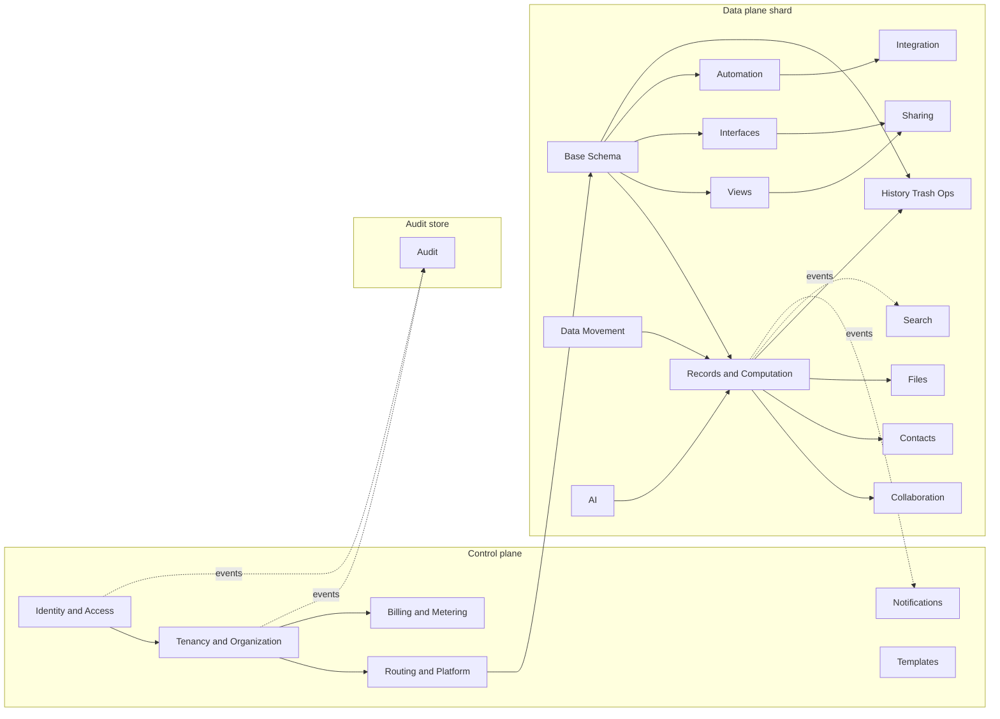
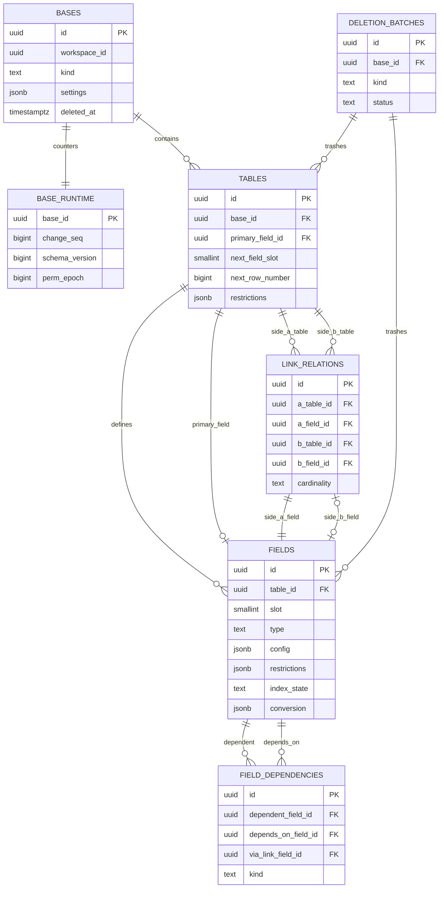
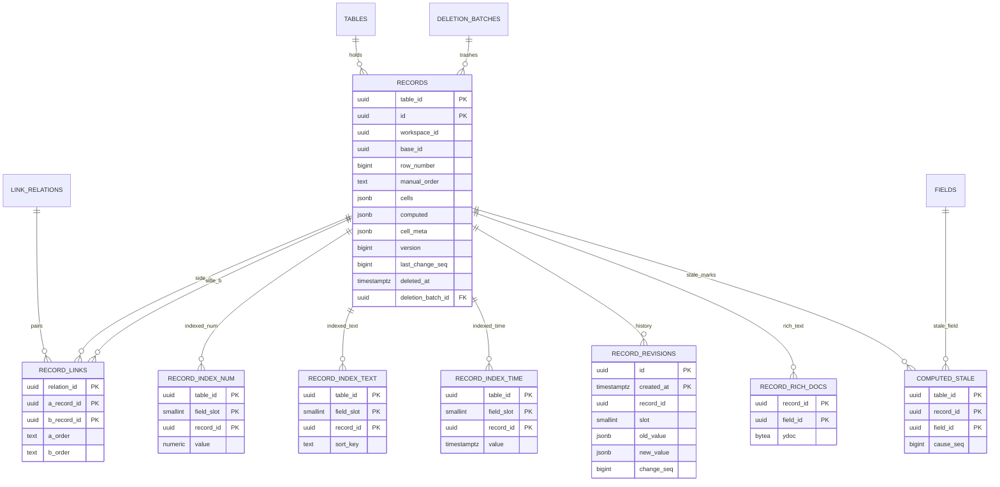
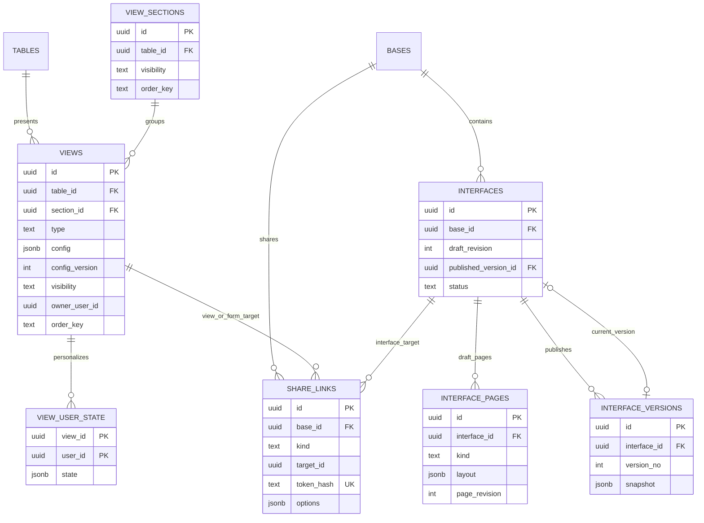
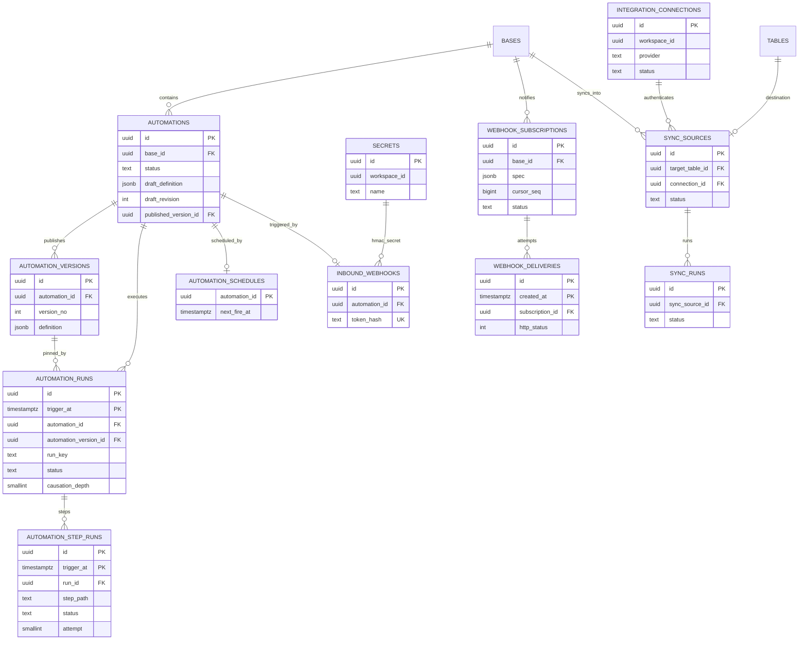
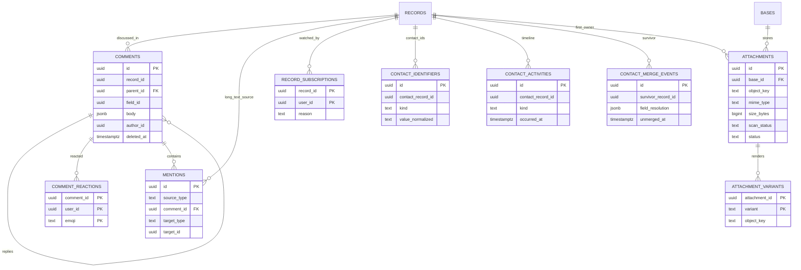
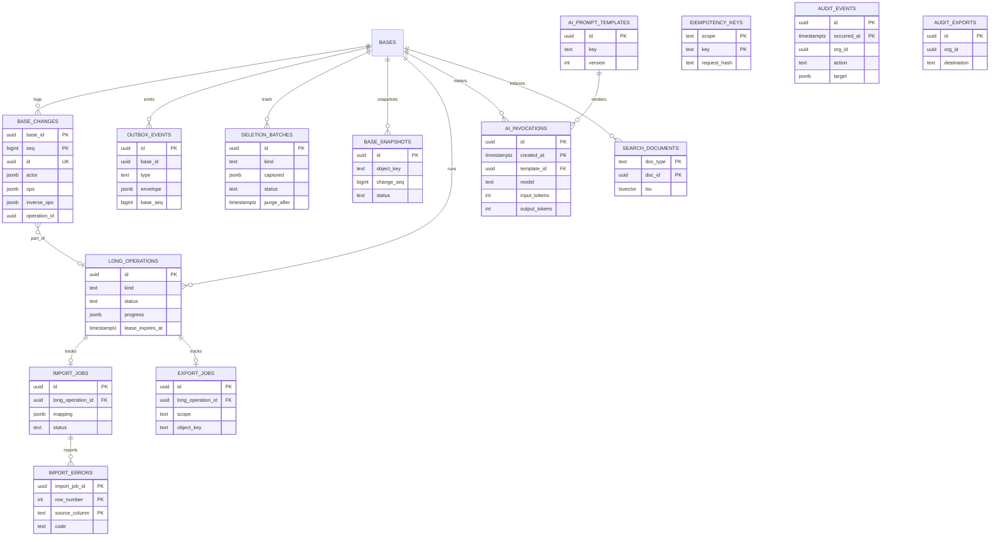

# 02 — Domain Model & Entity-Relationship Design

> **Sections covered:** §3 Domain Model (every entity: purpose, PK, FKs, attributes, relationships, lifecycle, ownership, permissions, audit, soft delete, versioning — grouped by bounded context) · §4 ERDs (Mermaid) and aggregate boundaries.
>
> **Status:** Proposed · **Owner:** Platform Architecture · **Date:** 2026-10-03 · Conforms to [`00-canonical-decisions.md`](./00-canonical-decisions.md). Physical DDL is normative in [`05-sql-schema.md`](./05-sql-schema.md); column inventory in [`32-table-and-object-inventory.md`](./32-table-and-object-inventory.md). This document is the **logical** model: where it names a column it states intent; if `05` spells it differently, `05` wins on spelling, this document on meaning.

---

## Table of contents

1. [Modeling conventions](#1-modeling-conventions)
2. [Bounded context map](#2-bounded-context-map)
3. [Domain model by bounded context](#3-domain-model-by-bounded-context)
   - 3.1 [Identity & Access](#31-identity--access-context-control-plane)
   - 3.2 [Tenancy & Organization](#32-tenancy--organization-context-control-plane)
   - 3.3 [Routing & Platform](#33-routing--platform-context-control-plane)
   - 3.4 [Billing & Metering](#34-billing--metering-context-control-plane)
   - 3.5 [Base Schema](#35-base-schema-context-data-plane)
   - 3.6 [Records & Computation](#36-records--computation-context-data-plane)
   - 3.7 [Views](#37-views-context-data-plane)
   - 3.8 [Interfaces](#38-interfaces-context-data-plane)
   - 3.9 [Automation](#39-automation-context-data-plane)
   - 3.10 [Integration & Developer Platform](#310-integration--developer-platform-context)
   - 3.11 [Collaboration](#311-collaboration-context-data-plane)
   - 3.12 [Contacts](#312-contacts-context-data-plane)
   - 3.13 [Files](#313-files-context-data-plane)
   - 3.14 [Sharing](#314-sharing-context-data-plane)
   - 3.15 [Notifications](#315-notifications-context-control-plane)
   - 3.16 [History, Trash & Operations](#316-history-trash--operations-context-data-plane)
   - 3.17 [Data Movement (Import / Export / Sync)](#317-data-movement-context-data-plane)
   - 3.18 [AI](#318-ai-context-data-plane)
   - 3.19 [Search](#319-search-context)
   - 3.20 [Templates](#320-templates-context-control-plane)
   - 3.21 [Audit](#321-audit-context-audit-store)
   - 3.22 [Conceptual (non-table) domain objects](#322-conceptual-non-table-domain-objects)
4. [Entity-relationship diagrams](#4-entity-relationship-diagrams)
5. [Aggregate boundaries and consistency](#5-aggregate-boundaries-and-consistency)
6. [Proposed additions](#6-proposed-additions)

---

## 1. Modeling conventions

| Convention | Rule |
|---|---|
| Primary keys | `id uuid` (UUIDv7, app-generated) unless stated (association tables use composite PKs). Public form `<prefix>_<base62>` only at API/realtime boundary (spine §3). |
| Partitioned tables | Postgres requires the partition key in every unique constraint, so the *physical* PK of partitioned tables is composite (e.g., `records (table_id, id)`, `automation_runs (id, trigger_at)`); the *logical* identity is still `id`. |
| Tenant columns | Control-plane rows carry `org_id` where tenant-scoped; every data-plane row carries `workspace_id` (RLS key, D4) and usually `base_id`. |
| Foreign keys | **Physical FKs only inside one plane and one shard**, and only where they don't hurt hot paths (we do not FK `records.table_id` → `tables` on the hot partitioned table; integrity is enforced by the write path and nightly reconciliation — see [`04` §6.27](./04-database-architecture.md#627-cross-shard-and-cross-plane-concerns)). References across planes (e.g., `records.created_by` → `core.users`) are **logical FKs** (UUID, no constraint). Below, `→` marks a physical FK, `⇢` a logical one. |
| Soft delete | `deleted_at timestamptz` + `deletion_batch_id uuid` (→ `deletion_batches`) for user-restorable objects; purge after `TRASH_RETENTION`. |
| Versioning | Three flavors: (a) **row version** (`version`/`config_version`/`draft_revision` int, used for `If-Match`); (b) **immutable published versions** (`automation_versions`, `interface_versions`); (c) **history tables** (`record_revisions`, `base_changes`, audit). |
| Audit | "Audit: security" = written to `audit.audit_events` (via `tabula.audit.v1`); "Audit: change log" = covered by `base_changes` (+ `record_revisions` for cells). |
| Timestamps | `created_at`, `updated_at` (`timestamptz`, UTC) everywhere; actors `created_by`/`updated_by` (user uuid, null for non-user actors; actor detail in change log). |
| Order keys | Fractional index strings (`order_key text COLLATE "C"`). |
| Lifecycle notation | `state_a → state_b` transitions; terminal states in **bold**. |

---

## 2. Bounded context map



| Context | Plane | Upstream of | Relationship style |
|---|---|---|---|
| Identity & Access | control | everything | **Open host service**: `AuthContext`, `PermissionSnapshot` |
| Tenancy & Organization | control | Routing, Billing, data-plane contexts | Published language: org/workspace/grant events |
| Routing & Platform | control | all data-plane access | Shared kernel: `ShardResolver` |
| Billing & Metering | control | entitlement checks | Customer/supplier: consumes usage events, publishes entitlements |
| Base Schema | data | Records, Views, Interfaces, Automation, AI | Shared kernel inside a base: `SchemaSnapshot` |
| Records & Computation | data | Collaboration, Contacts, Files, History, Search | Core domain |
| Views / Interfaces | data | Sharing | Conformist to Schema; query AST shared with API |
| Automation / Integration | data | external systems | Anti-corruption layer for connectors |
| History, Trash & Ops | data | — | Supporting; uses `OpRegistry` port (inversion) |
| Audit | audit store | — | Downstream conformist to all |

---

## 3. Domain model by bounded context

Entity entries use this compact template:

> **`schema.table`** — *Domain name* · **PK** … · **FKs** …
> * **Purpose / attributes / relationships / lifecycle / ownership & permissions / audit · soft delete · versioning**

### 3.1 Identity & Access context (control plane)

**`core.users`** — *User* · **PK** `id` (`usr_`) · **FKs** none
* **Purpose:** global human identity; one per email address across all orgs.
* **Attributes:** `email citext UNIQUE`, `email_verified_at`, `name`, `avatar_url`, `locale`, `time_zone`, `status`, `last_login_at`, `is_staff boolean` (internal staff accounts, support tooling only).
* **Relationships:** 1→N `user_identities`, `user_mfa_factors`, `sessions`, `api_tokens`, `organization_members`, `team_members`, `notifications`; referenced logically by every `created_by/updated_by`, collaborator cells, grants.
* **Lifecycle:** `pending_verification → active → deactivated → active` (reactivation) → **`anonymized`** (GDPR erasure: email/name replaced with tombstone values; uuid kept so historical references resolve to "Deleted user").
* **Ownership & permissions:** the user owns their profile; org admins of a *managed* domain (verified `organization_domains`) can deactivate/claim; SCIM can update.
* **Audit:** security (`user.created/updated/deactivated`, email change, MFA changes). **Soft delete:** no; deactivation + anonymization instead. **Versioning:** `updated_at` only.

**`core.user_identities`** — *Login method* · **PK** `id` · **FKs** `user_id → users`
* **Purpose:** one row per way to log in: `password` (Argon2id hash, params), `google`, `microsoft`, `saml`, `oidc`; SCIM `external_id`.
* **Attributes:** `provider`, `provider_subject` (UNIQUE per provider), `password_hash`, `sso_connection_id ⇢ sso_connections`, `last_used_at`.
* **Lifecycle:** `linked → **unlinked**` (hard delete; last remaining identity cannot be removed).
* **Permissions:** user self-service; SSO identities managed by org. **Audit:** security. **Soft delete:** no. **Versioning:** none.

**`core.user_mfa_factors`** — *MFA factor* · **PK** `id` · **FKs** `user_id → users`
* **Purpose:** TOTP secret (envelope-encrypted), WebAuthn credential (public key, sign count, transports), recovery code set (hashed).
* **Lifecycle:** `pending (enrollment) → active → **revoked**`.
* **Audit:** security (`mfa.enrolled`, revocations). **Soft delete:** revoked rows retained 90 days for forensics then deleted. **Versioning:** WebAuthn `sign_count` monotonic.

**`core.user_preferences`** — *User preferences* · **PK** `user_id → users`
* **Purpose:** UI prefs (theme, density, date format, keyboard layout), not notification prefs. `prefs jsonb`, `version`.
* **Lifecycle:** created lazily. **Audit/Soft delete:** none. **Versioning:** `version` LWW.

**`core.sessions`** — *Session* · **PK** `id` · **FKs** `user_id → users`
* **Purpose:** opaque session token (hash stored, `sess:{tokenHash}` cache), device/UA, IP, `auth_method` (password/sso/oauth/webauthn), `mfa_level` (0/1/2), `org_scope` for SSO-enforced orgs, `expires_at` (idle 14 d, absolute 30 d; SSO orgs configurable), `last_seen_at` (coarse, updated ≤ 1/min).
* **Lifecycle:** `active → expired | **revoked**` (logout, password change, admin, SCIM deactivate).
* **Audit:** security (`session.created`, `session.revoked`). **Soft delete:** expired rows purged after 30 days. **Versioning:** none.

**`core.api_tokens`** — *API token (PAT / service-account token)* · **PK** `id` (`tok_`) · **FKs** `user_id → users` *or* `service_account_id → service_accounts`, `org_id → organizations`
* **Purpose:** programmatic access. `token_hash` (SHA-256), `prefix_hint` (first 4 chars for UI), `scopes text[]` (e.g., `records:read`, `records:write`, `schema:write`, `webhooks:manage`), `resource_restrictions jsonb` (`{workspaceIds?, baseIds?}`), `expires_at`, `last_used_at`, `last_used_ip`.
* **Lifecycle:** `active → expired | **revoked**`.
* **Permissions:** owner user; org admins can list/revoke org tokens; policy may restrict creation.
* **Audit:** security (`api_token.created/revoked`, first use from new IP). **Soft delete:** revoked retained 90 days. **Versioning:** none (immutable except status/last_used).

**`core.service_accounts`** — *Service account* · **PK** `id` (`svc_`) · **FKs** `org_id → organizations`, `created_by ⇢ users`
* **Purpose:** non-human principal for integrations; holds `access_grants` like a user; never logs in interactively.
* **Lifecycle:** `active → disabled → **deleted**` (hard delete revokes tokens/grants).
* **Permissions:** `org.manage`. **Audit:** security. **Soft delete:** disabled state is the reversible step. **Versioning:** `updated_at`.

**`core.oauth_clients`** — *OAuth client app* · **PK** `id` (`app_`) · **FKs** `org_id ⇢ organizations` (null for public marketplace apps), `owner_user_id ⇢ users`
* **Attributes:** `client_id`, `client_secret_hash` (confidential clients), `redirect_uris text[]`, `allowed_scopes`, `is_public` (PKCE-only), `status` (`draft/active/suspended`), branding.
* **Lifecycle:** `draft → active → suspended → **deleted**`. **Audit:** security. **Versioning:** `updated_at`.

**`core.oauth_grants`** — *OAuth consent + refresh family* · **PK** `id` · **FKs** `client_id → oauth_clients`, `user_id → users`
* **Purpose:** user consent (scopes, resource restrictions) + refresh-token family with rotation (`refresh_token_hash`, `family_id`, `rotated_at`); reuse detection revokes the family.
* **Lifecycle:** `active → **revoked**`. **Audit:** security (`grant.changed`). **Versioning:** rotation counter.

**`core.oauth_authorization_codes`** — *PKCE code* · **PK** `code_hash` · **FKs** `client_id`, `user_id`
* **Purpose:** short-lived (60 s) code with `code_challenge`, `redirect_uri`, scopes. **Lifecycle:** `issued → **redeemed** | **expired**` (single-use). Not audited individually.

**`core.sso_connections`** — *SSO connection* · **PK** `id` · **FKs** `org_id → organizations`
* **Attributes:** `protocol` (saml/oidc), `jackson_tenant`/`jackson_product` refs, IdP metadata hash, `default_role`, `jit_provisioning boolean`, `status`, `enforced_domains` (via `organization_domains`).
* **Lifecycle:** `draft → testing → active → disabled → **deleted**`. **Permissions:** `org.manage`. **Audit:** security. **Versioning:** `version` + `If-Match`.

**`core.scim_directories`** — *SCIM directory* · **PK** `id` · **FKs** `org_id → organizations`
* **Attributes:** `token_hash`, `status`, `last_sync_at`, `provider_hint` (okta/entra/…). **Lifecycle:** `active → **revoked**` (token rotation creates new row). **Audit:** security.

**`core.scim_group_mappings`** — *SCIM group ↔ team* · **PK** `id` · **FKs** `scim_directory_id → scim_directories`, `team_id → teams`
* **Attributes:** `external_group_id`, `display_name`. **Lifecycle:** created/deleted by SCIM `Groups`. **Audit:** security (team membership consequences).

### 3.2 Tenancy & Organization context (control plane)

**`core.organizations`** — *Organization (tenant root)* · **PK** `id` (`org_`) · **FKs** none
* **Purpose:** billing, policy, SSO and admin boundary.
* **Attributes:** `name`, `slug UNIQUE`, `kind` (`personal` | `team` | `enterprise`), `home_region` (data residency: `us`, `eu`), `status`, `settings jsonb`, `deletion_scheduled_at`.
* **Relationships:** 1→N workspaces, members, teams, domains, service accounts, SSO, SCIM, subscriptions, usage; `shards.dedicated_org_id`.
* **Lifecycle:** `active → suspended (billing/abuse) → active`; `active → pending_deletion (30 d) → **deleted**` (data purged, row anonymized).
* **Ownership & permissions:** at least one `owner` member required (invariant, enforced in tx).
* **Audit:** security (`organization.created/updated`). **Soft delete:** via `pending_deletion`. **Versioning:** `version` + `If-Match`.

**`core.organization_members`** — *Org membership* · **PK** (`org_id`, `user_id`) · **FKs** `org_id → organizations`, `user_id → users`
* **Attributes:** `role` (`owner|admin|billing_admin|member|guest`), `status` (`active|deactivated`), `source` (`invite|domain_join|sso_jit|scim`), `billable boolean` (seat counting), `joined_at`.
* **Lifecycle:** `invited (via invitations) → active → deactivated → **removed**` (row deleted, grants cascade-revoked by job).
* **Permissions:** `org.manage`; the last owner cannot be demoted/removed.
* **Audit:** security (`member.added/role_changed/removed`). **Soft delete:** deactivated state. **Versioning:** none.

**`core.organization_domains`** — *Verified domain* · **PK** `id` · **FKs** `org_id → organizations`
* **Attributes:** `domain UNIQUE (when verified)`, `verification_token`, `verified_at`, `sso_enforced boolean`, `auto_join_role`.
* **Lifecycle:** `pending → verified → **removed**`; re-verification yearly (DNS TXT check job). **Audit:** security.

**`core.organization_policies`** — *Org policy set* · **PK** `id` · **FKs** `org_id → organizations`
* **Purpose:** enterprise policy document: sharing restrictions (public links, external collaborators), AI policy, retention, IP allowlist, session limits, allowed integrations, export restrictions.
* **Attributes:** `policy jsonb` (typed `OrgPolicyV1`), `version int`, `effective_from`, `created_by`. One **current** row per org (`is_current`), previous versions retained.
* **Lifecycle:** append new version → previous `is_current=false`. **Audit:** security (diff stored). **Versioning:** immutable rows per version.

**`core.teams`** — *Team* · **PK** `id` (`tem_`) · **FKs** `org_id → organizations`
* **Attributes:** `name`, `description`, `source` (`manual|scim`), `scim_group_mapping_id`.
* **Lifecycle:** `active → **deleted**` (hard; grants revoked, `perm_epoch` bumped). **Audit:** security (`team.updated`). **Versioning:** `updated_at`.

**`core.team_members`** — *Team membership* · **PK** (`team_id`, `user_id`) · **FKs** → `teams`, → `users`
* **Lifecycle:** add/remove (set semantics). **Audit:** security.

**`core.workspaces`** — *Workspace* · **PK** `id` (`wsp_`) · **FKs** `org_id → organizations`
* **Attributes:** `name`, `icon`, `settings jsonb` (default sharing policy, who can create bases), `deleted_at`, `purge_after`.
* **Relationships:** 1→1 `workspace_directory`; 1→N bases (directory); grants (`access_grants` resource_type `workspace`).
* **Lifecycle:** `active → trashed → **purged**`; `trashed → active` (restore); moving shards is a directory state, not a workspace state.
* **Permissions:** `workspace.manage`. **Audit:** security (`workspace.*`). **Soft delete:** yes (`deleted_at`). **Versioning:** `version`.

**`core.access_grants`** — *Role grant* · **PK** `id` · **FKs** none physical across types; `resource_id ⇢ (org|workspace|base|interface)`, `principal_id ⇢ (user|team|service_account)`
* **Purpose:** the single table of additive role grants (D20).
* **Attributes:** `org_id`, `resource_type`, `resource_id`, `principal_type`, `principal_id`, `role` (validated per resource type: spine §9), `granted_by`, `source` (`invite|scim|inheritance_override|share_dialog`), `expires_at` (guest access, V1), `masked_at` (set when the resource is trashed; restore clears).
* **Constraints:** UNIQUE (`resource_type`, `resource_id`, `principal_type`, `principal_id`).
* **Lifecycle:** `active → masked → active`; `active → **revoked**` (hard delete + audit).
* **Side effects:** any change bumps `base_runtime.perm_epoch` for all affected bases (direct for base/interface grants; fan-out job for workspace/org/team changes).
* **Audit:** security (`grant.changed` with before/after). **Versioning:** none (audit is the history).

**`core.invitations`** — *Invitation* · **PK** `id` (`inv_`) · **FKs** `org_id → organizations`, `invited_by ⇢ users`
* **Attributes:** `email`, `resource_type/resource_id`, `role`, `token_hash`, `expires_at` (14 d), `status`, `accepted_by_user_id`.
* **Lifecycle:** `pending → **accepted** | **revoked** | **expired**`. **Permissions:** `base.manage_members` / `workspace.manage` / `org.manage` by resource. **Audit:** security (`invitation.created/accepted`).

**`core.support_access_grants`** — *Customer-approved staff access* · **PK** `id` · **FKs** `org_id → organizations`, `approved_by ⇢ users`, `staff_user_id ⇢ users`
* **Attributes:** `scope` (org/workspace/base ids), `access_level` (`read`|`read_write`), `reason`, `ticket_ref`, `starts_at`, `expires_at` (≤ 72 h).
* **Lifecycle:** `requested → approved → **expired** | **revoked**`. **Audit:** security (every staff request under the grant is audit-logged with `actor.type='system'`, `staff=true`).

### 3.3 Routing & Platform context (control plane)

**`core.shards`** — *Shard registry* · **PK** `id` (text, e.g., `dp-001`) · **FKs** `dedicated_org_id ⇢ organizations`
* **Attributes:** `region`, `dsn_secret_ref` (Secrets Manager ARN — never credentials), `replica_secret_refs`, `status` (`provisioning|active|draining|readonly|retired`), `capacity_weight`, `kms_key_arn` (dedicated), `pg_version`, `schema_migration_version`.
* **Lifecycle:** `provisioning → active → draining → **retired**`; `readonly` during incidents.
* **Permissions:** platform operators only (no customer API). **Audit:** ops audit. **Versioning:** `updated_at` + migration version.

**`core.workspace_directory`** — *Workspace routing entry* · **PK** `workspace_id → workspaces` · **FKs** `shard_id → shards`
* **Attributes:** `org_id`, `shard_id`, `region`, `status` (`active|migrating|trashed|purging`), `migration_epoch int`.
* **Lifecycle:** created with workspace; `active ⇄ migrating`; `trashed`; **deleted** after purge.
* **Invariant:** exactly one shard per workspace at any time; `migration_epoch` increments on each move (fencing token).
* **Audit:** ops audit for moves. **Versioning:** `migration_epoch`.

**`core.base_directory`** — *Base routing + global listing entry* · **PK** `base_id` · **FKs** `workspace_id → workspaces`
* **Attributes:** `org_id`, `workspace_id`, `name` (denormalized for home screen / admin inventory), `icon`, `color`, `kind` (`standard|contact_directory`), `status` (`active|trashed`), `last_activity_at` (coarse).
* **Relationships:** shard resolved via `workspace_directory` (bases follow their workspace).
* **Lifecycle:** mirrors `data.bases` via events (`base.created/updated/deleted/restored`); nightly reconciliation.
* **Audit:** none (projection). **Versioning:** `source_change_seq` guard (ignore stale events).

**`core.feature_flags`** — *Feature flag* · **PK** `key` · attributes `description`, `default`, `targeting jsonb` (org/user/percent/plan rules), `owner`, `expires_on`. Lifecycle `active → **archived**`. Audit: ops.

**`core.rate_limit_overrides`** — *Custom rate limit* · **PK** `id` · **FKs** `org_id ⇢`, `api_token_id ⇢` · attributes `scope`, `limits jsonb`, `expires_at`, `reason`. Lifecycle `active → **expired**`. Audit: ops.

### 3.4 Billing & Metering context (control plane)

**`core.plans`** — *Plan catalog entry* · **PK** `id` (text, e.g., `team_2026_10`) · **FKs** none
* **Attributes:** `name`, `tier` (`free|team|business|enterprise`), `limits jsonb` (spine §12 keys: `recordsPerBase`, `fieldsPerTable`, `tablesPerBase`, `attachmentBytesPerBase`, `maxFileBytes`, `automationRunsPerMonth`, `revisionRetentionDays`, `apiRps`, `aiCreditsPerMonth`), `features jsonb`, `stripe_price_ids`, `is_public`, `superseded_by`.
* **Lifecycle:** `draft → active → **retired**` (existing subscribers grandfathered). **Versioning:** new plan id per pricing change (immutable).

**`core.subscriptions`** — *Subscription* · **PK** `id` · **FKs** `org_id → organizations`, `plan_id → plans`
* **Attributes:** `status` (`trialing|active|past_due|canceled|incomplete`), `seats_purchased`, `seats_billable` (computed), `current_period_start/end`, `stripe_customer_id`, `stripe_subscription_id`, `provider_updated_at`, `limit_overrides jsonb` (contract).
* **Lifecycle:** Stripe-driven state machine; at most one non-canceled subscription per org (partial unique index).
* **Audit:** security (`subscription.changed`). **Versioning:** `provider_updated_at` monotonic guard.

**`core.usage_counters`** — *Aggregated usage* · **PK** (`org_id`, `metric`, `period_start`) · attributes `value bigint`, `limit_value`, `threshold_notified jsonb` (50/80/100 %). Updated by the usage aggregator (idempotent by event id window). No soft delete; retained 25 months.

**`core.usage_events`** — *Raw metering event* · **PK** (`id`, `occurred_at`) · partitioned monthly · attributes `org_id`, `workspace_id`, `metric` (`automation_run`, `ai_credit`, `api_call_sampled`, `attachment_bytes`, `record_count_snapshot`), `quantity`, `source_event_id` (dedupe). Append-only; retention 13 months.

### 3.5 Base Schema context (data plane)

**`data.bases`** — *Base* · **PK** `id` (`bas_`) · **FKs** `workspace_id ⇢ core.workspaces`
* **Purpose:** container of a relational app; aggregate root of the schema.
* **Attributes:** `name`, `icon`, `color`, `kind` (`standard|contact_directory`), `settings jsonb` (default locale/timezone for formulas, `templateId`, `copyFrom`), `schema_version` (mirror of `base_runtime` for cold reads), `storage_bytes` (proposed column per 04), `deleted_at`, `deletion_batch_id`, `created_by`.
* **Relationships:** 1→1 `base_runtime`; 1→N tables, views (via tables), interfaces, automations, share links, webhooks, snapshots, sync sources, `base_changes`, `outbox_events`.
* **Lifecycle:** `active → trashed → **purged**`; `trashed → active`; `active → read_only` (over plan limit or shard migration fence, reflected by directory status, not a column).
* **Ownership & permissions:** grants at base level (`creator|editor|commenter|viewer|interface_only`) plus inheritance from workspace/org; `base.manage_schema` for structural changes.
* **Audit:** security (`base.created/deleted/restored/duplicated`, sharing changes); change log for schema. **Soft delete:** yes. **Versioning:** `schema_version` monotonic (in `base_runtime`).

**`data.base_runtime`** — *Base hot counters* · **PK** `base_id → bases`
* **Attributes:** `change_seq bigint` (last allocated per-base sequence), `schema_version bigint`, `perm_epoch bigint`, `record_count bigint` (proposed column in [`06`](./06-record-storage.md)), `updated_at`.
* **Purpose:** the **serialization point** for writes to a base: each write tx does `UPDATE base_runtime SET change_seq = change_seq + 1 … RETURNING` which yields a gap-free, commit-ordered seq (row lock held to commit). Separate from `bases` so the hot row stays tiny (fillfactor 50, HOT updates).
* **Lifecycle:** created/purged with the base. **Audit/Soft delete:** no. **Versioning:** it *is* the version vector of the base.

**`data.tables`** — *Table* · **PK** `id` (`tbl_`) · **FKs** `base_id → bases`
* **Attributes:** `name` (unique per base among live tables, case-insensitive), `description`, `primary_field_id` (→ `fields`, deferrable), `next_field_slot smallint`, `next_row_number bigint`, `record_count` (approx), `order_key`, `restrictions jsonb` (`{create: RoleOrList, delete: RoleOrList, rowPolicies?: RowPolicy[]}`), `config jsonb` (`sync`, `isSystem` for contact directory tables, `indexHints`), `deleted_at`, `deletion_batch_id`.
* **Relationships:** 1→N fields, records, views; side A/B of `link_relations`.
* **Lifecycle:** `active → trashed → **purged**`.
* **Invariants:** exactly one primary field, which must be of a "primary-eligible" type (not `link`, `attachment`, `button`, `checkbox`); `next_field_slot` ≤ 32,767; live fields ≤ 500.
* **Permissions:** `table.create/update/delete`; `restrictions` overlay for record create/delete.
* **Audit:** change log (`table.*`). **Soft delete:** yes. **Versioning:** through `schema_version`.

**`data.fields`** — *Field* · **PK** `id` (`fld_`) · **FKs** `table_id → tables`
* **Attributes:** `name` (unique per table among live fields), `description`, `slot smallint` (unique per table, never reused), `type` (spine §4 key), `config jsonb` (type-specific, validated by the type's Zod schema; includes `options[]` with `opt_` ids for selects, formula `expression`+`ast`, link `linkRelationId`/`inverseFieldId`), `restrictions jsonb` (`{editableBy?, hiddenFrom?(Ent)}`), `order_key` (default field order), `index_state` (`none|backfilling|ready`, sidecar), `conversion jsonb` (non-null while a type change is in progress, see [`06` §15](./06-record-storage.md)), `is_computed boolean` (derived), `deleted_at`, `deletion_batch_id`.
* **Relationships:** dependency edges in `field_dependencies`; `link_relations` sides; referenced by views/automations/interfaces/webhooks configs.
* **Lifecycle:** `active → converting → active`; `active → trashed → **purged**` (purge strips slot from `cells`/`computed`/`cell_meta`, sidecars).
* **Permissions:** `field.create/update/delete`; `restrictions` overlay.
* **Audit:** change log (`field.*`); type change also security-audited for Enterprise (data-loss potential). **Soft delete:** yes. **Versioning:** `schema_version`; formula `engineVersion` in config.

**`data.field_dependencies`** — *Dependency edge* · **PK** (`dependent_field_id`, `depends_on_field_id`, `via_link_field_id` nullable → use surrogate `id`) · **FKs** → `fields` (all three)
* **Purpose:** field-level DAG for the compute engine (D7). `via_link_field_id` set when the dependency crosses a link (lookup/rollup/count, or formula referencing a lookup).
* **Attributes:** `base_id`, `kind` (`same_record|via_link|ai_input`).
* **Invariants:** acyclic (checked by DFS on change), max chain depth `MAX_DEPENDENCY_CHAIN` = 32.
* **Lifecycle:** rebuilt for a field whenever its config changes (delete + insert in the schema tx). **Audit/Soft delete/Versioning:** derived data; none.

**`data.link_relations`** — *Link relation* · **PK** `id` · **FKs** `a_table_id → tables`, `a_field_id → fields`, `b_table_id → tables`, `b_field_id → fields` (nullable for one-way links into the contact directory if inverse disabled)
* **Attributes:** `base_id` (side A's base), `b_base_id` (≠ `base_id` only for contact directory links), `cardinality` (`a_many_b_many`, `a_one_b_many`, …; derived from both fields' `allowMultiple`), `is_self` (A table = B table), `deleted_at`, `deletion_batch_id`.
* **Relationships:** 1→N `record_links` (partition key `relation_id`).
* **Lifecycle:** created with the pair of link fields; soft-deleted with them; purge deletes pairs.
* **Invariants:** both fields reference this relation; cross-base relations only when `b` is the workspace contact directory.
* **Audit:** change log (`link_relation.created/deleted`). **Soft delete:** yes. **Versioning:** `schema_version`.

### 3.6 Records & Computation context (data plane)

**`data.records`** — *Record* · **PK** physical (`table_id`, `id`), logical `id` (`rec_`, or `ctc_` for contact directory records) · **FKs** `table_id ⇢ tables` (no physical FK on the hot partitioned table), `base_id`, `workspace_id`
* **Attributes:** see [`06` §11](./06-record-storage.md): `row_number`, `manual_order`, `cells jsonb`, `computed jsonb`, `cell_meta jsonb`, `version`, `created_*`, `created_via`, `updated_*`, `last_change_seq`, `deleted_at`, `deletion_batch_id`; proposed `external_ref` (sync/import key).
* **Relationships:** N↔N via `record_links`; 1→N comments, revisions, record subscriptions, mentions (as target), automation runs (as trigger record), AI invocations.
* **Lifecycle:**

```
 created ──► live ──(delete)──► trashed ──(retention)──► purged
              ▲ │                  │
              │ └─(edit)──┐        │
              └───────────┘◄─(restore)
```
  `live` has a sub-state per computed field: `fresh | stale` (row in `computed_stale`).
* **Ownership & permissions:** no per-record owner by default; `record.*` actions + restrictions; interface/row-policy scopes can make "records where `{Owner}` = current user" editable only.
* **Audit:** change log (`base_changes`) + cell revisions (`record_revisions`); Enterprise security audit for bulk delete/export. **Soft delete:** yes. **Versioning:** `version` (ETag), `cell_meta[slot].seq`.

**`data.record_links`** — *Link pair* · **PK** (`relation_id`, `a_record_id`, `b_record_id`) · **FKs** `relation_id ⇢ link_relations`, record ids ⇢ `records`
* **Attributes:** `workspace_id`, `a_order`, `b_order` (fractional keys: order of B within A's cell and vice versa), `created_at`, `created_seq`.
* **Lifecycle:** inserted/deleted only (no update except order keys). Record soft-delete removes its pairs and captures them in the deletion batch payload.
* **Invariants:** single-cardinality side has ≤ 1 pair per record (enforced in the write path with `SELECT … FOR UPDATE` on the record row, not a DB constraint, because cardinality can change).
* **Audit:** change log (`record.links_changed`). **Soft delete:** no (captured). **Versioning:** none.

**`data.record_index_num` / `record_index_text` / `record_index_time`** — *Typed index sidecars* · **PK** (`table_id`, `field_slot`, `record_id`) · **FKs** logical to `records`, `fields`
* **Purpose:** index-backed filter/sort for large tables (D6). Values: `numeric`, collated truncated `text` sort key, `timestamptz`.
* **Lifecycle:** maintained in the write tx for fields with `index_state='ready'`; backfilled by `maintenance` when enabled; dropped on field purge or when no saved view uses the field for 30 days.
* **Audit/Soft delete/Versioning:** derived; none.

**`data.record_rich_docs`** — *Collaborative rich text (V1+)* · **PK** (`record_id`, `field_id`) · attributes `ydoc bytea` (compacted Yjs state), `state_vector`, `updated_seq`, `plain_text_snapshot` (mirrored into `cells` for search/formulas on debounce). Lifecycle follows record; versioning via Yjs updates + periodic compaction.

**`data.record_revisions`** — *Cell revision* · **PK** (`id`, `created_at`) · partitioned monthly · **FKs** logical `record_id`, `field_id`, `change_seq`
* **Attributes:** `table_id`, `slot`, `old_value jsonb`, `new_value jsonb`, `actor_type`, `actor_id`, `via`, `change_seq`, `coalesce_key`.
* **Lifecycle:** append; coalesced within 60 s per (record, slot, actor); dropped by partition per plan retention (Enterprise configurable). **Audit:** this *is* the record-level history. **Versioning:** n/a.

**`data.computed_stale`** — *Deferred recompute marker* · **PK** (`table_id`, `record_id`, `field_id`)
* **Attributes:** `base_id`, `cause_seq` (seq of the change that invalidated it), `enqueued_at`, `attempts`.
* **Lifecycle:** inserted when fan-out > `COMPUTE_SYNC_FANOUT_LIMIT` (500); consumed by `compute` workers with `FOR UPDATE SKIP LOCKED`; deleted after recompute (only if `cause_seq` ≤ the seq the worker computed for). **Audit/Versioning:** none.

### 3.7 Views context (data plane)

**`data.views`** — *View* · **PK** `id` (`viw_`) · **FKs** `table_id → tables`, `section_id → view_sections`, `owner_user_id ⇢ users`
* **Attributes:** per [`10` §5.1](./10-view-engine.md): `type` (`grid|kanban|calendar|gallery|timeline|form|list`), `name`, `config jsonb` (typed `ViewConfig`, includes filter AST), `config_version`, `visibility` (`collaborative|personal|locked`), `locked_by/at`, `order_key`, `is_default`, `deleted_at`, `deletion_batch_id`.
* **Lifecycle:** `active ⇄ locked`; `active → trashed → **purged**`. Personal views purge when the owner loses base access for > 30 days.
* **Permissions:** `view.read`, `view.create_collaborative|personal`, `view.update`, `view.lock`. Personal views visible only to owner.
* **Audit:** change log (`view.*`); not security-audited (except locking in Enterprise). **Soft delete:** yes. **Versioning:** `config_version`.

**`data.view_sections`** — *View section (sidebar folder)* · **PK** `id` (`vsc_`) · **FKs** `table_id → tables`
* **Attributes:** `name`, `visibility` (`collaborative|personal`), `owner_user_id`, `order_key`, soft-delete columns. One level only. Lifecycle as views.

**`data.view_user_state`** — *Per-user view overlay* · **PK** (`view_id`, `user_id`)
* **Attributes:** `state jsonb` (`ViewUserState`: widths overrides, collapsed groups, calendar mode, last anchor), `state_version`. Not in change log, not undoable. Deleted with view or user removal.

### 3.8 Interfaces context (data plane)

**`data.interfaces`** — *Interface (app)* · **PK** `id` (`itf_`) · **FKs** `base_id → bases`
* **Attributes:** `name`, `icon`, `theme jsonb`, `draft_revision int`, `published_version_id → interface_versions` (nullable), `published_at`, `status` (`draft_only|published|unpublished`), `navigation jsonb` (page order/groups in draft), `deleted_at`, `deletion_batch_id`.
* **Relationships:** 1→N `interface_pages` (draft), 1→N `interface_versions`; grants via `core.access_grants` (resource_type `interface`).
* **Lifecycle:** `draft_only → published ⇄ unpublished`; `→ trashed → **purged**`.
* **Permissions:** `interface.read` (published only for `interface_user`), `interface.edit`, `interface.publish`.
* **Audit:** change log (`interface.*`), security audit on publish and sharing. **Soft delete:** yes. **Versioning:** `draft_revision` + immutable versions.

**`data.interface_pages`** — *Interface page (draft)* · **PK** `id` (`pag_`) · **FKs** `interface_id → interfaces`
* **Attributes:** `name`, `kind` (`dashboard|record_list|record_detail|form|overview|blank`), `layout jsonb` (element tree: `elm_` ids, bindings to table/view/field ids, per-element permissions & actions), `page_revision int`, `order_key`, soft delete.
* **Lifecycle:** draft edits; included in the next publish; soft delete with batch.
* **Versioning:** `page_revision` (`If-Match`), element-level merge.

**`data.interface_versions`** — *Published interface snapshot* · **PK** `id` · **FKs** `interface_id → interfaces`
* **Attributes:** `version_no int` (unique per interface), `snapshot jsonb` (all pages + navigation + compiled element permission summary), `schema_version` at publish, `published_by`, `published_at`, `release_note`.
* **Lifecycle:** immutable; retained (last 50 + any version referenced as current). **Audit:** security (`interface.published`).

### 3.9 Automation context (data plane)

**`data.automations`** — *Automation* · **PK** `id` (`aut_`) · **FKs** `base_id → bases`, `published_version_id → automation_versions`
* **Attributes:** per [`14`](./14-automation-engine.md): `name`, `status` (`draft|active|paused|disabled_by_system|deleted`), `draft_definition jsonb`, `draft_revision`, `settings` (concurrency, self-trigger suppression, `triggerOnBulk`), `owner_user_id`, `last_editor_id`, `section/order_key`, `disabled_reason`, soft-delete columns.
* **Lifecycle:** `draft → active ⇄ paused`; `active → disabled_by_system → active` (user re-enables after fix); any → trashed (`deleted`) → **purged**; restored as `paused`.
* **Permissions:** `automation.read/edit/run`.
* **Audit:** change log + security audit for publish/enable/disable. **Soft delete:** yes. **Versioning:** `draft_revision` + immutable versions.

**`data.automation_versions`** — *Published automation definition* · **PK** `id` (`atv_`) · **FKs** `automation_id → automations`
* **Attributes:** `version_no`, `definition jsonb` (trigger, conditions, steps tree with stable `step_id`s), `references jsonb` (table/field/view/connection/secret ids for impact analysis), `schema_version`, `published_by/at`.
* **Lifecycle:** immutable; a run pins one version. Retained while referenced by runs within retention.

**`data.automation_runs`** — *Run* · **PK** (`id`, `trigger_at`), partitioned monthly · **FKs** `automation_id`, `automation_version_id` (logical within partitioned table)
* **Attributes:** per [`14`](./14-automation-engine.md): `run_key` (idempotency: derived from `trigger_event_id`), `trigger_type`, `trigger_payload`, `status` (`queued|running|succeeded|failed|cancelled|timed_out`), `causation_depth`, `correlation_id`, timing, counters, error.
* **Lifecycle:** `queued → running → succeeded | failed | cancelled | timed_out`; reconciler re-enqueues stuck `queued/running` past lease.
* **Permissions:** `automation.read`. **Audit:** the run log itself; failures produce notifications. **Soft delete:** no (partition drop by retention). **Versioning:** n/a.

**`data.automation_step_runs`** — *Step execution* · **PK** (`id`, `trigger_at`) · **FKs** `run_id` (logical)
* **Attributes:** `step_id`, `step_path`, `iteration`, `action_type`, `status` (`pending|queued|running|retry_scheduled|waiting|succeeded|failed|skipped|cancelled|timed_out`), `attempt`, lease fields, `idempotency_key`, `input`, `output` (≤ 64 KB), `error`, `external_effect`.
* **Lifecycle:** as status list; at-least-once execution with idempotency keys passed to external calls.

**`data.automation_schedules`** — *Schedule* · **PK** `automation_id → automations` (one per scheduled trigger) · attributes `cron`/`interval`, `time_zone`, `next_fire_at`, `last_fired_at`, `claimed_by`, `claim_expires_at`. Lifecycle: created on publish of a scheduled trigger; removed on pause/delete. Claimed by `scheduler` with `SKIP LOCKED`.

**`data.inbound_webhooks`** — *Inbound webhook endpoint* · **PK** `id` (`ihk_`) · **FKs** `automation_id → automations`
* **Attributes:** `token_hash`, `hmac_secret_ref → secrets` (optional), `status` (`active|disabled`), `last_received_at`, `received_count`. Lifecycle: `active → disabled → **deleted**`; token rotation = new row. Audit: security on creation/rotation.

### 3.10 Integration & Developer Platform context

**`data.webhook_subscriptions`** — *Outbound webhook subscription* · **PK** `id` (`whk_`) · **FKs** `base_id → bases`, `created_by ⇢ users` / `oauth_client_id ⇢ core.oauth_clients`
* **Attributes:** `notification_url`, `spec jsonb` (`{dataTypes:[tableData|tableFields|tableMetadata], tableIds?, watchFieldIds?, viewId?, includeCellValues?}`), `cursor_seq bigint`, `secret_ciphertext` (HMAC key, envelope-encrypted), `status` (`active|failing|disabled|expired`), `failure_count`, `last_success_at`, `expires_at`.
* **Lifecycle:** `active → failing → disabled` (7 days of failures) ; `active → expired` (not refreshed) ; `→ **deleted**`.
* **Permissions:** creator's current permissions filter payloads. **Audit:** security (create/delete). **Soft delete:** no. **Versioning:** `cursor_seq` monotonic.

**`data.webhook_deliveries`** — *Delivery attempt* · **PK** (`id`, `created_at`) partitioned monthly · attributes `subscription_id`, `cursor_from/to`, `attempt`, `http_status`, `latency_ms`, `error`, `next_retry_at`. Retention 90 days.

**`data.integration_connections`** — *Connected external account* · **PK** `id` (`con_`) · **FKs** `workspace_id`, `owner_user_id ⇢ users`
* **Attributes:** `provider` (`slack|google|microsoft|salesforce|hubspot|http_basic|…`), `display_name`, `credentials_ciphertext` (envelope-encrypted with workspace DEK), `scopes`, `status` (`active|needs_reauth|revoked`), `shared_with` (`owner_only|base:<id>|workspace`), `token_expires_at`.
* **Lifecycle:** `active ⇄ needs_reauth`; `→ **revoked**`. **Audit:** security (`integration.*`). **Versioning:** `updated_at`; refresh tokens rotate.

**`data.secrets`** — *Automation/script secret* · **PK** `id` (`sct_`) · **FKs** `workspace_id`, `base_id` nullable
* **Attributes:** `name` (unique per scope), `value_ciphertext`, `dek_version`, `created_by`, `last_used_at`. Write-only via API (never returned). Lifecycle: `active → **deleted**`; rotation = update with new ciphertext (version counter). Audit: security.

**Developer-platform entities in the control plane** (`api_tokens`, `service_accounts`, `oauth_*`) are defined in §3.1.

### 3.11 Collaboration context (data plane)

**`data.comments`** — *Comment* · **PK** `id` (`cmt_`) · **FKs** `parent_id → comments` (thread), `record_id ⇢ records`, `table_id ⇢ tables`, `field_id ⇢ fields` (cell comment, optional), `author_id ⇢ users`
* **Attributes:** `base_id`, `body jsonb` (rich-text doc with mention nodes), `body_text` (plain, for search), `edited_at`, `resolved_at/by` (V1), `author_type` (`user|automation`), soft-delete columns.
* **Lifecycle:** `active → edited* → deleted (tombstone) → **purged**`. Thread depth: 1 (replies to root only).
* **Permissions:** `record.comment`; edit/delete own; base creators may delete any.
* **Audit:** change log entries (`comment.*`) for realtime; Enterprise security audit on deletion by others. **Soft delete:** yes. **Versioning:** `edited_at` (no edit history stored in MVP).

**`data.comment_reactions`** — *Reaction* · **PK** (`comment_id`, `user_id`, `emoji`) · set semantics; hard delete on removal; no audit.

**`data.mentions`** — *Mention* · **PK** `id` · **FKs** `comment_id → comments` (nullable), `record_id ⇢ records`, `field_id ⇢ fields` (for long-text mentions)
* **Attributes:** `source_type` (`comment|cell`), `target_type` (`user|team|record|contact`), `target_id`, `created_by`, `created_seq`.
* **Lifecycle:** rebuilt on each edit of the source (diff drives `mention.created` only for new targets). Deleted with source purge.

**`data.record_subscriptions`** — *Record watcher* · **PK** (`record_id`, `user_id`) · attributes `table_id`, `reason` (`commented|mentioned|assigned|manual`), `muted boolean`, `created_at`. Lifecycle: auto-created; user can mute/unwatch (hard delete).

### 3.12 Contacts context (data plane)

Contacts are **records** in the workspace's contact directory base (`bases.kind='contact_directory'`, system tables `Contacts` and `Companies` with `tables.config.isSystem=true` and a protected set of system fields: `name`, `emails`, `phones`, `company`, `avatar`, `owner`). The contact-specific tables are:

**Contact (record)** — *Contact* · **PK** `records.id` (public `ctc_`) — see `data.records`.
* **Lifecycle:** `live → merged (soft-deleted with `deletion_batch_id` of a merge batch, pointer `merged_into` in merge event) → (unmerge) live`; standard trash lifecycle otherwise.
* **Permissions:** directory is a base resource: workspace members get the workspace role on it by default; base-only collaborators get read access to contacts *linked from bases they can read* via projected fields only.

**`data.contact_identifiers`** — *Contact identifier* · **PK** `id` · **FKs** `contact_record_id ⇢ records`
* **Attributes:** `workspace_id`, `kind` (`email|phone|linkedin|x|domain|external`), `value_normalized`, `value_raw`, `is_primary`, `source` (`manual|import|sync:<id>|automation`), `verified_at`.
* **Constraints:** UNIQUE (`workspace_id`, `kind`, `value_normalized`) among live contacts (partial) — the dedup key.
* **Lifecycle:** maintained in the same tx as the contact's identifier fields; moved to survivor on merge (recorded in merge event).

**`data.contact_merge_events`** — *Merge event* · **PK** `id` · **FKs** `survivor_record_id ⇢ records`
* **Attributes:** `merged_record_ids uuid[]`, `field_resolution jsonb` (per field: chosen source and discarded values), `moved_links jsonb` (relation, counterpart, original side), `moved_identifiers`, `moved_activities`, `merged_by`, `merged_at`, `unmerged_at`, `deletion_batch_id`.
* **Lifecycle:** `merged → **unmerged**` (unmerge allowed while within `TRASH_RETENTION` and no later merge involves the survivor's moved data). **Audit:** security for Enterprise; change log always.

**`data.contact_activities`** — *Timeline item* · **PK** (`id`, `occurred_at`) (partitioning optional at scale; see [`12`](./12-contacts.md)) · **FKs** `contact_record_id ⇢ records`
* **Attributes:** `kind` (`email_sent|email_received|call|meeting|note|automation_action|external_sync|mention|record_linked`), `title`, `body jsonb`, `source_ref` (`{type, id}`: record, automation run, sync run, message id), `actor`, `occurred_at`.
* **Lifecycle:** append; editable for manual notes only; hard delete by author/admin. **Audit:** change log for manual edits.

### 3.13 Files context (data plane)

**`data.attachments`** — *Attachment* · **PK** `id` (`att_`) · **FKs** `base_id → bases`, `record_id ⇢ records` (first owner), `field_id ⇢ fields`
* **Attributes:** `workspace_id`, `object_key` (`{workspaceId}/{baseId}/{attachmentId}/original`), `filename`, `mime_type` (sniffed + declared), `size_bytes`, `checksum_sha256`, `width/height/duration`, `scan_status` (`pending|clean|infected|error|skipped_too_large`), `status` (`uploading|quarantined|ready|rejected|orphaned|purged`), `uploaded_by`, `upload_session` (multipart id), `source` (`upload|url|form|automation|import`), `created_at`.
* **Lifecycle:** `uploading → quarantined → (scan) → ready | **rejected**`; `ready → orphaned (no references) → **purged**` after retention.
* **Permissions:** inherit from referencing record(s). **Audit:** security for infected files. **Soft delete:** orphan state. **Versioning:** immutable bytes (edits create a new attachment).

**`data.attachment_variants`** — *Derived rendition* · **PK** (`attachment_id`, `variant`) · attributes `variant` (`thumb_small|thumb_large|preview_pdf|poster|...`), `object_key`, `mime`, `width/height`, `size_bytes`, `status`. Lifecycle tied to attachment; regenerable.

### 3.14 Sharing context (data plane)

**`data.share_links`** — *Share link* · **PK** `id` (`shr_`) · **FKs** `base_id → bases`; `target_id` ⇢ view/interface/base
* **Attributes:** `kind` (`view|form|interface|base`), `token_hash`, `options jsonb` (`allowCopy`, `showAllFields`, `passwordHash`, `allowedEmailDomains`, `embedAllowed`, `showHistory`), `created_by`, `expires_at`, `revoked_at`, `last_accessed_at`.
* **Relationships:** routed via `core.public_link_directory` (proposed in [`04`](./04-database-architecture.md#629-proposed-additions)).
* **Lifecycle:** `active → **revoked**` | **expired**; dormant while target is trashed.
* **Permissions:** `base.share`; org policy can forbid kinds. **Audit:** security (`share_link.created/revoked`; sampled access). **Versioning:** options LWW (`updated_at`).

### 3.15 Notifications context (control plane)

**`core.notifications`** — *Notification* · **PK** (`id`, `created_at`), partitioned monthly · **FKs** `user_id → users`
* **Attributes:** `org_id`, `workspace_id`, `base_id` (for deep links; logical), `category` (`mention|comment|assignment|automation_failure|invite|export_ready|import_done|billing|system`), `payload jsonb` (public IDs + rendered snippet), `group_key` (collapse similar), `read_at`, `archived_at`, `source_event_id` (dedupe).
* **Lifecycle:** `unread → read → archived`; dropped by partition after 90 days.
* **Permissions:** recipient only; access re-checked at render. **Audit:** none. **Versioning:** none.

**`core.notification_preferences`** — *Preference* · **PK** (`user_id`, `scope_type`, `scope_id`, `category`, `channel`) · attributes `setting` (`instant|digest_hourly|digest_daily|off`). Defaults implied when absent.

**`core.notification_deliveries`** — *Delivery attempt* · **PK** `id` · **FKs** `notification_id` (logical), `user_id` · attributes `channel` (`email|push`), `provider_message_id`, `status` (`queued|sent|delivered|bounced|complained|failed|suppressed`), timestamps. Retention 30 days.

**`core.email_suppressions`** — *Suppressed address* · **PK** `email` · attributes `reason` (`hard_bounce|complaint|manual`), `source`, `created_at`. Checked before every send; removal by support only (audited).

### 3.16 History, Trash & Operations context (data plane)

**`data.base_changes`** — *Change set (per-base ordered log)* · **PK** (`base_id`, `seq`) (`chg_` public id is derived from a uuid column `id`) · partitioned daily
* **Attributes:** `id`, `seq`, `workspace_id`, `actor jsonb` (`{type, id, via, sessionId?}`), `client_op_id`, `correlation_id`, `causation_depth`, `operation_id` (`lop` when part of a long operation/import), `ops jsonb` (forward ops), `inverse_ops jsonb`, `affected jsonb` (`{tableIds, recordIds(capped), fieldIds}` for routing/filtering), `undone_by_seq`, `created_at`.
* **Lifecycle:** append-only; partitions dropped after `BASE_CHANGES_RETENTION` (30 d).
* **Purpose:** realtime catch-up, webhook cursors, undo/redo, sync from other bases. **Not** system of record (D26).
* **Audit:** it is the change audit within retention. **Versioning:** `seq` is the base's logical clock.

**`data.outbox_events`** — *Domain event outbox* · **PK** `id` (`evt_`) · partitioned daily
* **Attributes:** `workspace_id`, `base_id`, `type`, `schema_version`, `envelope jsonb` (spine §6), `base_seq`, `created_at`.
* **Lifecycle:** insert-only; consumed by `relay` via logical decoding (no polling, no update); partitions dropped after 3 days (Kafka retention is the replay window).

**`data.idempotency_keys`** — *Idempotency record* · **PK** (`scope`, `key`) where scope = token/user + route · attributes `request_hash`, `status` (`in_progress|completed`), `response_status`, `response_body` (≤ 256 KB), `resource_ref`, `expires_at` (24 h). Fast path in Redis `idem:{scope}:{key}`.

**`data.deletion_batches`** — *Trash entry* · **PK** `id` · **FKs** `base_id → bases`
* **Attributes:** `workspace_id`, `kind` (`records|field|table|view|interface|automation|base|merge`), `root_object_id`, `object_counts jsonb`, `captured jsonb` (link pairs and other side data ≤ 1 MB) or `captured_object_key` (S3 when larger), `actor`, `deleted_at`, `purge_after`, `status` (`trashed|restoring|restored|purging|purged`), `change_seq`.
* **Lifecycle:** `trashed → restored` | `trashed → purging → **purged**`.
* **Permissions:** restore: same permission as delete; purge: base creator/workspace owner. **Audit:** security for permanent deletes (`trash.purged`).

**`data.base_snapshots`** — *Base snapshot* · **PK** `id` (`snp_`) · **FKs** `base_id → bases`
* **Attributes:** `kind` (`manual|scheduled|pre_restore|template`), `object_key` (`tabula-snapshots`), `schema_version`, `change_seq` at snapshot, `size_bytes`, `record_count`, `status` (`creating|ready|failed|expired`), `created_by`, `expires_at`.
* **Lifecycle:** `creating → ready → **expired**`; restore creates a **new base** from the snapshot (never overwrites in place). **Audit:** security (`snapshot.created/restored`).

**`data.long_operations`** — *Long operation* · **PK** `id` (`lop_`) · **FKs** `base_id → bases`
* **Attributes:** `kind` (`field.convert|base.duplicate|table.duplicate|records.bulk_update|records.bulk_delete|import|export|snapshot.restore|reindex`), `params jsonb`, `status` (`queued|running|succeeded|failed|cancelled`), `progress jsonb` (`{done,total,phase}`), `lease_owner`, `lease_expires_at`, `result jsonb`, `error`, `requested_by`, timestamps.
* **Lifecycle:** reconciler-driven (re-enqueue on lease expiry). **Audit:** change log for effects; security audit for bulk deletes. **Versioning:** none.

### 3.17 Data Movement context (data plane)

**`data.import_jobs`** — *Import job* · **PK** `id` (`imp_`) · **FKs** `base_id → bases`, `target_table_id ⇢ tables`, `long_operation_id → long_operations`
* **Attributes:** `source_kind` (`csv|xlsx|json|app_export`), `file_attachment_id` / `object_key`, `analysis jsonb` (columns, detected types, sample), `mapping jsonb` (column → field id or "create field of type X", merge key), `mode` (`new_table|append|merge`), `options` (date format, delimiter, encoding, header row), `status` (`draft|analyzing|ready|running|completed|completed_with_errors|failed|cancelled|undone`), counters (`rows_total/ok/failed`), `requested_by`.
* **Lifecycle:** `draft → analyzing → ready → running → completed* | failed | cancelled`; `completed → **undone**`.

**`data.import_errors`** — *Row error* · **PK** (`import_job_id`, `row_number`, `column`) · attributes `code`, `message`, `raw_value`. Cap 10,000 per job; deleted with job (90 d).

**`data.export_jobs`** — *Export job* · **PK** `id` (`exp_`) · **FKs** `base_id`, `long_operation_id` · attributes `scope` (`view|table|base`), `target_id`, `format`, `options`, `status`, `object_key`, `expires_at` (7 d), `row_count`, `requested_by`. Lifecycle `queued → running → **ready** → **expired**`. Security-audited (`export.data`).

**`data.sync_sources`** — *Sync source* · **PK** `id` · **FKs** `base_id`, `target_table_id → tables`, `connection_id ⇢ integration_connections`
* **Attributes:** `source_kind` (`tabula_view|google_sheets|salesforce|jira|csv_url|…`), `source_spec jsonb`, `field_mapping jsonb`, `schedule` (`manual|5m|1h|1d`), `watermark jsonb`, `status` (`active|paused|error|needs_reauth`), `last_run_id`, `options` (delete behavior: `mark|delete|keep`).
* **Lifecycle:** `active ⇄ paused`, `→ error`, `→ **deleted**`. **Audit:** security (create/delete, cross-base source access).

**`data.sync_runs`** — *Sync run* · **PK** `id` · **FKs** `sync_source_id → sync_sources` · attributes `status`, `started_at/finished_at`, `stats jsonb` (created/updated/deleted/unchanged), `error`, `watermark_from/to`. Retention 90 days.

### 3.18 AI context (data plane)

**`data.ai_prompt_templates`** — *Prompt template* · **PK** `id` · **FKs** `workspace_id` (nullable for system templates), `base_id` nullable
* **Attributes:** `key` (system: `formula.suggest`, `field.generate`, `record.summarize`, `base.generate`, …), `version int` (unique per key+scope), `system_prompt`, `user_template` (with typed placeholders `{{field:fld_…}}`), `output_schema jsonb`, `model_policy` (`default|fast|deep`), `status` (`draft|active|retired`), `created_by`.
* **Lifecycle:** versions immutable once active. **Versioning:** `version`.

**`data.ai_invocations`** — *AI invocation* · **PK** (`id`, `created_at`) (`aij_`), partitioned monthly
* **Attributes:** `workspace_id`, `base_id`, `actor`, `feature` (`ai_field|formula_assist|summarize|base_generate|automation_step|agent`), `template_id/version`, `provider`, `model`, `input_hash`, `input_tokens`, `output_tokens`, `cached boolean`, `cost_micros`, `latency_ms`, `status` (`ok|error|blocked_policy|rate_limited`), `error_code`, `record_id`/`field_id` (optional), `prompt_body`/`response_body` (only if org policy allows; 30 d).
* **Lifecycle:** append; partition retention 13 months (metadata). **Audit:** this is the AI execution log; metering via `usage_events`.

### 3.19 Search context

**`data.search_documents`** — *Search document (MVP)* · **PK** (`doc_type`, `doc_id`) · per [`18`](./18-search-attachments-collaboration.md)
* **Attributes:** `workspace_id`, `base_id`, `table_id`, `doc_type` (`record|table|field|base|contact|interface`), `title`, `body`, `tsv tsvector` (generated), trigram index on `title`, `updated_seq`, `restricted_field_text` (Enterprise).
* **Lifecycle:** derived; upserted by the indexer; deleted on purge or trash. V1: OpenSearch indices replace it (same document model).

### 3.20 Templates context (control plane)

**`core.templates`** — *Template* · **PK** `id` (`tpl_`) · **FKs** `org_id ⇢ organizations` (null for public), `source_base_id ⇢ data.bases` (logical, cross-plane)
* **Attributes:** `name`, `slug`, `category`, `description`, `visibility` (`public|org`), `snapshot_object_key`, `schema_version`, `preview_images`, `status` (`draft|published|unpublished`), `published_by/at`, `install_count`.
* **Lifecycle:** `draft → published ⇄ unpublished`. **Audit:** security for org templates. **Versioning:** republish replaces snapshot key (old kept via S3 versioning).

### 3.21 Audit context (audit store)

**`audit.audit_events`** — *Audit event* · **PK** (`id`, `occurred_at`), partitioned monthly
* **Attributes:** `org_id`, `workspace_id`, `base_id`, `actor jsonb` (type, id, ip, user agent, session id, staff flag), `action` (dotted verb, e.g., `grant.changed`, `export.data`, `session.created`), `target jsonb` (`{type, id}`), `outcome` (`success|denied|error`), `details jsonb` (before/after for config changes, redacted), `request_id`, `trace_id`.
* **Lifecycle:** append-only, never updated; hot 90 days → Parquet in `tabula-audit-archive` (object lock for Enterprise) up to 7 years.
* **Permissions:** `audit.read` (org admins); staff access via support grants only. **Soft delete:** never (legal hold supported).

**`audit.audit_exports`** — *SIEM export config* · **PK** `id` · **FKs** `org_id` (logical) · attributes `destination` (`s3|splunk_hec|datadog|webhook`), `config_ciphertext`, `filter`, `checkpoint` (last exported event id/time), `status`. Lifecycle `active ⇄ paused → **deleted**`. Security-audited.

### 3.22 Conceptual (non-table) domain objects

These are first-class in code (types in `packages/*`) but are not tables; they are embedded in JSONB or derived.

| Object | Lives in | Purpose & key shape | Lifecycle / versioning |
|---|---|---|---|
| **Cell value** | `records.cells[slot]` | Canonical JSON per field type (spine §4); empty ⇒ absent | Versioned by `cell_meta[slot].seq` |
| **CellMeta** | `records.cell_meta[slot]` | `{q: seq, b: userUuid, t: epochSeconds}` LWW metadata | Updated with each cell write |
| **Select option** | `fields.config.options[]` | `{id: "opt_…", name, color, order_key}` | Rename O(1); deletion leaves dangling ids treated as empty |
| **FieldTypeDefinition** | `packages/fields` | Plugin: `codec`, `normalize`, `validate`, `convertFrom`, `operators`, `sortKey`, `formulaType`, `storage` | Code-versioned |
| **FormulaAst** | `fields.config.ast` | Typed AST with `{fld_…}` references; `engineVersion` | Re-derived on field rename (display only) |
| **FilterNode (Query AST)** | view config, API, automation conditions, interface element filters | `{and|or: FilterNode[]}` or `{field, op, value}`; one definition in [`11`](./11-filter-sort-group.md) | Format `schemaVersion` |
| **SchemaSnapshot** | Redis `schema:{baseId}:{schemaVersion}` | Immutable compiled schema: tables, fields (with slots/types), relations, dependency topo-order, views | Keyed by `schema_version` |
| **PermissionSnapshot** | Redis `perm:{principalId}:{baseId}:{permEpoch}` | `{baseRole, actions:Set, tableRestrictions, fieldRestrictions, rowPolicies, interfaceScopes, orgPolicy}` | Keyed by `perm_epoch` |
| **Operation (Op)** | `base_changes.ops/inverse_ops`, WS protocol | `setCell`, `addToSet`, `removeFromSet`, `addLinks`, `removeLinks`, `createRecords`, `deleteRecords`, `restoreBatch`, `moveRecord`, schema ops | Protocol-versioned ([`16`](./16-realtime.md)) |
| **Dependency graph** | derived from `field_dependencies` | Topologically sorted per base; per-table recompute plans | Rebuilt per `schema_version` |
| **Interface element** | `interface_pages.layout` | `{id:"elm_…", type, binding:{tableId, viewId?, filter?}, props, permissions, actions}` | Draft vs published versions |
| **Automation trigger / step** | `automation_versions.definition` | `{trigger:{type, config}, conditions, steps:[{id, type, config, onError}]}` | Immutable per version |
| **Presence** | Redis `presence:{baseId}` | `{userId, connId, viewId, selection, editingCell, color}` TTL `WS_HEARTBEAT×2` | Ephemeral |
| **Undo stack** | client memory | `[{changeId, label}]` | Per tab |
| **Contact directory** | `bases.kind='contact_directory'` | One per workspace; system tables & fields | Created with workspace |
| **Org policy** | `organization_policies.policy` | `OrgPolicyV1` | Immutable versions |
| **Entitlements** | derived from plan + overrides | `{limits, features}` | Cached 60 s |

---

## 4. Entity-relationship diagrams

Conventions: only key and relationship-relevant attributes are shown; full columns in [`05`](./05-sql-schema.md). Relationships drawn across planes (control ↔ data) are **logical** (no physical FK). Entity names are the table names without schema prefix.

### 4.1 Identity & tenancy (control plane)

```mermaid
erDiagram
  ORGANIZATIONS ||--o{ ORGANIZATION_MEMBERS : has
  USERS ||--o{ ORGANIZATION_MEMBERS : joins
  ORGANIZATIONS ||--o{ ORGANIZATION_DOMAINS : verifies
  ORGANIZATIONS ||--o{ ORGANIZATION_POLICIES : governs
  ORGANIZATIONS ||--o{ TEAMS : groups
  TEAMS ||--o{ TEAM_MEMBERS : contains
  USERS ||--o{ TEAM_MEMBERS : belongs
  ORGANIZATIONS ||--o{ WORKSPACES : owns
  WORKSPACES ||--|| WORKSPACE_DIRECTORY : routed_by
  SHARDS ||--o{ WORKSPACE_DIRECTORY : hosts
  WORKSPACES ||--o{ BASE_DIRECTORY : lists
  ORGANIZATIONS ||--o{ ACCESS_GRANTS : scopes
  ORGANIZATIONS ||--o{ INVITATIONS : issues
  ORGANIZATIONS ||--o{ SERVICE_ACCOUNTS : owns
  USERS ||--o{ USER_IDENTITIES : authenticates
  USERS ||--o{ USER_MFA_FACTORS : secures
  USERS ||--o{ SESSIONS : opens
  USERS ||--o{ API_TOKENS : creates
  SERVICE_ACCOUNTS ||--o{ API_TOKENS : uses
  OAUTH_CLIENTS ||--o{ OAUTH_GRANTS : receives
  USERS ||--o{ OAUTH_GRANTS : consents
  OAUTH_CLIENTS ||--o{ OAUTH_AUTHORIZATION_CODES : issues
  ORGANIZATIONS ||--o{ SSO_CONNECTIONS : configures
  ORGANIZATIONS ||--o{ SCIM_DIRECTORIES : provisions
  SCIM_DIRECTORIES ||--o{ SCIM_GROUP_MAPPINGS : maps
  TEAMS ||--o| SCIM_GROUP_MAPPINGS : mapped_from
  ORGANIZATIONS ||--o{ SUBSCRIPTIONS : pays
  PLANS ||--o{ SUBSCRIPTIONS : priced_by
  ORGANIZATIONS ||--o{ USAGE_COUNTERS : meters
  ORGANIZATIONS ||--o{ SUPPORT_ACCESS_GRANTS : approves

  ORGANIZATIONS {
    uuid id PK
    text slug UK
    text kind
    text home_region
    text status
  }
  USERS {
    uuid id PK
    citext email UK
    text status
  }
  ORGANIZATION_MEMBERS {
    uuid org_id PK
    uuid user_id PK
    text role
    bool billable
  }
  WORKSPACES {
    uuid id PK
    uuid org_id FK
    timestamptz deleted_at
  }
  WORKSPACE_DIRECTORY {
    uuid workspace_id PK
    text shard_id FK
    text status
    int migration_epoch
  }
  BASE_DIRECTORY {
    uuid base_id PK
    uuid workspace_id FK
    text kind
    text status
  }
  SHARDS {
    text id PK
    text region
    text status
    uuid dedicated_org_id
  }
  ACCESS_GRANTS {
    uuid id PK
    text resource_type
    uuid resource_id
    text principal_type
    uuid principal_id
    text role
  }
  API_TOKENS {
    uuid id PK
    text token_hash UK
    jsonb scopes
    jsonb resource_restrictions
  }
  SESSIONS {
    uuid id PK
    uuid user_id FK
    text token_hash UK
    int mfa_level
  }
  SUBSCRIPTIONS {
    uuid id PK
    uuid org_id FK
    text plan_id FK
    text status
  }
```



### 4.2 Schema core (data plane)



### 4.3 Records & links (data plane)



### 4.4 Views & interfaces (data plane)



### 4.5 Automations & integrations (data plane)



### 4.6 Collaboration, contacts & files (data plane)



### 4.7 History, operations, data movement & AI (data plane) + audit store



---

## 5. Aggregate boundaries and consistency

### 5.1 Aggregate roots

| Aggregate root | Members (inside the boundary) | Invariants guarded | Consistency mechanism | Transaction scope |
|---|---|---|---|---|
| **Organization** (core) | members, domains, current policy | ≥ 1 owner; domain unique when verified; one current policy | Row lock on `organizations` for owner-changing ops; `version` for settings | Control-plane tx |
| **User** (core) | identities, MFA factors, preferences, sessions | ≥ 1 identity; email unique | Unique constraints; row lock on user for identity changes | Control-plane tx |
| **Team** (core) | team_members | SCIM-sourced teams edited only by SCIM | Source check | Control-plane tx |
| **Workspace** (core) | directory entry, grants on it | exactly one shard; status transitions | `migration_epoch` fencing | Control-plane tx |
| **AccessGrant** (core) | — (each grant row is its own small aggregate) | role valid for resource; unique (resource, principal) | Upsert + `perm_epoch` bump event | Control-plane tx, then async epoch bump on shard |
| **Subscription** (core) | — | one live subscription per org | Partial unique index; Stripe event ordering guard | Control-plane tx |
| **Base (schema)** (data) | base_runtime, tables, fields, field_dependencies, link_relations, views (config), view_sections | names unique; slots monotonic & unique; single primary field; acyclic dependency graph (depth ≤ 32); link sides consistent; ≤ 500 fields/tables | **`base_runtime` row lock** + `schema_version` check (the aggregate version); writers validate against a `SchemaSnapshot` then assert version in-tx | Shard tx |
| **Record** (data) | cells, computed, cell_meta for one record | values valid per field type; empty ⇒ absent; computed = f(inputs) for same-record formulas | Row lock (`FOR UPDATE`) on record; `version` for `If-Match`; `cell_meta.seq` LWW | Shard tx (shares the base's `change_seq` allocation) |
| **LinkRelation pairs** (data) | record_links of one relation | cardinality (single side ≤ 1); both records live; same workspace | Lock the edited side's records (sorted by id to avoid deadlocks), set-semantic insert/delete | **Same tx as the record writes** — links span two Record aggregates, so this is a deliberate *multi-aggregate* transaction, cheap because both live on one shard |
| **View** (data) | view_user_state is *outside* (per-user, eventually consistent) | personal ⇒ owner; one default view per table; locked ⇒ creator-only edits | `config_version` with top-level key merge | Shard tx |
| **Interface** (data) | pages (draft), versions | published version immutable; element ids unique per interface | `draft_revision`/`page_revision`; publish is single tx copying drafts to a version | Shard tx |
| **Automation** (data) | versions, schedule, inbound webhook | published version immutable; schedule exists iff active scheduled trigger | `draft_revision`; status transitions in tx | Shard tx |
| **AutomationRun** (data) | step runs | one run per (automation, run_key); steps idempotent | Unique `run_key`; leases + reconciler | Shard tx per step transition |
| **Comment** (data) | reactions, mentions | thread depth 1; mentions reflect body | Delete+insert mentions in same tx | Shard tx |
| **Contact** (data, a Record) | identifiers, activities (append-only, outside), merge events | identifier uniqueness per workspace among live contacts | Partial unique index + ordered row locks for merges | Shard tx (cross-base: directory base + linking bases share a shard) |
| **Attachment** (data) | variants | object exists before `ready`; scan before serving | Status machine; promote is a copy-then-update | Shard tx + S3 (idempotent steps) |
| **ShareLink**, **WebhookSubscription**, **SyncSource**, **ImportJob**, **ExportJob**, **LongOperation**, **DeletionBatch**, **BaseSnapshot** (data) | their child rows (deliveries, runs, errors) | status machines | Status CAS (`UPDATE … WHERE status = $expected`) | Shard tx |
| **AuditEvent** (audit) | — | append-only | Insert-only role | Audit store tx |

### 5.2 Why Base is the schema aggregate, but not the record aggregate

**Option A — Base as one big aggregate including records.** Strong consistency for everything, but every record write would contend on a base-wide lock and loading the aggregate is impossible at 2M records.

**Option B — Base aggregate for schema; Record aggregate per record; base-wide ordering via `change_seq` (chosen).**
* Schema changes are rare and structurally coupled (a link field creates two fields and a relation; a table delete cascades to inverse fields elsewhere), so they serialize on the base.
* Record writes only need (a) a consistent schema version (asserted, not locked for long) and (b) a total order for realtime/undo, which the short `base_runtime` row lock gives. The lock is held only for the duration of the write tx (target p99 < 20 ms), giving a theoretical ceiling of ~500–1,000 write tx/s per base — two orders of magnitude above interactive needs; bulk paths batch up to 1,000 records per tx.
* Tradeoff: a hot base serializes its writers. Escape hatch (documented in [`27`](./27-data-flows-transactions-migrations.md)): allocate seq in batches for bulk operations, and move very hot bases to a dedicated shard; a per-table seq is explicitly *not* adopted because it breaks the per-base total order realtime and undo depend on.

### 5.3 Consistency classes

| Class | Examples | Guarantee |
|---|---|---|
| **Strong, same tx** | cell write + same-record formulas + link pairs (both sides) + inverse field + `base_changes` + `outbox_events` + revisions + sidecars | Atomic; visible together |
| **Strong-bounded** | Cross-record compute fan-out ≤ 500 records | Same tx as cause |
| **Eventual (seconds)** | Fan-out > 500 (`computed_stale` → `compute` queue), volatile formulas, AI fields, search index, `base_directory` projection, notifications, automation triggers, webhooks | Ordered by seq; UI shows "calculating"/pending states |
| **Eventual across planes** | Grant changes → perm snapshot (`perm_epoch`), user deactivation → shard cleanup, usage → billing | Event-driven + nightly reconciliation |
| **Snapshot** | Exports, base snapshots, templates | `REPEATABLE READ` at a recorded `change_seq` |

### 5.4 Cross-aggregate rules

1. An aggregate references another aggregate **by id only**; no object graphs across aggregates in code.
2. Cross-aggregate effects within one base on one shard may share the transaction **only** via the `RecordCommandService`/`SchemaCommandService` orchestrators (single write path; see [`26` §45.7](./26-architecture-style-stack-repo-services.md)).
3. Cross-plane effects are **always** asynchronous through events; the control plane never opens a transaction on a shard and vice versa (the one exception is workspace placement, which writes the directory first and creates shard rows lazily).
4. Every asynchronous consumer is idempotent (event id dedupe or seq guards) and tolerates reordering across bases (ordering is only guaranteed per base).

---

## 6. Proposed additions

No new tables are required by this document. It relies on additions already proposed by other documents (listed here for reconciliation, not re-proposed): `core.public_link_directory`, `core.workspace_migrations`, `data.workspace_keys` ([`04` §6.29](./04-database-architecture.md#629-proposed-additions)); `data.view_record_orders` ([`10` §5.4](./10-view-engine.md)); columns `records.external_ref`, `bases.storage_bytes`, `base_runtime.record_count` ([`04`](./04-database-architecture.md), [`06`](./06-record-storage.md)).

Logical-model column intents introduced here that `05` should confirm: `base_changes.operation_id` (tags changes belonging to a long operation/import for "undo import"), `access_grants.masked_at` (grant masking while the resource is trashed), `deletion_batches.captured`/`captured_object_key` (captured link pairs for restore), `base_directory.kind`.
