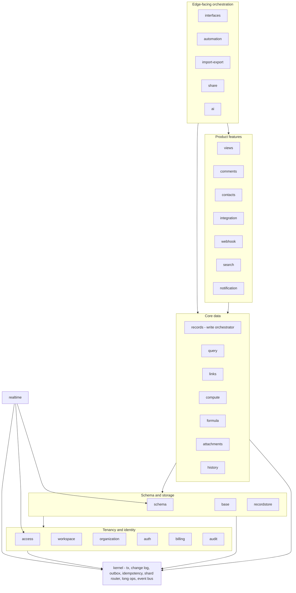
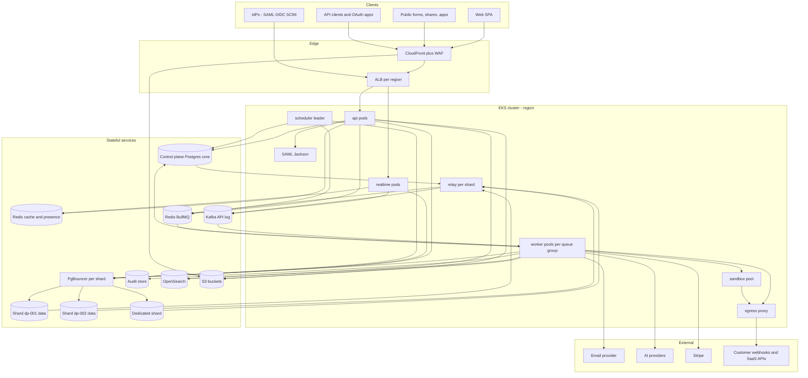
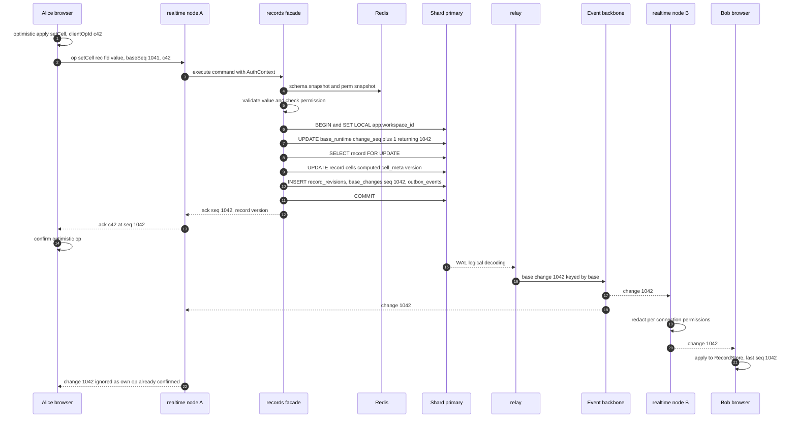
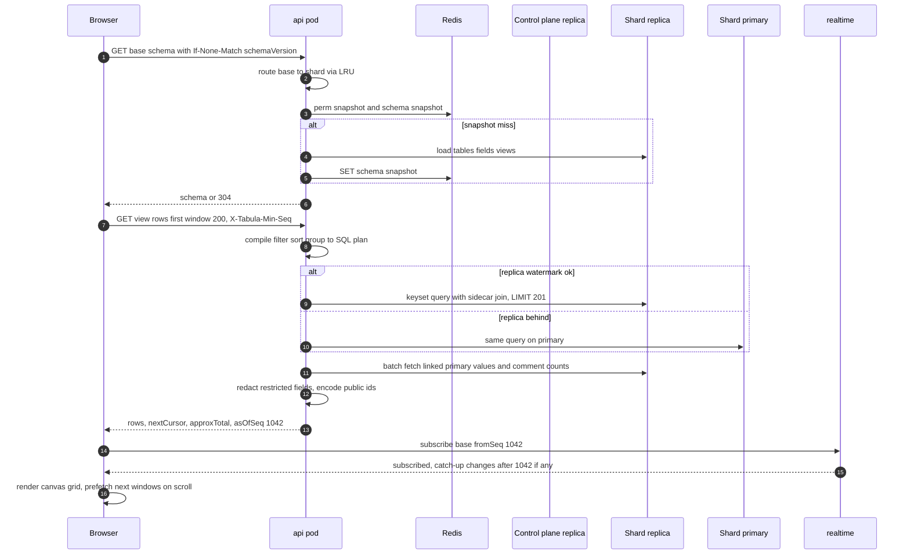

# 03 — System Architecture

> **Sections covered:** §5 System Architecture — control plane vs data plane, process roles, module map, request / write / read / event / realtime / background paths, shard routing, cell architecture, regions & data residency, failure domains, scaling dimensions, system diagram, sequence diagrams (cell edit, view load).
>
> **Status:** Proposed · **Owner:** Platform Architecture · **Date:** 2026-10-03 · Conforms to [`00-canonical-decisions.md`](./00-canonical-decisions.md). Depth lives elsewhere: database topology [`04`](./04-database-architecture.md), events [`15`](./15-events.md), realtime protocol [`16`](./16-realtime.md), permissions [`19`](./19-permissions-and-multitenancy.md), repo/modules [`26`](./26-architecture-style-stack-repo-services.md), transactions [`27`](./27-data-flows-transactions-migrations.md), infra [`25`](./25-security-observability-infrastructure.md). This document is the map that connects them.

---

## 1. Overview

Tabula is a **modular monolith** (D1) — one TypeScript codebase, one server image — deployed as **process roles** over a **two-plane data architecture** (D2):

* **Control plane**: global facts needed before we know which shard to talk to — identity, sessions, orgs, workspaces, grants, billing, notifications, and the routing directories.
* **Data plane**: N Postgres shards ("cells"), each hosting many workspaces' base content; workspace affinity (D3).
* **Async backbone**: transactional outbox + `base_changes` → `relay` (logical replication) → Kafka API (V1) / BullMQ (MVP) → consumers (D11).
* **Realtime**: WebSocket gateway fanning out committed, seq-ordered changes (D9).
* **Edge**: CloudFront + WAF → ALB → EKS (D23).

Architectural invariants that every path below respects:

| # | Invariant |
|---|---|
| I1 | Every write to base content goes through one shard transaction that also writes `base_changes` and `outbox_events` (no dual writes). |
| I2 | No request ever opens transactions on two databases (control plane and a shard, or two shards) that must commit together. Cross-plane effects are events. |
| I3 | Every request is routed by **base → workspace → shard** before touching data-plane state; routing is cached and fenced by `migration_epoch`. |
| I4 | Every authorization decision uses a `PermissionSnapshot` keyed by `perm_epoch`; every fan-out (realtime, webhooks, search, notifications) re-applies it. |
| I5 | Redis and Kafka are never sources of truth; losing either loses latency, not data. |

---

## 2. Control plane vs data plane

| Aspect | Control plane (`core`) | Data plane (`data`, per shard) | Audit store (`audit`) |
|---|---|---|---|
| Cardinality | 1 cluster per deployment (+2 read replicas, cross-region DR replica) | N clusters per region (start 4, add as needed), + dedicated Enterprise shards | 1 per region |
| Holds | users, sessions, orgs, members, teams, workspaces, `workspace_directory`, `base_directory`, `shards`, `access_grants`, tokens/OAuth, SSO/SCIM, plans/subscriptions/usage, notifications, templates, flags | bases, schema, records, links, sidecars, views, interfaces, automations + runs, webhooks, connections, secrets, comments, contacts, attachments metadata, `base_changes`, `outbox_events`, trash, snapshots, jobs, AI log, MVP search docs | `audit_events`, `audit_exports` |
| Read pattern | point lookups (session, token, grants, routing) — almost all cached | windowed scans, point reads, JSONB predicates | append, admin search |
| Write pattern | moderate; spiky (login, notification fan-out) | very high (cell edits, imports, automations) | append stream |
| Failure impact | **global**: logins, routing cache misses, new grants. Mitigated by caching (sessions, routes, snapshots survive minutes of CP outage for already-active users) | **one shard**: its workspaces only | none on user path (buffered in Kafka) |
| Scaling | vertical + replicas; partition notifications/usage monthly; extract notifications to their own cluster if needed (V2) | horizontal: more shards; move workspaces online | partitions + S3 archive |

Why grants live in the control plane while restrictions live on the shard (and how both meet in the snapshot) is argued in [`04` §6.2](./04-database-architecture.md#62-control-plane-vs-data-plane) and [`19`](./19-permissions-and-multitenancy.md).

---

## 3. Process roles

Same image (`tabula/server`), different entrypoints (spine §2; details in [`26` §45.5](./26-architecture-style-stack-repo-services.md#455-process-roles)):

| Role | Responsibility | State | Talks to | Scale signal | Typical V1 size (per region) |
|---|---|---|---|---|---|
| `api` | REST (public + first-party), auth, validation, write transactions, read queries | stateless | CP, shards (via PgBouncer), Redis, S3 (presign), sandbox (none) | CPU, p99 latency, in-flight | 12–60 pods, 2 vCPU/4 GB |
| `realtime` | WebSocket gateway: auth by ws-ticket, subscriptions, presence, ordered fan-out, catch-up | connection state (ephemeral) | Redis (presence, pub/sub), Kafka (V1), shards (catch-up reads via replica), CP (session validation, cached) | connections, memory, fan-out lag | 6–30 pods, ~25k conns/pod |
| `worker` | BullMQ consumers per queue group + Kafka consumer groups | stateless (leases in Postgres) | shards, CP, Redis, S3, external HTTP (egress proxy), AI providers, sandbox | queue depth / consumer lag (KEDA) | one Deployment per queue group |
| `scheduler` | leader-elected cron: schedules, volatile formula buckets, reconciler, purge, partition maintenance, migration controller | leader lease | CP, shards, Redis | n/a (2 replicas) | 2 pods |
| `relay` | one logical-replication reader per shard → Kafka / BullMQ | slot position (in Postgres) | shard (replication protocol, direct, not via PgBouncer), Kafka/Redis | WAL lag | 1 active + 1 standby per shard |
| `sandbox` | executes user scripts in isolates; no DB/cloud creds; egress via allowlist proxy | none | egress proxy only; called via mTLS RPC from `worker` | pending executions | pool per region |
| (file worker) | `worker --queues=file-scan,file-process` with native layer (libvips, ffmpeg, ClamAV client) | none | S3, shards, ClamAV daemon | queue depth | separate image from V1 |

---

## 4. Module map

Modules are directories under `apps/server/src/modules/` with a single public facade; cross-module side effects after commit go through domain events; lower modules that need higher capabilities declare ports ([`26` §45.6–45.7](./26-architecture-style-stack-repo-services.md#456-module-boundary-enforcement)). The layering below is the allowed dependency direction (arrows point to dependencies).



| Module | Owns tables (data plane unless `core.`) | Key facade operations | Emits |
|---|---|---|---|
| `kernel` | `base_runtime`, `base_changes`, `outbox_events`, `idempotency_keys`, `long_operations` | `withBaseTx`, `allocateSeq`, `emit`, `ShardResolver.resolveBase` | — (infrastructure) |
| `auth` | `core.users`, `user_identities`, `user_mfa_factors`, `sessions`, `api_tokens`, `oauth_*`, `sso_connections`, `scim_*`, `service_accounts` | `authenticate(req)`, `issueWsTicket` | identity events |
| `organization` / `workspace` | `core.organizations*`, `teams*`, `workspaces`, `workspace_directory`, `base_directory`, `shards`, `invitations`, `support_access_grants` | placement, membership | tenancy events |
| `access` | `core.access_grants` | `getSnapshot(principal, baseId)`, `assert(action, …)` | `grant.changed` |
| `billing` | `core.plans`, `subscriptions`, `usage_*` | `entitlements(orgId)` | billing events |
| `base` / `schema` | `bases`, `tables`, `fields`, `field_dependencies`, `link_relations` | `getSnapshot(baseId)`, schema commands | schema events |
| `recordstore` | `records`, `record_index_*`, `record_rich_docs`, `computed_stale` | `lockForUpdateInTx`, `writeInTx`, `readWindow` | — |
| `records` | (orchestrator, no tables) | `createRecords`, `updateRecords`, `deleteRecords`, `restore` | record events |
| `links` | `record_links` | `applyInTx(linkOps)` | `record.links_changed` |
| `compute` / `formula` | (uses recordstore ports) | `recomputeInTx`, deferred compute job | `record.computed_updated` |
| `query` | read-only exemption on records/sidecars/links | `compileViewQuery`, `executeWindow` | — |
| `views` | `views`, `view_sections`, `view_user_state` | view CRUD, row windows | view events |
| `history` | `record_revisions`, `deletion_batches`, `base_snapshots` | undo/redo, trash, snapshots | history events |
| `interfaces` | `interfaces`, `interface_pages`, `interface_versions` | draft, publish, element queries | interface events |
| `automation` | `automations`, `automation_*`, `inbound_webhooks` | matcher, runner, scheduler hooks | automation events |
| `integration` / `webhook` | `integration_connections`, `secrets`, `sync_*`, `webhook_*` | connectors, dispatch | integration events |
| `comments` / `contacts` / `attachments` / `share` / `import-export` / `ai` / `search` / `notification` / `audit` | per spine §5 | — | per spine §6 |

---

## 5. Request path and shard routing

### 5.1 Edge to handler

```
Browser / API client
  → CloudFront (TLS 1.3, WAF managed rules, bot control on public form/share routes, static SPA assets)
  → ALB (per region; path routing: /v1/* → api, /ws → realtime, hooks.* host → api hooks group)
  → api pod (Fastify)
      1. requestId + traceparent (OTel)            6. route params decode: public ids → uuid (prefix check)
      2. body limits (1 MB JSON default; 10 MB batch) 7. ShardResolver: base → workspace → shard (§5.2)
      3. authenticate: cookie session / bearer token  8. PermissionSnapshot load (Redis perm:…) + assert action
      4. rate limit: token, base, IP (Redis rl:…)     9. idempotency check (Idempotency-Key → idem:… / table)
      5. org policy gates (IP allowlist, SSO-only)   10. handler → module facade → kernel.withBaseTx / query
                                                    11. response: problem+json on error; ETag; X-Tabula-Base-Seq
```

Middleware budgets (p99, warm caches): auth 0.5 ms, rate limit 0.5 ms (one Redis round trip, pipelined with idempotency fast path), routing 0.1 ms (in-process hit), permission snapshot 0.5 ms. A request with all caches warm makes **one** Redis round trip before touching Postgres.

### 5.2 Shard routing ("how does `api` find the shard for a base?")

Normative design: [`04` §6.4](./04-database-architecture.md#64-routing). Summary:

1. Decode `bas_…` → base UUID (pure).
2. In-process LRU (`ShardResolver`, 100k entries, 30 s TTL) → hit returns `{workspaceId, orgId, shardId, status, migrationEpoch}`.
3. Miss → Redis route cache (300 s TTL) → miss → control-plane **replica** query joining `core.base_directory` and `core.workspace_directory` → populate both caches.
4. `shardId` → connection pool map (built from `core.shards`, refreshed every 60 s; DSNs from Secrets Manager) → PgBouncer for that shard.
5. Transaction starts with `SET LOCAL app.workspace_id = …` (RLS, D4) and statement/lock timeouts.
6. **Fencing:** directory changes publish `route-invalidate`; during a workspace move the source shard rejects writes with `WORKSPACE_MOVED` and the router refreshes and retries once. Status `migrating` → writes get `503 Retry-After: 2` for the short fence window (< 5 s); `trashed` → `404`/`410`.
7. Requests without a base in the path: workspace-scoped (`/v1/workspaces/{id}/…`) route via `workspace_directory`; public tokens (share links, inbound webhooks) via `core.public_link_directory` (proposed in [`04` §6.29](./04-database-architecture.md#629-proposed-additions)); control-plane-only endpoints never resolve a shard.

**Alternatives considered.** (a) Encode the shard id in public IDs — zero lookups but makes workspace moves impossible without ID rewrites: rejected. (b) Consistent hashing of workspace id over shards — no directory, but rebalancing moves arbitrary tenants and dedicated shards are awkward: rejected. (c) Directory + caches (chosen): one extra lookup on cold paths, full placement freedom.

---

## 6. Write path

Normative transaction anatomy: [`27`](./27-data-flows-transactions-migrations.md); code shape: [`26` §45.7](./26-architecture-style-stack-repo-services.md#457-the-single-shared-transaction-across-modules). Steps for `PATCH …/records` or a realtime `setCell` op:

| # | Step | Where | Notes |
|---|---|---|---|
| 1 | Load `SchemaSnapshot` (`schema:{baseId}:{schemaVersion}`) | outside tx | immutable per version |
| 2 | Normalize & validate values via field type plugins | outside tx (pure) | rejects early with `FIELD_VALIDATION_FAILED` |
| 3 | Permission check on snapshot (`record.update`, field restrictions, row policies) | outside tx (pure) | |
| 4 | `BEGIN`; `SET LOCAL app.workspace_id`; timeouts | shard | `statement_timeout` 5 s interactive |
| 5 | `UPDATE base_runtime SET change_seq = change_seq + 1 RETURNING change_seq, schema_version` | shard | per-base serialization point; asserts schema version |
| 6 | `SELECT … FOR UPDATE` target records (sorted ids) | shard | |
| 7 | Plan cell writes: LWW, `cell_meta`, inverse ops | pure | |
| 8 | Apply link ops (both sides, cardinality) | `links` | |
| 9 | Recompute same-record computed fields + cross-record fan-out ≤ 500; else insert `computed_stale` | `compute` | |
| 10 | Write records (`cells`, `computed`, `cell_meta`, `version+1`), sidecars for indexed slots | `recordstore` | HOT updates |
| 11 | Append `record_revisions` | `history` | coalesced |
| 12 | Insert one `base_changes` row (ops + inverse ops) and N `outbox_events` | `kernel` | |
| 13 | Store idempotency response if key present | `kernel` | |
| 14 | `COMMIT` → respond with `baseSeq`, record versions | api | p99 target 60 ms for single cell |
| 15 | Post-commit: write watermark `(seq, lsn)` for read-your-writes ([`04` §6.22](./04-database-architecture.md#622-read-replicas-and-read-your-writes)) | Redis | fire-and-forget |

Bulk writes (imports, conversions, bulk updates) use the same pipeline in chunks of ≤ 1,000 records per transaction under a `long_operations` row.

---

## 7. Read path

| Read | Path | Consistency |
|---|---|---|
| Base bootstrap (schema, views, interfaces summary) | `GET /v1/bases/{id}/schema` → Redis schema snapshot (miss → shard replica → build → `SET`) | keyed by `schema_version`; ETag |
| Grid/view window | `GET …/views/{viewId}/rows?cursor=` or `POST …/records:query` → `query` compiles filter/sort/group AST → SQL (JSONB expressions on small tables, sidecar joins above `INDEX_SIDECAR_THRESHOLD`) → keyset pagination, window 200 rows | replica if watermark satisfied else primary; response carries `asOfSeq` |
| Single record expand | point read by `(table_id, id)` + links + comments count + revisions page | same |
| Link display values | batched lookup of primary-field values for linked ids in the window | same snapshot |
| Search | MVP: `search_documents` FTS on shard; V1: OpenSearch filtered by accessible base ids | eventual |
| Control-plane reads (home, notifications) | CP replica; sessions/tokens from Redis | eventual (seconds) |

Every response that returns base data includes `asOfSeq` so the client can subscribe to realtime from exactly that point and apply only `seq > asOfSeq` (no gaps, no duplicates).

---

## 8. Event, realtime and background paths

### 8.1 Event path

```
shard COMMIT
  → WAL → logical replication slot (pgoutput, publication on outbox_events + base_changes)
  → relay (one active per shard, lease in Postgres, standby ready)
  → V1: Kafka topics tabula.base-changes.v1 (key base_id), tabula.domain-events.v1 (key workspace_id|base_id),
        tabula.audit.v1, tabula.usage.v1 ; MVP: BullMQ queues + Redis pub/sub rt:base:{baseId}
  → consumer groups (idempotent, per [`15`](./15-events.md)): automation matcher, webhook dispatcher,
    search indexer, notification router, audit writer, usage meter, AI field runner, contact timeline,
    compute (deferred), realtime fan-out
```

Control-plane events (grants, members, users) are written to a **control-plane outbox** read by its own relay; the `perm-epoch-bumper` consumer applies `perm_epoch` bumps on the affected shards and publishes on the `perm-epoch` channel ([`19`](./19-permissions-and-multitenancy.md)). Latency targets: commit → Kafka p99 < 300 ms; commit → automation run start p50 < 2 s.

### 8.2 Realtime path

Protocol and scaling are owned by [`16`](./16-realtime.md). Shape:

1. Client obtains a single-use ws-ticket (`POST /v1/auth/ws-ticket`), connects to `/ws`, authenticates, and `subscribe {baseId, fromSeq}`.
2. Gateway checks the base permission snapshot; joins the base's fan-out set; replays `seq > fromSeq` from `base_changes` (replica) if needed.
3. Committed changes arrive from the event backbone — MVP: Redis pub/sub `rt:base:{baseId}`; V1: per-gateway-node Kafka consumer groups on `tabula.base-changes.v1` ([`15`](./15-events.md)), with WebSocket subscriptions concentrated by base (consistent hashing of `baseId` on the subscribe path) so that each node handles a bounded set of bases.
4. For each change: per-connection **redaction** (`PayloadRedactor` port: hidden tables/fields, row policies, interface scopes) then send in seq order. Clients detect gaps (`seq ≠ last+1`) and request catch-up.
5. Presence (`presence:{baseId}` hash, TTL) and cursors are Redis-only, never persisted. Heartbeat `WS_HEARTBEAT` = 25 s.
6. Writes from WebSocket ops go through the **same** write path (§6) inside the realtime role's call to the records facade, or are proxied to `api` — [`16`](./16-realtime.md) decides; either way the ack carries the committed seq.

### 8.3 Background path

| Mechanism | Used for | Durability |
|---|---|---|
| BullMQ queues (spine §7) | compute, automation trigger/step/schedule, webhook-out, email, notification, search-index, file-scan/process, import, export, ai, sync, snapshot, purge, maintenance | Job envelope only; state in Postgres rows (`automation_runs`, `long_operations`, `webhook_deliveries`, …) |
| Reconciler (`scheduler`) | Re-enqueue rows stuck in `queued/running` past `lease_expires_at` | Postgres is truth |
| Scheduler loops | `automation_schedules` claims, volatile formula buckets (`NOW()`/`TODAY()`), purge after `TRASH_RETENTION`, partition create/drop, webhook expiry, usage period rollover | Leader election via Postgres advisory xact lock on CP |
| Tenant fairness | Per-org/per-base semaphores and weighted admission ([`14`](./14-automation-engine.md), [`23`](./23-notifications-jobs-caching-performance.md)) | Redis + Postgres |

---

## 9. Cell architecture

**Definition [Ours].** A *cell* is the failure and scale unit of the data plane: one Postgres shard (primary + ≥ 2 replicas across AZs) with its PgBouncer deployment, its `relay` pair, and its logical replication slot. In V1, stateless compute (`api`, `realtime`, `worker`) is **shared per region** across cells; for Enterprise dedicated cells, worker pools (and optionally realtime) can be **pinned** to the cell via queue partitioning and node pools.

| Level | Contains | Shared? | Purpose |
|---|---|---|---|
| Region | CP replica access, Redis, Kafka, OpenSearch, S3 buckets, EKS cluster | shared by all cells in region | data residency boundary |
| Cell (shared) | 1 shard + PgBouncer + relay | many workspaces | blast radius, capacity |
| Cell (dedicated) | 1 shard + PgBouncer + relay + optional pinned worker queue group + dedicated KMS CMK | one org | isolation, compliance, noisy-neighbor elimination |

Why not full "stamps" (each cell with its own compute, Redis, Kafka) from day one? Full stamps give the strongest isolation but multiply fixed cost and operational surface by N; most failures we expect (hot tenant, slow queries, vacuum debt, slot lag) are **database-local** and are contained by shard-level cells. We reserve full stamps for V2 (regulated customers) — the routing layer already supports it because routing is per workspace.

Capacity and placement: soft/hard limits per shard in [`04` §6.3.1](./04-database-architecture.md#631-shard-sizing-targets-initial); new workspaces placed on the least-loaded active shard in the org's region; rebalancing by online workspace moves.

---

## 10. Regions and data residency

| Concern | MVP | V1 | Enterprise / V2 |
|---|---|---|---|
| Regions | 1 (`us-east-1`) | `us-east-1` + `eu-central-1` data planes | additional regions on demand |
| Control plane | single, US | single global CP in US; EU region holds read replica for low-latency auth reads | option: regional CP partition for orgs requiring identity residency |
| Org placement | n/a | `organizations.home_region` chosen at creation; all its workspaces placed on shards in that region | dedicated shards per region |
| Data in region | all | base content, attachments (regional buckets), search indices, Kafka, audit store, backups (cross-region replication **within** jurisdiction, e.g., EU→EU) | + KMS CMK per org |
| Processing in region | all | workers/realtime/api serving EU bases run in EU; ALB routing by host `eu.api.tabula.example` and by redirect when a US endpoint receives an EU base request (`421 Misdirected` with `Location` hint) | AI provider routing to in-region endpoints only |
| Data outside region | — | identity (email, name), org/workspace names, `base_directory` names, billing — documented in DPA | regional CP removes this |

Moving an org between regions = workspace moves to shards in the target region + attachment copy (long operation, admin-initiated).

---

## 11. Failure domains

| Component | Failure | Blast radius | Detection | Mitigation / degraded mode |
|---|---|---|---|---|
| Shard primary | crash / AZ loss | workspaces on that shard | RDS health, error rate | Multi-AZ failover 60–120 s; api retries idempotent writes; realtime clients resync by seq |
| Shard replica | lag / loss | read latency | lag metric | router falls back to primary (watermark) |
| Control plane | primary down | logins, new grants, cache misses | health checks | sessions/tokens/routes/perm snapshots cached (Redis ≥ 5 min); active users keep working; writes to base content unaffected |
| Redis (cache/presence) | node loss | latency spike; presence lost | ElastiCache events | everything rebuildable; rate limiting fails **open** for authenticated users with local token-bucket fallback, **closed** for public endpoints |
| Redis (BullMQ) | failover | job latency | queue metrics | AOF; reconciler re-enqueues from Postgres state |
| Kafka / MSK | broker loss | event latency | consumer lag | replication factor 3; relay buffers via slot (WAL retained) — alarm on slot lag, hard cap on retained WAL |
| `relay` | crash | events delayed for one shard | WAL lag | standby takes lease < 10 s; resumes from slot LSN, consumers dedupe |
| Realtime node | crash | its connections | conn drops | clients reconnect with jitter, resubscribe `fromSeq`; no data loss |
| Worker pool | crash / poison job | one queue group | DLQ, lag | per-group isolation; DLQ + replay tooling |
| Sandbox | escape attempt / hang | single execution | timeouts, seccomp | isolates with memory/CPU limits, no creds, egress allowlist, pod recycling |
| S3 / CloudFront | regional degradation | attachments | 5xx rate | uploads retry; grid renders without thumbnails |
| External providers (email, AI, Stripe) | outage | feature | error rates | queues retry with backoff; AI fields show `error` status; Stripe webhooks replayed |
| Bad deploy | regressions | all roles of that version | canary SLOs | Argo Rollouts canary per role, feature flags, fast rollback; DB migrations expand/contract only |

---

## 12. Scaling dimensions per component

| Component | Primary dimension | Scaling mechanism | First bottleneck to watch | Headroom lever |
|---|---|---|---|---|
| `api` | requests/s, CPU (JSON, formula eval) | HPA on CPU + latency | Postgres connections (via PgBouncer) | more pods; replica reads |
| `realtime` | concurrent connections, fan-out msgs/s | HPA on connections | per-node memory, hot bases with 1k+ viewers | base-affine routing; message coalescing per 50 ms tick |
| `worker` groups | queue depth / lag | KEDA per queue | downstream (shard write TPS, provider rate limits) | per-tenant fairness, concurrency caps |
| Shard | write TPS, size, WAL rate | add shards, move workspaces | hot base serialization on `base_runtime`; vacuum | dedicated shard; bulk chunking |
| Control plane | logins/s, notification inserts | vertical + replicas; partitioning | notification fan-out | move notifications to own cluster (V2) |
| Redis | ops/s, memory | cluster mode; separate clusters for cache vs BullMQ | hot keys (`presence` of huge bases) | key sharding by base |
| Kafka | partitions, throughput | add partitions/brokers | ordering per base key | 64→256 partitions per topic |
| OpenSearch | docs, query QPS | per-shard indices, replicas | reindex storms | throttled bulk, index aliases |
| S3/CloudFront | bytes | managed | — | — |
| Sandbox | concurrent scripts | pool autoscaling | cold start | warm isolate pools |

---

## 13. System diagram



---

## 14. Sequence diagrams

### 14.1 Cell edit (realtime, two collaborators)



Latency budget (p50 / p99 in-region): client→gateway 20/60 ms; command incl. tx 15/60 ms; commit→relay→backbone 30/150 ms; backbone→other gateways→client 30/150 ms. Total Alice→Bob ≈ 100/450 ms (target spine scale table: p50 < 150, p99 < 600).

Conflict example: if Bob concurrently wrote the same cell and his tx got seq 1043, both clients converge on Bob's value (LWW by commit order); Alice's revision remains in history.

### 14.2 View load (grid, 100k-record table)



Budgets: schema (cached) 10 ms; window query p50 80 ms, p99 400 ms on 100k rows with sidecars; first paint p50 < 800 ms including bundle cache hit.

---

## 15. Proposed additions

None (no new tables). This document uses Redis pub/sub channels already introduced by other documents for reconciliation with spine §10: `rt:base:{baseId}` ([`15`](./15-events.md)), `route-invalidate` and Redis key `route:base:{baseId}` ([`04`](./04-database-architecture.md)), `perm-epoch` ([`19`](./19-permissions-and-multitenancy.md)); and the proposed table `core.public_link_directory` ([`04` §6.29](./04-database-architecture.md#629-proposed-additions)). It also assumes a **control-plane outbox** read by a control-plane relay, as described in [`19`](./19-permissions-and-multitenancy.md); spine §5.1 has no `core.outbox_events` table — flagged here so `04`/`05`/`32` reconcile it (either add `core.outbox_events` or document the mechanism).
