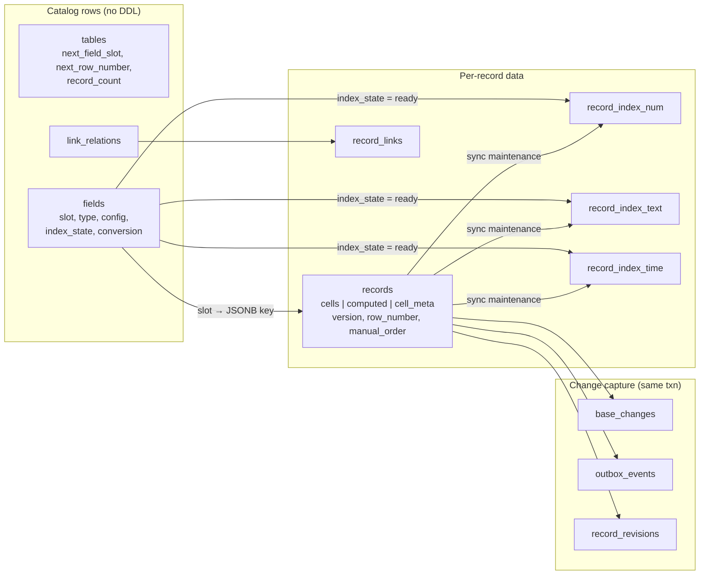
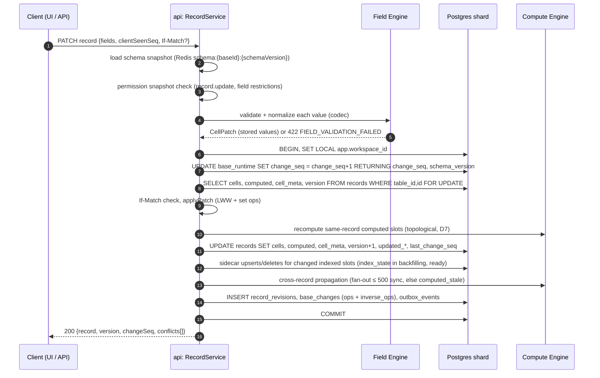
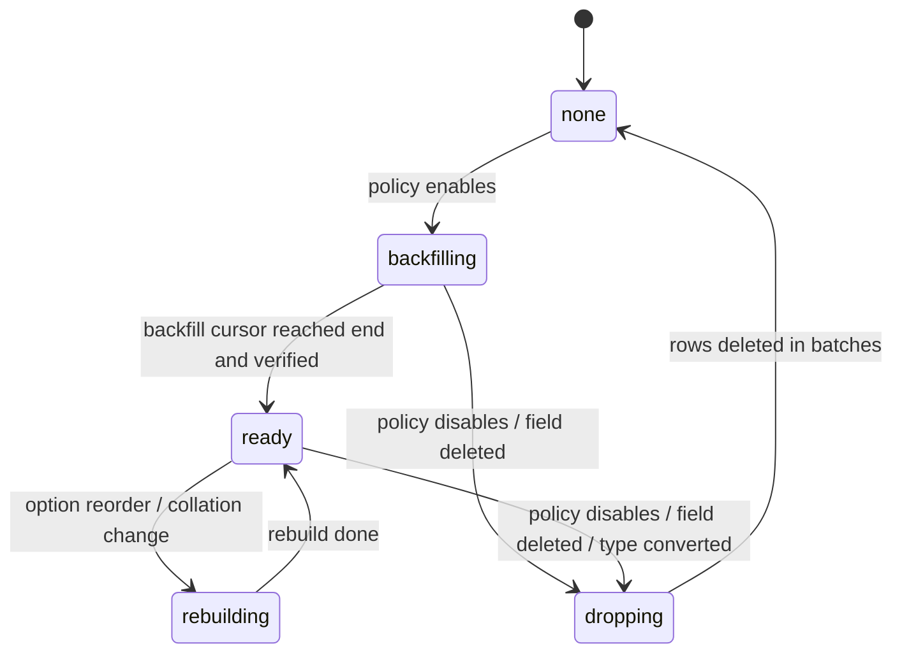
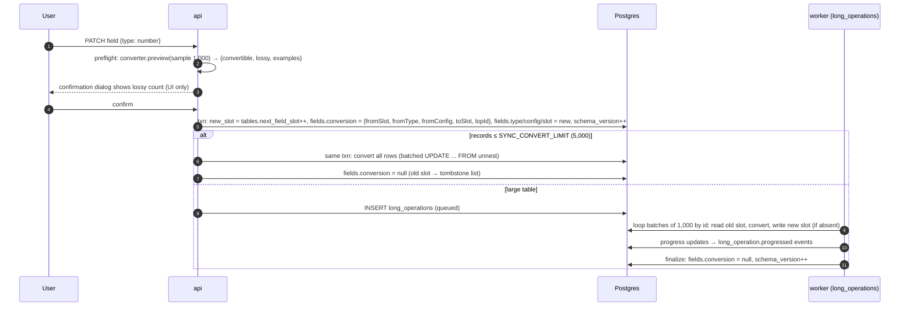

# 06 — Record Storage Strategy

> **Status:** Proposed · **Owner:** Data Platform · **Conforms to:** [00 — Canonical Decisions](00-canonical-decisions.md) (D6, D7, D9, §3, §4, §5, §13)
>
> **Sections covered:** Section 8 (Record Storage Strategy) and original Part 3 (storage model comparison).
>
> Related: [05 — SQL Schema](05-sql-schema.md) (canonical DDL) · [07 — Field Engine](07-field-engine.md) · [08 — Formula Engine](08-formula-engine.md) · [09 — Linked Record Engine](09-linked-record-engine.md) · [10 — View Engine](10-view-engine.md) · [11 — Filter, Sort & Group](11-filter-sort-group.md) · [16 — Realtime](16-realtime.md) · [22 — History/Undo/Trash](22-audit-history-undo-trash.md) · [27 — Data Flows, Transactions & Migrations](27-data-flows-transactions-migrations.md)

---

## 0. Summary

**[Ours]** We store user records using the **hybrid model fixed by D6**:

* one physical row per user record in `data.records` (hash-partitioned by `table_id`);
* canonical user-entered values in `records.cells JSONB`, keyed by **field slot** (small integer, per table, never reused);
* materialized computed values in `records.computed JSONB` (same slot keys);
* per-cell write metadata in `records.cell_meta JSONB` (`{seq, by, at}` per slot) for last-writer-wins and per-field modified time;
* links normalized out to `record_links` (see [09](09-linked-record-engine.md));
* **typed index sidecars** (`record_index_num`, `record_index_text`, `record_index_time`) holding an index-friendly projection of selected fields once a table reaches `INDEX_SIDECAR_THRESHOLD` (20,000 records) and the field is used by a saved view's sort/filter;
* **no DDL is ever executed in response to a user action.** User schema changes are catalog rows (`fields`) plus, at most, background data jobs.

The rest of this document justifies this against five alternatives and then specifies it precisely enough to implement.

---

## 1. Workload and requirements

| Dimension | Target | Source |
|---|---|---|
| Bases | 100k bases system-wide in year 2; ~5–20k bases per shard | capacity plan ([04](04-database-architecture.md)) |
| Tables per base | p50 5, p99 60, hard limit 500 | §12 |
| Fields per table | p50 20, p99 150, hard limit 500 | §12 |
| Records per base | ≤ 2,000,000 (10M on dedicated shard) | §12 |
| Records per table | p50 < 1k, p99 ~200k, max ~2M (10M dedicated) | inferred from limits |
| Hot read | Grid page: 200 rows, ~20–60 projected fields, with filter + sort, p95 < 150 ms server-side on a 1M-record table | §13 grid window |
| Hot write | Single-cell edit p95 < 60 ms commit; 5,000 records written/min/base sustained | §8 rate limits |
| Schema change | Add field O(1) and instant; rename O(1); delete instant (restorable); type change online with progress | product |
| Isolation | Shared schema + RLS (D4) | D4 |
| Consistency | Per-base total order (`base_runtime.change_seq`), cell-level LWW (D9) | D9 |

Two properties dominate the design:

1. **Long tail of tiny tables, short head of huge ones.** ~95% of tables have fewer than 5k rows (a scan of the partition slice beats any index lookup). A few have 10^6 rows and need index-backed sort/filter.
2. **Schema is user data.** Users add/rename/retype fields constantly (in early-life bases a field add is about as common as a record edit). Any design that couples user schema to the Postgres catalog turns frequent user actions into DDL.

---

## 2. Evaluation criteria

For each option we analyse:

1. **Write path** — what a single-cell update and a 1,000-record batch insert physically do.
2. **Read path** — the canonical query: *grid page of 200 rows from a 1M-record table, filter `Status is any of [Open, Blocked]` AND `Due < 2026-11-01`, sort by `Amount DESC`, project 30 fields.*
3. **Index story** — how filter/sort become index-backed.
4. **Schema change cost** — add field, change type, delete field.
5. **Storage overhead** — bytes per record for a 30-field record whose payload is ~600 bytes.
6. **Tenant scaling** — 100k bases × ~8 tables = ~800k user tables.
7. **MVCC / vacuum** — dead-tuple generation, HOT eligibility, bloat.
8. **Verdict.**

Running example ("Deals" table):

| Field | Type | Slot |
|---|---|---|
| Name | `text` (primary) | 1 |
| Status | `single_select` | 2 |
| Amount | `currency` | 3 |
| Due | `date` | 4 |
| Owner | `collaborator` | 5 |
| Notes | `long_text` | 6 |
| … 24 more | mixed | 7–30 |

---

## 3. Option 1 — Entity–Attribute–Value (EAV)

```sql
CREATE TABLE eav_values (
  table_id  uuid NOT NULL,
  record_id uuid NOT NULL,
  field_id  uuid NOT NULL,
  value     text,                       -- everything stringly typed (or jsonb)
  PRIMARY KEY (table_id, record_id, field_id)
);
CREATE INDEX ON eav_values (table_id, field_id, value);
```

**Write path.** A single-cell update is one small-row upsert (never HOT, because `value` is indexed). A batch insert of 1,000 records × 30 fields = 30,000 tuples, each with a 23-byte heap header + 4-byte line pointer + 48 bytes of keys, and 60,000 index entries.

**Read path (canonical query).**

```sql
WITH f AS (
  SELECT s.record_id
  FROM eav_values s
  JOIN eav_values d ON d.table_id = s.table_id AND d.record_id = s.record_id AND d.field_id = $due
  WHERE s.table_id = $t AND s.field_id = $status AND s.value IN ('opt_open', 'opt_blocked')
    AND d.value < '2026-11-01'                     -- string compare is only correct for ISO dates
), ranked AS (
  SELECT f.record_id, a.value::numeric AS amount   -- cast per row; sort cannot use an index
  FROM f LEFT JOIN eav_values a ON a.table_id = $t AND a.record_id = f.record_id AND a.field_id = $amount
  ORDER BY amount DESC NULLS LAST
  LIMIT 200
)
SELECT r.record_id, jsonb_object_agg(v.field_id, v.value) AS cells   -- pivot: 200 × 30 = 6,000 rows
FROM ranked r
JOIN eav_values v ON v.table_id = $t AND v.record_id = r.record_id
GROUP BY r.record_id;
```

Every additional filter predicate is another self-join. Sorting by a numeric field stored as text needs a cast (no index) or a parallel `value_num` column (which turns this into option 6). The pivot reads 6,000 index tuples scattered across the heap (cells of one record are not co-located unless the table is `CLUSTER`ed, which decays).

**Index story.** One composite index serves equality on any field, but range predicates and sorts on non-text types are wrong or unindexed. Multi-predicate filters require bitmap ANDs across self-joins; the planner's estimates for `(field_id, value)` are poor because Postgres statistics are per physical column, not per logical field.

**Schema change.** Add field: free. Delete field: `DELETE … WHERE field_id = $f` (N rows, heavy vacuum). Change type: rewrite N rows — or "just reinterpret", since everything is text, which is exactly the problem: invalid data survives silently.

**Storage.** ~30 tuples × (24 header + 48 keys + ~20 value + 4 line pointer) ≈ 2.9 KB/record, plus index ≈ same again → **~6 KB per record** for ~0.6 KB of payload. 1M records ≈ 6 GB.

**Tenant scaling.** Catalog-neutral (one table), which is good, but it becomes the largest object on the shard by an order of magnitude.

**MVCC/vacuum.** Vacuum work is proportional to *cell* count, not record count. Deleting a record = 30 dead tuples.

**Verdict: ❌ Rejected.** Flexible but slow for the dominant read shape (wide pages with multi-predicate filters), 5–7× storage overhead, and typeless.

---

## 4. Option 2 — Pure JSONB records

```sql
CREATE TABLE records (
  table_id uuid NOT NULL,
  id       uuid NOT NULL,
  data     jsonb NOT NULL,                  -- all values incl. computed & links
  PRIMARY KEY (table_id, id)
) PARTITION BY HASH (table_id);
CREATE INDEX ON records USING gin (data jsonb_path_ops);   -- optional
```

**Write path.** A single-cell update rewrites the whole row tuple (Postgres has no in-place partial JSONB update; MVCC writes a new tuple version anyway). With a GIN index on `data` the update is **never HOT** and inserts GIN entries for every leaf value (pending list amortises, but cost is O(fields)). Without GIN, updates are HOT-eligible.

**Read path.**

```sql
SELECT id, data
FROM records
WHERE table_id = $t
  AND data->>'status' = ANY ('{opt_open,opt_blocked}')
  AND (data->>'due') < '2026-11-01'
ORDER BY (data->>'amount')::numeric DESC NULLS LAST, id
LIMIT 200;
```

For a 1k-record table this is excellent: one partition slice, sequential, already pivoted. For 1M records the sort requires a scan + top-N heapsort over 1M detoasted JSONB values (~1–3 s), unless an **expression index per field** exists — `CREATE INDEX … ON records (((data->>'amount')::numeric)) WHERE table_id = '…'` — which is per-user-field DDL (catalog growth, see option 5).

**Index story.** GIN `jsonb_path_ops` gives equality/containment for any key (`data @> '{"2":"opt_open"}'`) but no ranges and no ordering. Range/sort need per-field expression indexes (DDL) or sidecars (option 4).

**Schema change.** Add: free. Delete: logical (ignore key) + lazy cleanup. Type change: batch rewrite of values (no DDL).

**Storage.** One tuple per record. JSONB costs ~8 bytes of header per key plus the key text; with slot keys (`"17"`) ≈ 12 B/key ⇒ 30 fields ≈ 360 B of structure + 600 B payload ≈ **1.0–1.2 KB per record**. TOAST compresses large documents (lz4).

**Tenant scaling.** Catalog-neutral. Excellent.

**MVCC/vacuum.** One dead tuple per update (not per cell). HOT achievable without GIN. Documents > ~2 KB go to TOAST; updates to a toasted value rewrite the **entire** TOAST value — the main write-amplification risk, which is maximised if computed values, links and metadata all live in the same document.

**Verdict: partial.** Good foundation; insufficient alone for large-table filter/sort, and a single document for everything maximises write amplification.

---

## 5. Option 3 — Pre-allocated typed generic columns ("flex columns")

A single wide physical table with a fixed pool of typed generic columns; user fields are mapped onto them by metadata. **[Inferred]** Some large multi-tenant SaaS platforms have historically used variants of this pattern (generic columns plus a metadata mapping layer).

```sql
CREATE TABLE records (
  table_id uuid, id uuid,
  t001 text, /* … */ t200 text,               -- text pool
  n001 numeric, /* … */ n100 numeric,         -- numeric pool
  d001 timestamptz, /* … */ d050 timestamptz, -- time pool
  b001 boolean, /* … */ b050 boolean,
  j001 jsonb, /* … */ j050 jsonb,
  PRIMARY KEY (table_id, id)
) PARTITION BY HASH (table_id);
-- metadata: field 'Amount' → n003, 'Due' → d001
```

**Write path.** Updating one column still writes a whole new tuple (MVCC is row-granular). Nulls cost one bit in the null bitmap, so sparse wide rows are cheap.

**Read path.** `WHERE t002 = ANY(…) AND d001 < … ORDER BY n003 DESC LIMIT 200` — native types and operators. But planner statistics are **meaningless**: `n003` is "Amount" in one table and "Age" in another, so the column histogram is a blend across tenants.

**Index story.** You cannot index 450 generic columns for all tables: either per-(table, column) partial indexes (DDL again) or 450 shared indexes (every insert updates 450 indexes — catastrophic). In practice you add a "custom index" side table, i.e. you rebuild our sidecars.

**Schema change.** Add field: allocate a free pool column (metadata only) — **until the pool is exhausted** (a hard per-type ceiling: a table with 201 text fields fails). Change type: move values between pools (rewrite). Delete: NULL out (rewrite) before the column may be reused.

**Storage.** Null bitmap for 450 columns = 57 bytes/row; payload stored natively (8-byte timestamps, compact numerics). **~0.8 KB/record** — the most compact.

**Tenant scaling.** Catalog-neutral. Good.

**MVCC/vacuum.** As option 2; toastable values spill per column (better than whole-document TOAST rewrite).

**Verdict: ❌ Rejected.** Arbitrary per-type ceilings (incompatible with "500 fields of any type"), meaningless statistics, and the index story collapses into sidecars anyway. Its one real advantage (native typing) is captured by our sidecars where it matters.

---

## 6. Option 4 — Hybrid: JSONB cells by slot + computed + normalized links + typed sidecars (**chosen, D6**)

```text
records(table_id, id, row_number, manual_order, cells jsonb, computed jsonb, cell_meta jsonb, version, …)
record_links(relation_id, a_record_id, b_record_id, a_order, b_order, …)
record_index_num | record_index_text | record_index_time (table_id, field_slot, record_id, ord, value …)
```

**Write path.** One tuple rewrite of `records` (HOT-eligible: no index covers `cells`/`computed`/`cell_meta`), plus sidecar maintenance only for the indexed slots that changed, plus `record_links` rows only for link changes. Computed-only updates rewrite the heap tuple but **reuse the TOAST pointers of unchanged `cells`** (Postgres does not re-toast an unchanged toasted column), which is precisely why `cells`, `computed` and `cell_meta` are three separate columns rather than one document.

**Read path — small table (< `INDEX_SIDECAR_THRESHOLD`).** As option 2: one partition-slice scan, in-SQL filter/sort on JSONB expressions, top-N heapsort. 20k rows × ~1.5 KB ≈ 30 MB, almost always in shared buffers: 15–40 ms.

**Read path — large table with sidecars on Status, Due, Amount.**

```sql
SELECT r.id, r.row_number, r.cells, r.computed, r.cell_meta, r.version
FROM data.record_index_num AS s_amount                       -- drives the sort (index-ordered)
JOIN data.records AS r
  ON r.table_id = s_amount.table_id AND r.id = s_amount.record_id
WHERE s_amount.table_id = $t AND s_amount.field_slot = 3 AND s_amount.ord = 0
  AND r.deleted_at IS NULL
  AND EXISTS (SELECT 1 FROM data.record_index_text s
              WHERE s.table_id = $t AND s.field_slot = 2 AND s.record_id = r.id
                AND s.value_eq = ANY ($status_option_ids))
  AND EXISTS (SELECT 1 FROM data.record_index_num s
              WHERE s.table_id = $t AND s.field_slot = 4 AND s.record_id = r.id AND s.ord = 0
                AND s.value < $due_epoch_day)
ORDER BY s_amount.value DESC, s_amount.record_id DESC
LIMIT 201;                                                    -- +1 detects "has next page"
```

…plus an "empties last" second leg for records without a sidecar row for slot 3 (§13.5). The sort is served by a backward index range scan on `(table_id, field_slot, value, record_id)`; each candidate is probed against the filters. When a filter is very selective the compiler instead drives the plan from that filter's sidecar and does a top-N sort of the survivors (selectivity estimation in [11](11-filter-sort-group.md)).

**Index story.** Typed, native-comparison B-trees on exactly the fields that need them, created by policy (rows, not DDL). Collation-aware text sort via precomputed ICU sort keys.

**Schema change.** Add: metadata only (new slot). Delete: metadata only (tombstone slot) + lazy cleanup. Type change: online background rewrite into a **new slot** with dual-read (§15).

**Storage.** ~1.1 KB/record for `cells`, ~0.2–2 KB `cell_meta` (compressible), plus ~60 B per sidecar row for indexed fields only.

**Tenant scaling.** Catalog-neutral: a fixed number of physical relations per shard (≈ 64 hash partitions × 4 tables × ~3 indexes).

**MVCC/vacuum.** One dead `records` tuple per record update; sidecar dead tuples only for changed indexed slots. Target HOT ratio for `records` > 90% with `fillfactor = 80`.

**Verdict: ✅ Chosen.** Small tables get JSONB simplicity; large tables get typed indexes exactly where needed; schema changes stay metadata-only; the Postgres catalog stays constant-size.

---

## 7. Option 5 — Dynamically generated Postgres tables/columns per user table

```sql
-- on "create table Deals":
CREATE TABLE u_8f3c2a_deals (id uuid PRIMARY KEY, f1 text, f2 text, f3 numeric(20,2), f4 date /* … */);
-- on "add field":
ALTER TABLE u_8f3c2a_deals ADD COLUMN f31 text;
-- on "change type":
ALTER TABLE u_8f3c2a_deals ALTER COLUMN f3 TYPE text USING f3::text;        -- full table rewrite
-- on "save a view sorted by Amount":
CREATE INDEX CONCURRENTLY u_8f3c2a_deals_f3 ON u_8f3c2a_deals (f3);
```

This is the most natural mapping and gives the best *single-table* query performance (native types, real per-field statistics, real indexes). It fails on **operational** grounds at multi-tenant scale.

**Write path.** Native and fast. But every statement targets a dynamic relation name; prepared-statement and plan caches multiply by tables × connections.

**Read path.** Best possible: `SELECT … FROM u_x WHERE f2 = ANY(…) AND f4 < … ORDER BY f3 DESC LIMIT 200` using a real index on `f3`.

**Schema change cost.**

| User action | DDL | Lock | Consequence |
|---|---|---|---|
| Add field | `ADD COLUMN` (no default) | `ACCESS EXCLUSIVE` (brief) | **Lock-queue hazard**: an `ALTER` waiting behind a 30 s export query blocks *every* subsequent reader of the table until it acquires and releases |
| Rename field | none (metadata) | — | fine |
| Change type | `ALTER COLUMN TYPE … USING` | `ACCESS EXCLUSIVE` for the whole rewrite | 1M rows ⇒ tens of seconds of total unavailability — or a hand-built shadow-column migration (i.e. option-4 machinery anyway) |
| Delete field | `DROP COLUMN` | `ACCESS EXCLUSIVE` | Instant, but the column stays as `attisdropped` and **still counts toward the 1,600-column limit**; after enough add/drop cycles the table must be rebuilt to reclaim attribute numbers |
| Index for a view | `CREATE INDEX CONCURRENTLY` | none, but not transactional; two scans | Async job with failure modes (INVALID indexes to clean up) |

**Tenant scaling — catalog bloat (the deciding factor).** 100k bases × 8 tables = **800k user tables**:

| Catalog object | Per user table | × 800k |
|---|---|---|
| `pg_class` rows (heap, TOAST heap, TOAST index, PK, ~2 indexes) | ~6 | **~4.8M** |
| `pg_attribute` rows (user cols + 6 system cols per heap + index attrs) | ~40 | **~32M** |
| Data files (main + FSM + VM forks per relation) | ~12–15 | **~10M files** across shards |
| `pg_type` rows (row type + array type per table) | 2 | 1.6M |
| `pg_depend`, `pg_constraint`, `pg_statistic`, `pg_policy` rows | tens | tens of millions |

Consequences, each of which we consider disqualifying:

* **Relcache/catcache memory per backend.** Each backend caches catalog entries for every relation it touches. A pooled connection serving many tenants accumulates hundreds of MB of cache; with hundreds of connections per shard this exhausts RAM. Recycling connections aggressively trades this for connection churn.
* **Shared-invalidation storms.** Every DDL broadcasts invalidation messages; with frequent user DDL the queue overflows and *all* backends reset their caches, producing cluster-wide latency spikes.
* **Autovacuum and wraparound** operate per relation; millions of small relations make scheduling slow and anti-wraparound vacuums noisy.
* **Tooling scales with catalog size:** `pg_dump --schema-only`, `pg_upgrade` (hours with millions of relations), `ANALYZE`, monitoring over `pg_stat_user_tables`.
* **Logical replication does not replicate DDL.** D11's relay and D3's **online workspace moves between shards** are built on logical decoding. With per-tenant DDL, a shard move must replay schema changes correctly interleaved with data — a hard problem that disappears when user schema is ordinary rows.
* **RLS (D4)** must be attached to every generated table (more DDL; policy drift becomes a security risk).
* **File-system pressure:** millions of files hurt file-level backup and checkpoint `fsync` behaviour.

**MVCC/vacuum.** Per table, best-in-class. In aggregate, worst-in-class because of relation count.

**Verdict: ❌ Rejected** for the multi-tenant default. A narrow variant (a dedicated shard for one Enterprise customer with a few huge tables) may be evaluated later, but option 4's sidecars close most of the gap without the operational cost. Recorded as ADR "No per-tenant DDL" in [33](33-architecture-decision-records.md).

---

## 8. Option 6 — Separate value tables per data type ("typed EAV")

```sql
CREATE TABLE values_text (table_id uuid, field_id uuid, record_id uuid, value text,        PRIMARY KEY (table_id, field_id, record_id));
CREATE TABLE values_num  (table_id uuid, field_id uuid, record_id uuid, value numeric,     PRIMARY KEY (table_id, field_id, record_id));
CREATE TABLE values_time (table_id uuid, field_id uuid, record_id uuid, value timestamptz, PRIMARY KEY (table_id, field_id, record_id));
CREATE TABLE values_bool (/* … */);
CREATE TABLE values_json (/* … */);
CREATE INDEX ON values_num  (table_id, field_id, value, record_id);
CREATE INDEX ON values_time (table_id, field_id, value, record_id);
```

**Write path.** Single-cell update: one small row in one typed table. Inserting a 30-field record: 30 tuples across up to 5 heaps and 10 index trees.

**Read path.** Filters/sorts are well indexed (each predicate a typed range scan, intersected). Projection of 200 rows × 30 fields requires gathering from 5 tables and pivoting (`UNION ALL` + `jsonb_object_agg`): ~6,000 index probes per page with poor locality. Projection dominates (estimated 40–120 ms) even when filter/sort are fast.

**Index story.** Good — every value indexed — which is also the problem: **every write updates an index**, including fields nobody filters on (write amplification ∝ all fields, not ∝ indexed fields).

**Schema change.** Add: free. Delete: `DELETE` N rows. Type change: move N rows between tables.

**Storage.** 30 tuples × ~80 B + 30 index entries × ~50 B ≈ **~4 KB/record** (≈3× hybrid).

**Tenant scaling.** Catalog-neutral.

**MVCC/vacuum.** Dead tuples per cell change; record deletion ≈ 30 dead tuples.

**Verdict: partial.** Rejected as primary storage, **but its good half is exactly our sidecar design**: we apply typed value tables *selectively* — only for (table, field) pairs that need index-backed filter/sort on large tables — while keeping the record as one co-located row for cheap projection.

---

## 9. Comparison matrix

| Criterion | 1 EAV | 2 JSONB | 3 Flex cols | **4 Hybrid** | 5 Dynamic DDL | 6 Typed value tables |
|---|---|---|---|---|---|---|
| Single-cell write | 1 small tuple + idx | 1 tuple (HOT) | 1 tuple | **1 tuple (HOT) + k sidecar rows** | 1 tuple (HOT) | 1 small tuple + idx |
| 200-row page, small table | slow (pivot) | **fast** | fast | **fast** | fast | medium (pivot) |
| 200-row page, 1M rows, filter+sort | slow | slow without DDL indexes | medium | **fast (sidecars)** | **fastest** | fast filter, slow projection |
| Typed range/sort indexes | ✗ | only via DDL | only via DDL | **✓ by policy** | ✓ via DDL | ✓ always (costly) |
| Add field | free | free | free until pool full | **free** | DDL + lock-queue risk | free |
| Change type | reinterpret (unsafe) | batch rewrite | move pools | **batch rewrite to new slot + dual-read** | exclusive-lock rewrite | move rows |
| Delete field | N deletes | lazy | N updates | **lazy (tombstone)** | DDL + 1,600-attr creep | N deletes |
| Bytes/record (30 fields) | ~6 KB | ~1.1 KB | ~0.8 KB | **~1.3–2.5 KB** (incl. meta) | ~0.7 KB | ~4 KB |
| Catalog growth with tenants | O(1) | O(1) | O(1) | **O(1)** | **O(tables × cols)** ❌ | O(1) |
| Logical replication / shard move | easy | easy | easy | **easy** | hard (DDL) | easy |
| Planner statistics | poor | poor | meaningless | medium (per sidecar partition) | excellent | medium |
| Vacuum load ∝ | cells | records | records | **records (+ indexed cells)** | records | cells |
| Implementation complexity | low | low | medium | **medium-high** | high (ops) | medium |
| Verdict | ❌ | partial | ❌ | **✅** | ❌ | partial (as sidecars) |

---

## 10. Recommended design — overview



Physical objects per shard (all in schema `data`), all hash-partitioned by the key shown (moduli per [05](05-sql-schema.md): `records` × 64, `record_links` and each sidecar × 32):

| Table | Partition key | Rows | Purpose |
|---|---|---|---|
| `records` | `table_id` | 1 per record | canonical row |
| `record_links` | `relation_id` | 1 per link pair | see [09](09-linked-record-engine.md) |
| `record_index_num` | `table_id` | 1 per (record, indexed numeric/date/select-rank slot, element) | typed sort/filter |
| `record_index_text` | `table_id` | 1 per (record, indexed text-ish slot, element) | collated sort, equality, contains |
| `record_index_time` | `table_id` | 1 per (record, indexed datetime slot, element) | time sort/filter |

Partitioning by `table_id` keeps one table's records and its sidecar rows in a single partition each, so every grid query prunes to exactly one partition per relation, and per-partition vacuum parallelises across tables.

---

## 11. The `records` row

### 11.1 DDL fragment (consistent with [05](05-sql-schema.md))

```sql
CREATE TABLE data.records (
  table_id          uuid        NOT NULL,
  id                uuid        NOT NULL,              -- UUIDv7, app-generated (rec_ prefix in API)
  workspace_id      uuid        NOT NULL,              -- RLS key (D4)
  base_id           uuid        NOT NULL,
  row_number        bigint      NOT NULL,              -- autonumber, from tables.next_row_number
  manual_order      text        COLLATE "C" NOT NULL,  -- fractional index (§21)
  cells             jsonb       NOT NULL DEFAULT '{}'::jsonb,  -- user values by slot
  computed          jsonb       NOT NULL DEFAULT '{}'::jsonb,  -- materialized computed values by slot
  cell_meta         jsonb       NOT NULL DEFAULT '{}'::jsonb,  -- per-slot {seq, by, at}
  version           bigint      NOT NULL DEFAULT 1,    -- bumps on any user-visible change (incl. computed)
  created_at        timestamptz NOT NULL,
  created_by        uuid,                              -- user uuid; NULL for system/integration actors
  created_via       text        NOT NULL DEFAULT 'ui', -- ui|api|automation|import|sync|form|script|restore
  updated_at        timestamptz NOT NULL,
  updated_by        uuid,
  last_change_seq   bigint      NOT NULL,              -- base_runtime.change_seq of last write
  deleted_at        timestamptz,
  deletion_batch_id uuid,                              -- → deletion_batches (trash unit)
  PRIMARY KEY (table_id, id)
) PARTITION BY HASH (table_id);

-- per partition (created by the partition-maintenance migration, never by user actions):
--   WITH (fillfactor = 80, toast_tuple_target = 2032,
--         autovacuum_vacuum_scale_factor = 0.02, autovacuum_analyze_scale_factor = 0.02)
ALTER TABLE data.records ALTER COLUMN cells     SET COMPRESSION lz4;
ALTER TABLE data.records ALTER COLUMN computed  SET COMPRESSION lz4;
ALTER TABLE data.records ALTER COLUMN cell_meta SET COMPRESSION lz4;

CREATE UNIQUE INDEX records_rownum   ON data.records (table_id, row_number);
CREATE INDEX        records_order    ON data.records (table_id, manual_order, id) WHERE deleted_at IS NULL;
CREATE INDEX        records_deleted  ON data.records (table_id, deletion_batch_id) WHERE deleted_at IS NOT NULL;
CREATE INDEX        records_created  ON data.records (table_id, created_at, id) WHERE deleted_at IS NULL;
-- No index touches cells/computed/cell_meta/version/updated_*  ⇒ ordinary edits are HOT-eligible.
```

Notes:

* **No index on `updated_at`.** "Sort by last modified" on large tables uses a `record_index_time` sidecar for the `modified_time` field if one exists (keeps edits HOT). `created_at` is immutable, so its index never blocks HOT.
* **`version`** is the optimistic-concurrency token exposed as `ETag`/`If-Match` (§8 of the spine). It increments on *every* change visible through the API for this record — user cells, link changes (on both sides of the link), and computed changes — so a client that read version *v* and sees *v* again knows nothing changed.
* **`last_change_seq`** lets realtime catch-up and the compute engine reason about ordering without parsing `cell_meta`.
* **RLS:** `USING (workspace_id = current_setting('app.workspace_id')::uuid)` on the parent; partitions inherit (D4).

### 11.2 `cells`

Keys are field slots as decimal strings (§3 of the spine); values are the canonical stored JSON of the field type (§4 of the spine, and per type in [07](07-field-engine.md)).

```json
{
  "1": "Acme renewal",
  "2": "opt_7Hq2…",
  "3": "12500.00",
  "4": "2026-10-28",
  "5": "0192f3c1-7a2e-7cc1-9b1f-3f2a9c1d0e55",
  "6": "Call back after budget review",
  "9": ["opt_1a…", "opt_9z…"],
  "12": true,
  "14": ["0192f3d0-…", "0192f3d0-…"]
}
```

Invariants (enforced by the write path, verified by a sampled consistency job):

1. Every key is the slot of a field of this table whose storage class is `cells` (no computed, link, record-column or `button` slots).
2. No key holds `null`, `""`, `[]`, `false` (checkbox) or `{}` — **empty ⇒ absent** (§18).
3. Each value passed the field type's `codec.validate` + `normalize` for the field config *at the time of write*. Config changes that narrow validity (e.g. removing a select option) do **not** rewrite cells; readers treat dangling values per type rules (§17).
4. Keys of **tombstoned slots** may exist until lazy cleanup (§16); readers ignore them because they resolve slots via the schema snapshot.

### 11.3 `computed`

Same slot keying, holds materialized values for `formula`, `lookup`, `rollup`, `count`, `modified_time`/`modified_by` with watched fields, `ai_generated`. **Error values** are *not* stored in `computed[slot]` (the slot is absent, so every filter operator treats an errored cell as empty — normative in [11 §4.2](11-filter-sort-group.md)); the error code is recorded in `cell_meta[slot].err` so it can be displayed and propagated without re-evaluation (§11.4):

```json
{
  "20": "156250.00",
  "21": ["Acme Corp"],
  "22": 3,
  "24": { "value": "Positive", "status": "ok", "inv": "0192f4…" }
}
```

`computed` is written only by the Compute Engine ([08](08-formula-engine.md), [09](09-linked-record-engine.md)), either synchronously in the user's write transaction or by `compute` workers. Records awaiting deferred recompute are tracked in `computed_stale` (they keep their last value; the API marks such cells `stale: true` when `returnStaleness=true`).

### 11.4 `cell_meta` — per-slot `{seq, by, at}`

```json
{
  "2":  { "seq": 18233, "by": "0192f3c1-7a2e-7cc1-9b1f-3f2a9c1d0e55", "at": 1791036300123 },
  "3":  { "seq": 18240, "by": "0192f3c1-…", "at": 1791036311871 },
  "30": { "seq": 18301, "by": null, "at": 1791036400000 }
}
```

| Key | Meaning |
|---|---|
| `seq` | `base_runtime.change_seq` of the transaction that last wrote this cell (incl. clearing it) |
| `by` | user uuid of the actor; `null` for non-user actors (automation, sync, system) — the actor detail lives in `base_changes` |
| `at` | commit-time wall clock, epoch milliseconds (8-byte-friendly number, cheaper to compare than ISO strings) |

Rules:

* `cell_meta` covers **user-writable slots**, including **link slots** (link add/remove/move updates the meta of the link slot on *both* records — see [09](09-linked-record-engine.md)). Computed slots have **no** `{seq, by, at}` (they are derived); a computed slot gets a `cell_meta` entry only while it is in error: `{"err": "DIV_ZERO"}` (error codes in [08 §8](08-formula-engine.md)). The compute engine sets/removes it in the same statement that writes `computed`.
* Clearing a cell removes the key from `cells` but **keeps** its `cell_meta` entry (the clear is a modification).
* Uses:
  1. **Per-field modified time** — `modified_time`/`modified_by` fields with `watchFields: [f1, f2]` compute `max(cell_meta[slot(f)].at)` and the corresponding `by`. Without watched fields they read `records.updated_at/updated_by`.
  2. **Conflict reporting under LWW** (§11.5).
  3. **Undo safety** — undo of change *c* for cell *s* is applied only if `cell_meta[s].seq == c.seq` (nobody overwrote since); otherwise the undo is reported as partially inapplicable ([22](22-audit-history-undo-trash.md)).
  4. **Sync/conflict tooling** for integrations (two-way sync decides direction by `at`).
* Size: ~85 bytes/slot uncompressed; a record with 30 edited cells ≈ 2.5 KB raw → ~0.9 KB lz4. Tombstoned slots are stripped by the cleanup job.

### 11.5 Last-writer-wins (D9) at the storage layer

All writers to a base serialize on `base_runtime` (the `change_seq` allocation `UPDATE … RETURNING`) and all writers to a record serialize on its row lock. Therefore, for any record, **commit order = seq order**, and LWW reduces to "apply the patch on top of the current row" — there is never a need to compare timestamps on the server.

```ts
interface CellPatch {
  set:   Record<Slot, StoredValue>;   // already validated+normalized by the field engine
  clear: Slot[];
  linkOps?: LinkOp[];                 // routed to record_links (09)
  clientSeenSeq?: number;             // highest base seq the client had applied when issuing
}

function applyPatch(row: RecordRow, p: CellPatch, seq: number, actor: Actor, now: number): ApplyResult {
  const conflicts: Slot[] = [];
  for (const slot of [...Object.keys(p.set), ...p.clear]) {
    const prev = row.cell_meta[slot];
    if (p.clientSeenSeq !== undefined && prev && prev.seq > p.clientSeenSeq) {
      conflicts.push(slot);              // someone wrote after the client last saw it: LWW still applies,
    }                                    // but we tell the client ("you overwrote Dana's change")
    row.cell_meta[slot] = { seq, by: actor.userId ?? null, at: now };
  }
  row.cells = omit({ ...row.cells, ...p.set }, p.clear);
  return { row, conflicts };
}
```

Multi-valued fields (`multi_select`, multi `collaborator`, `attachment`, links) additionally accept **set ops** (`add`/`remove`) that commute; they are applied by reading the current array under the row lock (the row is already `FOR UPDATE`) — see [07 §realtime semantics](07-field-engine.md) and [16](16-realtime.md). Strict API clients send `If-Match: "<version>"`; mismatch ⇒ `412 VERSION_CONFLICT`.

---

## 12. Write path

### 12.1 Single-record update (sequence)



Schema-version guard: `base_runtime.schema_version` is read in the same transaction; if it differs from the snapshot used for validation (a concurrent schema change committed), the service reloads the snapshot and re-validates once (bounded retry), so a value is never written against a stale field definition (e.g. to a slot that was just tombstoned or whose type just started converting).

### 12.2 SQL of the record update

```sql
UPDATE data.records
SET cells           = (cells || $set::jsonb) - $clear::text[],
    computed        = (computed || $computed_set::jsonb) - $computed_clear::text[],
    cell_meta       = cell_meta || $meta_patch::jsonb,
    version         = version + 1,
    updated_at      = $now,
    updated_by      = $actor_user_id,
    last_change_seq = $seq
WHERE table_id = $table_id AND id = $record_id AND deleted_at IS NULL
RETURNING version;
```

We send a **patch**, not the full document: the server-side `||`/`-` operators avoid shipping the whole JSONB over the wire. (Postgres still writes a full new tuple — that is MVCC, see §19.)

### 12.3 Sidecar maintenance (synchronous, same transaction)

For each changed slot whose field has `index_state IN ('backfilling','ready')`:

```sql
-- multi-row form for a batch of records; single record shown
DELETE FROM data.record_index_num
 WHERE table_id = $t AND field_slot = $slot AND record_id = $r;
INSERT INTO data.record_index_num (workspace_id, table_id, field_slot, record_id, ord, value)
SELECT $ws, $t, $slot, $r, e.ord, e.value
FROM unnest($ords::smallint[], $values::numeric[]) AS e(ord, value);
```

For single-valued fields we use an upsert instead (cheaper, one tuple):

```sql
INSERT INTO data.record_index_num (workspace_id, table_id, field_slot, record_id, ord, value)
VALUES ($ws, $t, $slot, $r, 0, $v)
ON CONFLICT (table_id, field_slot, record_id, ord) DO UPDATE SET value = EXCLUDED.value
WHERE data.record_index_num.value IS DISTINCT FROM EXCLUDED.value;
-- and when the cell became empty:
DELETE FROM data.record_index_num WHERE table_id=$t AND field_slot=$slot AND record_id=$r;
```

The sidecar projection (`ord`, `value`, `sort_key`, `value_eq`) comes from the field type's `index.extract()` ([07](07-field-engine.md)). Computed slots (formula, rollup, count, lookup) can be indexed too: their sidecars are maintained wherever `computed` is written (sync path or compute worker), in the same transaction as the `computed` update.

### 12.4 Batch insert (1,000 records)

1. Allocate `row_number` range: `UPDATE tables SET next_row_number = next_row_number + 1000 RETURNING next_row_number - 1000` (one row lock; base already serialized).
2. Allocate `manual_order` keys: `generateNKeysBetween(lastKey, null, 1000)` (§21).
3. Validate/normalize all cells (field engine, CPU-bound, ~5–20 µs per cell).
4. Compute same-record formulas for all 1,000 records.
5. One multi-row `INSERT … SELECT FROM unnest(...)` (or `COPY` for imports > 5k rows) into `records`.
6. Batched sidecar inserts (one `INSERT … SELECT FROM unnest` per indexed slot).
7. Link inserts (one `INSERT … ON CONFLICT DO NOTHING` per relation).
8. One `base_changes` row with a **batch envelope** (`records.bulk_changed`), N `record_revisions` rows (`COPY`-style multi-insert), one outbox event.
9. `UPDATE tables SET record_count = record_count + 1000`; `UPDATE base_runtime SET record_count = record_count + 1000` (limit check, §20).

Typical cost: ~150–300 ms for 1,000 × 30-field records including WAL flush.

---

## 13. Typed index sidecars

### 13.1 DDL fragments

```sql
CREATE TABLE data.record_index_num (
  workspace_id uuid     NOT NULL,
  table_id     uuid     NOT NULL,
  field_slot   smallint NOT NULL,
  record_id    uuid     NOT NULL,
  ord          smallint NOT NULL DEFAULT 0,  -- element index for multi-valued fields; 0 for scalar
  value        numeric  NOT NULL,            -- number, currency (exact), percent, duration (s), rating,
                                             -- date (epoch day), single_select rank, checkbox (1), count
  PRIMARY KEY (table_id, field_slot, record_id, ord)
) PARTITION BY HASH (table_id);
CREATE INDEX record_index_num_val ON data.record_index_num (table_id, field_slot, value, record_id);

CREATE TABLE data.record_index_text (
  workspace_id uuid     NOT NULL,
  table_id     uuid     NOT NULL,
  field_slot   smallint NOT NULL,
  record_id    uuid     NOT NULL,
  ord          smallint NOT NULL DEFAULT 0,
  sort_key     bytea    NOT NULL,            -- ICU collation key (base collation), truncated to 128 bytes
  value_eq     text     NOT NULL,            -- equality form: NFC + casefold, ≤ 512 chars; or opt_/user id
  flags        smallint NOT NULL DEFAULT 0,  -- bit0: trigram-searchable (free text)
  PRIMARY KEY (table_id, field_slot, record_id, ord)
) PARTITION BY HASH (table_id);
CREATE INDEX record_index_text_sort ON data.record_index_text (table_id, field_slot, sort_key, record_id);
CREATE INDEX record_index_text_eq   ON data.record_index_text (table_id, field_slot, value_eq);
CREATE INDEX record_index_text_trgm ON data.record_index_text USING gin (value_eq gin_trgm_ops)
  WHERE (flags & 1) = 1;

CREATE TABLE data.record_index_time (
  workspace_id uuid        NOT NULL,
  table_id     uuid        NOT NULL,
  field_slot   smallint    NOT NULL,
  record_id    uuid        NOT NULL,
  ord          smallint    NOT NULL DEFAULT 0,
  value        timestamptz NOT NULL,         -- datetime, created_time, modified_time
  PRIMARY KEY (table_id, field_slot, record_id, ord)
) PARTITION BY HASH (table_id);
CREATE INDEX record_index_time_val ON data.record_index_time (table_id, field_slot, value, record_id);
```

Design choices:

* **Slot, not field id**, in the key: 2 bytes vs 16, and a type conversion writes a *new slot* (§15), so old and new projections never collide.
* **`numeric` for the num sidecar**: exact for currency, totally ordered, and the compare cost is irrelevant next to I/O. `date` maps to epoch-day integers in the num sidecar (per §5.2 of the spine: "numeric/date-as-number").
* **No rows for empty cells.** "Empties sort last" and `is_empty` are expressed as anti-joins (§13.5).
* **Multi-valued fields** produce one row per element (`ord` = position in canonical order). Filters `has any of` use `EXISTS`; sorting uses `ord = 0` (first element in the type's canonical sort order — see [11](11-filter-sort-group.md) for multi-value sort semantics).
* **Text sort keys** are ICU collation keys for the base's collation (`bases.settings.collation`, default root `und`), truncated to 128 bytes. Strings that share a 128-byte key prefix are ordered approximately (ties broken by `record_id`); the API layer re-sorts each *page* with the exact comparator, so visible deviation is limited to page boundaries inside such tie groups. Changing a base's collation rebuilds text sidecars (a `long_operation`).
* `single_select` is indexed in **both**: `record_index_text.value_eq = opt_id` for equality filters, and `record_index_num.value = option rank` for sort-by-option-order. Reordering options re-ranks the num sidecar for that slot (background job; queries fall back to the unindexed plan while `index_state = 'rebuilding'`).

### 13.2 When a sidecar is created (activation policy)

A field's sidecar is **enabled** when all of:

1. the field type's `index.strategy !== 'none'` ([07](07-field-engine.md)) — e.g. attachments, buttons, json are never indexed;
2. `tables.record_count ≥ INDEX_SIDECAR_THRESHOLD` (20,000);
3. the field is **used**: referenced by the sort, filter or group-by of a saved collaborative/locked view, or of a personal view used in the last 14 days, or by an interface element's data source; *or* it is the table's primary field (used for link pickers, search and text→link matching); *or* (V1, adaptive) an API query pattern on the field exceeded 50 slow (> 300 ms) executions in an hour;
4. the table has fewer than `MAX_SIDECAR_FIELDS_PER_TABLE` (32) enabled slots (LRU by last use beyond that).

It is **disabled** (state `dropping`) when no longer used for 7 days or `record_count` falls below `INDEX_SIDECAR_THRESHOLD / 2` (10,000 — hysteresis avoids flapping).

The policy is evaluated by a debounced `maintenance` job, triggered by `view.updated`/`view.created`, by table growth crossing the threshold (checked on batch writes), and nightly.

### 13.3 Sidecar state machine and backfill



State lives in `fields.index_state` (+ `fields.index_progress`) — see Proposed additions. Changing it bumps `schema_version` so every API node's snapshot learns the new state.

* Writers maintain sidecar rows when state ∈ {`backfilling`, `ready`, `rebuilding`}.
* The query compiler uses the sidecar only when state = `ready`.

Backfill job (queue `maintenance`, one job per field, resumable via `long_operations` progress — not user-visible):

```ts
async function backfillSidecar(tableId: Uuid, slot: number, lop: LongOp): Promise<void> {
  let cursor: Uuid = lop.progress?.cursor ?? MIN_UUID;
  const def = registry.get(field.type);
  for (;;) {
    const done = await db.tx(async (tx) => {
      // FOR SHARE: a concurrent writer of the same record waits for this short txn (or vice versa),
      // so the projection we write can never be older than the committed cell.
      const rows = await tx.query(sql`
        SELECT id, cells -> ${String(slot)} AS v, computed -> ${String(slot)} AS cv
        FROM data.records
        WHERE table_id = ${tableId} AND id > ${cursor} AND deleted_at IS NULL
        ORDER BY id LIMIT 500
        FOR SHARE`);
      if (rows.length === 0) return true;
      const entries = rows.flatMap(r => def.index.extract(r.v ?? r.cv, ctx).map(e => ({ ...e, recordId: r.id })));
      await upsertSidecarRows(tx, tableId, slot, entries);       // DELETE+INSERT per record set
      cursor = rows[rows.length - 1].id;
      await tx.query(sql`UPDATE data.long_operations SET progress = ${{ cursor }} WHERE id = ${lop.id}`);
      return false;
    });
    if (done) break;
    await throttle({ maxRowsPerSec: 5000, maxReplicaLagMs: 2000 });
  }
  await verifySample(tableId, slot, 1000);                       // compare random records vs sidecar
  await setIndexState(tableId, slot, 'ready');                   // bumps schema_version
}
```

Cost: 1M records ≈ 200 s at 5k rows/s; storage ≈ 185 MB per scalar indexed field per 1M records (≈ 74 MB heap + 2 × ~55 MB B-tree).

### 13.4 Consistency verification

A nightly sampled verifier (`maintenance` queue) checks 1,000 random records per `ready` sidecar slot: recompute `index.extract()` from `cells`/`computed` and compare. Mismatches are repaired in place, counted (`sidecar_mismatch_total` metric), and if > 0.1% the slot is reset to `backfilling`. Mismatches are a bug signal, not an expected state.

### 13.5 Using sidecars in queries (empties last, keyset pagination)

Sort `Amount DESC, empties last`, keyset cursor `(amount, record_id)`:

```sql
-- Leg 1: non-empty values, index-ordered
(SELECT r.id, s.value AS k, 0 AS leg
   FROM data.record_index_num s
   JOIN data.records r ON r.table_id = s.table_id AND r.id = s.record_id AND r.deleted_at IS NULL
  WHERE s.table_id = $t AND s.field_slot = 3 AND s.ord = 0
    AND (s.value, s.record_id) < ($cursor_value, $cursor_id)        -- keyset
    AND /* filter predicates (EXISTS on other sidecars, or JSONB predicates on r.cells) */ TRUE
  ORDER BY s.value DESC, s.record_id DESC
  LIMIT 201)
UNION ALL
-- Leg 2: empties (only evaluated if leg 1 returned < 201 rows; compiler emits it as a 2nd query)
(SELECT r.id, NULL, 1
   FROM data.records r
  WHERE r.table_id = $t AND r.deleted_at IS NULL
    AND NOT EXISTS (SELECT 1 FROM data.record_index_num s
                     WHERE s.table_id = $t AND s.field_slot = 3 AND s.record_id = r.id)
    AND r.id < $cursor_id_in_leg2
  ORDER BY r.id DESC
  LIMIT $remaining);
```

The view engine then fetches full rows for the 200 ids with one `WHERE table_id = $t AND id = ANY($ids)` (PK lookups, same partition) and loads link cells for visible link fields ([09 §batched loading](09-linked-record-engine.md)). Details of compilation, selectivity-driven plan choice and multi-key sorts are in [11](11-filter-sort-group.md).

### 13.6 Unindexed fallback (small tables, or field not indexed)

```sql
SELECT id, cells, computed, cell_meta, version, row_number
FROM data.records
WHERE table_id = $t AND deleted_at IS NULL
  AND cells->>'2' = ANY ($status_ids)
  AND cells->>'4' < '2026-11-01'                       -- ISO date strings compare correctly
ORDER BY (cells->>'3')::numeric DESC NULLS LAST, id DESC
LIMIT 201;
```

Each type supplies its own SQL sort/filter expressions ([07](07-field-engine.md)), so the compiler never hand-writes casts. For `currency` stored as decimal strings the cast to `numeric` is exact.

---

## 14. Per-type storage table

Storage classes (a field type declares exactly one; see [07](07-field-engine.md) `meta.storageClass`):

| Storage class | Where | Types |
|---|---|---|
| `cell` | `records.cells[slot]` | all user-editable scalar/array types |
| `link` | `record_links` (+ `cell_meta[slot]` for modified tracking) | `link`, `contact` |
| `computed` | `records.computed[slot]` | `formula`, `lookup`, `rollup`, `count`, `ai_generated`, `modified_time`/`modified_by` **with** watched fields |
| `record_column` | dedicated `records` column | `autonumber` (`row_number`), `created_time` (`created_at`), `created_by`, `modified_time`/`modified_by` **without** watched fields (`updated_at`/`updated_by`) |
| `none` | config only | `button` |

| Type key | Class | Stored JSON (canonical, §4 spine) | Typical bytes | Sidecar | Sidecar projection | Empty ⇒ absent when |
|---|---|---|---|---|---|---|
| `text` | cell | `"Acme"` (≤ 10k chars, trimmed, NFC) | 5–100 | text | ICU key; `value_eq` casefolded; trigram flag | `""` after trim |
| `long_text` | cell | `"…"` (≤ 100k) or `{"doc":…, "plain":"…"}` (rich) | 50–100k | text (on `plain` prefix 512) | key of first 512 chars; trigram | `""` / empty doc |
| `number` | cell | `1200.5` | 4–12 | num | value | never `null`; NaN/∞ rejected |
| `currency` | cell | `"1234.56"` decimal string, scale = `precision` | 6–20 | num | exact numeric | — |
| `percent` | cell | `0.25` | 4–12 | num | value | — |
| `date` | cell | `"2026-10-03"` | 12 | num | epoch day (int) | — |
| `datetime` | cell | `"2026-10-03T14:05:00.000Z"` | 26 | time | timestamptz | — |
| `duration` | cell | `5400` (seconds) | 4–8 | num | seconds | — |
| `checkbox` | cell | `true` | 4 | num | `1` (absent rows = unchecked) | `false` |
| `single_select` | cell | `"opt_…"` | 26 | text + num | `value_eq` = option id; num = option rank | — |
| `multi_select` | cell | `["opt_…", …]` set, stored in option order | 30/elt | text + num | one row per element | `[]` |
| `email` | cell | `"ana@example.com"` lowercased domain | 10–100 | text | key + eq | `""` |
| `phone` | cell | `{"e164":"+14155550100","raw":"(415) 555-0100"}` or `"raw"` when unparseable | 20–60 | text | `value_eq` = e164 or digits | `""` |
| `url` | cell | `"https://example.com/x"` | 20–2k | text | key of URL | `""` |
| `rating` | cell | `4` (1..max) | 4 | num | value | `0` |
| `collaborator` | cell | `"<user uuid>"` or `["<uuid>",…]` | 38/elt | text | `value_eq` = user uuid; sort_key = ICU key of display name (rebuilt on rename by a job) | `[]` |
| `attachment` | cell | `["<attachment uuid>", …]` | 38/elt | none | — (filter on count/emptiness via JSONB) | `[]` |
| `barcode` | cell | `{"text":"0123…","symbology":"ean13"}` | 30–100 | text | key of `text` | empty `text` |
| `link` | link | none in cells | — | (via `count`/lookup) | — | no rows |
| `contact` | link | none in cells | — | — | — | no rows |
| `formula` | computed | by result type (`number`, decimal string, string, bool, date, datetime, array; errors ⇒ absent + `cell_meta[slot].err`) | varies | by result type | as result type | blank result |
| `lookup` | computed | `[v1, v2, …]` (target values, link order) | varies | by element type (multi-valued) | one row per element (cap 64) | `[]` |
| `rollup` | computed | scalar | 4–30 | by result type | value | blank result |
| `count` | computed | `3` | 4 | num | value (`0` is stored explicitly, see §18) | never |
| `autonumber` | record_column | `row_number` | 8 | (records index) | uses `records_rownum` | never |
| `created_time` | record_column | `created_at` | 8 | (records index) | uses `records_created` | never |
| `modified_time` | record_column / computed | `updated_at` or computed ISO | 8/26 | time | value | never |
| `created_by` / `modified_by` | record_column / computed | user uuid | 16/38 | text | as collaborator | `null` actor ⇒ absent |
| `button` | none | — | 0 | none | — | — |
| `ai_generated` | computed | `{"value":…, "status":"ok\|pending\|error", "inv":"<uuid>"}` | 50–10k | text (on `value` if string) | key | no generation yet |
| `json` | cell | any JSON ≤ 64 KB | ≤ 64k | none | — | `null` / absent |

Notes:

* `count` is the one computed type whose zero is stored (0 is a meaningful, sortable number and makes `count = 0` filters index-friendly).
* `multi_select` arrays are stored **in option order** (canonical), so equality of sets is byte-equality and diffs are stable. Display order = option order.
* `phone` keeps the raw user input alongside the normalized E.164 (spine §4: "normalized + raw preserved").

---

## 15. Field type change (online conversion with dual-read)

Changing a field's type (or a config change that requires rewriting values, e.g. currency precision decrease, date → datetime) is a `long_operation` of kind `field.convert`.

### 15.1 Two approaches considered

| | A. Rewrite in place (same slot) | **B. Rewrite into a new slot (chosen)** |
|---|---|---|
| Mechanics | Batch-update `cells[slot]` from old to new representation | Allocate `next_field_slot`; converted values go to the new slot; old slot retained until cleanup |
| During conversion | Mixed representations in one slot ⇒ every reader must sniff the value shape | Clear rule: new slot present ⇒ use it; else convert old value on the fly |
| Undo | Requires inverse conversion (often lossy: text→number→text loses "N/A") | **Exact**: point the field back to the old slot (old values intact until purge) |
| Sidecars | Must be rebuilt in place (mixed states) | New slot's sidecar built fresh; old slot's dropped later |
| Cost | 1 rewrite | 1 rewrite + lazy cleanup rewrite (amortized with other writes, §16) |

**[Ours] Approach B.** A field keeps its **id** (all references — views, formulas, API clients — are by field id); only its **slot** changes. Slots remain never-reused (spine §3).

### 15.2 Algorithm



Rules during conversion (`fields.conversion` non-null):

* **Read (dual-read):** for each record, `value = cells[toSlot]` if present, else `converter.convert(cells[fromSlot])` computed in the API process (the converter is a pure function from [07](07-field-engine.md)). The grid therefore shows converted values immediately.
* **Filter/sort during conversion:** the query compiler uses the **unindexed** plan with a SQL `COALESCE(new-slot expression, converter.sqlExpr(old-slot))` when the converter provides a SQL expression (most do: text→number uses a guarded regex cast); otherwise it evaluates in memory over the table (allowed only below 50k records; above that, filter/sort on the converting field returns `409 FIELD_CONVERSION_IN_PROGRESS` for API queries, and the UI shows a progress banner).
* **Write:** user writes go to `toSlot` (validated against the new type); writes also **remove** `fromSlot` for that record so the worker skips it (`WHERE cells ? fromSlot AND NOT cells ? toSlot`).
* **Worker batch SQL:**

```sql
WITH batch AS (
  SELECT id, cells -> $from AS old
  FROM data.records
  WHERE table_id = $t AND id > $cursor AND cells ? $from AND NOT cells ? $to
  ORDER BY id LIMIT 1000
  FOR UPDATE SKIP LOCKED              -- never wait on interactive writers; skipped rows are retried
)
SELECT id, old FROM batch;
-- converter runs in the worker (TS), then:
UPDATE data.records r
SET cells = (r.cells - $from) || jsonb_build_object($to, v.new_value),   -- absent if new value empty
    cell_meta = r.cell_meta || jsonb_build_object($to, r.cell_meta -> $from),
    version = r.version + 1
FROM unnest($ids::uuid[], $new_values::jsonb[]) AS v(id, new_value)
WHERE r.table_id = $t AND r.id = v.id;
```

* **Change log:** a conversion emits **one** `field.type_changed` change in `base_changes` (with the inverse "repoint slot" op), not one per record; realtime clients refetch the visible window after receiving it. Per-record revisions are not written (the conversion is the revision; the old slot is the backup).
* **Undo** (within the conversion's undo window, default until old-slot purge after `TRASH_RETENTION`): set `fields.slot = fromSlot`, type/config back, and tombstone `toSlot`. O(1).
* **Computed dependents** (formulas referencing the field) are re-type-checked at conversion start; those that no longer type-check become `#TYPE` errors (field marked `invalid` in config, with the reason surfaced in the UI), and a full recompute of dependents is enqueued after finalize.
* **Link conversions** (text → link, link → text) are special: see [09 §text→link](09-linked-record-engine.md).
* Conversions to computed types discard cells (the old slot is tombstoned and retained for undo); conversions from computed to stored types materialize the current computed value through the converter.

---

## 16. Field deletion and lazy cleanup

1. **Soft delete (synchronous, O(1)):** `fields.deleted_at = now()`, `deletion_batch_id = …`, `schema_version++`. Dependents (formulas, lookups, view filters) are marked broken (`#REF`) per [08](08-formula-engine.md)/[10](10-view-engine.md). Cells are untouched ⇒ **restore is O(1)** within `TRASH_RETENTION` (30 days).
2. **Purge (after retention or explicit empty-trash):** the field row is hard-deleted; its slot is appended to `tables.tombstoned_slots` (Proposed additions) — slots are never reused (§3 spine).
3. **Lazy cell cleanup**, two complementary mechanisms:
   * **Opportunistic:** every record write strips tombstoned slot keys from `cells`, `computed` and `cell_meta` (the write path already rewrites the tuple, so the strip is free): `cells = (cells || $set) - ($clear || $tombstoned)`.
   * **Background sweep** (`purge` queue, low priority): per table, by id ranges of 1,000, `UPDATE … SET cells = cells - $slots::text[], cell_meta = cell_meta - $slots::text[], computed = computed - $slots::text[] WHERE table_id = $t AND id BETWEEN … AND (cells ?| $slots OR computed ?| $slots OR cell_meta ?| $slots)`. Throttled by replica lag and WAL rate. Runs when the tombstoned keys are estimated to occupy > 5% of the table's JSONB bytes or 90 days after purge, whichever first (avoids rewriting big tables for tiny gains).
   * Sidecar rows for the slot are deleted in batches (`DELETE … WHERE table_id=$t AND field_slot=$s AND record_id IN (… LIMIT 5000)`), immediately at soft delete (sidecars are rebuildable; restoring re-enters `backfilling`).
4. Once the sweep completes, the slot is removed from `tombstoned_slots` (kept in a compact `retired_slot_max` watermark so it is still never reused — `next_field_slot` already guarantees this).

---

## 17. Config changes that narrow validity (no rewrite)

| Change | Storage effect | Read semantics |
|---|---|---|
| Delete a select option | none | dangling `opt_…` is treated as empty for display/filter/sort; API returns it under `cellFormat=json` only with `includeDangling=true`; cleaned opportunistically on next write of that cell |
| Lower `rating.max` | none | values > max display as max; filters compare raw values |
| `collaborator` user removed from workspace | none | value kept (historic attribution), displayed as "former collaborator" |
| `text` max length lowered | not allowed below current max length unless via conversion | — |
| Attachment deleted from `attachments` | none (purge job prunes uuids) | missing ids skipped |
| `currency.precision` decrease | **conversion** (rounding is lossy) ⇒ §15 | — |
| `currency.precision` increase | none (decimal strings re-padded on read) | — |

---

## 18. Empty-value semantics

* **Canonical rule (spine §4):** empty ⇒ key absent. Never `null`, `""`, `[]`, `{}`, or `false` for checkbox.
* Every field type implements `codec.isEmpty(v)`; the write path converts empty inputs into a `clear` of the slot.
* Exceptions where a *value that looks empty* is meaningful: `number`/`currency`/`percent`/`duration` store `0`; `count` stores `0`; `rating` treats `0` as empty (ratings are 1..max).
* **SQL implications.** `is_empty` = `NOT (cells ? '7')` (fast, no detoast of value). Sidecars have no rows for empties, so `is_empty` on an indexed field is an anti-join, and "empties last" is a second leg (§13.5).
* **API:** `cellFormat=json` omits empty fields from `fields` by default (`returnEmptyFields=true` returns them as `null`). Writes accept `null`, `""`, `[]` as "clear".
* **Formulas:** absent ⇒ `BLANK` ([08 §blank semantics](08-formula-engine.md)).

---

## 19. Large values, TOAST, and write amplification

### 19.1 TOAST behaviour that matters

* A heap tuple larger than `toast_tuple_target` (2,032 B) is shrunk by compressing (lz4) and then moving the largest varlena columns out of line into the TOAST relation in ~2 KB chunks.
* **An UPDATE re-toasts only changed columns**; unchanged toasted columns keep their pointers. Hence the three-column split: a recompute rewrites `computed` (+ heap tuple) but not a 40 KB `cells` blob.
* **Any change to a toasted JSONB rewrites the whole value** (there is no partial JSONB update in Postgres ≤ 17). A record with a 60 KB `long_text` therefore rewrites ~60 KB (compressed ~20 KB) whenever *any* of its cells changes.
* Reading any key of a toasted `cells` detoasts the whole value. The grid projects whole rows anyway, so this is acceptable; server-side truncation (`cellFormat=grid` returns `long_text` truncated to 500 chars) reduces network, not I/O.

### 19.2 Large value policy

| Size of `cells` (compressed) | Policy |
|---|---|
| < 2 KB | inline (typical) |
| 2–64 KB | TOAST out-of-line (fine) |
| > 64 KB (records with big `long_text`/`json`) | MVP: allowed (bounded by per-type limits: 100k chars long_text, 64 KB json). Metric `records_large_cells_total`. **V1 option:** externalize individual values > 16 KB into `record_large_values` with a reference `{"$lv": "<uuid>", "len": 81234}` resolved by the codec, so that editing a short cell no longer rewrites a large blob. Deferred until the metric shows > 1% of writes touching rows > 64 KB. |

Rich long text (Yjs) state lives in `record_rich_docs` (spine), while `cells` keeps `{doc, plain}` snapshots updated at most every 2 s per document (debounced) to limit rewrite rate.

### 19.3 Write amplification — worked numbers for a 1M-record table

Assumptions: 30 fields, `cells` 1.1 KB, `cell_meta` 2.5 KB raw (~0.9 KB lz4), `computed` 0.2 KB, fixed columns ~120 B ⇒ heap tuple ≈ **1.9 KB** after compression; 5 indexed fields (3 num, 1 text, 1 time); `fillfactor = 80` ⇒ ~3 tuples per 8 KB page.

**Steady state footprint**

| Object | Size |
|---|---|
| `records` heap (1M × 1.9 KB / 0.8 fill) | ~2.4 GB |
| `records` indexes (PK, row_number, manual_order, created, deleted) | ~0.25 GB |
| Sidecars (5 fields × ~185 MB) | ~0.9 GB |
| `record_links` (say 2 relations × 1.5M links × ~180 B incl. 3 indexes) | ~0.55 GB |
| **Total** | **~4.1 GB** (vs payload ~0.6 GB ⇒ ~7× incl. indexes; EAV equivalent ≈ 12 GB+) |

**Single-cell edit (indexed field)**

| Write | Bytes (WAL, approx) |
|---|---|
| `records` HOT update: new tuple | 1.9 KB (+ FPI ~3 KB lz4 if first touch of page since checkpoint) |
| sidecar upsert: non-HOT (value indexed) → heap tuple + 2 index inserts | ~0.3 KB |
| `base_runtime` counter update | ~0.1 KB (+ FPI occasionally) |
| `base_changes` row (ops + inverse ops) | ~0.4 KB |
| `outbox_events` row | ~0.5 KB |
| `record_revisions` row | ~0.25 KB |
| commit record | ~0.05 KB |
| **Total** | **~3.5 KB** (≈ 6.5 KB with FPI) for a ~10-byte logical change |

Comparison: dynamic DDL (option 5) would write ~0.7 KB for the tuple; typed value tables ~0.2 KB — but both pay the same log/outbox/revision cost (~1.3 KB). So the hybrid's extra cost on a single edit is ~2× total WAL, which at the rate limit ceiling (5,000 records/min/base ≈ 83/s) is ≤ 550 KB/s per base — acceptable. The win elsewhere (no DDL, cheap projection) dominates.

**Bulk rewrite of one field over 1M records** (type conversion, sweep):

* Heap: 1M new tuples × 1.9 KB = 1.9 GB written; 1M dead tuples to vacuum.
* WAL: ~1.9 GB tuples + FPIs for ~400k pages × ~3 KB ≈ 1.2 GB ⇒ **~3.1 GB WAL**.
* At the throttled 5k rows/s: ~200 s, ~15 MB/s WAL — below our per-job WAL budget (20 MB/s) and replica-lag guard (2 s).
* Vacuum afterwards: the partition holding this table gets one vacuum pass (~2.4 GB scan). HOT pruning reclaims most space on-page as the worker proceeds (fillfactor 80 leaves room for HOT chains).

**Why `cell_meta` is not in `cells`.** Merging them would make every edit change *both* user values and metadata in one document — fine — but computed updates would then also rewrite metadata; more importantly, keeping `cells` free of metadata keeps the canonical value map trivially exportable and hashable (sync/dedup), and lets the cleanup job reason about each separately. The cost is ~20 bytes of extra tuple header/varlena overhead.

---

## 20. Record count limits

| Limit | Value | Enforcement |
|---|---|---|
| Records per base | plan (`core.plans.limits.recordsPerBase`: 2k / 100k / 500k / 2M; 10M dedicated) | `base_runtime.record_count` (Proposed addition) incremented/decremented in the write txn. The `base_runtime` row is already locked for `change_seq`, so the counter adds no contention. Check `record_count + n ≤ limit` before insert ⇒ `403 RECORD_LIMIT_EXCEEDED` (problem+json). Soft-deleted records count until purged (trash restore must not exceed the limit). |
| Records per table | engine hard limit 10M | `tables.record_count` (updated per batch in the same txn) |
| Batch write size | 1,000 records per request (spine §8) | API validation |
| Cells per record | ≤ 500 fields per table | schema validation |
| `cells` size per record | ≤ 1 MB compressed (sum of per-type limits is higher; guard against pathological rows) | write-path check ⇒ `413 RECORD_TOO_LARGE` |
| Links per record per field | see [09](09-linked-record-engine.md) | link engine |

A daily reconciler recomputes exact counts (`SELECT count(*) … GROUP BY table_id` per partition, off-peak) and corrects drift (restore/purge jobs may race).

---

## 21. Row ordering (`manual_order`)

* **Key format:** base62 fractional index strings (lexorank-style; prior art: the `fractional-indexing` algorithm, MIT), compared byte-wise (`COLLATE "C"`).
* **Default:** new records get `keyBetween(maxKey(table), null)` (append). `maxKey` is an index-only backward scan on `records_order` (O(log n)). Writers are serialized per base, so two concurrent appends cannot produce the same key; ties (e.g. after restores) are broken by `id`.
* **Insert between / drag:** `keyBetween(prev, next)`; moving k contiguous records uses `generateNKeysBetween(prev, next, k)` (one key each, evenly spaced).
* **Key growth:** repeated inserts into the same gap lengthen keys by ~1 char per ~6 halvings. When a generated key exceeds 48 chars, the write path enqueues a **local rebalance**: re-key a window of ±500 neighbours with evenly spaced short keys (one batched UPDATE; one `base_changes` op `records.reordered` so clients refresh order). A full-table rebalance is never needed in practice.
* **Scope — two layers.** `records.manual_order` is the **table-level baseline order** (the order of the table as returned by the API without `sort`/`viewId`, the order of new views, and the order used by "insert record above/below" in views that have no per-view order). **Per-view** hand-sorted orders (grid drag, kanban stack order) are owned by [10 §5.4](10-view-engine.md) and stored in its proposed `view_record_orders` table, which overrides the baseline only for records the user has dragged in that view; records without a per-view row fall back as specified in [10](10-view-engine.md).
* Query for the table baseline order: `ORDER BY manual_order, id`, served by `records_order`.

---

## 22. MVCC, HOT and vacuum configuration

| Setting / practice | Value | Why |
|---|---|---|
| `fillfactor` on `records` partitions | 80 | room for HOT chains; edits stay on-page |
| No indexes on mutable columns | `cells`, `computed`, `cell_meta`, `version`, `updated_*` unindexed | keeps updates HOT (target HOT ratio > 90%, alert < 70%) |
| `autovacuum_vacuum_scale_factor` | 0.02 (records, sidecars) | big tables vacuum after 2% churn, not 20% |
| `autovacuum_vacuum_cost_limit` | 2,000 per partition (with `autovacuum_max_workers` sized to partitions/4) | keep up with bulk rewrites |
| `autovacuum_vacuum_insert_scale_factor` | 0.05 | set visibility map after imports (index-only scans on sidecars) |
| Sidecar `fillfactor` | 90 (heap), 90 (B-tree) | values change less frequently than records |
| Long transactions | statement_timeout 30 s (api), idle_in_transaction_session_timeout 10 s; exports use REPEATABLE READ snapshots on a **replica** | long snapshots pin dead tuples cluster-wide |
| Bulk jobs | throttle on `pg_stat_replication` lag and WAL generation rate | protect replicas & vacuum |
| Monitoring | per-partition `n_dead_tup`, HOT ratio, TOAST size, bloat estimate (pgstattuple sampled weekly) | — |

Hash partitioning by `table_id` concentrates a 1M-record table into one partition (`records_p17`), which is fine: one vacuum worker handles it, other partitions are vacuumed in parallel. A dedicated shard for very large customers (spine D3) isolates their vacuum load.

---

## 23. Extensibility for future field types

A new field type requires **no storage change** if it maps onto an existing storage class:

1. Choose `meta.storageClass` (`cell` | `link` | `computed` | `record_column` | `none`). New `record_column` types require a migration (platform release), so they are reserved for system types.
2. Define the canonical stored JSON (must be JSON-serializable, have a canonical form so that equality = byte equality, and an `isEmpty`).
3. Choose an index strategy: `num`, `text`, `time`, `multi` (one of the three, per element), or `none`. A type needing a genuinely new index shape (e.g. geospatial `point` → GiST) adds a new sidecar table (`record_index_geo`) via a platform migration; the sidecar framework (state machine, backfill, verifier, compiler hook) is generic over sidecar kinds.
4. Provide a storage codec version: stored values may carry no version tag, so codecs must accept all historical shapes they ever wrote (or ship a background migration through the §15 machinery with `fromType = toType`).

Example: a future `location` type stores `{"lat":…, "lng":…, "label":…}` in `cells`, indexes into `record_index_geo` (PostGIS `geography(Point)` or `point` + GiST), and needs zero changes to `records`.

---

## 24. Future accelerator: in-memory columnar base cache (deferred)

**[Inferred]** Some products in this category appear to load an entire base into memory in a per-base server process and evaluate views there, which explains very fast filter/sort/group on modest bases and per-base record caps.

**Sketch [Ours, deferred]:**

* A `basecache` process role holding, per hot base, column vectors per field (typed arrays for num/time, dictionary-encoded strings, bitsets for checkbox/emptiness, offset arrays for multi-valued), built from a consistent snapshot + `base_changes` tail.
* Reads carry a `minSeq` (the client's last committed seq) — the cache answers only when `appliedSeq ≥ minSeq` (read-your-writes), otherwise falls back to Postgres.
* Filter/sort/group/summary evaluated with the same field-engine in-memory evaluators already shipped for the client ([07](07-field-engine.md) `filters.evaluate`, `ordering.compare`), so semantics are identical by construction.
* Routing by `base_id` with consistent hashing; warm-up on first access; eviction by LRU and memory budget.

| Benefit | Cost / risk |
|---|---|
| ms-level filter/sort/group on 1–2M rows; cheap summary bars | Memory: 2M records × 50 fields ≈ 2–4 GB per hot base; fleet sizing and noisy neighbours |
| Offloads Postgres read IOPS | A second query engine whose results must equal SQL exactly (differential testing) |
| Enables complex group-bys and pivot views | Cold-start latency (load 2 GB) and failover warm-up; stickiness complicates deploys |
| — | Consistency fencing, permission filtering (row policies) must be replicated in-cache |

**Why deferred:** with sidecars, the Postgres path meets the p95 < 150 ms target up to ~2M records/table in our capacity model; the cache's complexity (memory fleet, consistency, second engine) is not justified for MVP/V1. **Revisit triggers:** p95 grid query > 300 ms for tables > 1M records for 2 consecutive weeks; group-by/summary latency SLO misses; customer demand for > 10M records/base. **Design hooks we keep now:** per-base `change_seq` fencing (D9), a target-agnostic query IR in [11](11-filter-sort-group.md), and isomorphic field evaluators.

---

## 25. Constants and limits introduced here

| Constant | Value | Notes |
|---|---|---|
| `INDEX_SIDECAR_THRESHOLD` | 20,000 records (spine §13) | enable |
| Sidecar disable hysteresis | 10,000 records / 7 days unused | — |
| `MAX_SIDECAR_FIELDS_PER_TABLE` | 32 | proposed constant |
| Text sidecar key truncation | 128 bytes (sort_key), 512 chars (`value_eq`) | — |
| Lookup sidecar element cap | 64 elements per record | beyond: unindexed fallback for that record set |
| `SYNC_CONVERT_LIMIT` | 5,000 records | proposed constant |
| Conversion/backfill batch | 1,000 / 500 rows; ≤ 5k rows/s; replica lag ≤ 2 s; WAL ≤ 20 MB/s per job | — |
| Manual order key rebalance | key length > 48 chars ⇒ re-key ±500 neighbours | — |
| `cells` per-record cap | 1 MB compressed | — |
| Large-value externalization (V1) | values > 16 KB | deferred |

---

## 26. Proposed additions

For reconciliation with [00](00-canonical-decisions.md) / [05](05-sql-schema.md):

| Kind | Name | Purpose |
|---|---|---|
| Column | `records.manual_order text COLLATE "C"` | table-level manual row order (§21) — implied by spine §3 "manual record order" |
| Column | `records.last_change_seq bigint` | last writer seq for catch-up/compute ordering |
| Column | `records.created_via text` | actor channel for created-by display & filters |
| Column | `fields.index_state text` (`none\|backfilling\|ready\|rebuilding\|dropping`) + `fields.index_progress jsonb` | sidecar state machine (§13.3) |
| Column | `fields.conversion jsonb` (`{fromSlot, fromType, fromConfig, toSlot, longOperationId}`) | dual-read during type change (§15) |
| Column | `tables.tombstoned_slots smallint[]` | slots pending lazy cleanup (§16) |
| Column | `base_runtime.record_count bigint` | exact per-base limit enforcement (§20) |
| Column | `bases.settings.collation` (inside existing JSON) | text sidecar collation |
| Constant | `MAX_SIDECAR_FIELDS_PER_TABLE = 32`, `SYNC_CONVERT_LIMIT = 5000` | §25 |
| Table (V1, deferred) | `record_large_values (table_id, id, record_id, field_slot, value jsonb)` | externalized large cell values (§19.2) |
| Table (owned by [10](10-view-engine.md)) | `view_record_orders (view_id, scope_key, record_id, workspace_id, order_key)` | per-view manual order overriding the baseline (§21) — listed here only for cross-reference |
| Table (future) | `record_index_geo` | geospatial sidecar for a future `location` type (§23) |
