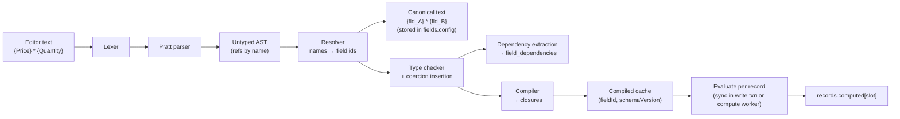

# 08 — Formula Engine

> **Status:** Proposed · **Owner:** Core Data team · **Conforms to:** [00 — Canonical Decisions](00-canonical-decisions.md) (D7, D8, §4, §13)
>
> **Sections covered:** Section 10 (Formula Engine) and original Part 5 (formula language, compiler, dependency graph, recomputation).
>
> Related: [06 — Record Storage](06-record-storage.md) (`computed`, `cell_meta.err`) · [07 — Field Engine](07-field-engine.md) (`FormulaTypeMapping`, `ComputedEvaluator`) · [09 — Linked Record Engine](09-linked-record-engine.md) (lookup/rollup, cross-record propagation) · [11 — Filter, Sort & Group](11-filter-sort-group.md) · [14 — Automations](14-automation-engine.md) (formula-like expressions in steps reuse this package) · [16 — Realtime](16-realtime.md) · [28 — Testing](28-testing-and-edge-cases.md)

---

## 0. Summary

**[Ours]** `@tabula/formula` is an isomorphic TypeScript package: **hand-written lexer → Pratt parser → AST → name resolution → static type checker → compiler to JS closures**. It never uses `eval`/`new Function`, never executes user JavaScript, and every function is pure (the clock is injected). The server is authoritative and **materializes** results into `records.computed` (D7); the browser uses the same package for editor validation, type display and instant preview.

Formulas reference fields **by field id** in stored form (`{fld_7Hk…}`), and by **name** only in the editor, so renames never break formulas. A **field-level dependency graph** (`field_dependencies`) drives cycle detection, topological recomputation order and record-level propagation through links.



---

## 1. Design goals

1. **Familiar spreadsheet-style surface** (infix operators, `IF(...)`, `&` concat) with **our own** function names, signatures and semantics, documented here.
2. **Static typing**: result type known at save time (drives display, sort, filter, sidecars — [07](07-field-engine.md) delegates to it). Type errors are reported in the editor with spans, not discovered at runtime.
3. **Determinism**: same inputs + same clock bucket ⇒ same output on server and client (except time-zone database differences, §7.3).
4. **Safety**: bounded time, memory, recursion, output size; linear-time regex; no host access.
5. **Incrementality**: recompute only what changed, stop propagating when values are unchanged.

---

## 2. Lexer

### 2.1 Tokens

| Token | Pattern / examples | Notes |
|---|---|---|
| `NUMBER` | `0`, `12.5`, `.5`, `1e-3`, `1_000` | `_` digit separators allowed; parsed as **decimal text** first, materialized as `number` or `Decimal` by the type checker (§7) |
| `STRING` | `"Hello \"x\""`, `'it''s'` | double-quoted with `\"`, `\\`, `\n`, `\t`, `\u{…}`; single-quoted with doubled `''` |
| `FIELD_REF` | `{Price}`, `{Unit price (USD)}`, `{fld_7HkQ…}` | brace-delimited; inside: `\}` and `\\` escapes; editor form = name, canonical form = `fld_` public id |
| `IDENT` | `IF`, `sum`, `x` | function names are case-insensitive (`sum` = `SUM`); local names (LET/lambda params) are case-sensitive, `[A-Za-z_][A-Za-z0-9_]*` |
| `TRUE` / `FALSE` | `TRUE`, `false` | case-insensitive keywords |
| Operators | `+ - * / ^ & = == != <> < <= > >= && \|\| ! =>` | `==` alias of `=`; `<>` alias of `!=` |
| Punctuation | `( ) , [ ]` | `[` `]` array literals |
| `WS` / `COMMENT` | spaces, newlines, `/* … */`, `// …` | comments preserved in canonical text (editor round trip) |
| `EOF` | | |

```ts
export interface Token {
  kind: 'NUMBER' | 'STRING' | 'FIELD_REF' | 'IDENT' | 'TRUE' | 'FALSE' | 'OP' | 'PUNCT' | 'EOF';
  text: string;              // raw slice
  value?: string;            // unescaped string / ref content / number text
  start: number; end: number;  // UTF-16 offsets into source (editor diagnostics)
}
```

The lexer is a single-pass hand-written scanner (`O(n)`), with a hard cap of `MAX_FORMULA_LENGTH` = 16,000 characters and 4,000 tokens. Unterminated strings/refs produce a `LexError` with span; the editor still gets a partial token stream for highlighting.

---

## 3. Grammar and field references

### 3.1 EBNF

```ebnf
formula        = expression EOF ;
expression     = lambda ;
lambda         = IDENT "=>" lambda                       (* x => x * 2 ; only valid as a function argument *)
               | "(" [ IDENT { "," IDENT } ] ")" "=>" lambda
               | logical_or ;
logical_or     = logical_and { "||" logical_and } ;
logical_and    = equality { "&&" equality } ;
equality       = relational { ( "=" | "==" | "!=" | "<>" ) relational } ;
relational     = concat { ( "<" | "<=" | ">" | ">=" ) concat } ;
concat         = additive { "&" additive } ;
additive       = multiplicative { ( "+" | "-" ) multiplicative } ;
multiplicative = unary { ( "*" | "/" ) unary } ;
unary          = ( "-" | "+" | "!" ) unary | power ;
power          = postfix [ "^" unary ] ;                 (* right-assoc; -2^2 = -(2^2) *)
postfix        = primary { "[" expression "]" } ;        (* array index, 1-based *)
primary        = NUMBER | STRING | TRUE | FALSE
               | FIELD_REF
               | IDENT "(" [ arguments ] ")"             (* function call *)
               | IDENT                                    (* local name bound by LET / lambda *)
               | "(" expression ")"
               | "[" [ arguments ] "]" ;                  (* array literal *)
arguments      = expression { "," expression } [ "," ] ;
```

The EBNF documents the language; the implementation is a Pratt parser (§4) whose binding powers encode exactly this precedence.

### 3.2 Field references are stored by id

| Form | Example | Where |
|---|---|---|
| **Editor form** | `{Price} * {Quantity}` | what users type/see; names resolved against the table schema |
| **Canonical (stored) form** | `{fld_7HkQ2…} * {fld_9aZt1…}` | `fields.config.expression`; public field ids (base62 of uuid, spine §3) |
| **AST form** | `{ kind: 'field', fieldId: '0192f3…' }` | internal uuid after decoding |

Conversion is via the AST, never via string substitution:

```ts
export function toCanonical(editorText: string, schema: TableSchemaView): Result<string, Diagnostic[]> {
  const ast = parse(editorText);                         // refs carry the raw name
  const resolved = resolveNames(ast, schema);            // name → fieldId (exact, then case-insensitive unique)
  return print(resolved, { refStyle: 'id' });            // preserves comments & whitespace via token trivia
}
export function toEditor(canonical: string, schema: TableSchemaView): string {
  return print(resolveIds(parse(canonical), schema), { refStyle: 'name' });   // names escaped: } → \}
}
```

* **Rename-safe**: canonical text never contains names.
* **Deleted field**: the ref keeps the id; the editor shows `{⚠ deleted field}`; the type checker yields `#REF` (§8) and the field is flagged `invalid`; restoring the field restores the formula with no edit.
* **Ambiguous names** (two fields differing only in case) require exact case; the editor autocompletes by inserting the exact name.
* **Cross-table values** are only reachable through lookup/rollup fields or link fields (a link field ref yields the linked records' primary display values) — there is no `{Table.Field}` syntax. This keeps every dependency expressible as a field-graph edge.

---

## 4. Parser and AST

### 4.1 Pratt binding powers

| Precedence (low → high) | Operators | Assoc. | Left bp | Notes |
|---|---|---|---|---|
| 1 | `=>` (lambda) | right | 5 | only parsed in argument position |
| 2 | `\|\|` | left | 10 | short-circuit |
| 3 | `&&` | left | 20 | short-circuit |
| 4 | `=` `==` `!=` `<>` | left | 30 | |
| 5 | `<` `<=` `>` `>=` | left | 40 | non-chaining: `a < b < c` is a parse error (diagnostic suggests `AND`) |
| 6 | `&` | left | 50 | string concatenation |
| 7 | `+` `-` | left | 60 | |
| 8 | `*` `/` | left | 70 | |
| 9 | prefix `-` `+` `!` | — | (rbp 75) | binds looser than `^` |
| 10 | `^` | right | 80 | `2^3^2 = 2^(3^2)` |
| 11 | postfix `[ ]`, call `( )` | left | 90 | |

```ts
// @tabula/formula/src/parser.ts (core loop)
function parseExpr(p: Parser, minBp: number): Node {
  let tok = p.next();
  let lhs = nud(p, tok);                               // prefix position: literal, ref, call, (, [, unary
  for (;;) {
    const op = p.peek();
    const bp = infixBp(op);                            // 0 for non-operators
    if (bp <= minBp) break;
    p.next();
    if (op.text === '[') { const idx = parseExpr(p, 0); p.expect(']'); lhs = node('index', [lhs, idx], op); continue; }
    const rbp = op.text === '^' ? bp - 1 : bp;         // right-assoc for ^
    const rhs = parseExpr(p, rbp);
    lhs = node('binary', { op: normalizeOp(op.text), left: lhs, right: rhs }, op);
    if (++p.depth > MAX_FORMULA_DEPTH) throw p.error('FORMULA_TOO_DEEP', op);
  }
  return lhs;
}
```

Depth is tracked on recursion (both nesting of calls/parentheses and operator chains) and capped at `MAX_FORMULA_DEPTH` = 64 (spine §13). The parser does **error recovery** for the editor: on an unexpected token it records a diagnostic, inserts an `error` node, and resynchronizes at `,` or `)`, so multiple errors can be shown at once.

### 4.2 AST node types

```ts
export type Span = { start: number; end: number };

export type Node =
  | { kind: 'number';  text: string; span: Span }                          // decimal text, exact
  | { kind: 'string';  value: string; span: Span }
  | { kind: 'bool';    value: boolean; span: Span }
  | { kind: 'field';   fieldId: Uuid | null; rawName?: string; span: Span } // null when unresolved
  | { kind: 'local';   name: string; span: Span }                          // LET / lambda binding
  | { kind: 'array';   items: Node[]; span: Span }
  | { kind: 'unary';   op: '-' | '+' | '!'; arg: Node; span: Span }
  | { kind: 'binary';  op: BinaryOp; left: Node; right: Node; span: Span }
  | { kind: 'call';    fn: string /* upper-cased */; args: Node[]; span: Span }
  | { kind: 'lambda';  params: string[]; body: Node; span: Span }
  | { kind: 'index';   target: Node; index: Node; span: Span }
  | { kind: 'error';   message: string; span: Span };                      // parser recovery

export type BinaryOp = '+' | '-' | '*' | '/' | '^' | '&' | '=' | '!=' | '<' | '<=' | '>' | '>=' | '&&' | '||';

/** After type checking every node is annotated; implicit coercions become explicit nodes. */
export type TypedNode = Node & { ty: FType } | { kind: 'coerce'; to: FType; arg: TypedNode; ty: FType; span: Span };
```

### 4.3 Example ASTs (JSON, spans omitted)

**`{Price} * {Quantity}`**

```json
{ "kind": "binary", "op": "*",
  "left":  { "kind": "field", "fieldId": "0192f3c1-…-price" },
  "right": { "kind": "field", "fieldId": "0192f3c1-…-qty" } }
```

After type checking (Price = currency USD scale 2, Quantity = number):

```json
{ "kind": "binary", "op": "*", "ty": { "t": "currency", "code": "USD", "scale": 2 },
  "left":  { "kind": "field", "fieldId": "…price", "ty": { "t": "currency", "code": "USD", "scale": 2 } },
  "right": { "kind": "coerce", "to": { "t": "currency", "code": "USD", "scale": 2 },
             "arg": { "kind": "field", "fieldId": "…qty", "ty": { "t": "number" } } } }
```

**Nested IF:** `IF({Score} >= 90, "A", IF({Score} >= 80, "B", "C"))`

```json
{ "kind": "call", "fn": "IF", "args": [
  { "kind": "binary", "op": ">=", "left": { "kind": "field", "fieldId": "…score" }, "right": { "kind": "number", "text": "90" } },
  { "kind": "string", "value": "A" },
  { "kind": "call", "fn": "IF", "args": [
    { "kind": "binary", "op": ">=", "left": { "kind": "field", "fieldId": "…score" }, "right": { "kind": "number", "text": "80" } },
    { "kind": "string", "value": "B" },
    { "kind": "string", "value": "C" } ] } ] }
```

**Concatenation with `&`:** `{First} & " " & UPPER({Last})` (left-associative)

```json
{ "kind": "binary", "op": "&",
  "left": { "kind": "binary", "op": "&",
            "left": { "kind": "field", "fieldId": "…first" },
            "right": { "kind": "string", "value": " " } },
  "right": { "kind": "call", "fn": "UPPER", "args": [ { "kind": "field", "fieldId": "…last" } ] } }
```

**Date functions:** `DATE_DIFF(TODAY(), {Due}, "day") > 7`

```json
{ "kind": "binary", "op": ">",
  "left": { "kind": "call", "fn": "DATE_DIFF", "args": [
            { "kind": "call", "fn": "TODAY", "args": [] },
            { "kind": "field", "fieldId": "…due" },
            { "kind": "string", "value": "day" } ] },
  "right": { "kind": "number", "text": "7" } }
```

**Lookup/array functions:** `ARRAY_JOIN(FILTER({Line item amounts}, x => x > 100), ", ")` where *Line item amounts* is a lookup (`array<currency>`):

```json
{ "kind": "call", "fn": "ARRAY_JOIN", "args": [
  { "kind": "call", "fn": "FILTER", "args": [
    { "kind": "field", "fieldId": "…lookup_amounts" },
    { "kind": "lambda", "params": ["x"],
      "body": { "kind": "binary", "op": ">", "left": { "kind": "local", "name": "x" }, "right": { "kind": "number", "text": "100" } } } ] },
  { "kind": "string", "value": ", " } ] }
```

---

## 5. Type system

### 5.1 Types

```ts
export type FType =
  | { t: 'number' }                                  // IEEE-754 double
  | { t: 'currency'; code: string; scale: number }   // exact decimal (decimal.js)
  | { t: 'percent' }                                 // number, displayed ×100
  | { t: 'text' }
  | { t: 'bool' }
  | { t: 'date' }                                    // Temporal.PlainDate (calendar date)
  | { t: 'datetime' }                                // Temporal.Instant
  | { t: 'duration' }                                // seconds (number)
  | { t: 'array'; of: FType }
  | { t: 'record_ref'; tableId: Uuid }               // link elements (display = primary value)
  | { t: 'blank' }                                   // the literal BLANK() / empty-only expression
  | { t: 'error' }                                   // expression statically always errors (e.g. #REF)
  | { t: 'any' };                                    // json-derived values (JSON_GET); checked at runtime

// runtime values
export type FValue =
  | number | Decimal | string | boolean | Temporal.PlainDate | Temporal.Instant
  | { dur: number } | FValue[] | { ref: Uuid; title: string } | typeof BLANK | FError;
export const BLANK: unique symbol = Symbol.for('tabula.formula.blank');
export class FError { constructor(readonly code: ErrorCode, readonly detail?: string) {} }
```

Field references are typed through each field type's `formula.ftype(config)` ([07 §3.10](07-field-engine.md)): `single_select` → `text`, `multi_select` → `array<text>`, `link` → `array<record_ref>` (used as `array<text>` of primary values in text contexts), `lookup` → `array<T>`, `checkbox` → `bool`, `rating` → `number`, `attachment` → `array<text>` (filenames), etc.

### 5.2 Operator typing and implicit coercions

| Expression | Operand types | Result | Rule |
|---|---|---|---|
| `a + b`, `a - b` | number, number | number | |
| | currency(c), currency(c) | currency(c, max scale) | same code required, else **type error** `CURRENCY_MISMATCH` |
| | currency, number | currency | number coerced to Decimal (exact from shortest round-trip repr) |
| | date ± number | date | days |
| | datetime ± duration | datetime | |
| | datetime ± number | datetime | number = days (fractional allowed) |
| | date − date | number | days |
| | datetime − datetime | duration | seconds |
| | duration ± duration | duration | |
| `a * b` | number × number | number | |
| | currency × number (either order) | currency | |
| | duration × number | duration | |
| | currency × currency | **type error** | (units) |
| `a / b` | number / number | number | `#DIV_ZERO` on 0 |
| | currency / number | currency | rounded at 34 significant digits, half-even |
| | currency(c) / currency(c) | number | ratio |
| | duration / duration | number | |
| `a ^ b` | number, number | number | `#NUM` on NaN/∞ |
| `a & b` | any scalar, any scalar | text | implicit `TEXT()` using the *formula field's* locale-independent canonical formatting (numbers: shortest repr; dates: ISO); arrays joined with `", "` |
| `=` `!=` | same family | bool | number/currency/percent/duration compare numerically; text **case-sensitive** (use `LOWER` or `EQUALS_IGNORE_CASE`); date vs datetime ⇒ datetime truncated to date in formula tz |
| `<` `<=` `>` `>=` | numeric family, text (collation `und`, case-sensitive binary for determinism), date/datetime | bool | mixing text with number = **type error** |
| `&&` `\|\|` `!` | bool (numbers: ≠0; text: non-empty — via explicit `coerce` node, warning in editor) | bool | short-circuit |
| `bool` in arithmetic | | number | TRUE = 1, FALSE = 0 |
| `array<T>` in scalar arithmetic | | **type error** | must aggregate (`SUM`, `ARRAY_FIRST`…) |

`text → number` is **never implicit**; use `VALUE()`. This is a deliberate departure from lenient spreadsheet coercion: it surfaces bugs at save time.

### 5.3 Function signatures and overloads

```ts
export interface FnSig {
  params: ParamSpec[];                  // types may use generic T
  variadic?: ParamSpec;                 // repeated tail parameter
  result: FType | ((args: FType[]) => FType);
  lazy?: number[];                      // argument indexes evaluated lazily (IF, IFERROR, SWITCH, AND/OR)
  volatile?: 'minute' | 'day';
  meta?: 'record_id' | 'created_time' | 'modified_time' | 'row_number';
}
export interface FnDef { name: string; category: FnCategory; overloads: FnSig[]; impl: FnImpl; doc: FnDoc }
```

Overload resolution: first overload whose parameters accept the argument types with the fewest coercions; ties = ambiguity error. Generic `T` unifies across parameters (e.g. `IF(bool, T, T) → T`; if branches are `number` and `currency(USD)`, `T` widens to currency; `text` vs `number` ⇒ result `text` with a warning, the number branch formatted).

### 5.4 Type checker

```ts
export function check(ast: Node, env: TypeEnv): { typed: TypedNode; diagnostics: Diagnostic[]; resultType: FType } {
  // bottom-up; env maps fieldId → FType (from schema snapshot), local names → FType (LET / lambda)
}
```

* Unknown function / wrong arity / no matching overload ⇒ diagnostic with span and "did you mean".
* Unresolved or deleted field ⇒ node typed `error` with code `REF`; formula saves but is `invalid`.
* Result type → default **result format** (`fields.config.resultFormat`): number → number(precision auto ≤ 8), currency → currency(code, scale), date → date, text → text, bool → checkbox, array → shown as list; users may override format among compatible formats (e.g. number → percent/duration).
* Changing a referenced field's type re-runs the checker for all dependents ([06 §15](06-record-storage.md)); new type errors mark dependents `invalid` and recompute yields errors (`#TYPE`).

---

## 6. Function library (our catalogue)

Names are ours; many coincide with generic spreadsheet vocabulary (`SUM`, `IF`) because users expect them, but signatures, blank/error semantics and edge cases are defined here and nowhere else. `T` = generic; `num` = number family (number/currency/percent/duration, result keeps the family where meaningful).

### 6.1 Arithmetic & math

| Function | Signature | Notes |
|---|---|---|
| `SUM` | `(num…) → num`, `(array<num>) → num` | blanks ignored; currency codes must agree |
| `AVERAGE` | `(num…) / (array<num>) → num` | blanks ignored; no values ⇒ BLANK |
| `MIN`, `MAX` | `(T…) / (array<T>) → T` for num, date, datetime | |
| `ROUND`, `ROUND_UP`, `ROUND_DOWN` | `(num, digits=0) → num` | `ROUND` = half away from zero; digits may be negative |
| `FLOOR`, `CEILING` | `(num, step=1) → num` | |
| `ABS`, `SIGN`, `SQRT`, `EXP`, `LN`, `LOG` | `(number[, base]) → number` | `#NUM` outside domain |
| `POWER` | `(number, number) → number` | same as `^` |
| `MOD` | `(num, num) → num` | sign of divisor; `#DIV_ZERO` |
| `INT`, `TRUNC` | `(num) → num` | |
| `VALUE` | `(text) → number` | locale-independent parse (`.` decimal); `#VALUE` if unparseable |
| `CURRENCY` | `(number \| text, code) → currency` | explicit currency construction |

### 6.2 Text

| Function | Signature | Notes |
|---|---|---|
| `CONCAT` | `(T…) → text` | same as chained `&` |
| `LEN` | `(text) → number` | counts Unicode code points (not UTF-16 units) |
| `LOWER`, `UPPER`, `TRIM`, `PROPER` | `(text) → text` | locale-independent (root) case mapping |
| `LEFT`, `RIGHT` | `(text, n) → text` | code points |
| `MID` | `(text, start, count) → text` | 1-based |
| `FIND` | `(needle, haystack, start=1) → number` | 0 when not found (no error) |
| `CONTAINS` | `(haystack, needle) → bool` | case-sensitive; `CONTAINS_IGNORE_CASE` variant |
| `EQUALS_IGNORE_CASE` | `(text, text) → bool` | casefold + NFC |
| `SUBSTITUTE` | `(text, old, new, occurrence?) → text` | literal, not regex |
| `REPLACE_AT` | `(text, start, count, new) → text` | |
| `REPT` | `(text, n) → text` | output capped (§12) |
| `SPLIT` | `(text, sep) → array<text>` | |
| `TEXT` | `(T, format?) → text` | number/date patterns (`"0.00"`, `"YYYY-MM-DD"`), our own pattern language documented in the function reference |
| `ENCODE_URL_COMPONENT` | `(text) → text` | for `open_url` buttons |
| `JSON_GET` | `(text \| any, path) → any` | JSON pointer path; null-prototype objects (no `__proto__` traversal) |

### 6.3 Logical

| Function | Signature | Notes |
|---|---|---|
| `IF` | `(bool, T, T = BLANK) → T` | lazy branches |
| `SWITCH` | `(expr, case1, val1, …, default?) → T` | lazy; equality as `=` |
| `AND`, `OR` | `(bool…) → bool` | lazy, short-circuit |
| `NOT`, `XOR` | `(bool…) → bool` | |
| `ISBLANK` | `(T) → bool` | true for BLANK, `""`, `[]` |
| `ISERROR` | `(T) → bool` | lazy arg: catches errors |
| `IFERROR` | `(T, fallback: T) → T` | lazy |
| `ERROR` | `(message?) → error` | user error `#ERROR` |
| `BLANK` | `() → blank` | |
| `LET` | `(name, value, …, body) → T` | names bound once, evaluated once (memoized) |

### 6.4 Date & time

| Function | Signature | Notes |
|---|---|---|
| `TODAY` | `() → date` | **volatile: day** — in formula tz |
| `NOW` | `() → datetime` | **volatile: minute** (bucketed, §11.6) |
| `DATE` | `(y, m, d) → date` | `#VALUE` on invalid |
| `DATETIME` | `(date, h, m, s, tz?) → datetime` | local wall time in tz → instant ("compatible" DST disambiguation) |
| `YEAR`, `MONTH`, `DAY`, `WEEKDAY`, `WEEKNUM`, `HOUR`, `MINUTE`, `SECOND` | `(date \| datetime, tz?) → number` | datetime parts in formula tz unless `tz` given; `WEEKDAY` 1 = Monday (ISO) |
| `DATE_ADD` | `(date \| datetime, amount, unit) → same` | units `year|quarter|month|week|day|hour|minute|second`; month-end clamping (Jan 31 + 1 month = Feb 28/29) |
| `DATE_DIFF` | `(a, b, unit) → number` | `b − a` in whole units (truncated toward zero), calendar-aware for months/years |
| `DATE_TRUNC` | `(date \| datetime, unit, tz?) → same` | start of unit |
| `WORKDAY_ADD`, `WORKDAYS_BETWEEN` | `(date, n, holidays?: array<date>) → date / number` | Mon–Fri |
| `FORMAT_DATE` | `(date \| datetime, pattern, tz?) → text` | |
| `PARSE_DATE` | `(text, pattern?) → date`; `PARSE_DATETIME(text, pattern?, tz?) → datetime` | `#VALUE` on failure |
| `TO_TIMEZONE` | `(datetime, tz) → text` (formatted) | invalid tz ⇒ `#TZ` |
| `DURATION` | `(h, m=0, s=0) → duration` | |
| `IS_SAME`, `IS_BEFORE`, `IS_AFTER` | `(a, b, unit?) → bool` | unit-granular comparison |

### 6.5 Arrays (lookups, multi-selects, links)

| Function | Signature | Notes |
|---|---|---|
| `COUNT` | `(array<T>) → number` | non-blank numeric elements |
| `COUNTA` | `(array<T>) → number` | non-blank elements |
| `COUNT_ALL` | `(array<T>) → number` | all elements |
| `ARRAY_JOIN` | `(array<T>, sep=", ") → text` | |
| `ARRAY_UNIQUE`, `ARRAY_COMPACT`, `ARRAY_FLATTEN` | `(array<T>) → array<T>` | compact removes blanks; flatten one level |
| `ARRAY_FIRST`, `ARRAY_LAST` | `(array<T>) → T` | BLANK when empty |
| `ARRAY_SLICE` | `(array<T>, start, end?) → array<T>` | 1-based |
| `ARRAY_SORT` | `(array<T>, "asc" \| "desc") → array<T>` | comparator from element type |
| `ARRAY_CONTAINS` | `(array<T>, T) → bool` | |
| `MAP` | `(array<T>, x => U) → array<U>` | lambda |
| `FILTER` | `(array<T>, x => bool) → array<T>` | |
| `REDUCE` | `(array<T>, init: U, (acc, x) => U) → U` | |
| `SUM`/`MIN`/`MAX`/`AVERAGE` | accept arrays (6.1) | |

### 6.6 Regular expressions (RE2 semantics)

| Function | Signature | Notes |
|---|---|---|
| `REGEX_TEST` | `(text, pattern) → bool` | |
| `REGEX_EXTRACT` | `(text, pattern, group=0) → text` | first match |
| `REGEX_EXTRACT_ALL` | `(text, pattern) → array<text>` | ≤ 1,000 matches |
| `REGEX_REPLACE` | `(text, pattern, replacement) → text` | `$1` group refs |

Engine: **RE2 semantics only** (no backreferences, no lookaround) so matching is linear-time in input size. Server: `re2` (native RE2 binding); browser: `re2js` (linear-time JS port of RE2/J). Patterns are compiled once per (pattern literal) at compile time when the pattern is a constant; dynamic patterns are compiled at runtime through a bounded LRU (256 entries, pattern ≤ 1,000 chars). Invalid pattern ⇒ `#REGEX`.

### 6.7 Record metadata

| Function | Result | Dependency kind |
|---|---|---|
| `RECORD_ID()` | text (public `rec_…` id) | `record_meta: record_id` (never changes) |
| `ROW_NUMBER()` | number (autonumber) | `record_meta: row_number` |
| `CREATED_TIME()` | datetime | `record_meta: created_time` |
| `MODIFIED_TIME(field…?)` | datetime | `record_meta: modified_time` (+ value deps on listed fields via `cell_meta`) |
| `CREATED_BY()` / `MODIFIED_BY()` | text (user name) | `record_meta` |

---

## 7. Numeric precision and time

### 7.1 Numbers vs decimals

* `number`, `percent`, `duration` evaluate as IEEE-754 doubles. Display is rounded to the result format precision (≤ 8). Equality `=` on doubles compares after rounding both sides to **15 significant digits** (so `0.1 + 0.2 = 0.3` is TRUE, matching user expectations); ordering comparisons are exact.
* `currency` evaluates with **decimal.js** (`precision: 34`, `rounding: ROUND_HALF_EVEN`) — 34 significant digits, decimal128-like. Mixed currency × number converts the double via its shortest round-trip decimal string (`String(n)`), never via binary expansion. Final results are quantized to the result format scale with half-even rounding and stored as decimal strings (spine §4).
* Numeric literals are parsed as decimal text; the type checker materializes them as `Decimal` when they participate in currency arithmetic, otherwise as doubles.
* Overflow (`±Infinity`) or NaN ⇒ `#NUM`.

### 7.2 Integer and rounding functions

`ROUND` is half away from zero (spreadsheet expectation); storage normalization of `number` fields is half-even ([07 §8.3](07-field-engine.md)) — the two are distinct on purpose and documented; ROUND results are exactly representable after rounding, so storage normalization is a no-op for them.

### 7.3 Time zones

* Each formula field has `config.timeZone` (default: base time zone). It governs `TODAY()`, extraction functions on `datetime`, date/datetime comparisons and implicit datetime→date truncation.
* Values: `date` = `Temporal.PlainDate`, `datetime` = `Temporal.Instant`. Implementation uses the TC39 Temporal API (native where available, else `@js-temporal/polyfill`).
* Server uses Node's bundled ICU tz data (pinned per release); browsers use their own — rare tz-rule divergences can make a client preview differ from the authoritative server value (accepted; server wins).
* DST: wall-clock to instant conversion uses `disambiguation: 'compatible'` (gap ⇒ shift forward, overlap ⇒ earlier).

---

## 8. Errors and blank semantics

### 8.1 Error values

| Code (display) | Cause |
|---|---|
| `#REF` | reference to a deleted/inaccessible field |
| `#TYPE` | runtime type mismatch (e.g. `any` from `JSON_GET` used as number), or formula invalid after a dependency's type change |
| `#DIV_ZERO` | division or `MOD` by zero |
| `#NUM` | NaN/∞, domain error (`SQRT(-1)`), numeric overflow |
| `#VALUE` | invalid argument value (unparseable `VALUE("abc")`, invalid date) |
| `#REGEX` | invalid or over-limit regex pattern |
| `#TZ` | unknown time zone |
| `#LIMIT` | step/time/output budget exceeded (§12) |
| `#CYCLE` | defensive: a cycle reached at runtime (should be impossible — config-time detection) |
| `#ERROR` | user-raised `ERROR(message)` |

* **Propagation:** any operator or eager function receiving an `FError` returns it (the leftmost error in evaluation order wins). Lazy functions (`IF`, `IFERROR`, `ISERROR`, `SWITCH`, `AND`, `OR`) evaluate only what they need; `IFERROR(x, y)` catches all codes except `#LIMIT` (budgets cannot be bypassed).
* **Storage:** errors are not written to `computed[slot]`; the slot is absent and `cell_meta[slot].err = "<CODE>"` ([06 §11.3–11.4](06-record-storage.md)). Filters therefore treat errored cells as empty ([11 §4.2](11-filter-sort-group.md)). Dependents reading an errored field receive the `FError` (reconstructed from `cell_meta.err`), so propagation survives materialization.
* **API:** `cellFormat=json` → `{ "error": "#DIV_ZERO" }`; string → `"#DIV_ZERO"`.

### 8.2 Blank semantics

`BLANK` is the runtime value of an empty cell (key absent) and of `BLANK()`.

| Context | Behaviour |
|---|---|
| `+ -` with one blank operand | blank treated as 0 (`{Price} + {Tax}` with blank Tax = Price) |
| `+ -` with both blank | BLANK |
| `*` `/` with a blank operand | blank treated as 0 for `*` (result 0); `x / BLANK` ⇒ `#DIV_ZERO`; `BLANK / x` = 0 |
| `&` / `CONCAT` | blank ⇒ `""` |
| `=` / `!=` | `BLANK = BLANK` TRUE; `BLANK = ""` TRUE; `BLANK = 0` **FALSE** (deliberate: empty is not zero); `BLANK = FALSE` FALSE |
| `<` `>` … | any blank operand ⇒ FALSE |
| boolean context (`IF`, `AND`) | BLANK ⇒ FALSE |
| aggregates `SUM/AVERAGE/MIN/MAX/COUNT` | blanks ignored |
| date functions with blank date | BLANK (not an error) |
| text functions (`LEN`, `UPPER`) | blank behaves as `""` (`LEN(BLANK) = 0`, `UPPER(BLANK) = ""` ⇒ stored as empty) |
| Final result `""`, `[]`, BLANK | stored as **absent** (spine §4); `0`/`FALSE` results are stored (numbers/bools are values) except a `checkbox` result format where FALSE ⇒ absent |

---

## 9. Dependencies

### 9.1 Extraction

```ts
export function extractDependencies(typed: TypedNode, field: FieldDef, schema: SchemaSnapshot): {
  decls: DependencyDecl[];                 // 07 §3.7
  volatility: 'none' | 'minute' | 'day';
} {
  // walk AST:
  //  field ref to same-table field F                  → { dependsOn: F, kind: 'same_record' }
  //  ref to a link field L                            → { dependsOn: L, kind: 'same_record' }        (membership)
  //                                                     + { dependsOn: primary(target(L)), via: L, kind: 'via_link' }
  //  meta functions (CREATED_TIME…)                   → { kind: 'record_meta', metaKey }
  //  TODAY() → 'day', NOW() → 'minute' (max wins)
}
```

Lookup/rollup/count declare their own dependencies ([07 §8.22–8.24](07-field-engine.md)): `{dependsOn: targetField, via: linkField, kind: 'via_link'}` + `{dependsOn: linkField, kind: 'same_record'}`; a rollup's `filter` adds value dependencies on filtered target fields.

### 9.2 `field_dependencies` (fragment, as in [05](05-sql-schema.md))

```sql
CREATE TABLE data.field_dependencies (
  id                   uuid        PRIMARY KEY DEFAULT public.uuidv7(),
  workspace_id         uuid        NOT NULL,
  base_id              uuid        NOT NULL REFERENCES data.bases(id) ON DELETE CASCADE,
  field_id             uuid        NOT NULL REFERENCES data.fields(id) ON DELETE CASCADE,   -- the computed (dependent) field
  depends_on_field_id  uuid        NOT NULL REFERENCES data.fields(id) ON DELETE CASCADE,
  via_link_field_id    uuid        REFERENCES data.fields(id) ON DELETE CASCADE,            -- link field in field_id's table
  kind                 text        NOT NULL CHECK (kind IN ('same_record','via_link','record_meta')),
  created_at           timestamptz NOT NULL DEFAULT now(),
  CHECK (field_id <> depends_on_field_id),
  CHECK ((kind = 'via_link') = (via_link_field_id IS NOT NULL))
);
CREATE UNIQUE INDEX field_dependencies_edge_uq ON data.field_dependencies (field_id, depends_on_field_id, via_link_field_id) NULLS NOT DISTINCT;
CREATE INDEX field_dependencies_reverse_idx ON data.field_dependencies (depends_on_field_id);   -- "who depends on F?"
CREATE INDEX field_dependencies_base_idx    ON data.field_dependencies (base_id);
```

Mapping from `DependencyDecl` ([07 §3.7](07-field-engine.md)): same-table value refs and link-membership refs → `same_record`; values read through a link → `via_link`; meta functions → `record_meta` with `depends_on_field_id` = the table's corresponding system field when one exists (`created_time`, `modified_time`, `autonumber`), otherwise the edge is kept only in the in-memory snapshot (`RECORD_ID()` never changes, so it needs no edge).

Rows are replaced atomically (delete + insert) in the same transaction as the field config change, together with `schema_version++`. The **schema snapshot** (Redis `schema:{baseId}:{schemaVersion}`) contains the whole base graph in memory: forward/reverse adjacency, the global topological order and per-field depth.

### 9.3 Cycle detection and depth limit

On create/update of a computed field `X` with new dependency set `D`:

```ts
function validateGraph(graph: FieldGraph, x: Uuid, newDeps: Uuid[]): GraphIssue[] {
  // 1. Cycle: X must not be reachable from any of its new dependencies along "depends_on" edges.
  //    Equivalently: none of newDeps is a (transitive) dependent of X.
  const dependentsOfX = reverseReachable(graph, x);            // BFS over reverse edges, O(V + E)
  const cyc = newDeps.find(d => d === x || dependentsOfX.has(d));
  if (cyc) return [{ code: 'CIRCULAR_REFERENCE', path: shortestPath(graph, cyc, x) }];
  // 2. Depth: longest dependency chain through X ≤ MAX_DEPENDENCY_CHAIN (32)
  const depthIn  = 1 + Math.max(0, ...newDeps.map(d => graph.depth(d)));      // longest path from sources
  const depthOut = graph.heightBelow(x);                                       // longest path to sinks via dependents
  if (depthIn + depthOut > MAX_DEPENDENCY_CHAIN) return [{ code: 'DEPENDENCY_CHAIN_TOO_DEEP' }];
  return [];
}
```

* The graph is **base-wide** (edges cross tables through links), so cross-table cycles (A.lookup → B.rollup → A.formula → A.lookup) are detected.
* We reject **field-level** cycles even when record-level data might be acyclic (e.g. a self-linked hierarchy where a lookup of the parent's own lookup field would terminate at the root). Rationale: record-level cycle detection at runtime is expensive, data-dependent (adding one link could create a cycle in someone else's computation) and non-deterministic under concurrency. Users model hierarchies with explicit per-level fields. [Observed] comparable products also reject circular formula references.
* Complexity: `O(V + E)` per change with V ≤ 500 × 500 fields worst case (typ. < 2,000), E ≤ 10 × V — sub-millisecond to a few ms. Tarjan SCC over the whole graph runs in CI-style integrity checks (nightly verifier) to detect corrupted graphs.

### 9.4 Topological order

Kahn's algorithm over the base graph at snapshot build produces `topoIndex(field)`; the compute engine processes affected (table, field) pairs in ascending `topoIndex`, guaranteeing a dependency is final before its dependents are evaluated, across tables.

---

## 10. Compilation to closures

### 10.1 Shape

```ts
export interface EvalEnv {
  inputs: FValue[];                  // same-record inputs, indexed by compile-time slot index
  linked: LinkedValues;              // 07 §3.7 (lookups through link fields)
  record: { id: Uuid; publicId: string; rowNumber: number; createdAt: Temporal.Instant; updatedAt: Temporal.Instant };
  now: Temporal.Instant;             // bucketed for volatile formulas
  tz: string;
  budget: { steps: number; deadline: number };   // decremented by every node
  locals: FValue[];                  // LET / lambda frames (index-addressed, no name lookups)
}

export type Compiled = (env: EvalEnv) => FValue;

export interface CompiledFormula {
  fieldId: Uuid;
  schemaVersion: number;
  resultType: FType;
  inputFieldIds: Uuid[];             // inputs[i] ↔ inputFieldIds[i]
  links: { linkFieldId: Uuid; targetFieldIds: Uuid[] }[];
  volatility: 'none' | 'minute' | 'day';
  run: Compiled;
}
```

### 10.2 Compiler (excerpt)

```ts
function compile(n: TypedNode, cx: CompileCtx): Compiled {
  switch (n.kind) {
    case 'number': { const v = cx.literal(n);  return () => v; }               // constant folded
    case 'string': { const v = n.value;        return () => v; }
    case 'field': {
      const i = cx.inputIndex(n.fieldId!);                                       // resolved once
      return (env) => { tick(env); return env.inputs[i]; };
    }
    case 'coerce': return coercer(n.to, n.arg.ty)(compile(n.arg, cx));
    case 'binary': {
      const l = compile(n.left, cx), r = compile(n.right, cx);
      const op = BINARY_IMPLS[n.op][typeKey(n.left.ty, n.right.ty)];           // chosen statically by types
      if (n.op === '&&') return (env) => { const a = l(env); if (isErr(a)) return a; return truthy(a) ? toBool(r(env)) : false; };
      return (env) => {
        tick(env);
        const a = l(env); if (a instanceof FError) return a;
        const b = r(env); if (b instanceof FError) return b;
        return op(a, b, env);                                                    // blank rules inside op (§8.2)
      };
    }
    case 'call': {
      const fn = cx.functions.get(n.fn)!; const sig = cx.resolvedSig(n);
      const args = n.args.map((a) => compile(a, cx));
      if (sig.lazy) return (env) => { tick(env); return fn.impl.lazy!(args, env); };
      if (args.every(isConstant) && !sig.volatile) { const v = fn.impl.eager(args.map(a => a(EMPTY_ENV)), EMPTY_ENV); return () => v; } // fold
      return (env) => {
        tick(env);
        const vals = new Array(args.length);
        for (let k = 0; k < args.length; k++) { const v = args[k](env); if (v instanceof FError && !fn.acceptsErrors) return v; vals[k] = v; }
        return fn.impl.eager(vals, env);
      };
    }
    // … unary, array, index, lambda (closure over env.locals frame), local
  }
}

function tick(env: EvalEnv): void {
  if (--env.budget.steps < 0) throw LIMIT_STEPS;                                // caught at top → #LIMIT
  if ((env.budget.steps & 1023) === 0 && performance.now() > env.budget.deadline) throw LIMIT_TIME;
}
```

Properties: no string → code generation, no dynamic property access on user-controlled names, operator implementations selected at compile time from static types (no per-row type dispatch on the hot path), constant folding, LET values memoized per evaluation.

Measured target: `{Price} * {Quantity}` ≈ 0.2–0.5 µs per record; typical 10-node formulas < 2 µs; compile ≈ 30–100 µs.

### 10.3 Compiled-formula cache

* **Primary key** `(fieldId, schemaVersion)` — in-process LRU (10k entries per process).
* **Secondary, content-addressed key** `sha256(canonicalExpression + signature(types of referenced fields) + timeZone + resultFormat)` — so a schema bump caused by an unrelated change (e.g. a new field elsewhere in the base) re-keys the primary entry to the already compiled closure without recompiling.
* Invalidation is implicit: a new `schemaVersion` misses the primary key; stale entries age out of the LRU.

---

## 11. Runtime computation

### 11.1 Where evaluation happens (D7)

| Trigger | Where | Bound |
|---|---|---|
| Record create/update affecting same-record computed fields | **synchronously** in the write transaction (topological over that record's affected fields) | always |
| Cross-record propagation (lookup/rollup/count/formula-over-lookup on linked records) | synchronously if total affected records ≤ `COMPUTE_SYNC_FANOUT_LIMIT` (500), else `computed_stale` + `compute` queue | [09 §9](09-linked-record-engine.md) |
| Field created / formula changed | backfill: sync if table ≤ `SYNC_CONVERT_LIMIT` (5,000) records, else `long_operation` on `compute` queue | |
| Volatile buckets | scheduler → `compute` queue | §11.6 |
| `ai_generated` | always async (`ai` queue) | [21](21-ai-architecture.md) |

### 11.2 Incremental same-record recompute

```ts
function recomputeRecord(rec: MutableRecord, changedFieldIds: Set<Uuid>, snap: SchemaSnapshot, env: EvalEnvFactory): ComputedPatch {
  const patch: ComputedPatch = { set: {}, clear: [], errors: {} };
  const dirty = new Set(changedFieldIds);
  for (const f of snap.computedFieldsInTopoOrder(rec.tableId)) {             // same-table only, precomputed list
    if (!snap.sameRecordDeps(f.id).some((d) => dirty.has(d))) continue;      // not affected
    const cf = cache.get(f, snap);
    const before = rec.computedValue(f);
    const after = runSafely(cf, env.forRecord(rec, cf));                     // catches budget throws → #LIMIT
    const stored = registry.get(cf.resultFieldType).formula.fromFormula!(after, ctxFor(f));
    if (!equalsStored(before, stored)) {                                     // equality cutoff
      applyToPatch(patch, f, stored);
      rec.setComputed(f, stored);                                            // later fields see new value
      dirty.add(f.id);                                                       // propagate further
    }
  }
  return patch;
}
```

**Equality cutoff** stops propagation when a recomputed value is unchanged (e.g. editing Notes doesn't touch formulas; editing Quantity from 2 to 2.0 changes nothing downstream).

### 11.3 Cross-record propagation (summary; algorithm in [09 §9](09-linked-record-engine.md))

After the same-record pass, the engine collects `(field g in table T, changed record set R)` and, for every dependent edge `X depends on g via link L` (X in table U), finds the records of U linked to any r ∈ R via L's relation, recomputes X for them (same-record pass on those records with `changed = {X}`), and repeats in global topological order. Link membership changes (`link_add/remove`) mark the link field's slot changed on both endpoint records, which dirties every computed field with a `same_record` edge on that link field. A shared **fan-out budget** of 500 records across all hops decides sync vs deferred.

### 11.4 Deferred recompute (`computed_stale` + `compute` queue)

```sql
-- as in 05
CREATE TABLE data.computed_stale (
  table_id      uuid        NOT NULL,
  record_id     uuid        NOT NULL,
  field_id      uuid        NOT NULL,
  workspace_id  uuid        NOT NULL,
  base_id       uuid        NOT NULL,
  reason        text        NOT NULL CHECK (reason IN ('fanout','volatile','backfill','conversion','retry')),
  cause_seq     bigint,                 -- base change_seq that made it stale
  attempts      smallint    NOT NULL DEFAULT 0,
  last_error    text,
  enqueued_at   timestamptz NOT NULL DEFAULT now(),
  PRIMARY KEY (table_id, record_id, field_id)
) WITH (fillfactor = 70, autovacuum_vacuum_scale_factor = 0.0, autovacuum_vacuum_threshold = 1000);
CREATE INDEX computed_stale_queue_idx ON data.computed_stale (base_id, enqueued_at);
```

* Insert with `ON CONFLICT DO NOTHING` (idempotent; marking twice is free). One BullMQ job per (table, field) "stale batch" is enqueued with a dedupe job id, so 100k stale rows ⇒ a few jobs, not 100k.
* Worker loop: claim up to 500 rows of one (table, field) `ORDER BY enqueued_at FOR UPDATE SKIP LOCKED`, load inputs in bulk (one `SELECT … WHERE id = ANY` + one links query per link dependency), evaluate, write with one `UPDATE … FROM unnest(...)`, delete claimed stale rows, append one `base_changes` batch (`record.computed_updated`) so clients update, cascade further (dependents of the field become stale for affected records), all in one transaction. Batch time budget 2 s.
* Readers: grid/API return stored (possibly stale) values; `returnStaleness=true` adds `stale: true`; realtime clients show a subtle indicator.
* Ordering: workers process stale rows field by field in `topoIndex` order per base (a field's job yields if any upstream field of the same base has pending stale rows for overlapping records — prevents computing on stale inputs, avoids double work).

### 11.5 Batching on writes

Batch writes (1,000 records) evaluate formulas for all records in a tight loop per field (column-at-a-time over the batch), reusing the compiled closure and a pooled `EvalEnv`; cross-record propagation is computed once per batch with the union of changes.

### 11.6 Volatile formulas

| Volatility | Bucket | Refresh |
|---|---|---|
| `day` (`TODAY()`) | local date in the formula's tz | scheduler fires at local midnight per (base, tz) + hourly safety sweep; recompute all records of fields marked `day` |
| `minute` (`NOW()`) | `floor(now / 15 min)` (plan-configurable 5–60 min) | scheduler enqueues refresh per bucket |

* Evaluation uses `env.now` = bucket start, so all records in a refresh see the same `NOW()`.
* Cost guard: tables > 200,000 records with `minute` volatile fields refresh hourly; the field editor warns about volatility and table size.
* Only records whose value actually changes are written (equality cutoff), which for `DATE_DIFF(TODAY(), …)` is every record daily, but for `IF(TODAY() > {Due}, "Late", "")` only those crossing the threshold.
* Views filtering on volatile formulas are therefore accurate to the bucket; documented behaviour.

---

## 12. Limits and sandboxing

| Limit | Value | On violation |
|---|---|---|
| `MAX_FORMULA_LENGTH` | 16,000 chars | save rejected |
| Tokens / AST nodes | 4,000 / 4,000 | save rejected |
| `MAX_FORMULA_DEPTH` (AST nesting) | 64 | save rejected (`FORMULA_TOO_DEEP`) |
| `MAX_DEPENDENCY_CHAIN` | 32 | save rejected |
| Function arguments | 255 | save rejected |
| Step budget per (record, field) | 100,000 node evaluations | `#LIMIT` |
| Wall-time budget per (record, field) | 10 ms soft check; batch budget 2 s | `#LIMIT`; field auto-flagged "expensive" after repeated hits, alert to base owners |
| Output size | text ≤ 100,000 chars; arrays ≤ 10,000 elements; `REPT` ≤ 100,000 chars | `#LIMIT` |
| Lambda nesting / `REDUCE` iterations | 8 / 10,000 elements | save rejected / `#LIMIT` |
| Regex | pattern ≤ 1,000 chars; input ≤ 100,000 chars; RE2 memory cap 8 MB | `#REGEX` / `#LIMIT` |

Security properties:

* **No `eval`, no `new Function`, no `vm`**: compiled output is closures over a fixed set of node implementations. CSP on the client forbids `unsafe-eval` and the package works under it.
* **Pure functions**: no I/O, no network, no randomness (a future `RANDOM()` would be seeded per (record, bucket) to stay deterministic); the clock is injected.
* **No host object exposure**: values are primitives, `Decimal`, `Temporal` objects, arrays and frozen plain objects with null prototypes; field ids never become JS property names.
* **Linear-time regex** (§6.6) eliminates ReDoS.
* **Resource accounting** via step counter + deadline; budget exhaustion cannot be caught by `IFERROR`.
* **Process isolation is not required** for formulas because no user code runs — contrast with automation scripts, which run in isolated sandboxes (D21, [14](14-automation-engine.md)).

---

## 13. Isomorphic client preview

* The formula editor (in `@tabula/field-ui`) uses `@tabula/formula` to lex/parse on every keystroke (debounced 50 ms), producing syntax highlighting from tokens, diagnostics with spans, autocomplete (field names from the schema snapshot, functions with signature help), and the inferred **result type** and default format.
* **Preview values**: evaluated client-side against the records currently loaded in the grid window (first 20), using the same compiled closures. Lookups/rollups use link data already in the client `RecordStore` when complete; otherwise the editor calls `POST /v1/bases/{baseId}/tables/{tableId}/fields:previewFormula` (`{ expression, sampleRecordIds?: [], timeZone }` → `{ resultType, values: [{recordId, value | error}] }`), which evaluates server-side on ≤ 20 records without saving.
* On save, the server re-parses, re-checks and re-compiles from the canonical text (the client's AST is never trusted).

---

## 14. Walkthrough: `{Price} * {Quantity}` from text to stored value

Table *Order lines*: `Price` (currency USD, scale 2, slot 3), `Quantity` (number, slot 4). User creates field *Line total*.

1. **Editing.** The user types `{Price} * {Quantity}`. Lexer → `FIELD_REF(Price) OP(*) FIELD_REF(Quantity) EOF`. Parser → `binary(*, field(name=Price), field(name=Quantity))`. Resolver maps names to ids. Checker: `currency(USD,2) * number → currency(USD,2)`, inserting `coerce(number→currency)` on the right. Editor shows *Result: Currency (USD)* and preview values.
2. **Save request.** `POST /v1/bases/{b}/tables/{t}/fields` with `{ "name": "Line total", "type": "formula", "config": { "expression": "{Price} * {Quantity}" } }` (the API accepts editor form with `fieldKey=name` semantics or canonical ids).
3. **Server validation** (api role, in one transaction):
   * re-parse + resolve + type-check against the current schema snapshot; canonical text `{fld_3Xq…} * {fld_8Lm…}` stored in `fields.config.expression`, `resultFormat = {type:'currency', config:{currencyCode:'USD', precision:2}}`;
   * dependencies extracted: `(LineTotal ← Price, value)`, `(LineTotal ← Quantity, value)`; graph check (no cycle, depth 1);
   * `INSERT fields` (slot 20 from `tables.next_field_slot`), `INSERT field_dependencies` ×2, `UPDATE base_runtime SET schema_version = schema_version + 1`, `base_changes` (`field.created`), outbox `field.created`.
4. **Backfill.** Table has 3,200 records (≤ 5,000) ⇒ computed in the same request after the schema commit, in batches of 1,000: load `cells->'3'`, `cells->'4'` for the batch, evaluate, `UPDATE records SET computed = computed || jsonb_build_object('20', v) … FROM unnest(...)`. (Above 5,000 records: `long_operation` + `computed_stale(reason='backfill')`, grid shows a progress shimmer in the column.)
5. **Compiled closure** (conceptually):

   ```ts
   const price = (env) => env.inputs[0];                         // Decimal | BLANK | FError
   const qty   = (env) => toDecimalOrBlank(env.inputs[1]);       // coerce number → Decimal
   const run: Compiled = (env) => {
     tick(env);
     const a = price(env); if (a instanceof FError) return a;
     const b = qty(env);   if (b instanceof FError) return b;
     return mulCurrency(a, b);    // BLANK×x ⇒ 0 (§8.2); Decimal.mul, precision 34, half-even
   };
   ```

6. **Materialization.** `currency.formula.fromFormula(Decimal('156250'))` quantizes to scale 2 ⇒ `"156250.00"` ⇒ `computed["20"] = "156250.00"`. A blank Price and blank Quantity ⇒ BLANK ⇒ key absent.
7. **Later edit.** A user sets Quantity 25 → 30 on record R:
   * write txn: validate `30` (number codec) → `cells["4"] = 30`;
   * same-record pass: dirty = {Quantity}; Line total depends on Quantity ⇒ evaluate `1250.00 × 30 = 37500.00`; differs from `31250.00` ⇒ `computed["20"] = "37500.00"`, dirty += {Line total};
   * cross-record pass: an *Orders* table has rollup `SUM(Line total)` via link `Order` ⇒ 1 linked order record (≤ 500) ⇒ recomputed synchronously: `computed["7"]` of the order updated (and its `version` bumped);
   * sidecar update if Line total is indexed; `base_changes` with ops for both records (cell set + computed updates) and inverse ops; outbox `record.updated` ×2; COMMIT;
   * realtime fan-out delivers the cell and both computed changes to subscribers ([16](16-realtime.md)).

---

## 15. Proposed additions

| Kind | Name | Purpose |
|---|---|---|
| Endpoint | `POST /v1/bases/{baseId}/tables/{tableId}/fields:previewFormula` | server-side preview on sample records (§13) |
| Constants | `MAX_FORMULA_LENGTH = 16000`, `FORMULA_STEP_BUDGET = 100000`, `FORMULA_RECORD_TIME_BUDGET_MS = 10`, `VOLATILE_MINUTE_BUCKET = 15 min` | §12, §11.6 |
| Field config | `fields.config.invalid` (`{ code, message }`) for formulas/lookups broken by schema changes | §5.4 |
| Packages | `@tabula/formula` (isomorphic); runtime deps `decimal.js`, `@js-temporal/polyfill`, `re2` (server), `re2js` (browser) | §6–7 |
