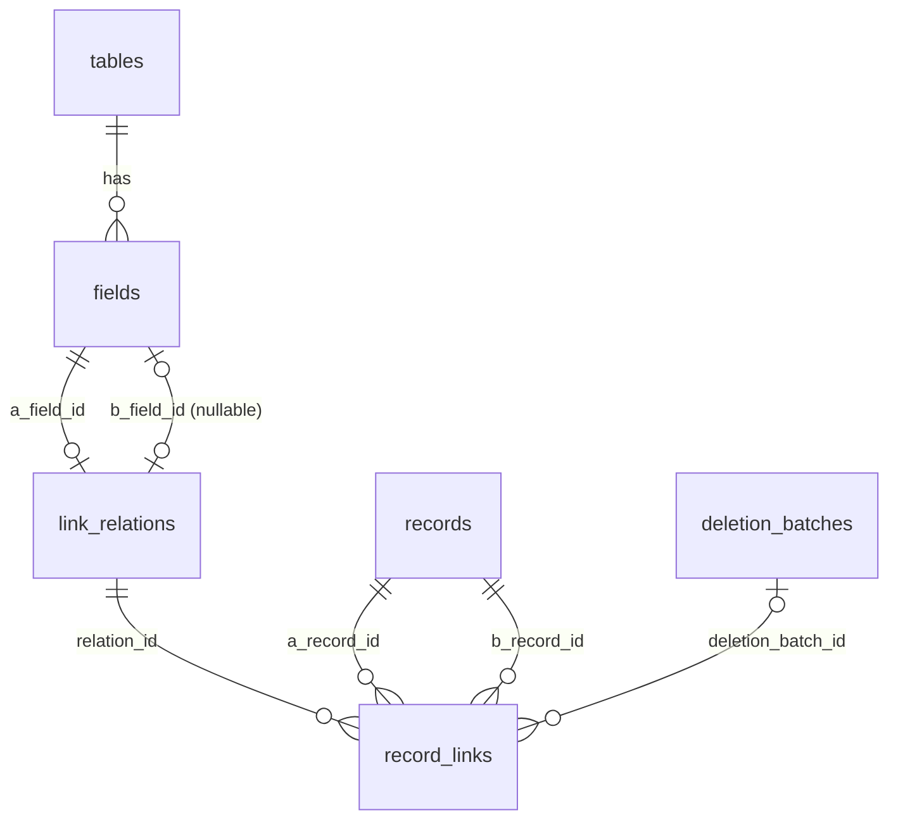
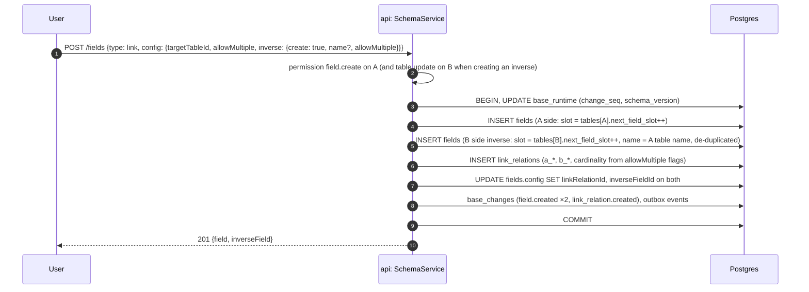
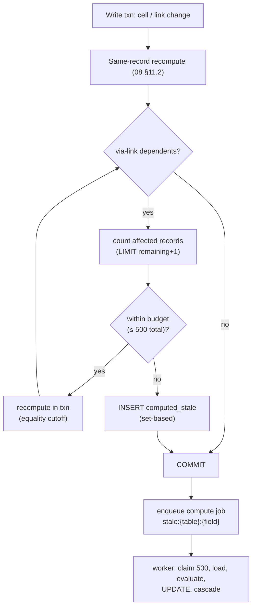
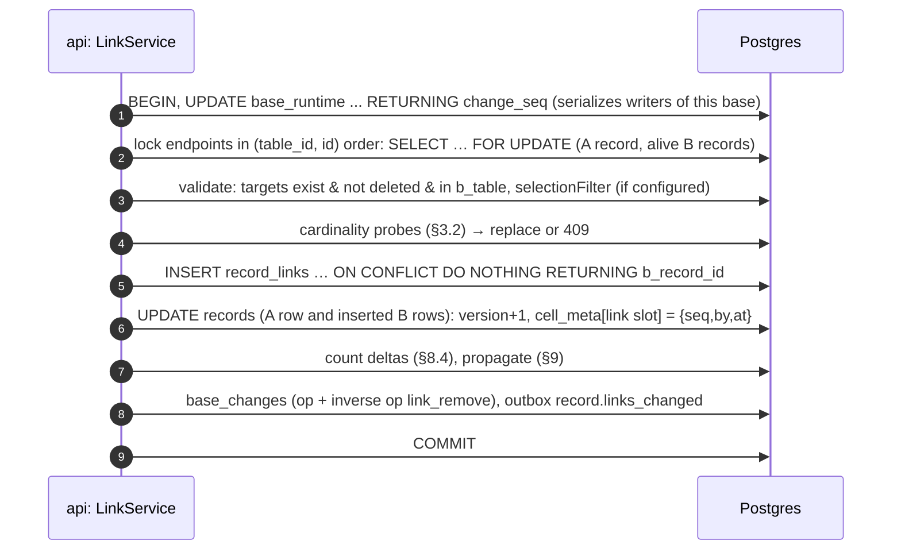

# 09 — Linked Record Engine

> **Status:** Proposed · **Owner:** Core Data team · **Conforms to:** [00 — Canonical Decisions](00-canonical-decisions.md) (D3, D6, D7, D9, §4 `link`/`contact`, §5 `link_relations`/`record_links`/`computed_stale`/`deletion_batches`, §13 `COMPUTE_SYNC_FANOUT_LIMIT`)
>
> **Sections covered:** Section 11 (Linked Record Engine) and original Part 6 (relations, lookups, rollups, propagation, integrity).
>
> Related: [05 — SQL Schema](05-sql-schema.md) (canonical DDL of `link_relations`, `record_links`) · [06 — Record Storage](06-record-storage.md) · [07 — Field Engine](07-field-engine.md) (`link`, `contact`, `lookup`, `rollup`, `count`) · [08 — Formula Engine](08-formula-engine.md) (dependency graph, recompute) · [11 — Filter, Sort & Group](11-filter-sort-group.md) (link predicates) · [12 — Contacts](12-contacts.md) · [16 — Realtime](16-realtime.md) · [22 — History/Undo/Trash](22-audit-history-undo-trash.md) · [31 — API Specification](31-api-specification.md)

---

## 0. Summary

**[Ours]** A link between two tables is one **relation** (`link_relations` row) with two **sides**: side A (the table/field where the link was created) and side B (the target table and its optional **inverse field**). Each linked pair of records is one **edge** row in `record_links (relation_id, a_record_id, b_record_id, a_order, b_order)`. Link values are **never stored in `records.cells`**; both fields of a relation read the same edges from opposite directions, so the two sides can never disagree.

* Cardinality = `allowMultiple` on each side, enforced transactionally under the endpoint row locks (plus optional unique-index defence in depth, §3).
* Order is kept **per side** with fractional keys (`a_order` = position of *b* within A's cell, `b_order` = position of *a* within B's cell).
* Link edits are **set operations** (`link_add`, `link_remove`, `link_move`) that commute (D9).
* Lookups, rollups and counts are **materialized** computed fields (D7) maintained by record-level propagation with a sync fan-out budget of `COMPUTE_SYNC_FANOUT_LIMIT` = 500 records.
* Record deletion **soft-hides** edges under the record's `deletion_batch_id`; restore brings them back (with cardinality conflict handling).
* Links never cross bases, except the specialised `contact` relation to the workspace contact directory (same shard by D3).

---

## 1. Concepts

| Term | Meaning |
|---|---|
| Relation | One row of `link_relations`: the bidirectional association between table A (field `a_field_id`) and table B (field `b_field_id`, may be NULL = one-way) |
| Side A / side B | A = the table where the link field was created; B = target. Sides are fixed for the relation's life (storage orientation), independent of which UI field the user touches |
| Edge | One row of `record_links`: record `a_record_id` (in A) is linked to `b_record_id` (in B) |
| Link cell | The value of a link field for a record = the ordered list of edges from that record's side |
| Inverse field | The link field on side B (`b_field_id`); created by default for cross-table links |
| One-way relation | `b_field_id IS NULL`: B records have no visible cell; used for self-links by default and when the user opts out of an inverse |



---

## 2. Data model (fragments; canonical DDL in [05 §7.5–7.6](05-sql-schema.md))

```sql
CREATE TABLE data.link_relations (
  id                 uuid        PRIMARY KEY DEFAULT public.uuidv7(),
  workspace_id       uuid        NOT NULL,
  base_id            uuid        NOT NULL REFERENCES data.bases(id) ON DELETE CASCADE,   -- base of side A
  kind               text        NOT NULL DEFAULT 'record' CHECK (kind IN ('record','contact')),
  a_table_id         uuid        NOT NULL REFERENCES data.tables(id) ON DELETE RESTRICT,
  a_field_id         uuid        NOT NULL REFERENCES data.fields(id) ON DELETE RESTRICT DEFERRABLE INITIALLY DEFERRED,
  b_base_id          uuid        NOT NULL REFERENCES data.bases(id) ON DELETE RESTRICT,
  b_table_id         uuid        NOT NULL REFERENCES data.tables(id) ON DELETE RESTRICT,
  b_field_id         uuid        REFERENCES data.fields(id) ON DELETE RESTRICT DEFERRABLE INITIALLY DEFERRED,  -- NULL = one-way
  cardinality        text        NOT NULL DEFAULT 'many_to_many'
                                 CHECK (cardinality IN ('many_to_many','one_to_many','many_to_one','one_to_one')),
  created_by         uuid,
  created_at         timestamptz NOT NULL DEFAULT now(),
  updated_at         timestamptz NOT NULL DEFAULT now(),
  deleted_at         timestamptz,
  deletion_batch_id  uuid,
  CHECK (a_field_id IS DISTINCT FROM b_field_id),
  CHECK (kind = 'contact' OR b_base_id = base_id)            -- record links never cross bases (§13)
);

CREATE TABLE data.record_links (
  relation_id        uuid        NOT NULL,
  a_record_id        uuid        NOT NULL,
  b_record_id        uuid        NOT NULL,
  workspace_id       uuid        NOT NULL,
  a_order            text        COLLATE "C" NOT NULL,       -- position of b inside A's cell
  b_order            text        COLLATE "C" NOT NULL,       -- position of a inside B's cell
  created_at         timestamptz NOT NULL DEFAULT now(),
  created_by         uuid,
  deletion_batch_id  uuid,                                    -- set while either endpoint is trashed
  PRIMARY KEY (relation_id, a_record_id, b_record_id)
) PARTITION BY HASH (relation_id);                            -- × 32
CREATE INDEX record_links_a_idx     ON data.record_links (relation_id, a_record_id, a_order) INCLUDE (b_record_id) WHERE deletion_batch_id IS NULL;
CREATE INDEX record_links_b_idx     ON data.record_links (relation_id, b_record_id, b_order) INCLUDE (a_record_id) WHERE deletion_batch_id IS NULL;
CREATE INDEX record_links_trash_idx ON data.record_links (deletion_batch_id) WHERE deletion_batch_id IS NOT NULL;
```

Design notes:

* **Why hash-partition by `relation_id`** (not by table): every link query is scoped to one relation, so it prunes to one partition; a relation's edges for both directions live together; deleting a relation's edges at purge is partition-local.
* **Both directions are index-only scans**: `record_links_a_idx` serves "B ids of A record r in order", `record_links_b_idx` the reverse, via `INCLUDE`.
* **Size**: ~60 B heap + 3 index entries (~45–55 B each) ≈ **~220 B per edge** incl. overhead; 1M edges ≈ 220 MB.
* **No FKs** to `records` (hot path, [05](05-sql-schema.md) conventions); integrity is guaranteed by the write path (endpoints locked and checked alive in the same transaction) and a nightly verifier (orphans ⇒ repair + alert).
* `link_relations.cardinality` is the storage form of the two fields' `allowMultiple` flags (§3.1); field configs (`fields.config.allowMultiple`, `linkRelationId`, `inverseFieldId`, [07 §8.19](07-field-engine.md)) are the API form. Both are written in the same transaction.

---

## 3. Cardinality

### 3.1 Mapping

`cardinality` is read from side A's perspective: "*A-to-B*".

| `a_field.allowMultiple` | `b_field.allowMultiple` (or one-way option `targetLinkedOnce`) | `cardinality` | Constraint |
|---|---|---|---|
| true | true | `many_to_many` | none |
| true | false | `one_to_many` | each B record has ≤ 1 edge |
| false | true | `many_to_one` | each A record has ≤ 1 edge |
| false | false | `one_to_one` | both |

For one-way relations, the B-side constraint is expressed by the A field option `targetLinkedOnce` (each target record may be linked from at most one A record) — default false.

### 3.2 Enforcement — two approaches

| | **A. Probe under endpoint row locks (chosen)** | B. Partial unique indexes |
|---|---|---|
| Mechanism | Every link mutation locks the endpoint `records` rows it touches (needed anyway to bump `version`/`cell_meta`), then probes `record_links` for existing edges of the single side | Denormalize `a_single`, `b_single` booleans into each edge; `UNIQUE (relation_id, a_record_id) WHERE a_single AND deletion_batch_id IS NULL` (and symmetric) |
| Correctness | Race-free: two transactions adding edges to the same single-side record serialize on that record's row lock (and, within a base, on `base_runtime`, D9) | Guaranteed by the database |
| Cost of cardinality change | Metadata + validation scan | Rewrite every edge of the relation to flip the flags |
| Index cost | none extra | two more partial indexes per partition |
| Error handling | Rich: we can offer "replace" semantics before failing | Unique violation → map to error after the fact |

**Recommendation: A** (as in [05](05-sql-schema.md)), with a nightly verifier query per relation with a single side. Approach B is kept as a documented hardening option if the verifier ever finds violations (Proposed additions).

```sql
-- probe: does any of these B records already have an edge (b side single)?
SELECT b_record_id, a_record_id
FROM data.record_links
WHERE relation_id = $rel AND b_record_id = ANY ($b_ids) AND deletion_batch_id IS NULL
  AND a_record_id <> $a;
-- verifier (nightly): violations of a single B side
SELECT b_record_id, count(*) FROM data.record_links
WHERE relation_id = $rel AND deletion_batch_id IS NULL
GROUP BY b_record_id HAVING count(*) > 1;
```

### 3.3 Conflict semantics

* **Single side on the record being edited** (e.g. A field `allowMultiple: false`): setting a new link **replaces** the existing edge (remove old + add new in one op; both recorded as inverse ops).
* **Single side on the other record** (e.g. linking A1 → B1 when B1 already has an edge from A0 and B is single): UI asks "B1 is already linked to A0 — move it?"; on confirm the client sends `onConflict: "replace"` which removes A0–B1 and adds A1–B1. API default `onConflict: "error"` ⇒ `409 LINK_CARDINALITY_CONFLICT` with the conflicting record ids.

### 3.4 Changing cardinality

* **Relaxing** (single → multiple): metadata only.
* **Tightening** (multiple → single): a `long_operation` (sync if the relation has ≤ 5,000 edges) that, for each violating record, keeps the **first edge by that side's order** and removes the rest (removed edges recorded in a deletion batch so the change is undoable within `TRASH_RETENTION`). The preview reports how many records lose links. This is the `link → link (T)` cell of the conversion matrix ([07 §9](07-field-engine.md)).

---

## 4. Self-links

* A self-link has `a_table_id = b_table_id`. An edge `(a=r1, b=r2)` means "r1's cell contains r2".
* **Default is one-way** (`b_field_id NULL`): the user sees one field ("Related tasks"); r2 does **not** show r1 unless an inverse is requested. **[Ours]** rationale: for self-links an automatic inverse is usually confusing (two near-identical columns); users opt in when modelling hierarchies ("Parent" with inverse "Subtasks").
* **Symmetric relationships** ("Friends" where linking r1→r2 should also show r2→r1 in the *same* field) are not modelled specially; users create a two-way self-link and display both fields, or use an automation. A native symmetric mode is deferred (it complicates per-side ordering and cardinality).
* Linking a record to itself is allowed (useful as "self" sentinel) unless the field option `allowSelfReference: false`.
* Computed fields over self-links follow the same field-level cycle rules ([08 §9.3](08-formula-engine.md)): a lookup of a field through a self-link may not depend on itself; hierarchies are traversed one level per field.

---

## 5. Link field lifecycle

### 5.1 Creating a link field



No data is touched: a new relation has no edges. Creating with `inverse: { create: false }` produces a one-way relation (`b_field_id NULL`); an inverse can be added later (metadata only — edges already exist, the new B field simply starts reading them).

### 5.2 Renaming, reordering, changing `allowMultiple`

Rename: metadata. Changing `allowMultiple` on either field: §3.4. Changing the target table: a conversion (re-match by primary text into a new relation, §12).

### 5.3 Deleting a link field (and its inverse)

| Action | Effect |
|---|---|
| Delete the **A field** | Soft-delete A field, B inverse field (if any) and the relation in **one** `deletion_batch` (trash shows one entry "Link field *X* and its inverse"). Edges untouched — invisible because readers resolve relations through the schema snapshot, which excludes deleted relations. |
| Delete the **B (inverse) field** only | Default: same as above (both sides). Option "Keep *X* in table A": the relation becomes one-way (`b_field_id = NULL`, inverse soft-deleted alone). |
| Delete the A field but keep B | Supported as a `long_operation` that **re-orients** the relation: create a new relation with B as side A, copy edges with swapped columns (batched `INSERT … SELECT`), then delete the old relation. Rare; documented cost O(edges). |
| Dependents | Lookups/rollups/counts through the deleted link field become invalid (`#REF`, [08 §8](08-formula-engine.md)); view filters on it become `invalid` conditions ([11](11-filter-sort-group.md)). |
| Restore (within `TRASH_RETENTION`) | Undelete fields + relation; dependents re-validate and recompute (enqueued; values never changed because edges never changed). |
| Purge | `DELETE FROM data.record_links WHERE relation_id = $rel` in batches of 10,000 (partition-local), then delete the relation and field rows; slots tombstoned ([06 §16](06-record-storage.md)). |

---

## 6. Ordering per side

* Keys are fractional index strings (`COLLATE "C"`), same generator as `records.manual_order` ([06 §21](06-record-storage.md)).
* **Append** (default for `link_add`): `a_order = keyAfter(max(a_order) for a)`; the max is an index-only backward scan on `record_links_a_idx` (O(log n)). For each B record touched, `b_order = keyAfter(max(b_order) for b)` — new edges appear at the end of the inverse cell too.
* **Insert at position / move** (`link_move` / `link_add` with `after`): `keyBetween(prev, next)` on the side being edited only; the other side's order is unaffected.
* **Bulk** (paste 300 links into a cell): `generateNKeysBetween(lastKey, null, 300)`.
* **Rebalance**: when a key exceeds 48 chars, re-key that cell's edges (one UPDATE of ≤ cell size rows, inside the same transaction when ≤ 1,000 edges, else background).
* Concurrent moves of the same edge: LWW (later commit's key wins); concurrent inserts at the same position produce distinct keys only if they see each other's keys — within a base writers are serialized (D9), so they always do.

---

## 7. Reading links (grid, API, compute)

### 7.1 Batched loading for a grid page

The view engine fetches 200 record ids ([10](10-view-engine.md)); for each visible link field it issues **one** query per field (not per record), truncated per cell:

```sql
-- side A field: up to 50 linked ids per record, in order, plus an exact count only for truncated cells
SELECT ids.a AS record_id, l.b_record_id AS linked_id, l.a_order
FROM unnest($page_ids::uuid[]) AS ids(a)
CROSS JOIN LATERAL (
  SELECT b_record_id, a_order
  FROM data.record_links
  WHERE relation_id = $rel AND a_record_id = ids.a AND deletion_batch_id IS NULL
  ORDER BY a_order
  LIMIT 51                                  -- 51st row ⇒ cell is truncated
) l;

-- titles of all distinct linked ids (primary field display), one query
SELECT id, cells -> $primary_slot AS pv, computed -> $primary_slot AS pc
FROM data.records
WHERE table_id = $target_table AND id = ANY ($linked_ids) AND deleted_at IS NULL;

-- exact counts only for truncated cells
SELECT a_record_id, count(*) FROM data.record_links
WHERE relation_id = $rel AND a_record_id = ANY ($truncated_ids) AND deletion_batch_id IS NULL
GROUP BY a_record_id;
```

The B-side field uses the mirrored query on `record_links_b_idx`. Cost for a 200-row page: one index-only lateral scan per field (≤ 200 × 51 index tuples) + one PK lookup batch; typically 2–6 ms per link field.

**Titles are resolved at read time**, never materialized into the linking record. Renaming a target record's primary value therefore causes **no fan-out writes**; link cells display the new name on next read, and realtime clients receive the target's primary-field change and patch titles in their `RecordStore` ([24](24-frontend-grid-state-design-system.md)). The primary display string is produced by the primary field type's `display.format(purpose: 'title')`.

### 7.2 API representation

* `cellFormat=json`: `[{ "id": "rec_…", "name": "Acme" }]` (names with `includeLinkNames=true`; default ids only for API compatibility and speed), truncated at `linkCellLimit` (default 100, max 1,000) with `"truncated": true, "total": 4210` metadata in the record's `meta` block.
* Full lists: `GET /v1/bases/{baseId}/tables/{tableId}/records/{recordId}/links/{fieldId}?pageSize=…&cursor=…` (cursor = last order key).

### 7.3 Compute-engine loading (`LinkedValues`, [07 §3.7](07-field-engine.md))

For a batch of source records S (≤ 500) and a computed field reading target fields G through link field L:

```sql
-- 1. edges, full (no truncation), ordered
SELECT a_record_id AS src, b_record_id AS tgt
FROM data.record_links
WHERE relation_id = $rel AND a_record_id = ANY ($src_ids) AND deletion_batch_id IS NULL
ORDER BY a_record_id, a_order;
-- 2. needed slots of the targets only (JSONB projection keeps the result small)
SELECT id,
       cells -> '5'    AS c5,        -- target field G1 (user value)
       computed -> '9' AS k9         -- target field G2 (computed value)
FROM data.records
WHERE table_id = $target_table AND id = ANY ($tgt_ids) AND deleted_at IS NULL;
```

Values are converted with the target types' `formula.toFormula` and handed to the evaluator as ordered arrays per source record. Batches whose total edge count exceeds 50,000 are split; source records whose own fan-in exceeds 10,000 edges use SQL push-down (§8.3).

---

## 8. Lookup, rollup and count evaluation

### 8.1 Lookup

`lookup(L, G, filter?, sort?, limit?)` = for each edge of L in order, the stored value of G on the target (flattened one level for multi-valued G), optionally filtered by `filter` (evaluated in memory with the field engine's evaluators against the target record) and re-sorted. Stored in `computed[slot]` as an array ([06 §14](06-record-storage.md)); empty array ⇒ absent.

### 8.2 Rollup and count (in-memory path)

`rollup(L, G, aggregate)` evaluates the aggregate over the lookup array. Numeric sums use **exact decimal accumulation** (decimal.js) for `number` and `currency` alike, so results are identical to the SQL push-down (`numeric`) path and independent of edge order. `count(L, filter?)` = number of (filtered) edges.

### 8.3 SQL push-down for large fan-in

Used when a record's fan-in exceeds 10,000 edges, or for recomputing a whole table's rollup column, and only for aggregates `sum | count | counta | min | max | avg` without a formula expression:

```sql
-- SUM(Amount) of linked A records, for a set of B records (rollup lives on side B)
SELECT l.b_record_id AS record_id,
       sum((r.cells ->> '3')::numeric)              AS v_sum,      -- accessor from the field engine (07 §3.4)
       count(*) FILTER (WHERE r.cells ? '3')         AS v_counta,
       count(*)                                      AS v_count
FROM data.record_links l
JOIN data.records r
  ON r.table_id = $a_table AND r.id = l.a_record_id AND r.deleted_at IS NULL
WHERE l.relation_id = $rel
  AND l.b_record_id = ANY ($b_ids)
  AND l.deletion_batch_id IS NULL
  /* rollup filter compiled by 11 when present: AND <predicate on r> */
GROUP BY l.b_record_id;
```

Plan: index-only scan on `record_links_b_idx` per B record + PK lookups into `records` (same partition for all A records). 100k edges ≈ 60–150 ms warm. The field type's `evaluator.sqlAggregate` ([07 §3.7](07-field-engine.md)) supplies the expression and post-processing (quantize currency, empty ⇒ absent).

### 8.4 Count maintenance shortcut

`count` fields (without filter) are maintained **by delta** in the link mutation transaction: `link_add` of n edges ⇒ `+n` on both sides' count fields over that relation; `link_remove` ⇒ `−n`. No target loading needed. The nightly verifier recomputes a sample; restores and purges recompute exactly.

---

## 9. Dependency propagation (fan-out)

### 9.1 What triggers cross-record work

| Change | Affected computed fields |
|---|---|
| Value change of field G on record t (table B) | every field X in A with a `via_link` edge on G through a link field L whose relation connects to B; affected records = A records linked to t |
| Edge add/remove between a and b | on a: fields with a `same_record` edge on the A link field (lookups/rollups/counts through it); on b: same for the inverse field (if any) |
| Record t deleted/restored | as removing/adding all of t's edges |
| Computed value of X changed on record a (after recompute) | recursively, dependents of X (same record and via links) — equality cutoff stops unchanged values |

### 9.2 Algorithm

```ts
const BUDGET = COMPUTE_SYNC_FANOUT_LIMIT;           // 500 records, shared across all hops

async function propagate(tx: Tx, seed: ChangeSet, snap: SchemaSnapshot): Promise<PropagationResult> {
  // ChangeSet: (tableId, fieldId) -> Set<recordId>; seeded with user-changed cells and link-slot changes
  const queue = new TopoQueue(snap);                  // ordered by snap.topoIndex(fieldId), across tables
  queue.addAll(seed);
  let used = 0;
  const spilled: SpillSpec[] = [];
  while (!queue.empty()) {
    const { tableId, fieldId, records } = queue.popMin();
    for (const edge of snap.viaLinkDependentsOf(fieldId)) {          // X in table U reads fieldId via link L
      const rel = snap.relationOfLinkField(edge.viaLinkFieldId);
      const side = snap.sideOf(rel, edge.viaLinkFieldId);             // which column is U's record
      const remaining = BUDGET - used;
      const targets = await linkedRecords(tx, rel, side, records, remaining + 1);   // LIMIT remaining+1
      if (targets.length > remaining) {
        spilled.push({ rel, side, sourceRecords: records, field: edge.fieldId });
        continue;                                                     // whole edge spilled (set-based, below)
      }
      used += targets.length;
      const changed = await recomputeRecords(tx, edge.tableId, targets, new Set([edge.fieldId]), snap); // 08 §11.2
      queue.addAll(changed);                                          // only records whose values changed
    }
  }
  for (const s of spilled) await markStaleSetBased(tx, s, snap);      // one INSERT … SELECT per spill
  return { syncRecords: used, spilled: spilled.length };
}
```

```sql
-- linkedRecords: U is side A of the relation, sources are B records
SELECT DISTINCT a_record_id FROM data.record_links
WHERE relation_id = $rel AND b_record_id = ANY ($source_ids) AND deletion_batch_id IS NULL
LIMIT $remaining_plus_one;

-- markStaleSetBased: mark all affected records stale without loading them (works for 100k+ edges)
INSERT INTO data.computed_stale (table_id, record_id, field_id, workspace_id, base_id, reason, cause_seq)
SELECT DISTINCT $u_table, l.a_record_id, $field_x, $ws, $base, 'fanout', $seq
FROM data.record_links l
WHERE l.relation_id = $rel AND l.b_record_id = ANY ($source_ids) AND l.deletion_batch_id IS NULL
ON CONFLICT (table_id, record_id, field_id) DO NOTHING;
```

Then one `compute` job per (table, field) is enqueued after commit (deduplicated job id `stale:{tableId}:{fieldId}`). The worker cascades: when it changes X on records, it runs the same `propagate` with its own budget per batch, so downstream fields are processed in topological order ([08 §11.4](08-formula-engine.md)).



Properties:

* **Bounded write latency**: worst case ≈ 500 record recomputes + a few set-based inserts (~20–80 ms).
* **Never inconsistent, possibly stale**: deferred records keep their previous value and are flagged; there is no state where a computed value reflects a *partial* change.
* **Coalescing**: many edits to the same targets within seconds produce one stale row per (record, field) (PK dedupe) and one job.

---

## 10. Link mutations and concurrency

### 10.1 Ops (realtime & API semantics, D9)

| Op | Semantics | Idempotent | Commutes with |
|---|---|---|---|
| `link_add {recordIds, after?}` | ensure edges exist; new edges placed after `after` (default append) | yes (`ON CONFLICT DO NOTHING`) | other adds, removes of other ids |
| `link_remove {recordIds}` | ensure edges absent | yes | other removes, adds of other ids |
| `link_move {recordId, after}` | change this side's order key | yes (same result) | everything except moves of the same edge (LWW) |
| `replace [ids]` (API PATCH convenience) | server diffs against current edges ⇒ adds/removes/moves | yes | **cell-level LWW**: may undo a concurrent add the client didn't see; reported via `conflicts` when `cell_meta[slot].seq > clientSeenSeq`. The first-party UI only sends set ops. |

Add-vs-remove of the **same** edge concurrently: both serialize on the base (D9); the later commit wins.

### 10.2 Transaction for `link_add` (A side, append)



```sql
-- order keys: A side appends after the current last key; per-B last keys in one query
SELECT max(a_order) FROM data.record_links
WHERE relation_id = $rel AND a_record_id = $a AND deletion_batch_id IS NULL;
SELECT b_record_id, max(b_order) FROM data.record_links
WHERE relation_id = $rel AND b_record_id = ANY ($b_ids) AND deletion_batch_id IS NULL
GROUP BY b_record_id;

INSERT INTO data.record_links (relation_id, a_record_id, b_record_id, workspace_id, a_order, b_order, created_by)
SELECT $rel, $a, x.b, $ws, x.a_order, x.b_order, $actor
FROM unnest ($b_ids::uuid[], $a_orders::text[], $b_orders::text[]) AS x(b, a_order, b_order)
ON CONFLICT (relation_id, a_record_id, b_record_id) DO NOTHING
RETURNING b_record_id;

UPDATE data.records
SET version = version + 1,
    cell_meta = cell_meta || jsonb_build_object($a_slot::text, jsonb_build_object('seq', $seq, 'by', $actor, 'at', $now_ms)),
    updated_at = now(), updated_by = $actor, last_change_seq = $seq
WHERE table_id = $a_table AND id = $a;

UPDATE data.records                                   -- skipped for one-way relations (no visible B cell)
SET version = version + 1,
    cell_meta = cell_meta || jsonb_build_object($b_slot::text, jsonb_build_object('seq', $seq, 'by', $actor, 'at', $now_ms)),
    updated_at = now(), updated_by = $actor, last_change_seq = $seq
WHERE table_id = $b_table AND id = ANY ($inserted_b_ids);
```

`link_remove`:

```sql
DELETE FROM data.record_links
WHERE relation_id = $rel AND a_record_id = $a AND b_record_id = ANY ($b_ids) AND deletion_batch_id IS NULL
RETURNING b_record_id, a_order, b_order;          -- order keys go into the inverse op so undo restores positions
```

`link_move`:

```sql
UPDATE data.record_links SET a_order = $new_key
WHERE relation_id = $rel AND a_record_id = $a AND b_record_id = $b AND deletion_batch_id IS NULL;
```

### 10.3 Deadlock avoidance

* Within one base, all writers serialize on the `base_runtime` row before touching records (D9), so record-level lock ordering cannot deadlock.
* `contact` relations span two bases (the base and the workspace contact-directory base, [12](12-contacts.md)): the transaction locks both `base_runtime` rows in **`base_id` order**, then endpoint rows in `(table_id, id)` order.
* Background jobs (conversion, purge, restore) use `FOR UPDATE SKIP LOCKED` batches and never hold a base lock across batches.

### 10.4 Version and change-log effects

* Both endpoint records' `version` bump (their link cells changed), so `If-Match` clients detect inverse-side changes.
* `base_changes` carries one op per user action with effects for both sides (`{op:'link_add', relationId, a, b[], orders}`) and the inverse op; realtime clients apply it to both cells ([16](16-realtime.md)).
* `record_revisions` stores link changes as `{added:[…], removed:[…]}` per side for history ([22](22-audit-history-undo-trash.md)).

---

## 11. Referential integrity: record deletion, restore, purge

### 11.1 Delete (soft)

Deleting records (one or a batch) creates one `deletion_batches` row (the trash entry) and, in the same transaction:

```sql
UPDATE data.records
SET deleted_at = now(), deleted_by = $actor, deletion_batch_id = $batch
WHERE table_id = $t AND id = ANY ($ids) AND deleted_at IS NULL;

-- hide every live edge touching the deleted records, in every relation where table t is side A or B
UPDATE data.record_links
SET deletion_batch_id = $batch
WHERE relation_id = $rel AND a_record_id = ANY ($ids) AND deletion_batch_id IS NULL;     -- t is side A
UPDATE data.record_links
SET deletion_batch_id = $batch
WHERE relation_id = $rel AND b_record_id = ANY ($ids) AND deletion_batch_id IS NULL;     -- t is side B (incl. self-links)
```

* The **other endpoints** lose those links in their cells: their `version` bumps and `cell_meta[link slot]` updates, counts decrement (§8.4), lookups/rollups propagate (§9) — exactly as if the links had been removed, except the edges are retained.
* Edges hidden by the batch are not counted against cardinality (partial indexes and probes filter `deletion_batch_id IS NULL`).
* **Large fan-out deletes** (a record with > 10,000 live edges): the record is soft-deleted immediately; edge hiding runs as a `long_operation` in batches of 10,000. Until it finishes, readers still exclude those edges because every link read joins (or filters by) the other endpoint's `deleted_at IS NULL` (§7.1 title query, §8.3 push-down) and the grid's link loader drops ids whose title lookup misses. Other endpoints' computed fields are marked stale set-based (§9.2).

### 11.2 Restore

Restoring a deletion batch (trash restore or undo):

```sql
-- 1. restore records
UPDATE data.records SET deleted_at = NULL, deleted_by = NULL, deletion_batch_id = NULL
WHERE table_id = $t AND deletion_batch_id = $batch;

-- 2. for each relation touching t: re-point edges hidden by this batch.
--    If the other endpoint is still deleted (in another batch), hand the edge to that batch
--    so restoring that batch later brings it back; otherwise unhide.
UPDATE data.record_links l
SET deletion_batch_id = o.deletion_batch_id                       -- NULL when the other endpoint is alive
FROM data.records o
WHERE l.relation_id = $rel AND l.deletion_batch_id = $batch
  AND o.table_id = $other_table
  AND o.id = CASE WHEN $t_is_side_a THEN l.b_record_id ELSE l.a_record_id END;
```

**Cardinality conflicts on restore.** Between delete and restore, a single-side record may have been linked elsewhere (e.g. B is single; A0–B1 hidden by A0's deletion; meanwhile A1–B1 created). Before step 2, the restore probes, per relation with a single side, which hidden edges would violate it:

```sql
SELECT l.a_record_id, l.b_record_id
FROM data.record_links l
WHERE l.relation_id = $rel AND l.deletion_batch_id = $batch
  AND EXISTS (SELECT 1 FROM data.record_links x
              WHERE x.relation_id = l.relation_id AND x.b_record_id = l.b_record_id
                AND x.deletion_batch_id IS NULL AND x.a_record_id <> l.a_record_id);
```

Conflicting edges are **not** restored: they are deleted (kept in the restore report `deletion_batches.result.skippedLinks` with ids, so a user can re-link manually). The current state wins over the restored past — consistent with LWW.

After restore, propagation recomputes counts/lookups/rollups on all affected records (sync within budget, else stale).

### 11.3 Purge

When a batch expires (`TRASH_RETENTION` 30 days) or trash is emptied: `DELETE FROM data.record_links WHERE deletion_batch_id = $batch` (batched, uses `record_links_trash_idx`), then the records. Edges handed to another batch (step 2 above) are purged with that batch.

### 11.4 Table deletion

Deleting a table soft-deletes the table, its fields, every relation where it is side A or B (and the corresponding link fields in other tables — the user is shown the list of affected link fields in the confirmation), in one deletion batch. Edges are untouched (hidden via relation state) and are purged with the relation.

---

## 12. Converting text ↔ link

### 12.1 Text (or select/email/…) → link

A `long_operation` (`field.convert`, sync when ≤ 5,000 records):

1. **Configure**: target table, `allowMultiple`, separator (`,` default, CSV-quote aware), `createMissing` (default false), `ambiguous: 'first' | 'skip'` (default `first` = lowest `row_number`).
2. **Preview** ([07 §9.1](07-field-engine.md)): sample 2,000 source cells, report matched / unmatched / ambiguous counts and examples.
3. **Build the match index** of target primary display values. Normalization: NFC → casefold → trim → collapse internal whitespace.
   * Target ≤ 200,000 records: stream `SELECT id, row_number, cells -> $p, computed -> $p FROM records WHERE table_id = $target AND deleted_at IS NULL` into an in-memory `Map<normKey, id[]>` (≈ 100 B/entry ⇒ ≤ 20 MB).
   * Larger targets: batched probes against the primary field's text sidecar (`record_index_text.value_eq = ANY($keys)`), which exists for primary fields of large tables ([06 §13.2](06-record-storage.md)).
   * Contacts: match `contact_identifiers` (email/phone) first, then name ([12](12-contacts.md)).
4. **Create the relation** and fields as in §5.1 (the converted field keeps its id; a new slot is allocated — the old text slot is retained for undo, [06 §15](06-record-storage.md)).
5. **Batches of 1,000 source records**: tokenize, match, (optionally) create missing target records (batched insert, counted against record limits), `INSERT … record_links` with `a_order` = token order and `b_order` appended.
6. **During conversion** the field is read-only and shows a progress state (link cells cannot be dual-read meaningfully); filters on it are rejected with `409 FIELD_CONVERSION_IN_PROGRESS`.
7. **Finalize**: one `field.type_changed` change; inverse op = "restore old slot + soft-delete relation"; dependents re-validated.

### 12.2 Link → text

Render each cell's linked primary display values joined by `", "` (quoting values containing the separator) into a new text slot; the relation and inverse field are soft-deleted in the conversion's deletion batch (undo restores them with edges intact).

### 12.3 Retarget (link to table B → link to table C)

Link → text (12.2, in memory) → text → link against C (12.1), executed as one long operation; the old relation is soft-deleted (restorable).

---

## 13. Cross-base links (excluded) and the contact exception

**[Ours]** General record links across bases are **not supported** (enforced by `CHECK (kind = 'contact' OR b_base_id = base_id)`). Reasons:

| Concern | Why cross-base links hurt |
|---|---|
| Permissions | A base is the unit of membership (D20). A link exposes the other base's primary values, lookups and rollups to members who may have no access to that base. Every read would need a second permission snapshot and per-field redaction across bases. |
| Ordering & consistency | Each base has its own total order (`change_seq`, D9) and `schema_version`. One link op would need to be ordered in two logs; realtime catch-up, undo and webhooks become multi-log. |
| Dependency graph | The field graph, cycle detection and topological order are per base (cached by `schema_version`). Cross-base edges would make every base's snapshot depend on others' schema versions. |
| Lifecycle | Base duplication, snapshots/restore, templates, export, trash, and moving a base between workspaces all assume a closed set of tables. Restoring a snapshot of one base would dangle or resurrect edges into another. |
| Sharding | D3 co-locates a workspace's bases on one shard, but bases can move between workspaces (and thus shards); cross-workspace links would require distributed transactions. |

Alternatives we support:

1. **Contact fields** (`kind = 'contact'`): the workspace contact directory is a special system base co-located on the same shard (D3). Its permission model is workspace-level ("members of the workspace can see the directory fields marked shareable"), its schema is platform-controlled (so cross-base dependency is limited to a fixed field set), and both bases' `base_runtime` rows are locked in id order for link ops (§10.3). See [12](12-contacts.md).
2. **Synced tables** (`sync_sources`, [20](20-import-export-sharing-integrations.md)): a read-only copy of a table (or view) from another base, refreshed incrementally; normal links inside the destination base target the synced table.
3. **Automations** that copy values between bases.

Deferred: same-workspace cross-base links (V2+) would require: per-link permission evaluation, a workspace-level dependency graph, and two-log ordering — tracked in [33](33-architecture-decision-records.md).

---

## 14. Large fan-out (one record linked to 100k)

Scenario: a *Country* record "US" linked from 100,000 *Customers*.

| Aspect | Behaviour |
|---|---|
| Storage | 100k edges in one partition; ≈ 22 MB. No per-record cell blob (an inline JSON array of 100k ids would be ~4 MB per record — the reason links are normalized). |
| Displaying US's inverse cell | first 50 links + exact count (§7.1); "show all" opens the paginated endpoint; the grid never loads 100k ids. |
| Renaming "US" | **no fan-out** — titles are read-time (§7.1). |
| Customers looking up a Country field (e.g. `{Country region}`) | editing US's *Region* ⇒ 100k Customers affected > 500 ⇒ one set-based `INSERT … computed_stale` (~1–2 s for 100k rows, inside the user's transaction — see guard below) + compute jobs: 200 batches × 500, ≈ 30–90 s to converge. |
| Guard for very large spills | if the estimated spill (`count` field on the source record, or a capped count query) exceeds 20,000 rows, the stale marking itself is moved out of the user transaction into a `compute` job keyed by `(relation, source record, field, cause_seq)`; the user's write commits in normal time, and readers see the old lookup values until recompute (flagged stale once the job has marked them). |
| Rollup on US over 100k customers (`SUM(Revenue)`) | each customer revenue edit affects 1 record (US) — within budget — but evaluating it costs a 100k-edge aggregate. Rollups whose source record has fan-in > `ROLLUP_SYNC_FANIN_LIMIT` (10,000) are **always deferred** (stale + job using SQL push-down, §8.3), and the compute job coalesces bursts (one recompute per job run regardless of how many edits). |
| Count on US | delta maintenance (§8.4): O(1) per link change. |
| Adding links to US at high rate (imports) | every edge add bumps US's row (`version`, `cell_meta`); import batches coalesce: one update of US per batch transaction, not per edge. |
| Deleting US | §11.1 large fan-out path (`long_operation` for edge hiding). |
| Limit | `MAX_LINKS_PER_RECORD_SIDE` = 100,000 live edges per record per relation side; warning in UI at 10,000; enforced at link add (count probe uses the `count` maintenance when available, else an index-only capped count). |

---

## 15. API endpoints (links)

Full specification in [31](31-api-specification.md); shapes below are ours.

| Method & path | Purpose |
|---|---|
| `POST /v1/bases/{baseId}/tables/{tableId}/fields` `{type:"link", config:{targetTableId, allowMultiple, targetLinkedOnce?, inverse:{create, name?, allowMultiple?}, selectionViewId?}}` | create link field (+ inverse) |
| `PATCH /v1/bases/{baseId}/tables/{tableId}/fields/{fieldId}` | rename, `allowMultiple` change (may start a long operation), selection filter |
| `DELETE /v1/bases/{baseId}/tables/{tableId}/fields/{fieldId}?keepInverse=false` | delete link field (+ inverse by default) |
| `PATCH /v1/bases/{baseId}/tables/{tableId}/records/{recordId}` `{fields:{fld_x:["rec_1","rec_2"]}}` | replace semantics (§10.1) |
| `POST …/records/{recordId}/links/{fieldId}:add` `{recordIds:[…], after?: "rec_…" \| null, onConflict?: "error" \| "replace"}` | add edges (set op) |
| `POST …/records/{recordId}/links/{fieldId}:remove` `{recordIds:[…]}` | remove edges |
| `POST …/records/{recordId}/links/{fieldId}:move` `{recordId, after: "rec_…" \| null}` | reorder within this cell |
| `GET …/records/{recordId}/links/{fieldId}?pageSize=100&cursor=…&includeNames=true` | paginated full link list |
| `GET /v1/bases/{baseId}/tables/{tableId}/fields/{fieldId}/link-candidates?q=acme&pageSize=20` | record picker search (primary text sidecar / FTS, respects `selectionViewId` filter and the caller's permissions on the target table) |
| `POST /v1/bases/{baseId}/tables/{tableId}/records:batch` | batch writes including link fields (≤ 1,000 records) |

Mutations accept `Idempotency-Key`; `If-Match` applies to the record on whose path the call is made. Errors: `LINK_TARGET_NOT_FOUND` (404/422), `LINK_CARDINALITY_CONFLICT` (409), `LINK_LIMIT_EXCEEDED` (422), `FIELD_CONVERSION_IN_PROGRESS` (409).

Realtime ops on the WebSocket mirror the three set ops (`link_add`, `link_remove`, `link_move`) with the same payloads ([16](16-realtime.md)).

---

## 16. Limits and constants

| Constant | Value | Notes |
|---|---|---|
| `COMPUTE_SYNC_FANOUT_LIMIT` | 500 records (spine §13) | shared budget across hops (§9) |
| `MAX_LINKS_PER_RECORD_SIDE` | 100,000 (warn at 10,000) | proposed |
| `ROLLUP_SYNC_FANIN_LIMIT` | 10,000 edges | rollups above are always deferred + SQL push-down (§14) |
| Large-spill guard | 20,000 stale rows | stale marking moves to a job (§14) |
| Grid link cell window | 50 ids + count | §7.1 |
| API `linkCellLimit` | default 100, max 1,000 | §7.2 |
| Link fields per table | counts toward 500 fields | — |
| Relations per base | ≤ 2,000 | proposed |
| Text→link match index in memory | targets ≤ 200,000 records | §12.1 |
| Order-key rebalance | key > 48 chars | §6 |
| Edge size | ~220 B incl. indexes | §2 |

---

## 17. Proposed additions

| Kind | Name | Purpose |
|---|---|---|
| Field config | `link.config.targetLinkedOnce` (one-way relations), `allowSelfReference`, `selectionViewId` | §3.1, §4, §15 |
| Constants | `MAX_LINKS_PER_RECORD_SIDE = 100000`, `ROLLUP_SYNC_FANIN_LIMIT = 10000`, `MAX_RELATIONS_PER_BASE = 2000` | §16 |
| Hardening option (not MVP) | `record_links.a_single boolean`, `record_links.b_single boolean` + partial unique indexes `(relation_id, a_record_id) WHERE a_single AND deletion_batch_id IS NULL` and symmetric | DB-enforced cardinality (§3.2 approach B) |
| JSON | `deletion_batches.result.skippedLinks` | restore conflict report (§11.2) |
| Endpoints | `…/links/{fieldId}:add / :remove / :move`, `GET …/links/{fieldId}`, `GET …/fields/{fieldId}/link-candidates` | §15 |
| Error codes | `LINK_TARGET_NOT_FOUND`, `LINK_CARDINALITY_CONFLICT`, `LINK_LIMIT_EXCEEDED` | §15 |
| Event payload | `record.links_changed` data: `{relationId, side, added:[…], removed:[…], moved:[…]}` | §10.4 |
