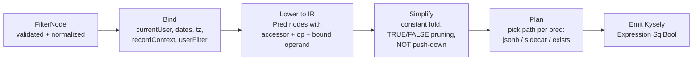

# 11 — Filter, Sort & Group Engine

> **Status:** Proposed · **Owner:** Data Experience team (query core) · **Date:** 2026-10-03
> **Conforms to:** [`00-canonical-decisions.md`](./00-canonical-decisions.md) (normative): D6 record storage (cells JSONB by slot, computed JSONB, typed sidecars), §4 field type keys, §5 table inventory, §13 constants.

**Sections covered:** §13 Filtering (Part 8) and §14 Sorting & grouping (Part 9) — Filter AST (TS + JSON Schema), dynamic operands, operator catalogue per field family, type compatibility matrix, validation & security limits, null/empty semantics, date & time-zone semantics, compilation to SQL (Kysely) over `cells`/`computed`/`record_links`/sidecars with worked SQL for every canonical example, sidecar vs scan decision, text matching & collation, query optimization (selectivity, LIMIT pushdown, count estimation), sorting (per type, select order, empties policy, formulas, linked records, collation, tiebreaker), keyset cursors, grouping (≤ 3 levels, headers/aggregates, collapsed state, SQL, multi-value fields, group pagination), in-memory evaluator & comparator, SQL ⇄ in-memory equivalence testing.

**Related:** [`06-record-storage.md`](./06-record-storage.md) (owns `records` and sidecar DDL) · [`07-field-engine.md`](./07-field-engine.md) (field type plugins contribute accessors/operators) · [`08-formula-engine.md`](./08-formula-engine.md) (result types of computed fields) · [`09-linked-record-engine.md`](./09-linked-record-engine.md) (`record_links`, link sort keys) · [`10-view-engine.md`](./10-view-engine.md) (pipeline, caching, cursors) · [`13-interface-builder.md`](./13-interface-builder.md) (recordContext / user filters) · [`17-api-architecture.md`](./17-api-architecture.md) (`records:query`).

---

## 1. Scope and principles

The **query core** (`@tabula/query`, isomorphic) defines *one* filter/sort/group language used by views, the public API (`POST …/records:query`, D16), interface element data sources, automation conditions, form `visibleIf`, color rules, row policies (Enterprise), and webhook filters. It has three back-ends:

1. **SQL compiler** (server, `apps/server/src/modules/query/compiler`) → Kysely expressions over `data.records`, `data.record_links`, `data.record_index_*`.
2. **In-memory evaluator** (isomorphic) → `true | false | unknown` for a single record image (realtime membership, automations, client-side interfaces, form visibility).
3. **Comparator** (isomorphic) → total order of two record images (client order maintenance, server patch-forward).

**The SQL compiler and the in-memory evaluator must agree on every input.** That is enforced by differential property testing (§13), not by hope.

Principles **[Ours]**: IDs only (never field names inside persisted ASTs); empty ⇒ absent (spine §4) so "is empty" is `NOT (cells ? slot)`; all user values are bound parameters; slots/relation ids are emitted only after schema validation; every query is scoped by `table_id` (partition pruning, D6) and runs under RLS (D4).

### 1.1 Storage assumptions (owned by 06/09; restated for SQL readability)

```sql
-- data.records: hash-partitioned by table_id; PK (table_id, id)
--   id uuid, workspace_id uuid, base_id uuid, table_id uuid, row_number bigint,
--   cells jsonb, computed jsonb, cell_meta jsonb, version int,
--   created_at timestamptz, created_by uuid, updated_at timestamptz, updated_by uuid, deleted_at timestamptz
--   UNIQUE (table_id, row_number)
-- data.record_links: hash-partitioned by relation_id
--   relation_id uuid, a_record_id uuid, b_record_id uuid, a_order text, b_order text
--   PK (relation_id, a_record_id, b_record_id); INDEX (relation_id, b_record_id)
-- Sidecars (06 §13; one row per record × field slot × ordinal; no row for empty cells;
--           multi-valued fields have ord 0..n-1 in the type's canonical order):
--   data.record_index_num  (workspace_id, table_id, field_slot smallint, record_id, ord, value numeric)
--        value = number | currency (exact) | percent | duration | rating | date as EPOCH DAY | single_select RANK | checkbox 1 | count
--   data.record_index_text (workspace_id, table_id, field_slot, record_id, ord,
--                           sort_key bytea,   -- ICU collation key for the base collation, truncated to 128 bytes (computed in app)
--                           value_eq text,    -- equality form: NFC + fold (§8.1), ≤ 512 chars; or option id / user id
--                           flags smallint)   -- bit0: trigram-searchable
--   data.record_index_time (workspace_id, table_id, field_slot, record_id, ord, value timestamptz)
--   PK (table_id, field_slot, record_id, ord); BTREE (table_id, field_slot, value|sort_key, record_id);
--   text also: BTREE (table_id, field_slot, value_eq), GIN (value_eq gin_trgm_ops) WHERE flags & 1 = 1
-- records.manual_order (text, fractional index) is the table-level baseline order (06 §21).
```

The sidecar DDL above is quoted from [`06-record-storage.md`](./06-record-storage.md) §13 (06 wins on any divergence). Sidecar predicates therefore reference `field_slot` (not field id); `$sAmount` etc. below denote slot numbers.

---

## 2. Filter AST

### 2.1 TypeScript

```ts
// @tabula/query/src/ast.ts
export type FilterNode = FilterGroup | FilterCondition | FilterInvalid;

export interface FilterGroup {
  kind: 'group';
  id?: string;                     // stable node id (client-generated, ≤ 32 chars) — enables granular patch ops (10 §13)
  op: 'and' | 'or';
  not?: boolean;                   // NOT(group). UI exposes as "none of the following are true"
  children: FilterNode[];          // 0..200 ; empty group = true (and) / false (or) — normalized away
}

export interface FilterCondition {
  kind: 'cond';
  id?: string;
  fieldId: FieldId;
  operator: FilterOperator;
  value?: OperandValue;            // literal operand (shape per operator, §4)
  valueRef?: ValueRef;             // dynamic operand; mutually exclusive with `value`
  options?: {
    caseSensitive?: boolean;       // text family only; default false
    timeZone?: string;             // date family; overrides query tz for this condition
    dateBucket?: 'exact' | 'day';  // datetime compared at day granularity (default 'day' for is/is_before/… with date operands)
    linkMatch?: 'any' | 'all';     // lookup/link text ops; default 'any'
  };
}

/** Produced by dangling-reference cleanup in fail-closed contexts (10 §14.2). Compiles to FALSE. */
export interface FilterInvalid { kind: 'invalid'; id?: string; reason: 'field_purged' | 'operator_incompatible' | 'redacted'; }

export type OperandValue =
  | string | number | boolean
  | string[]                                  // option ids, user ids, record ids
  | { min?: number | string; max?: number | string } // is_between (numbers, currency strings, dates)
  | DateOperand
  | PeriodOperand;

export type DateOperand =
  | { mode: 'exact_date'; date: string }                      // 'YYYY-MM-DD'
  | { mode: 'exact_datetime'; at: string }                    // ISO UTC
  | { mode: 'today' | 'tomorrow' | 'yesterday' }
  | { mode: 'days_ago' | 'days_from_now'; n: number }         // 1..3650
  | { mode: 'weeks_ago' | 'weeks_from_now' | 'months_ago' | 'months_from_now'; n: number }; // 1..120

export type PeriodOperand =
  | { period: 'today' | 'tomorrow' | 'yesterday'
             | 'this_week' | 'last_week' | 'next_week'
             | 'this_month' | 'last_month' | 'next_month'
             | 'this_quarter' | 'this_year' | 'last_year' | 'next_year'
             | 'past_week' | 'past_month' | 'past_year'
             | 'next_7_days_rolling' | 'next_month_rolling' | 'next_year_rolling' }
  | { period: 'past_n_days' | 'next_n_days'; n: number };     // 1..3650

export type ValueRef =
  | { type: 'currentUser' }                                   // user / collaborator / created_by / modified_by fields
  | { type: 'relativeDate'; preset: 'today' | 'tomorrow' | 'yesterday' | 'days_ago' | 'days_from_now'
                                   | 'weeks_ago' | 'weeks_from_now' | 'months_ago' | 'months_from_now'; n?: number }
  | { type: 'field'; fieldId: FieldId }                       // compare against another field of the same record
  | { type: 'recordContext'; source: 'page' | 'element'; elementId?: string; path: 'recordId' | { fieldId: FieldId } } // interfaces only (13)
  | { type: 'userFilter'; key: string }                       // interfaces only: end-user exposed filter value (13)
  | { type: 'formAnswer'; fieldId: FieldId };                 // forms only (visibleIf) — same as literal of the current answer
```

Notes:
* `value` vs `valueRef`: exactly one for operators that take an operand; neither for unary operators (`is_empty`, `is_not_empty`, `is_checked`…). `currentUser` and `relativeDate` exist both as `valueRef` (normative) and, for date operators, as `DateOperand` modes (`today`, `days_ago`…); the validator normalizes `valueRef.relativeDate` into the `DateOperand` form, so compilers only see one representation.
* `id`s are optional on input and assigned by the normalizer for persisted ASTs.
* `not` on groups is supported by the engine; the UI exposes it only as the "none of" group mode.

### 2.2 JSON Schema (draft 2020-12, abridged — full schema generated from TypeBox into `schemas/filter.schema.json`)

```json
{
  "$schema": "https://json-schema.org/draft/2020-12/schema",
  "$id": "https://schemas.tabula.example/v1/filter.json",
  "$defs": {
    "node": { "oneOf": [ { "$ref": "#/$defs/group" }, { "$ref": "#/$defs/cond" }, { "$ref": "#/$defs/invalid" } ] },
    "group": {
      "type": "object", "additionalProperties": false,
      "required": ["kind", "op", "children"],
      "properties": {
        "kind": { "const": "group" },
        "id": { "type": "string", "maxLength": 32, "pattern": "^[A-Za-z0-9_-]+$" },
        "op": { "enum": ["and", "or"] },
        "not": { "type": "boolean" },
        "children": { "type": "array", "maxItems": 200, "items": { "$ref": "#/$defs/node" } }
      }
    },
    "cond": {
      "type": "object", "additionalProperties": false,
      "required": ["kind", "fieldId", "operator"],
      "properties": {
        "kind": { "const": "cond" },
        "id": { "type": "string", "maxLength": 32 },
        "fieldId": { "type": "string", "pattern": "^fld_[0-9A-Za-z]{22}$" },
        "operator": { "$ref": "#/$defs/operator" },
        "value": {},
        "valueRef": { "$ref": "#/$defs/valueRef" },
        "options": {
          "type": "object", "additionalProperties": false,
          "properties": {
            "caseSensitive": { "type": "boolean" },
            "timeZone": { "type": "string", "maxLength": 64 },
            "dateBucket": { "enum": ["exact", "day"] },
            "linkMatch": { "enum": ["any", "all"] }
          }
        }
      },
      "not": { "required": ["value", "valueRef"] }
    },
    "invalid": {
      "type": "object", "required": ["kind", "reason"],
      "properties": { "kind": { "const": "invalid" }, "id": { "type": "string" },
                      "reason": { "enum": ["field_purged", "operator_incompatible", "redacted"] } }
    },
    "operator": { "enum": [
      "eq","neq","contains","not_contains","starts_with","ends_with",
      "gt","gte","lt","lte","is_between",
      "is_empty","is_not_empty",
      "is_any_of","is_none_of","has_any_of","has_all_of","has_none_of","is_exactly",
      "is","is_not","is_before","is_after","is_on_or_before","is_on_or_after","is_within",
      "is_checked","is_not_checked",
      "has_file_type"
    ]},
    "valueRef": { "oneOf": [
      { "type": "object", "required": ["type"], "properties": { "type": { "const": "currentUser" } }, "additionalProperties": false },
      { "type": "object", "required": ["type", "preset"], "properties": { "type": { "const": "relativeDate" },
          "preset": { "enum": ["today","tomorrow","yesterday","days_ago","days_from_now","weeks_ago","weeks_from_now","months_ago","months_from_now"] },
          "n": { "type": "integer", "minimum": 1, "maximum": 3650 } }, "additionalProperties": false },
      { "type": "object", "required": ["type", "fieldId"], "properties": { "type": { "const": "field" }, "fieldId": { "type": "string" } }, "additionalProperties": false },
      { "type": "object", "required": ["type", "source", "path"], "properties": { "type": { "const": "recordContext" },
          "source": { "enum": ["page", "element"] }, "elementId": { "type": "string" }, "path": {} }, "additionalProperties": false },
      { "type": "object", "required": ["type", "key"], "properties": { "type": { "const": "userFilter" }, "key": { "type": "string", "maxLength": 64 } }, "additionalProperties": false },
      { "type": "object", "required": ["type", "fieldId"], "properties": { "type": { "const": "formAnswer" }, "fieldId": { "type": "string" } }, "additionalProperties": false }
    ]}
  },
  "$ref": "#/$defs/node"
}
```

Operand shape per operator is validated in the semantic pass (§4) because it depends on the field family.

### 2.3 Example — the canonical nested filter (public IDs)

"(Status is any of [Open, In progress]) AND (Amount > 1000 OR Owner is me) AND NOT(Email contains '@gmail.com')"

```json
{
  "kind": "group", "op": "and",
  "children": [
    { "kind": "cond", "fieldId": "fld_status", "operator": "is_any_of", "value": ["opt_open", "opt_inprog"] },
    { "kind": "group", "op": "or", "children": [
      { "kind": "cond", "fieldId": "fld_amount", "operator": "gt", "value": 1000 },
      { "kind": "cond", "fieldId": "fld_owner",  "operator": "is_any_of", "valueRef": { "type": "currentUser" } }
    ]},
    { "kind": "cond", "fieldId": "fld_email", "operator": "not_contains", "value": "@gmail.com" }
  ]
}
```

---

## 3. Field families

Each field type plugin ([`07`](./07-field-engine.md)) declares a **filter family** (for computed fields: of its *result type*, from the formula type checker [`08`](./08-formula-engine.md)). Operators, operand schemas, accessors and comparators are defined per family.

| Family | Field types (spine §4) | Canonical value read by compiler |
|---|---|---|
| `text` | `text`, `long_text` (plain or `.plain` of rich), `email`, `url`, `phone`, `barcode` (`.text`), formula/rollup/ai_generated with text result | string |
| `number` | `number`, `percent`, `duration`, `rating`, `count`, `autonumber` (`row_number`), formula/rollup numeric | JSON number |
| `decimal` | `currency` (decimal **string**), formula with currency result (string) | decimal string → `numeric` |
| `date` | `date` (`YYYY-MM-DD`), formula/rollup date-only result | string |
| `datetime` | `datetime`, `created_time` (`records.created_at`), `modified_time` (column or computed), formula/rollup datetime | canonical ISO UTC string / timestamptz |
| `boolean` | `checkbox`, formula boolean | `true` / absent |
| `single_choice` | `single_select` | option id string |
| `multi_choice` | `multi_select` | array of option ids |
| `user` | `collaborator` (single), `created_by`, `modified_by` | user uuid string |
| `multi_user` | `collaborator` (`allowMultiple`) | array of user uuids |
| `link` | `link`, `contact` | rows in `record_links` (+ target primary for text ops) |
| `attachment` | `attachment` | array of attachment uuids |
| `array<F>` | `lookup` (element family F), formula returning arrays | JSON array |
| `opaque` | `json`, `button`, `ai_generated` with non-scalar result | — (only `is_empty` / `is_not_empty`; button not filterable) |

`ai_generated` values are `{value, status, inv}`; the accessor reads `.value` with the family of its declared output type; `status ≠ 'ok'` is treated as empty.

---

## 4. Operator catalogue, operand schemas & compatibility matrix

### 4.1 Operators per family

| Operator | Operand | text | number / decimal | date / datetime | boolean | single_choice | multi_choice | user | multi_user | link | attachment | array<F> |
|---|---|---|---|---|---|---|---|---|---|---|---|---|
| `eq` | scalar | ✓ (ci) | ✓ | — (use `is`) | — | ✓ (option id) | — | ✓ | — | — | — | ✓ any element |
| `neq` | scalar | ✓ | ✓ | — | — | ✓ | — | ✓ | — | — | — | ✓ no element |
| `contains` / `not_contains` | string ≤ 1000 | ✓ | — | — | — | — | — | — | — | ✓ (primary text of linked) | ✓ (file name) | ✓ (text F) |
| `starts_with` / `ends_with` | string ≤ 1000 | ✓ | — | — | — | — | — | — | — | — | — | — |
| `gt` `gte` `lt` `lte` | number / decimal string | — | ✓ | — | — | — | — | — | — | — | — | ✓ any element (number F) |
| `is_between` | `{min?,max?}` inclusive | — | ✓ | ✓ (dates) | — | — | — | — | — | — | — | — |
| `is_empty` / `is_not_empty` | — | ✓ | ✓ | ✓ | (=`is_not_checked`) | ✓ | ✓ | ✓ | ✓ | ✓ | ✓ | ✓ |
| `is_any_of` / `is_none_of` | id[] ≤ 100 (or `currentUser`) | — | — | — | — | ✓ | — | ✓ | — | — | — | ✓ (choice/user F) |
| `has_any_of` / `has_all_of` / `has_none_of` | id[] ≤ 100 (or `currentUser`) | — | — | — | — | — | ✓ | — | ✓ | ✓ (record ids) | — | ✓ |
| `is_exactly` | id[] ≤ 100 | — | — | — | — | — | ✓ | — | ✓ | ✓ | — | — |
| `is` / `is_not` / `is_before` / `is_after` / `is_on_or_before` / `is_on_or_after` | `DateOperand` | — | — | ✓ | — | — | — | — | — | — | — | ✓ (date F) |
| `is_within` | `PeriodOperand` | — | — | ✓ | — | — | — | — | — | — | — | ✓ (date F) |
| `is_checked` / `is_not_checked` | — | — | — | — | ✓ | — | — | — | — | — | — | — |
| `has_file_type` | `'image'|'video'|'audio'|'pdf'|'document'|'spreadsheet'|'presentation'|'archive'|'other'` | — | — | — | — | — | — | — | — | — | ✓ | — |

"ci" = case-insensitive by default (`options.caseSensitive` opt-in). `user is me` is `is_any_of` with `valueRef: currentUser` (single user) or `has_any_of` with `currentUser` (multi). `link exists` is `is_not_empty`; `link has record X` is `has_any_of: ["rec_X"]`.

**Comparisons between fields** (`valueRef: {type:'field'}`) are allowed for: `eq`/`neq` within the same family (text ci); `gt/gte/lt/lte` between number/decimal (cross-allowed); `is/is_before/is_after/is_on_or_*` between date/datetime (datetime truncated to day in the query tz when compared to a date). Never sidecar-accelerated.

**Not offered (decided):** regular-expression match (ReDoS risk on the in-memory side and expensive in SQL; V2 with RE2 on both sides if demanded); "contains" on numbers (use formula `TEXT()`).

### 4.2 Empty / null semantics (normative)

Storage invariant: empty ⇒ key absent (spine §4). Text `""`, empty arrays, `false` checkbox are never stored. The compiler therefore treats SQL `NULL` from `cells->>'slot'` as **empty**, and the evaluator treats `undefined` as empty.

| Operator on an empty cell | Result | Rationale |
|---|---|---|
| `eq`, `contains`, `starts_with`, `ends_with`, `gt…lte`, `is_between`, `is_any_of`, `has_any_of`, `has_all_of`, `is`, `is_before…`, `is_within`, `has_file_type` | **false** | positive predicates need a value |
| `neq`, `not_contains`, `is_none_of`, `has_none_of`, `is_not` | **true** | "is not Closed" includes blank rows — matches user expectation in spreadsheets |
| `is_exactly []` | invalid operand (use `is_empty`) | |
| `is_not_checked` | true | |
| Formula producing error (`#ERROR` sentinel in computed) | treated as **empty** for all operators | errors never match positive filters |
| Stale computed value | evaluated on the stored (stale) value | consistency with what the grid shows; staleness indicated in UI |

**Incomplete conditions** (operator requires an operand but none is set, e.g., the user just added a condition in the UI): in *persisted view configs* they are **inactive** (skipped, like an absent condition) and flagged `incomplete` in diagnostics; in the **public API** they are a validation error (`FILTER_INCOMPLETE_CONDITION`). In fail-closed contexts (share links, interface data sources, automation watches) incomplete conditions are rejected at save time.

### 4.3 Date and time-zone semantics

**Time zone resolution** for a condition: `options.timeZone` → `query.timeZone` (view) → field `config.timeZone` (if an IANA zone) → base `settings.timeZone` → `'UTC'`. The special value `'viewer'` resolves to the requesting user's `core.users.tz` (results then differ per user; caches include the tz, [`10`](./10-view-engine.md) §12). **Default for collaborative views is the base time zone**, so counts/membership are identical for every collaborator (essential for automations and shared summaries).

**Week start**: `query.weekStartsOn` → base `settings.weekStartsOn` (default Monday = 1; locale-derived on base creation).

**Period resolution** — pure function shared by both back-ends (`@tabula/query/src/time.ts`, uses `Temporal` via polyfill):

```ts
/** Returns a half-open local-date interval [startDate, endDateExclusive) in zone tz. */
export function resolvePeriod(p: PeriodOperand, now: Temporal.Instant, tz: string, weekStartsOn: 0|1|6): { start: PlainDate; endExcl: PlainDate } {
  const today = now.toZonedDateTimeISO(tz).toPlainDate();
  const sow = (d: PlainDate) => d.subtract({ days: (d.dayOfWeek % 7 - weekStartsOn + 7) % 7 }); // dayOfWeek: Mon=1..Sun=7
  switch (p.period) {
    case 'today':      return { start: today, endExcl: today.add({ days: 1 }) };
    case 'this_week':  { const s = sow(today); return { start: s, endExcl: s.add({ days: 7 }) }; }
    case 'last_week':  { const s = sow(today).subtract({ days: 7 }); return { start: s, endExcl: s.add({ days: 7 }) }; }
    case 'this_month': { const s = today.with({ day: 1 }); return { start: s, endExcl: s.add({ months: 1 }) }; }
    case 'past_week':  return { start: today.subtract({ days: 7 }), endExcl: today.add({ days: 1 }) };   // inclusive of today
    case 'past_month': return { start: today.subtract({ months: 1 }), endExcl: today.add({ days: 1 }) }; // month clamped (Mar 31 → Feb 28/29)
    case 'past_n_days':return { start: today.subtract({ days: p.n }), endExcl: today.add({ days: 1 }) };
    case 'next_n_days':return { start: today, endExcl: today.add({ days: p.n + 1 }) };
    // … remaining presets analogous; table-driven in code
  }
}
/** Converts a local-date interval to UTC instants for datetime fields (DST-correct: local midnight → instant). */
export function toInstantRange(r, tz) {
  return { from: r.start.toZonedDateTime({ timeZone: tz }).toInstant(),           // start of day (handles DST gaps: 'compatible' disambiguation)
           toExcl: r.endExcl.toZonedDateTime({ timeZone: tz }).toInstant() };
}
```

Semantics per field family:

* **date** (`"YYYY-MM-DD"`): compare as strings (ISO dates sort lexicographically), e.g. `is_within this_week` ⇒ `v >= '2026-09-28' AND v < '2026-10-05'`. No tz conversion on the stored value; tz only decides what "today" is.
* **datetime**: `is` / `is_before` / `is_within` etc. compare at **day granularity in the resolved tz** (default `dateBucket: 'day'`), i.e. convert the local-day bounds to UTC instants and compare the stored instant. `exact_datetime` operands with `dateBucket: 'exact'` compare instants directly (API use).
* **Canonical datetime strings are fixed-width** (`YYYY-MM-DDTHH:mm:ss.sssZ`, 24 chars, years 0001–9999 enforced by the field engine), so lexicographic comparison of `cells->>'slot'` against a canonical bound string is exactly instant comparison — **no cast required** in the JSONB path (cheaper, and safe against cast errors). Sidecar path uses `timestamptz`.
* `now` is captured once per query (`ctx.now`) and passed to both back-ends — a query never sees two different "todays".

---

## 5. Validation (security-critical)

All ASTs entering the system — API requests, view config ops, interface configs, automation conditions, share-link custom filters — pass `validateFilter(ast, schema, principal, context)`:

```ts
export interface FilterValidationContext {
  kind: 'view' | 'api' | 'interface_element' | 'interface_user_filter' | 'automation' | 'form_visibility' | 'color_rule' | 'row_policy';
  allowValueRefs: Array<ValueRef['type']>;   // e.g. api: ['currentUser','relativeDate','field']; form_visibility: ['formAnswer','relativeDate']
  failClosed: boolean;                      // share/interface/automation/row_policy contexts
  maxDepth: 8; maxConditions: 200;
}
```

Checks (in order; first failure returns `400 INVALID_FILTER` with a JSON pointer `path` to the offending node):

1. **Structural**: JSON Schema (§2.2); total serialized size ≤ 64 KB; **depth ≤ 8** (groups nested), **conditions ≤ 200** (counting all `cond` nodes), group children ≤ 200; node ids unique.
2. **Field existence**: `fieldId` decodes to a field of *this* table (`fld_` prefix verified; cross-table ids rejected), not deleted (API: `FIELD_NOT_FOUND`; saved views: dangling rules in [`10`](./10-view-engine.md) §14.2).
3. **Field access**: field not hidden from the principal (Enterprise field hide / interface field allowlist). Prevents *oracle attacks* — filtering on a hidden field to infer its values by membership (`Salary > 100000`). For interface end-user filters, only fields the element exposes as filterable are allowed.
4. **Operator allowed** for the field family (matrix §4.1), with computed fields using their *current* result type.
5. **Operand schema** per (family, operator):
   * strings ≤ 1,000 chars (text ops), NFC-normalized;
   * arrays ≤ 100 elements, unique, ids decode to the right prefix (`opt_` options must belong to the field's current options — unknown options rejected in API, dangling in saved views; `usr_` users must be resolvable workspace members or former members; `rec_` record ids must decode, existence not required (absent records simply never match));
   * numbers finite, |x| ≤ 1e15; decimal strings match `^-?\d{1,15}(\.\d{1,8})?$`;
   * `DateOperand.n`/`PeriodOperand.n` within 1..3650 (or ..120 for weeks/months);
   * `timeZone` must be a valid IANA zone (`Intl.supportedValuesOf('timeZone')` + `'viewer'`).
6. **ValueRef allowed in context** (`recordContext`/`userFilter` only in interfaces; `formAnswer` only in forms; `field` refs: same table, compatible families, not hidden).
7. **Cost guard**: weighted cost = Σ condition costs (scan cond 1, link text `contains` 5, lookup array ops 3, field-to-field 2) ≤ 400; `contains` on link/lookup limited to 10 per filter. Prevents expensive-by-construction filters on public endpoints.

Validated ASTs are **normalized** (`normalizeFilter`): flatten nested groups with the same `op` and no `not`; remove empty groups; dedupe identical sibling conditions; convert `valueRef.relativeDate` to `DateOperand`; sort array operands; assign ids. Normalization is idempotent and is applied before hashing (`queryHash`, [`10`](./10-view-engine.md) §12).

---

## 6. Compilation: AST → QueryPlan IR → SQL

### 6.1 Pipeline



The **IR** is what both the SQL emitter and the in-memory evaluator consume (the evaluator skips "Plan"):

```ts
// @tabula/query/src/ir.ts
export type Pred =
  | { t: 'and' | 'or'; xs: Pred[] }
  | { t: 'not'; x: Pred }
  | { t: 'const'; v: boolean }
  | { t: 'cmp'; acc: Accessor; op: CmpOp; arg: BoundArg; ci: boolean };   // one condition

export type Accessor =
  | { src: 'cell'; slot: number; family: Family; path?: 'plain' | 'text' | 'value' } // cells->'slot'(->'plain')
  | { src: 'computed'; slot: number; family: Family; path?: 'value' }                // computed->'slot'
  | { src: 'column'; column: 'row_number' | 'created_at' | 'updated_at' | 'created_by' | 'updated_by'; family: Family }
  | { src: 'links'; relationId: string; side: 'a' | 'b'; targetTableId: string; targetPrimary: Accessor } // link / contact
  | { src: 'attachments'; slot: number };

export type CmpOp = 'eq'|'neq'|'contains'|'not_contains'|'starts_with'|'ends_with'|'gt'|'gte'|'lt'|'lte'
  | 'between' | 'empty' | 'not_empty' | 'in' | 'not_in' | 'has_any' | 'has_all' | 'has_none' | 'exactly'
  | 'range'      // half-open [from, toExcl) — every date operator lowers to range / lt / gte / empty
  | 'file_type';
```

Lowering of date operators (after binding with `ctx.now`, tz, week start):

| Operator (date family) | IR |
|---|---|
| `is D` | `range [D, D+1)` |
| `is_not D` | `not(range [D, D+1))` (⇒ true for empty) |
| `is_before D` | `lt D` |
| `is_after D` | `gte D+1` |
| `is_on_or_before D` | `lt D+1` |
| `is_on_or_after D` | `gte D` |
| `is_within P` | `range resolvePeriod(P)` |

For **datetime**, the bound `D` values are converted with `toInstantRange` into canonical ISO strings (JSONB path) or `timestamptz` parameters (sidecar path).

### 6.2 Accessor → SQL expression table

`slot` is an integer from the schema snapshot; it is emitted as a SQL **literal** text key (`'4'`) only after `Number.isInteger(slot) && slot > 0 && schema.has(slot)`; everything else is a bind parameter.

| Family / accessor | Value expression (`v`) | Emptiness test |
|---|---|---|
| text (cell) | `r.cells->>'S'` | `NOT (r.cells ? 'S')` |
| text (rich long_text) | `r.cells->'S'->>'plain'` | same |
| text (barcode) | `r.cells->'S'->>'text'` | same |
| number (cell) | `(r.cells->'S')::numeric` | same |
| decimal (currency) | `(r.cells->>'S')::numeric` | same |
| date | `r.cells->>'S'` (compared `COLLATE "C"`) | same |
| datetime (cell) | `r.cells->>'S'` (fixed-width ISO, `COLLATE "C"`) | same |
| datetime (created_time) | `r.created_at` | never empty |
| boolean | `(r.cells ? 'S')` | — |
| single_choice / user | `r.cells->>'S'` | `NOT (r.cells ? 'S')` |
| multi_choice / multi_user | `r.cells->'S'` (jsonb array) | `NOT (r.cells ? 'S')` |
| computed (any family) | same as above with `r.computed` | `NOT (r.computed ? 'S')` (formula errors are stored absent + error flag in `cell_meta`) |
| autonumber | `r.row_number` | never |
| link / contact | `EXISTS (SELECT 1 FROM data.record_links l WHERE l.relation_id = $rel AND l.<this-side>_record_id = r.id …)` | `NOT EXISTS (…)` |
| attachment | `r.cells->'S'` (array of attachment uuids) | `NOT (r.cells ? 'S')` |

Every statement has the scope prelude `r.table_id = $tableId AND r.deleted_at IS NULL` (partition pruning on the hash partition + `(table_id, row_number)` index) and runs under `SET LOCAL app.workspace_id` (RLS).

### 6.3 Kysely emitter (excerpt)

```ts
// apps/server/src/modules/query/compiler/emit.ts
import { sql, type Expression, type SqlBool, type RawBuilder } from 'kysely';

const key = (slot: number) => { assertSlot(slot); return sql.lit(String(slot)); }; // literal '4', schema-checked

function valueExpr(a: Accessor): RawBuilder<unknown> {
  switch (a.src) {
    case 'cell': case 'computed': {
      const col = sql.ref(`r.${a.src === 'cell' ? 'cells' : 'computed'}`);
      if (a.path) return sql`(${col}->${key(a.slot)}->>${sql.lit(a.path)})`;
      switch (a.family) {
        case 'number':  return sql`((${col}->${key(a.slot)})::numeric)`;
        case 'decimal': return sql`((${col}->>${key(a.slot)})::numeric)`;
        case 'multi_choice': case 'multi_user': case 'attachment': return sql`(${col}->${key(a.slot)})`;
        default:        return sql`(${col}->>${key(a.slot)})`;
      }
    }
    case 'column': return sql.ref(`r.${a.column}`);
    default: throw new Error('links/attachments handled by emitPred');
  }
}

export function emitPred(p: Pred, ctx: EmitCtx): Expression<SqlBool> {
  switch (p.t) {
    case 'const': return p.v ? sql<SqlBool>`TRUE` : sql<SqlBool>`FALSE`;
    case 'and':   return sql<SqlBool>`(${sql.join(p.xs.map(x => emitPred(x, ctx)), sql` AND `)})`;
    case 'or':    return sql<SqlBool>`(${sql.join(p.xs.map(x => emitPred(x, ctx)), sql` OR `)})`;
    case 'not':   return sql<SqlBool>`(NOT ${emitPred(p.x, ctx)})`;
    case 'cmp':   return ctx.plan.pathFor(p) === 'sidecar' ? emitSidecar(p, ctx) : emitCmp(p, ctx);
  }
}

function emitCmp(p: Extract<Pred, { t: 'cmp' }>, ctx: EmitCtx): Expression<SqlBool> {
  if (p.acc.src === 'links') return emitLink(p, ctx);
  const v = valueExpr(p.acc), present = presentExpr(p.acc);
  const fold = (e: RawBuilder<unknown>) => (p.ci ? sql`lower(${e})` : e);
  const total = (e: RawBuilder<SqlBool>) => sql<SqlBool>`COALESCE(${e}, FALSE)`; // two-valued logic, see below
  switch (p.op) {
    case 'eq':           return total(sql`${fold(v)} = ${operand(p)}`);
    case 'neq':          return sql<SqlBool>`${fold(v)} IS DISTINCT FROM ${operand(p)}`;
    case 'contains':     return total(sql`strpos(${fold(v)}, ${operand(p)}) > 0`);
    case 'not_contains': return sql<SqlBool>`COALESCE(strpos(${fold(v)}, ${operand(p)}) = 0, TRUE)`;
    case 'starts_with':  return total(sql`starts_with(${fold(v)}, ${operand(p)})`);
    case 'gt':           return total(sql`${v} > ${p.arg.value}`);
    case 'range':        return total(sql`(${v} >= ${p.arg.from} AND ${v} < ${p.arg.toExcl})`);
    case 'in':           return total(sql`${v} = ANY(${p.arg.values}::text[])`);
    case 'not_in':       return sql<SqlBool>`COALESCE(NOT (${v} = ANY(${p.arg.values}::text[])), TRUE)`;
    case 'has_any':      return total(sql`(${v} ?| ${p.arg.values}::text[])`);
    case 'has_all':      return total(sql`(${v} ?& ${p.arg.values}::text[])`);
    case 'has_none':     return sql<SqlBool>`COALESCE(NOT (${v} ?| ${p.arg.values}::text[]), TRUE)`;
    case 'exactly':      return total(sql`(${v} @> ${p.arg.json}::jsonb AND ${v} <@ ${p.arg.json}::jsonb)`);
    case 'empty':        return sql<SqlBool>`NOT ${present}`;
    case 'not_empty':    return present;
    // gte/lt/lte/ends_with/between/file_type analogous
  }
}
```

Two details matter:

* **Every emitted predicate is total** (`TRUE`/`FALSE`, never `NULL`): positive predicates are wrapped in `COALESCE(…, FALSE)` and negative ones are written NULL-safe (`IS DISTINCT FROM`, `COALESCE(…, TRUE)`). SQL's three-valued logic would otherwise make `NOT (Amount > 5)` exclude empty rows, while the in-memory evaluator (two-valued) would include them. The `COALESCE` wrappers are dropped by the simplifier when the predicate is not under a `not` (pure optimization; Postgres treats `NULL` in `WHERE` as false).
* `operand(p)` is folded **in the application** with the same `fold()` the evaluator uses (§8.1) and the column side uses `lower()` under the database's ICU collation — parity is tested (§13).

### 6.4 Worked SQL for the canonical examples

Schema for the examples (table id `$t`): Name `text` slot 1 · Status `single_select` slot 7 · Amount `currency` slot 4 · Due `date` slot 9 · Meeting `datetime` slot 10 · Email `email` slot 5 · Owner `collaborator` slot 11 · Company `link` (relation `$rel`, this table is side A, target table `$tt` with primary slot 1) · Score `formula` (number) slot 12 · Tags `multi_select` slot 8. All values are bind parameters; option ids appear as their stored strings.

Common prelude (written as `/* scope */` below):

```sql
SELECT r.row_number            -- order list; windows select r.id, r.row_number, r.cells, r.computed, r.version …
FROM data.records r
WHERE r.table_id = $t AND r.deleted_at IS NULL
  AND /* predicate */
```

**(1) Name = "John"** — text `eq`, case-insensitive (operand trimmed + folded in app):

```sql
lower(r.cells->>'1') = $1                    -- $1 = 'john'
```

Sidecar path (table ≥ 20k rows and Name indexed):

```sql
r.id IN (SELECT s.record_id FROM data.record_index_text s
         WHERE s.table_id = $t AND s.field_slot = $sName AND s.value_eq = $1)
  AND lower(r.cells->>'1') = $1              -- recheck (cheap; covers 512-char truncation of value_eq)
```

**(2) Status != "Closed"** — single choice `neq`, empties included:

```sql
(r.cells->>'7') IS DISTINCT FROM 'opt_closed'
```

If [`06`](./06-record-storage.md) provides a per-partition `GIN (cells jsonb_path_ops)` index, *positive* choice/user/checkbox equality is rewritten to containment, which that index serves: `r.cells @> '{"7":"opt_open"}'`. Negative predicates stay as above (an index rarely helps a low-selectivity predicate).

**(3) Amount > 1000** — decimal (currency stored as decimal string):

```sql
(r.cells->>'4')::numeric > $1                -- $1 = 1000 ; empty ⇒ NULL ⇒ false
-- sidecar path:
r.id IN (SELECT s.record_id FROM data.record_index_num s
         WHERE s.table_id = $t AND s.field_slot = $sAmount AND s.value > $1)
```

**(4) Due (date) is within this week** — base tz `America/New_York`, week starts Monday, `now = 2026-10-03T14:05Z` (Saturday locally) ⇒ local week `[2026-09-28, 2026-10-05)`:

```sql
(r.cells->>'9') COLLATE "C" >= $1 AND (r.cells->>'9') COLLATE "C" < $2   -- $1='2026-09-28', $2='2026-10-05'
```

Sidecar path for a `date` field uses the num sidecar's **epoch-day** projection (06 §13.1): `r.id IN (SELECT s.record_id FROM data.record_index_num s WHERE s.table_id = $t AND s.field_slot = $sDue AND s.value >= $1 AND s.value < $2)` with `$1 = 20724` (2026-09-28) and `$2 = 20731` (2026-10-05), computed in the app.

**(4b) Meeting (datetime) is within this week** — same tz; local midnight `2026-09-28` = `2026-09-28T04:00:00.000Z`, local midnight `2026-10-05` = `2026-10-05T04:00:00.000Z` (both EDT; across a DST switch each bound gets its own offset via `toInstantRange`):

```sql
(r.cells->>'10') COLLATE "C" >= $1 AND (r.cells->>'10') COLLATE "C" < $2
  -- $1 = '2026-09-28T04:00:00.000Z', $2 = '2026-10-05T04:00:00.000Z'
-- sidecar path:
r.id IN (SELECT s.record_id FROM data.record_index_time s
         WHERE s.table_id = $t AND s.field_slot = $sMeeting
           AND s.value >= $1::timestamptz AND s.value < $2::timestamptz)
```

**(5) Email contains "@gmail.com"**:

```sql
strpos(lower(r.cells->>'5'), $1) > 0         -- $1 = '@gmail.com'
-- sidecar path (trigram GIN on value_eq; operand ≥ 3 chars):
r.id IN (SELECT s.record_id FROM data.record_index_text s
         WHERE s.table_id = $t AND s.field_slot = $sEmail AND (s.flags & 1) = 1
           AND s.value_eq LIKE $1 ESCAPE '\')       -- $1 = '%@gmail.com%' (%, _ and \ escaped in app)
```

`strpos` is used on the JSONB path (exactly `String.prototype.includes` semantics, no escaping pitfalls); `LIKE` only on the sidecar path because `gin_trgm_ops` accelerates `LIKE` but not `strpos`.

**(6) Status is any of [Open, In progress]**:

```sql
(r.cells->>'7') = ANY($1::text[])            -- $1 = '{opt_open,opt_inprog}'
-- with GIN(cells jsonb_path_ops):
(r.cells @> '{"7":"opt_open"}' OR r.cells @> '{"7":"opt_inprog"}')
```

Tags (multi_select) has any / has all of [A, B]:

```sql
(r.cells->'8') ?| $1::text[]                 -- has_any_of
(r.cells->'8') ?& $1::text[]                 -- has_all_of
```

**(7) Company (link) is not empty / has record X**:

```sql
EXISTS (SELECT 1 FROM data.record_links l
        WHERE l.relation_id = $rel AND l.a_record_id = r.id)                                    -- is_not_empty
EXISTS (SELECT 1 FROM data.record_links l
        WHERE l.relation_id = $rel AND l.a_record_id = r.id AND l.b_record_id = ANY($1::uuid[])) -- has_any_of
```

Company contains "acme" (text over the linked records' primary value):

```sql
EXISTS (SELECT 1 FROM data.record_links l
        JOIN data.records t ON t.table_id = $tt AND t.id = l.b_record_id AND t.deleted_at IS NULL
        WHERE l.relation_id = $rel AND l.a_record_id = r.id
          AND strpos(lower(t.cells->>'1'), $1) > 0)
```

For large tables the planner inverts it (semi-join *from the target side*: matching targets are usually few):

```sql
r.id IN (SELECT l.a_record_id FROM data.record_links l
         WHERE l.relation_id = $rel
           AND l.b_record_id IN (SELECT t.id FROM data.records t
                                 WHERE t.table_id = $tt AND t.deleted_at IS NULL
                                   AND strpos(lower(t.cells->>'1'), $1) > 0))
```

The `(relation_id, b_record_id)` index serves the inner lookup; when this table is side B the roles of `a_`/`b_` swap. Contact fields compile identically with `$tt` = the workspace contact directory table ([`12`](./12-contacts.md)).

**(8) Score (formula, number) > 50** — computed JSONB:

```sql
(r.computed->'12')::numeric > $1             -- $1 = 50
```

Formulas are materialized (D7), so this costs the same as a cell predicate. Stale values (rows in `computed_stale`) are compared as stored; the response carries `staleRecordCount` so the UI can indicate pending recomputation.

**(9) Nested AND/OR** — the AST of §2.3, Owner = current user (`$3` bound at compile time):

```sql
SELECT r.row_number
FROM data.records r
WHERE r.table_id = $t AND r.deleted_at IS NULL
  AND (r.cells->>'7') = ANY($1::text[])                                  -- Status is any of
  AND ( (r.cells->>'11') = $3                                            -- Owner is me (cheaper → first in OR)
        OR (r.cells->>'4')::numeric > $2 )                               -- Amount > 1000
  AND COALESCE(strpos(lower(r.cells->>'5'), $4) = 0, TRUE)               -- Email not contains
ORDER BY (r.computed->'12') IS NULL, (r.computed->'12')::numeric DESC, r.id DESC
-- $1 = '{opt_open,opt_inprog}', $2 = 1000, $3 = '<my user uuid>', $4 = '@gmail.com'
```

Conjunct order follows §7.3: cheap scalar JSONB predicates first, `EXISTS` last. Postgres evaluates quals of a scan node in the given order when it has no better cost information, so emission order matters for CPU.

---

## 7. Sidecars, scans and query optimization

### 7.1 Physical reality

`records` is hash-partitioned by `table_id`; a partition contains rows of many tables, so a "scan" of a user table is an index range scan on `(table_id, row_number)` within one partition plus per-row JSONB evaluation (and TOAST reads for rows whose `cells` exceed ~2 KB). Planning budget (r6g.2xlarge, warm cache, cells ≈ 1.2 KB): **~4 µs/row** ⇒ 20k rows ≈ 80 ms, 100k ≈ 400 ms, 500k ≈ 2 s; TOASTed rows ~3× slower.

Hence `INDEX_SIDECAR_THRESHOLD = 20,000` (spine §13): below it the JSONB path is always fast enough; above it, fields used by filters/sorts/groups of any view of the table get sidecars auto-enabled and backfilled ([`06`](./06-record-storage.md) owns enablement).

### 7.2 Path choice per predicate

```text
choosePath(pred, table):
  if table.recordCount < INDEX_SIDECAR_THRESHOLD            → JSONB
  if sidecar for pred.field not READY (backfill running)    → JSONB
  if pred.op ∈ {neq, not_contains, not_in, has_none, field-to-field}  → JSONB   (not sargable / unselective)
  if pred.op = contains and |operand| < 3                   → JSONB   (trigram ineffective)
  if pred.op = not_empty                                    → SIDECAR (EXISTS sidecar row, index-only)
  else                                                      → SIDECAR candidate
```

Among sidecar candidates in the **top-level AND**, pick at most **two drivers** with the lowest estimated selectivity (§7.3); all other conditions become residual JSONB filters on the rows the drivers produce. Inside an `OR`, sidecar drivers are used only if *every* disjunct is sidecar-sargable (drivers are then `UNION`ed); otherwise the whole `OR` is residual.

**Why we fix the plan shape instead of trusting the planner.** Sidecars are generic `(table_id, field_slot, value)` relations; `pg_statistic` for `value` mixes every field of every table on the shard, so the planner's selectivity estimate for "Amount > 1000 in table T" is meaningless (extended statistics don't help: the dependency is on `field_slot` *values*). We therefore emit SQL whose shape determines the access path — drivers as `IN (SELECT record_id …)` (or `MATERIALIZED` CTEs when two drivers are intersected), residuals on fetched rows — and let the planner choose join algorithms inside that shape, which it does well.

### 7.3 Selectivity estimation and predicate ordering

* **Probes.** For each sidecar candidate: `SELECT count(*) FROM (SELECT 1 FROM <sidecar> WHERE <pred> LIMIT 5001) x` (index-only, ≈ 1–2 ms). Cached in-process 5 min by `(table, field, op, operand bucket)`. A driver is used only if its estimate is < 20% of `recordCount` (otherwise scanning the table and filtering is cheaper than ~N random heap fetches).
* **Static cost classes** for residual ordering: (1) column predicates (`row_number`, `created_at`) → (2) scalar JSONB equality/range → (3) JSONB `strpos` / `?|` / array ops → (4) computed JSONB (often TOASTed) → (5) `EXISTS` on `record_links` → (6) link-text `EXISTS` with join. Within a class, higher historical selectivity first.
* **OR**: disjuncts ordered most-likely-true first.

### 7.4 LIMIT pushdown (API pages, first windows, interface lists)

When the **leading sort key** is sidecar-backed and the filter has no selective driver, walk the sidecar index in sort order and filter lazily:

```sql
WITH cand AS MATERIALIZED (
  SELECT s.record_id, s.value
  FROM data.record_index_num s
  WHERE s.table_id = $t AND s.field_slot = $sAmount AND s.ord = 0
  ORDER BY s.value DESC, s.record_id DESC
  LIMIT $k                                          -- k = pageSize × overfetch (starts at 4)
)
SELECT r.id, r.row_number, r.cells, r.computed, r.version
FROM cand c
JOIN data.records r ON r.table_id = $t AND r.id = c.record_id
WHERE r.deleted_at IS NULL AND /* residual filter */
ORDER BY c.value DESC, r.id DESC
LIMIT $pageSize;
```

If fewer than `pageSize` rows survive, retry with `k × 4` (≤ 3 rounds), then fall back to the full plan. Records with an *empty* leading key (no sidecar row) are produced in a final phase (`NOT EXISTS` sidecar row) because empties sort last (§9.3). Result: the first page of a 2M-row view sorted by Amount in ~10 ms instead of seconds. Because the tiebreaker is the record id in the direction of the last sort term (§9.4), the sidecar index order `(value, record_id)` *is* the final order, so the candidate walk and the keyset cursor `(value, id)` coincide with 06 §13.5.

### 7.5 Count estimation

Exact counts come from the order list or the capped count ([`10`](./10-view-engine.md) §11.1). While those load, the UI may show an estimate `recordCount × Π selectivity(top-level AND conditions)` from probe estimates (independence assumption, rendered "~12,400"). Estimates are never used for logic.

---

## 8. Text matching and collation

### 8.1 Case-insensitive matching: options and decision

| Option | Pros | Cons |
|---|---|---|
| **A. `lower(expr)` + operand folded in the app** | Works on any expression (JSONB, computed, sidecar); deterministic; simple JS parity; compatible with `strpos`, `LIKE`, btree `text_pattern_ops`, trigram GIN | `lower()` is case *mapping*, not full case *folding* (`ß` ≠ `ss`); per-row CPU |
| B. ICU **nondeterministic** collation (e.g. `und-u-ks-level2`) | Linguistically correct case/accent-insensitive equality | Pattern matching (`LIKE`) unsupported on nondeterministic collations before PG 18; btree deduplication and hash ops disabled; slower comparisons; equality semantics hard to replicate exactly in JS; does not help `strpos` |
| C. `citext` | Simple | Type-level, not applicable to JSONB extraction; same `lower()` underneath |
| D. `ILIKE` everywhere | Simple | Escaping pitfalls; slower than `strpos` for contains; collation-dependent |

**Decision [Ours]: A**, with one shared fold function. Shard databases are created with the ICU provider and root locale (`CREATE DATABASE … LOCALE_PROVIDER icu ICU_LOCALE 'und'`, PG ≥ 16), so `lower()` applies ICU root case mapping. The evaluator uses `fold(s) = s.normalize('NFC').toLocaleLowerCase('und')` — the same ICU case mapping inside V8. Stored text is NFC-normalized by the field engine on write; operands on validation. Matching is **accent-sensitive** by default (V2: `accentInsensitive` via an `IMMUTABLE` unaccent wrapper on both sides, requires sidecar rebuild). The sidecar `value_eq` column (06 calls it "casefold") **must be produced by this same `fold()`** (exported from `@tabula/query` and used by the field types' `index.extract()`), otherwise sidecar and JSONB paths would disagree on strings like `ß`/`ẞ` — a reconciliation note for 06/07. When the fleet minimum reaches PG 18, true `casefold()` replaces `lower()` behind a compiler flag; `fold()` switches to full folding and text sidecars are rebuilt (same mechanism as a collation change).

### 8.2 Contains / starts_with

* JSONB path: `strpos(lower(v), $folded) > 0`, `starts_with(lower(v), $folded)`.
* Sidecar path: `value_eq LIKE $pattern ESCAPE '\'` using `GIN (value_eq gin_trgm_ops)` (rows with `flags & 1`) for contains (operand ≥ 3 chars); `starts_with` uses the same trigram index with a `'prefix%'` pattern. 06 provides no `text_pattern_ops` btree; if prefix search on huge tables proves hot we propose adding `(table_id, field_slot, value_eq text_pattern_ops)`.
* `value_eq` is truncated to 512 chars. Candidate rows found via the sidecar are always rechecked against `cells` (cheap); for fields whose values can exceed 512 chars and whose stats show they sometimes do, the compiler uses the JSONB path for `contains` instead (a match beyond char 512 would otherwise be missed).
* `long_text` is not stored in sidecars; `contains` on long text above the threshold uses `search_documents` (D14) restricted to `table_id`, intersected by `record_id`, with a JSONB recheck.

### 8.3 Collation for sorting

* Text sorting on the JSONB path uses the deterministic ICU collation of the base explicitly: `ORDER BY (r.cells->>'1') COLLATE "und-x-icu"` (root by default). The sidecar path orders by `sort_key bytea` — an ICU **collation key** computed in the application for the same collation (06 §13.1) — so the byte order of `sort_key` equals ICU order. Keys are truncated at 128 bytes; ties inside a shared prefix are resolved by re-sorting each page with the exact comparator (06 §13.1).
* ICU root at tertiary strength orders `a < A < b < B` (case-insensitive at primary level, deterministic case tiebreak). **Natural numeric ordering** ("Item 9" < "Item 10") is a per-field option `config.sort.numericCollation` mapped to the deterministic collation `und-u-kn-x-icu` (created by migration).
* **Per-base locale** (`bases.settings.collation`, 06): the JSONB path uses `COLLATE "<locale>-x-icu"` (collations pre-created by migration for the supported locale list); sidecar sort keys are generated for the same collation, so both paths agree; changing a base's collation rebuilds text sidecars (06).
* **JS parity**: `new Intl.Collator('und', { sensitivity: 'variant', numeric })`. Both are ICU, but ICU *versions* can differ between Node and Postgres; CI compares `process.versions.icu` with the database's ICU version (`pg_collation_actual_version`) and blocks deploys on a major mismatch; the equivalence suite (§13) runs on the production pairing.

---

## 9. Sorting

### 9.1 Sort specification

```ts
export interface SortSpec {
  fieldId: FieldId;
  direction: 'asc' | 'desc';
  emptyPlacement?: 'last' | 'first';   // default 'last' for both directions (§9.3)
}
// view: ≤ 10 levels; API: ≤ 10; interface element: ≤ 5
```

Validation: field exists & accessible, family sortable (attachment, button, json, opaque: **not sortable** → `SORT_FIELD_NOT_SORTABLE`), no duplicate `fieldId`.

### 9.2 Sort key per field type

| Type | JSONB path `ORDER BY` expression | Sidecar path | Notes |
|---|---|---|---|
| `text`, `email`, `url`, `phone`, `barcode` | `(r.cells->>'S') COLLATE "<base-icu>"` | `record_index_text.sort_key` | Phone sorts by E.164 normalized value |
| `long_text` | `left(r.cells->>'S', 256) COLLATE …` (rich: `->'S'->>'plain'`) | not indexed | Sorting long text is rare; prefix is sufficient |
| `number`, `percent`, `duration`, `rating`, `count` | `(r.cells->'S')::numeric` | `record_index_num.value` | |
| `currency` | `(r.cells->>'S')::numeric` | `record_index_num.value` | exact |
| `date` | `(r.cells->>'S') COLLATE "C"` | `record_index_num.value` (epoch day) | ISO date sorts lexicographically |
| `datetime` | `(r.cells->>'S') COLLATE "C"` | `record_index_time.value` | fixed-width ISO |
| `created_time` / `modified_time` | `r.created_at` / `r.updated_at` (or computed) | `records_created` index / time sidecar | |
| `autonumber` | `r.row_number` | `records_rownum` index | |
| `checkbox` | `(r.cells ? 'S')` | num sidecar (1) | absent = false participates (not "empty") |
| `single_select` | `array_position($optOrder::text[], r.cells->>'S')` | `record_index_num.value` = option rank | **option order**, not label order |
| `multi_select` | `ARRAY(SELECT array_position($optOrder, e) FROM jsonb_array_elements_text(r.cells->'S') e ORDER BY 1)` | ord-0 rank (first element) | Lexicographic over sorted ranks: `[1,4] < [1,5] < [2]` |
| `collaborator` (single/multi) | `array_position($usersByName::text[], r.cells->>'S')` (multi: first by name) | text sidecar `sort_key` of display name | see §9.6 |
| `created_by` / `modified_by` | same as collaborator over `r.created_by` | — | |
| `link` / `contact` | `(SELECT t.cells->>'P' FROM record_links l JOIN records t … ORDER BY l.<this>_order LIMIT 1) COLLATE …` | **denormalized link sort key** in `record_index_text` (§9.7) | first linked record's primary value |
| `formula` / `rollup` / `lookup` / `ai_generated` | by result family on `r.computed` (lookup: first element) | sidecar of the computed slot (06: computed slots indexable) | errors = empty |
| `attachment`, `button`, `json` | not sortable | — | |

`$optOrder` is the option id array in the field's option order (from the schema snapshot) — a bind parameter, so reordering options needs no SQL change. Option-order sort via `array_position` is O(#options) per row; acceptable up to the option limit (1,000) and replaced by the num-sidecar rank above the threshold. (Alternative considered: a `CASE` expression — same cost, much longer SQL text, worse plan-cache behaviour; rejected.)

### 9.3 Empty placement

Default **empties last in both directions** (users sorting "Due date desc" still want blank due dates at the bottom). Per sort term the emitted SQL is a *pair*:

```sql
ORDER BY ((r.cells->>'9') IS NULL) ASC,   -- empties last ('first' ⇒ DESC)
         (r.cells->>'9') COLLATE "C" DESC
```

Exceptions: `checkbox` (absent is the value `false`, not empty), `autonumber`, `created_time` (never empty). Formula errors and stale-`pending` AI values are empty.

### 9.4 Stable tiebreaker

Every order ends with `r.id` in the direction of the **last** sort term (ASC when there are no sort terms after the manual/baseline order). Rationale: every sidecar index is `(table_id, field_slot, value, record_id)` and `records_order` is `(table_id, manual_order, id)` ([`06`](./06-record-storage.md)), so with this tiebreaker an index scan *is* the final order (no extra sort, keyset seeks are index range starts). The id is UUIDv7, so the tiebreak is ≈ creation order — matching user intuition for equal keys.

### 9.5 The comparator (isomorphic) and collation parity

```ts
// @tabula/query/src/compare.ts
export function makeComparator(plan: SortPlan, ctx: CompareCtx): (a: RecordImage, b: RecordImage) => number {
  const terms = plan.terms.map(t => ({ key: keyFn(t, ctx), dir: t.direction === 'asc' ? 1 : -1, emptyFirst: t.emptyPlacement === 'first' }));
  return (a, b) => {
    for (const t of terms) {
      const ka = t.key(a), kb = t.key(b);               // undefined = empty
      if (ka === undefined || kb === undefined) {
        if (ka === kb) continue;
        return (ka === undefined) === t.emptyFirst ? -1 : 1;  // empty placement independent of direction
      }
      const c = compareKeys(ka, kb, ctx);               // numbers: numeric (decimal.js for currency); text: ctx.collator.compare
      if (c !== 0) return c * t.dir;
    }
    return compareUuid(a.id, b.id) * plan.tiebreakDir;
  };
}
```

`ctx.collator = new Intl.Collator(baseLocale, { sensitivity: 'variant', numeric: field.numericCollation, usage: 'sort' })`. Parity with Postgres ICU collations and with app-generated sidecar sort keys is enforced by the equivalence suite (§13) and the ICU version CI gate (§8.3). Known approximation: sidecar keys truncated at 128 bytes; the API re-sorts each page with this comparator (06 §13.1).

### 9.6 Sorting by users (collaborator, created_by, modified_by)

Users live in the control plane (`core.users`) — no cross-database join. The compiler passes `$usersByName`: the ids of the users *present in this field* ordered by display name with the base collation. The list is built from the workspace member directory cache (Redis, ≤ 50k members) intersected with `SELECT DISTINCT r.cells->>'S'` for large member sets. Above the sidecar threshold, the text sidecar for a collaborator field stores `sort_key` of the display name (07's `index.extract()` for collaborator), and user renames trigger a sidecar refresh job for affected slots (rare event; eventual).

### 9.7 Sorting by linked records

Semantics: sort by the **first linked record's primary display value** (link order = `record_links.<side>_order`), compared with the target primary field's family (text collation, number, date…); records without links are empty.

* **Below threshold:** correlated subquery (one index probe per row on `record_links (relation_id, a_record_id)` + PK lookup of the target):

```sql
ORDER BY
  ((SELECT t.cells->>'1' FROM data.record_links l
     JOIN data.records t ON t.table_id = $tt AND t.id = l.b_record_id AND t.deleted_at IS NULL
    WHERE l.relation_id = $rel AND l.a_record_id = r.id
    ORDER BY l.a_order LIMIT 1) IS NULL),
  (SELECT t.cells->>'1' FROM … same … LIMIT 1) COLLATE "und-x-icu" ASC,
  r.id ASC
```

* **Above threshold:** **denormalized sort key** — the link field's own slot gets a `record_index_text` row (`ord = 0`, `sort_key` = collation key of the first linked primary display string; numbers/dates formatted into a sortable text key by the target family's `index.extract()`). Maintained by the link engine ([`09`](./09-linked-record-engine.md)) when (a) links of the record change (same transaction), (b) the target record's primary value changes — fan-out over `(relation_id, b_record_id)`, synchronous up to `COMPUTE_SYNC_FANOUT_LIMIT`, else deferred via the `compute` queue (sort may be briefly stale; same staleness model as computed fields, D7), (c) the target's primary field changes (rebuild job).
* The same denormalized key also serves **group by link** (§11) and makes "sort by contact" in any base fast ([`12`](./12-contacts.md)).

---

## 10. Keyset cursors

Cursor payload/encoding and HMAC are specified in [`10-view-engine.md`](./10-view-engine.md) §9.2: the payload carries, for the last returned row, one `[isEmpty, value]` pair per order term plus the record id. This section defines the **seek predicate**.

Each order term `i` is a pair `(eᵢ, vᵢ)` where `eᵢ = (expr IS NULL)` ordered ASC (empties last) or DESC (empties first), and `vᵢ` ordered in the term's direction. The final term is the id. For terms `1..n` and the cursor values `(Eᵢ, Vᵢ)`, "strictly after" is:

```text
after(1) =
     (e1 > E1)                                        -- moved from non-empty segment into empty segment (if empties last)
  OR (e1 = E1 AND NOT E1 AND v1 ≻ V1)                 -- same segment, strictly later value ( ≻ is > for asc, < for desc )
  OR (e1 = E1 AND (E1 OR v1 = V1) AND after(2))       -- tie on term 1 → recurse
after(n+1) = (id ≻ ID)
```

Example — `ORDER BY Amount DESC (empties last), Name ASC (empties last), id DESC`, cursor `(E1=false, V1=5000, E2=false, V2='acme', ID=x)`:

```sql
AND (
      ((r.cells->>'4') IS NULL)                                                    -- into empties of term 1
   OR ((r.cells->>'4') IS NOT NULL AND (r.cells->>'4')::numeric < $v1)              -- DESC ⇒ "<"
   OR ((r.cells->>'4')::numeric = $v1 AND (
          ((r.cells->>'1') IS NULL)
       OR ((r.cells->>'1') IS NOT NULL AND (r.cells->>'1') COLLATE "und-x-icu" > $v2 COLLATE "und-x-icu")
       OR ((r.cells->>'1') COLLATE "und-x-icu" = $v2 AND r.id < $id)))              -- id DESC ⇒ "<"
)
```

(When the cursor row was itself in the empty segment of term 1 (`E1 = true`), the first two disjuncts collapse to `FALSE` and the predicate is `(r.cells->>'4') IS NULL AND after(2)`.) The generator emits this OR-chain from the `SortPlan` mechanically; with sidecar-backed leading terms the emitter instead produces the row-value seek `(s.value, s.record_id) < ($v1, $id)` per [`06`](./06-record-storage.md) §13.5 (valid because the tiebreak direction equals the last term's direction, §9.4), and handles the empty segment as a second leg.

Equality inside a collation: ICU deterministic collations make `=` byte-equality-consistent, so the seek never loops on strings that compare equal but differ in bytes.

---

## 11. Grouping

### 11.1 Group specification

```ts
export interface GroupSpec {
  fieldId: FieldId;
  direction: 'asc' | 'desc';                    // order of group *headers*
  emptyPlacement?: 'first' | 'last';            // "(Empty)" group position; default 'first' for groups (visible, actionable), 'last' configurable
  dateBucket?: 'day' | 'week' | 'month' | 'quarter' | 'year';   // date/datetime fields, in query tz; default 'day'
  numberBucket?: { size: number; origin?: number } | null;      // V1: histogram-style numeric groups
  textMatch?: 'exact' | 'case_insensitive';                     // default case_insensitive (groups "acme" and "ACME" together; header shows most common casing)
}
// ≤ 3 levels. Grid & list: 3; kanban: stack only (level 0 is the stack field); timeline: 1 (swimlane); calendar/gallery/form: 0 (gallery V1: 1)
```

Allowed group fields: every sortable family; multi-valued fields with the mode in §11.4; link/contact groups by the linked record **set** (combination) or each linked record (split).

### 11.2 Group keys

The group key of a record at a level is the normalized value used for bucketing and the **group path key** used in UI state:

| Family | Bucket value | Path key fragment |
|---|---|---|
| text | `fold(value)` (case-insensitive) | `t:<sha1(fold)>` (short hash, keeps keys small) |
| number / decimal | value or bucket floor | `n:<canonical decimal>` |
| date / datetime | `date_trunc(bucket)` in tz → `YYYY-MM-DD` | `d:2026-09-28` |
| single_select | option id | `o:<optionId>` |
| multi (combination) | sorted id array | `m:<sha1(sorted ids)>` |
| user | user id | `u:<userId>` |
| link (combination) | sorted record id set | `l:<sha1(sorted ids)>` |
| checkbox | true/false | `b:1` / `b:0` |
| empty | — | `e` |

A group path is the `|`-joined fragments of all levels, e.g. `o:opt_open|u:3f2a…`. Collapsed state is stored as a list of such paths in `view_user_state.collapsedGroups` ([`10`](./10-view-engine.md) §5.3). Paths whose group disappears are garbage-collected when the list exceeds 2,000 entries (LRU).

### 11.3 SQL: group tree with counts and aggregates

One query returns the whole header tree (all levels) using `GROUPING SETS`:

```sql
WITH base AS (
  SELECT
    r.id,
    (r.cells->>'7')                                                   AS g1,           -- Status (single_select)
    to_char(date_trunc('month', (r.cells->>'10')::timestamptz AT TIME ZONE $tz), 'YYYY-MM-DD') AS g2,  -- Meeting by month
    (r.cells->>'4')::numeric                                          AS amount
  FROM data.records r
  WHERE r.table_id = $t AND r.deleted_at IS NULL AND /* view filter */ TRUE
)
SELECT g1, g2,
       GROUPING(g1, g2)                AS lvl_mask,     -- 0 = leaf (g1,g2), 1 = level-1 subtotal (g1), 3 = grand total
       count(*)                        AS n,
       sum(amount)                     AS amount_sum,   -- per fieldLayout[].aggregate when groupHeaderAggregates
       count(*) FILTER (WHERE amount IS NULL) AS amount_empty
FROM base
GROUP BY GROUPING SETS ((g1, g2), (g1), ())
ORDER BY array_position($optOrder::text[], g1) NULLS FIRST, g2 DESC NULLS FIRST;
```

* The **order list** ([`10`](./10-view-engine.md) §8.3) is produced by the same `base` with `ORDER BY <group keys…>, <sorts…>, r.id`, so rows arrive grouped; the header tree supplies counts for virtualization.
* Group header aggregates use `@tabula/aggregate` definitions (same as the summary bar).
* Limits: ≤ 5,000 groups per level returned; beyond that the tree is truncated with `{ truncated: true, remainingGroups, remainingRecords }` and the grid shows a "N more groups" pseudo-header that loads the next 5,000 on expand (keyset over group keys). A view grouped by a near-unique field (e.g., Email) is valid but the UI suggests a different grouping.
* For tables above the threshold, group keys read from sidecars (`record_index_num` rank for selects, `record_index_text.value_eq` for text, `record_index_time` for datetimes) joined on `record_id`; the `GROUP BY` then runs over narrow tuples.

### 11.4 Grouping by multi-valued fields — decision

**Option A — "combination" (one group per distinct set of values).** A record appears **exactly once**; a record tagged `{Urgent, Bug}` is in group "Bug, Urgent". Pros: one row per record — selection, counts, totals, drag, keyboard navigation, and the order list stay simple; sums are not double-counted. Cons: many small groups when combinations vary.

**Option B — "split" (one group per value).** The record appears in every group of its values. Pros: matches "show me everything tagged Bug". Cons: the same record renders in several places (editing one updates all, selection/range-copy semantics get ambiguous), per-group counts sum to more than the total, drag between groups is ambiguous (move or add?).

**Decision [Ours]:** **A is the default** for grid, list, and timeline swimlanes; **B is available** as `multiValueGrouping: 'split'` on grid/list (V1), with these rules:

* The order list carries `(groupIndex, rowNumber)` pairs, so the same record has one virtual row per group; virtual row identity = `groupPath + recordId`.
* Group header counts are per-group; the grand total uses `count(DISTINCT id)` and the summary bar aggregates are computed over distinct records (no double counting); the UI labels split views "records may appear in multiple groups".
* Dragging a row between split groups is disabled (ambiguous); editing the field is done in the cell.
* SQL uses a lateral expansion: `CROSS JOIN LATERAL jsonb_array_elements_text(COALESCE(r.cells->'8', '[null]'::jsonb)) AS g1(val)` (empty arrays produce one `NULL` element → "(Empty)" group). For links: `LEFT JOIN record_links l ON …` producing one row per link.

Kanban never groups by multi-valued fields (stack field must be single-valued, [`10`](./10-view-engine.md) §2).

### 11.5 Group pagination in the virtualized grid

The grid renders a **flattened virtual list**: for each group in tree order → header row, then (unless collapsed) its child groups or record rows, then an optional footer (aggregates). The client builds it from (a) the group tree (counts) and (b) the order list (row numbers already in group order):

```ts
// prefix sums over visible sizes → O(log G) mapping from virtual row index to (group, offset)
interface FlatIndex {
  groupStarts: Int32Array;   // virtual start index per leaf group (Fenwick tree for O(log G) updates on realtime moves)
  leafOffsets: Int32Array;   // offset of each leaf group's first record inside the order list
}
function locate(virtualRow: number): { kind: 'header'; path: string } | { kind: 'row'; orderIndex: number } { /* binary search */ }
```

* Collapsing a group subtracts its size in the Fenwick tree — O(log G), no re-fetch.
* Windows are fetched by row number for the order-list slice covering the viewport ([`10`](./10-view-engine.md) §8.3), so collapsed groups are never fetched.
* Realtime: a record whose group key changes moves between groups → `remove + insert` in the order list and ±1 on both groups' counts (and ancestors). New groups appear in sorted header position; empty groups vanish (unless they are explicitly configured stacks in kanban).
* Truncated trees (> 5,000 groups) page group headers lazily as described in §11.3.

### 11.6 Collapsed state

`view_user_state.collapsedGroups: string[]` (group paths). Default expansion: all expanded; views may set `layout.defaultCollapsedLevel` (V1) so huge trees open collapsed at level 2. "Collapse all"/"expand all" write a sentinel (`'*'` / clear) instead of thousands of paths.

---

## 12. In-memory evaluator

### 12.1 Interface

```ts
// @tabula/query/src/evaluate.ts
export type Tri = true | false | 'unknown';

export interface RecordImage {
  id: string;
  getCell(slot: number): unknown | undefined;          // canonical JSON (spine §4); undefined = empty
  getComputed(slot: number): unknown | undefined;
  getColumn(c: 'created_at' | 'updated_at' | 'created_by' | 'updated_by' | 'row_number'): unknown;
  getLinks(relationId: string, side: 'a' | 'b'): readonly string[] | undefined;      // undefined = not loaded
  getLinkedPrimary(relationId: string, side: 'a' | 'b'): readonly (string | undefined)[] | undefined; // display text of linked primaries
  getAttachmentMeta?(ids: readonly string[]): readonly { mime: string; name: string }[] | undefined;
}

export function evaluate(p: Pred, rec: RecordImage, ctx: EvalCtx): Tri;   // Kleene three-valued logic over 'unknown'
export function compileEvaluator(p: Pred, ctx: EvalCtx): (rec: RecordImage) => Tri; // closure-compiled for hot loops (≈ 20–50 ns/condition)
```

* **Same IR** as the SQL compiler (§6.1): bound operands, folded strings, resolved date ranges. The evaluator never re-interprets the AST.
* **Three-valued only for missing data**, not for empties: a predicate is `unknown` iff it needs data the image doesn't have (a link list not loaded on the client, attachment metadata missing). `and`/`or`/`not` follow Kleene logic, so `unknown` disappears whenever the known parts decide the result. Callers decide: the web client treats `unknown` as "ask the server" (`:locate` probe), automations always have complete images (they load what the compiled filter's `requiredData` lists), forms never produce `unknown`.
* `compileEvaluator` also returns `requiredData` (slots, relations, attachment meta), so consumers fetch the minimum before evaluating.
* Used by: realtime view membership on the client ([`10`](./10-view-engine.md) §10), watch maintainer for automations ([`10`](./10-view-engine.md) §10.1), automation "conditions" steps, form `visibleIf`, color rules, interface client-side filtering of already-loaded data ([`13`](./13-interface-builder.md)), webhook payload filters.

### 12.2 Value semantics parity rules

| Concern | SQL | Evaluator |
|---|---|---|
| Case-insensitive text | `lower()` under ICU `und` | `fold()` = NFC + `toLocaleLowerCase('und')` |
| Contains | `strpos(...) > 0` | `String.prototype.includes` |
| Numbers | `numeric` | JS number for `number` (values validated finite, ≤ 15 significant digits so `numeric` and IEEE-754 agree on comparisons); `decimal.js` for currency strings |
| Dates | string compare on canonical ISO | string compare on canonical ISO (same bounds, computed once) |
| Arrays | jsonb `?|`, `?&`, `@>`/`<@` | `Set` operations on ids |
| Empties | absent key ⇒ `NULL` ⇒ total predicates via `COALESCE` | `undefined` |
| Errors in computed | absent | absent |

---

## 13. SQL ⇄ in-memory equivalence testing

The single most important test suite of this module (`packages/query/test/equivalence/*`, runs in CI against Postgres 16 and the next major via testcontainers):

1. **Generators** (fast-check): random table schemas (all families, computed with result types, link relations with targets), random records (empties, Unicode edge cases — `ß`, `İ`, final sigma, combining marks, emoji ZWJ, RTL; numbers at precision limits and negative zero; datetimes at DST transitions in `America/Los_Angeles`, `Europe/London`, `Australia/Lord_Howe` (30-min DST), `Asia/Kathmandu` (+5:45), `Pacific/Apia` (skipped day 2011-12-30); dates at month ends/leap days), random **validated** ASTs (depth ≤ 8, all operators, `not` groups, valueRefs bound with a random `now` and tz), random sort/group specs.
2. **Oracle comparison:** insert the records, then for each AST compare the **set of ids** from (a) SQL JSONB path, (b) SQL sidecar path (sidecars force-enabled, threshold set to 0), (c) `evaluate()` over each record image. For sorts: compare the full **ordered id list** from SQL vs `Array.prototype.sort(makeComparator(...))`. For groups: compare group trees (keys + counts).
3. **Shrinking** produces minimal counterexamples; each found bug is added to a permanent regression corpus (`fixtures/equivalence-regressions/*.json`) replayed on every run.
4. **Budget:** 2,000 cases per PR run (≈ 3 min), 200,000 nightly; nightly also runs with the production ICU pairing and the newest Postgres minor.
5. **Allowed differences list:** empty by policy. A difference is either fixed or the operator is removed from the catalogue.

Additional suites: validator fuzzing (malformed JSON, oversized operands, depth bombs, prefix confusion `rec_` vs `fld_`), SQL-injection property ("no user string ever appears in SQL text" — assert emitted SQL text is identical for any two operand values of the same shape), plan regression tests (`EXPLAIN (FORMAT JSON)` shapes for the canonical examples on a 1M-row fixture must use the expected access paths), and latency budgets below.

### 13.1 Performance budgets (p95, warm, per shard)

| Query | Table size | Budget |
|---|---|---|
| Order list, simple filter + 1 sort | 20k (JSONB) | 120 ms |
| Order list, sidecar filter + sidecar sort | 500k | 600 ms |
| First page (LIMIT pushdown) | 2M | 30 ms |
| Grid window (200 rows by row number) | any | 15 ms |
| Group tree (2 levels, 3 aggregates) | 100k | 400 ms |
| In-memory evaluate, 10-condition filter | per record | ≤ 2 µs |

---

## Proposed additions

| Kind | Item | Purpose |
|---|---|---|
| Index (06) | `record_index_text (table_id, field_slot, value_eq text_pattern_ops)` | Fast `starts_with` on very large tables (only if trigram prefix proves insufficient) — §8.2 |
| Index (06, optional) | per-partition `GIN (cells jsonb_path_ops)` on `records` | Index-backed positive equality on choice/user/checkbox below and around the sidecar threshold — §6.4 (2), (6). Evaluate write amplification vs HOT updates first (06 states no index touches `cells` to keep HOT) — **default: not added** |
| Sidecar semantics (06/09) | Link field slots get a `record_index_text` row holding the **first linked primary sort key** | Sort/group by linked record & contact above the threshold — §9.7 |
| Shared function (06/07) | `fold()` exported from `@tabula/query` is the only producer of `record_index_text.value_eq` for free text | SQL/sidecar/evaluator parity — §8.1 |
| Field config | `fields.config.sort.numericCollation boolean` | Natural number ordering in text — §8.3 |
| Base settings | `bases.settings.weekStartsOn`, `bases.settings.timeZone` (if not already defined in 02/05) | Date semantics — §4.3 |
| Database setup | ICU-provider shard databases (`ICU_LOCALE 'und'`), pre-created collations `und-u-kn-x-icu` and supported `<locale>-x-icu` | Collation — §8 |
| Error codes | `INVALID_FILTER`, `FILTER_INCOMPLETE_CONDITION`, `QUERY_TOO_COMPLEX`, `FIELD_NOT_FOUND`, `FIELD_NOT_ACCESSIBLE`, `FILTER_OPERATOR_NOT_SUPPORTED`, `SORT_FIELD_NOT_SORTABLE`, `GROUP_LIMIT_EXCEEDED` | Stable machine codes |
| CI gate | ICU version parity check Node ⇄ Postgres | §8.3 |
