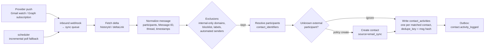

# 12 — Contacts

> **Status:** Proposed · **Owner:** Data Experience team (Contacts) · **Date:** 2026-10-03
> **Conforms to:** [`00-canonical-decisions.md`](./00-canonical-decisions.md) (normative): D3 workspace affinity ("all bases + the contact directory of a workspace live on the same shard"), D6 storage, §3 prefix `ctc`, §4 field type `contact`, §5 tables `contact_identifiers`, `contact_merge_events`, `contact_activities`, §6 contact events.

**Sections covered:** §15 Contacts (Part 10) — contacts as first-class objects implemented as a workspace-scoped system base; system fields; identifiers & normalization; the `contact` field type and cross-base links (integrity, sharding); identity resolution; deduplication (exact, fuzzy, scoring, review queue); merging & unmerging; search; contact timeline (direct + derived activities); communication-history ingestion (email/calendar); ownership; permissions & visibility; API; events & realtime; deletion/restore; GDPR erasure.

**Related:** [`02-domain-model-and-erd.md`](./02-domain-model-and-erd.md) §3.12 · [`05-sql-schema.md`](./05-sql-schema.md) · [`06-record-storage.md`](./06-record-storage.md) · [`07-field-engine.md`](./07-field-engine.md) §8.20 (`contact` field) · [`09-linked-record-engine.md`](./09-linked-record-engine.md) · [`11-filter-sort-group.md`](./11-filter-sort-group.md) · [`14-automation-engine.md`](./14-automation-engine.md) · [`17-api-architecture.md`](./17-api-architecture.md) (`contacts:read|write` scopes) · [`18-search-attachments-collaboration.md`](./18-search-attachments-collaboration.md) §17.9 · [`19-permissions-and-multitenancy.md`](./19-permissions-and-multitenancy.md).

> **Naming reconciliation.** The assignment brief called the system base/table kind `system_contacts`. The schema docs already fixed `bases.kind = 'contact_directory'` ([`05`](./05-sql-schema.md) `core.base_directory.kind`, [`02`](./02-domain-model-and-erd.md) §3.12) with two system tables (`Contacts`, `Companies`, `tables.config.isSystem = true`). This document follows 05/02; "system contacts directory" below means exactly that. The person/company distinction (`kind person|company` in the brief) is the **table** a contact lives in and is exposed in the API as `contact.kind`.

---

## 1. Goals and capability summary

**[Observed]** CRM-flavoured spreadsheet-database products let teams keep people and organizations in one place, link them from projects, deals, tickets and events, dedupe them, and see an activity history per person.

**[Ours]** Each workspace has exactly one **contact directory**: a system base on the workspace's shard holding two system tables. Contacts are *records*, so every engine we already built applies unchanged — fields, views, filters, sorts, groups, formulas/lookups/rollups, comments, revisions, automations, interfaces, API, search, import. Contact-specific behaviour is layered on top:

1. **Identity** — normalized identifiers (`contact_identifiers`) for exact lookup and uniqueness.
2. **Linking from anywhere** — the `contact` field type links records in any base of the workspace to the directory through `record_links` (the only cross-base link relation allowed).
3. **Dedup & merge** — candidate detection, review queue, deterministic merge with full undo (unmerge).
4. **Timeline** — `contact_activities` + derived activities from linked records, comments, automations, and synced email/calendar.
5. **Privacy** — directory-level roles, projections for non-directory users, GDPR subject erasure across all stores.

Non-goals (V1): a full email client, sequences/campaigns, lead scoring (customers build these with automations & AI fields).

## 2. Decision: contacts as records in a system base vs dedicated tables

| | **A. System base with record tables (chosen)** | B. Dedicated `contacts`/`companies` relational tables |
|---|---|---|
| Custom fields, views, filters, formulas, automations, interfaces, import/export, API | Free (reuse) | Must be rebuilt or bridged ("virtual table" adapters everywhere) |
| Linking from user tables | `record_links` + `link_relations` (one engine) | Second link mechanism |
| Strongly-typed system attributes (emails, phones) | Need protection rules + side table for identifiers | Native columns |
| Query performance on identifiers | `contact_identifiers` (typed, indexed) | Native |
| Permission model | Base roles + field restrictions (existing) | New ACL model |

**Recommendation: A.** The engine's value is generality; contacts are "a table everyone shares". The only things that need typed relational storage — identifiers, merge history, activities — get dedicated tables (already in the spine inventory). Protection of system fields is a small policy layer (§3.3).

---

## 3. Directory structure

### 3.1 Provisioning

* Created **lazily** on first use (first `contact` field, first contact import, first directory open, or first email/calendar sync), not at workspace creation — most workspaces never use contacts. Creation is idempotent: `core.workspaces.contact_directory_base_id` is set with `UPDATE … WHERE contact_directory_base_id IS NULL RETURNING`, and the data-plane base is created in the same saga ([`27`](./27-data-flows-transactions-migrations.md) pattern: control-plane intent → data-plane create → control-plane confirm).
* Base: `bases.kind = 'contact_directory'`, name "Contacts" (renamable), one per workspace; cannot be duplicated, moved to another workspace, deleted on its own (only with the workspace), or turned into a template. It is hidden from the normal base list and shown as **Contacts** in the workspace navigation.
* Tables: `Contacts` (people) and `Companies`, both `tables.config.isSystem = true` with `tables.config.systemKind = 'person' | 'company'`. Users can add **more** (non-system) tables in the directory base (e.g. "Contact lists") — they behave like ordinary tables but cannot be targets of `contact` fields.
* Workspace shard move ([`04`](./04-database-architecture.md)) moves the directory with the bases — the co-location invariant (D3) is what makes cross-base links safe.

### 3.2 System fields

System fields carry `fields.config.systemKey`; users can rename, hide, reorder, describe and restrict them, but cannot delete them or change their type. Users can add any number of custom fields.

**Contacts (person) table**

| systemKey | Type (spine §4) | Stored | Notes |
|---|---|---|---|
| `name` (primary) | `formula` (text) | computed | `TRIM(first_name & " " & last_name)` falling back to `display_name_override`, then primary email, then "Unnamed contact"; formula editable within system constraints (must be text) |
| `display_name_override` | `text` | cells | optional |
| `first_name`, `last_name`, `middle_name`, `prefix`, `suffix` | `text` | cells | |
| `emails` | `json` with `config.systemSchema = 'contact_emails'` | cells | `[{ "value": "Ana@Example.com", "label": "work", "primary": true }]` ≤ 20 entries; validated + normalized by the system schema; mirrors to `contact_identifiers` |
| `primary_email` | `formula` (email result) | computed | first `primary` email; filterable/sortable like any email; used in chips |
| `phones` | `json` (`contact_phones`) | cells | `[{ "value": "+14155550100", "raw": "(415) 555-0100", "label": "mobile", "primary": true }]` ≤ 20 |
| `primary_phone` | `formula` (phone) | computed | |
| `addresses` | `json` (`contact_addresses`) | cells | `[{ label, street, city, region, postalCode, countryCode (ISO 3166-1), primary }]` ≤ 10 |
| `social_profiles` | `json` (`contact_social`) | cells | `[{ platform: 'linkedin'|'x'|'github'|'instagram'|'facebook'|'website'|'other', handle?, url }]` ≤ 20 |
| `job_title`, `department` | `text` | cells | |
| `company` | `link` → Companies (single, inverse `people` on Companies) | `record_links` | ordinary intra-base link |
| `avatar` | `attachment` (max 1, image) | cells | auto-fetched from Gravatar only if workspace setting allows (privacy default: off) |
| `tags` | `multi_select` | cells | |
| `notes` | `long_text` (rich) | cells | |
| `owner` | `collaborator` (single) | cells | §13 |
| `lifecycle_stage` | `single_select` (default options: Lead, Prospect, Customer, Partner, Other; editable) | cells | optional system field, can be hidden |
| `do_not_contact` | `checkbox` | cells | respected by email-sending automation actions (warning + block option) |
| `source` | `single_select` | cells | `manual|import|form|email_sync|calendar_sync|api|automation` (+ user options) |
| `last_activity_at` | `datetime` (system-computed) | computed | max(`contact_activities.occurred_at`) visible to "everyone" scope; maintained by the timeline projector (§10.2) |
| `created_time`, `modified_time`, `created_by` | standard | columns | |

**Companies table**: `name` (primary, `text`), `domains` (`json`, `contact_domains`, `[{ value: "example.com", primary }]` → identifiers kind `domain`), `website` (`url`), `industry` (`single_select`), `size` (`single_select`), `addresses`, `phones`, `social_profiles`, `logo` (`attachment`), `people` (inverse link of `company`), `parent_company` (self-link, single), `owner`, `tags`, `notes`, `last_activity_at`.

**Why `json` + system schemas for multi-valued identifiers** (instead of N separate email fields): contacts have variable numbers of emails/phones; labels and "primary" flags matter; and the identifiers must be mirrored into a normalized index table anyway. The json storage keeps the record self-contained (revisions, undo, API payloads), the system schema gives validation and a dedicated cell editor, and filtering uses **identifier operators** (§3.4) backed by `contact_identifiers`. No new field type key is needed (spine §4 `json` is "internal/advanced"; here it is used with a system schema only by system fields). Users who want a plain email column can still add an ordinary `email` field.

### 3.3 Protection rules (system field policy)

Implemented as a `SystemTablePolicy` hook in the schema service ([`07`](./07-field-engine.md)):

* `field.delete`, `field.type_change` on system fields → `409 SYSTEM_FIELD_PROTECTED`.
* `table.delete` on system tables → `409 SYSTEM_TABLE_PROTECTED`.
* Field engine still validates values; the system schemas run *after* type validation.
* Formula system fields (`name`, `primary_email`, `primary_phone`) may be edited but must keep their result type.
* Primary field of Contacts cannot be changed to another field (it is the display contract for every `contact` chip).

### 3.4 Identifier filter operators

The filter AST ([`11`](./11-filter-sort-group.md)) gains a contact-only operator group for system json fields with `systemSchema ∈ {contact_emails, contact_phones, contact_social, contact_domains}`: `contains` (any identifier raw contains text), `has_identifier` (exact match after normalization), `is_empty`, `is_not_empty`. SQL:

```sql
EXISTS (SELECT 1 FROM data.contact_identifiers ci
        WHERE ci.workspace_id = $ws AND ci.contact_record_id = r.id
          AND ci.kind = 'email' AND ci.value_normalized = $1 AND ci.status = 'active')
```

In-memory evaluation reads the json cell and applies the same normalizer (shared `@tabula/contacts-normalize` package). These operators are listed under Proposed additions for 11's catalogue.

---

## 4. Identifiers

### 4.1 Table

Columns as in [`02`](./02-domain-model-and-erd.md) §3.12, plus `status` and `value_canonical` (Proposed additions):

```sql
CREATE TABLE data.contact_identifiers (
  id                 uuid PRIMARY KEY,
  workspace_id       uuid NOT NULL,
  contact_record_id  uuid NOT NULL,          -- records.id in Contacts or Companies table
  contact_table_id   uuid NOT NULL,          -- for partition-pruned joins to records
  kind               text NOT NULL CHECK (kind IN ('email','phone','linkedin','x','github','domain','external')),
  value_raw          text NOT NULL,          -- as entered (≤ 320)
  value_normalized   text NOT NULL,          -- exact-match key (§4.2)
  value_canonical    text,                   -- optional looser key (gmail dots/plus, phone without extension)
  is_primary         boolean NOT NULL DEFAULT false,
  status             text NOT NULL DEFAULT 'active' CHECK (status IN ('active','conflict','merged','trashed','erased')),
  source             text NOT NULL,          -- manual|import|sync:<sync_source id>|automation|form|api
  verified_at        timestamptz,
  created_at         timestamptz NOT NULL DEFAULT now()
);
-- Uniqueness among live identifiers (02: "the dedup key")
CREATE UNIQUE INDEX contact_identifiers_unique_active
  ON data.contact_identifiers (workspace_id, kind, value_normalized) WHERE status = 'active';
CREATE INDEX contact_identifiers_by_contact   ON data.contact_identifiers (contact_record_id);
CREATE INDEX contact_identifiers_canonical    ON data.contact_identifiers (workspace_id, kind, value_canonical)
  WHERE value_canonical IS NOT NULL AND status IN ('active','conflict');
CREATE INDEX contact_identifiers_lookup_any   ON data.contact_identifiers (workspace_id, kind, value_normalized)
  WHERE status = 'conflict';
```

Identifiers are **derived data**: the source of truth is the record's `emails`/`phones`/`social_profiles`/`domains` cells. They are rewritten in the **same transaction** as any write to those cells (record write hook in the contacts module), from a diff of old vs new normalized sets.

### 4.2 Normalization rules (`@tabula/contacts-normalize`, isomorphic)

| Kind | `value_normalized` | `value_canonical` (optional, workspace setting) |
|---|---|---|
| email | trim; NFC; lowercase the whole address (RFC 5321 allows case-sensitive local parts, but mainstream providers ignore case and lowercasing prevents duplicates); IDNA-to-ASCII domain (punycode); reject if not a valid addr-spec | `gmail.com`/`googlemail.com`: remove dots in local part and `+tag` suffix, domain → `gmail.com`; generic `+tag` stripping only if `workspace.settings.contacts.stripPlusTags` (default **off**: some providers use `+` meaningfully) |
| phone | E.164 via libphonenumber with default region = contact address country → workspace default region; invalid numbers stored as `raw:<digits>` (still matchable exactly) | E.164 without extension |
| linkedin | `linkedin.com/in/<handle>` → handle lowercase; company pages `company/<handle>` | — |
| x / github | handle lowercase without `@` | — |
| domain (companies) | lowercase, IDNA ASCII, strip `www.`, registrable domain (eTLD+1 via Public Suffix List snapshot pinned per release) | — |
| external | `<system>:<id>` as given (e.g. `hubspot:12345`) | — |

Personal email domains (`gmail.com`, `outlook.com`, …, list in the package) are **never** used to infer company membership.

### 4.3 Conflicts instead of failures

The unique index applies to `status = 'active'`. When a write would create an identifier already active on *another* contact (e.g., a user types an email that belongs to an existing contact, or an import row collides):

| Context | Behaviour |
|---|---|
| Interactive UI edit | Pre-check endpoint warns "This email belongs to Ana Silva — open / merge / keep both"; if "keep both", the new identifier is stored with `status = 'conflict'` and a **dedup candidate** with reason `identifier_conflict` is created (§6) |
| API create/update | Default `onIdentifierConflict: "flag"` (as above). `"reject"` → `409 CONTACT_IDENTIFIER_CONFLICT` with the existing contact id; `"merge_into_existing"` → upsert semantics (§5) |
| Import / sync / form / automation | Resolution first (§5): rows matching an existing identifier **update that contact** (by default) instead of creating a new one |

This keeps the database-level guarantee ("an active identifier resolves to exactly one contact") while never losing user input.

---

## 5. Identity resolution

`resolveContact(input, policy)` is used by imports, forms ([`10`](./10-view-engine.md) §16.7), email/calendar sync, API upsert, automations ("Find or create contact"), and field conversion (text/email → `contact`, [`07`](./07-field-engine.md)).

```ts
interface ResolveInput {
  kind: 'person' | 'company';
  emails?: string[]; phones?: string[]; socials?: Array<{ platform: string; handle: string }>;
  domains?: string[]; externalIds?: string[];
  name?: { first?: string; last?: string; full?: string };
  companyName?: string;
}
interface ResolvePolicy {
  create: 'never' | 'if_no_match';
  useCanonical: boolean;          // allow gmail-dot / phone-extension loose matches (default true)
  fuzzy: 'off' | 'suggest';       // fuzzy never auto-links; 'suggest' returns candidates
  updateExisting: 'never' | 'fill_empty' | 'overwrite'; // what to do with input attributes on a match (default fill_empty)
}
type ResolveResult =
  | { status: 'matched'; contactId: string; matchedOn: IdentifierKind; created: false }
  | { status: 'created'; contactId: string; created: true }
  | { status: 'ambiguous'; candidates: string[] }      // identifiers point to ≥ 2 distinct contacts
  | { status: 'not_found'; suggestions?: Array<{ contactId: string; score: number }> };
```

Algorithm (one SQL round trip for the exact part):

```sql
SELECT DISTINCT ci.contact_record_id, ci.kind,
       CASE WHEN ci.value_normalized = ANY($norm) THEN 1 ELSE 2 END AS strength
FROM data.contact_identifiers ci
WHERE ci.workspace_id = $ws AND ci.status IN ('active','conflict')
  AND ( (ci.kind, ci.value_normalized) IN (SELECT * FROM unnest($kinds::text[], $norm::text[]))
     OR ($useCanonical AND (ci.kind, ci.value_canonical) IN (SELECT * FROM unnest($kinds::text[], $canon::text[]))) );
```

* Strength order: `external` > `email` > `phone` > social > `domain` (domain only resolves **companies**).
* One distinct contact → `matched`. Several → `ambiguous`. Caller behaviour: import marks the row for review; email/calendar sync attaches the activity to the single strongest match, or to none (recording `ambiguous_participant` in the activity metadata) when the strongest signal is shared; forms pick the oldest active contact and raise a dedup candidate.
* No match and `create: 'if_no_match'` → create with `INSERT … ON CONFLICT` safety: the identifier insert uses the unique index; on a race (two concurrent resolvers creating the same email), the loser's transaction catches the unique violation, rolls back to a savepoint, and re-resolves → `matched`. Exactly-once creation under concurrency without advisory locks.

---

## 6. Deduplication

### 6.1 Candidate generation

| Source | Trigger | Reason code |
|---|---|---|
| Identifier conflict (§4.3) | write | `identifier_conflict` (score 1.0) |
| Canonical identifier match (gmail dots, phone extension) | write | `canonical_identifier` (0.95) |
| Fuzzy name + company/domain | async after create/update of name/company fields (debounced 30 s), and full sweep weekly or on demand | `fuzzy_name` |
| Import pre-flight | import mapping step | any of the above, shown before commit |

Fuzzy blocking (avoid O(n²)): candidates are only compared within **blocks**: (a) same company record; (b) same email domain (non-personal); (c) same last-name trigram bucket — implemented with `pg_trgm` on the name:

```sql
-- candidates for contact $c (people table $t, name slot = primary formula slot $s)
SELECT o.id, similarity(lower(o.computed->>$s), lower($name)) AS name_sim
FROM data.records o
WHERE o.table_id = $t AND o.deleted_at IS NULL AND o.id <> $c
  AND lower(o.computed->>$s) % lower($name)              -- trigram similarity ≥ pg_trgm.similarity_threshold (0.45)
ORDER BY name_sim DESC
LIMIT 50;
```

For directories above `INDEX_SIDECAR_THRESHOLD` this runs against the primary field's text sidecar (`record_index_text.value_eq` with its trigram GIN index, [`06`](./06-record-storage.md) §13), which is always enabled for primary fields.

### 6.2 Scoring

```text
score = 1 − Π (1 − wᵢ·sᵢ)           -- noisy-OR over signals sᵢ ∈ [0,1]
signals:
  name_sim        trigram similarity of normalized full names      w = 0.55
  first_initial   first names compatible (equal, initial match, nickname table "Bob"≈"Robert")   w = 0.20
  same_company    linked to the same company record                w = 0.35
  same_domain     work-email domains equal (non-personal)          w = 0.30
  phone_suffix    last 7 digits of any phone equal                 w = 0.50
  title_sim       job title similarity                             w = 0.10
penalties:
  conflicting emails on the same domain (both have work emails, different) → score × 0.6
  both have different external ids from the same system → score = 0 (systems of record disagree)
```

Thresholds (workspace-tunable): **≥ 0.92** high-confidence, **0.70–0.92** medium, below 0.70 discarded. **Auto-merge is off by default**; when enabled (`contacts.autoMerge = 'identifier_only'`), only `identifier_conflict`/`canonical_identifier` candidates whose other fields don't conflict are auto-merged by the system actor (always unmergeable). Fuzzy matches are never auto-merged.

### 6.3 Review queue

Proposed table `contact_duplicate_candidates` (see Proposed additions):

```sql
CREATE TABLE data.contact_duplicate_candidates (
  id             uuid PRIMARY KEY,
  workspace_id   uuid NOT NULL,
  table_id       uuid NOT NULL,                 -- Contacts or Companies
  contact_a_id   uuid NOT NULL,                 -- a < b (canonical pair order)
  contact_b_id   uuid NOT NULL,
  score          real NOT NULL,
  reasons        jsonb NOT NULL,                -- [{code, detail}]
  status         text NOT NULL DEFAULT 'open' CHECK (status IN ('open','merged','dismissed','stale')),
  decided_by     uuid, decided_at timestamptz,
  created_at     timestamptz NOT NULL DEFAULT now(),
  updated_at     timestamptz NOT NULL DEFAULT now(),
  UNIQUE (workspace_id, contact_a_id, contact_b_id)
);
CREATE INDEX contact_dup_open ON data.contact_duplicate_candidates (workspace_id, status, score DESC) WHERE status = 'open';
```

* "Dismiss" is remembered: the pair is never re-suggested unless a *new* strong signal appears (identifier conflict) — `reasons` diff decides.
* Candidates become `stale` when either side is deleted/merged elsewhere.
* UI: a review page in the directory with side-by-side comparison, field-level picks, bulk "merge all high-confidence".
* Permission: `record.update` + `record.delete` on the directory table (merge deletes the loser).

---

## 7. Merging

### 7.1 Operation

`POST /v1/workspaces/{wsp}/contacts/{ctc}:merge` `{ "mergeIds": ["ctc_…", …], "fieldResolution"?: {...}, "survivor"?: "ctc_…" }` — up to 10 contacts merged into one survivor, same table only (person↔company merges are rejected).

### 7.2 Survivor selection (when not chosen by the user)

Ranked by: (1) has external id from a system-of-record sync (keep the synced record) → (2) most inbound links (count of `record_links` across all relations targeting it) → (3) most non-empty fields → (4) oldest `created_at`. Deterministic, explained in the merge preview.

### 7.3 Field conflict resolution (defaults, overridable per field in the preview)

| Field kind | Rule |
|---|---|
| Scalar user fields (text, number, date, select, url, …) | survivor value if non-empty, else first non-empty among losers in merge-preview order |
| `emails`, `phones`, `addresses`, `social_profiles`, `domains` | **union**, deduplicated by normalized value; survivor's primary stays primary; labels kept |
| `multi_select`, `tags`, multi collaborator | union |
| `long_text` (`notes`) | survivor's text + `\n\n---\nMerged from <name> (<date>):\n` + loser text, if loser non-empty and different |
| `link` fields inside the directory (`company`, custom links) | union of links (subject to the field's `allowMultiple`; single → survivor's unless empty) |
| `owner` | survivor's if set, else most recently set among losers |
| `attachment` (`avatar`) | survivor's if set else loser's |
| `created_time` | `min` (exposed as `merged_created_at` in API metadata; the record column itself is not rewritten) |
| `do_not_contact` | **OR** (privacy-conservative: if any was opted out, survivor is opted out) |
| Computed fields | recomputed |

The resolution is computed by a pure function (`planMerge(survivor, losers, overrides) → MergePlan`) shown in the preview (`POST …:merge?dryRun=true`) and applied verbatim.

### 7.4 Transaction (≤ `COMPUTE_SYNC_FANOUT_LIMIT` relinks; otherwise a `long_operation`)

```sql
BEGIN;
-- 0. lock participants in id order (avoid deadlocks with concurrent merges)
SELECT id FROM data.records WHERE table_id = $t AND id = ANY($all) ORDER BY id FOR UPDATE;

-- 1. survivor cells := plan.cells  (normal record write path: validation, revisions, base_changes, compute)

-- 2. relink inbound record_links from every relation targeting the directory table
--    (relations where side B table = $t; for each relation, capture moved rows for unmerge)
WITH moved AS (
  DELETE FROM data.record_links l
  WHERE l.relation_id = ANY($relationsTargetingT) AND l.b_record_id = ANY($losers)
  RETURNING l.relation_id, l.a_record_id, l.b_record_id AS old_b, l.a_order, l.b_order
), ins AS (
  INSERT INTO data.record_links (relation_id, a_record_id, b_record_id, a_order, b_order)
  SELECT relation_id, a_record_id, $survivor, a_order, b_order FROM moved
  ON CONFLICT (relation_id, a_record_id, b_record_id) DO NOTHING      -- source already linked to survivor
  RETURNING relation_id, a_record_id
)
SELECT m.*, (i.a_record_id IS NOT NULL) AS inserted FROM moved m
LEFT JOIN ins i USING (relation_id, a_record_id);                    -- → contact_merge_events.moved_links
-- single-cardinality link fields on the source side are unaffected (each source still has exactly one link)

-- 3. identifiers: losers' identifiers → survivor (status 'merged' for duplicates of survivor's, else 'active')
-- 4. contact_activities: UPDATE … SET contact_record_id = $survivor, metadata.original_contact = old id
-- 5. comments, mentions(target contact), record_subscriptions: re-point to survivor (keep original id in metadata)
-- 6. losers: soft delete with a deletion_batches row of kind 'merge' (restorable only via unmerge)
-- 7. contact_duplicate_candidates among participants → 'merged'; others referencing losers → 'stale'
-- 8. INSERT contact_merge_events (survivor, merged ids, field_resolution, moved_links, moved_identifiers,
--                                 moved_activities, merged_by, deletion_batch_id)
-- 9. base_changes for directory base + every base whose record_links changed (ops: link_remove/link_add,
--    so realtime clients of those bases update chips); outbox: contact.merged, record.links_changed per base
COMMIT;
```

Cross-base `base_changes`: the merge touches several bases' change logs in one transaction — allowed because they are on the same shard (D3). Each base's `change_seq` is incremented in base-id order (deadlock avoidance).

Fan-out: lookups/rollups in other bases that read through `contact` fields are recomputed by the compute engine (D7) — synchronous up to 500 affected records, else deferred (`computed_stale`).

### 7.5 Unmerge

`POST …/contacts/{survivor}/merges/{mergeEventId}:unmerge` — allowed while the loser records are within `TRASH_RETENTION` and the merge event is the **latest merge** involving the survivor (merges are undone in LIFO order; older ones require undoing newer first).

1. Restore loser records (clear `deleted_at`).
2. Restore loser field values from `field_resolution` (pre-merge snapshots of losers are stored in the event). The survivor's fields: revert only fields **not modified since the merge** (compare `cell_meta[slot].seq` with the merge's change seq); fields edited after the merge keep their current value (reported in the response as `keptAfterMergeEdits`).
3. Move back `moved_links` rows that still exist on the survivor and were `inserted` by the merge (links created later, or links that pre-existed on the survivor, are left alone).
4. Move back identifiers (`moved_identifiers`), activities, comments, mentions, subscriptions recorded in the event.
5. Mark event `unmerged_at`; emit `contact.unmerged`.

### 7.6 Companies

Company merges follow the same algorithm; additionally the `people` inverse link union means person records' `company` (single link) are re-pointed to the survivor. Domains union.

---

## 8. The `contact` field type and cross-base links

### 8.1 Model

Per [`07`](./07-field-engine.md) §8.20: config `{ linkRelationId, allowMultiple, inverseFieldId: Uuid | null, roles?: string[] }`; storage is `record_links` under a `link_relations` row whose side A is the user table/field and side B is the directory `Contacts` (or `Companies`, `config.contactKind = 'company'`) table.

**Decision: contact relations are one-sided on the directory side (`inverseFieldId = null`).**

* Option A — create an inverse link field on the Contacts table for every `contact` field in every base: the directory table would accumulate hundreds of fields (hard limit 500 fields per table, spine §12), leak base/table names to all directory users, and make directory schema churn whenever any base changes.
* Option B — **no inverse field**; the directory shows a virtual **"Linked records"** panel per contact, computed from `record_links` across all relations targeting the directory, filtered by the viewer's access (§12.3). Directory admins can *opt in* to materialize an inverse field for a specific relation (`inverseFieldId` set) when they want rollups on the contact side (e.g. "Total deal value" via rollup of a Deals relation) — limited to 50 materialized inverses per directory table.

**Recommendation: B with opt-in inverses.**

### 8.2 Integrity

* `link_relations` validation: a relation may span bases **only** if side B's table is a system directory table (`tables.config.isSystem`) of the **same workspace** (checked against `core.workspaces.contact_directory_base_id`). Any other cross-base relation → `422 CROSS_BASE_LINK_NOT_ALLOWED`.
* Same shard (D3) ⇒ link inserts, merges and deletes are ordinary single-database transactions; no distributed consistency needed.
* Record deletion of a contact: links are soft-hidden per [`09`](./09-linked-record-engine.md) (trash keeps link pairs in `deletion_batches.captured` for restore).
* **Base deletion** (a base with contact fields): its relations are soft-deleted with the base; the directory panel stops showing them; restore brings them back; purge deletes link rows.
* **Base moved to another workspace** (admin action, [`04`](./04-database-architecture.md)): contact relations can't follow (the target workspace has another directory). The move tool offers: (a) **re-resolve** — for each linked contact, `resolveContact` in the target directory by identifiers (create if needed, copying the projected fields), then rewrite links; or (b) convert contact fields to text (`name <email>`). Default (a), run as a `long_operation`.
* **Workspace shard move**: directory and bases move together (single unit).
* **Duplicate base** within the same workspace: contact links are copied (same directory). Into another workspace: same options as move.
* **Templates**: contact fields in templates are instantiated empty and bound to the target workspace's directory (created lazily).

### 8.3 Display, filtering, sorting

* Cell value API ([`07`](./07-field-engine.md)): `[{ "id": "ctc_…", "name": "...", "primaryEmail": "..." }]` (projection, §12.3).
* Filter: link operators ([`11`](./11-filter-sort-group.md) §4) with target = directory table (e.g. `has_any_of [ctc_…]`, `contains "acme"` over contact names); plus `contact_has_identifier` (V1) via `contact_identifiers` join.
* Sort/group: by first linked contact's name using the denormalized link sort key ([`11`](./11-filter-sort-group.md) §9.7).
* Lookups/rollups through contact fields are allowed, **but only of fields the viewer may see through the projection rules** — enforced at schema time: a lookup of a directory field marked restricted (§12.2) is rejected for creators without that field's read permission, and at read time projected out for viewers without it.

---

## 9. Search

Per [`18`](./18-search-attachments-collaboration.md) §17.9:

* Identifier-shaped queries (contains `@`, ≥ 7 digits, a URL/handle) → exact lookup in `contact_identifiers` (`value_normalized`, then `value_canonical`) — immediately consistent.
* Otherwise → search index (`search_documents` in MVP; OpenSearch `docType: contact` in V1) with prefix matching on name, emails, company name, job title; boosted by `last_activity_at` recency and by the viewer's own ownership.
* Contact pickers (in `contact` cells) call `GET /v1/workspaces/{wsp}/contacts:search?q=&kind=person&limit=20` which applies the projection & visibility rules of §12 (a base-only collaborator searching in a picker sees projected fields only, and only if the workspace setting `contacts.pickerVisibility = 'all'`; with `'linked_only'` they can only pick contacts already linked from bases they can read, plus create new ones).
* Results are permission-filtered **before** ranking/truncation (no count leaks).

---

## 10. Contact timeline

### 10.1 Activity model

`contact_activities` columns per [`02`](./02-domain-model-and-erd.md) §3.12, plus visibility/source columns (Proposed additions):

```sql
CREATE TABLE data.contact_activities (
  id                 uuid NOT NULL,
  occurred_at        timestamptz NOT NULL,
  workspace_id       uuid NOT NULL,
  contact_record_id  uuid NOT NULL,
  kind               text NOT NULL CHECK (kind IN ('email_sent','email_received','call','meeting','note',
                       'automation_action','external_sync','mention','record_linked','record_unlinked',
                       'form_submitted','comment')),
  title              text NOT NULL,                 -- ≤ 500, plain
  body               jsonb,                         -- kind-specific payload, ≤ 64 KB (large bodies → S3 ref)
  source_ref         jsonb NOT NULL,                -- {type: 'record'|'comment'|'automation_run'|'sync_run'|'message'|'manual', id, baseId?, tableId?}
  source_base_id     uuid,                          -- for permission filtering (NULL = directory-level / integration)
  visibility         text NOT NULL DEFAULT 'workspace'
                       CHECK (visibility IN ('workspace','base_scoped','private','metadata_only')),
  owner_user_id      uuid,                          -- for private/metadata_only (mailbox owner)
  actor              jsonb NOT NULL,                -- event actor envelope (spine §6)
  dedupe_key         text,                          -- e.g. 'msg:<Message-ID hash>' or 'evt:<event id>'
  original_contact_id uuid,                         -- set when moved by merge
  erased_at          timestamptz,
  PRIMARY KEY (id, occurred_at)
) PARTITION BY RANGE (occurred_at);                 -- monthly partitions (automatic, maintenance job)
CREATE INDEX contact_activities_timeline ON data.contact_activities (contact_record_id, occurred_at DESC, id);
CREATE UNIQUE INDEX contact_activities_dedupe ON data.contact_activities (workspace_id, contact_record_id, dedupe_key, occurred_at)
  WHERE dedupe_key IS NOT NULL;                     -- partition key included as required for unique indexes
```

Partitioning decision: partitioned by month from day one (cheap to set up; email sync can produce millions of rows; retention and erasure become partition-friendly). Timeline reads are `(contact_record_id, occurred_at DESC)` with keyset pagination — partition pruning applies when the client scrolls by time.

### 10.2 Direct vs derived activities

| Kind | How it is produced |
|---|---|
| `note`, `call`, `meeting` (manual) | Users via timeline UI/API (`POST …/contacts/{ctc}/activities`) |
| `email_sent` / `email_received` / `meeting` (synced) | Ingestion pipeline (§11) |
| `automation_action` | Automation steps that act on a contact (send email, update contact) write an activity with `source_ref = automation_run` ([`14`](./14-automation-engine.md)) |
| `record_linked` / `record_unlinked` | **Timeline projector** consuming `record.links_changed` for relations targeting the directory: "Linked to *Deal: Acme renewal* in *Sales CRM*", `source_base_id` = the source base, `visibility = 'base_scoped'` |
| `comment`, `mention` | Projector on `comment.created`/`mention.created` where the record is a contact or the comment mentions a contact (`@[ctc_…]`, [`18`](./18-search-attachments-collaboration.md)) |
| `form_submitted` | Projector on `form.submitted` where the created record links a contact |
| `external_sync` | Sync engine writes (e.g. CRM import changes) |

**Decision: materialize derived activities (projector writes rows) vs. compute at read time (union over sources).** Read-time union would need `base_changes` (30-day retention, D10) or `record_revisions` scans across all bases — slow and incomplete for old history. Materialization gives O(page) reads and stable history; the cost is write amplification only for events touching contacts. **Chosen: materialize**, with idempotency via `dedupe_key = 'evt:<event id>'` (projector is at-least-once).

The projector is a consumer of `tabula.domain-events.v1` (spine §7 lists "contact timeline" as a consumer). It also maintains `last_activity_at` on the contact (computed slot; coalesced, at most one write per contact per minute).

### 10.3 Reading the timeline (permission-filtered)

```sql
SELECT a.*
FROM data.contact_activities a
WHERE a.contact_record_id = $c AND a.erased_at IS NULL
  AND (a.occurred_at, a.id) < ($cursorAt, $cursorId)
  AND (
        a.visibility = 'workspace'
     OR (a.visibility = 'base_scoped' AND a.source_base_id = ANY($readableBaseIds))      -- from PermissionSnapshots
     OR (a.visibility IN ('private','metadata_only') AND a.owner_user_id = $me)
     OR (a.visibility = 'metadata_only')                                                  -- others: row returned, body redacted in app
  )
ORDER BY a.occurred_at DESC, a.id DESC
LIMIT 50;
```

* `base_scoped` items referencing a record also require record-level visibility when the source table has Enterprise row policies — the API hydrates the referenced record through the record-read path and drops items whose record is unreadable (filtered before pagination by over-fetching ×2, max 3 rounds).
* `metadata_only` items show "Email with Ana Silva · 14 Oct" without subject/body to non-owners.

---

## 11. Communication history ingestion (email & calendar)

### 11.1 Sources

Per-user connections (`integration_connections`, OAuth to Google Workspace / Microsoft 365; scopes: read-only metadata by default, bodies optional) configured as `sync_sources` of kind `mailbox` / `calendar`. Each user explicitly opts in; workspace admins can disable (`organization_policies` / workspace setting `contacts.emailSync = off|metadata|full`).

### 11.2 Pipeline



Rules:

* **Exclusions**: messages where all participants are internal (org verified domains, `organization_domains`) are skipped; newsletter/automated senders (List-Unsubscribe, `noreply@`, bulk precedence) skipped by default; user-defined blocklist (domains/addresses); labels/folders filter.
* **Matching**: participants (From/To/Cc; calendar attendees) → `resolveContact(create: policy)`. Policy `contacts.autoCreateFromEmail`: `never` (default) | `when_replied` (two-way communication) | `always`.
* **Dedup across mailboxes**: the same email seen by several connected users produces one activity per contact (`dedupe_key = 'msg:' + sha256(Message-ID)`); `body.seenBy` accumulates the mailbox owners — visibility is the most permissive of the owners' settings.
* **Storage**: metadata (subject, snippet ≤ 200 chars, participants, thread id, direction, timestamps) in `body`; full bodies (if `full`) encrypted in S3 `tabula-attachments/{ws}/contacts/{activityId}` with attachments as references (not imported by default).
* **Visibility** per connection: `private` (only owner sees), `metadata_only` (others see that communication happened), `workspace` (shared). Default `metadata_only`.
* **Volume limits**: backfill ≤ 12 months, ≤ 50k messages per mailbox initial sync; steady-state rate-limited per provider quota; sync runs recorded in `sync_runs`.
* **Disconnect**: user can delete everything synced from their mailbox (`DELETE … WHERE source_ref->>'syncSourceId' = …` + S3 objects), executed as a `long_operation`.

### 11.3 Calendar

Calendar events → `meeting` activities with attendees resolved; updates to the same event (`iCalUID`) update the activity in place; cancelled events marked `cancelled` in body.

---

## 12. Permissions and visibility

### 12.1 Directory roles

The directory is a base, so access uses ordinary base roles via `core.access_grants` (resource_type `base`) and the role vocabulary of spine §9. **Defaults** (when no explicit grant): workspace role maps to directory role:

| Workspace role | Default directory role |
|---|---|
| owner, creator | creator |
| editor | editor |
| commenter | commenter |
| viewer | viewer |
| (no workspace role: base-only collaborator, guest) | **none** — projection access only (§12.3) |
| interface_only users | none — contacts only via interface elements (§12.4) |

Workspace setting `contacts.defaultMemberRole` can **cap** the default (e.g., `viewer` so only a sales-ops team edits contacts); explicit grants on the directory base (users/teams) raise or set roles. Max-role-wins (D20) applies as everywhere.

### 12.2 Field-level restrictions

Standard `fields.restrictions` (spine §9): who may edit; Enterprise **hide** (e.g., `phones` hidden except for team "Sales"). Hidden fields are removed from all reads (grid, API, search index payloads, lookups through contact fields, timeline bodies that quote them) for principals without access.

### 12.3 Projection for users without a directory role ("link-projected visibility")

A user who can read a record in base X that links contacts, but has no directory role, sees each linked contact through a **projection**: the fields listed in directory setting `contacts.projectionFields` (default: `name`, `primary_email`, `avatar`, `job_title`, `company` name) minus hidden fields. They cannot open the contact in the directory, cannot see its other links or timeline, cannot search the full directory (unless `pickerVisibility = 'all'`, which exposes projection fields of all contacts in pickers — default `'linked_only'`).

Implementation: link hydration ([`10`](./10-view-engine.md) §8.1, [`17`](./17-api-architecture.md) `includes`) checks the directory permission snapshot; without `record.read` on the directory table it returns projection fields only. Lookups through contact fields: a lookup's *field* may only target projection fields unless the lookup creator has directory read access **and** the lookup is marked "visible to base collaborators" — evaluated at read time against the viewer; non-projected lookup values render as "restricted" for viewers without directory access. This keeps lookups from becoming an exfiltration path.

Writing: users with `record.update` on the source record may **link/unlink** existing contacts (choose via picker) and **create** contacts from the cell ("Create contact 'ana@x.com'") only if they have `record.create` on the directory **or** the setting `contacts.allowCreateFromLinks = true` (default true; created contact has `source = manual`, `owner = creator`).

### 12.4 Interface-only users

Interface-only users (spine §9) never get directory access; they see contacts only through interface elements whose data source is a base table with contact fields (projection rules apply) or, if the interface is built *on the directory base itself*, through element data sources exactly as for any table ([`13`](./13-interface-builder.md)).

### 12.5 API scopes

`contacts:read` / `contacts:write` token scopes ([`17`](./17-api-architecture.md)) map to `record.read`/`record.update` on the directory tables, plus contact endpoints below. `data.records:read` on a base does **not** imply `contacts:read`; contact chips are projected as above.

---

## 13. Ownership

* `owner` system field (collaborator, single). Defaults: creator for manual creation; mailbox owner for email-sync-created contacts; form owner for form-created; import mapping or importer.
* Ownership drives: the "My contacts" default personal view, notifications (`record.assigned` when owner set to a user, spine §6), and Enterprise row policies if configured (e.g., "editors may update contacts they own").
* Owner deactivation: contacts keep the user id (shown as deactivated); bulk reassign tool for admins.

---

## 14. API

| Method & path | Purpose |
|---|---|
| `GET /v1/workspaces/{wsp}/contacts?kind=person|company&cursor=&pageSize=` | List (directory table records with contact envelope) |
| `POST /v1/workspaces/{wsp}/contacts:query` | Filter AST query (same as records:query) |
| `GET /v1/workspaces/{wsp}/contacts/{ctc}` | Contact with `identifiers`, `kind`, fields |
| `POST /v1/workspaces/{wsp}/contacts` | Create; `onIdentifierConflict: flag|reject|merge_into_existing` |
| `POST /v1/workspaces/{wsp}/contacts:upsert` | Batch ≤ 1,000, resolve-or-create by identifiers (`resolveContact`), `updateExisting` policy |
| `PATCH /v1/workspaces/{wsp}/contacts/{ctc}` · `DELETE …` | Update / soft delete |
| `GET /v1/workspaces/{wsp}/contacts:lookup?email=|phone=|handle=|domain=` | Exact identifier lookup |
| `GET /v1/workspaces/{wsp}/contacts:search?q=` | Picker/search (§9) |
| `GET /v1/workspaces/{wsp}/contacts/{ctc}/links` | "Linked records" panel: grouped by base/table, permission-filtered, paginated |
| `GET|POST /v1/workspaces/{wsp}/contacts/{ctc}/activities` | Timeline read / manual activity create |
| `PATCH|DELETE /v1/workspaces/{wsp}/contacts/{ctc}/activities/{id}` | Edit/delete manual notes (author or directory creator) |
| `GET /v1/workspaces/{wsp}/contacts/duplicates?status=open` | Review queue |
| `POST /v1/workspaces/{wsp}/contacts/duplicates/{id}:dismiss` | Dismiss pair |
| `POST /v1/workspaces/{wsp}/contacts/{ctc}:merge` (`dryRun`) | Merge / preview |
| `POST /v1/workspaces/{wsp}/contacts/{ctc}/merges/{mergeId}:unmerge` | Unmerge |
| `POST /v1/workspaces/{wsp}/contacts:erase` | GDPR erasure request (§17), workspace admin only |

Directory tables are also reachable through the generic records API (`/v1/bases/{directoryBaseId}/tables/{tableId}/records`) — same handlers, same permission checks; the contact endpoints add identifier/merge/timeline semantics and the `ctc_` prefix. Record ids in the directory are encoded with `ctc_` everywhere (the codec maps by table kind); `rec_` ids for directory records are accepted on input for robustness.

---

## 15. Events and realtime

* Domain events (spine §6): `contact.created`, `contact.updated`, `contact.merged`, `contact.unmerged`, `contact.activity_logged` — emitted **in addition to** the generic `record.*` events for directory tables (automations can trigger on either; contact events carry the contact envelope with identifiers).
* `contact.merged` data: `{ survivorId, mergedIds, movedLinkCount, affectedBaseIds }` — consumers: search indexer (delete losers, reindex survivor), automation trigger matcher, webhooks.
* Realtime: the directory is a base with its own channel ([`16`](./16-realtime.md)); clients viewing other bases receive `link_add`/`link_remove` ops in *those* bases' change streams on merge/delete. Chip display data (name/avatar changes) propagate to other bases via the link-display invalidation channel of [`09`](./09-linked-record-engine.md) (subscribers to a base receive `linked_display_changed` for target records referenced in their open windows).

---

## 16. Deletion and restore

* Contact delete = record soft delete (trash, 30 days). Inbound links from other bases are hidden (captured in `deletion_batches.captured` for restore). Identifiers of the trashed contact move to `status = 'trashed'` (outside the partial unique index), so the same email can be used by a new contact while the old one sits in the trash. On restore, identifiers are re-activated; if one now conflicts with an active identifier, it becomes `conflict` and a dedup candidate is raised.
* Activities of deleted contacts remain (hidden) until purge; purge hard-deletes activities, identifiers, candidates, S3 bodies.
* Bulk delete ≥ 1,000 contacts → `long_operation`.
* Directory deletion only with the workspace (workspace trash restores everything).

---

## 17. GDPR / privacy subject erasure

### 17.1 Request

`POST /v1/workspaces/{wsp}/contacts:erase` `{ "identifiers": [{ "kind": "email", "value": "ana@example.com" }], "contactIds"?: [...], "scope": "directory_and_links" | "everything_findable", "reason": "gdpr_art17", "dryRun": true }` — workspace admin (or org admin for org-wide requests across workspaces, fanned out). Dry run returns an inventory (contacts, link counts per base, activity count, revisions, comments mentioning, attachments, search docs, snapshots affected).

### 17.2 Execution (a `long_operation`, idempotent, resumable)

1. **Resolve** subject contacts via identifiers (normalized + canonical) and explicit ids.
2. **Hard delete** contact records (bypass trash) and their `record_rich_docs`, attachments (avatar) + S3 objects/variants.
3. **Links**: delete `record_links` rows to the contacts in every relation (other bases' records remain; their contact cells become empty). Lookups/rollups recompute.
4. **Identifiers, activities, merge events, duplicate candidates**: delete rows; delete S3 email bodies; merge events referencing the subject are redacted (`field_resolution` values replaced by `"[erased]"`) — unmerge becomes impossible for those events.
5. **History**: `record_revisions` rows of the erased records are deleted; revisions of *other* records whose old values contained the contact link are redacted (link ids replaced by an erasure tombstone id). `base_changes` (≤ 30 days) rows containing the subject's values are redacted in place (payload fields replaced; the row kept for sequence continuity — realtime catch-up for those seqs yields a `redacted` op that forces a refetch).
6. **Comments & mentions**: comments *on* the erased contacts deleted; mentions `@[ctc_…]` in other comments/long text replaced by "[erased contact]".
7. **Search**: delete `search_documents` rows and OpenSearch docs (by id) — synchronous call with retry until acknowledged.
8. **`scope = everything_findable`**: additionally runs an identifier search across all bases of the workspace (exact email/phone matches in text/email/phone fields) and produces a **report** of records containing the identifiers for human review — we do **not** auto-delete arbitrary user records (they may be legally retained business records); the admin can bulk-clear the matched cells from the report.
9. **Snapshots & backups**: base snapshots in S3 cannot be rewritten cheaply; an **erasure ledger** row (hashes of the subject's normalized identifiers + erased record ids) is written, and **restoring any snapshot re-applies all ledger entries** before the restored base becomes visible. Database backups expire by retention (≤ 35 days, documented in the DPA); PITR restores also replay the ledger.
10. **Audit**: `audit_events` entry with request id, actor, counts and *hashed* identifiers only (no plaintext PII); the response/ certificate lists what was erased.

Erasure of a contact referenced by an in-flight automation run: the run continues with redacted data (resolves to "not found").

### 17.3 Other privacy controls

* `do_not_contact` respected by email actions; **export** of a subject's data (`contacts/{ctc}:export` → JSON with fields, identifiers, activities visible to the requester) supports access requests (Art. 15).
* Retention policy (Enterprise): auto-delete activities older than N months per kind (partition drops for whole months where possible).
* PII classification: system fields carry `pii: person` metadata ([`07`](./07-field-engine.md)) used by the AI data-access policy (D22) to exclude contact PII from AI prompts unless the workspace allows it.

---

## Proposed additions

| Kind | Item | Purpose |
|---|---|---|
| Table (data) | `contact_duplicate_candidates` (DDL §6.3) | Dedup review queue |
| Table (data) | `privacy_erasure_ledger (id, workspace_id, identifier_hashes text[], erased_record_ids uuid[], request_id, created_at)` | Re-apply erasures on snapshot/PITR restore (§17.2 step 9) |
| Columns | `contact_identifiers.status` (`active|conflict|merged|trashed|erased`), `value_canonical`, `contact_table_id` | Conflict handling, loose matching, partition-pruned joins (§4) |
| Columns | `contact_activities.visibility`, `owner_user_id`, `source_base_id`, `dedupe_key`, `original_contact_id`, `erased_at`; monthly range partitioning | Timeline permissions, idempotent projection, merges, erasure (§10) |
| Columns | `contact_merge_events` loser pre-merge snapshots inside `field_resolution`; `change_seq_at_merge` | Unmerge conflict detection (§7.5) |
| Config | `tables.config.systemKind = 'person'|'company'`; `fields.config.systemKey`; `fields.config.systemSchema` (`contact_emails`, `contact_phones`, `contact_addresses`, `contact_social`, `contact_domains`) | System tables/fields (§3) |
| Settings | workspace `settings.contacts`: `defaultMemberRole`, `projectionFields`, `pickerVisibility`, `allowCreateFromLinks`, `autoMerge`, `stripPlusTags`, `autoCreateFromEmail`, `emailSync`, default phone region | §§4–12 |
| Filter operators (11) | `has_identifier`, identifier `contains`, `contact_has_identifier` | §3.4, §8.3 |
| Field config (07/09) | `contact` field `config.contactKind = 'person'|'company'` | Contact fields targeting Companies |
| Error codes | `SYSTEM_FIELD_PROTECTED`, `SYSTEM_TABLE_PROTECTED`, `CONTACT_IDENTIFIER_CONFLICT`, `CROSS_BASE_LINK_NOT_ALLOWED`, `CONTACT_MERGE_INVALID`, `CONTACT_UNMERGE_NOT_ALLOWED` | |
| Package | `@tabula/contacts-normalize` (isomorphic normalizers; pinned Public Suffix List & libphonenumber metadata) | §4.2 |
| Event (internal) | `linked_display_changed` realtime message (09/16) | Chip updates across bases |
