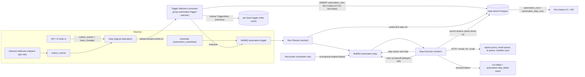
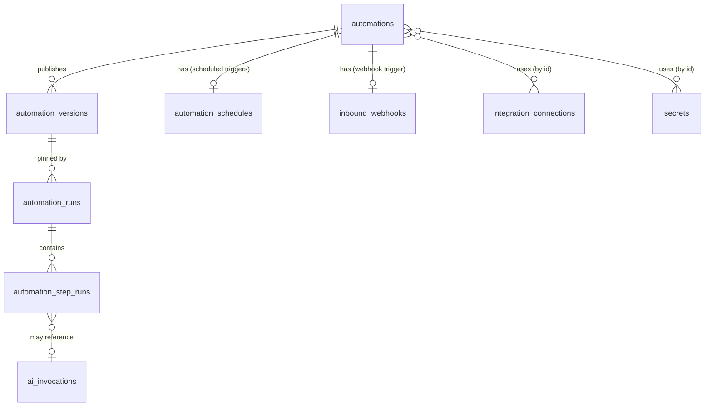
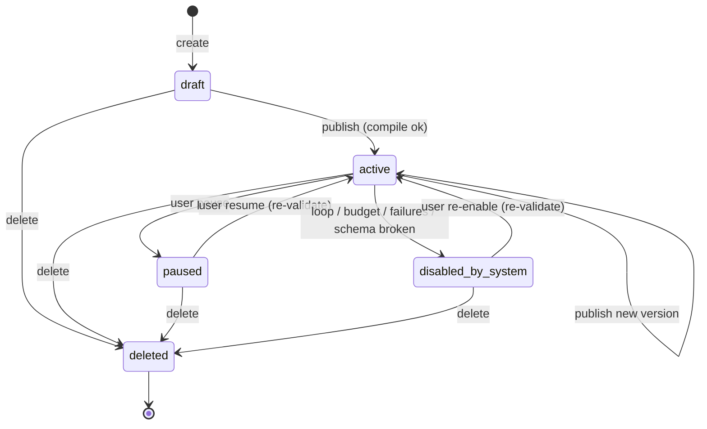
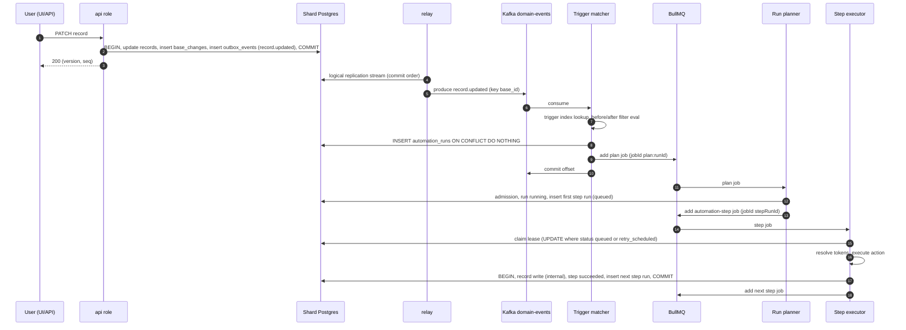
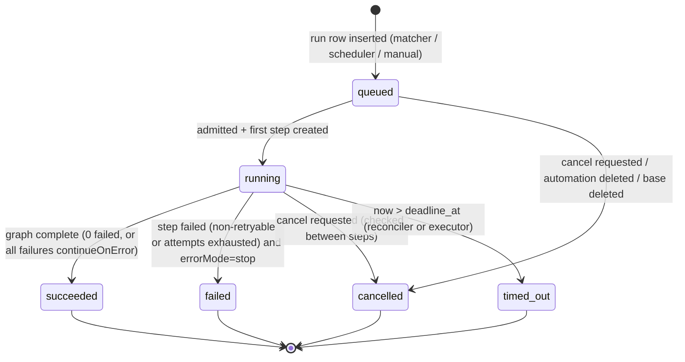
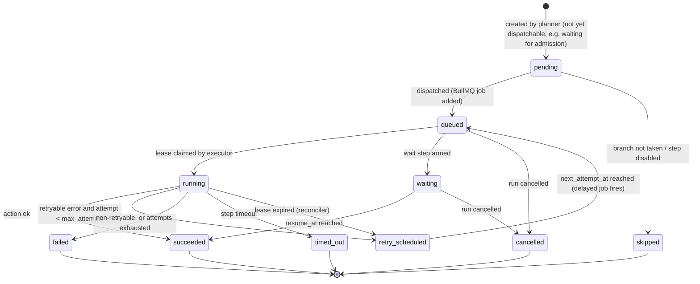
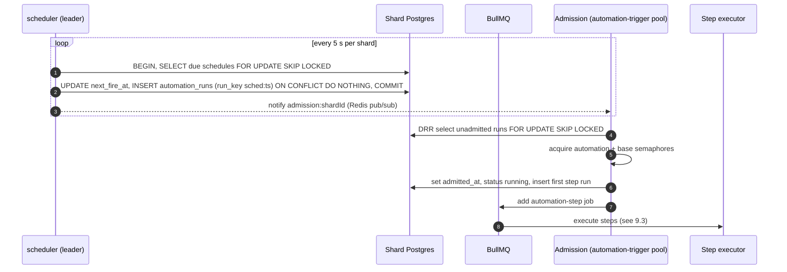
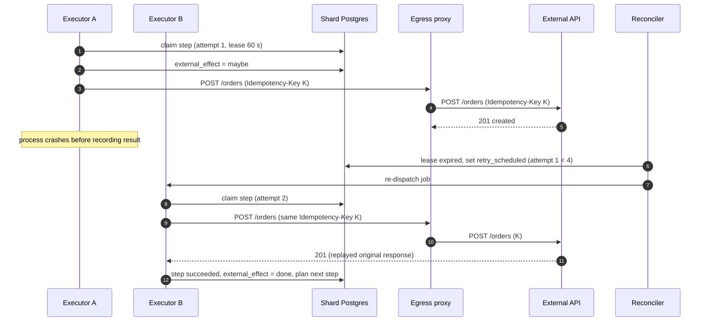
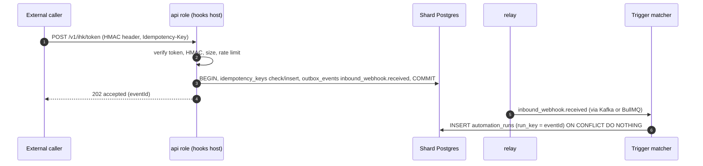
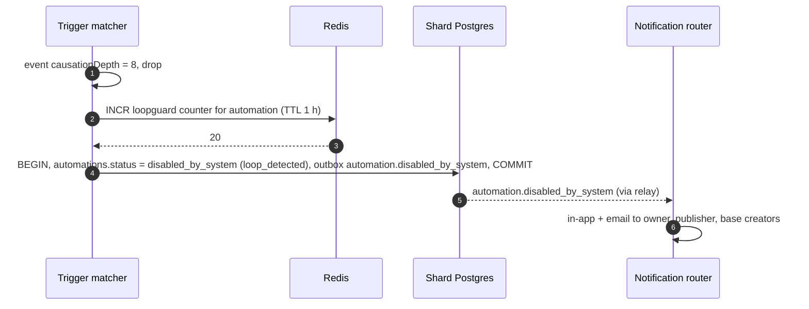

# 14 — Automation Engine

> **Status:** Proposed · **Owner:** Platform Architecture (Automations) · **Date:** 2026-10-03
> Conforms to [`00-canonical-decisions.md`](./00-canonical-decisions.md) (D9–D12, D21, D22, D25, D26; §5 tables, §6 events, §7 topics/queues, §10 Redis, §13 constants). Where this document needs something the spine does not have, it is listed in **§30 Proposed additions**.

**Sections covered:** Section 17 (Automation Engine) and Part 12 (Automations deep-dive): pipeline architecture, definition schema (TypeScript + JSON Schema), triggers, steps graph, token binding, action catalogue, versioning, trigger matching, scheduling, execution model and state machines, idempotency, retries/DLQ, timeouts, concurrency & fairness, rate limiting, partial success & compensation, loop protection, secrets, logs, testing, permissions/run-as identity, schema drift, monitoring, sequence diagrams.

Related: [`05-sql-schema.md`](./05-sql-schema.md) (DDL), [`08-formula-engine.md`](./08-formula-engine.md) (formula tokens in steps), [`11-filter-sort-group.md`](./11-filter-sort-group.md) (filter AST used for conditions), [`15-events.md`](./15-events.md) (event delivery), [`16-realtime.md`](./16-realtime.md), [`17-api-architecture.md`](./17-api-architecture.md), [`21-ai-architecture.md`](./21-ai-architecture.md) (AI actions), [`23-notifications-jobs-caching-performance.md`](./23-notifications-jobs-caching-performance.md) (BullMQ conventions, email/notification queues), [`27-data-flows-transactions-migrations.md`](./27-data-flows-transactions-migrations.md), [`33-architecture-decision-records.md`](./33-architecture-decision-records.md).

---

## 1. Goals, non-goals, provenance

**[Observed]** Airtable-style products offer automations composed of one trigger and an ordered list of actions, with conditional groups and repeating groups, a run history with per-step inputs/outputs, test-runs against a sample record, and per-plan monthly run quotas.

**[Ours]** We build a durable, idempotent, multi-tenant step runner:

| Goal | Target |
|---|---|
| Trigger-to-first-step latency (record events) | p50 < 1.5 s, p99 < 10 s (V1, Kafka profile) |
| Scheduled trigger firing accuracy | within 60 s of `next_fire_at` (p99) |
| Durability | No accepted trigger lost; every run ends in a terminal state (reconciler guarantees) |
| Exactly-once *effects* inside Tabula | Yes for record actions (idempotent step keys + DB uniqueness) |
| Exactly-once *external* effects | Best effort: at-least-once delivery with idempotency key passed to the external system |
| Isolation | One tenant's runaway automation cannot delay others by more than a bounded factor (fair queuing, §14) |
| Throughput (V1 per region) | 2,000 step executions/s sustained, 10× burst absorbed in queue |

**Non-goals:** a general-purpose workflow language (no arbitrary loops/goto, no recursion); long-lived human-in-the-loop workflows beyond `wait` ≤ 30 days; distributed transactions across steps.

---

## 2. Architecture overview: Trigger → Event → Condition → Action pipeline → Execution → Retry → Log



Process roles (spine §2): trigger matching runs in `worker` processes consuming Kafka (V1) or the BullMQ `automation-trigger` queue (MVP, where the relay dispatches directly). Step execution runs in `worker --queues=automation-step`. Scheduling in `scheduler`. Scripts in the `sandbox` image. The `automation-schedule` queue carries scheduler-claimed fire jobs.

**Key design choice — durable state in Postgres, execution in BullMQ (D12).** BullMQ jobs are *hints* that a step run should be executed; the Postgres rows (`automation_runs`, `automation_step_runs`) are the truth. Losing Redis loses only latency, never runs: the reconciler rebuilds the queue from rows in `queued`/`running` with expired leases.

### 2.1 Alternatives considered for the runner

| Option | Pros | Cons | Verdict |
|---|---|---|---|
| **Own step runner (Postgres state + BullMQ)** | Fits our stack, per-tenant fairness under our control, run history = our tables, cheap | We own retries/leases/reconciliation code (~3–5k LOC) | **Chosen (D21)** |
| Temporal | Durable execution, timers, retries, versioning built in | New critical cluster to operate; history per workflow in its own DB duplicates our run log; multi-tenant fairness needs task-queue-per-tenant gymnastics; per-run cost of event history; determinism constraints leak into action code | Deferred (ADR in `33-…`); revisit if we add long-running human workflows |
| AWS Step Functions | Managed | Per-transition pricing at millions of runs/month is costly; AWS lock-in; tenant fairness hard | Rejected |
| Kafka Streams-style choreography | High throughput | Hard to show per-run step history, hard retries per step, wrong tool for request/response HTTP actions | Rejected |

---

## 3. Domain model



| Table (spine §5.2) | Role in this design |
|---|---|
| `automations` | Identity, name, `status` (`draft`, `active`, `paused`, `disabled_by_system`, `deleted`), `draft_definition jsonb`, `draft_revision int`, `published_version_id`, owner/last editor, settings (concurrency, self-trigger suppression), `base_id`, `workspace_id` |
| `automation_versions` | Immutable published definitions: `definition jsonb`, `compiled jsonb` (normalized step graph + type map), `references jsonb` (tables/fields/views/connections/secrets used), `published_by`, `published_at`, `version_no` |
| `automation_runs` | One row per run; pins `automation_version_id`; `run_key` uniqueness; status; counters; timing; trigger payload (truncated) |
| `automation_step_runs` | One row per step *attempt group* (one row per step execution; attempts counted inside); outputs; lease |
| `automation_schedules` | `next_fire_at` per scheduled automation; claimed with `FOR UPDATE SKIP LOCKED` |
| `inbound_webhooks` | `ihk_` endpoints: URL token, HMAC secret ref, status |
| `integration_connections`, `secrets` | Credentials referenced by ID from definitions, decrypted only inside the step executor |

DDL lives in [`05-sql-schema.md`](./05-sql-schema.md); the columns this engine *requires* are restated in §8.3 and any that might not be there yet are in §30.

---

## 4. Automation definition schema

### 4.1 TypeScript types (`@tabula/automation-schema`)

```ts
// ---------- identifiers (internal UUIDs; public IDs at API boundary) ----------
type Uuid = string;
type StepId = string;          // stable within an automation, e.g. "s_7Hq2" (generated, never reused)
type FieldId = Uuid; type TableId = Uuid; type ViewId = Uuid;

export interface AutomationDefinition {
  schemaVersion: 1;
  trigger: Trigger;
  /** Root block: ordered list of steps. Branch/loop steps contain nested blocks. */
  steps: Step[];
  settings: AutomationSettings;
}

export interface AutomationSettings {
  maxConcurrentRuns: number;            // 1..50, default 10; 1 = serialized
  suppressSelfTrigger: boolean;         // default true: ignore events caused by THIS automation
  runTimeoutSec: number;                // default 900 (15 min) excl. waits; max 3600
  onErrorNotify: 'owner' | 'editors' | 'none'; // default 'owner'
  errorMode: 'stop' | 'continue';       // default 'stop' (per-step override via continueOnError)
  timezone: string;                     // IANA, used by schedule + date tokens; default base tz
}

// ---------- triggers ----------
export type Trigger =
  | { type: 'record_created';            tableId: TableId; viewId?: ViewId }
  | { type: 'record_updated';            tableId: TableId; watchedFieldIds: FieldId[] | 'any'; viewId?: ViewId }
  | { type: 'record_enters_view';        tableId: TableId; viewId: ViewId }
  | { type: 'record_matches_conditions'; tableId: TableId; condition: FilterAst }  // see 11-filter-sort-group
  | { type: 'record_deleted';            tableId: TableId }
  | { type: 'scheduled_once';            at: string /* ISO UTC */ }
  | { type: 'recurring_schedule';        cron: string; timezone: string; /* 5-field cron, min interval 5 min (plan) */
                                         startAt?: string; endAt?: string }
  | { type: 'inbound_webhook_received';  inboundWebhookId: Uuid; payloadSchema?: JsonSchema }
  | { type: 'form_submitted';            tableId: TableId; formViewId?: ViewId; interfacePageId?: Uuid }
  | { type: 'button_clicked';            tableId: TableId; buttonFieldId?: FieldId; interfaceElementId?: Uuid }
  | { type: 'integration_event';         connectionId: Uuid; connector: string; eventType: string; params: Record<string, unknown> };

// ---------- steps ----------
export type Step = ActionStep | BranchStep | ForEachStep | WaitStep;

interface StepBase {
  id: StepId;
  name?: string;                        // display label; also usable as token alias
  disabled?: boolean;                   // skipped at runtime, still validated
  continueOnError?: boolean;            // overrides settings.errorMode for this step
  timeoutSec?: number;                  // overrides action-class default (§13)
  retry?: Partial<RetryPolicy>;         // overrides action-class default (§12)
}

export interface ActionStep extends StepBase {
  kind: 'action';
  action: ActionConfig;                 // discriminated by action.type (§6)
}

export interface BranchStep extends StepBase {
  kind: 'branch';
  /** Evaluated in order; first match wins (if / else-if ...). */
  branches: Array<{ id: StepId; label?: string; condition: ConditionExpr; steps: Step[] }>;
  else?: { id: StepId; steps: Step[] };
}

export interface ForEachStep extends StepBase {
  kind: 'for_each';
  items: TokenExpr;                     // must type-check to list<T>
  itemAlias: string;                    // e.g. "item" -> {{loop.item}}
  maxIterations: number;                // <= plan cap (Free 100, Team 1,000, Business 5,000, Ent 10,000)
  concurrency: 1;                       // V1: sequential only (deterministic order + simple rate accounting)
  steps: Step[];                        // may NOT contain another for_each (max loop nesting 1 in V1)
}

export interface WaitStep extends StepBase {
  kind: 'wait';
  wait:
    | { mode: 'duration'; seconds: number }                // 60 .. 30 days
    | { mode: 'until';    at: TokenExpr }                  // datetime token; past => no-op
    | { mode: 'until_condition'; tableId: TableId; recordId: TokenExpr; condition: FilterAst;
        pollEverySec: number; timeoutSec: number };        // V1+
}

// ---------- conditions ----------
/** Conditions reuse the view filter AST, plus token operands. */
export type ConditionExpr =
  | { type: 'filter'; ast: FilterAst; subject: 'trigger_record' | { recordToken: TokenExpr } }
  | { type: 'compare'; left: TokenExpr; op: CompareOp; right?: TokenExpr | JsonLiteral }
  | { type: 'and' | 'or'; items: ConditionExpr[] }
  | { type: 'not'; item: ConditionExpr };
type CompareOp = 'eq'|'neq'|'gt'|'gte'|'lt'|'lte'|'contains'|'not_contains'|'is_empty'|'is_not_empty'|'in'|'not_in';

// ---------- token expressions ----------
/** A string template with {{ ... }} tokens, or a single-token reference that preserves type. */
export type TokenExpr = string;         // grammar in §5
type JsonLiteral = string | number | boolean | null | JsonLiteral[] | { [k: string]: JsonLiteral };
type FilterAst = import('@tabula/filter').FilterAst;
type JsonSchema = Record<string, unknown>;

export interface RetryPolicy {
  maxAttempts: number;                  // includes first attempt
  baseDelayMs: number;
  maxDelayMs: number;
  jitter: 'full' | 'equal' | 'none';
}
```

### 4.2 JSON Schema (abridged, normative skeleton; full schema generated from Zod in CI)

```json
{
  "$schema": "https://json-schema.org/draft/2020-12/schema",
  "$id": "https://schemas.tabula.example/automation/definition/v1.json",
  "type": "object",
  "required": ["schemaVersion", "trigger", "steps", "settings"],
  "additionalProperties": false,
  "properties": {
    "schemaVersion": { "const": 1 },
    "trigger": { "$ref": "#/$defs/trigger" },
    "steps": { "$ref": "#/$defs/block" },
    "settings": {
      "type": "object",
      "required": ["maxConcurrentRuns", "suppressSelfTrigger", "runTimeoutSec", "errorMode", "timezone"],
      "properties": {
        "maxConcurrentRuns": { "type": "integer", "minimum": 1, "maximum": 50 },
        "suppressSelfTrigger": { "type": "boolean" },
        "runTimeoutSec": { "type": "integer", "minimum": 10, "maximum": 3600 },
        "onErrorNotify": { "enum": ["owner", "editors", "none"] },
        "errorMode": { "enum": ["stop", "continue"] },
        "timezone": { "type": "string", "minLength": 1 }
      }
    }
  },
  "$defs": {
    "block": { "type": "array", "maxItems": 50, "items": { "$ref": "#/$defs/step" } },
    "stepId": { "type": "string", "pattern": "^s_[A-Za-z0-9]{4,12}$" },
    "trigger": {
      "type": "object", "required": ["type"],
      "oneOf": [
        { "properties": { "type": { "const": "record_created" }, "tableId": { "type": "string", "format": "uuid" }, "viewId": { "type": "string", "format": "uuid" } }, "required": ["tableId"] },
        { "properties": { "type": { "const": "record_updated" }, "tableId": { "type": "string", "format": "uuid" },
            "watchedFieldIds": { "oneOf": [ { "const": "any" }, { "type": "array", "minItems": 1, "maxItems": 100, "items": { "type": "string", "format": "uuid" } } ] } },
          "required": ["tableId", "watchedFieldIds"] },
        { "properties": { "type": { "const": "record_enters_view" }, "tableId": { "type": "string" }, "viewId": { "type": "string" } }, "required": ["tableId", "viewId"] },
        { "properties": { "type": { "const": "record_matches_conditions" }, "tableId": { "type": "string" }, "condition": { "type": "object" } }, "required": ["tableId", "condition"] },
        { "properties": { "type": { "const": "record_deleted" }, "tableId": { "type": "string" } }, "required": ["tableId"] },
        { "properties": { "type": { "const": "scheduled_once" }, "at": { "type": "string", "format": "date-time" } }, "required": ["at"] },
        { "properties": { "type": { "const": "recurring_schedule" }, "cron": { "type": "string", "pattern": "^(\\S+\\s){4}\\S+$" }, "timezone": { "type": "string" } }, "required": ["cron", "timezone"] },
        { "properties": { "type": { "const": "inbound_webhook_received" }, "inboundWebhookId": { "type": "string" } }, "required": ["inboundWebhookId"] },
        { "properties": { "type": { "const": "form_submitted" }, "tableId": { "type": "string" } }, "required": ["tableId"] },
        { "properties": { "type": { "const": "button_clicked" }, "tableId": { "type": "string" } }, "required": ["tableId"] },
        { "properties": { "type": { "const": "integration_event" }, "connectionId": { "type": "string" }, "connector": { "type": "string" }, "eventType": { "type": "string" } }, "required": ["connectionId", "connector", "eventType"] }
      ]
    },
    "step": {
      "type": "object", "required": ["id", "kind"],
      "properties": {
        "id": { "$ref": "#/$defs/stepId" },
        "kind": { "enum": ["action", "branch", "for_each", "wait"] },
        "name": { "type": "string", "maxLength": 100 },
        "disabled": { "type": "boolean" },
        "continueOnError": { "type": "boolean" },
        "timeoutSec": { "type": "integer", "minimum": 1, "maximum": 900 }
      },
      "allOf": [
        { "if": { "properties": { "kind": { "const": "action" } } }, "then": { "required": ["action"] } },
        { "if": { "properties": { "kind": { "const": "branch" } } }, "then": { "required": ["branches"],
            "properties": { "branches": { "type": "array", "minItems": 1, "maxItems": 10 } } } },
        { "if": { "properties": { "kind": { "const": "for_each" } } }, "then": { "required": ["items", "itemAlias", "maxIterations", "steps"],
            "properties": { "maxIterations": { "type": "integer", "minimum": 1, "maximum": 10000 } } } },
        { "if": { "properties": { "kind": { "const": "wait" } } }, "then": { "required": ["wait"] } }
      ]
    }
  }
}
```

**Structural limits (enforced at save and publish):** ≤ 50 steps per block, ≤ 100 steps total (counting nested), branch nesting depth ≤ 3, for-each nesting depth ≤ 1, ≤ 10 branches per branch step, definition JSON ≤ 256 KB.

### 4.3 Example definition

```json
{
  "schemaVersion": 1,
  "trigger": { "type": "record_enters_view", "tableId": "0192…a1", "viewId": "0192…v9" },
  "steps": [
    { "id": "s_find01", "kind": "action", "name": "Find open tasks",
      "action": { "type": "find_records", "tableId": "0192…t2",
        "filter": { "op": "and", "conditions": [
          { "field": "0192…f7", "operator": "link_contains", "value": "{{trigger.record.id}}" },
          { "field": "0192…f8", "operator": "is_not", "value": "opt_Done" } ] },
        "limit": 100 } },
    { "id": "s_br01", "kind": "branch",
      "branches": [
        { "id": "s_br01a", "label": "Has open tasks",
          "condition": { "type": "compare", "left": "{{steps.s_find01.count}}", "op": "gt", "right": 0 },
          "steps": [
            { "id": "s_loop1", "kind": "for_each", "items": "{{steps.s_find01.records}}", "itemAlias": "task", "maxIterations": 100, "concurrency": 1,
              "steps": [
                { "id": "s_upd01", "kind": "action",
                  "action": { "type": "update_record", "tableId": "0192…t2", "recordId": "{{loop.task.id}}",
                    "fields": { "0192…f8": "opt_Blocked" } } } ] } ] } ],
      "else": { "id": "s_br01e", "steps": [
        { "id": "s_mail1", "kind": "action",
          "action": { "type": "send_email", "to": ["{{trigger.record.fields.Owner.email}}"],
            "subject": "{{trigger.record.fields.Name}} is ready", "bodyFormat": "markdown",
            "body": "All tasks closed for **{{trigger.record.fields.Name}}**." } } ] } }
  ],
  "settings": { "maxConcurrentRuns": 10, "suppressSelfTrigger": true, "runTimeoutSec": 900,
                "onErrorNotify": "owner", "errorMode": "stop", "timezone": "Europe/Berlin" }
}
```

> Field references in persisted definitions are **field UUIDs**; the editor shows names. Token paths may use field *names* for readability in the editor, but the compiler rewrites them to `fields.#<fieldId>` in `automation_versions.compiled` so renames never break published versions.

---

## 5. Variables and token binding

### 5.1 Syntax

`{{ <path> [| <filter>]* }}` inside any string-typed config value. A config value that is *exactly one token* (`"{{steps.s_find01.records}}"`) is a **typed reference** and yields the referenced value with its type (list, number, record ref…); a value with surrounding text is a **string template** and all tokens are stringified using the field type's `formatForText` (see [`07-field-engine.md`](./07-field-engine.md)).

Grammar (EBNF):

```
template   = { text | token } ;
token      = "{{" ws path { ws "|" ws filter } ws "}}" ;
path       = root { "." segment | "[" index "]" } ;
root       = "trigger" | "steps" "." stepId | "loop" "." alias | "run" | "automation" | "env" ;
segment    = ident | "#" fieldId ;           (* "#<uuid>" = field by id, canonical form *)
index      = integer | "first" | "last" ;
filter     = "join(" string ")" | "default(" literal ")" | "json" | "urlencode" | "lower" | "upper"
           | "date(" string ")" | "truncate(" integer ")" | "pluck(" ident ")" ;
```

Advanced users can switch any input to **formula mode** (`{ "$formula": "IF({{trigger.record.fields.#…}} > 10, 'big', 'small')" }`), compiled by `@tabula/formula` ([`08-formula-engine.md`](./08-formula-engine.md)) with tokens bound as typed formula variables. No user JS outside `run_script`.

### 5.2 Token roots

| Root | Available | Shape |
|---|---|---|
| `trigger.record` | record-based triggers | `{ id, url, createdTime, fields: { <name or #id>: value } , before?: {...} }` — `before` only for `record_updated`/`enters_view`/`matches_conditions` |
| `trigger.changedFieldIds` | `record_updated` | `FieldId[]` |
| `trigger.webhook` | inbound webhook | `{ body: any, headers: Record<string,string> (allowlisted), query: Record<string,string>, receivedAt }` |
| `trigger.form` / `trigger.button` | form / button | submitter, record, element info |
| `trigger.schedule` | schedules | `{ scheduledFor, firedAt }` |
| `steps.<stepId>` | any step **dominating** the current step (§5.3) | action output (typed per action, §6) |
| `loop.<alias>` / `loop.index` | inside `for_each` | current item / 0-based index |
| `run` | always | `{ id, startedAt, url }` |
| `automation` | always | `{ id, name }` |

### 5.3 Typed validation at publish (the "binding compiler")

Publishing compiles the definition into `compiled` and refuses on any error. Algorithm:

```ts
function compile(def: AutomationDefinition, schema: BaseSchemaSnapshot): CompileResult {
  const errors: CompileError[] = [];
  const scope = new TypeScope();                       // name -> TabulaType
  scope.define('trigger', triggerOutputType(def.trigger, schema, errors));
  scope.define('run', RUN_TYPE); scope.define('automation', AUTOMATION_TYPE);
  walkBlock(def.steps, scope, /*path*/ []);

  function walkBlock(block: Step[], scope: TypeScope, path: StepId[]) {
    for (const step of block) {
      const local = scope.child();
      switch (step.kind) {
        case 'action': {
          const spec = ACTIONS[step.action.type];          // registry, §6
          for (const [key, input] of spec.inputs(step.action)) {
            const t = typeOfExpr(input.expr, local, errors, [...path, step.id, key]);
            if (!isAssignable(t, input.expected)) errors.push(typeMismatch(step.id, key, t, input.expected));
          }
          spec.validateRefs(step.action, schema, errors);   // tables/fields exist, writable, not computed
          scope.define(`steps.${step.id}`, spec.outputType(step.action, schema)); // visible to later siblings
          break;
        }
        case 'branch': {
          for (const b of step.branches) { checkCondition(b.condition, local, errors); walkBlock(b.steps, local.child(), [...path, b.id]); }
          if (step.else) walkBlock(step.else.steps, local.child(), [...path, step.else.id]);
          // Outputs of steps inside branches are visible after the branch as OPTIONAL (T | undefined)
          scope.defineOptionalFromBranches(step);
          break;
        }
        case 'for_each': {
          const t = typeOfExpr(step.items, local, errors, [...path, step.id, 'items']);
          if (t.kind !== 'list') errors.push(notAList(step.id, t));
          const inner = local.child(); inner.define(`loop.${step.itemAlias}`, t.kind === 'list' ? t.of : UNKNOWN);
          inner.define('loop.index', NUMBER);
          walkBlock(step.steps, inner, [...path, step.id]);
          // After loop: steps.<inner>.* are NOT referencable; the loop exposes { iterations, results: list<output of last step> }
          scope.define(`steps.${step.id}`, forEachOutputType(step));
          break;
        }
        case 'wait': checkWait(step, local, errors); scope.define(`steps.${step.id}`, WAIT_OUTPUT); break;
      }
    }
  }
  return errors.length ? { ok: false, errors } : { ok: true, compiled: normalize(def), references: collectRefs(def) };
}
```

Rules: (1) a token may only reference steps that **dominate** it in the step tree (earlier siblings, or ancestors' earlier siblings) — no forward references, no references into sibling branches; (2) outputs from inside a branch become optional after the branch (editor forces `| default(...)` or a null-check, else a *warning*, not an error — runtime yields empty); (3) assignability uses the field type lattice (`number` → `text` allowed via formatting; `text` → `number` only in formula mode with `VALUE()`); (4) record writes are checked against the **publisher's** field write permissions (§21) and field types (no writes to computed fields).

Runtime resolution: `resolveTokens(config, ctx)` where `ctx` = trigger payload + outputs of completed step runs loaded from `automation_step_runs.output` (cached in the job payload for small outputs, ≤ 16 KB; otherwise loaded from Postgres).

---

## 6. Action catalogue

Every action type implements:

```ts
export interface ActionSpec<C extends { type: string }, O> {
  type: C['type'];
  class: ActionClass;                                  // drives retry/timeout/rate defaults (§12–13)
  sideEffect: 'internal' | 'external' | 'none';        // 'none' = pure read
  inputs(config: C): Iterable<[string, { expr: unknown; expected: TabulaType }]>;
  validateRefs(config: C, schema: BaseSchemaSnapshot, errors: CompileError[]): void;
  outputType(config: C, schema: BaseSchemaSnapshot): TabulaType;
  /** Must be idempotent w.r.t. ctx.idempotencyKey. Throws StepError (retryable | non_retryable). */
  execute(config: ResolvedConfig<C>, ctx: StepContext): Promise<O>;
  /** Used by test runs in "no side effects" mode. */
  dryRun?(config: ResolvedConfig<C>, ctx: StepContext): Promise<O>;
}

type ActionClass = 'record_write' | 'record_read' | 'email' | 'notification' | 'http' | 'script' | 'ai' | 'connector';

export interface StepContext {
  runId: Uuid; stepRunId: Uuid; stepId: StepId; attempt: number;
  idempotencyKey: string;                 // sha256(run_id + ':' + step_path + ':' + iteration) — stable across retries
  actor: AutomationActor;                 // §21
  causation: { correlationId: string; causationId: string; causationDepth: number };
  deadline: number;                       // epoch ms, min(step timeout, run deadline)
  secrets: SecretResolver;                // lazy, audited (§18)
  log: StepLogger;                        // redacting logger (§19)
  signal: AbortSignal;
}
```

| `action.type` | Class | Side effect | Config (key fields) | Output type | Notes |
|---|---|---|---|---|---|
| `create_record` | record_write | internal | `tableId`, `fields{fieldId: TokenExpr}`, `typecast?` | `{ record: RecordRef & fields }` | Writes via the same `RecordService.create` as the API; actor = automation |
| `update_record` | record_write | internal | `tableId`, `recordId`, `fields`, `ifVersion?` | `{ record }` | Cell LWW (D9); optional strict version check |
| `delete_record` | record_write | internal | `tableId`, `recordId` | `{ deletedId }` | Soft delete → trash (restorable) |
| `find_records` | record_read | none | `tableId`, `filter` (FilterAst w/ tokens), `viewId?`, `sort?`, `limit ≤ 1000`, `fields?` | `{ records: list<Record>, count: number, truncated: boolean }` | Uses query engine ([`11-…`](./11-filter-sort-group.md)) |
| `update_linked_records` | record_write | internal | `tableId`, `recordId`, `linkFieldId`, `mode: add|remove|set`, `recordIds` | `{ record }` | Set-semantics ops (D9) |
| `create_task` | record_write | internal | `taskTableId`, `title`, `assignee?`, `due?`, `linkTo?` | `{ record }` | Sugar over `create_record` against a table tagged as task table; no separate task store |
| `send_email` | email | external | `to[]`, `cc?`, `bcc?`, `subject`, `body`, `bodyFormat: text|markdown|html_sanitized`, `replyTo?`, `attachments? (attachment ids)` | `{ messageId }` | Enqueued on `email` queue with idempotency key; recipients limited (≤ 50); org outbound domain policy |
| `send_notification` | notification | internal | `recipients (user ids / collaborator token / team)`, `title`, `body`, `recordLink?` | `{ notificationIds }` | Writes `core.notifications` via `notification` queue |
| `http_request` | http | external | `method`, `url`, `headers`, `query`, `body`, `auth: none|secret_header|basic|connection`, `responseType: json|text`, `expectStatus?` | `{ status, headers, body, durationMs }` | Through **egress proxy** (§6.1); body ≤ 1 MB in / 5 MB out |
| `run_script` | script | external | `scriptSource` (stored in version), `inputs{}`, `secrets[]` (allowlisted refs), `allowedHosts[]` | `{ output: any, logs: string[] }` | Sandbox (§6.2) |
| `ai_generate` | ai | external | `templateId?` or inline `prompt`, `inputs{}`, `outputSchema?`, `taskClass`, `model?` | `{ text?, json?, usage }` | Via AI gateway on `ai` queue ([`21-…`](./21-ai-architecture.md)) |
| `connector_action` | connector | external | `connectionId`, `connector`, `operation`, `params` | connector-defined (JSON Schema from connector manifest) | e.g. Slack `post_message`, Google Sheets `append_row` |

### 6.1 Outbound HTTP: SSRF-safe egress

All external network calls from automations (`http_request`, connectors, scripts) go through the **egress proxy** (an Envoy/Smokescreen-style forward proxy in its own subnet):

1. **Resolve-then-connect pinning:** proxy resolves DNS, rejects if *any* resolved IP is in deny ranges (RFC1918, 100.64/10, 127/8, 169.254/16 incl. cloud metadata, ::1, fc00::/7, fe80::/10, multicast, our VPC CIDRs), then connects to the vetted IP (prevents DNS-rebinding TOCTOU).
2. Schemes `https` (and `http` only if org policy allows); ports 80/443/8080/8443 only.
3. Redirects followed by the proxy (≤ 5), each hop re-validated.
4. Limits: connect 5 s, total per step timeout (default 30 s), response cap 5 MB, request body 1 MB.
5. Per-org allow/deny host lists from `organization_policies` (Enterprise).
6. Proxy logs destination host, status, bytes (no bodies) → audit when policy demands.
7. Workers have **no direct egress** (NetworkPolicy / SG); only the proxy can reach the internet.

### 6.2 `run_script` sandbox (D21)

| Aspect | Decision |
|---|---|
| Runtime (default) | `isolated-vm` V8 isolates in the `sandbox` pool; 128 MB heap, 30 s CPU-wall timeout (Business 120 s), no Node APIs |
| Heavy runtime (V1+) | Firecracker microVM running Deno (`--allow-net=<proxy>` only), for scripts needing more memory/time (≤ 512 MB, 5 min) |
| API surface | `input.config()`, `output.set(k, v)`, `fetch()` (bridged to egress proxy with allowlist), `base.table(id).selectRecords/createRecords/updateRecords` bridged over RPC to the step executor (enforcing actor permissions + rate limits) |
| Credentials | None ambient. Script-declared secrets resolved by the executor and passed as values in `input.secrets` only for secret IDs listed in the step config |
| Isolation | One isolate per execution (no reuse across tenants); pool of pre-warmed processes per node; process recycled after N=200 executions or any OOM |
| Determinism | Not required; idempotency key exposed as `input.idempotencyKey` for script authors calling external APIs |

### 6.3 Connectors

A connector is a module implementing `ConnectorManifest { id, version, auth: oauth2|api_key, triggers[], actions[] }`, each action with JSON Schema input/output and an `execute()` using `integration_connections` credentials via the egress proxy. Polling-based `integration_event` triggers are implemented as a per-connection poll job on the `sync` queue that emits `inbound_webhook.received`-like domain events (`integration` actor); push-based connectors register provider webhooks pointing to an `inbound_webhooks` endpoint.

---

## 7. Versioning: draft vs published

**[Ours]** Two-tier model, mirroring interfaces:

* `automations.draft_definition` — mutable, auto-saved by the editor (optimistic concurrency via `draft_revision` + `If-Match`). Drafts never run (except test runs, §20).
* `automation_versions` — **immutable** rows created by *Publish*. Each holds `definition`, `compiled`, `references`, `version_no` (monotonic per automation), `published_by`, `published_at`, `schema_version_at_publish`.
* `automations.published_version_id` — the version that new runs pin.
* **Runs pin a version:** `automation_runs.automation_version_id` is set at run creation and never changes. A run that started on v7 finishes on v7 even if v8 is published mid-run (critical for `wait` steps lasting days).
* Rollback = "publish version N again" → creates v(N+1) with a copy of N's definition (history stays linear and auditable).
* The `automation.published` domain event carries `{ automationId, versionId, versionNo, triggerType, tableId? }` and is what invalidates trigger indexes (§9.2).



Pausing does **not** cancel in-flight runs by default (they finish on their pinned version); "Pause and cancel running" sets `cancel_requested_at` on all non-terminal runs (§10.4).

Publish transaction (single shard tx):

```sql
-- 1. lock automation row; ensure the draft revision matches what the user saw (If-Match)
SELECT id, draft_definition, draft_revision, status FROM data.automations
 WHERE id = $1 AND workspace_id = $ws FOR UPDATE;
-- (app) compile(draft_definition, schemaSnapshot(baseId)) -> compiled, references; abort on errors
INSERT INTO data.automation_versions
  (id, automation_id, workspace_id, base_id, version_no, definition, compiled, "references",
   schema_version_at_publish, published_by, published_at)
VALUES ($vid, $1, $ws, $base,
   (SELECT COALESCE(MAX(version_no), 0) + 1 FROM data.automation_versions WHERE automation_id = $1),
   $def, $compiled, $refs, $schemaVersion, $user, now());
UPDATE data.automations SET published_version_id = $vid, status = 'active', updated_at = now()
 WHERE id = $1;
-- schedule triggers: upsert next fire
INSERT INTO data.automation_schedules (automation_id, workspace_id, base_id, automation_version_id,
                                       kind, cron, timezone, next_fire_at, status)
VALUES ($1, $ws, $base, $vid, $kind, $cron, $tz, $next, 'active')
ON CONFLICT (automation_id) DO UPDATE
  SET automation_version_id = EXCLUDED.automation_version_id, cron = EXCLUDED.cron,
      timezone = EXCLUDED.timezone, next_fire_at = EXCLUDED.next_fire_at, status = 'active';
-- domain event via outbox (same tx => published iff committed)
INSERT INTO data.outbox_events (id, workspace_id, base_id, type, schema_version, payload, created_at)
VALUES ($evt, $ws, $base, 'automation.published', 1, $payload, now());
```

---

## 8. Triggers

### 8.1 Trigger → source mapping

| Trigger type | Source event(s) (spine §6) | Matching needs |
|---|---|---|
| `record_created` | `record.created`, `records.bulk_changed` (op=create). `form.submitted` is a separate trigger | table; optional view membership of *after* state |
| `record_updated` | `record.updated`, `record.links_changed`, `record.computed_updated`, `records.bulk_changed` | `changedFieldIds ∩ watchedFieldIds ≠ ∅`; optional view membership |
| `record_enters_view` | `record.created`, `record.updated`, `record.computed_updated`, `record.links_changed`, `record.restored` | `!inView(before) && inView(after)` — view filter evaluated in memory |
| `record_matches_conditions` | same as enters view | `!matches(before) && matches(after)` (edge-triggered; created records: `matches(after)`) |
| `record_deleted` | `record.deleted`, `records.bulk_changed` (op=delete) | table; payload = last snapshot (from event) |
| `scheduled_once` / `recurring_schedule` | scheduler (§8.5) | none |
| `inbound_webhook_received` | `inbound_webhook.received` | endpoint id |
| `form_submitted` | `form.submitted` | table / form view / interface page |
| `button_clicked` | `button.clicked` | table / button field / interface element |
| `integration_event` | `inbound_webhook.received` on a connector-owned endpoint, or connector poll jobs | connection + event type |

### 8.2 Event payload requirements (before/after values)

`enters_view` and `matches_conditions` are **edge-triggered** and need the record state *before* and *after* the change. Fetching the record from the DB at match time is wrong (it may have changed again, and the before-state is gone). Therefore the write path puts the necessary values into the event:

```ts
// data of record.updated / record.computed_updated (schemaVersion 1) — envelope in 15-events.md
interface RecordUpdatedData {
  tableId: Uuid; recordId: Uuid; recordVersion: number;
  changedFieldIds: Uuid[];
  /** Before/after for every changed slot (cells and same-tx computed). Canonical stored JSON; absent = empty. */
  changes: Record<string /*slot*/, { b?: unknown; a?: unknown }>;
  /** After-values for the table's "trigger watch set" slots, excluding those already in `changes`. */
  snapshot?: Record<string /*slot*/, unknown>;
  snapshotComplete: boolean;     // false if the watch set was stale or the payload was capped (64 KB)
}
```

The **trigger watch set** of a table is the union of slots referenced by (a) filters of views used by active view-scoped triggers and `record_enters_view` triggers, and (b) `record_matches_conditions` ASTs. It is computed at publish and exposed in the base schema snapshot (`schema:{baseId}:{schemaVersion}` carries `automationWatchSlots[tableId]`). A publish bumps a lightweight `automation_index_version` (§30), not `schema_version`, so schema caches are not churned. The write path already holds the schema snapshot, so including watch-set values costs only payload bytes.

Before-state reconstruction in the matcher: `before[slot] = slot in changes ? changes[slot].b : snapshot[slot]` (unchanged fields have equal before and after). If `snapshotComplete = false` and a needed slot is missing, the matcher loads the current record from the shard for the missing slots and marks the run's trigger payload `evaluation: "approximate"`. This only happens in the publish-vs-write race window or for payloads over 64 KB; it is metered (`automation_trigger_approximate_total`).

**Limitation (documented to users):** views whose filters depend on the *passage of time* (`is within the past 7 days`) let records enter the view without any write. Formula-based volatility is covered by volatile recompute buckets (D7) which emit `record.computed_updated`. Pure date-relative *filter operators* are handled in V1 by an hourly **time-window sweep** per affected automation (records matching at `now` but not at the last sweep instant, computed by evaluating the trigger filter with two reference instants in SQL). MVP: not supported; the editor warns.

### 8.3 Run and step-run rows (required columns)

```sql
-- Partitioned monthly by trigger_at (the trigger occurrence time, deterministic per trigger event)
CREATE TABLE data.automation_runs (
  id                     uuid        NOT NULL,           -- UUIDv7 (public run_…)
  org_id                 uuid        NOT NULL,           -- denormalized for fairness/quotas
  workspace_id           uuid        NOT NULL,
  base_id                uuid        NOT NULL,
  automation_id          uuid        NOT NULL,
  automation_version_id  uuid        NOT NULL,
  run_key                text        NOT NULL,           -- see §11.1
  trigger_at             timestamptz NOT NULL,           -- partition key
  trigger_type           text        NOT NULL,
  trigger_event_id       uuid,                           -- null for schedules
  trigger_payload        jsonb       NOT NULL,           -- truncated + redacted (§19)
  status                 text        NOT NULL CHECK (status IN
                           ('queued','running','succeeded','failed','cancelled','timed_out')),
  is_test                boolean     NOT NULL DEFAULT false,
  causation_depth        smallint    NOT NULL DEFAULT 0,
  correlation_id         text        NOT NULL,
  admitted_at            timestamptz,                    -- fair admission (§14)
  started_at             timestamptz,
  finished_at            timestamptz,
  deadline_at            timestamptz,                    -- started_at + runTimeout (+ accumulated waits)
  cancel_requested_at    timestamptz,
  steps_total            int         NOT NULL DEFAULT 0,
  steps_failed           int         NOT NULL DEFAULT 0,
  error_code             text,
  error_message          text,
  created_at             timestamptz NOT NULL DEFAULT now(),
  PRIMARY KEY (id, trigger_at),
  UNIQUE (automation_id, run_key, trigger_at)            -- includes partition key (PG requirement)
) PARTITION BY RANGE (trigger_at);

CREATE INDEX ON data.automation_runs (automation_id, trigger_at DESC);                       -- history UI
CREATE INDEX ON data.automation_runs (status, created_at) WHERE status IN ('queued','running'); -- reconciler
CREATE INDEX ON data.automation_runs (org_id, created_at) WHERE status = 'queued' AND admitted_at IS NULL; -- admission
```

> **Why `trigger_at` as partition key, not `created_at`:** Postgres requires unique constraints on partitioned tables to include the partition key. A redelivered trigger event carries the same `occurredAt`, so `(automation_id, run_key, trigger_at)` is unique in practice — dedupe without a separate dedupe table. Using `created_at` would let a redelivery that straddles a month boundary create a second run.

```sql
CREATE TABLE data.automation_step_runs (
  id                 uuid        NOT NULL,               -- UUIDv7 (public stp_…)
  run_id             uuid        NOT NULL,
  trigger_at         timestamptz NOT NULL,               -- copied from run (pruning + uniqueness)
  workspace_id       uuid        NOT NULL,
  automation_id      uuid        NOT NULL,
  step_id            text        NOT NULL,               -- from definition
  step_path          text        NOT NULL,               -- e.g. "s_br01/s_br01a/s_loop1/s_upd01"
  iteration          int         NOT NULL DEFAULT -1,    -- for_each index; -1 outside loops
  action_type        text,
  status             text        NOT NULL CHECK (status IN ('pending','queued','running','retry_scheduled',
                       'waiting','succeeded','failed','skipped','cancelled','timed_out')),
  attempt            smallint    NOT NULL DEFAULT 0,
  max_attempts       smallint    NOT NULL,
  next_attempt_at    timestamptz,
  enqueued_at        timestamptz,
  lease_owner        text,
  lease_expires_at   timestamptz,
  idempotency_key    text        NOT NULL,
  input              jsonb,                              -- resolved config, redacted + truncated
  output             jsonb,                              -- ≤ 64 KB stored (§19)
  error              jsonb,                              -- { code, message, retryable, httpStatus?, attempts: [...] }
  external_effect    text        NOT NULL DEFAULT 'none' CHECK (external_effect IN ('none','maybe','done')),
  started_at         timestamptz,
  finished_at        timestamptz,
  created_at         timestamptz NOT NULL DEFAULT now(),
  PRIMARY KEY (id, trigger_at),
  UNIQUE (run_id, step_path, iteration, trigger_at)
) PARTITION BY RANGE (trigger_at);
CREATE INDEX ON data.automation_step_runs (lease_expires_at) WHERE status = 'running';
CREATE INDEX ON data.automation_step_runs (next_attempt_at) WHERE status IN ('queued','retry_scheduled','waiting');
CREATE INDEX ON data.automation_step_runs (run_id);
```

### 8.4 Inbound webhooks, forms, buttons

* **Inbound webhook** (`POST https://hooks.tabula.example/v1/ihk/{urlToken}`): served by the `api` role on a separate hostname with separate limits (5 rps per endpoint, 100 rps per org; body ≤ 1 MB, JSON or form-encoded). Optional HMAC verification (`X-Tabula-Signature: t=<unix>,v1=<hex hmac_sha256(secret, t + "." + body)>`, 5-minute tolerance). The handler writes one `outbox_events` row (`inbound_webhook.received`) in a small tx and returns `202 {"accepted": true, "eventId": "evt_…"}`. If the caller sends `Idempotency-Key`, the handler first consults `idempotency_keys` (scope `ihk:{endpointId}`) and returns the original `eventId` on replay, so retries produce one run. Payload > 1 MB → 413.
* **Form submitted:** `form.submitted` is emitted in the same tx as the record creation; `data.recordId` lets steps reference the record.
* **Button clicked:** `POST /v1/bases/{baseId}/tables/{tableId}/records/{recordId}/buttons/{fieldId}:click` (or an interface element action) checks `automation.run` + record read permission of the clicking user and writes `button.clicked` to the outbox; run_key = event id. Double clicks within 2 s are coalesced by `idem:button:{userId}:{recordId}:{fieldId}`.

### 8.5 Scheduled triggers

`automation_schedules(automation_id PK, workspace_id, base_id, automation_version_id, kind ('once'|'cron'), cron, timezone, next_fire_at, last_fired_at, status, misfire_policy)`.

Scheduler loop (leader-elected `scheduler` role; every 5 s it iterates shards with bounded parallelism). Per shard, in one transaction:

```sql
BEGIN;
SELECT automation_id, automation_version_id, kind, cron, timezone, next_fire_at, misfire_policy
  FROM data.automation_schedules
 WHERE status = 'active' AND next_fire_at <= now()
 ORDER BY next_fire_at
 LIMIT 500
 FOR UPDATE SKIP LOCKED;
-- (app) for each row: scheduledFor = next_fire_at; next = cronNext(cron, tz, after = max(now(), next_fire_at))
--       missedCount = number of fire times in (next_fire_at, now()]   (for misfire coalescing)
UPDATE data.automation_schedules
   SET last_fired_at = $scheduledFor, next_fire_at = $next,
       status = CASE WHEN kind = 'once' THEN 'completed' ELSE status END
 WHERE automation_id = $id;
INSERT INTO data.automation_runs (…, run_key, trigger_at, trigger_type, status, …)
VALUES (…, 'sched:' || $scheduledForIso, $scheduledFor, 'recurring_schedule', 'queued', …)
ON CONFLICT (automation_id, run_key, trigger_at) DO NOTHING;
COMMIT;
-- after commit: enqueue automation-trigger 'plan' jobs (jobId = plan:<runId>); reconciler covers a crash here
```

Because the run insert and the `next_fire_at` advance commit atomically, a crash neither double-fires nor loses a fire. `SKIP LOCKED` lets a standby scheduler (or a leader-handover overlap) run concurrently without double-firing; the run unique key is the second guard.

* **DST:** cron is evaluated in the automation's IANA tz. Nonexistent local times (spring forward) fire at the next valid instant; ambiguous times (fall back) fire **once**, at the first occurrence.
* **Misfire policy** (scheduler outage): `fire_once_now` (default: coalesce all missed fires into one run, `trigger.schedule.missedCount = n`) or `skip_missed`. Never replay a backlog.
* **Minimum interval:** Free 60 min, Team 15 min, Business/Enterprise 5 min; validated at publish by computing the minimum gap over the next 1,000 fires.
* **Herd avoidance:** `@hourly`/`@daily`-style schedules get a stable per-automation offset of 0–59 s (`hash(automation_id) % 60`), shown in the UI as "runs at about 09:00".

---

## 9. Trigger matching

### 9.1 Matcher pipeline

The **trigger matcher** is the Kafka consumer group `automation-trigger-matcher` on `tabula.domain-events.v1` (V1). In the MVP profile, the relay pushes domain events to the BullMQ `automation-trigger` queue as `match` jobs (see [`15-events.md`](./15-events.md) §11). Same handler behind the `EventBus` interface.

```ts
async function onDomainEvent(evt: DomainEvent) {
  if (!evt.tenant.baseId || !TRIGGER_RELEVANT_TYPES.has(evt.type)) return;     // cheap filter (~90% of events)
  const index = await triggerIndexCache.get(evt.tenant.baseId);                   // §9.2
  const candidates = index.lookup(evt);                                           // by (tableId, triggerType) or endpoint
  if (candidates.length === 0) return;

  for (const c of candidates) {
    // ---- loop protection (§16) ----
    if (evt.causationDepth >= MAX_CAUSATION_DEPTH) { await loopGuard.recordDepthHit(c, evt); continue; }
    if (c.settings.suppressSelfTrigger && evt.actor.type === 'automation' && evt.actor.id === c.automationId) continue;

    // ---- predicate (pure, in memory) ----
    const m = matchTrigger(c, evt);
    if (!m.matched) continue;

    // ---- quotas & budgets (§15, §16) ----
    const budget = await budgets.tryConsume(c);     // monthly plan quota + hourly per-automation budget
    if (budget.denied) { await budgets.onDenied(c, budget); continue; }

    // ---- create the run idempotently ----
    const res = await shardFor(evt).query(sql`
      INSERT INTO data.automation_runs (id, org_id, workspace_id, base_id, automation_id, automation_version_id,
        run_key, trigger_at, trigger_type, trigger_event_id, trigger_payload, status, causation_depth, correlation_id)
      VALUES (${uuidv7()}, ${c.orgId}, ${evt.tenant.workspaceId}, ${evt.tenant.baseId}, ${c.automationId}, ${c.versionId},
              ${m.runKey ?? evt.id}, ${evt.occurredAt}, ${c.triggerType}, ${evt.id}, ${redactTruncate(m.payload)},
              'queued', ${evt.causationDepth}, ${evt.correlationId})
      ON CONFLICT (automation_id, run_key, trigger_at) DO NOTHING
      RETURNING id`);
    if (res.rowCount === 0) { await budgets.refund(c); continue; }                 // duplicate delivery
    await queues.automationTrigger.add('plan', { runId: res.rows[0].id, shardId: shardOf(evt), triggerAt: evt.occurredAt },
                                       { jobId: `plan:${res.rows[0].id}` });
  }
  // Kafka offset is committed after the handler resolves (at-least-once); duplicates hit ON CONFLICT.
}
```

The matcher pins the version that is published **when it processes the event** (from the index), which can lag a publish by the consumer lag (seconds). Accepted and documented.

```ts
function matchTrigger(c: TriggerCandidate, evt: DomainEvent): MatchResult {
  switch (c.triggerType) {
    case 'record_updated': {
      const changed = new Set(evt.data.changedFieldIds);
      if (c.watched !== 'any' && !c.watched.some(f => changed.has(f))) return NO;
      if (c.viewFilter && !evalFilter(c.viewFilter, afterState(evt), c.ctxAt(evt.occurredAt))) return NO;
      return yes(recordPayload(evt));
    }
    case 'record_enters_view':
    case 'record_matches_conditions': {
      const isNew = evt.type === 'record.created' || evt.type === 'record.restored';
      const ctx = c.ctxAt(evt.occurredAt);
      const wasIn = isNew ? false : evalFilter(c.filter, beforeState(evt), ctx);
      const isIn = evalFilter(c.filter, afterState(evt), ctx);
      return !wasIn && isIn ? yes(recordPayload(evt, { includeBefore: true })) : NO;
    }
    // record_created, record_deleted, form_submitted, button_clicked, inbound_webhook_received, integration_event …
  }
}
```

`evalFilter` is the **isomorphic in-memory filter evaluator** from `@tabula/filter` ([`11-filter-sort-group.md`](./11-filter-sort-group.md)), with the same semantics as the SQL compiler, guaranteed by a shared conformance suite (property tests evaluate each generated filter both in SQL and in memory over generated records). The evaluation instant is `evt.occurredAt` (so `is today` is evaluated as of the write and is deterministic on replay); the timezone is the automation's. Filters referencing the current user (`Assignee is me`) are rejected at publish — an event has no "me".

**Bulk events.** `records.bulk_changed` carries up to 1,000 record deltas per envelope. The matcher expands them; each matched record yields its own run with `run_key = evt.id + ':' + recordId`. A per-automation **bulk fan-out cap** (default 1,000 runs per bulk event) prevents an import from consuming a month's quota at once; the owner is notified ("bulk change touched 25,000 records; triggered for the first 1,000"). `record_created` triggers default to *not* firing on imports (`via = import`), configurable.

### 9.2 Per-base trigger index (in-memory cache)

```ts
interface TriggerIndex {
  baseId: Uuid;
  indexVersion: number;                                // = base_runtime.automation_index_version (§30)
  byTable: Map<TableId, Map<TriggerType, TriggerCandidate[]>>;
  byEndpoint: Map<Uuid, TriggerCandidate[]>;           // inbound webhook / integration endpoints
  byForm: Map<Uuid, TriggerCandidate[]>;
  byButton: Map<Uuid, TriggerCandidate[]>;
}
interface TriggerCandidate {
  automationId: Uuid; versionId: Uuid; orgId: Uuid; triggerType: TriggerType;
  watched: FieldId[] | 'any';
  filter?: CompiledFilter;                             // matches_conditions, or the view filter for enters_view
  viewFilter?: CompiledFilter;                         // optional view scope for created/updated
  settings: Pick<AutomationSettings, 'suppressSelfTrigger' | 'maxConcurrentRuns' | 'timezone'>;
  ctxAt(instant: string): FilterEvalContext;
}
```

* **Build:** `SELECT … FROM automations a JOIN automation_versions v ON v.id = a.published_version_id WHERE a.base_id = $1 AND a.status = 'active'` plus the configs of referenced views (view filters are compiled into the candidate; a later `view.updated` invalidates).
* **Cache:** LRU per matcher process (max 20,000 bases; entries 1–200 KB) keyed by `baseId`, tagged with `indexVersion`. **Negative entries** (base has no active automations) are cached too: most bases have none, so the common case is one hash lookup.
* **Invalidation:** `automation.published|paused|created|disabled_by_system`, `view.updated|deleted` (if referenced), `field.deleted|type_changed`, `table.deleted`, `base.deleted` drop the base entry. These events share the partition key (`base_id`) with the base's record events, so the matcher sees invalidations **in order** relative to record events. Entries also expire after 5 minutes.
* **Cold start:** lazy loading; the first event of a base costs one query (~2 ms).

### 9.3 Sequence: record update → run



---

## 10. Execution model

### 10.1 Run state machine



`running` covers active waits; while a `wait` step is pending, the run's `deadline_at` is extended by the wait duration (wait time does not count towards `runTimeoutSec`). A run that finished with failures in `continueOnError` steps is `succeeded` with `steps_failed > 0` and is shown as **"Completed with errors"**.

### 10.2 Step state machine



Only steps on the taken path get rows (we do not materialize `skipped` rows for untaken branches; the UI derives them from the compiled graph). `skipped` rows exist only for `disabled` steps on the taken path, for display.

### 10.3 Planner: walking the graph

The compiled graph is a tree. The **planner** is a pure function `next(compiled, completedStepRuns) → NextAction` used both by the run planner (first step) and by the step executor after each step:

```ts
type NextAction =
  | { kind: 'execute'; stepPath: string; iteration: number; stepId: StepId }
  | { kind: 'complete' }                              // root block exhausted
  | { kind: 'fail'; reason: string };

function next(g: CompiledGraph, cursor: Cursor, outputs: OutputStore): NextAction {
  // cursor = stack of frames [{ block, index, loop?: { items, i } }]
  while (cursor.frames.length) {
    const f = cursor.top();
    if (f.index >= f.block.length) {
      if (f.loop && f.loop.i + 1 < Math.min(f.loop.items.length, f.loop.max)) { f.loop.i++; f.index = 0; continue; }
      cursor.pop(); cursor.top()?.advance(); continue;
    }
    const step = f.block[f.index];
    if (step.disabled) { f.index++; continue; }
    switch (step.kind) {
      case 'action': case 'wait': return { kind: 'execute', stepPath: cursor.pathOf(step), iteration: cursor.iteration(), stepId: step.id };
      case 'branch': {
        const b = step.branches.find(br => evalCondition(br.condition, outputs, cursor)) ?? step.else;
        if (!b) { f.index++; continue; }
        cursor.push({ block: b.steps, index: 0 }); continue;
      }
      case 'for_each': {
        const items = resolveTyped(step.items, outputs, cursor) as unknown[];
        if (items.length > step.maxIterations) outputs.warn(step.id, 'MAX_ITERATIONS_TRUNCATED', items.length);
        if (items.length === 0) { f.index++; continue; }
        cursor.push({ block: step.steps, index: 0, loop: { items, i: 0, max: step.maxIterations, alias: step.itemAlias } });
        continue;
      }
    }
  }
  return { kind: 'complete' };
}
```

The cursor is **not stored**; it is reconstructed deterministically from the compiled graph + completed step rows (branch decisions are re-evaluated from stored outputs, and the decision is also recorded in the branch step's `output` — `{ "taken": "s_br01a" }` — so that re-evaluation is verified rather than trusted; mismatch ⇒ `INTERNAL_PLANNER_DIVERGENCE`, run failed, page on-call). For-each `items` are snapshotted into the for-each step's output when the loop starts (bounded by `maxIterations`), so later record changes cannot alter iteration.

### 10.4 Step executor algorithm

```ts
async function processStepJob(job: { stepRunId: Uuid; triggerAt: string; shardId: string }) {
  const db = shards.get(job.shardId);
  // 1) claim (atomic, idempotent: duplicate jobs find nothing to claim)
  const claimed = await db.one(sql`
    UPDATE data.automation_step_runs
       SET status='running', attempt = attempt + 1, lease_owner=${WORKER_ID},
           lease_expires_at = now() + ${LEASE_SEC} * interval '1 second', started_at = COALESCE(started_at, now())
     WHERE id=${job.stepRunId} AND trigger_at=${job.triggerAt}
       AND status IN ('queued','retry_scheduled') AND (next_attempt_at IS NULL OR next_attempt_at <= now())
    RETURNING *`);
  if (!claimed) return;                                               // already claimed / done / cancelled

  const run = await loadRun(db, claimed.run_id, claimed.trigger_at);
  if (run.cancel_requested_at) return finishStep(db, claimed, 'cancelled');
  if (run.deadline_at && Date.now() > +run.deadline_at) return timeoutRun(db, run, claimed);

  const version = await versionCache.get(run.automation_version_id);   // immutable => cache forever (LRU)
  const step = version.compiled.stepAt(claimed.step_path);
  const spec = ACTIONS[step.action.type];
  const ctx = buildContext(run, claimed, version);                    // actor, secrets resolver, deadline, idem key
  const hb = startHeartbeat(db, claimed, LEASE_SEC / 3);              // extends lease while executing

  try {
    await budgets.acquireStepToken(run.org_id, run.base_id, spec.class); // §15 (may throw Deferred)
    const config = await resolveTokens(step.action, await loadOutputs(db, run), ctx);
    if (spec.class === 'record_write') {
      // internal effect + step completion in ONE shard transaction => exactly-once
      await db.tx(async tx => {
        const out = await spec.execute(config, { ...ctx, tx });
        await completeStepAndPlanNext(tx, run, claimed, out, version);   // writes next step row(s), run status, outbox
      });
    } else {
      if (spec.sideEffect === 'external') await markExternalEffect(db, claimed, 'maybe');  // before the call
      const out = await withTimeout(spec.execute(config, ctx), ctx.deadline, ctx.signal);
      await db.tx(tx => completeStepAndPlanNext(tx, run, claimed, out, version, { externalEffect: 'done' }));
    }
    await dispatchPendingSteps(db, run);                                // add BullMQ jobs after commit
  } catch (e) {
    await handleStepError(db, run, claimed, spec, classify(e));          // §12
  } finally { hb.stop(); }
}
```

* `completeStepAndPlanNext` runs the planner; inserts the next step row with status `queued` and `enqueued_at = now()`; or marks the run terminal and inserts `automation.completed` / `automation.failed` into the outbox. All in the same transaction.
* BullMQ job IDs = `stepRunId:attempt` so duplicate adds are no-ops and a retry gets a fresh job.
* `record_write` steps that touch a **different base** are not allowed (automations are base-scoped), so the "same shard transaction" property always holds.

### 10.5 Leases and the reconciler

| Parameter | Value |
|---|---|
| `LEASE_SEC` | 60 (heartbeat every 20 s) |
| Reconciler period | every 15 s per shard (scheduler role, leader-elected, shards processed in parallel, ≤ 8 concurrent) |
| Stuck `queued`/`retry_scheduled` re-dispatch threshold | `enqueued_at` or `next_attempt_at` older than 60 s |
| Stuck `queued` run (never planned) threshold | `created_at` older than 60 s with no step rows |

```sql
-- (a) expired leases: worker died mid-step
WITH expired AS (
  SELECT id, trigger_at FROM data.automation_step_runs
   WHERE status = 'running' AND lease_expires_at < now() - interval '10 seconds'
   ORDER BY lease_expires_at LIMIT 500 FOR UPDATE SKIP LOCKED)
UPDATE data.automation_step_runs s
   SET status = CASE WHEN s.attempt < s.max_attempts THEN 'retry_scheduled' ELSE 'failed' END,
       next_attempt_at = now(),
       error = jsonb_set(COALESCE(s.error, '{}'), '{last}', '{"code":"LEASE_EXPIRED","retryable":true}'),
       lease_owner = NULL
  FROM expired e WHERE s.id = e.id AND s.trigger_at = e.trigger_at
RETURNING s.id, s.run_id, s.status, s.trigger_at;
-- (b) dispatch gaps: rows queued but whose BullMQ job was lost (Redis failover) or never added (crash after commit)
SELECT id, trigger_at FROM data.automation_step_runs
 WHERE status IN ('queued','retry_scheduled') AND COALESCE(next_attempt_at, enqueued_at) < now() - interval '60 seconds'
 LIMIT 1000;                                     -- re-add jobs (idempotent jobId)
-- (c) run deadlines
UPDATE data.automation_runs SET status = 'timed_out', finished_at = now(), error_code = 'RUN_TIMEOUT'
 WHERE status = 'running' AND deadline_at < now() RETURNING id, automation_id;   -- + outbox automation.failed
-- (d) waits due (belt-and-braces for delayed jobs)
SELECT id, trigger_at FROM data.automation_step_runs
 WHERE status = 'waiting' AND next_attempt_at <= now() - interval '30 seconds' LIMIT 1000;
```

A lease-expired step whose action class has external side effects has `external_effect = 'maybe'` — the retry reuses the **same idempotency key**, which is the whole point of passing it to the external system (§11.2).

### 10.6 Wait/delay steps

* `duration` ≤ 30 days; `until` must resolve to a datetime ≤ 30 days ahead (later ⇒ step fails `WAIT_TOO_LONG`; past ⇒ no-op).
* Implementation: step row → `waiting` with `next_attempt_at = resume_at`; BullMQ delayed job (`delay = resume_at - now`) as the fast path; reconciler (d) as the durable path. Redis is not trusted to hold a 30-day timer.
* A waiting run holds **no** concurrency slot (§14): slots are released at wait start and re-acquired at resume, otherwise a few long waits could block an automation for days.
* Waiting runs re-check `automations.status` on resume: if the automation was deleted, the run is cancelled; if paused, the run **continues** (pinned version) unless "pause and cancel" was chosen.

---

## 11. Idempotency

### 11.1 Run idempotency (run key)

| Trigger | `run_key` | `trigger_at` |
|---|---|---|
| Record/form/button/webhook/integration events | `trigger_event_id` (UUIDv7 `evt_`) | `event.occurredAt` |
| Bulk event expansion | `evt_id:record_id` | `event.occurredAt` |
| Schedules | `sched:<scheduledFor ISO>` | `scheduledFor` |
| Manual "Run now" / test | `manual:<client Idempotency-Key or uuidv7>` | request time |

Unique `(automation_id, run_key, trigger_at)` ⇒ at most one run per automation per trigger occurrence, regardless of Kafka redelivery, matcher crashes, relay duplicates, or scheduler overlap.

### 11.2 Step idempotency key

`idempotency_key = base62(sha256(run_id ‖ step_path ‖ iteration))[0..32]` — stable across attempts of the same step (unlike the BullMQ job id). Usage by action class:

| Class | How the key is used | Effect guarantee |
|---|---|---|
| `record_write` | Not needed (same-tx commit); additionally stored on `base_changes` metadata `{ automationStepRunId }` for audit | **Exactly once** |
| `email` | `notification_deliveries` unique on `(idempotency_key)`; email provider `X-Idempotency-Key`/message-id derived from it | Exactly once to provider (provider-level dedupe) |
| `notification` | `notifications` dedupe key `(recipient, idempotency_key)` | Exactly once |
| `http` | Sent as `Idempotency-Key: <key>` header (configurable header name, can be disabled) | At-least-once; exactly-once if the receiver honours keys |
| `connector` | Passed to connectors that support it (Stripe-like APIs); otherwise connectors implement "check-then-act" where the remote API allows (e.g. search for a client reference) | At-least-once |
| `ai` | `ai_invocations` unique on `(idempotency_key)`; a retry after a lost response reuses the stored completion if present | At most one *billed* completion per step attempt chain (best effort) |
| `script` | Exposed as `input.idempotencyKey` | Author's responsibility |

---

## 12. Retries, errors, DLQ semantics

### 12.1 Error taxonomy

```ts
interface StepError {
  code: string;                        // stable, e.g. HTTP_5XX, HTTP_429, RECORD_NOT_FOUND, FIELD_VALIDATION_FAILED
  message: string;                     // redacted
  retryable: boolean;
  retryAfterMs?: number;               // honoured if present (Retry-After header, 429/503, AI overloaded)
  httpStatus?: number;
  details?: Record<string, unknown>;
}
```

| Category | Examples | Retryable |
|---|---|---|
| Transient infra | DB serialization failure / deadlock (`40001`, `40P01`), connection reset, Redis timeout, `LEASE_EXPIRED` | yes |
| Remote transient | HTTP 408, 425, 429, 500, 502, 503, 504; DNS SERVFAIL; TLS handshake timeout; AI `overloaded`/429 | yes |
| Remote permanent | HTTP 400, 401*, 403, 404, 405, 409, 410, 413, 422 | no (*401 on a connector → triggers token refresh once, then non-retryable `INTEGRATION_AUTH_FAILED` + `integration.auth_failed` event) |
| Validation | `FIELD_VALIDATION_FAILED`, `TOKEN_TYPE_MISMATCH`, `RECORD_NOT_FOUND`, `RECORD_DELETED`, `SCHEMA_REFERENCE_MISSING` | no |
| Policy | `PERMISSION_DENIED`, `EGRESS_DESTINATION_BLOCKED`, `QUOTA_EXCEEDED`, `AI_POLICY_DENIED`, `SECRET_NOT_FOUND` | no |
| Timeout | `STEP_TIMEOUT` | yes for idempotent classes (`record_read`, `ai`, `http` GET/PUT/DELETE); **no** for `http` POST/PATCH unless the step opts into "retry non-idempotent" |
| Script | uncaught exception | no; `SANDBOX_OOM`/`SANDBOX_CRASH` yes once |

### 12.2 Retry policies per action class

Delay for attempt *n* (n ≥ 1 is the first retry): `min(maxDelay, base × 2^(n−1))` with **full jitter** (`random(0, that)`), floored at `retryAfterMs` when the error provides it.

| Class | `maxAttempts` | `baseDelayMs` | `maxDelayMs` | Total worst case |
|---|---|---|---|---|
| `record_write` / `record_read` | 5 | 200 | 5,000 | ~10 s |
| `email`, `notification` | 5 | 2,000 | 60,000 | ~2 min |
| `http`, `connector` | 4 | 2,000 | 120,000 | ~4 min (users may set up to 8 attempts / 1 h max delay) |
| `ai` | 6 | 1,000 | 60,000 | ~2 min (+ Retry-After) |
| `script` | 1 (+1 on sandbox crash) | — | — | — |

Retries are implemented as `retry_scheduled` + `next_attempt_at` + a BullMQ **delayed** job (`delay` = computed backoff). Each attempt's error is appended to `error.attempts[]` (max 10 entries).

### 12.3 DLQ semantics

For automations the "dead-letter queue" is **not a separate queue**; it is the terminal `failed` state in Postgres:

* A step that exhausts retries → `failed`; if `errorMode = stop` and not `continueOnError`, the run → `failed`; outbox `automation.step_failed` and `automation.failed` (consumed by the notification router → owner/editors per `onErrorNotify`, deduplicated to ≤ 1 email per automation per hour).
* **Manual retry** from the run history: "Retry from failed step" creates a *new run* with `run_key = 'retry:' || original_run_id || ':' || n`, same pinned version (or "latest version" by choice), copying the trigger payload and completed step outputs up to the failed step (marked `succeeded (copied)`), then resumes at the failed step. The original run is untouched (audit trail).
* **Bulk replay** (ops tooling): `tabula automations replay --automation aut_… --status failed --since … --error-code HTTP_5XX` re-runs failed runs the same way, rate-limited.
* BullMQ's own "failed" set is used only for *infrastructure* failures of the job handler (e.g., shard unreachable); those jobs retry (BullMQ attempts = 10, exponential) and the reconciler eventually re-dispatches from Postgres anyway. BullMQ failed jobs are pruned after 24 h; they are not the source of truth.
* Domain-event consumer DLQ (`tabula.domain-events.v1.dlq`) applies to the **matcher** only when an event cannot be processed at all (schema-invalid, poison). See [`15-events.md`](./15-events.md) §9.

---

## 13. Timeouts

| Scope | Default | Max | Enforcement |
|---|---|---|---|
| Step `record_write`/`record_read` | 15 s | 60 s | `statement_timeout` on the tx + AbortSignal |
| Step `http` / `connector` | 30 s | 120 s | proxy + AbortSignal |
| Step `email`/`notification` (enqueue) | 10 s | 10 s | — |
| Step `ai` | 120 s | 300 s | AI gateway |
| Step `script` | 30 s | 120 s (isolate) / 300 s (microVM, Business+) | sandbox kills isolate |
| `find_records` result | ≤ 1,000 records, ≤ 5 MB | — | query engine |
| Run (excl. waits) | 900 s | 3,600 s | `deadline_at`, checked by executor before each step + reconciler |
| Wait | — | 30 days | §10.6 |
| for_each iterations | plan cap (Free 100 … Ent 10,000) | 10,000 | planner |
| Total step executions per run | 2,500 | 25,000 (Ent) | planner fails `STEP_BUDGET_EXCEEDED` |

On step timeout the executor aborts the action (AbortSignal → HTTP request cancelled, sandbox isolate disposed), records `STEP_TIMEOUT`, and applies the retry rule from §12.1. On run timeout, in-flight steps are cancelled cooperatively (their next heartbeat sees the terminal run) and the run → `timed_out`.

---

## 14. Concurrency and fairness

Three dimensions must be controlled simultaneously: **per automation** (user setting `maxConcurrentRuns`, protects the user's downstream systems and ordering expectations), **per base** (protects the shard and the base's API rate limits: automations share the base's 5,000 records written/min budget), and **per org** (multi-tenant fairness: one org's backlog must not delay others).

### 14.1 Options

| Option | How | Pros | Cons |
|---|---|---|---|
| A. BullMQ Pro **groups** | One group per org (or base); BullMQ round-robins across groups, per-group concurrency/rate limit | Little code; proven | Commercial license; one grouping dimension only (we need three); backlog lives in Redis (memory pressure on floods) |
| B. Token buckets at execution time | Workers pull FIFO from one queue; check Redis buckets; if over, re-delay job | Simple; multi-dimensional | **Head-of-line blocking**: a 1M-job flood from one org sits ahead of everyone; workers burn cycles re-delaying |
| C. **Postgres backlog + Deficit Round Robin admission** (own) | Runs land in Postgres as `queued` (unadmitted). An admission loop per shard admits runs into BullMQ in DRR order across orgs, weighted by plan, subject to per-automation/base/org in-flight caps. BullMQ only holds admitted work | Bounded Redis footprint; no HOL across orgs; multi-dimensional; durable backlog | We write the scheduler (~500 LOC); admission adds ≤ 250 ms latency |

**Recommendation: C, with B as the second line of defence for step-level rate limits.** It matches D12 (Postgres is the durable state, BullMQ executes) and the fact that the backlog must survive Redis loss anyway.

### 14.2 Admission algorithm (per shard, in the `automation-trigger` worker pool, leader per shard via `lock:automation-admission:{shardId}`)

```ts
// runs every 250 ms or when notified via Redis pub/sub 'admission:{shardId}' (matcher publishes after inserting runs)
async function admitTick(shard: Shard) {
  const orgs = await shard.query(sql`
    SELECT org_id, count(*) AS backlog FROM data.automation_runs
     WHERE status='queued' AND admitted_at IS NULL AND created_at > now() - interval '7 days'
     GROUP BY org_id`);                                                      // index-only on partial index
  for (const o of drr.order(orgs)) {                                         // deficit round robin
    o.deficit += QUANTUM * planWeight(o.org_id);                             // Free 1, Team 2, Business 4, Ent 8 (+ contract)
    const capacity = Math.min(o.deficit, orgInflightCap(o.org_id) - inflight.org(o.org_id));
    if (capacity <= 0) continue;
    const runs = await shard.query(sql`
      SELECT id, trigger_at, automation_id, base_id FROM data.automation_runs
       WHERE org_id=${o.org_id} AND status='queued' AND admitted_at IS NULL
       ORDER BY created_at LIMIT ${capacity * 2} FOR UPDATE SKIP LOCKED`);
    for (const r of runs) {
      if (!(await semaphores.tryAcquire(`automation:${r.automation_id}`, maxConcurrent(r.automation_id), r.id))) continue;
      if (!(await semaphores.tryAcquire(`base:${r.base_id}`, BASE_INFLIGHT_CAP, r.id))) { await semaphores.release(`automation:${r.automation_id}`, r.id); continue; }
      await markAdmittedAndEnqueuePlan(shard, r);                            // admitted_at = now(); add 'plan' job
      o.deficit -= 1; if (o.deficit <= 0) break;
    }
  }
}
```

| Cap | Default |
|---|---|
| `maxConcurrentRuns` per automation | 10 (user 1–50) |
| `BASE_INFLIGHT_CAP` runs per base | 50 |
| `orgInflightCap` | Free 5, Team 50, Business 200, Enterprise 1,000 (contract) |
| Global step worker concurrency | autoscaled on BullMQ `automation-step` waiting count + age (KEDA) |

Semaphores are Redis sorted sets keyed `sem:{scope}` (member = runId, score = lease expiry; expired members are evicted on acquire; §30), released when the run reaches a terminal state or enters a wait. If Redis is lost, semaphores reset (briefly allowing over-admission — safe) and the reconciler re-dispatches.

**Ordering note:** with `maxConcurrentRuns = 1` and DRR's `ORDER BY created_at`, an automation's runs execute in trigger order (serialized). With > 1, no ordering guarantee — documented.

---

## 15. Rate limiting and quotas

| Limit | Mechanism | On exceed |
|---|---|---|
| Monthly runs per org (plan: 200 / 50k / 250k / 1M+) | `usage_counters` (authoritative, updated by usage aggregator) + Redis fast-path counter `rl:automation_runs:{orgId}:{yyyymm}`; consumed in matcher | Run not created; `limit.exceeded` event (once/day/org); banner; usage events at 80 %/100 % (`usage.threshold_reached`) |
| Hourly per-automation budget | `ratebudget:automation:{automationId}:{hour}` INCR (TTL 2 h). Defaults: Free 100, Team 2,000, Business 10,000, Ent 50,000 runs/hour | Auto-disable (§16.3) |
| Record writes per base (shared with API: 5,000 records/min) | `rl:base_writes:{baseId}:{minute}` token bucket in `RecordService` | Step error `RATE_LIMITED` (retryable, `retryAfterMs` = bucket refill) |
| Outbound HTTP per org | `rl:egress:{orgId}:{sec}` 50 rps (Business 200) | retryable delay |
| Outbound HTTP per destination host per org | `rl:egress_host:{orgId}:{host}:{sec}` 10 rps | retryable delay |
| Emails per org per day | Free 100, Team 2,000, Business 10,000 | non-retryable `QUOTA_EXCEEDED` |
| AI tokens | AI gateway budgets ([`21-…`](./21-ai-architecture.md) §11) | `AI_BUDGET_EXCEEDED` non-retryable |

Runs count against the quota when **created** (not when they succeed); test runs and runs skipped by loop protection do not count. Failed runs count (they consumed capacity) — matching **[Observed]** industry norms.

---

## 16. Loop protection

Automations that write records generate events that can trigger automations (including themselves). Four layers:

### 16.1 Causation depth

Every write performed by a step carries `causation = { correlationId: run.correlation_id, causationId: run.trigger_event_id, causationDepth: run.causation_depth + 1 }` into the write context; `RecordService` stamps it onto `outbox_events`/`base_changes`. The matcher refuses to start runs for events with `causationDepth ≥ MAX_CAUSATION_DEPTH` (8). Human/API writes start at depth 0. Depth propagates across **compute** cascades (a recompute caused by an automation write inherits the depth) and across **AI field** generation.

### 16.2 Self-trigger suppression

`settings.suppressSelfTrigger` (default `true`): events whose `actor = {type: 'automation', id: <this automation>}` never trigger the same automation. Users who deliberately build self-recursive patterns (e.g. "process next item") must turn it off; then 16.1 and 16.3 still apply.

### 16.3 Budgets and auto-disable

| Condition | Action |
|---|---|
| Hourly budget exceeded | `status = disabled_by_system`, `disabled_reason = 'hourly_budget_exceeded'` |
| ≥ 20 depth-limit hits for the same automation within 1 h | `disabled_by_system`, `loop_detected` |
| ≥ 25 consecutive failed runs (and ≥ 1 h since first) | `disabled_by_system`, `consecutive_failures` |
| Trigger references deleted table/view/field | `disabled_by_system`, `schema_broken` (§22) |
| Connection revoked / auth failed repeatedly (≥ 5 runs) | `disabled_by_system`, `integration_auth_failed` |

Auto-disable transaction: update `automations.status`, write outbox `automation.disabled_by_system { automationId, reason, details }` → notification router sends in-app + email to the owner and last publisher (and base creators for `loop_detected`), the base shows a banner, audit event recorded. Re-enabling requires a user action and re-validates; for `loop_detected` the UI shows the causation chain (from `correlation_id`: all runs sharing it, with depth).

### 16.4 Cross-automation cycles

A → B → A loops are caught by depth (16.1). A **static cycle warning** is computed at publish: build a graph of automations in the base where edge X→Y exists if X writes to a table/fields that Y's trigger watches; a cycle including the new version shows a non-blocking warning.

---

## 17. Partial success and compensation

There is **no distributed rollback**. Steps commit independently; a failure at step 4 leaves steps 1–3 applied. Rationale: external side effects (emails, HTTP calls) cannot be rolled back, and rolling back internal writes would surprise users who saw them in realtime.

Guidance and features:

1. **Order steps "validate → internal writes → external effects"**. The editor lints: an external action before a record write that can fail validation gets a hint.
2. **Batch internal writes**: `update_record`/`create_record` steps inside a `for_each` are sequential and independent; for all-or-nothing semantics use a single `run_script` step calling `base.table().updateRecords([...])` (≤ 50 records, one transaction) — documented pattern.
3. **Compensation is explicit**: users build an `if` branch on `{{steps.X.error}}` (available when `continueOnError = true`) to undo/notify. We expose `steps.<id>.status` and `steps.<id>.error.code` as tokens.
4. **Undo**: every internal write is a `base_changes` entry with `inverse_ops` (D25), attributed to the run. The run history offers **"Revert this run's record changes"**, which applies the inverse ops for all changes with `metadata.automationRunId = run_id` in reverse seq order (conflict rule: skip a cell if it was modified after the run by someone else, report skipped cells). Available while `base_changes` retains the entries (30 days).

---

## 18. Secrets and credentials

* **Storage:** `secrets` (workspace- or base-scoped, envelope-encrypted with a per-workspace data key wrapped by KMS) and `integration_connections` (OAuth tokens / API keys, same envelope scheme). Definitions reference them **by ID only** (`{"$secret": "sct_…"}` in `http_request.headers`, `connectionId` in connector steps). The draft editor never receives secret values.
* **Access check at publish:** the publisher must have `integration.manage` on the connection or be granted use of the secret (secret ACL: base creators by default). Recorded in `automation_versions.references`.
* **Injection at execution:** `SecretResolver.get(id)` is called inside the step executor only after token resolution; it decrypts via the KMS-cached data key (5 min cache in process memory, never Redis), returns a `SecretValue` wrapper whose `toString()`/`toJSON()` returns `"[REDACTED:sct_…]"`. Values are passed to the HTTP client / connector / sandbox explicitly.
* **Redaction:** the step logger and the input/output persister run a redaction pass replacing any exact occurrence (and base64/URL-encoded variants) of secret values resolved in this step with `[REDACTED]`, plus pattern-based scrubbing (`Authorization`, `Cookie`, `X-Api-Key`, `password`, `token`, `secret` keys; JWT- and PAT-shaped strings).
* **OAuth refresh:** connectors refresh tokens via a per-connection Redis lock `lock:integration_refresh:{connectionId}` to avoid refresh stampedes; emits `integration.token_refreshed`.
* **Rotation:** a secret update creates a new encrypted value; running steps use the value read at step start. Deleting a secret referenced by an active automation → publish-time references index flags the automation `needs_attention`; steps fail `SECRET_NOT_FOUND`.
* **Audit:** every secret decryption for a step is counted (not logged individually) per step run; audit events for secret create/update/delete and connection changes.

---

## 19. Execution logs

| Item | Stored where | Limit |
|---|---|---|
| Trigger payload | `automation_runs.trigger_payload` | 64 KB after redaction; record cell values truncated to 2 KB each; attachments as metadata only |
| Step input (resolved config) | `automation_step_runs.input` | 32 KB |
| Step output | `automation_step_runs.output` | 64 KB (downstream token resolution uses the *full* output while the run is active; outputs > 64 KB up to 1 MB are kept in a compressed `output_full` column, nulled at run completion + 24 h, see §30) |
| Step logs (`console.log` from scripts, HTTP request summary) | `automation_step_runs.output.logs` | 200 lines × 500 chars |
| Error | `automation_step_runs.error` | attempts[] ≤ 10 |

**Retention by plan** (partition drop on `trigger_at`): Free 14 days, Team 90 days, Business 1 year, Enterprise configurable 1–3 years (`organization_policies.retention.automation_runs_days`). A nightly purge job additionally nulls `input`/`output`/`trigger_payload` for runs older than the plan's *payload* retention (Free 7 d, Team 30 d, Business 90 d, Ent configurable) while keeping status/timing rows for the full retention.

**Privacy:** logs are visible to users with `automation.read` on the base; values of fields the *viewer* cannot read (field-level hidden restrictions, Enterprise) are masked at read time in the run-history API (`"[hidden field]"`). Enterprise "do not log record data" policy stores only shapes/types.

API: `GET /v1/bases/{baseId}/automations/{automationId}/runs?status=&cursor=`, `GET …/runs/{runId}` (with steps), `POST …/runs/{runId}:cancel`, `POST …/runs/{runId}:retry`. See [`17-api-architecture.md`](./17-api-architecture.md).

---

## 20. Testing an automation

| Mode | Behaviour |
|---|---|
| **Test trigger** | Pick a sample record (or let the engine choose the most recent matching record), or paste a sample webhook payload, or "simulate schedule now". Produces a trigger payload against the **draft**; shows the token tree with real types and values |
| **Test step** | Executes one step of the draft with real side effects (UI confirms: "This will send a real email to …"), using outputs of previously tested steps as inputs |
| **Test run (full)** | Creates `automation_runs` with `is_test = true`, `run_key = 'test:' || uuidv7()`, pinned to an **ephemeral version** (compiled draft, stored in `automation_versions` with `version_no = NULL`, `is_test = true`, purged after 7 days — §30) |
| **Dry run (no side effects)** | `is_test = true, dry_run = true`: actions with `sideEffect != 'none'` call `dryRun()` — record writes are validated (permissions, types, required fields) and return synthetic outputs (`id: "rec_dryrun_…"`); HTTP returns a stub `{status: 0, body: null}` unless the user supplies a mock response; email renders the message preview; AI uses the real model (configurable: "use real AI in dry run", default on, billed) |

Test runs: do not count toward monthly quota (capped 100 test runs/automation/day), never trigger other automations (events produced carry `actor.via = 'automation'` and a `test: true` flag → matcher ignores them), use the editor's permission at the time (must have `automation.edit`).

---

## 21. Permissions and run-as identity

### 21.1 Who can do what

| Action | Required |
|---|---|
| View automations list & config | `automation.read` (base editor+) |
| View run history | `automation.read` (values of fields hidden from the viewer masked) |
| Create/edit draft, test, publish, pause, delete | `automation.edit` (base creator) |
| Trigger manually / via button | `automation.run` (base editor+, or interface user with element permission) |
| Use a connection / secret in a step | `integration.manage` on it, or explicit grant |
| Run scripts | `automation.edit` + org policy `automations.scripts_allowed` (Enterprise can disable) |
| Use AI actions | `ai.use` + org AI policy |

### 21.2 Run-as identity — options

| Option | Description | Pros | Cons |
|---|---|---|---|
| 1. Run as the **owner/creator** (a user) | Writes attributed to and authorized as a person | Intuitive "it's me doing it" | Breaks when that person leaves/loses access; privilege *borrowing* — an editor can build an automation that executes with the owner's broader rights; audit trails blame a person for robot actions |
| 2. Run as the **last publisher** | Authorize with publisher's live permissions | No escalation beyond publisher | Automations break silently when publisher's role changes or they leave; every role change silently changes automation behaviour |
| 3. Run as an **automation principal** with a base-scoped capability ceiling, validated against the publisher at publish | Writes attributed to the automation (+ publisher in metadata) | Stable across personnel changes; no escalation at publish; clear audit | Need explicit rules for restrictions that name users; publisher's later demotion doesn't retroactively restrict (mitigated below) |

### 21.3 Decision **[Ours]: option 3**

* **Principal:** `actor = { type: 'automation', id: <automation uuid>, via: 'automation' }`. `records.cell_meta.by`, `created_by`/`modified_by` system fields and `base_changes` store the automation ID; the UI shows "Automation: *Notify owner*". Audit events add `{ automationVersionId, publishedBy, runId }`.
* **Capability ceiling:** the automation principal gets an **effective base role of `editor`** on its own base only: record CRUD, comments, no schema changes, no sharing, no member management, no access to other bases. (A script asking for another base fails `PERMISSION_DENIED`.)
* **Restrictions (aligned with [`19-permissions-and-multitenancy.md`](./19-permissions-and-multitenancy.md), which is normative):** field/table **edit** restrictions apply to the automation principal, except that an automation whose last publisher is a base **creator** may write restricted fields (the creator could do it by hand). **Hide** restrictions do not apply to automation *reads* (automations need the data), but **outbound** steps (email, HTTP, connector, AI) may include hidden-field data only if the publisher could see that field at publish time (checked by the binding compiler via token provenance).
* **Publish-time validation against the publisher:** the compiler checks that the publisher, at publish, has permission for every referenced operation (read table/field, write field, delete in table, use secret/connection). This blocks privilege escalation: you cannot publish an automation that does something you can't do.
* **Publisher demotion/removal:** automations keep running (business continuity). An `access_grants` change that removes the publisher's `automation.edit` on the base raises a `needs_review` flag on their automations and notifies base creators. Enterprise policy `automations.pause_on_publisher_removal = true` pauses them instead.
* **Button/form/interface triggers:** still run as the automation; the clicking user is in `trigger.button.user` and must hold `automation.run` + read access to the record. If the automation should honour the clicker's permissions, users add a condition step — we do not offer per-click identity switching in V1 (it complicates the security model for little gain).
* **AI steps** run with the automation principal's read set ([`21-ai-architecture.md`](./21-ai-architecture.md) §14).

---

## 22. Schema drift: deleted or changed bases/tables/fields

`automation_versions.references` (JSONB, GIN-indexed) lists every table, field, view, link relation, connection and secret the version uses, with the role (`trigger`, `read`, `write`, `filter`):

```json
{ "tables": ["0192…t1"], "fields": [{ "id": "0192…f7", "role": "filter" }, { "id": "0192…f8", "role": "write" }],
  "views": ["0192…v9"], "connections": [], "secrets": ["0192…s1"] }
```

A schema-impact consumer (`automation-schema-guard`, on `tabula.domain-events.v1`) reacts to `field.deleted`, `field.type_changed`, `field.updated` (restrictions), `table.deleted`, `view.deleted`, `view.updated` (filter change for enters_view), `link_relation.deleted`, `base.deleted`:

| Change | Referenced as | Effect |
|---|---|---|
| Field/table/view deleted (soft) | trigger | `disabled_by_system` (`schema_broken`); notify; re-enable possible after restore or edit |
| Field/table deleted | step read/write/filter | automation stays active; editor shows error badge; steps fail at runtime with non-retryable `SCHEMA_REFERENCE_MISSING` |
| Field type changed | any | re-run compile against new schema; if it fails → as above (trigger ⇒ disable, step ⇒ `needs_attention`) |
| View filter changed (enters_view trigger) | trigger | index invalidated; new semantics apply to future events (the user changed the view — accepted, shown as a warning in the view editor: "used by 2 automations") |
| Base deleted (soft) | — | schedules → `paused`; non-terminal runs → `cancelled` (`BASE_DELETED`); restore re-activates schedules but does not resurrect cancelled runs |
| Workspace moved between shards | — | migration tool drains: pauses admission for the workspace, waits for in-flight steps (≤ 5 min) or cancels, moves rows, resumes ([`27-…`](./27-data-flows-transactions-migrations.md)) |

**In-flight runs:** the step executor validates references against the **current** schema snapshot at step start (cheap: schema snapshot is cached). Field soft-deleted between steps ⇒ step fails `SCHEMA_REFERENCE_MISSING`. A field type change mid-run: values are coerced via the field type's `normalize()`; failure ⇒ `FIELD_VALIDATION_FAILED`. Because slots are never reused (spine §3), a stale field reference can never silently write into a *different* field.

**Editor guard:** deleting a field/table/view that is referenced by automations shows a confirmation listing them (query on `references` GIN index).

---

## 23. Monitoring

### 23.1 Metrics (Prometheus names; labels never include record data; `org_tier` instead of org id for cardinality, per-org via exemplars/logs)

| Metric | Type | Labels | Alert |
|---|---|---|---|
| `automation_trigger_events_total` | counter | `event_type`, `matched` | — |
| `automation_trigger_lag_seconds` | histogram | `source` (kafka/bullmq/schedule) | p99 > 30 s for 10 min → page |
| `automation_matcher_consumer_lag` | gauge | `partition` | > 50k msgs or > 60 s → page |
| `automation_runs_created_total` | counter | `trigger_type`, `org_tier` | — |
| `automation_runs_completed_total` | counter | `status` | failed ratio > 20 % platform-wide over 15 min → ticket |
| `automation_run_duration_seconds` | histogram | `trigger_type` | — |
| `automation_admission_wait_seconds` | histogram | `org_tier` | p99 > 60 s (non-Free) → page |
| `automation_backlog_runs` | gauge | `shard`, `org_tier` | growing for 15 min → page |
| `automation_step_duration_seconds` | histogram | `action_class`, `outcome` | — |
| `automation_step_attempts_total` | counter | `action_class`, `error_code` | spike of `EGRESS_DESTINATION_BLOCKED`/`HTTP_5XX` → dashboard |
| `automation_step_lease_expired_total` | counter | `action_class` | > 10/min → page (workers crashing) |
| `automation_reconciler_redispatched_total` | counter | `kind` | sustained > 0 → investigate Redis/job loss |
| `automation_loop_depth_drops_total` | counter | — | — |
| `automation_disabled_by_system_total` | counter | `reason` | spike → ticket |
| `automation_schedule_fire_delay_seconds` | histogram | — | p99 > 60 s → page |
| `automation_trigger_approximate_total` | counter | — | > 0.1 % of matches → ticket (watch-set bug) |
| `sandbox_executions_total` / `sandbox_oom_total` | counter | `runtime` | — |
| `egress_requests_total` | counter | `outcome` (ok/blocked/timeout) | — |

### 23.2 Tracing and logs

* `traceparent` from the triggering event is continued: write request → relay → matcher → planner → each step (span per attempt, attributes `automation.id`, `run.id`, `step.path`, `action.type`, `attempt`). External HTTP calls get a child span (no bodies).
* Structured logs (pino) carry `runId`, `stepRunId`, `automationId`, `orgId`, `baseId`; never cell values or secret values.
* **Per-tenant view** for support: admin console queries `automation_runs` by org with the same masking rules.

### 23.3 SLOs

| SLO | Target |
|---|---|
| Runs reach a terminal state (excluding waits) within run timeout + 5 min | 99.99 % |
| Trigger lag (event committed → run created) p99 | < 10 s (V1), < 20 s (MVP) |
| Scheduled fire delay p99 | < 60 s |
| No duplicate runs per (automation, trigger occurrence) | 100 % (invariant; checked by nightly audit query) |

---

## 24. Additional sequence diagrams

### 24.1 Scheduled trigger



### 24.2 External HTTP step: worker crash, lease expiry, idempotent retry



### 24.3 Inbound webhook



### 24.4 Auto-disable on loop



---

## 25. Failure modes

| Failure | Impact | Mitigation |
|---|---|---|
| Redis (BullMQ) failover, jobs lost | Latency only | Reconciler re-dispatches from Postgres within ~75 s; semaphores reset (temporary over-admission) |
| Kafka unavailable | Record triggers delayed | Outbox rows accumulate in WAL/slot; relay resumes; lag alarm; runs created late but not lost |
| Matcher bug drops matches | Missed runs | Shadow-matcher canary on 1 % of traffic during deploys comparing match decisions; replay from Kafka (7 d) with dedupe by run key |
| Shard primary failover | In-flight step tx aborted | Retry (`40001`/connection errors retryable); leases expire and reconciler resumes |
| Worker OOM in sandbox | Step fails | Isolate per execution; process recycled; `SANDBOX_OOM` retried once |
| External API down for hours | Steps exhaust retries → failed runs → consecutive failures auto-disable after 25 | Owner notified; one-click bulk retry of failed runs |
| Thundering herd at `:00` | Admission backlog | Stable per-automation offset; DRR fairness; autoscaling |
| Huge import (1M rows) | Trigger storm | Imports excluded by default for `record_created`; bulk fan-out cap; monthly quota |
| Clock skew between nodes | Wrong deadlines | All deadline comparisons use Postgres `now()` |

---

## 26. MVP vs V1 profile

| Concern | MVP | V1 |
|---|---|---|
| Event source for matcher | relay → BullMQ `automation-trigger` (`match` jobs) | Kafka `tabula.domain-events.v1` consumer group |
| Trigger types | record created/updated/enters view/matches conditions, schedule, inbound webhook, form, button | + record deleted, integration events, time-window sweep |
| Actions | record CRUD, find, linked records, email, notification, http, create task | + scripts (isolated-vm), AI action, connectors (Slack, Google Sheets, Microsoft Teams, Gmail/Outlook) |
| Fairness | per-automation + per-org semaphores, single queue | DRR admission per shard |
| Scripts | — | isolated-vm; microVM runtime V1+ |
| Revert run | — | via `base_changes.inverse_ops` |

---

## 27. Capacity estimate (V1 region)

Assumptions: 50,000 active automations, 80 % record-triggered, average 3 steps; 60 M runs/month peak region.

* Runs: 60 M / 30 d ≈ 23/s average, peak 10× = 230 runs/s → ~700 step executions/s; target 2,000/s headroom.
* `automation_runs` rows: 60 M/month × ~1.5 KB = ~90 GB/month across shards (before payload nulling); step runs ~180 M × 2 KB = ~360 GB/month → payload nulling after 30–90 days and partition drop are mandatory; per shard (20 shards) ~22 GB/month.
* Matcher: domain-events ~5k/s peak region; ~90 % dropped by type filter; index lookups O(1); 6 matcher pods (2 vCPU) handle 15k events/s.
* Step workers: record steps ~20 ms, HTTP ~300 ms avg → with concurrency 50 per pod, ~40 pods at peak (autoscaled 6–60).

---

## 28. Testing strategy (engineering)

* **Property tests** for the planner (random graphs, random branch outcomes) — reconstructed cursor equals live cursor.
* **Filter conformance suite** shared with the SQL compiler (in-memory vs SQL).
* **Chaos tests** in staging: kill executors mid-step, flush Redis, fail over shard primary, pause Kafka — invariant checks: every run terminal within deadline + 5 min; no duplicate runs; record-write steps exactly once (compare `base_changes` count per step run).
* **Load test**: 1M-row import with 10 automations on the table; ensure fan-out cap and fairness (other orgs' p99 admission < 5 s).
* **Security tests**: SSRF corpus (DNS rebinding, IPv6-mapped IPv4, decimal IPs, redirects to metadata), sandbox escape corpus, secret redaction fuzzing.

---

## 29. Open questions

1. Parallel `for_each` (concurrency > 1) — V2, needs per-iteration output aggregation and rate accounting.
2. Cross-base actions (write to another base in the same workspace) — requires cross-shard-safe design if workspace moves; deferred.
3. "Run as clicking user" for buttons — revisit with Enterprise feedback.
4. Temporal re-evaluation if long-running human approval workflows become a product requirement.

---

## 30. Proposed additions

For reconciliation with [`00-canonical-decisions.md`](./00-canonical-decisions.md) and [`05-sql-schema.md`](./05-sql-schema.md):

**Columns (no new tables required):**

| Table | Column(s) | Purpose |
|---|---|---|
| `automations` | `draft_revision int`, `disabled_reason text`, `needs_attention jsonb`, `settings jsonb` | optimistic concurrency, auto-disable reason, schema guard flags |
| `automation_versions` | `compiled jsonb`, `references jsonb` (+ GIN index), `schema_version_at_publish bigint`, `is_test boolean`, nullable `version_no` for test versions | binding compiler output, schema-drift lookups, ephemeral test versions |
| `automation_runs` | partition key **`trigger_at`** (instead of `created_at`), `run_key text`, `admitted_at`, `deadline_at`, `cancel_requested_at`, `org_id`, `is_test`, `dry_run boolean` | dedupe across partitions, DRR admission, timeouts |
| `automation_step_runs` | `trigger_at` (partition key), `step_path`, `iteration`, `lease_owner`, `lease_expires_at`, `next_attempt_at`, `enqueued_at`, `idempotency_key`, `external_effect`, `output_full bytea` (zstd, nulled 24 h after run end) | leases, reconciler, idempotent external calls, large outputs |
| `automation_schedules` | `kind`, `misfire_policy`, `last_fired_at`, `automation_version_id` | scheduler semantics |
| `base_runtime` | `automation_index_version bigint` | trigger-index / watch-set invalidation without bumping `schema_version` |
| `core.notification_deliveries`, `core.notifications` | `idempotency_key text` + unique index (scoped by recipient for notifications) | exactly-once email / in-app notification from steps (§11.2) |
| `ai_invocations` | `idempotency_key text` + unique index | at most one billed completion per step (§11.2; also used in `21-ai-architecture.md`) |
| `organization_policies` (JSON keys) | `automations.scripts_allowed`, `automations.pause_on_publisher_removal`, `automations.egress_allowlist`, `retention.automation_runs_days`, `automations.log_record_data` | Enterprise controls |

**Redis key namespaces (spine §10 additions):** `sem:automation:{automationId}`, `sem:base:{baseId}`, `sem:org:{orgId}` (ZSET semaphores) · `loopguard:{automationId}:{hour}` · `rl:automation_runs:{orgId}:{yyyymm}` · `rl:egress:{orgId}:{sec}`, `rl:egress_host:{orgId}:{host}:{sec}` · `lock:automation-admission:{shardId}` · `lock:integration_refresh:{connectionId}` · pub/sub channel `admission:{shardId}` (all compatible with existing `rl:`/`lock:` prefixes except `sem:` and `loopguard:`).

**Event payload conventions:** `record.updated` / `record.computed_updated` `data.changes{slot:{b,a}}`, `data.snapshot`, `data.snapshotComplete` (§8.2). `automation.disabled_by_system.data.reason` enum: `hourly_budget_exceeded | loop_detected | consecutive_failures | schema_broken | integration_auth_failed`.

**Infrastructure:** egress proxy deployment (Smokescreen/Envoy) as a platform component (not a process role of the monolith).
