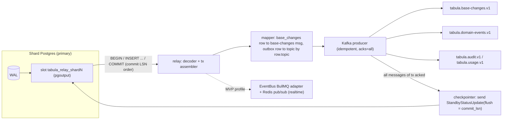

# 15 — Events: Envelope, Outbox Relay, Delivery & Replay

> **Status:** Proposed · **Owner:** Platform Architecture (Eventing) · **Date:** 2026-10-03
> Conforms to [`00-canonical-decisions.md`](./00-canonical-decisions.md) — D10 (`base_changes`), D11 (outbox + logical replication → Kafka-API log; MVP → BullMQ), D12, D26 (no event sourcing), §6 event catalogue, §7 topics & queues, §10 Redis.

**Sections covered:** Section 18 (Events) and Part 13 (Event infrastructure deep-dive): event envelope, event IDs, schema registry & versioning, the two streams (`base_changes` vs domain events), ordering guarantees, transactional outbox + logical-replication relay (publication, slots, checkpointing, lag alarms, failover, recovery), idempotent consumers, retry policies, DLQ topics & replay tooling, replay from Kafka and from `base_changes`, consumer catalogue, MVP profile without Kafka (`EventBus`), technology comparison, why not event sourcing.

Related: [`14-automation-engine.md`](./14-automation-engine.md), [`16-realtime.md`](./16-realtime.md), [`21-ai-architecture.md`](./21-ai-architecture.md), [`23-notifications-jobs-caching-performance.md`](./23-notifications-jobs-caching-performance.md), [`27-data-flows-transactions-migrations.md`](./27-data-flows-transactions-migrations.md), [`05-sql-schema.md`](./05-sql-schema.md), [`17-api-architecture.md`](./17-api-architecture.md) (public webhooks & `/changes` endpoint), [`33-architecture-decision-records.md`](./33-architecture-decision-records.md).

---

## 1. Principles

1. **Current-state tables are the source of truth** (D26). Events are notifications of committed state changes, not the state itself.
2. **An event exists iff its transaction committed.** Events are written in the same Postgres transaction as the state change (transactional outbox). No dual writes to Kafka from request handlers.
3. **At-least-once delivery, idempotent consumers.** Exactly-once end-to-end is achieved per consumer by dedupe + unique keys on side effects, never assumed from the transport.
4. **Ordering only where it is needed and cheap:** per base (Kafka key `base_id`) for base-scoped events, per workspace for workspace-scoped events, per org for audit/usage. **No global order.**
5. **Two streams with different purposes:** `base_changes` (fine-grained, ordered, retained 30 days in Postgres; for realtime, catch-up, undo, sync, public webhooks) and **domain events** (`outbox_events`, coarse business facts; for automations, notifications, search, audit, metering, AI).
6. **One interface, two transports:** `EventBus` hides Kafka (V1) vs BullMQ (MVP).

---

## 2. The event envelope

### 2.1 TypeScript (`@tabula/events`)

```ts
export type ActorType = 'user' | 'api_token' | 'service_account' | 'automation' | 'integration' | 'ai' | 'system' | 'public_form';
export type ActorVia  = 'ui' | 'api' | 'automation' | 'import' | 'sync' | 'form' | 'script' | 'undo' | 'restore';

export interface EventEnvelope<T extends string = string, D = unknown> {
  id: `evt_${string}`;              // UUIDv7, public encoding (spine §3)
  type: T;                           // e.g. "record.updated" (spine §6)
  schemaVersion: number;             // version of `data` schema for this type (major)
  occurredAt: string;                // ISO-8601 UTC, ms precision; = commit-time clock of the writer (app clock, see §3)
  tenant: { orgId: `org_${string}`; workspaceId?: `wsp_${string}`; baseId?: `bas_${string}` };
  actor: { type: ActorType; id: string; via: ActorVia };
  baseSeq?: number;                  // base_runtime.change_seq of the change that produced the event (base-scoped only)
  correlationId: string;             // request id / run correlation (W3C-compatible 32 hex)
  causationId?: `evt_${string}`;     // event that caused this one (automation chains)
  causationDepth: number;            // 0 for human/API writes; +1 per automation hop (MAX_CAUSATION_DEPTH = 8)
  traceparent?: string;              // W3C trace context
  data: D;
}
```

### 2.2 JSON Schema (envelope)

```json
{
  "$schema": "https://json-schema.org/draft/2020-12/schema",
  "$id": "https://schemas.tabula.example/events/envelope.json",
  "type": "object",
  "required": ["id", "type", "schemaVersion", "occurredAt", "tenant", "actor", "correlationId", "causationDepth", "data"],
  "additionalProperties": false,
  "properties": {
    "id": { "type": "string", "pattern": "^evt_[0-9A-Za-z]{22}$" },
    "type": { "type": "string", "pattern": "^[a-z_]+\\.[a-z_]+$" },
    "schemaVersion": { "type": "integer", "minimum": 1 },
    "occurredAt": { "type": "string", "format": "date-time" },
    "tenant": {
      "type": "object", "required": ["orgId"], "additionalProperties": false,
      "properties": {
        "orgId": { "type": "string", "pattern": "^org_" },
        "workspaceId": { "type": "string", "pattern": "^wsp_" },
        "baseId": { "type": "string", "pattern": "^bas_" }
      }
    },
    "actor": {
      "type": "object", "required": ["type", "id", "via"], "additionalProperties": false,
      "properties": {
        "type": { "enum": ["user", "api_token", "service_account", "automation", "integration", "ai", "system", "public_form"] },
        "id": { "type": "string" },
        "via": { "enum": ["ui", "api", "automation", "import", "sync", "form", "script", "undo", "restore"] }
      }
    },
    "baseSeq": { "type": "integer", "minimum": 1 },
    "correlationId": { "type": "string", "maxLength": 64 },
    "causationId": { "type": "string", "pattern": "^evt_" },
    "causationDepth": { "type": "integer", "minimum": 0, "maximum": 32 },
    "traceparent": { "type": "string" },
    "data": { "type": "object" }
  }
}
```

### 2.3 Wire format and Kafka headers

* Value: UTF-8 JSON of the envelope (zstd-compressed at the producer batch level). Binary formats (Avro/Protobuf) were considered; JSON wins for a TypeScript monolith (no codegen step, human-debuggable, same schemas as public webhooks); at our volumes (≤ 50k events/s region) the CPU/bytes overhead is acceptable with zstd (~6–10× compression on these payloads).
* Headers (for routing/filtering without parsing the value): `ce_id`, `ce_type`, `ce_specversion=1.0`, `ce_source=/tabula/{shardId}`, `tabula_schema_version`, `tabula_org`, `tabula_workspace`, `tabula_base`, `tabula_causation_depth`, `traceparent`. Envelope fields map 1:1 to CloudEvents attributes (`id`, `type`, `time` = `occurredAt`, `source`, `subject` = baseId/recordId), so external export (V2 event streaming to customers) is a projection, not a redesign.
* **Size limits:** envelope ≤ 256 KB (hard), target p99 < 8 KB. Producers that would exceed it (huge `records.bulk_changed`) **split** into multiple envelopes (each ≤ 1,000 records and ≤ 256 KB) sharing a `correlationId` and carrying `data.part = {index, total}`. Large values (long text > 2 KB) are truncated in event data with `truncated: true`; consumers needing the full value read current state.
* **IDs in events:** envelope and entity references in `data` use the public prefixed encoding (spine §3); `@tabula/events` exposes typed decoders (`decodeId('rec', s) → Uuid`). Field references use field IDs; cell maps are keyed by slot (as stored).

---

## 3. Event IDs (UUIDv7)

* Generated **in the application** before insert (spine §3), so the outbox row, the response and logs share one ID.
* UUIDv7 = 48-bit Unix ms timestamp + 74 random bits; we use the **monotonic** variant within a process (RFC 9562 §6.2 method 1: 12-bit sub-ms counter), so IDs generated by one process are strictly increasing.
* **IDs are not an ordering mechanism across processes**: two API nodes with skewed clocks, or a transaction that generates its ID and commits later, yield ID order ≠ commit order. Consumers that need order use **Kafka partition order** (= commit order per key, §6) or **`baseSeq`**. The time component is used for partition pruning (`trigger_at` derivation, retention), dedupe-key TTL reasoning, and debugging.
* `occurredAt` is the application clock at the moment the transaction's change was made; NTP (chrony) keeps skew < 10 ms; nothing correctness-critical compares `occurredAt` across nodes.

---

## 4. Schema registry and versioning

### 4.1 Options

| Option | Pros | Cons |
|---|---|---|
| **In-repo registry: `@tabula/events` package** (Zod schemas → generated JSON Schema + TS types; CI compatibility checks) | Single source of truth in the monolith; types at compile time for producers & consumers; no extra service; schemas also feed public webhook docs | External (non-TS) consumers need the generated JSON Schemas published as artifacts |
| Confluent Schema Registry / Apicurio | Runtime enforcement; polyglot; compatibility modes built in | Extra critical service; JSON Schema support is weaker than Avro; adds a network hop or cache to every producer |

**Decision [Ours]:** in-repo registry now; generated JSON Schemas published to an internal artifact bucket and the docs site. Re-evaluate Apicurio when the first non-TypeScript consumer service exists.

### 4.2 Package layout

```
packages/events/
  src/envelope.ts                     # EventEnvelope, ActorType, ...
  src/catalog/record.updated.v1.ts    # export const RecordUpdatedV1 = z.object({...})
  src/catalog/record.updated.v2.ts    # only if a breaking change happened
  src/catalog/index.ts                # registry: { 'record.updated': { 1: RecordUpdatedV1, 2: ... }, ... }
  src/publish.ts                      # typed emit helpers: emit(tx, 'record.updated', 1, data)
  src/consume.ts                      # typed handlers: on('record.updated', [1, 2], handler)
  schemas/                            # generated JSON Schema (CI artifact; checked in for diffing)
  compat/                             # golden sample events per type/version (fixtures)
```

### 4.3 Versioning rules

| Change | Classification | Rule |
|---|---|---|
| Add optional field to `data` | additive | **keep version**; consumers must ignore unknown fields (Zod `.passthrough()` on consume, `.strict()` on produce) |
| Add new enum value | additive *for tolerant consumers* | keep version; consumers must handle unknown enum values with a default branch (lint rule: exhaustive switch must have `default` for event enums) |
| Add new event type | additive | new catalog entry |
| Make optional field required (producer always sends it) | additive | keep version |
| Remove field, rename field, change type/meaning, make required → optional | **breaking** | **new `schemaVersion`**; **dual-publish** both versions for ≥ 1 full Kafka retention + all consumers migrated (min 14 days); then stop publishing old |
| Change partition key semantics | **breaking at topic level** | new topic `….v2` (spine §7 topic names carry `.v1`) with migration plan |

**Dual-publish mechanics:** the producer helper writes **one outbox row per version** (`schema_version` column distinguishes; same `id` suffix? No — each gets its own event id; both carry header `tabula_dual_of=<v1 id>`). Consumers subscribe to the version they understand via `on('record.updated', [2], …)`; a consumer declaring both versions receives only the highest it supports (the consume helper drops the lower version when a `tabula_dual_of` sibling it understands exists; the producer emits the higher version first in the same transaction, so ordering is deterministic).

**CI gates:**
1. `events:compat` diffs generated JSON Schemas against `main` with a JSON-Schema compatibility checker (backward + forward for same version). Breaking change without version bump ⇒ fail.
2. Golden fixtures for every (type, version) are validated against current schemas.
3. Consumer contract tests: each consumer module declares the (type, versions) it handles; CI fails if a producer stops emitting a version some consumer still declares.

---

## 5. Two streams: `base_changes` vs domain events

| | `base_changes` (D10) | Domain events (`outbox_events`) |
|---|---|---|
| Granularity | Op-level (cell set, link add/remove, record create/delete, schema op), with **inverse ops** | Business facts (`record.updated`, `field.deleted`, `automation.failed`, …) |
| Order | Total order per base: `(base_id, seq)` from `base_runtime.change_seq`, gap-free | Commit order per Kafka key |
| Retention | 30 days in Postgres (daily partitions) + Kafka 7 days | Kafka 7 days; outbox rows 3 days (§7.9) |
| Consumers | realtime fan-out, catch-up API, undo/redo, public webhook dispatcher, sync exporters | automations, notifications, search, audit, usage, AI field runner, contact timeline |
| Topic | `tabula.base-changes.v1` (key `base_id`) | `tabula.domain-events.v1` (key `base_id` if base-scoped else `workspace_id`), `tabula.audit.v1`, `tabula.usage.v1` (key `org_id`) |

`base_changes` row (canonical shape, DDL in [`05-sql-schema.md`](./05-sql-schema.md)):

```ts
interface BaseChangeRow {
  base_id: Uuid; seq: number;                  // PK (base_id, seq); partitioned daily by committed_at
  id: Uuid;                                    // chg_ public id
  workspace_id: Uuid; table_id?: Uuid;
  kind: 'cells' | 'record_create' | 'record_delete' | 'record_restore' | 'links' | 'schema' | 'view' | 'bulk_summary';
  ops: ChangeOp[];                             // forward ops (see 16-realtime.md §7)
  inverse_ops: ChangeOp[];                     // D25
  actor_type: ActorType; actor_id: string; via: ActorVia;
  client_mutation_id?: string;                 // echoes client op id for ack/rebase (16-realtime.md)
  correlation_id: string; causation_depth: number;
  schema_version: number;                      // base schema version at commit
  committed_at: timestamptz;
}
```

**Why both?** A single stream would either be too fine for domain consumers (automations would need to reassemble record-level facts and before/after values from ops) or too coarse for realtime/undo. Both are written in the **same transaction**, so they never disagree; a domain event carries `baseSeq` pointing to its `base_changes` row for correlation.

---

## 6. Ordering guarantees

| Scope | Guarantee | Mechanism |
|---|---|---|
| Changes within a base (`base_changes`) | **Total order**, gap-free `seq` | `UPDATE base_runtime SET change_seq = change_seq + n … RETURNING` inside the write tx (row lock serializes writers per base — this is also our per-base write serialization point, see [`27-…`](./27-data-flows-transactions-migrations.md)); Kafka key `base_id` |
| Base-scoped domain events | Commit order per base | Relay emits in WAL commit order; key `base_id` ⇒ one partition |
| Workspace-scoped events (`workspace.*`, `member.*`, `grant.changed` for workspace) | Commit order per workspace | key `workspace_id`; all of a workspace's data lives on one shard (D3) ⇒ one relay ⇒ one producer |
| Org/control-plane events (`organization.*`, `user.*`, `subscription.changed`) | Commit order per org | control-plane relay, key `org_id` (domain events) |
| Across bases / workspaces / orgs | **None** | — |
| Between `base-changes` and `domain-events` topics | **None across topics**; consumers needing both correlate by `baseSeq` |
| Between a write and its event | Event published after commit, typically < 500 ms (V1 p99 < 2 s) | relay |

**Why relay order equals commit order:** logical decoding emits transactions in **commit LSN order**, each transaction's changes contiguous. The relay produces to Kafka with `enable.idempotence=true`, `max.in.flight.requests.per.connection ≤ 5`, `acks=all` — which preserves per-partition order even with retries. Since one relay process owns a shard's slot, there is a single producer per partition-key source.

**Shard moves:** when a workspace migrates shards ([`27-…`](./27-data-flows-transactions-migrations.md)), writes are frozen for the workspace, the old shard's relay drains to an LSN past the freeze, then writes resume on the new shard. A `workspace.moved` marker event (§12) is emitted so per-base consumers can reset any cached state; per-base order is preserved because no writes happen during the switch.

**Consumer-side ordering caveat:** Kafka order is only useful if the consumer processes a partition sequentially. Consumers that fan work out to BullMQ (most do) lose order and must be order-insensitive (idempotent, version-checked). The catalogue (§10) states each consumer's stance.

---

## 7. Transactional outbox + logical replication relay

### 7.1 Write path

```sql
BEGIN;
  -- business change
  UPDATE data.records SET cells = cells || $patch, cell_meta = …, version = version + 1, updated_at = now()
   WHERE table_id = $t AND id = $r AND deleted_at IS NULL RETURNING version;
  -- allocate seq (per-base serialization point)
  UPDATE data.base_runtime SET change_seq = change_seq + 1 WHERE base_id = $b RETURNING change_seq;
  -- change log (realtime / undo / webhooks)
  INSERT INTO data.base_changes (base_id, seq, id, workspace_id, table_id, kind, ops, inverse_ops, actor_type, actor_id, via,
                                 client_mutation_id, correlation_id, causation_depth, schema_version, committed_at)
  VALUES (…);
  -- domain event(s)
  INSERT INTO data.outbox_events (id, workspace_id, base_id, partition_key, type, schema_version, payload, created_at)
  VALUES ($evtId, $ws, $b, $b, 'record.updated', 1, $envelopeJson, now());
COMMIT;
```

```sql
-- outbox_events (proposed shape; DDL owner 05-sql-schema.md)
CREATE TABLE data.outbox_events (
  id             uuid        NOT NULL,          -- event id (UUIDv7)
  workspace_id   uuid        NOT NULL,
  base_id        uuid,
  partition_key  uuid        NOT NULL,          -- base_id or workspace_id (or org_id on control plane)
  topic          text        NOT NULL DEFAULT 'tabula.domain-events.v1',  -- audit/usage events route to their topics
  type           text        NOT NULL,
  schema_version smallint    NOT NULL,
  payload        jsonb       NOT NULL,          -- full envelope
  created_at     timestamptz NOT NULL DEFAULT now(),
  PRIMARY KEY (id, created_at)
) PARTITION BY RANGE (created_at);              -- daily partitions, dropped after 3 days (§7.9)
ALTER TABLE data.outbox_events REPLICA IDENTITY DEFAULT;   -- inserts only; no UPDATE/DELETE ever
```

The outbox is **insert-only**. We never mark rows "sent" (no UPDATE churn, no vacuum pressure); the relay's progress lives in the replication slot (confirmed LSN), and old partitions are dropped.

### 7.2 Why logical replication (and not polling)

| Approach | Problem / benefit |
|---|---|
| Poll `SELECT … WHERE id > $last ORDER BY id` | **Loses events**: IDs/sequences are assigned before commit; a long transaction with a smaller id commits after the poller advanced past it. Fixes (lag windows, `xmin` tracking via `pg_snapshot_xmin`) are subtle and add latency |
| Poll + mark-sent UPDATE | Write amplification (every event written twice), bloat, lock contention |
| `LISTEN/NOTIFY` | Not durable; payload ≤ 8 KB; lost on disconnect |
| **Logical replication (pgoutput)** | Commit-ordered, gap-free, durable (WAL retained until confirmed), no extra writes, low latency (< 100 ms) |
| Debezium (Kafka Connect / Debezium Server) | Same mechanism, mature, but JVM + Connect cluster ops; harder to emit to BullMQ in MVP; custom envelope mapping via SMTs |

**Decision [Ours]:** own relay process role (`relay`, TypeScript) using the `pgoutput` plugin via the streaming replication protocol (library: `pg-logical-replication` or equivalent; protocol v2 for streaming large in-progress transactions is *not* used — we only process committed transactions). Debezium Server remains the documented fallback if our relay proves unreliable; the outbox table shape is Debezium-outbox-compatible on purpose.

### 7.3 Publication and slot (per shard)

```sql
-- once per shard (migration)
CREATE PUBLICATION tabula_relay FOR TABLE data.outbox_events, data.base_changes
  WITH (publish = 'insert', publish_via_partition_root = true);
-- slot created by the relay on first start (or by migration)
SELECT pg_create_logical_replication_slot('tabula_relay_' || current_setting('tabula.shard_id'), 'pgoutput');
```

* `publish = 'insert'` — we only care about inserts; partition drops (DDL) are not replicated and don't need to be.
* `publish_via_partition_root = true` — the relay sees `data.outbox_events`/`data.base_changes` regardless of partition.
* Server settings: `wal_level = logical`, `max_replication_slots ≥ 10`, `max_wal_senders ≥ 10`, **`max_slot_wal_keep_size = 200GB`** (bounds disk usage if the relay is down; beyond it the slot is invalidated — see §7.8), `logical_decoding_work_mem = 256MB`.
* One slot per shard **per environment**; in V1 the same slot feeds both topics (one ordered pass over WAL).

### 7.4 Relay process



Pseudocode:

```ts
const inflight = new OrderedLsnTracker();              // commit LSNs awaiting Kafka acks, in order
replication.on('data', (lsn, msg) => {
  switch (msg.tag) {
    case 'begin':  tx = { xid: msg.xid, commitLsn: msg.commitLsn, msgs: [] }; break;
    case 'insert': tx.msgs.push(mapRow(msg.relation, msg.new)); break;    // base_changes or outbox_events row
    case 'commit': {
      const t = tx; inflight.add(t.commitLsn);
      producer.sendBatch(t.msgs)                        // keyed; idempotent producer preserves per-partition order
        .then(() => inflight.ack(t.commitLsn))
        .catch(fatal);                                  // after producer-internal retries: crash -> restart from confirmed LSN
      break;
    }
  }
});
setInterval(() => {                                     // checkpoint every 1 s (and on graceful shutdown)
  const safe = inflight.highestContiguousAcked();       // never confirm past an un-acked earlier tx
  if (safe) replication.acknowledge(safe);              // StandbyStatusUpdate: write/flush/apply = safe
}, 1000);
```

Producer settings: `enable.idempotence=true`, `acks=all`, `max.in.flight.requests.per.connection=5`, `linger.ms=5`, `batch.size=256KB`, `compression.type=zstd`, `delivery.timeout.ms=120000`. A producer failure after internal retries is **fatal**: the relay exits, restarts from the slot's `confirmed_flush_lsn`, and re-emits everything after it (duplicates are expected and harmless — §8).

**Checkpoint semantics:** the slot's `confirmed_flush_lsn` only advances to a commit LSN once **all** messages of that transaction **and all earlier transactions** are acked by Kafka. Postgres retains WAL from `restart_lsn`, so a relay crash loses nothing; it re-reads from the last confirmed commit. Maximum duplicate window ≈ 1 s of events + in-flight.

**HA:** a logical slot can be consumed by one connection at a time (`active_pid`). Two relay replicas per shard run; both try to start replication; the loser gets `replication slot … is active for PID …` and retries every 5 s (passive standby). Lease/locking is therefore provided by Postgres itself; no Redis lock needed. Takeover time ≈ TCP keepalive/`wal_sender_timeout` (set 30 s) + 5 s.

**Large transactions:** a 1,000-record batch write yields ~1 base_changes row (ops batched per tx per table, ≤ 1 MB) + split domain events; pgoutput spills to disk past `logical_decoding_work_mem`. Bulk operations (imports, field conversions over 100k records) commit in **chunks of ≤ 1,000 records** per transaction (owned by long-operations, [`27-…`](./27-data-flows-transactions-migrations.md)) to keep relay latency bounded and to keep realtime fan-out sane (a `bulk_summary` change tells clients to refresh, [`16-realtime.md`](./16-realtime.md) §11).

### 7.5 Mapping rows to messages

| Source row | Topic | Key | Value |
|---|---|---|---|
| `base_changes` | `tabula.base-changes.v1` | `base_id` | `{ baseId, seq, id, tableId, kind, ops, actor, via, clientMutationId, correlationId, causationDepth, schemaVersion, committedAt }` (inverse ops omitted from Kafka — only undo needs them and it reads Postgres) |
| `outbox_events` | `row.topic` (default domain-events) | `partition_key` | `row.payload` (the envelope) |

Headers per §2.3. Value size guard: > 1 MB ⇒ the relay logs an error and emits a *stub* with `data.oversize = true` and the row's primary key so consumers can fetch it from Postgres (should never happen given producer-side splitting; alarmed).

### 7.6 Topic configuration (V1)

| Topic | Partitions | RF / min ISR | Retention | Cleanup | Notes |
|---|---|---|---|---|---|
| `tabula.base-changes.v1` | 64 | 3 / 2 | 7 days | delete | zstd; `max.message.bytes` 1 MB |
| `tabula.domain-events.v1` | 64 | 3 / 2 | 7 days | delete | |
| `tabula.audit.v1` | 16 | 3 / 2 | 7 days | delete | audit store is the durable copy |
| `tabula.usage.v1` | 16 | 3 / 2 | 7 days | delete | |
| `<topic>.dlq` | 8 | 3 / 2 | 30 days | delete | §9 |

Partition count is fixed per topic version (changing it reshuffles keys and breaks per-key order); 64 partitions × modest throughput (≤ 2 MB/s each) leaves 10× headroom. Hot bases (one base producing a disproportionate share) are visible via per-key metrics; a partition can only be scaled by its consumers' speed, which is why consumers hand heavy work to BullMQ.

### 7.7 Slot lag alarms

```sql
SELECT slot_name, active, wal_status,
       pg_wal_lsn_diff(pg_current_wal_lsn(), confirmed_flush_lsn) AS lag_bytes,
       safe_wal_size
  FROM pg_replication_slots WHERE slot_name LIKE 'tabula_relay_%';
```

| Alarm | Threshold | Action |
|---|---|---|
| `relay_slot_lag_bytes` | > 1 GB for 5 min (warn), > 20 GB (page) | Check relay health / Kafka |
| `relay_slot_inactive` | `active = false` > 2 min | page |
| `relay_slot_wal_status` | `wal_status = 'unreserved'` (approaching `max_slot_wal_keep_size`) | page, critical |
| `relay_slot_lost` | `wal_status = 'lost'` | page; run §7.8 recovery |
| `relay_end_to_end_latency_seconds` (commit → Kafka ack, from `committed_at`) | p99 > 5 s for 10 min | page |
| Disk free on shard | < 20 % | page (slot retention may be the cause) |

### 7.8 Failover and recovery

**Primary failover.** Logical slots historically live only on the primary.

| Platform | Behaviour | Our handling |
|---|---|---|
| PostgreSQL ≥ 17 self-managed / RDS where supported | **Failover slots**: create slot with `failover = true`, standby runs `sync_replication_slots = on` with `synchronized_standby_slots` set → slot survives promotion | Preferred. Relay reconnects to new primary and resumes at the synced `confirmed_flush_lsn` (possibly slightly behind ⇒ duplicates, fine) |
| PG 16 (spine minimum) without slot sync | Slot is **lost** on promotion | Recovery procedure below |
| Aurora PostgreSQL | Slots are kept on shared cluster storage across writer failover in current versions (verify per engine version in the runbook) | Treated like failover slots; recovery procedure as fallback |

**Recovery procedure (slot lost or invalidated)** — the reason we keep outbox partitions for 3 days and `base_changes` for 30:

1. Relay detects missing/invalid slot; creates a new slot **first** (`pg_create_logical_replication_slot`) and records its `consistent_point` LSN — every commit after this point will be streamed.
2. **Backfill gap:** read the relay's last checkpoint (persisted every 10 s to `relay_checkpoints` (§16): last confirmed LSN, wall-clock time `T_ck`, and per-base max emitted `seq`).
   * `base_changes`: for each base with changes since `T_ck − 5 min`, `SELECT … WHERE base_id = $b AND seq > $lastEmittedSeq AND committed_at <= <slot creation time + 1 min> ORDER BY seq` — gap-free by construction.
   * `outbox_events`: `SELECT … WHERE created_at >= T_ck − 5 min ORDER BY created_at` — overlap window guarantees coverage of transactions that were in flight; duplicates are expected.
3. Emit backfilled messages (headers `tabula_backfill=true`), then start streaming from the new slot. Consumers dedupe by event id (§8); realtime/webhook consumers dedupe by `(base_id, seq)`.
4. Ordering during backfill: per-base `base_changes` order is preserved (seq order); domain events in the overlap may be re-emitted after newer ones — consumers are idempotent and version-checked (§10 stance column). This window is minutes, rare, and alarmed.

### 7.9 Outbox retention

`outbox_events` partitions (daily) are dropped after **3 days** by the `maintenance` job (`DROP TABLE … PARTITION` is instant and WAL-cheap). 3 days covers the recovery overlap and debugging; Kafka holds 7 days. `base_changes` keeps 30 days (`BASE_CHANGES_RETENTION`).

---

## 8. Idempotent consumers

### 8.1 Strategy (decision)

Two layers:

1. **Fast-path dedupe in Redis** — `SET evt:{group}:{eventId} 1 NX EX 691200` (8 days, > Kafka 7-day retention). It saves work on duplicate deliveries. It is **not** the correctness guarantee (Redis can lose keys on failover).
2. **Correctness via Postgres unique keys on side effects** — every side effect a consumer produces is keyed by something derived from the event:

| Consumer side effect | Unique key |
|---|---|
| Automation run | `(automation_id, run_key = event id, trigger_at)` |
| In-app notification | `(recipient_id, dedupe_key = event id + rule id)` |
| Audit row | `audit_events.event_id` unique |
| Usage event | `usage_events.source_event_id` unique |
| Search document upsert | idempotent by nature + `source_seq` version check (`WHERE excluded.source_seq > search_documents.source_seq`) |
| Webhook delivery | `(subscription_id, base_id, seq)` |
| AI field job | BullMQ jobId = `aifield:{recordId}:{fieldId}:{inputsHash}` + `ai_invocations.idempotency_key` |

### 8.2 Two-phase claim (protects expensive handlers)

```ts
async function handle(group: string, evt: EventEnvelope, fn: () => Promise<void>) {
  const key = `evt:${group}:${evt.id}`;
  const claimed = await redis.set(key, 'processing', 'NX', 'PX', 120_000);   // claim for 2 min
  if (!claimed) {
    const v = await redis.get(key);
    if (v === 'done') return metrics.dupSkipped(group);
    throw new RetryLater('in-progress elsewhere');      // partition rebalanced mid-processing; Kafka will redeliver
  }
  try { await fn(); await redis.set(key, 'done', 'EX', 691_200); }
  catch (e) { await redis.del(key); throw e; }          // allow retry
}
```

Order-insensitive handlers must also be **version-aware**: e.g. the search indexer stores `source_seq` and ignores stale updates; notification fan-out checks the comment still exists. This is what lets us fan out to BullMQ and retry freely.

**Why not a `processed_events` table?** It would add one write per event per consumer group (~10 groups × 20k events/s = 200k inserts/s at V1 peak) to a hot table — the outbox write amplification we avoided. Unique keys on the *actual* side effects give the same guarantee for free.

---

## 9. Retry policies, DLQ topics, replay tooling

### 9.1 Consumer retry classes

| Class | Used by | In-consumer behaviour | After exhaustion |
|---|---|---|---|
| **Thin forwarders** (event → BullMQ job) | automation matcher (after matching), notification router, AI field runner, contact timeline, usage meter | Retry the enqueue 5× (100 ms → 2 s); Redis down ⇒ pause partition consumption (backpressure) | Never DLQ for infra errors (pause instead); DLQ only for **poison** (schema-invalid / handler bug) |
| **Ordered processors** (sequential per partition) | realtime fan-out, webhook dispatcher cursor advance, search indexer (per-base batches) | Blocking retry with backoff 200 ms → 30 s, max 10 attempts (~3 min) | Send to DLQ with `x-consumer-group`, continue; then trigger the consumer's **self-healing** (e.g. reindex base, mark webhook subscription for catch-up from `base_changes`) |
| **Idempotent writers** | audit writer, usage aggregator | Batch insert with `ON CONFLICT DO NOTHING`; retry batch 10× | DLQ per message after bisecting the batch to isolate the poison message |

Poison detection: schema validation failure, or the same message failing with a non-retryable error class, or ≥ N attempts. Messages are **never silently dropped**.

### 9.2 DLQ topics

* Name: `<source-topic>.dlq` (spine §7 `*.dlq`), e.g. `tabula.domain-events.v1.dlq`. One DLQ per source topic, shared by groups; each message carries headers: `x-consumer-group`, `x-original-topic`, `x-original-partition`, `x-original-offset`, `x-error-class`, `x-error-message` (redacted, ≤ 1 KB), `x-attempts`, `x-first-failed-at`. Key = original key; value = original bytes (unmodified).
* Retention 30 days. Alarm: any DLQ write ⇒ ticket; > 100/5 min for one group ⇒ page.

### 9.3 Replay tooling (`tabula events …` admin CLI, also in the ops console)

```
tabula events dlq list     --topic tabula.domain-events.v1.dlq --group automation-trigger-matcher --since 2026-10-01
tabula events dlq inspect  --id evt_…                       # pretty-print, schema-validate, show error history
tabula events dlq replay   --group automation-trigger-matcher --filter 'type=record.updated,base=bas_…' --rate 200/s [--dry-run]
tabula events dlq purge    --group … --before …              # requires 2-person approval in prod
tabula events replay kafka --group search-indexer --from 2026-10-02T10:00Z --to 2026-10-02T11:00Z --filter 'workspace=wsp_…'
tabula events replay base-changes --base bas_… --from-seq 18000 --to-seq 18233 --target webhook-dispatcher
```

**DLQ replay design:** the tool does *not* re-produce to the original topic (that would re-deliver to every group). It runs the **named group's handler in-process** (same code, same idempotency), reading from the DLQ with the filter, rate-limited, and writes a replay report. Successfully replayed messages are recorded in Redis `dlqdone:{group}:{eventId}` (30 d) so repeat replays skip them.

---

## 10. Event replay

### 10.1 From Kafka (≤ 7 days)

* **Whole consumer group rewind** (e.g. after a consumer bug): stop the group, `kafka-consumer-groups --reset-offsets --to-datetime <T> --group <g> --topic <t> --execute`, restart. Idempotency makes reprocessing safe; side-effect consumers (notifications, automations) dedupe by unique keys, so **users don't get duplicate emails or runs**.
* **Targeted replay** (one tenant/base): `tabula events replay kafka` runs a temporary consumer group `replay-<uuid>` from timestamp T, filters by headers (`tabula_base`, `tabula_workspace`, `ce_type`) *without* parsing values, and invokes the target handler in-process.
* Option for longer windows: Kafka **tiered storage** (MSK tiered / Redpanda shadow indexing) at low cost to raise retention to 30 days if replay needs grow — not in V1.

### 10.2 From `base_changes` (≤ 30 days)

`base_changes` is the authoritative, ordered history for base content. It supports:

* **Realtime catch-up** (`GET /v1/bases/{id}/changes?sinceSeq=`, [`16-realtime.md`](./16-realtime.md) §6).
* **Webhook redelivery** for a subscription cursor (public webhooks read `base_changes` by cursor, so "replay" is just moving the cursor back).
* **Re-derivation of record domain events**: a `replay base-changes` job reads a seq range and synthesizes `record.created|updated|deleted` envelopes (`data` reconstructed from ops; `before` values from `inverse_ops`), with header `tabula_replayed=true` and **deterministic event IDs** (`uuidv5(namespace, baseId:seq:index)` with the UUIDv7 time bits of `committed_at`) so repeated replays dedupe. Automations ignore replayed events by default (would re-trigger runs); search/AI consumers accept them.

### 10.3 Beyond retention

Older than 7 days (domain) / 30 days (base content): no event replay. Consumers rebuild from **current state** (search reindex job per base/shard, usage recomputation from `usage_events`, audit from the audit store). This is a deliberate consequence of D26.

---

## 11. MVP profile without Kafka

### 11.1 The `EventBus` interface

```ts
export interface EventBus {
  /** Relay side: called with messages of one committed transaction, in commit order. Resolves when durable. */
  publishCommitted(batch: RelayMessage[]): Promise<void>;
  /** Consumer side: subscribe a named group to topics. */
  subscribe(group: ConsumerGroupSpec, handler: (msg: RelayMessage) => Promise<void>): Subscription;
}
export interface ConsumerGroupSpec {
  group: string;                               // e.g. 'automation-trigger-matcher'
  topics: Array<'base-changes' | 'domain-events' | 'audit' | 'usage'>;
  types?: string[];                            // optional type filter (pushed down in MVP routing)
  ordering: 'per_key' | 'none';
  concurrency: number;
}
export interface RelayMessage { topic: string; key: string; headers: Record<string, string>; value: Buffer; }
```

Implementations: `KafkaEventBus` (V1) and `BullMqEventBus` (MVP). Producers never call `EventBus` — they write outbox rows; only the relay publishes.

### 11.2 MVP routing (relay → BullMQ)

The MVP relay still reads the logical replication slot (same code), but `BullMqEventBus.publishCommitted` routes each message by a static routing table to the **existing queues** (spine §7) — fan-out happens at publish time since BullMQ has no consumer groups:

| Message | Routed to |
|---|---|
| `base_changes` rows | Redis pub/sub channel `rt:base:{baseId}` (realtime gateways; ephemeral — gaps healed by catch-up) + `webhook-out` (`dispatch` job keyed `whk:{baseId}`, coalesced) |
| `record.*`, `form.submitted`, `button.clicked`, `inbound_webhook.received`, `automation.published/paused`, `view.updated`, `field.*`, `table.deleted` | `automation-trigger` (`match` jobs) |
| `comment.*`, `mention.created`, `record.assigned`, `automation.failed`, `automation.disabled_by_system`, `invitation.created`, … | `notification` |
| record/table/field/base events | `search-index` |
| record events touching AI-field dependencies | `ai` (AI field runner — `21-ai-architecture.md` §4.4) |
| `usage.*`, metering events | `maintenance` (usage aggregator job) |
| audit events | written **synchronously** to the audit store by the relay (small volume) |

Checkpointing: the relay acknowledges the slot LSN after BullMQ `addBulk` resolves for the whole transaction (Redis AOF `everysec` ⇒ ≤ 1 s of jobs at risk on Redis crash; covered by reconcilers for durable-state consumers, and accepted for search/notifications, which have periodic repair jobs).

**Ordering in MVP:** BullMQ workers process in parallel, so per-base order is not preserved. This is acceptable because every MVP consumer is order-insensitive by design: realtime uses `seq` + catch-up; the webhook dispatcher reads `base_changes` by cursor (pull model); the search indexer version-checks `source_seq`; the automation matcher reads before/after from the event itself and validates its trigger index against `automation_index_version` on every match rather than relying on in-order invalidation.

### 11.3 When to switch to Kafka

Any of: > 2,000 events/s sustained per region; need for multiple independent consumers of base changes beyond realtime + webhooks (e.g. sync exporters, OpenSearch indexer in V1); need for replay windows; Redis memory pressure from fan-out queues. Expected at V1 (spine D14 V1 OpenSearch indexer is the forcing function).

---

## 12. Consumer catalogue

| Consumer group | Topic(s) | Purpose | Ordering stance | Idempotency strategy | Lag SLO (p99) |
|---|---|---|---|---|---|
| `realtime-fanout-{nodeId}` (one group **per gateway node**, broadcast) | base-changes | Push changes to subscribed WebSocket clients | per base (sequential per partition) | client-side `(baseId, seq)` dedupe; gap ⇒ catch-up | 1 s |
| `webhook-dispatcher` | base-changes | Advance outbound webhook notifications per subscription (payload fetched by cursor from `base_changes`) | per base | `webhook_deliveries` unique `(subscription_id, seq)`; cursor monotonic | 5 s |
| `automation-trigger-matcher` | domain-events | Match triggers, create runs ([`14-…`](./14-automation-engine.md)) | per base (index invalidation ordering) | `automation_runs` unique run key | 5 s |
| `automation-schema-guard` | domain-events | Disable/flag automations on schema deletes | none | idempotent status updates | 60 s |
| `notification-router` | domain-events | Comments, mentions, assignments, automation failures → `notification`/`email` queues | none | `notifications` dedupe key | 10 s |
| `search-indexer` | domain-events (+ base-changes for cell text in V1) | OpenSearch / FTS documents | version-checked (`source_seq`) | upsert with seq guard | 30 s |
| `audit-writer` | audit | Persist to `audit.audit_events` | none | `event_id` unique | 60 s |
| `siem-exporter` | audit | Stream to customer SIEM (`audit_exports` checkpoints) | per org | checkpoint offsets per export | 5 min |
| `usage-meter` | usage, domain-events (`automation.triggered`, `ai.invocation_completed`) | `usage_events` + `usage_counters` | none | `usage_events.source_event_id` unique | 60 s |
| `ai-field-runner` | domain-events | Enqueue AI field generations on dependency change ([`21-…`](./21-ai-architecture.md)) | none (inputs-hash keyed) | job id + `ai_invocations.idempotency_key` | 30 s |
| `contact-timeline` | domain-events | Write `contact_activities` | none | unique `(contact_id, source_event_id)` | 60 s |
| `sync-exporter` (V1+) | base-changes | Push to external systems (two-way sync) | per base | external idempotency + cursor | 30 s |
| `cache-invalidator` | domain-events (`grant.changed`, `member.*`, `field.updated`, `table.updated`) | Invalidate permission/schema caches across regions (belt-and-braces; primary invalidation is synchronous epoch bump) | none | idempotent deletes | 2 s |

Lag is measured as `now − occurredAt` of the last processed message per partition (`kafka_consumer_lag_seconds{group}`) and as offset lag.

---

## 13. Technology comparison

| Criterion | **Kafka API (MSK / Redpanda)** | NATS JetStream | RabbitMQ (quorum queues / streams) | SQS + SNS | Redis Streams | Postgres-only (outbox table as queue) |
|---|---|---|---|---|---|---|
| Ordered per key at scale | Yes (partitions) | Yes (subjects, per-stream) | Per queue; streams ok; per-key needs consistent-hash exchange | FIFO queues per group id (300–3,000 msg/s per queue w/ batching; high-throughput mode helps) | Per stream (one stream per key = many streams) | Yes (seq) but consumer polling |
| Replay / retention | Native, time/size based, consumer offsets | Native | Streams yes; classic queues no | No replay (14 d max retention, consumed = gone) | Yes (memory-bound) | Yes (table) |
| Fan-out to many independent consumers | Consumer groups, cheap | Consumers per stream | Exchanges/streams | SNS → many SQS | Consumer groups | Each consumer polls |
| Throughput headroom | Very high | High | Medium-high | High (managed) | High but RAM-bound | Low–medium (DB load) |
| Ops burden | Medium (MSK managed; Redpanda simpler) | Low–medium (self-host) | Medium | Very low | Low (already have Redis) | None extra |
| Ecosystem (CDC, connectors, OpenSearch sink) | Best | Growing | Good | AWS-native | Limited | — |
| Durability model | Replicated log | Replicated (RAFT) | Quorum (RAFT) | Managed | AOF/replica, async replication ⇒ loss window | DB-grade |
| Cost at V1 volume | Moderate (3-broker MSK ~ $1.5–3k/mo) | Low | Low–moderate | Pay per request (~$0.40/M; 1B msgs/mo fan-out × consumers ⇒ significant) | Low | Low until DB becomes bottleneck |

**Recommendation per stage:**

| Stage | Choice | Why |
|---|---|---|
| **MVP** (≤ 1 region, ≤ ~1–2k events/s) | **Postgres outbox + logical replication relay → BullMQ + Redis pub/sub** (no broker) | Fewest moving parts; Redis already required (D12/D13); consumers designed order-insensitive; `base_changes` gives replay for content |
| **V1** | **Kafka API** (Amazon MSK, or Redpanda where self-hosting is preferred) | Multiple independent consumer groups (search indexer, webhooks, realtime, automations, audit, usage, sync), replay, per-base order, CDC/OpenSearch ecosystem (D11) |
| **Scale** | Kafka + tiered storage; dedicated clusters for audit/usage if noisy | Retention and isolation |

Why not the others as primary: **NATS JetStream** is a credible alternative (simpler ops) but the analytics/search/CDC ecosystem and managed AWS offering favour Kafka; **RabbitMQ** lacks cheap replay and multi-group log semantics (streams narrow the gap but add a second model); **SQS/SNS** has no replay and per-key ordering limits; **Redis Streams** keeps a durable log in RAM with async replication (loss window) — fine for ephemeral fan-out, not as the event log; **Postgres-only** queues push consumer polling load onto the shards that already carry the product's hottest writes.

---

## 14. Why not event sourcing

**[Ours] (D26):** current-state tables are authoritative; events are derived notifications; `base_changes` is a bounded-retention change log.

| Event-sourcing promise | Our reality |
|---|---|
| Full history / audit | Provided by `record_revisions` (cell history, plan-based retention), `base_changes` (30 d), audit store — without making history the source of truth |
| Rebuild any projection | Our hottest read paths (grid queries with filter/sort over 2M-record tables, index sidecars, computed fields) need **current-state indexed tables** anyway; rebuilding them from an event log of billions of cell edits is slow and costly |
| Temporal queries | Base snapshots + revisions cover "what was the value on date X" for the product needs we have |
| Undo | Command log with inverse ops (D25) is simpler and bounded |

Costs we avoid: (1) **schema evolution of the log forever** — every past event version must remain replayable (our users change field types constantly; a `text`→`number` conversion would require upcasters for years of events); (2) **GDPR erasure** — deleting personal data from an immutable log requires crypto-shredding per subject; with current-state tables we delete rows and let bounded logs expire; (3) **snapshotting and replay infrastructure** per aggregate (a base with 2M records is one hot aggregate); (4) **read-your-writes** complexity for a UI that must show the committed value instantly; (5) **engineer cognitive load** — every feature would be designed twice (command + projection). The benefits we want from events — decoupled consumers, realtime, replay for a few days, audit — come from the outbox + change log at a fraction of the complexity.

---

## 15. Monitoring

| Metric | Alert |
|---|---|
| `relay_slot_lag_bytes`, `relay_slot_inactive`, `relay_slot_wal_status` | §7.7 |
| `relay_commit_to_ack_seconds` (histogram) | p99 > 5 s |
| `relay_messages_total{topic}`, `relay_bytes_total{topic}` | anomaly detection |
| `relay_backfill_runs_total` | any ⇒ ticket |
| `kafka_consumer_lag_seconds{group}` | > SLO (§12) for 10 min ⇒ page for automation/realtime/webhooks, ticket otherwise |
| `consumer_dup_skipped_total{group}` | spike ⇒ investigate redelivery storms |
| `dlq_messages_total{topic,group}` | §9.2 |
| `event_schema_validation_failures_total{type,version}` | any in prod ⇒ page (producer bug) |
| `event_size_bytes{type}` (histogram) | p99 > 64 KB ⇒ ticket |

Dashboards: per-shard relay panel (lag, throughput, latency), per-group consumer panel, DLQ panel, end-to-end "write → automation run created" latency (joined via `correlationId` in traces).

---

## 16. Proposed additions

| Item | Kind | Purpose |
|---|---|---|
| `data.relay_checkpoints (shard_id text PK, slot_name text, confirmed_lsn pg_lsn, checkpoint_at timestamptz, base_seq_watermarks jsonb)` — **one row per shard**, written every 10 s by the relay | **table** (data plane, per shard) | Recovery backfill after slot loss (§7.8). Alternative without a new table: store in `base_runtime` (`relay_emitted_seq` per base) — rejected because it would add an UPDATE per base per checkpoint on the hottest row |
| `outbox_events` columns `partition_key`, `topic`; daily partitioning with 3-day retention | columns / policy | §7.1, §7.9 |
| `base_changes.client_mutation_id`, `correlation_id`, `causation_depth`, `schema_version` | columns | realtime ack/rebase, loop guard, schema-aware clients |
| `usage_events.source_event_id` unique, `audit_events.event_id` unique, `contact_activities.source_event_id` | columns / constraints | consumer idempotency (§8.1) |
| `search_documents.source_seq` | column | version-checked upserts |
| Redis namespaces `evt:{group}:{eventId}` (dedupe), `dlqdone:{group}:{eventId}`, pub/sub `rt:base:{baseId}` (MVP realtime) | Redis (spine §10) | §8, §9, §11 |
| Event types `workspace.moved` (shard migration marker) | event catalogue (spine §6) | §6 |
| Kafka topic `<topic>.dlq` concrete names `tabula.base-changes.v1.dlq`, `tabula.domain-events.v1.dlq`, `tabula.audit.v1.dlq`, `tabula.usage.v1.dlq` | topics | §9.2 |
| Kafka headers `tabula_*` / `ce_*` | convention | §2.3 |
