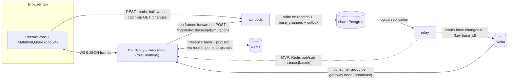
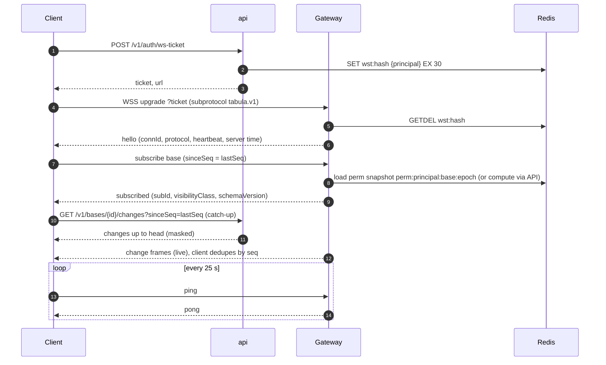
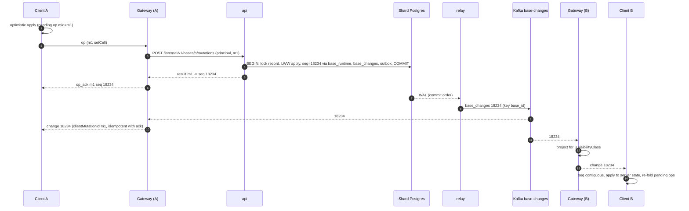
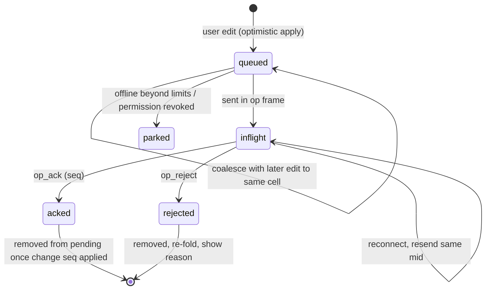
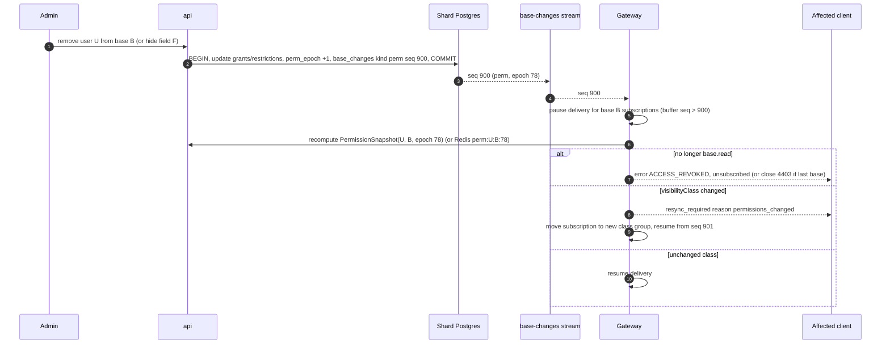

# 16 — Realtime Collaboration

> **Status:** Proposed · **Owner:** Platform Architecture (Realtime) · **Date:** 2026-10-03
> Conforms to [`00-canonical-decisions.md`](./00-canonical-decisions.md) — **D9** (server-authoritative ops, per-base total order via `base_runtime.change_seq`, cell-level LWW, set ops, optional `If-Match`, Yjs only for rich text V1+), D10 (`base_changes`), D11, D13, D20 (`perm_epoch`), D25 (undo), §7 topics, §10 Redis (`presence:{baseId}`, `ws:route:{connId}`), §13 (`WS_HEARTBEAT = 25 s`).
> This document is **normative for WebSocket frame shapes** (doc 24 defers to it).

**Sections covered:** Section 19 (Realtime) and Part 14 (Realtime deep-dive): gateway design, connection auth (ws ticket), subscriptions (base/table/view/record/interface), protocol message types with JSON examples, fan-out (Kafka per gateway node; Redis pub/sub in MVP), per-subscription permission filtering, catch-up via `/changes?sinceSeq=`, gap detection & resync, presence/cursors, client mutation protocol (clientMutationId, optimistic apply, ack with seq, rebase, rollback), conflict resolution comparison (OT vs CRDT vs row versioning vs cell versioning vs event sourcing) and per-object recommendation, concurrent-edit examples, offline handling, scale/backpressure/coalescing/bulk summarization, permission revocation mid-session, metrics.

Related: [`06-record-storage.md`](./06-record-storage.md) (`cell_meta`, set ops, `If-Match`), [`07-field-engine.md`](./07-field-engine.md), [`10-view-engine.md`](./10-view-engine.md) (`asOfSeq`), [`11-filter-sort-group.md`](./11-filter-sort-group.md) (isomorphic filter evaluator), [`15-events.md`](./15-events.md), [`17-api-architecture.md`](./17-api-architecture.md) (ws-ticket, `/changes`), [`18-search-attachments-collaboration.md`](./18-search-attachments-collaboration.md) (comment/attachment frames), [`19-permissions-and-multitenancy.md`](./19-permissions-and-multitenancy.md) (`visibilityClass`, `perm_epoch`), [`24-frontend-grid-state-design-system.md`](./24-frontend-grid-state-design-system.md) (client RecordStore, MutationQueue), [`27-data-flows-transactions-migrations.md`](./27-data-flows-transactions-migrations.md).

---

## 1. Goals and constraints

| Goal | Target |
|---|---|
| Edit → own `op_ack` | p95 ≤ 300 ms (matches doc 24 RUM budget) |
| Edit by A → visible to B (same region) | p50 ≤ 250 ms, p99 ≤ 1 s (V1, Kafka path); MVP p99 ≤ 1.5 s |
| Presence/cursor propagation | p50 ≤ 150 ms |
| Connections per gateway pod (2 vCPU, 4 GB) | 25,000 idle-ish, 10,000 active editors |
| Correctness | No change is silently lost for a connected client: every seq is either delivered, explicitly skipped, or the client is told to resync |
| Security | No client ever receives a value it may not read (hidden fields, row policies, interface scoping), including during permission changes |

**[Observed]** Airtable-style products show collaborator avatars/cursors, update cells live, and handle concurrent edits per cell. **[Ours]** everything below.

---

## 2. Architecture



Design choices:

1. **Gateways are DB-free.** They authenticate tickets, hold subscriptions, project and push changes, relay presence, and forward write frames to the `api` role. Reads/catch-up go through the API (which owns permission-masked queries). This keeps the gateway an easy extraction candidate (D1) and makes it horizontally trivial.
2. **Writes have one implementation**: the same `MutationService` behind REST `PATCH`/`records:batch` handles forwarded WS `op` frames (internal endpoint, mTLS, carries the authenticated principal + `clientMutationId`s). Latency cost of the hop ≈ 1–3 ms (HTTP/2 keep-alive within the cluster).
3. **The change stream is `base_changes`** (D10), ordered by `(base_id, seq)`, delivered via Kafka (V1) or Redis pub/sub (MVP). Clients reconcile by `seq`.
4. **Ephemeral collaboration state (presence, cursors, typing) never touches Postgres or Kafka** — Redis only.

### 2.1 Why forward `op` frames to the API instead of writing in the gateway?

| Option | Pros | Cons |
|---|---|---|
| Gateway executes writes in-process (`MutationService` linked in, own DB pool) | ~2 ms less latency; one less hop | Every gateway pod needs connections to every shard (pool explosion: 200 pods × 20 shards); write logic deployed in two roles with different scaling; harder extraction |
| **Forward to `api` internal endpoint** | Single write path, pooled DB connections stay in `api`, gateway stateless | One intra-cluster hop |
| Client always writes via REST (no WS writes) | Simplest server | Per-request overhead (TLS session/HTTP framing, auth middleware) per keystroke burst; ordering across concurrent HTTP requests from one tab must be enforced client-side |

**Decision:** WS `op` frames are the primary interactive write transport (ordered per connection, low overhead) and are **forwarded** to `api`. REST remains the fallback and the bulk path (> 1,000 records, doc 24 §38.7.8) and carries the same `clientMutationId` via `X-Tabula-Client-Op-Id` ([`17`](./17-api-architecture.md) §SPA). Both paths produce identical `op_ack`/`op_reject` frames on the WebSocket.

---

## 3. Connection lifecycle and authentication

### 3.1 WS ticket

Browsers cannot set `Authorization` headers on WebSocket upgrades, and we do not want session cookies on the cross-origin realtime host. Therefore:

1. `POST /v1/auth/ws-ticket` (session cookie + CSRF header, or bearer token) → `200 { "ticket": "wst_…", "expiresAt": "…", "url": "wss://rt.tabula.example/v1/ws" }` ([`31-api-specification.md`](./31-api-specification.md)). *Note: doc 24 refers to `/v1/realtime/tickets` with a 60 s TTL — this document and doc 17/31 are canonical: `POST /v1/auth/ws-ticket`, **30 s**, single-use.*
2. Ticket = 32 random bytes (base62), stored in Redis `wst:{sha256(ticket)}` → `{ principalType, principalId, orgId, sessionId, mfaLevel, ip, ua, issuedAt }` with `EX 30`. Single use: the gateway `GETDEL`s it.
3. Client connects `wss://rt.tabula.example/v1/ws?ticket=wst_…` (subprotocol header `Sec-WebSocket-Protocol: tabula.v1`). The gateway validates ticket, checks `Origin` against the allowlist, checks the session is still live (`sess:{tokenHash}` → status) and binds the principal to the connection.
4. **Re-validation:** every 5 minutes and on `session.revoked` (domain event → Redis pub/sub `sessrevoke:{sessionId}` consumed by gateways), the gateway re-checks the session; revoked ⇒ close `4401`.

### 3.2 Lifecycle



Connection state lives only in the gateway's memory; `ws:route:{connId}` in Redis (spine §10) maps connection → gateway pod (for targeted server-initiated messages like `op_ack` of REST writes, and admin "kick"). **Sticky sessions are not required**: a reconnect may land on any pod and resumes with `sinceSeq`.

### 3.3 Close codes

| Code | Meaning | Client action |
|---|---|---|
| 1000 | normal | — |
| 1001 | server going away (deploy drain) | reconnect immediately (with jitter 0–5 s) |
| 4400 | protocol error (bad frame) | report bug, reconnect once |
| 4401 | unauthenticated / session revoked / ticket invalid | fetch new ticket; if 401 from API → sign-out flow |
| 4403 | access to all subscribed bases revoked | drop base state, navigate away |
| 4008 | slow consumer (send buffer overflow) | reconnect, `sinceSeq` catch-up |
| 4013 | gateway overloaded (shedding) | reconnect with backoff 5–30 s |
| 4426 | protocol version unsupported | hard reload app |

---

## 4. Protocol

### 4.1 Framing rules

* JSON text frames, UTF-8, ≤ 256 KB per frame (server splits larger payloads; client frames > 256 KB are rejected `4400`). permessage-deflate enabled (context takeover off server-side to cap memory).
* Every frame has `type`. Client → server frames that expect a reply carry `rid` (request id, client-generated, echoed).
* IDs on the wire are **public prefixed IDs** (`bas_…`, `rec_…`, `fld_…`); cell maps are keyed by **field ID** on the wire (clients don't need slots; the gateway projects slot → field ID using the schema snapshot).
* Protocol version negotiated by subprotocol `tabula.v1`; additive fields allowed within v1 (clients ignore unknown fields and unknown `type`s, except they must handle `resync_required` and `error`).

### 4.2 Message catalogue

| Direction | `type` | Purpose |
|---|---|---|
| S→C | `hello` | connection established; server capabilities |
| C→S | `subscribe` / `unsubscribe` | manage subscriptions (base / table / view / record / interface) |
| S→C | `subscribed` / `unsubscribed` | confirmation, projection info |
| C→S | `op` | batch of mutations (forwarded to API) |
| S→C | `op_ack` / `op_reject` | per-mutation outcome |
| S→C | `change` | a (projected) `base_changes` entry |
| S→C | `skip` | seq range with nothing visible for this connection (keeps seq contiguous) |
| S→C | `refresh_hint` | bulk change summarized; refetch affected windows |
| S→C | `record_left_view` | record no longer visible to this subscription (row policy / interface scope) |
| C→S | `presence_set` | my presence (view, record, selection) |
| C→S | `cursor` | high-frequency cursor/selection update |
| S→C | `presence` | presence snapshot/diff for the base |
| S→C | `resync_required` | client must discard server state for scope and refetch |
| S→C | `comment_count`, `attachment_status`, `long_operation` | side-channel updates (docs 18, 17) |
| S→C | `schema_changed` | schema version advanced (also arrives as `change` kind `schema`) |
| S→C | `error` | request-scoped or connection-scoped error |
| C↔S | `ping` / `pong` | heartbeat (`WS_HEARTBEAT` 25 s) |
| C↔S | `yjs_sync`, `yjs_update`, `yjs_awareness` | rich text docs (V1+, §9.7) |

### 4.3 JSON examples

**hello**

```json
{ "type": "hello", "connId": "c_01J9Z6Q4…", "protocol": "tabula.v1",
  "heartbeatSec": 25, "serverTime": "2026-10-03T14:05:00.120Z",
  "limits": { "maxFrameBytes": 262144, "maxOpsPerFrame": 100, "maxInflightFrames": 8, "maxSubscriptions": 50 } }
```

**subscribe** (base scope — the normal grid case)

```json
{ "type": "subscribe", "rid": "r1",
  "scope": { "kind": "base", "baseId": "bas_5Xk…", "tableIds": ["tbl_2Qa…"] },
  "sinceSeq": 18200, "schemaVersion": 412, "presence": true }
```

Other scopes:

```json
{ "type": "subscribe", "rid": "r2", "scope": { "kind": "record", "baseId": "bas_5Xk…", "recordId": "rec_9Ld…" } }
{ "type": "subscribe", "rid": "r3", "scope": { "kind": "view", "baseId": "bas_5Xk…", "viewId": "viw_7Ty…" }, "sinceSeq": 18200 }
{ "type": "subscribe", "rid": "r4", "scope": { "kind": "interface", "baseId": "bas_5Xk…", "interfaceId": "itf_3Pp…", "pageId": "pag_8Kc…" }, "sinceSeq": 18200 }
```

**subscribed**

```json
{ "type": "subscribed", "rid": "r1", "subId": "s_1", "baseId": "bas_5Xk…",
  "visibilityClass": "vc_9f2a…", "schemaVersion": 412, "permEpoch": 77,
  "liveFromSeq": 18233 }
```

`liveFromSeq` is the first seq the gateway will push live for this subscription (best-effort; the gateway's last-seen seq for the base + 1, or `null` if the base is cold on this node). The client closes any gap `(sinceSeq, liveFromSeq)` with REST catch-up (§6).

**op** (client → server)

```json
{ "type": "op", "rid": "r9", "baseId": "bas_5Xk…", "schemaVersion": 412,
  "mutations": [
    { "clientMutationId": "0192f1c2-…-a1", "kind": "cells", "tableId": "tbl_2Qa…",
      "ops": [
        { "op": "setCell", "recordId": "rec_9Ld…", "fieldId": "fld_Nm1…", "value": "Acme GmbH" },
        { "op": "addToSet", "recordId": "rec_9Ld…", "fieldId": "fld_Tg4…", "items": ["opt_urgent"] },
        { "op": "removeFromSet", "recordId": "rec_9Ld…", "fieldId": "fld_Tg4…", "items": ["opt_low"] } ] },
    { "clientMutationId": "0192f1c2-…-a2", "kind": "links", "tableId": "tbl_2Qa…",
      "ops": [ { "op": "addLinks", "recordId": "rec_9Ld…", "fieldId": "fld_Lk2…", "targets": ["rec_Pq7…"], "beforeId": null } ] },
    { "clientMutationId": "0192f1c2-…-a3", "kind": "createRecords", "tableId": "tbl_2Qa…",
      "records": [ { "tempId": "tmp_1", "cells": { "fld_Nm1…": "New row" }, "orderAfter": "rec_9Ld…" } ] } ] }
```

**op_ack** (one per mutation; the same `seq` may cover several mutations committed in one transaction)

```json
{ "type": "op_ack", "baseId": "bas_5Xk…", "clientMutationId": "0192f1c2-…-a1",
  "seq": 18234, "changeId": "chg_4Hn…", "recordVersions": { "rec_9Ld…": 57 } }
{ "type": "op_ack", "baseId": "bas_5Xk…", "clientMutationId": "0192f1c2-…-a3",
  "seq": 18235, "changeId": "chg_4Ho…", "created": { "tmp_1": "rec_Zz0…" } }
```

**op_reject**

```json
{ "type": "op_reject", "baseId": "bas_5Xk…", "clientMutationId": "0192f1c2-…-a2",
  "code": "RECORD_DELETED", "status": 409, "retryable": false,
  "detail": "Record rec_9Ld… was deleted by usr_… at seq 18230.",
  "errors": [ { "recordId": "rec_9Ld…", "fieldId": null, "code": "RECORD_DELETED" } ] }
```

**change** (projected `base_changes` row)

```json
{ "type": "change", "baseId": "bas_5Xk…", "seq": 18236, "changeId": "chg_4Hp…",
  "committedAt": "2026-10-03T14:05:01.402Z",
  "actor": { "type": "user", "id": "usr_A1…", "via": "ui" },
  "clientMutationId": null, "schemaVersion": 412, "kind": "cells", "tableId": "tbl_2Qa…",
  "ops": [
    { "op": "setCell", "recordId": "rec_9Ld…", "fieldId": "fld_Nm1…", "value": "Acme AG", "cellSeq": 18236 },
    { "op": "setComputed", "recordId": "rec_9Ld…", "fieldId": "fld_Fx9…", "value": "ACME AG" } ],
  "stale": [ { "tableId": "tbl_8Rr…", "fieldId": "fld_Rl3…", "recordCount": 1240 } ] }
```

`stale` announces deferred cross-record recompute (D7): the client shows shimmer for those computed fields until `record.computed_updated` changes arrive (as `change` frames of kind `computed`).

**skip** / **refresh_hint** / **record_left_view**

```json
{ "type": "skip", "baseId": "bas_5Xk…", "fromSeq": 18237, "toSeq": 18240 }
{ "type": "refresh_hint", "baseId": "bas_5Xk…", "fromSeq": 18241, "toSeq": 18241, "tableId": "tbl_2Qa…",
  "reason": "bulk_change", "approxRecords": 25000, "fieldIds": ["fld_Nm1…"] }
{ "type": "record_left_view", "baseId": "bas_5Xk…", "subId": "s_4", "seq": 18242, "tableId": "tbl_2Qa…", "recordIds": ["rec_9Ld…"] }
```

**presence_set / cursor / presence**

```json
{ "type": "presence_set", "baseId": "bas_5Xk…", "state": { "viewId": "viw_7Ty…", "recordId": null, "color": "#7C5CFF" } }
{ "type": "cursor", "baseId": "bas_5Xk…", "cell": ["rec_9Ld…", "fld_Nm1…"],
  "selection": { "anchor": ["rec_9Ld…", "fld_Nm1…"], "focus": ["rec_Pq7…", "fld_Tg4…"] }, "editing": true }
{ "type": "presence", "baseId": "bas_5Xk…", "full": false,
  "upsert": [ { "connId": "c_01J9…", "user": { "id": "usr_B2…", "name": "Bo", "avatarUrl": "…" },
                "viewId": "viw_7Ty…", "cell": ["rec_9Ld…", "fld_Nm1…"], "editing": true, "color": "#16A34A" } ],
  "remove": ["c_01J7…"] }
```

**resync_required**

```json
{ "type": "resync_required", "baseId": "bas_5Xk…", "scope": "base",
  "reason": "gap_too_large", "headSeq": 41022 }
```

`reason ∈ gap_too_large | retention_exceeded | permissions_changed | schema_incompatible | slow_consumer | shard_moved`.

**error**

```json
{ "type": "error", "rid": "r3", "code": "VIEW_NOT_FOUND", "status": 404, "detail": "View viw_7Ty… does not exist or is not accessible." }
```

---

## 5. Subscriptions and fan-out

### 5.1 Subscription scopes

| Scope | Delivered | Server-side filter cost |
|---|---|---|
| `base` (with optional `tableIds`) | all changes of the listed tables (others → `skip`) + schema changes | O(1) per change (table check) + projection |
| `table` | sugar for base + one tableId | same |
| `view` | changes of the view's table; **membership is evaluated client-side** (isomorphic filter evaluator) because the client already has the records it renders and the evaluator is shared; the server only adds view-config changes for that view | O(1) |
| `record` | changes of one record (expanded record panel), comments (`comment.*`), attachment status | O(1) (record id hash set) |
| `interface` | changes of tables used by the published interface version's data sources, projected to the interface's visible fields; **record-scoped filters** (e.g. "records where Assignee = current user") evaluated server-side (§5.4) | O(filters) per record touched |

A connection may hold ≤ 50 subscriptions; a client normally holds one `base` subscription per open base plus ≤ few `record` subscriptions.

### 5.2 Fan-out: V1 (Kafka)

Each gateway pod runs a Kafka consumer in its **own consumer group** (`realtime-fanout-{podId}`) over **all partitions** of `tabula.base-changes.v1` — a broadcast. On each message it looks up `subsByBase.get(baseId)`; if empty, the message is dropped after a hash lookup.

Is broadcast affordable? Estimate V1 region: 5,000 changes/s peak × ~1.5 KB (compressed on wire ~300 B) ≈ 1.5–7.5 MB/s per pod. JSON parse is avoided for bases with no subscribers by reading the `tabula_base` **header** first. 100 pods ⇒ 100× broker egress (~0.75 GB/s) — the dominating cost at scale.

| Approach | When |
|---|---|
| **Broadcast consumer per pod** (header filter) | V1 up to ~100 gateway pods / ~10k changes/s |
| **Base-affinity routing**: a small "router" tier consumes Kafka once and publishes to per-base Redis pub/sub (or NATS) channels that only pods with subscribers listen to | Beyond that; also the MVP shape (§5.3), so the code path already exists |
| Partition-assigned gateways (connections routed by base hash) | Rejected: a user with 3 open bases would need 3 sockets on different pods; sticky routing complicates deploys |

Gateway pods start consuming from **latest** (not committed offsets: the group is per-pod and ephemeral — `auto.offset.reset=latest`, no commits). Missed history is the client's job via catch-up; this is what makes pods disposable.

### 5.3 Fan-out: MVP (Redis pub/sub)

The relay publishes each `base_changes` row to `rt:base:{baseId}` ([`15-events.md`](./15-events.md) §11.2). Gateways `SSUBSCRIBE` (sharded pub/sub, Redis 7+) to channels of bases with ≥ 1 local subscriber and unsubscribe 60 s after the last one leaves. Pub/sub is fire-and-forget: a gateway disconnect from Redis loses messages. On resubscribe the gateway sends nothing special: clients detect the gap by seq (§6.2) and catch up via REST. Ordering per channel is preserved by Redis for a single publisher (one relay per shard).

### 5.4 Per-subscription permission filtering (projection)

Permissions are compiled into a `PermissionSnapshot` per (principal, base) with a **`visibilityClass`** = hash of everything that changes what a principal can see (role, hidden slots per table, row policy ids + parameters, interface scope) — [`19-permissions-and-multitenancy.md`](./19-permissions-and-multitenancy.md). The gateway groups subscriptions by `(baseId, visibilityClass, scopeShape)` and projects each change **once per group**, then fans the serialized frame to every connection in the group (serialize once, send many).

```ts
function project(change: BaseChange, g: SubGroup): Frame | SkipMarker | RefreshHint | LeftView {
  if (!g.tables.has(change.tableId) && change.kind !== 'schema') return skip(change.seq);
  if (change.kind === 'bulk_summary' || change.ops.length > BULK_OP_THRESHOLD) return refreshHint(change, g);
  const p = g.perm;                                     // PermissionSnapshot for the class
  const out: Op[] = []; const left: RecordId[] = [];
  for (const op of change.ops) {
    if (op.fieldSlot !== undefined && p.hiddenSlots(change.tableId).has(op.fieldSlot)) continue;  // field-level hide
    if (p.hasRowScope(change.tableId)) {                // row policy or interface record filter
      const vis = p.rowVisible(change.tableId, op.recordId, change.visCtx?.[op.recordId]); // visCtx: policy-slot after-values
      if (vis === 'no') { if (op.wasVisibleBefore(p)) left.push(op.recordId); continue; }
      if (vis === 'unknown') { return refreshHint(change, g, 'visibility_unknown'); }
    }
    out.push(toWire(op, g.schema));                     // slot → field id; option ids kept; values already canonical
  }
  if (left.length) emitLater(recordLeftView(change.seq, left));
  return out.length ? frame(change, out) : skip(change.seq);
}
```

* **Hidden fields** (Enterprise field hide, interface field subsets): ops on those slots are dropped. Computed fields that *depend* on hidden fields are themselves governed by their own visibility setting (doc 19 rule: a visible formula over a hidden field is allowed only if the base admin marks it so; projection does not second-guess).
* **Row-scoped visibility** (Enterprise row policies, interface record filters like `Assignee = current user`): evaluating membership needs values of the policy's fields for the touched record, which may not be in the change. The write path therefore attaches **`visCtx`** — after-values (and before-membership-relevant values) of the *row-scope slots* of that table — to `base_changes` entries for tables that have any row scope (same technique as the automation watch set, [`14`](./14-automation-engine.md) §8.2). Missing ⇒ `refresh_hint` (client refetches through the permission-checked API) — always safe.
* Interface subscriptions: the gateway loads the **published** interface version (cached by `interface_versions.id`), derives `(tables, visibleFieldIds, recordFilter with current-user binding)` per element data source and folds it into the visibilityClass.
* Side channels obey the same rules: `comment_count` only for visible records; comments anchored on hidden fields filtered (doc 18); `attachment_status` without URLs (signed URLs are never broadcast).
* **Defense in depth:** projection uses the same `PermissionSnapshot` compiler as the API. Property tests generate random policies/changes and assert projection ⊆ what `GET records` would return for that principal.

### 5.5 Sequence: edit by A, seen by B



---

## 6. Catch-up, gap detection, resync

### 6.1 Catch-up API

`GET /v1/bases/{baseId}/changes?sinceSeq=18200&limit=1000[&tableIds=…]` ([`17`](./17-api-architecture.md)) returns, permission-masked with the caller's snapshot:

```json
{ "baseId": "bas_5Xk…", "fromSeq": 18201, "toSeq": 18233, "headSeq": 18233, "hasMore": false,
  "changes": [ { "seq": 18201, "kind": "cells", "...": "same shape as change frame" },
               { "seq": 18202, "kind": "skip" } ] }
```

* Served from `base_changes` on a **read replica** if `replica.change_seq ≥ sinceSeq`-head check passes, else primary (doc 10 `minSeq` rule).
* Masking identical to gateway projection (shared code: `projectChange()` lives in `@tabula/realtime-projection` used by both api and realtime roles).
* Limits: `limit ≤ 1000` changes or 2 MB per page. If `headSeq − sinceSeq > 10,000` or `sinceSeq` is older than the retained window (30 days, D10) → `409 { code: "RESYNC_REQUIRED" }`.
* Bulk changes appear as `refresh_hint` entries (same rule as live).

### 6.2 Client algorithm

```ts
// per base
let applied = lastSeqFromSnapshot;        // asOfSeq of the windows the client fetched (doc 10)
const buffer = new Map<number, Frame>();  // out-of-order frames (live arrived before catch-up)

function onFrame(f: ChangeFrame | SkipFrame | RefreshHint) {
  const [from, to] = range(f);            // change: [seq, seq]; skip/refresh: [fromSeq, toSeq]
  if (to <= applied) return;              // duplicate (e.g. ack echo after REST catch-up)
  if (from > applied + 1) { buffer.set(from, f); scheduleCatchUp(applied, from - 1); return; }
  apply(f); applied = to;
  drainBuffer();
}
async function scheduleCatchUp(after: number, upTo: number) {
  // debounced 50 ms; one in flight per base
  try {
    for (let s = after; s < upTo;) { const page = await api.changes(baseId, s); page.changes.forEach(onFrame); s = page.toSeq; if (!page.hasMore) break; }
  } catch (e) { if (e.code === 'RESYNC_REQUIRED') resync('gap_too_large'); else retryWithBackoff(); }
}
```

* **Gap timer:** if a gap is not filled within 5 s (catch-up failing), resync.
* **Idle staleness check:** the gateway sends `pong { headSeq? }` with the last seq it has seen for each subscribed base (cheap, in memory); if `headSeq > applied` and nothing is buffered for 2 s → catch-up. This catches the "last message lost and nothing follows" case.
* **Resync** (doc 24 §38.7.8): discard server snapshots for the scope (keep pending ops), refetch visible windows (new `asOfSeq`), re-fold pending ops, resubscribe with the new `sinceSeq`.

### 6.3 Why gaps can happen

Redis pub/sub loss (MVP), gateway pod restart, Kafka consumer starting at `latest` after a rebalance, client network blip, slow-consumer disconnect, relay backfill after slot loss (changes emitted late), shard move. All are handled by the same seq/catch-up mechanism; none require server-side per-connection durable state.

---

## 7. Client mutation protocol

### 7.1 Op vocabulary (shared with `base_changes.ops`, doc 02)

| Op | Fields | Semantics on server |
|---|---|---|
| `setCell` | recordId, fieldId, value | LWW: overwrite slot, `cell_meta[slot] = {seq, by, at}` |
| `addToSet` / `removeFromSet` | recordId, fieldId, items | set union / difference on `multi_select`, multi `collaborator`, `attachment` arrays (order: append new items at end) — commutative |
| `addLinks` / `removeLinks` | recordId, fieldId, targets, beforeId? | `record_links` insert/delete (idempotent); ordering via fractional keys |
| `createRecords` | tempId, cells, orderAfter? | insert; tempId → recordId mapping in ack |
| `deleteRecords` | recordIds | soft delete into a `deletion_batches` entry |
| `restoreBatch` | deletionBatchId | undo of delete |
| `moveRecord` | recordId, viewId, after | manual order fractional key |
| `setComputed` | (server-only) | computed value materialized |
| schema ops (`createField`, `updateField`, …) | — | **not** sent via `op` frames; schema edits use REST with `If-Match` (they are rare, need validation UI, and long ops) |

### 7.2 Server processing of an `op` frame

1. Gateway checks frame limits and per-connection rate (≤ 50 frames/s, ≤ 1,000 ops/s burst; beyond → `op_reject RATE_LIMITED` with `retryAfterMs`).
2. Gateway forwards frames **sequentially per (connection, base)** — the client may have ≤ 8 frames in flight; the gateway queues them and forwards the next after the previous returned. This gives per-connection FIFO without the client waiting for acks.
3. API `MutationService.apply(principal, baseId, mutations)`:
   * **Dedup:** for each `clientMutationId`, `SET idem:mut:{baseId}:{mid} <pending> NX EX 86400`; if it exists with a stored result → return stored `op_ack`/`op_reject` (retransmission after reconnect, or WS + REST double send). Durable fallback: `idempotency_keys` row for REST-originated batches.
   * Each mutation is its own transaction (so one rejected mutation doesn't fail others in the frame) unless the client sets `"atomicGroup": "<id>"` on several mutations (paste) → one transaction.
   * Within the tx: load `PermissionSnapshot` (epoch-checked, doc 19), validate via field types, check `schemaVersion` compatibility (§8.5), lock the record row(s) `FOR UPDATE`, apply ops, update `cell_meta`, recompute same-record formulas (D7), allocate seq (`base_runtime`), write `base_changes` (with `client_mutation_id`), outbox, commit.
4. Result → gateway → `op_ack {seq, changeId}` or `op_reject {code}`; stored in the `idem:mut` key for 24 h.

For REST-originated writes carrying `X-Tabula-Client-Op-Id`, the API, after commit, publishes the ack to `ws:route:{connId}` (client sends its `connId` in `X-Tabula-Conn-Id`) via Redis pub/sub `wsdirect:{podId}` so the originating tab receives `op_ack` on its socket too; the REST response also contains `seq` (either suffices — the client resolves on whichever arrives first).

### 7.3 Client side: optimistic apply, ack, rebase, rollback

The client keeps, per record, `server` (last server state at seq S) and `pending: PendingOp[]` and renders `merged = fold(pending, server)` (doc 24 §38.7.6).



* **Ack** (`seq = S1`): mark pending op `acked`; keep it in `pending` until the client's `applied ≥ S1` (the change frame or catch-up delivering S1 updates `server`), then drop it. This avoids a flicker where the ack arrives before the change frame and the server state still has the old value.
* **Remote change** for a record with pending ops: update `server` with the change, then **rebase** = recompute `merged = fold(pending, server)`. Because pending ops are expressed as *intent* (set this cell / add these items), not as diffs against an old version, rebasing is a replay, never a transform.
* **Reject:** drop the op, re-fold (the cell visually reverts to server value), surface reason (toast or Unsynced Changes panel, doc 24).
* **Own change echo:** a `change` frame with `clientMutationId` equal to a pending op is applied to `server` normally; the pending op is then dropped.

Example (LWW visible to the user): A sets `Status = Done` (pending), B's `Status = Blocked` arrives first with seq 100 → A still sees `Done` (pending overlays server). A's op commits at seq 101 → final `Done` for everyone. If A's op had been committed *before* B's, B's change at seq 101 would overwrite and A's client — after ack (seq 100) and change 101 — shows `Blocked`. The cell's `cell_meta` shows "edited by B just now"; the grid flashes the cell (remote-change highlight) so A notices.

---

## 8. Conflict resolution

### 8.1 Approaches compared

| Approach | How it works | Strengths | Weaknesses for a spreadsheet-database |
|---|---|---|---|
| **Operational Transformation (OT)** | Server transforms concurrent ops against each other (e.g., text insert offsets) | Great for linear text; small ops | Transformation functions per op-pair type explode with our op vocabulary (cells, links, sets, schema, view config); correctness proofs hard; only needed where intra-value merging matters (text) |
| **CRDTs** (Yjs/Automerge) | Data types that merge automatically, often client-authoritative | Offline-first, peer merge, rich text | Server must still validate types/permissions and compute formulas — a client-merged state can be invalid (field type changed, permission revoked); memory/metadata overhead per cell at 2M records; tombstones; hard to enforce server-side invariants like uniqueness or link cardinality |
| **Row-level versioning** (optimistic concurrency on record version) | Reject write if record version changed | Simple, strict | Two people editing *different* cells of the same row conflict constantly — terrible UX in a grid |
| **Cell-level versioning / LWW by server order** | Each cell write is ordered by the server's commit order; last committed wins; per-cell metadata (`cell_meta.seq`) | Matches user mental model of a spreadsheet; no false conflicts across cells; trivial merge; server-authoritative validation | Concurrent edits of the *same* cell: one silently wins (mitigated by highlighting); not suitable for long text merging |
| **Event sourcing** | State = fold of events; conflicts resolved at projection | Full history | Doesn't by itself resolve conflicts (still need a rule); heavy (see [`15`](./15-events.md) §14) |

### 8.2 Recommendation per object type **[Ours, D9]**

| Object | Rule | Mechanism |
|---|---|---|
| Scalar cells (text, number, currency, date, select, checkbox, rating, url, single collaborator, …) | **LWW by server commit order** | `setCell`; `cell_meta[slot].seq` = commit seq; optional strict mode `If-Match` record version (API) |
| Multi-valued cells (`multi_select`, multi `collaborator`, `attachment`) | **Set semantics**; adds/removes commute; concurrent add+remove of the same item → order of commit decides (remove after add ⇒ absent) | `addToSet`/`removeFromSet` (a `setCell` with a full array is still LWW — UI uses set ops for chips) |
| Links | **Set semantics** per `(relation, a, b)`; link order by fractional keys, ties broken by record id | `addLinks`/`removeLinks`; `record_links` PK makes add idempotent |
| Record delete vs concurrent edit | **Delete wins.** Edits to a deleted record are rejected `RECORD_DELETED` (409); clients show "Record was deleted by X" with Restore | Row `deleted_at` checked under row lock |
| Record create | No conflict (UUIDv7 IDs; client `tempId` mapped at ack) | — |
| Manual record order (`moveRecord`) | LWW per record; fractional keys allow concurrent moves without renumbering; identical keys tie-broken by id | — |
| Field schema change vs cell edit | **Schema wins.** Op carries client `schemaVersion`; rejected `SCHEMA_CHANGED` if the field's type/config relevant to validation changed after it (§8.5) | per-field `type_schema_version` |
| Field/table deleted vs edit | Rejected `FIELD_NOT_FOUND` / `TABLE_NOT_FOUND` | — |
| View config (filters, sorts, groups, field visibility/order/widths) | **Versioned JSON patch with path-level conflict detection** (§8.6) | `views.config_version` |
| Interface layout (draft) | Same as view config, paths per element id | `interface_pages.layout_version` |
| Comments | Append-only; edit = author-only LWW | — |
| Rich long text (V1+) | **Yjs CRDT** per cell document | `record_rich_docs` (§9.7) |
| Plain long text (non-rich) | LWW (whole value) with "someone else is editing this cell" presence warning | presence `editing: true` |

### 8.3 Why server-commit order (not client timestamps) for LWW

Client clocks are skewed and manipulable; "last" must mean "last committed". The per-base row lock on `base_runtime` (seq allocation) gives a single total order per base. `cell_meta.seq` records which change last wrote the cell — used for the realtime highlight, for undo conflict detection (doc 24 `UNDO_CONFLICT`: undo skips a cell whose `cell_meta.seq` > the change being undone), and for the revert-run feature in automations.

### 8.4 Concurrent edit examples

| # | Scenario | Result |
|---|---|---|
| 1 | A and B set `Price` on rec1 to 10 and 12 within 50 ms | Commit order decides; e.g. A@seq 500, B@seq 501 ⇒ 12 everywhere; A sees the cell flash with B's avatar |
| 2 | A adds tag `urgent`, B removes tag `low`, same cell | Both applied (commutative) ⇒ `{urgent, …}` without `low` |
| 3 | A adds tag `x`, B removes tag `x` concurrently | Order: add@500, remove@501 ⇒ absent; reversed ⇒ present. Deterministic for all clients |
| 4 | A edits `Name` of rec1 while B deletes rec1 | B@500 delete; A's op → `op_reject RECORD_DELETED`; A's pending op dropped, row disappears with toast + Restore (if permitted) |
| 5 | A changes field `Qty` from `text` to `number` (long op), B types "abc" into `Qty` | Conversion bumps `schema_version` and `fields.type_schema_version`; B's op has older `schemaVersion` ⇒ `SCHEMA_CHANGED`; B's client refetches schema, cell re-renders as number, value discarded with toast. If B's op committed before the conversion started, conversion converts "abc" → empty (per field engine rules) and records it in the conversion report |
| 6 | A sorts view by Date, B hides field `Notes` in the same view | Disjoint paths (`/sorts`, `/fieldVisibility/fld_Notes`) ⇒ both applied |
| 7 | A edits filter condition 2, B deletes the whole filter group | Same path `/filters` ⇒ second writer gets `409 VIEW_CONFIG_CONFLICT` with the current config; client re-applies intent if still meaningful or shows "View was changed by B" |
| 8 | A links rec1→recX, B links rec1→recY in a single-link field (`allowMultiple=false`) | Single-link is LWW on the relation side (server replaces); last commit wins |
| 9 | Automation updates `Status` while A edits `Status` | Same as 1 — automations are ordinary writers; `actor.type = automation` shown in highlight |

### 8.5 Schema-version check for cell ops

* Every `op` frame carries the client's `schemaVersion` (base-wide, `base_runtime.schema_version`).
* Each field carries `type_schema_version` = the base schema version at which its *validation-relevant* definition last changed (type, select options removed, precision reduced, link target changed, deleted). Cosmetic changes (rename, description, color) don't bump it.
* Reject iff `op.schemaVersion < field.type_schema_version` (`SCHEMA_CHANGED`, retryable after schema refresh only if the value still validates). This avoids rejecting everyone's edits every time anyone renames a field.

### 8.6 View config patches

```ts
interface ViewConfigPatch {
  viewId: string; baseVersion: number;          // views.config_version the client edited from
  ops: Array<{ op: 'replace' | 'add' | 'remove'; path: ViewConfigPath; value?: unknown }>;
}
// Canonical conflict paths (arrays modeled as id-keyed maps to avoid index paths)
type ViewConfigPath =
  | '/filters' | '/sorts' | '/groups' | '/rowHeight' | '/coverField' | '/colorRules'
  | `/fieldVisibility/${string}` | `/fieldOrder/${string}` | `/columnWidths/${string}`
  | `/frozenFieldCount` | `/calendar/${string}` | `/kanban/${string}`;
```

Server: `SELECT config, config_version FROM views WHERE id = $1 FOR UPDATE`. If `baseVersion == config_version` → apply. Else fetch the paths touched by patches with versions in `(baseVersion, config_version]` (recorded in `base_changes` kind `view` ops); if disjoint from this patch's paths → apply on top (rebase); else `409 VIEW_CONFIG_CONFLICT` returning the current config and version. `/filters` is deliberately one unit: merging filter trees path-wise produces filters nobody intended. Locked views (`views.visibility = locked`) reject unless permitted. Personal per-user state (`view_user_state`) never conflicts (per user).

---

## 9. Presence, cursors, and rich text

### 9.1 Storage

* `presence:{baseId}` — Redis **hash**: field = `connId`, value = compact JSON `{u: userId, v: viewId, r: recordId?, c: [rec, fld]?, s: selection?, e: editing, col, vc: visibilityClass, ts}`; key `EXPIRE 120` refreshed on every write.
* Per-entry expiry: Redis ≥ 7.4 / Valkey ≥ 9 support `HEXPIRE` (field TTL 60 s, refreshed by heartbeat/presence updates). Fallback for older engines: entries carry `ts`; readers ignore entries older than 60 s and a gateway-side sweeper `HDEL`s them every 30 s.
* Propagation: `SPUBLISH presence:{baseId}` (sharded pub/sub) with the diff; all gateways with local subscribers of that base forward it. Presence does **not** go through Kafka/Postgres.
* On connection close the gateway `HDEL`s its entries and publishes a `remove`.

### 9.2 Throttling and coalescing

| Stream | Client send rate | Gateway outbound |
|---|---|---|
| `presence_set` (view/record focus) | on change, ≤ 2/s | immediate diff |
| `cursor` (active cell, selection, editing flag) | ≤ 10 Hz (doc 24) | coalesced per base per 100 ms tick: only the latest per connId is sent; > 50 collaborators in a base ⇒ 4 Hz and only collaborators in the same view get cursors; others get avatars only |
| Typing indicator | part of `cursor.editing` | same |

### 9.3 Presence and permissions

Presence leaks metadata ("someone is on record X"). Rules: presence entries include `vc`; a receiver gets cell/record-level cursor details only if the record and field are visible to the receiver's class (field hidden ⇒ cursor reduced to record level; record not visible ⇒ entry reduced to "in this base"). Interface-only users see presence only of other users in the same interface page.

### 9.4 Rich text with Yjs (V1+)

* Each rich `long_text` cell may have a Yjs document in `record_rich_docs (record_id, field_slot, ydoc bytea, state_vector, updated_at, version)`.
* Clients open the doc by `subscribe { kind: 'record', … }` + `yjs_sync` (y-protocols sync step 1/2) for `(recordId, fieldId)`; updates flow as `yjs_update` frames, awareness as `yjs_awareness` (cursors in text).
* Server side, a **doc host** (in the realtime role, consistent-hash on `recordId:fieldId` via Redis `ws:route`-like `ydoc:owner:{docKey}` lease so one pod merges a doc at a time; other pods proxy updates to the owner pod via Redis pub/sub) applies updates in memory, persists merged state (debounced 2 s, and on last client leave) and writes the **materialized value** (`{doc, plain}`, spine §4) to `records.cells` as an ordinary `setCell` with `actor.via = 'ui'` attributed to the last editor → so formulas, search, automations and history see it through the normal path.
* Permissions are checked on open and on every update (write permission on field); revocation closes the doc.
* Why Yjs only here: character-level concurrent editing is the one case where LWW destroys work, and text CRDTs are mature; elsewhere CRDT costs outweigh benefits (§8.1).

---

## 10. Offline handling

**Decision [Ours]:** *short offline tolerance*, not an offline mode.

* Durable mutation queue in IndexedDB for `cells`, `createRecords`, `deleteRecords`, `links` (doc 24): ≤ 2,000 ops, ≤ 24 h. Beyond the limit, the grid becomes read-only with a banner.
* Records are **not** cached for offline reading (MVP); schema is cached for fast boot.
* Reconnect: resume subscription → catch up to head → rebase pending ops → flush in order with original `clientMutationId`s (dedupe makes double-sends safe). Conflicts resolve by the rules in §8; rejections land in the **Unsynced Changes** panel with "copy value" and "retry".
* Schema edits, view config edits, automations, interface publishing require online.

**Why no full offline mode:**

1. **Server-authoritative semantics**: computed fields (cross-record formulas, rollups, lookups), validation, uniqueness, link cardinality and permissions are evaluated on the server; an offline client can only show approximations, and reconciliation after hours offline produces many surprising rejections.
2. **Data volume**: bases up to 2M records × hundreds of fields don't fit in browser storage; partial offline sets make "offline" behaviour unpredictable.
3. **Security**: Enterprise customers require revocation to take effect; cached record data on unmanaged devices conflicts with that (and with field-level hiding). Logout wipes IndexedDB.
4. **Conflict UX**: hours of offline edits merged with LWW silently lose collaborators' work; a CRDT-based design would be needed (§8.1 costs).
5. Product value vs cost: the collaborative use case assumes connectivity; short blips (trains, Wi-Fi handover) are covered by the 24 h queue.

---

## 11. Scale, backpressure, slow consumers

### 11.1 Gateway sizing

| Item | Value |
|---|---|
| Runtime | Node.js 22, `uWebSockets.js` for the socket layer (lower memory per connection than `ws`: ~10–20 KB vs ~50 KB) behind the same internal interface; `ws` acceptable for MVP |
| Connections per pod | target 25k (hard cap 40k, then `4013` shedding at accept) |
| Memory per connection | ~20 KB baseline + subscriptions + send buffer |
| Load balancing | ALB/NLB with WebSocket support; **no stickiness**; idle timeout 120 s > heartbeat 25 s |
| Deploys | drain: stop accepting, send `1001` to connections in batches of 1% per second with jitter (avoid reconnect storms), terminate after 60 s |
| Autoscaling | on connections per pod (target 60%) and event-loop lag p99 > 50 ms |

### 11.2 Backpressure and slow consumers

Per connection the gateway tracks `ws.getBufferedAmount()`:

| Buffered | Action |
|---|---|
| < 256 KB | normal |
| 256 KB – 1 MB | **coalesce**: stop sending individual cursor/presence updates (latest-only); merge consecutive `change` frames for the same base into one frame with `ops` concatenated (seq range preserved: `fromSeq..toSeq`) |
| 1 MB – 4 MB | degrade: replace pending change frames with a single `refresh_hint {fromSeq,toSeq}` per table |
| > 4 MB or > 30 s without drain | close `4008` (slow consumer); client reconnects and catches up / resyncs |

Kafka consumption is never blocked by a slow socket (per-connection queues are bounded; the drop/degrade decisions happen per connection).

### 11.3 Coalescing high-frequency changes

* Server side, within one gateway tick (20 ms) consecutive changes of the same base destined to the same connection group are batched into one frame (`changes: [...]` array variant of `change`, keeps every seq).
* `setCell` storms on the same cell (e.g. a script incrementing a counter 100×/s) are merged per tick to the last value when the frame for that connection contains no `clientMutationId` of that connection's own ops (acks must still correlate).

### 11.4 Bulk change summarization

Changes with > `BULK_OP_THRESHOLD` (500) ops, `kind = bulk_summary` (imports, bulk field conversion chunks, fill-down of 10k rows), or touching > 200 records are sent as `refresh_hint { tableId, fromSeq, toSeq, approxRecords, fieldIds }`. Clients invalidate affected windows and refetch only what is visible (doc 24). Rationale: sending 25k cell updates over WS to 200 viewers costs more than 200 windowed refetches of 200 rows.

### 11.5 Hot bases

A base with 2,000 concurrent viewers (all-hands dashboard) is fine for fan-out (serialize-once-per-visibilityClass), but presence is capped: > 200 present connections ⇒ presence aggregated to counts per view ("+184 viewing") and cursors only for ≤ 50 users in the same view.

---

## 12. Permission revocation mid-session

`perm_epoch` (per base, `base_runtime`) is bumped in the same transaction as any permission-affecting change (doc 19). The bump also writes a `base_changes` entry of `kind = 'perm'` (no ops visible to clients; carries the new epoch). Because it is in the base's seq order, the gateway sees it **before** any subsequent change committed under the new permissions.



* While reauthorizing (target < 200 ms; snapshots for many connections are computed once per `(principal, base)` and shared), frames with seq > the perm change are **held**, never sent under the old class.
* Presence entries of revoked users are removed.
* Pending client ops are rejected server-side by the epoch check in the write tx (doc 19: no write commits under a stale grant).
* Org-level revocations (user deactivated, SCIM deprovision) arrive as `session.revoked` → close `4401`.

---

## 13. Undo/redo interplay

Undo (D25) is a server command (`POST /v1/bases/{baseId}/changes:undo { changeIds }`) that writes a new change with `actor.via = 'undo'`; it streams like any change. Cells whose `cell_meta.seq` is newer than the undone change (someone else edited since) are skipped and reported (`UNDO_CONFLICT`) — the realtime model guarantees that check is well-defined because `seq` is a total order per base.

---

## 14. Metrics and SLOs

| Metric | Type | Alert |
|---|---|---|
| `rt_connections` (per pod) | gauge | > 35k ⇒ scale; pod near cap |
| `rt_connect_total{outcome}` | counter | ticket failures spike ⇒ investigate |
| `rt_reconnects_total{close_code}` | counter | 4008/4013 rates |
| `rt_fanout_latency_seconds` (commit → frame written, via `committedAt`) | histogram | p99 > 1 s for 10 min ⇒ page |
| `rt_op_ack_latency_seconds` (frame received → ack sent) | histogram | p95 > 300 ms ⇒ page |
| `rt_op_reject_total{code}` | counter | `PERMISSIONS_CHANGED`/`SCHEMA_CHANGED` spikes |
| `rt_projection_seconds{scope}` | histogram | p99 > 5 ms |
| `rt_send_buffer_bytes` | histogram | — |
| `rt_slow_consumer_closes_total` | counter | > 1% of connections/hour |
| `rt_refresh_hints_total{reason}` | counter | `visibility_unknown` > 0.1% ⇒ visCtx bug |
| `rt_kafka_consumer_lag_seconds` (per pod) | gauge | > 2 s ⇒ page |
| `rt_catchup_requests_total{result}` (API) | counter | `RESYNC_REQUIRED` ratio |
| `rt_presence_updates_total` / `rt_presence_dropped_total` | counter | — |
| `rt_perm_reauth_seconds` | histogram | p99 > 500 ms |
| Client RUM: `edit_to_ack_ms`, `remote_change_visible_ms`, `resync_count` | — | dashboards per release |

---

## 15. Proposed additions

| Item | Kind | Purpose |
|---|---|---|
| `fields.type_schema_version bigint` | column | Schema-change vs cell-edit check without false conflicts on renames (§8.5) |
| `views.config_version int`; `interface_pages.layout_version int` | columns | Versioned JSON-patch conflict detection (§8.6) |
| `base_changes.kind` values `perm`, `view`, `computed`, `bulk_summary`; `base_changes.vis_ctx jsonb` (row-scope slot values for tables with row scopes) | columns / enum | Permission-change ordering (§12), view patch paths, row-scoped projection (§5.4) |
| Redis `wst:{ticketHash}` (ws tickets), `idem:mut:{baseId}:{mid}` (mutation dedupe; fits `idem:{scope}:{key}`), pub/sub `wsdirect:{podId}`, `sessrevoke:{sessionId}`, sharded pub/sub `presence:{baseId}`, `ydoc:owner:{docKey}` | Redis (spine §10) | §3, §7, §9 |
| `record_rich_docs` columns `state_vector`, `version` | columns | Yjs persistence (V1+) |
| Internal endpoint `POST /internal/v1/bases/{baseId}/mutations` (mTLS, not in public OpenAPI) | API | Forwarded op frames (§2.1) |
| Header `X-Tabula-Conn-Id` (alongside `X-Tabula-Client-Op-Id`) | API convention | Route REST-originated acks to the originating socket |
| Reconcile doc 24 naming: ticket endpoint `POST /v1/auth/ws-ticket` (30 s) | doc fix | §3.1 |
