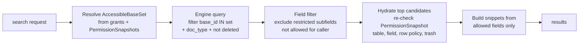
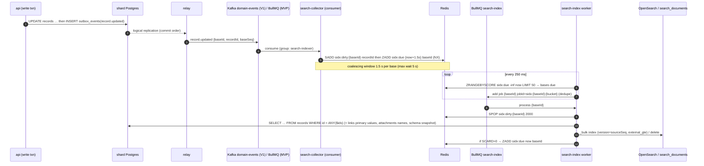
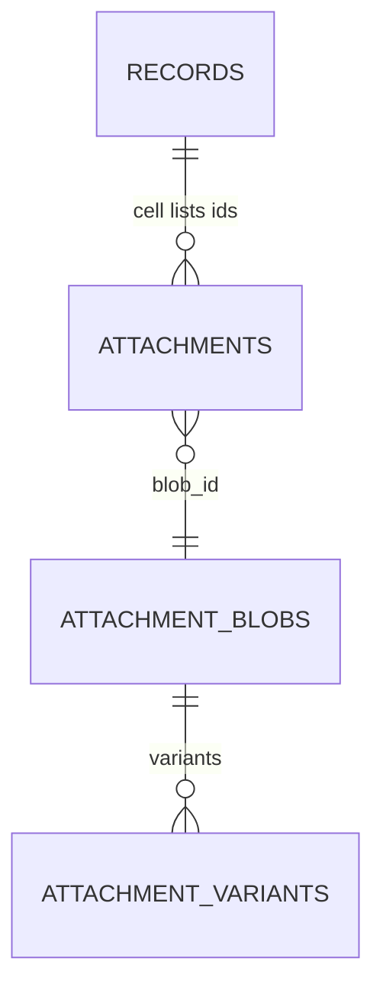
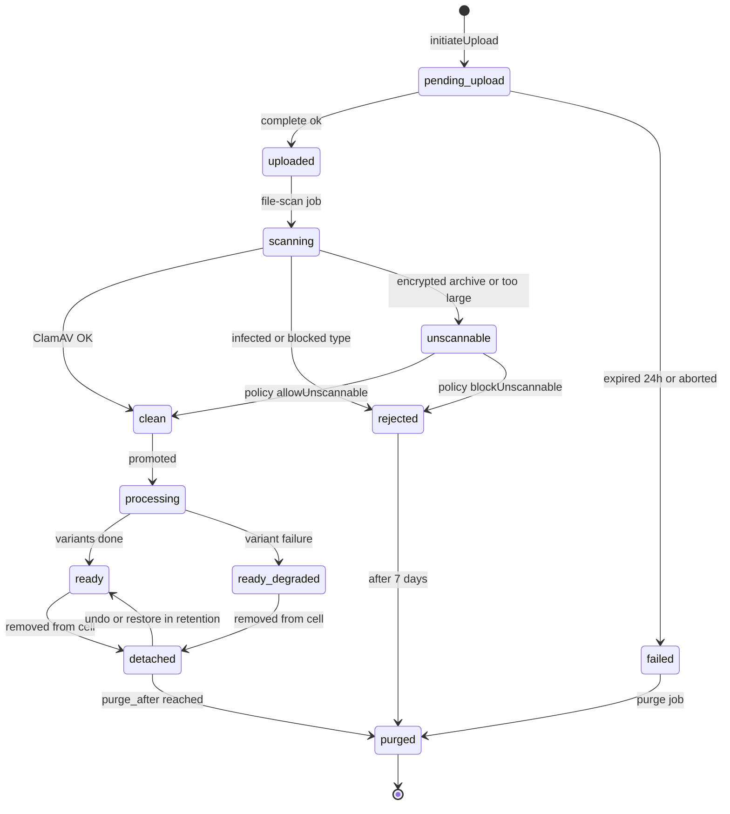
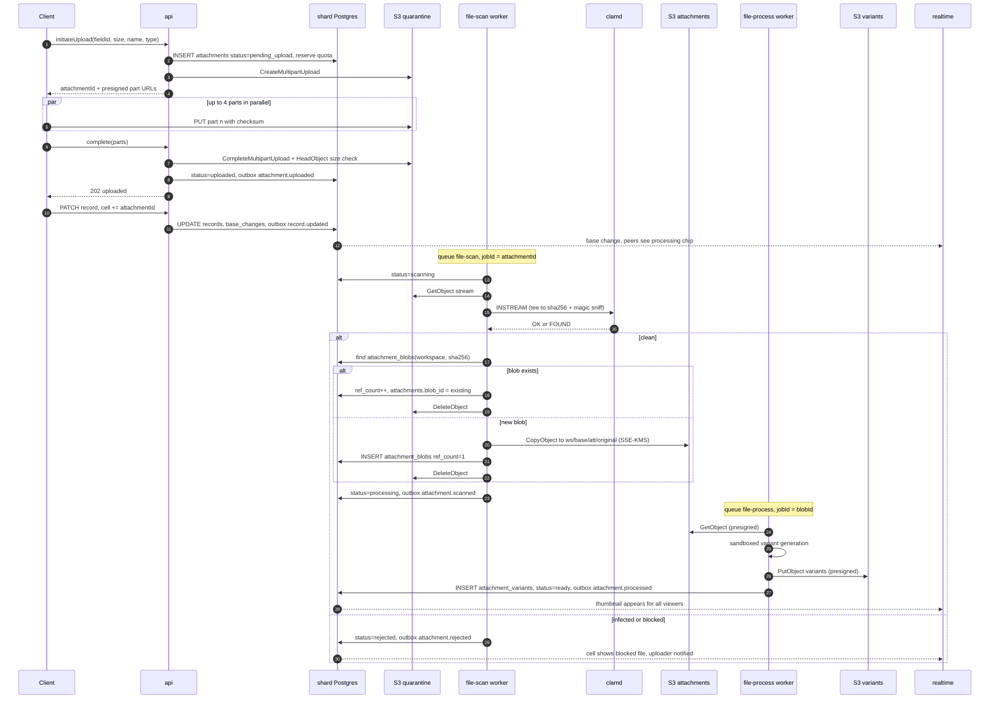
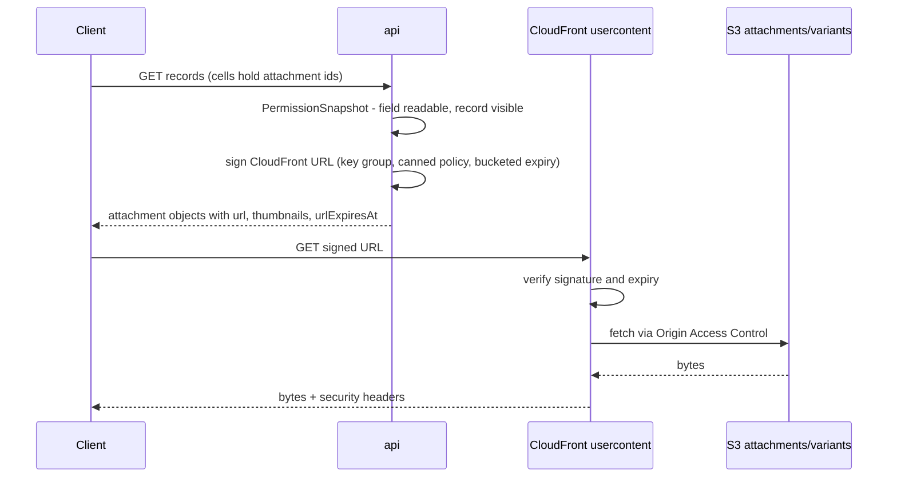
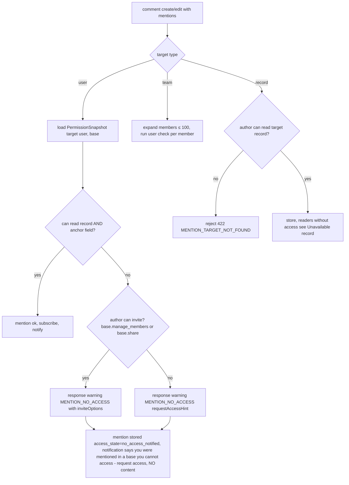
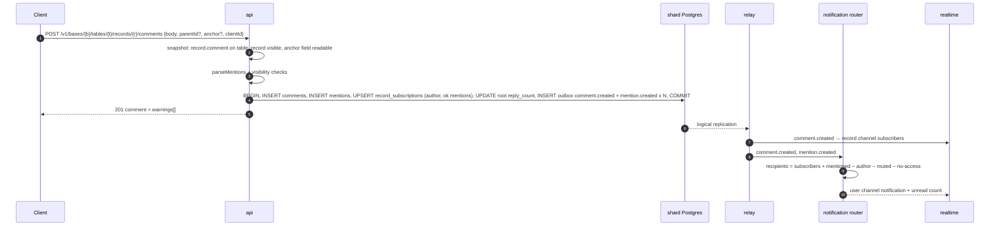

# 18 — Search, Attachments & Collaboration

> **Status:** Proposed · **Owner:** Platform Architecture · **Date:** 2026-10-03
> Conforms to [`00-canonical-decisions.md`](./00-canonical-decisions.md) (D9, D11, D12, D13, D14, D15, D20). Where this file needs something not in the spine inventory it is listed under [Proposed additions](#proposed-additions).

**Sections covered**

* **§21 Search** (Part 17) — scopes, engine comparison, per-stage recommendation, document model, MVP Postgres FTS, V1 OpenSearch, indexing pipeline, permission filtering, in-grid search, sharding & sizing, deletion/restore, consistency SLO, API.
* **§22 Attachments & files** (Part 18) — data model, upload flow (init → multipart → complete → scan → promote → variants), download flow, limits, dedupe, metadata/EXIF, transforms, storage accounting, deletion & GC, failure handling.
* **§23 Collaboration** (Part 19) — comments (record & cell-anchored), threads, reactions, mentions, subscriptions (watchers), activity feeds, edit/delete, notification hook, realtime.

Related: [05 SQL schema](./05-sql-schema.md) · [06 Record storage](./06-record-storage.md) · [14 Automation engine](./14-automation-engine.md) · [15 Events](./15-events.md) · [16 Realtime](./16-realtime.md) · [17 API architecture](./17-api-architecture.md) · [19 Permissions & multi-tenancy](./19-permissions-and-multitenancy.md) · [22 Audit, history, undo, trash](./22-audit-history-undo-trash.md) · [23 Notifications, jobs, caching, performance](./23-notifications-jobs-caching-performance.md) · [25 Security, observability, infrastructure](./25-security-observability-infrastructure.md)

---

# Part 17 — Search (§21)

## 17.1 Search surfaces and requirements

[Observed] Airtable-style products expose several distinct "search" experiences that users perceive as one feature. They have very different consistency, ranking and permission needs, so we design them separately and share infrastructure only where it helps.

| # | Surface | Scope | Corpus | Freshness need | Engine (MVP → V1) |
|---|---|---|---|---|---|
| S1 | **Global search** (⌘K / home) | All bases the user can open, across workspaces & orgs | Bases, tables, views, interfaces, automations, records (title + content) | Seconds OK | `search_documents` → OpenSearch |
| S2 | **Base search** (inside a base) | One base | Same as S1, restricted to base | Seconds OK | same, filter `base_id` |
| S3 | **Table search / record picker** (link-field picker, "expand record" jump) | One table | Records (primary field heavily boosted) | Seconds OK; must find a record created "just now" by me | search index + **read-your-writes overlay** (§17.8.3) |
| S4 | **In-grid find** (Ctrl-F in a view) | One view (its filter, its visible fields) | Formatted visible cell text | **Immediate** (what I see is what I find) | **Postgres, server-side over the view query** (decided §17.8) |
| S5 | **Record-content search** (API `search` param in `records:query`) | Table/view | Fields in the request | Immediate | same as S4 |
| S6 | **Contact search** | Workspace contact directory | Name, email, phone, company; identifier exact match | Immediate for identifiers | `contact_identifiers` (exact) + search index (fuzzy) |
| S7 | **Metadata/field search** ("find field", formula editor field picker, automation field picker) | One base | Field/table/view names & descriptions | Immediate | **Client-side** over the schema snapshot (already in memory, ≤ 500 tables × 500 fields) |

Non-functional targets:

| Metric | Target |
|---|---|
| Global search latency | p50 ≤ 120 ms, p95 ≤ 350 ms (server time) |
| Record picker latency | p50 ≤ 80 ms, p95 ≤ 250 ms |
| In-grid find (≤ 100k rows) | p95 ≤ 800 ms first result page; ≤ 2 s total match count |
| Index lag (event committed → searchable) | p95 ≤ 5 s, p99 ≤ 30 s (SLO §17.11) |
| Leakage | **Zero** results/snippets from bases, tables, records or fields the caller cannot read (hard requirement, tested by permission fuzzer, see [19 §20.14](./19-permissions-and-multitenancy.md)) |

## 17.2 Engine comparison

| Criterion | **Postgres FTS** (+`pg_trgm`) | **Elasticsearch** | **OpenSearch** | **Meilisearch** | **Typesense** |
|---|---|---|---|---|---|
| Relevance | `ts_rank_cd` (no BM25, no IDF across corpus), stemming per `regconfig`; trigram similarity for fuzzy/substring. Adequate for "find my record", weak for big corpora | BM25, rich analyzers, function_score, fuzzy, synonyms, ICU, highlighting | Same feature set as ES 7.10 plus own additions (neural/kNN, hybrid) | Excellent typo-tolerant prefix ranking out of the box; bucket-sort ranking rules; good for "search-as-you-type" | Similar to Meili; typo tolerance, prefix, fast; in-memory index |
| Ops burden | **Zero new system**; but FTS load competes with OLTP on shards; GIN maintenance on hot rows | High (JVM, shard mgmt) unless Elastic Cloud | Medium with **Amazon OpenSearch Service** (managed, VPC, KMS, UltraWarm) | Low for single node; HA/sharding only in Cloud/Enterprise; large indexes rebuild slowly | Low–medium; RAM-bound (whole index in memory) — expensive at 1B docs |
| Multi-tenancy | Natural: same rows/RLS as data | Index-per-tenant doesn't scale (cluster state limits); shared index + routing + filter is standard | Same as ES | "Tenant tokens" with embedded filters — elegant, but single index scale limits | Scoped API keys with embedded filters; same RAM concerns |
| Permission filtering | SQL join/predicates, exact, transactionally consistent | `terms` filter on `base_id`, filter cache makes it cheap | Same; **document-level security** plugin exists but we filter in our query builder | Filter expressions; limited filter cardinality performance | Filter by; fine for small sets |
| Scale ceiling | Tens of millions of docs per shard OK; ranking quality falls before hardware does | Billions | Billions | Tens–hundreds of millions per instance (practical) | Bounded by RAM (~1–2 KB RAM/doc) |
| Cost @ 1B docs (rough) | "Free" (in shards) but +30–40% shard storage & write amplification | Self-managed: similar to OpenSearch; Elastic Cloud premium | ~1.5 TB primary ×2 replicas → ~6–9 data nodes `r6g.2xlarge.search` + UltraWarm for cold | Not realistic at this size without heavy partitioning | ~2 TB RAM → prohibitive |
| Licensing | PostgreSQL (permissive) | Elastic License 2.0 / SSPL / AGPLv3 (tri-licensed since 2024); offering it *as a service* has restrictions; we would only use it internally, which is allowed, but managed-AWS option is OpenSearch | **Apache 2.0** (Linux Foundation) | MIT (community), some features enterprise-licensed | GPLv3 (server), we would not modify/distribute; acceptable internally |
| Fit for our needs | ✅ MVP | ✅ capability, ❌ vendor/licensing optionality on AWS | ✅ **V1** | Good UX, weak at our scale/HA | Good UX, RAM cost |

### 17.2.1 Recommendation per stage

| Stage | Decision | Why |
|---|---|---|
| **MVP** (≤ ~5M records total, ≤ 10k bases) | **Postgres FTS** in `data.search_documents` (per shard) with `tsvector` + `pg_trgm`. Indexed asynchronously by the `search-index` queue. | No new infra; same tenancy/RLS; consistent with D14. Ranking is acceptable when the dominant query is "find the record whose title contains X". |
| **V1** (Kafka on, ≥ 50M records, or when p95 global search > 500 ms) | **Amazon OpenSearch Service**, fed from `tabula.domain-events.v1` + state reads, **one index set per data-plane shard** (§17.6), permission-filtered by accessible base IDs. `search_documents` kept for 1 release as fallback, then dropped (only metadata docs remain if we choose; see §17.4.4). | BM25, highlighting, typo tolerance, horizontal scale, managed. Apache-2.0 avoids licensing risk. |
| **V2** (optional) | Hybrid lexical + vector search (OpenSearch k-NN) for "semantic" record search, fed by the AI gateway embedding pipeline. | Same cluster; only if AI features demand it. |

Rejected: Elasticsearch (equivalent capability; licensing/managed-service ambiguity, no advantage on AWS), Meilisearch/Typesense (great DX, but HA and 1B-doc scale are not their sweet spot; RAM cost for Typesense). We **do** borrow their UX ideas: prefix + typo tolerance on titles, "search as you type" with 100 ms debounce.

## 17.3 Document model

### 17.3.1 Document types

| `doc_type` | One per | Searchable text | Notes |
|---|---|---|---|
| `record` | record | primary field + concatenation of searchable fields; per-field subfields for top N | the bulk of the corpus |
| `base` | base | name, description | |
| `table` | table | name, description | |
| `field` | field | name, description | used by global search "jump to field" (S7 is client-side in base) |
| `view` | view (collaborative/locked only; **personal views indexed only for their owner** via `owner_user_id`) | name | |
| `interface` / `page` | interface page | interface name, page name | |
| `automation` | automation | name, description | |
| `contact` | contact record | name, emails, phones, company | contacts are records of the system contacts table; doc_type `contact` adds identifier subfields |

### 17.3.2 Which field types are searchable and how text is extracted

Extraction happens in the indexer from **canonical stored values** (not client formatting) using each field type plugin's `toSearchText(value, config, ctx)` hook (see [07 field engine](./07-field-engine.md)).

| Field type | Searchable? | Extracted text |
|---|---|---|
| `text`, `email`, `url`, `barcode.text` | yes | raw string |
| `phone` | yes | raw + normalized E.164 digits (so "555 1234" finds "+15551234") |
| `long_text` | yes | `plain` (rich text flattened), **first 8 KB** only |
| `single_select` / `multi_select` | yes | option **labels** resolved from `fields.config.options` at index time |
| `collaborator`, `created_by`, `modified_by` | yes | user display names (resolved via a cached user-name lookup) |
| `number`, `currency`, `percent`, `rating`, `duration`, `autonumber` | yes (as token) | canonical decimal string (e.g. `1200`, `1234.56`) — so "1200" matches; formatted forms (e.g. "$1,234.56") are **not** guaranteed — in-grid find (S4) handles formatted matching |
| `date`, `datetime`, `created_time`, `modified_time` | no in all-text; yes as typed metadata | stored as `date` subfield for filters only |
| `checkbox`, `button`, `json` | no | — |
| `attachment` | yes | file names (from `attachments.filename`) |
| `link`, `contact` | yes | **primary-field values of the first 10 linked records** (denormalized) |
| `formula`, `lookup`, `rollup` | yes if result type is text-like | computed value from `records.computed` (lookups capped at 10 values) |
| `count` | no | — |
| `ai_generated` | yes if `status = ok` and value is text | value |

Limits per record doc: **per field 4 KB**, **total `all_text` 32 KB**, after which text is truncated at a token boundary. These bound index size (§17.7) and bulk payloads.

### 17.3.3 Per-field subfields ("top N")

A single concatenated `all_text` gives recall, but ranking and **field-level permission filtering** need to know *which field* matched. We therefore also index the most important fields individually.

* **N = 16** subfields per table: the primary field (always slot `p`), every field with **any `hide` restriction** (always — required for permission filtering, §17.5.3), then the remaining searchable fields in default field order (first view's order) until 16.
* Mapped as `f.<slot>` (OpenSearch object with dynamic templates restricted to `text` type + `keyword` normalizer for exact/prefix). Slots never repeat (D5/§3), so mapping types never conflict after field type changes — a re-typed field keeps its slot but the **indexer re-extracts** its text.
* Fields beyond N contribute only to `all_text`.
* Field mapping explosion guard: per index, slot subfields are mapped under `f` with `"dynamic": "true"` but `index.mapping.total_fields.limit` raised to 2,000; since docs use only `f.<slot>` with slot ≤ 500 *per table* but slots overlap across tables, the union is ≤ 500 field names per index. ✅

### 17.3.4 Canonical document (TypeScript)

```ts
// @tabula/search/src/document.ts
export type SearchDocType =
  | 'record' | 'contact' | 'base' | 'table' | 'field'
  | 'view' | 'interface' | 'page' | 'automation';

export interface SearchDocument {
  /** `${docType}:${uuid}` — stable, used as OpenSearch _id and PK in search_documents */
  docKey: string;
  docType: SearchDocType;
  orgId: string;            // uuid
  workspaceId: string;      // uuid
  baseId: string;           // uuid
  tableId?: string;         // uuid (record/contact/field/view)
  entityId: string;         // uuid of record/table/…
  title: string;            // primary field text / entity name (≤ 512 chars)
  allText: string;          // concatenated searchable text (≤ 32 KB), EXCLUDES hidden-restricted fields
  fields?: Record<string /*slot*/, string>; // top-N subfields (≤ 4 KB each)
  restrictedSlots?: number[];  // slots that carry a hide restriction (see §17.5.3)
  ownerUserId?: string;     // personal views only
  createdAt: string;        // ISO
  updatedAt: string;        // ISO — recency boost
  deleted: boolean;         // soft-deleted (record, or explicitly flagged parent)
  /** Monotonic version used for external versioning: base_runtime.change_seq at extraction time */
  sourceSeq: number;
  /** schema-dependent extraction generation; bump forces rewrite */
  extractGen: number;
}
```

## 17.4 MVP: Postgres FTS (`data.search_documents`)

### 17.4.1 DDL (normative columns; canonical DDL lives in [05](./05-sql-schema.md))

```sql
CREATE EXTENSION IF NOT EXISTS pg_trgm;
CREATE EXTENSION IF NOT EXISTS unaccent;

-- immutable wrapper so unaccent can be used in generated columns/indexes
CREATE FUNCTION data.f_unaccent(text) RETURNS text
  LANGUAGE sql IMMUTABLE PARALLEL SAFE STRICT
  AS $$ SELECT public.unaccent('public.unaccent'::regdictionary, $1) $$;

CREATE TABLE data.search_documents (
  doc_key        text        PRIMARY KEY,             -- 'record:<uuid>'
  doc_type       text        NOT NULL,
  workspace_id   uuid        NOT NULL,
  base_id        uuid        NOT NULL,
  table_id       uuid,
  entity_id      uuid        NOT NULL,
  title          text        NOT NULL DEFAULT '',
  all_text       text        NOT NULL DEFAULT '',
  restricted_text jsonb      NOT NULL DEFAULT '{}',   -- {"<slot>": "text"} for hide-restricted fields
  owner_user_id  uuid,
  deleted        boolean     NOT NULL DEFAULT false,
  source_seq     bigint      NOT NULL,
  extract_gen    int         NOT NULL DEFAULT 1,
  updated_at     timestamptz NOT NULL,
  tsv tsvector GENERATED ALWAYS AS (
        setweight(to_tsvector('simple', data.f_unaccent(title)), 'A') ||
        setweight(to_tsvector('simple', data.f_unaccent(left(all_text, 32768))), 'C')
      ) STORED
);

CREATE INDEX search_documents_tsv_gin   ON data.search_documents USING gin (tsv);
CREATE INDEX search_documents_title_trgm ON data.search_documents
       USING gin (data.f_unaccent(lower(title)) gin_trgm_ops);
CREATE INDEX search_documents_scope      ON data.search_documents (base_id, doc_type, table_id)
       WHERE NOT deleted;
ALTER TABLE data.search_documents ENABLE ROW LEVEL SECURITY;  -- workspace_id policy, see 19 §21.3
ALTER TABLE data.search_documents SET (fillfactor = 85);       -- HOT updates on re-index
```

Design notes:

* `'simple'` config + `unaccent`: language-agnostic, no stemming (multi-lingual bases are common; stemming the wrong language harms recall). Optional per-base `searchLanguage` setting (V1 OpenSearch only, via analyzer per field — not in MVP).
* Trigram index only on `title` (≤ 512 chars). A trigram GIN on 32 KB `all_text` would be ~3–5× the text size; not worth it in MVP.
* `restricted_text` is **not** part of `tsv`; it is searched only for callers allowed to see those slots (§17.5.3) via a second predicate (`restricted_text ->> '7' ILIKE …`), which is acceptable because hidden fields are rare (Enterprise feature).

### 17.4.2 Query

```sql
-- $1 = query string, $2 = uuid[] accessible base ids (≤ 2,000; else see 17.5.2), $3 = doc types, $4 = limit
WITH q AS (SELECT websearch_to_tsquery('simple', data.f_unaccent($1)) AS tsq,
                  data.f_unaccent(lower($1))                          AS raw)
SELECT d.doc_key, d.doc_type, d.base_id, d.table_id, d.entity_id, d.title,
       ts_headline('simple', d.all_text, q.tsq,
                   'MaxFragments=1,MaxWords=18,MinWords=6,StartSel=«,StopSel=»') AS snippet,
       (  ts_rank_cd(d.tsv, q.tsq, 32)                              -- normalized cover density
        + 0.6 * similarity(data.f_unaccent(lower(d.title)), q.raw)  -- fuzzy title
        + CASE WHEN data.f_unaccent(lower(d.title)) LIKE q.raw || '%' THEN 0.5 ELSE 0 END
        + 0.1 * exp(-extract(epoch FROM now() - d.updated_at) / (86400*30))  -- 30-day recency
       ) AS score
FROM data.search_documents d, q
WHERE d.base_id = ANY($2)
  AND d.doc_type = ANY($3)
  AND NOT d.deleted
  AND (d.tsv @@ q.tsq OR data.f_unaccent(lower(d.title)) % q.raw)
  AND (d.owner_user_id IS NULL OR d.owner_user_id = current_setting('app.user_id')::uuid)
ORDER BY score DESC
LIMIT $4;      -- 2× requested page size; post-filter (§17.5.4) trims
```

`SET LOCAL statement_timeout = '1500ms'` and `SET LOCAL pg_trgm.similarity_threshold = 0.35`. Global search in MVP fans out to **every shard holding an accessible base** in parallel (usually 1–2 shards per user; capped at 8 shards, results merged by score; scores are comparable because the formula is identical and corpus-independent — a property PG FTS has that BM25 does not).

### 17.4.3 Where MVP FTS breaks (and the V1 trigger)

* `ts_rank_cd` has to rank **every** matching row — a query like "a" in a 2M-record base is slow; mitigated by `LIMIT` + `statement_timeout` + minimum query length 2 chars, and by requiring prefix-matching through trigram only for ≥ 3 chars.
* GIN pending-list flushes cause write latency spikes on hot tables → `gin_pending_list_limit = 4MB`, `fastupdate = on`, autovacuum tuned for the table.
* Indexing writes ≈ +1 write per record change on the shard (coalesced). At ≥ 2k record changes/s per shard, the extra I/O is material → move to OpenSearch.

### 17.4.4 Fate of `search_documents` after V1

Keep `search_documents` **only for metadata docs** (`base`, `table`, `view`, `interface`, `automation`) in V1? Two options:

| Option | Pros | Cons |
|---|---|---|
| A. Everything in OpenSearch | one code path, one ranking | metadata searchable only after index lag |
| B. Metadata in PG, records in OpenSearch | metadata instantly consistent; small | two ranking functions to merge |

**Decision: A**, with a read-your-writes overlay (§17.8.3) for entities the user created in the last 60 s. Simpler, and global search UX merges result groups by type anyway (records vs. "places").

## 17.5 Permission filtering

### 17.5.1 Layers



1. **Coarse (engine) filter — base level.** Every query carries `base_id ∈ AccessibleBaseSet(principal)`.
2. **Field filter — restricted fields** (§17.5.3).
3. **Fine post-filter — hydration.** Each hit is checked against the caller's `PermissionSnapshot` for its base (see [19 §20.6](./19-permissions-and-multitenancy.md)): table hidden for interface_only users, Enterprise row policies, records in trash, personal views of others. Over-fetch factor 2× (max 200 candidates for a 20-result page); if > 50% are dropped, the response flags `partial: true` and the UI shows "Some results hidden".
4. **Snippet generation** is done **after** hydration from allowed field text only (we do not trust engine highlights over `all_text` when restricted fields exist — but since restricted fields are never in `all_text`, engine highlights over `all_text` are safe; highlights over `f.<slot>` are requested only for allowed slots).

### 17.5.2 AccessibleBaseSet

```ts
interface AccessibleBaseSet {
  principalKey: string;          // 'usr_…' | 'svc_…'
  epoch: string;                 // hash of (user grant epoch, team membership epoch)
  /** bases with role ≥ viewer, excluding interface_only roles and deleted bases/workspaces */
  baseIds: string[];
  /** workspaces where the principal has workspace-level role ≥ viewer → filter by workspace instead (smaller filter) */
  wholeWorkspaces: string[];
  computedAt: string;
}
```

* Computed from `core.access_grants` (user + team grants), `core.base_directory` (deleted flag, workspace) and org admin rules; cached in Redis under `perm:{principalId}:_bases:{userPermEpoch}` (re-uses the `perm:` namespace with a reserved `_bases` "base id"; see Proposed additions for the `userPermEpoch` source).
* Query filter: `bool.should[ terms(workspace_id, wholeWorkspaces), terms(base_id, baseIds) ]`, minimum_should_match 1. Typical user: 1–3 workspaces + ≤ 50 direct base grants → tiny filter, fully cacheable by OpenSearch's filter cache.
* Pathological principals (≥ 10k individual base grants, e.g. agency accounts): use OpenSearch **terms lookup** against a small `principal-bases` index document (`{_id: principalKey, base_ids: [...]}`) written when the set is recomputed.
* `interface_only` bases are excluded: interface users search **inside interface elements** only (those queries go through the interface data API with element-level filters, not global search).

### 17.5.3 Field-restricted fields — decision

Problem: [Enterprise] `fields.restrictions.hide` can hide a field from some principals. If its text is in `all_text`, a user could discover hidden values by searching (oracle attack: "does any record have salary 250000?").

| Option | How | Pros | Cons |
|---|---|---|---|
| A. Exclude hidden fields from the index entirely | indexer skips restricted slots | simplest, zero leakage | users **allowed** to see the field can't search it |
| B. Index everything; filter results post-query | engine returns hits; app drops those whose *only* match is in a hidden field | full recall | requires per-field match explanation (`explain`/named queries) for every hit; expensive; leakage via counts/timing; easy to get wrong |
| C. **Hidden fields indexed only as separate subfields; never in `all_text`** | `all_text` excludes restricted slots; `f.<slot>` always present for restricted slots; the query builder includes `f.<slot>` clauses only for slots the caller may see | full recall for allowed users, zero leakage by construction; cost = a few subfields | indexer must reindex a table's docs when a restriction is added/removed (`field.updated` with `restrictions` change) |

**Decision: C.** It is leak-proof by construction (the disallowed text is not in any clause the query evaluates), keeps recall for authorized users, and the reindex cost when restrictions change is bounded and rare. During the reindex window (restriction **added**), `all_text` of not-yet-reindexed docs still contains the newly hidden text. Rule: **while a table reindex triggered by a restriction change is in progress, search on that table queries only `title` + allowed `f.<slot>` subfields** (flag in schema snapshot `tables[].search.reindexing = true`, cleared by the reindex job). When a restriction is **removed**, no window exists (text is merely missing from `all_text` until reindexed — recall loss, not leakage). Title (primary field) can itself not be hide-restricted (primary field cannot be hidden; enforced in 19 §20.4.3).

### 17.5.4 Row policies and interface scoping

Enterprise row policies (filter AST with `$currentUser`, see [19 §20.5](./19-permissions-and-multitenancy.md)) are **not** pushed into the search engine in V1 (field values in the policy may not be indexed as keyword fields). They are enforced at hydration by evaluating the compiled policy predicate in-process against the hydrated record (the same evaluator used for realtime filtering). V2 option: index policy-relevant fields as keyword subfields and push the filter down.

## 17.6 V1 OpenSearch: index strategy & sizing

### 17.6.1 Index topology options

| Strategy | Description | Verdict |
|---|---|---|
| Index per base | 100k+ indices | ❌ cluster-state explosion (OpenSearch recommends ≤ ~ 1k shards per node; each index ≥ 1 shard) |
| Index per workspace | ~50k+ indices | ❌ same problem |
| One global index | simple | ❌ huge reindexes, no isolation, cross-region impossible |
| **Index per data-plane shard** (+ custom routing by `base_id`) | `rec-{shardId}-v{gen}` aliased as `rec-{shardId}` | ✅ aligns with D3 (shard = blast-radius unit), workspace moves = reindex a workspace into another shard index, residency follows shard region |
| Dedicated index for dedicated (Enterprise) shards | same naming; can live on a dedicated OpenSearch domain (BYOK) | ✅ |

**Decision:** two index families per data-plane shard:

* `rec-{shardId}` (alias) → `rec-{shardId}-v{gen}`: `record` + `contact` docs. Primary shards: `ceil(expected_primary_GB / 30)` (target 10–40 GB per OpenSearch shard), routing key `base_id` so a base-scoped query hits **one** OpenSearch shard.
* `meta-{shardId}` → metadata docs (`base`, `table`, `field`, `view`, `interface`, `page`, `automation`): small, 1 primary shard, 2 replicas.

Global search queries `rec-{s1},rec-{s2},meta-{s1},…` for all shards in the caller's AccessibleBaseSet (resolved via `core.base_directory`). With `routing` = the accessible base IDs when ≤ 64 bases (OpenSearch hits only those shards), otherwise no routing.

### 17.6.2 Mapping (abridged)

```json
{
  "settings": {
    "index": { "number_of_shards": 8, "number_of_replicas": 1, "refresh_interval": "1s",
               "mapping.total_fields.limit": 2000, "max_result_window": 2000 },
    "analysis": {
      "normalizer": { "kw_lower": { "type": "custom", "filter": ["lowercase", "asciifolding"] } },
      "analyzer": {
        "txt":    { "tokenizer": "icu_tokenizer", "filter": ["icu_folding", "lowercase"] },
        "prefix": { "tokenizer": "icu_tokenizer", "filter": ["icu_folding", "lowercase", "edge_2_15"] }
      },
      "filter": { "edge_2_15": { "type": "edge_ngram", "min_gram": 2, "max_gram": 15 } }
    }
  },
  "mappings": {
    "dynamic": "strict",
    "_routing": { "required": true },
    "properties": {
      "docType": { "type": "keyword" }, "orgId": { "type": "keyword" },
      "workspaceId": { "type": "keyword" }, "baseId": { "type": "keyword" },
      "tableId": { "type": "keyword" }, "entityId": { "type": "keyword" },
      "title": { "type": "text", "analyzer": "txt",
                 "fields": { "prefix": { "type": "text", "analyzer": "prefix", "search_analyzer": "txt" },
                             "kw": { "type": "keyword", "normalizer": "kw_lower", "ignore_above": 256 } } },
      "allText": { "type": "text", "analyzer": "txt", "index_options": "positions" },
      "f": { "type": "object", "dynamic": "true" },
      "restrictedSlots": { "type": "integer" },
      "ownerUserId": { "type": "keyword" },
      "deleted": { "type": "boolean" },
      "updatedAt": { "type": "date" }, "createdAt": { "type": "date" },
      "sourceSeq": { "type": "long" }, "extractGen": { "type": "integer" }
    },
    "dynamic_templates": [
      { "slots": { "path_match": "f.*", "mapping": { "type": "text", "analyzer": "txt" } } }
    ]
  }
}
```

(`dynamic: strict` at root, `dynamic: true` only below `f`, constrained by the template.)

### 17.6.3 Query (record search, base scope)

```json
{
  "size": 40, "track_total_hits": 1000,
  "_source": ["docType","baseId","tableId","entityId","title","updatedAt"],
  "query": {
    "function_score": {
      "query": { "bool": {
        "filter": [
          { "terms": { "baseId": ["<b1>"] } },
          { "term": { "deleted": false } },
          { "terms": { "docType": ["record","contact"] } }
        ],
        "should": [
          { "multi_match": { "query": "acme renewl", "type": "best_fields",
              "fields": ["title^4", "title.prefix^2", "allText", "f.3^1.5", "f.7^1.5"],
              "fuzziness": "AUTO:4,8", "prefix_length": 1 } },
          { "match_phrase": { "allText": { "query": "acme renewl", "boost": 2 } } }
        ],
        "minimum_should_match": 1 } },
      "functions": [ { "gauss": { "updatedAt": { "origin": "now", "scale": "30d", "decay": 0.5 } }, "weight": 0.3 } ],
      "boost_mode": "sum"
    }
  },
  "highlight": { "fields": { "allText": { "fragment_size": 120, "number_of_fragments": 1 },
                             "title": {} } }
}
```

`f.<slot>` clauses are generated **only** for slots allowed by the caller's snapshot (§17.5.3). User-level personalization boost (recently opened bases ×1.3) is applied app-side on merge.

### 17.6.4 Sizing math

| Quantity | Assumption | Value |
|---|---|---|
| Avg record doc `_source` | title 40 B + allText 1.2 KB + subfields 0.6 KB + metadata 0.3 KB | ~2.1 KB |
| Index size / doc (inverted + doc values + stored source, `best_compression`) | ≈ 0.8 × source | ~1.7 KB |
| 10M records | 17 GB primary | 1 index, 2 OS shards, 3-node domain `r6g.large.search` |
| 100M records | 170 GB primary | ~6 OS shards per data-plane shard group; 6 data nodes `r6g.xlarge.search` |
| 1B records | 1.7 TB primary (3.4 TB with 1 replica) | 16–24 data nodes `r6g.2xlarge.search` (≈ 50% disk headroom), or hot/UltraWarm split: bases not searched in 30 days → warm |
| Indexing throughput | bulk 5 MB / ~2,000 docs per request | ≥ 20k docs/s per 6-node cluster; peak need at 1B scale ≈ 3–5k docs/s |

## 17.7 Indexing pipeline

### 17.7.1 Principles

1. **State-based, not event-based indexing.** Events only tell *which* entity is dirty. The indexer reads **current state** from the shard (primary or replica at ≥ the event's `baseSeq`) and writes the full document. Idempotent, order-insensitive, self-healing.
2. **External versioning** with `version = sourceSeq` (base `change_seq` read at extraction) and `version_type = external_gte` → a stale write can never overwrite a newer doc, even with retries/out-of-order workers.
3. **Coalesce per record**: 50 edits to one record in 2 s → 1 index write.
4. **Bulk**: ≤ 2,000 docs or 5 MB per `_bulk` request.

### 17.7.2 Flow



Event → action mapping:

| Event | Action |
|---|---|
| `record.created`, `record.updated`, `record.restored`, `record.computed_updated`, `record.links_changed` | mark record dirty |
| `records.bulk_changed` | if ≤ 5k ids: mark dirty; else enqueue **table backfill** for affected table |
| `record.deleted` | mark dirty (doc rewritten with `deleted=true` — fast to hide, cheap to restore) |
| `trash.purged` (records) | delete docs by id |
| `field.created`, `field.deleted`, `field.restored`, `field.type_changed`, `field.updated` where `config.options` (label rename), `restrictions`, or `name`(meta doc) changed | **table reindex** (`extractGen++`) — except option-label rename on fields not in top-N subfields when table > 100k records: deferred low-priority reindex (stale labels tolerated ≤ 1 h) |
| primary field changed (`table.updated.primaryFieldId`) | table reindex + reindex **linking tables'** docs (denormalized link text) — low priority |
| `table.deleted` / `table.restored` | `update_by_query` set `deleted` on `tableId` (async); hydration hides immediately (schema snapshot no longer contains table) |
| `base.deleted` / `workspace.deleted` | none immediately — AccessibleBaseSet excludes them; on purge → `delete_by_query` |
| `base.*`, `table.*`, `view.*`, `interface.*`, `automation.*` name/description changes | metadata doc upsert (no coalescing delay) |
| `user.updated` (display name) | low-priority job: reindex docs in bases where user appears in collaborator fields — **bounded**: only tables with collaborator fields in top-N subfields; otherwise tolerate staleness until next record edit / weekly re-crawl |
| `contact.merged` | delete merged contact docs, reindex survivor |

### 17.7.3 Indexer worker pseudocode

```ts
async function indexBase(baseId: string): Promise<void> {
  const ids = await redis.spop(`sidx:dirty:${baseId}`, 2000);
  if (ids.length === 0) return;
  const shard = await directory.shardForBase(baseId);
  const snapshot = await schemaCache.get(baseId);              // schema:{baseId}:{schemaVersion}
  // read from replica only if it has applied at least the newest seq we were told about
  const db = await shard.readerAtLeast(baseId, await maxSeqHint(baseId));
  const rows = await db.loadRecordsForIndexing(baseId, ids);   // cells, computed, deleted_at, table_id
  const linkTitles = await db.loadLinkedPrimaryValues(rows, { perField: 10 });
  const attNames = await db.loadAttachmentNames(rows);
  const seq = await db.currentChangeSeq(baseId);               // read within same snapshot txn
  const ops: BulkOp[] = [];
  for (const id of ids) {
    const r = rows.get(id);
    if (!r || r.purged) { ops.push({ delete: { _id: `record:${id}`, routing: baseId, version: seq } }); continue; }
    const t = snapshot.tables[r.tableId];
    if (!t) continue;                                          // table deleted → handled by table job
    ops.push({ index: { _id: `record:${id}`, routing: baseId, version: seq, version_type: 'external_gte' },
               doc: buildRecordDoc(r, t, linkTitles, attNames, seq) });
  }
  const res = await os.bulk(indexFor(shard), ops);
  // 409 version conflicts are expected & ignored; 429/5xx → re-add failed ids to the dirty set
  const retry = res.items.filter(i => i.status === 429 || i.status >= 500).map(i => idOf(i));
  if (retry.length) await redis.sadd(`sidx:dirty:${baseId}`, ...retry);
}
```

### 17.7.4 Backfill & full reindex

* **Table reindex** (`long_operations` row, kind `search_reindex`, invisible to users unless > 60 s): keyset scan `WHERE table_id = $1 AND id > $last ORDER BY id LIMIT 1000` on a replica, bulk index with `extractGen = newGen`, then `delete_by_query` docs of that table with `extractGen < newGen` (catches records purged meanwhile). Throttle: ≤ 2,000 docs/s per table, ≤ 10k docs/s per OpenSearch cluster (token bucket in the worker).
* **New mapping / analyzer change**: create `rec-{shard}-v{gen+1}`, dual-write (indexer writes both aliases' targets), backfill shard-wide from Postgres (not `_reindex`, so extraction logic changes are applied), compare doc counts per base (± 0.1%), swap alias atomically, keep old index 48 h.
* **Bootstrap V1 migration**: same as above per shard, from MVP state. While backfilling a shard, its bases keep using `search_documents` (feature flag per shard `search.engine = pg | os`).
* **Self-healing re-crawl**: weekly per base (spread by hash), compare `(entityId, sourceSeq)` aggregates between Postgres (`records.version` sums per 10k-id range) and OpenSearch; reindex mismatching ranges. Catches lost events (e.g., Redis loss of `sidx:dirty`).

### 17.7.5 Failure handling

| Failure | Behavior |
|---|---|
| OpenSearch unavailable | dirty sets keep growing in Redis (bounded: `SCARD` > 500k per base → convert to table reindex flag and clear set); consumer offsets still commit (dirtiness is in Redis); alert at lag > 60 s |
| Redis loss (dirty sets) | events since last checkpoint are re-consumed: the collector commits Kafka offsets only after `SADD` succeeds; on Redis failover with data loss, reset consumer group offsets by 10 min (idempotent) + re-crawl |
| Poison record (extraction throws) | log with recordId, index a **minimal** doc (title only), metric `search_extract_errors_total` |
| Mapping rejection (`illegal_argument_exception`) | same as poison; slot subfield dropped for that doc |

## 17.8 In-table / in-grid search (S4/S5) — decision

### 17.8.1 Options

| Option | How | Pros | Cons |
|---|---|---|---|
| A. Search index (OpenSearch), filtered by `tableId`, then intersect with view | engine returns matching record IDs; DB applies view filter/sort to `id = ANY(ids)` | fast on huge tables; fuzzy | **index lag** (I type a value and can't find it), matches canonical not **formatted** text (user sees "$1,234.56", searches "1,234"), field-level subtleties (lookups beyond 10, long text beyond 8 KB), `ids` intersection capped |
| B. Client-only find over loaded rows | in-memory | instant | only the loaded 200–1000-row window; wrong on big tables |
| C. **Server-side over the view query** (`ILIKE`/trigram on visible fields' formatted text) | add a predicate `(fmt(slot1) ILIKE '%q%' OR …)` to the compiled view query | **exact**, consistent (reads same snapshot as grid), honors formatting & view filter & permissions automatically | O(rows in view) scan; slower on very large tables |

### 17.8.2 Decision

**C as the default, with A as an accelerator for large tables**:

1. Compiled view query + `search` predicate built by the **Query Compiler** ([06](./06-record-storage.md)): for each *visible, permitted* field, a type-specific search expression:
   * text-like: `(r.cells ->> '3') ILIKE '%' || $q || '%'` (escaped `%`/`_`),
   * select: `r.cells -> '5' ?| $optionIdsMatchingQ` (options whose label matches are resolved **in app** from the schema snapshot — O(options), no DB work),
   * collaborator: same trick with user IDs whose names match (resolved from base member list),
   * number/currency/date: match against the **formatted** string computed in app? Not possible in SQL generically → we compile a numeric match: if `q` parses as a number in the field's locale format, `= value` or prefix-on-text-form; dates: parsed date range,
   * link/lookup: `EXISTS` over `record_links` joined to target primary `record_index_text` when present, else skipped for tables > 50k,
   * computed: against `r.computed ->> 'slot'`.
2. Returns `{ matchCount (capped 10,000), matches: [{recordId, rowIndex, fieldIds[]}] (first 200), cursor }` so the grid can jump to row positions (row index computed by the same ordered query using `row_number()` over the view order, limited by the cap).
3. **Large tables (≥ `INDEX_SIDECAR_THRESHOLD` = 20k records)**: `record_index_text` sidecar rows (truncated collated keys, [06](./06-record-storage.md)) get a **trigram GIN index** for fields marked `searchable` in the view's visible set → predicates become index-assisted (`sidecar.value ILIKE` with `gin_trgm_ops`). Without sidecar coverage and with > 200k rows, the server uses **A** (OpenSearch IDs, cap 10k) intersected with the view filter, and marks the response `approximate: true` (UI: "Results may be a few seconds behind").
4. Timeouts: `statement_timeout 2 s` for the search query; on timeout fall back to A (if available) else return partial matches found so far (keyset batches of 5k rows).

**Why:** what users search in a grid is *what they see*, and they expect their own just-typed value to be findable. Only the DB query honoring view filter, formatting rules and permissions guarantees that; the search index is a scale accelerator, not the source of truth.

### 17.8.3 Read-your-writes overlay (S1–S3)

To avoid "I just created record 'Acme' and the picker can't find it": the API keeps, per user, the IDs of entities the user created/renamed in the last 60 s (in the client: the RecordStore knows them; server: optional). The **record picker** (S3) runs *two* queries in parallel: the search index query, and a direct PG query `primary text ILIKE` restricted to `created_at > now() - 2 min` in that table (index on `(table_id, created_at)` exists for created-time sorting). Results merged, deduped by id. Cheap, closes the lag gap.

## 17.9 Contact search (S6)

* Identifier-shaped queries (contains `@`, or ≥ 7 digits) → exact lookup on `data.contact_identifiers (workspace_id, kind, normalized_value)` — immediately consistent, then hydrate.
* Otherwise → `rec-{shard}` with `docType: contact` filtered by the workspace's contacts table, fields `title` (name), `f.email`, `f.company`, with prefix matching.
* Contact directory visibility follows the contacts table permissions of the workspace ([19](./19-permissions-and-multitenancy.md)).

## 17.10 Deletion, restore, purge

| Lifecycle | Search effect | Latency |
|---|---|---|
| Record soft delete | doc rewritten `deleted=true` (filtered out) | index lag (p95 5 s); hydration re-check hides immediately |
| Record restore | doc rewritten `deleted=false` | same |
| Table/field soft delete | table: async `update_by_query`; field: table reindex (text removed) — meanwhile query builder never queries the slot's subfield and hydration builds snippets from the current schema only | hydration guarantees immediate invisibility of the *content*; `all_text` could still match on a deleted field's text for ≤ reindex time → **accepted** (the record itself is still visible to the user; only the match reason is stale) |
| Base/workspace soft delete | excluded from AccessibleBaseSet immediately (perm epoch bump) | immediate |
| Purge (`trash.purged`) | `delete` by id / `delete_by_query` by table/base | async, ≤ 1 h; GDPR erasure path waits for confirmation |
| Restore of table/base | `update_by_query` back to visible or full reindex if docs were purged | minutes for large tables (UI shows "search indexing…" banner) |

## 17.11 Consistency SLO & observability

* **SLI:** `search_index_lag_seconds` = `now − event.occurredAt` at the moment the bulk response for that record is acknowledged, histogram per shard.
* **SLO:** p95 ≤ 5 s, p99 ≤ 30 s, measured over 28 days, excluding declared maintenance; metadata docs p95 ≤ 2 s (no coalescing delay).
* Alerts: p99 > 60 s for 10 min (page), dirty-set size > 1M total (ticket), extraction error rate > 0.1%.
* Canary: synthetic workspace per shard writes a unique token every minute and searches it; measures end-to-end lag.

## 17.12 Search API (summary; full spec in [31](./31-api-specification.md))

```http
GET /v1/search?q=acme&types=record,table,base&workspaceId=wsp_…&baseId=bas_…&limit=20&cursor=…
```

```ts
interface SearchResponse {
  results: Array<{
    type: SearchDocType; id: string; baseId: string; tableId?: string;
    title: string; snippet?: { field?: string; text: string; highlights: [number, number][] };
    score: number; path: { workspace: string; base: string; table?: string };
  }>;
  nextCursor?: string;      // search_after over (score, docKey); max depth 2,000
  partial?: boolean;        // post-filter dropped many candidates
  approximate?: boolean;    // results served from index while lagging
}
```

Rate limit: 10 searches/s per user, 100/s per org (search is the most expensive read); typing debounce 120 ms client-side; queries < 2 chars rejected (`SEARCH_QUERY_TOO_SHORT`).

---

# Part 18 — Attachments & files (§22)

## 18.1 Requirements & limits

| Limit | Free | Team | Business | Enterprise | Enforcement point |
|---|---|---|---|---|---|
| Max file size | 50 MB | 1 GB | 1 GB | 5 GB | `initiateUpload` (declared) + `complete` (actual `HEAD` size) |
| Attachment storage per base | 1 GB | 50 GB | 250 GB | 1 TB+ | `initiateUpload` (reserve) + nightly reconciliation |
| Files per attachment cell | 100 | 100 | 100 | 100 | record write validation |
| Concurrent upload sessions per user | 10 | 10 | 10 | 20 | Redis `rl:upload:{userId}:…` |
| Open (not completed) upload sessions per base | 200 | 200 | 1,000 | 5,000 | `initiateUpload` |
| Upload session expiry | 24 h | 24 h | 24 h | 24 h | purge job |
| Image variant input cap | 100 MP, 200 MB | same | same | same | file-process worker |
| Video poster input cap | first 10 s decoded | same | same | same | ffmpeg flags |
| Office document preview | — | ≤ 50 MB | ≤ 50 MB | ≤ 50 MB, policy-controlled | file-process worker |

## 18.2 Data model

### 18.2.1 Logical attachment vs physical blob

[Ours] **One `attachments` row per logical attachment = one occurrence in one cell** `(record_id, field_id)`. Copying a file to another cell (copy/paste, duplicate record, automation "copy attachment", base duplication) creates a **new `attachments` row** pointing at the **same physical blob**. Physical blobs are content-addressed per workspace in `attachment_blobs` (see [Proposed additions](#proposed-additions)).

Why one row per occurrence:

* Authorization is trivial: an attachment is readable iff its owning `(record, field)` is readable by the caller ([19 §20.8](./19-permissions-and-multitenancy.md)). No ambiguity when the same file sits in a visible and a hidden cell.
* Lifecycle is trivial: removing a file from a cell **detaches** exactly one row; GC is reference counting on blobs.
* Per-occurrence metadata (filename override, uploader, created_at) stays correct.



### 18.2.2 `data.attachments` (normative columns; DDL in [05](./05-sql-schema.md))

| Column | Type | Notes |
|---|---|---|
| `id` | uuid | `att_…` |
| `workspace_id`, `base_id`, `table_id` | uuid | tenancy + routing |
| `record_id` | uuid NULL | NULL until attached (upload may precede record creation, e.g. forms) |
| `field_id` | uuid | target attachment field (declared at init; enforced at attach) |
| `blob_id` | uuid NULL | NULL until promoted; → `attachment_blobs.id` |
| `filename` | text | sanitized display name (≤ 255 chars, no path separators, NFC) |
| `declared_mime`, `detected_mime` | text | client-declared vs magic-byte detected |
| `size_bytes` | bigint | actual |
| `sha256` | bytea NULL | computed **server-side** during scan |
| `status` | enum `attachment_status` | see state machine |
| `scan_result` | jsonb | `{engine:'clamav', sigVersion, verdict, signature?}` |
| `media` | jsonb | `{width,height,orientation,durationMs,pageCount,hasAlpha,animated,exifStripped}` |
| `uploaded_by`, `uploaded_by_type` | uuid, text | user / service account / `public_form` / automation |
| `source` | text | `upload` \| `url_fetch` \| `copy` \| `import` \| `sync` \| `automation` |
| `upload_id` | text NULL | S3 multipart UploadId while uploading |
| `created_at`, `promoted_at`, `processed_at` | timestamptz | |
| `detached_at` | timestamptz NULL | removed from its cell (or record/field purged) |
| `purge_after` | timestamptz NULL | `detached_at + detached retention` |
| `deleted_at` | timestamptz NULL | logically purged (row kept 7 days for audit, then hard-deleted) |

Indexes: `(record_id)`, `(blob_id)`, `(base_id, status) WHERE status IN ('pending_upload','uploaded','scanning','processing')`, `(purge_after) WHERE purge_after IS NOT NULL AND deleted_at IS NULL`.

### 18.2.3 Status state machine



Cells may reference attachments in `uploaded | scanning | clean | processing | ready | ready_degraded | unscannable`. Bytes are served only in `ready | ready_degraded`.

## 18.3 Upload flow

### 18.3.1 API

```http
POST /v1/bases/{baseId}/attachments:initiateUpload
{ "fieldId": "fld_…", "recordId": "rec_…", "filename": "Q3 plan.pdf",
  "size": 48211234, "contentType": "application/pdf" }

201 { "attachmentId": "att_…", "uploadId": "…", "partSize": 16777216,
      "parts": [ { "partNumber": 1, "url": "https://<quarantine presigned>", "expiresAt": "…" } ],
      "completeBy": "2026-10-04T14:05:00Z" }

POST /v1/bases/{baseId}/attachments/{attachmentId}:complete
{ "parts": [ { "partNumber": 1, "etag": "\"…\"", "checksumSha256": "…" } ] }
202 { "attachmentId": "att_…", "status": "uploaded" }

GET  /v1/bases/{baseId}/attachments/{attachmentId}:status      // resumable: lists uploaded parts
POST /v1/bases/{baseId}/attachments:fromUrl                     // server-side fetch (API/automations)
{ "fieldId": "fld_…", "url": "https://…", "filename": "optional" }
```

* `initiateUpload` checks: caller has `record.update` on the field (or `record.create` + form/interface element permission), field type is `attachment`, field not edit-restricted for caller, declared size ≤ plan max, base storage quota (`used + reserved + size ≤ quota`), open sessions ≤ limit, filename sanitization, MIME not in org blocklist (`organization_policies.attachments.blockedTypes`).
* Single-part (`size ≤ 16 MB`): one presigned `PUT`. Multipart: part size `max(16 MB, ceil(size / 9000))` (S3 allows 10,000 parts), part URLs valid 1 h, refreshable via `:status`.
* Presigned URL constraints: `Content-Length` bound in signature for single PUT; key `q/{workspaceId}/{attachmentId}` in `tabula-uploads-quarantine`; bucket policy denies `GetObject` to all principals except the scan/promote role; CORS restricted to app origins.
* **Client checksums are used only for integrity** (`x-amz-checksum-sha256` per part, verified by S3) — never for dedupe (§18.6).

### 18.3.2 End-to-end sequence



Why attach to the cell **before** the scan completes: the UX shows the file instantly (optimistic chip with a local browser thumbnail), and collaborators see a "processing" placeholder. Bytes are never served before `ready`, so nothing is exposed. On a dedupe hit whose blob already has variants, the status goes straight to `ready`.

### 18.3.3 Upload from URL

Runs as the first stage of the `file-scan` queue on egress-proxy-only workers (same SSRF controls as outbound webhooks, [25](./25-security-observability-infrastructure.md)): DNS resolved once and pinned, private/link-local/metadata ranges denied, `http(s)` only, ≤ 5 redirects each re-validated, max bytes = plan limit, 60 s total timeout, `Content-Disposition` filename honored after sanitization. Streams into the quarantine bucket, then joins the pipeline at `uploaded`.

## 18.4 Malware scanning

* **Engine:** ClamAV `clamd` (≥ 3 pods, ~4 GB RAM each), `freshclam` sidecar updating hourly; readiness fails if signatures are > 24 h old. Behind a `MalwareScanner` interface; alternatives: Amazon GuardDuty Malware Protection for S3 (managed, per-GB), commercial engines for Enterprise.
* **Protocol:** `INSTREAM` with `StreamMaxLength 4G`; larger files → `unscannable`.
* **Archive limits:** `MaxScanSize 4G`, `MaxFileSize 1G`, `MaxRecursion 16`, `MaxFiles 10000`, `AlertExceedsMax yes` → zip bombs flagged.
* **Type sniffing:** magic-byte detection during the same stream (`file-type` + libmagic). `detected_mime` is authoritative for serving. Declared `image/png` but detected `text/html` → served as `application/octet-stream` with `attachment` disposition; org policy may reject mismatches.
* **Executables/scripts:** allowed by default but always served as downloads; org policy can block.
* **SLO:** p95 scan completion ≤ 10 s for files ≤ 50 MB (~100 MB/s per clamd pod).
* Stored files are not rescanned on signature updates (cost); Enterprise option: re-scan files uploaded in the last 7 days weekly.

## 18.5 Promotion & variants

### 18.5.1 Promotion

Server-side `CopyObject` (`UploadPartCopy` above 5 GB) from quarantine to `tabula-attachments` at `{workspaceId}/{baseId}/{attachmentId}/original` — the **first** attachment id of the blob names the object (keys are immutable; later occurrences refer via `blob_id`). SSE-KMS with the org's key (dedicated shard / BYOK) or the regional key with S3 Bucket Keys. Object metadata `x-amz-meta-sha256`, `x-amz-meta-blob-id`.

### 18.5.2 Variant catalogue

| Variant | Source types | Tool | Output |
|---|---|---|---|
| `thumb_s` | images, PDF page 1, video poster, office page 1 | libvips (`sharp`) | WebP, height 64 px (+ 128 px @2x) — grid chips |
| `thumb_l` | same | libvips | WebP, fit 512×512 — gallery/kanban cards |
| `preview` | images | libvips | WebP/AVIF, fit 1600×1600, q80 — expanded viewer |
| `pdf_p1` | PDF | **pdfium** (poppler `pdftoppm` fallback) | PNG 1600 px; records page count |
| `poster` | video | **ffmpeg** (`-ss 1 -frames:v 1`) + `ffprobe` | JPEG 1280 px; duration/dims |
| `office_pdf` | doc/docx/xls/xlsx/ppt/pptx/odt/ods/odp | **LibreOffice headless** (`soffice --convert-to pdf`) | PDF preview → `pdf_p1` (optional, plan/policy-gated) |
| `heic_jpeg` | HEIC/HEIF | libvips + libheif | JPEG for browsers without HEIC |
| `svg_raster` | SVG | `resvg` (no scripts, no external refs) | PNG 1600 px (SVG is never served inline) |

Variants are keyed per blob: `tabula-attachment-variants/{workspaceId}/{baseId}/{firstAttachmentId}/{variant}`; dedupe hits reuse them.

### 18.5.3 Sandboxing processors

| Control | Setting |
|---|---|
| Isolation | dedicated `file-process` pod pool with **gVisor** runtime class; LibreOffice in a separate pool (gVisor in MVP, Firecracker microVMs in V1) |
| Network | deny-all egress; S3 access only through presigned GET/PUT URLs passed in the job → a compromised parser can touch only its own object |
| Filesystem | read-only root, per-job tmpfs 2 GB, wiped |
| Resources/timeouts | 2 vCPU / 2 GB (office 3 GB); images 20 s, PDF 30 s, video 60 s, office 90 s |
| libvips | `limitInputPixels: 1e8`, `sequentialRead`, `failOn: 'error'`, `sharp.cache(false)`, `sharp.concurrency(1)` |
| ffmpeg | `-protocol_whitelist file,pipe -nostdin -t 10`, no network protocols |
| PDF | pdfium, JS disabled, only page 1, ≤ 300 DPI |
| Office | macros disabled, per-job profile directory, `--norestore --nologo --headless` |
| Failure | variant failure never fails the upload → `ready_degraded` + MIME icon |

### 18.5.4 Metadata & EXIF

* Variants are **always** re-encoded without metadata (EXIF orientation applied first) → thumbnails never leak GPS.
* Originals: policy `attachments.stripImageMetadata` (org or base). Default **off** (users expect byte-exact files); Enterprise orgs may enforce **on**. When on, JPEG/PNG/WebP/HEIC originals are rewritten without metadata **before** hashing (so dedupe works on the stripped content); `media.exifStripped = true`.
* Stored metadata (`attachments.media`): dimensions, orientation, duration, page count, animated. GPS/camera/serial fields are **never** stored.

### 18.5.5 Image transforms

* MVP: fixed variants only.
* V1: on-demand resize on the user-content domain `/{ws}/{base}/{att}/w{256|512|1024|2048}.webp` → CloudFront → origin resize function (libvips) → cached in the variants bucket. **Allowlisted widths only** (arbitrary sizes enable cache-busting DoS). Same signing as downloads.

## 18.6 Deduplication

* **Scope: per workspace** — `attachment_blobs` unique on `(workspace_id, sha256)`. Cross-workspace dedupe is rejected: it leaks file existence across tenants (confirmation-of-file attack), conflicts with per-org KMS keys and residency, and complicates workspace shard moves.
* **Server-computed hash only.** Dedupe happens after upload (saves storage, not bandwidth). A "skip upload if the hash is known" shortcut would let anyone who knows a hash obtain a file from a base they can't access in the same workspace → rejected.
* Expected savings 10–25% in workspaces with duplicate bases/templates; base duplication creates new `attachments` rows with **zero byte copies**.
* **Accounting is logical** (§18.9): users are charged per occurrence; dedupe is a COGS saving and quotas stay predictable (deleting one copy frees what the user expects).

## 18.7 Download flow

### 18.7.1 Domains

* App `app.tabula.example`, API `api.tabula.example`.
* **User content `tabulausercontent.example`**: a separate registrable domain — no cookies, not same-site with the app, cannot read app cookies, never allowed in app CSP `script-src`.

### 18.7.2 Signed URLs



* **Signing:** CloudFront key group (RSA keys in Secrets Manager, KMS-encrypted, rotated quarterly with overlap), canned policy `DateLessThan`.
* **TTL:** in-app and API URLs **2 h**; orgs with `attachments.strictUrlTtl` **10 min**. Expiry is **bucketed**: `expiresAt = ceil((now + ttl) / 15 min) × 15 min`, so the same URL is issued to everyone for a 15-minute window → browser cache hits and in-process memoization of signatures (LRU 50k, key `(attachmentId, variant, bucket)`). Clients refresh on 403 or at `urlExpiresAt − 5 min`.
* **Revocation:** an issued URL stays valid until expiry even if access is revoked. Accepted, bounded by TTL, documented; strict orgs use 10 min.
* **Response headers** (CloudFront response-headers policy + signed `response-content-*` overrides):
  * `Content-Type` from `detected_mime`.
  * `Content-Disposition: inline` only for the inline-safe allowlist: `image/png|jpeg|gif|webp|avif`, `video/mp4|webm`, `audio/mpeg|ogg|wav`, `application/pdf`. Everything else — **including SVG, HTML, XML** — `attachment; filename*=UTF-8''<pct-encoded>`.
  * `X-Content-Type-Options: nosniff`; `Content-Security-Policy: default-src 'none'; img-src 'self'; media-src 'self'; style-src 'unsafe-inline'; sandbox`; `Cross-Origin-Resource-Policy: cross-origin`; `Referrer-Policy: no-referrer`; `Cache-Control: private, max-age=<remaining ttl>`.
* **Share links / forms:** the share endpoint issues the same signed URLs after evaluating the share-link principal's snapshot ([19 §20.11](./19-permissions-and-multitenancy.md)).
* **Exports & automations:** export workers stream from S3 with IAM; automation steps fetch via the internal attachment service under the automation principal's permissions.

## 18.8 Deletion & garbage collection

### 18.8.1 Reference semantics

* A cell lists attachment ids; `record_revisions` diffs may reference ids in `before/after` ([22 §27](./22-audit-history-undo-trash.md)).
* **Detach** when: the id is removed from the cell; the record is **purged** (not merely soft-deleted); the field is purged; the table/base/workspace is purged.
* Detached retention `R` (`purge_after = detached_at + R`): **30 days** (`TRASH_RETENTION`) for Free/Team; **1 year** Business; **Enterprise configurable up to revision retention**. Within `R`, undo or revision restore re-attaches (`detached → ready`). After `R`, a restored revision yields a tombstone chip ("File no longer available").
* Detached-but-retained bytes are reported as **history storage** (separate usage line); counted against quota only on Business+ (who pay for the longer retention).

### 18.8.2 Detach & copy on the write path

The record write path computes per-slot diffs for `base_changes`. For attachment fields, `removed = before \ after` → `UPDATE attachments SET detached_at = now(), purge_after = … WHERE id = ANY($removed) AND record_id = $rec` **in the same transaction**. `added` ids are validated (`base_id` match, status allowed, owned by the uploader's session if `record_id IS NULL`). If an added id already belongs to **another** cell (paste/duplicate), the server creates a **copy row** (new id, same blob, `ref_count++`) and stores the new id in the cell — preserving "one occurrence = one row".

### 18.8.3 GC job (`purge` queue, every 15 min)

```sql
WITH due AS (
  SELECT id FROM data.attachments
  WHERE purge_after < now() AND deleted_at IS NULL
  ORDER BY purge_after
  LIMIT 500
  FOR UPDATE SKIP LOCKED)
UPDATE data.attachments a SET deleted_at = now()
FROM due WHERE a.id = due.id
RETURNING a.blob_id;

-- per returned blob (same txn):
UPDATE data.attachment_blobs
   SET ref_count = ref_count - 1,
       purge_pending_at = CASE WHEN ref_count - 1 = 0 AND snapshot_pins = 0 THEN now() END
 WHERE id = $1;
```

* Blob bytes are deleted **24 h after** `purge_pending_at` (absorbs races with an in-flight copy); the copy path re-increments and clears `purge_pending_at`.
* Base snapshots pin blobs (`snapshot_pins`), see [22 §27.4.2](./22-audit-history-undo-trash.md); pinned blobs are never deleted.
* S3 versioning on `tabula-attachments` is **off** (deletes must be real for GDPR); disaster recovery via AWS Backup to `tabula-backups` with 35-day retention (documented in the DPA).
* Weekly **orphan sweeper**: S3 Inventory vs `attachment_blobs` → objects without rows older than 7 days deleted; rows without objects → alert.

## 18.9 Storage accounting

* Per-base logical bytes = `Σ size_bytes` of non-detached attachments in states `uploaded…ready_degraded` + reserved bytes of open sessions.
* Incremental: `usage_events` on promote (+), detach (−), re-attach (+), reservation (±) → aggregated into `core.usage_counters` (metric `attachment_bytes`, dimension base). The quota check reads a Redis-cached counter (≤ 1 min stale) plus open reservations.
* Nightly exact reconciliation per shard (`SUM … GROUP BY base_id`) corrects drift and emits `usage.threshold_reached` at 80% and 100%.
* Over quota: new uploads rejected (`ATTACHMENT_QUOTA_EXCEEDED`); existing files stay downloadable.

## 18.10 Failed & abandoned uploads

| Case | Handling |
|---|---|
| Client never calls `complete` | `pending_upload` older than 24 h → `failed`, `AbortMultipartUpload`, reservation released. Bucket lifecycle `AbortIncompleteMultipartUpload` 1 day; quarantine objects expire after 7 days |
| `complete` with wrong size/parts | 422 `UPLOAD_INCOMPLETE`; client may retry parts until expiry |
| Cell references a failed/rejected attachment | id stays; renderer shows "Upload failed — remove"; any later write may drop it; automations see `status` |
| Network drop | resumable: client calls `:status` (S3 `ListParts`) and uploads missing parts |
| Scan worker crash | BullMQ stalled-job retry (idempotent by `attachmentId` + status guard); reconciler re-enqueues rows in `uploaded`/`scanning` older than 15 min |
| Variant worker failure | 3 attempts with backoff, then `ready_degraded` |

## 18.11 Events & realtime

* `attachment.uploaded`, `attachment.scanned`, `attachment.rejected`, `attachment.processed` via the outbox ([15](./15-events.md)). Payload: ids, status, mime, size, media — never URLs.
* Realtime ([16](./16-realtime.md)): `attachment.processed` / `rejected` are fanned out on the base channel as `attachment_status {recordId, fieldId, attachmentId, status}`; clients then fetch thumbnails URLs via their own authorized read. **Signed URLs are never broadcast.**
* Automations ([14](./14-automation-engine.md)): triggers see attachment ids immediately; trigger option "wait until files are processed" delays the trigger until `attachment.processed` for all newly added ids (≤ 5 min, then proceeds with partial status).

---

# Part 19 — Collaboration (§23)

## 19.1 Capabilities

[Observed] Airtable-style products let collaborators comment on records, @-mention people, react, watch records, and see a record-level activity timeline mixing edits and comments. [Ours] We support:

| Capability | MVP | V1 |
|---|---|---|
| Record comments, edit/delete own | ✅ | |
| Threads (one level of replies) | ✅ | |
| Mentions: users, teams, records | ✅ users/records | teams, contacts |
| Field/cell-anchored comments (`anchor.fieldId`) | | ✅ |
| Reactions | ✅ | |
| Record subscriptions (watch/unwatch, auto-watch) | ✅ | |
| Record activity feed (revisions + comments) | ✅ | |
| Base activity feed | | ✅ |
| Resolve thread | | ✅ |
| Mentions in long text cells | | ✅ |
| Comments from interfaces (element permission) | ✅ | |

## 19.2 Data model

### 19.2.1 `data.comments`

| Column | Type | Notes |
|---|---|---|
| `id` | uuid | `cmt_…` |
| `workspace_id`, `base_id`, `table_id`, `record_id` | uuid | record-scoped always |
| `parent_id` | uuid NULL | thread root id; **one level**: a reply's parent must have `parent_id IS NULL` (CHECK via trigger or app; replies to replies are re-parented to the root) |
| `anchor` | jsonb NULL | `{ "fieldId": "<uuid>", "quote"?: string(≤200) }` for field/cell comments; NULL = record-level |
| `body` | jsonb | rich-text doc (our schema: paragraphs, marks bold/italic/code/link, mention nodes) |
| `body_plain` | text | flattened text with mention tokens (`@[usr_…]`) — used for search, email, notifications |
| `author_id`, `author_type` | uuid, text | `user` \| `automation` \| `integration` \| `ai` |
| `created_at`, `edited_at` | timestamptz | |
| `deleted_at`, `deleted_by` | timestamptz, uuid | soft delete (placeholder shown if it has replies) |
| `resolved_at`, `resolved_by` | timestamptz, uuid | threads only (root) |
| `reply_count` | int | maintained on root (denormalized for list rendering) |
| `client_id` | uuid NULL | client-generated idempotency/optimistic-ID correlation |

Indexes: `(record_id, created_at, id)` (feed), `(parent_id, created_at) WHERE parent_id IS NOT NULL`, `(base_id, created_at DESC)` (base feed), `(record_id) WHERE deleted_at IS NULL AND parent_id IS NULL` (count badges).

Limits: body ≤ 10,000 chars plain; ≤ 50 mentions per comment; ≤ 10,000 comments per record (soft; beyond → 422 `COMMENT_LIMIT`); ≤ 500 replies per thread.

### 19.2.2 Anchors

* `anchor.fieldId` must reference a field of the record's table that the author can **read**. Readers who cannot read that field ([19 §20.8](./19-permissions-and-multitenancy.md)) **do not see the comment at all** (its content likely discusses the hidden value). This is a deliberate choice: hiding is safer than degrading.
* Field deleted → comment remains, rendered as record-level with a "(field deleted)" chip; field restored → anchor works again (field ids are stable).
* `quote` lets the UI show the cell value at comment time; it is captured **only if** the field is not hide-restricted (otherwise the quote could leak to audiences that later lose access).

### 19.2.3 `data.comment_reactions`

`(comment_id, user_id, emoji)` PK; `emoji` is a shortcode from an allowlist (Unicode emoji set, 1–32 chars); ≤ 20 distinct emojis per comment; toggling = insert/delete. Reaction counts are aggregated on read (`GROUP BY emoji`, small).

### 19.2.4 `data.mentions`

| Column | Notes |
|---|---|
| `id` uuid | |
| `workspace_id`, `base_id`, `table_id`, `record_id` | context record |
| `source_type` | `comment` \| `long_text` |
| `source_id` | comment id, or `"<recordId>:<fieldId>"` encoded as field id + record id columns for long text |
| `field_id` NULL | long-text field id for `source_type = long_text` |
| `target_type` | `user` \| `team` \| `record` \| `contact` |
| `target_id` | uuid |
| `created_by`, `created_at` | |
| `access_state` | `ok` \| `no_access_notified` \| `invited` — result of the visibility check at mention time |

Unique `(source_type, source_id, field_id, target_type, target_id)`. Index `(target_type, target_id, created_at DESC)` powers "Mentions of me" inbox and "linked from" for record mentions.

### 19.2.5 `data.record_subscriptions`

`(record_id, user_id)` PK + `workspace_id`, `base_id`, `reason` (`manual | commented | mentioned | assigned | created`), `muted boolean` (explicit unwatch keeps a row with `muted = true` so auto-subscribe does not re-add), `created_at`. Index `(user_id, base_id)`.

Auto-subscribe rules (each only if no `muted` row exists): author of a comment; mentioned user (if they can read the record); user assigned via a collaborator field (`record.assigned`); record creator **if** base setting `watchOwnRecords` (default off — noisy for imports). Cap: 1,000 subscribers per record (beyond → only explicit mentions notify).

## 19.3 Mentions

### 19.3.1 Token format

Mentions are stored as tokens in `body_plain` and as nodes in `body`:

```text
@[usr_5Xk9QmZ…]      user
@[tem_2bD…]          team
@[rec_7Hq…]          record (same base only in MVP; cross-base V2)
@[ctc_9Lp…]          contact (workspace contact directory)
```

Grammar (applied to `body_plain`; `body` nodes must agree, server re-derives `body_plain` from `body`, never trusts client-provided `body_plain`):

```ts
const MENTION_RE = /@\[(usr|tem|rec|ctc)_([1-9A-HJ-NP-Za-km-z0-9]{22})\]/g; // base62, 22 chars (§3)
interface ParsedMention { type: 'user' | 'team' | 'record' | 'contact'; publicId: string; id: string /*uuid*/; offset: number; }
export function parseMentions(plain: string): ParsedMention[] {
  const out: ParsedMention[] = []; const seen = new Set<string>();
  for (const m of plain.matchAll(MENTION_RE)) {
    const publicId = `${m[1]}_${m[2]}`;
    if (seen.has(publicId)) continue; seen.add(publicId);
    out.push({ type: PREFIX_TO_TYPE[m[1]], publicId, id: decodePublicId(publicId), offset: m.index! });
    if (out.length > 50) throw problem('MENTION_LIMIT_EXCEEDED', 422);
  }
  return out;
}
```

Display names are **resolved at render time** (rename-safe). Unresolvable/unauthorized tokens render as "Unknown user" / "Unavailable record".

### 19.3.2 Visibility check & "offer invite"



* The check runs in the API **before commit** (the author's UI shows inline warnings while typing via `POST /v1/bases/{baseId}/mentions:check` with candidate ids — batched, debounced 300 ms).
* "Invite" opens the share dialog prefilled with the user at the lowest role sufficient to see the record (`commenter`); invites go through the normal invitation flow and audit ([22](./22-audit-history-undo-trash.md)).
* Notification to a mentioned user without access contains **no record content** (no comment body, no record title), only actor + base name if the org allows base-name disclosure (org policy; default yes within the same org, no for external guests).
* Team mentions: teams of the org only; expansion capped at 100 members (larger → 422 `TEAM_TOO_LARGE_TO_MENTION`); members failing the check are silently skipped (count returned in response warnings).
* Record mentions in comments create a backlink shown in the target record's activity ("Mentioned in comment on rec X") only for readers of both records.

### 19.3.3 Mentions in long text (V1)

On a `long_text` cell write, the field plugin's `extractMentions(before, after)` yields added/removed tokens. Added → mention rows + notifications (same checks); removed → mention rows deleted (no "un-notify"). Bulk writes (imports, API batch > 100 records) **do not notify** mentions (prevents notification storms); they still create mention rows.

## 19.4 Comment lifecycle

### 19.4.1 Create



* Comments are **not** written to `base_changes` (they don't change record state, don't participate in undo, and would bloat the ordered log). They are delivered to realtime via the domain-event path (`comment.*` events, routed by `record_id`/`base_id`) — see [16](./16-realtime.md). Ordering between a comment and a concurrent cell edit is not guaranteed (no need).
* Idempotency: `client_id` unique per `(record_id, author_id, client_id)` → retries return the existing comment.

### 19.4.2 Edit

* Author only (any time). `edited_at` set; mentions re-parsed: **new** targets get rows + notifications, removed targets lose rows (notifications already sent are not retracted, but their deep link shows the current text).
* Edit history: the previous `body` is retained in the `comment.updated` event payload for audit (audit store, [22](./22-audit-history-undo-trash.md)); not shown in UI.

### 19.4.3 Delete

* Author, or base `creator`, or org admins with admin access. Soft delete: `deleted_at`, `body` cleared to `{}` **immediately** (users expect deletion to remove content), mention rows deleted.
* Root with replies → placeholder "Comment deleted" keeps the thread; root without replies → hidden.
* Hard delete on record purge (cascade in purge job), or GDPR user erasure (author's comments' bodies wiped, author shown as "Deleted user").
* Deleted comments are **not** trash items (not part of `deletion_batches`) and are not undoable by default — deletion is confirmed in the UI. Enterprise policy `comments.recoverableDeletes` keeps the cleared body in the audit store (`comment.deleted` event `before`, redacted per policy) for admins/legal hold; there is no end-user restore.

### 19.4.4 Comments and record deletion/restore

Soft-deleted record → its comments are hidden with it (parent flag, no marking); restore brings them back. Purge deletes comments, reactions, mentions, subscriptions.

## 19.5 Activity feeds

### 19.5.1 Record activity

Record activity = **merge of two time-ordered streams**: `record_revisions` for the record (cell-level diffs, [22 §27.2](./22-audit-history-undo-trash.md)) and `comments` (roots; replies nested).

```ts
interface ActivityItem {
  kind: 'revision' | 'comment';
  at: string;                         // ISO
  id: string;                         // rev_… or cmt_…
  actor: { type: string; id: string; via?: string };
  revision?: { changes: Array<{ fieldId: string; before?: unknown; after?: unknown; added?: string[]; removed?: string[] }>; kind: 'create'|'update'|'delete'|'restore' };
  comment?: CommentDto;
}
// cursor = base64({ at, kind, id }) ; pageSize ≤ 50
```

Algorithm (k-way merge, keyset on both sources):

```sql
-- both use (record_id, created_at DESC, id DESC) indexes; each fetches pageSize+1
(SELECT 'revision' AS kind, id, created_at FROM data.record_revisions
  WHERE record_id = $1 AND (created_at, id) < ($2, $3) ORDER BY created_at DESC, id DESC LIMIT $4)
UNION ALL
(SELECT 'comment', id, created_at FROM data.comments
  WHERE record_id = $1 AND parent_id IS NULL AND (created_at, id) < ($2, $3) ORDER BY created_at DESC, id DESC LIMIT $4)
ORDER BY created_at DESC, id DESC LIMIT $4;
```

Then hydrate details. **Permission projection**: revision changes on fields the reader cannot see are dropped; a revision whose all changes are hidden is dropped; anchored comments on hidden fields are dropped. Revisions are additionally constrained by plan retention ([22 §27.5](./22-audit-history-undo-trash.md)) — older items show an upsell boundary ("History older than 14 days is available on Team").

UI grouping (client-side): consecutive revisions by the same actor within 5 minutes collapse into one entry.

### 19.5.2 Base activity feed (V1)

Sources: `record_revisions` by `(base_id, created_at DESC)` (partition-pruned by month), `comments` by `(base_id, created_at DESC)`, and schema events (table/field/view created/deleted) from `schema_revisions` (Proposed addition in [22](./22-audit-history-undo-trash.md)). Filtered by readable tables/fields. Expensive for huge bases → page size 50, max lookback 90 days in the feed UI, filters (by user, by table) pushed down to SQL.

## 19.6 Permissions summary

| Action | Required |
|---|---|
| Read comments | `record.read` on the record (+ anchor field readable) |
| Create comment / reply / react | `record.comment` (role ≥ `commenter`; interface users if the element enables comments; share-link principals never) |
| Edit comment | author |
| Delete comment | author, or base `creator` |
| Resolve thread | `record.comment` |
| Watch/unwatch | `record.read` |
| Mention check endpoint | `record.comment` |

## 19.7 Realtime

* Channel: clients viewing an expanded record subscribe to `record:{recordId}` within their base session ([16](./16-realtime.md)); comment events are routed there, plus a **count-only** message on the base channel (`comment_count {recordId, count}`) so grid comment badges update. Each subscriber's projection is evaluated by the gateway (anchored comments on hidden fields are filtered out per connection permission class).
* Typing indicator ("Alice is commenting…") via presence (`presence:{baseId}` hash entry with `commentingOn: recordId`, TTL 10 s) — ephemeral, not persisted.
* Count badges in grid: computed on window fetch: `SELECT record_id, count(*) FROM comments WHERE record_id = ANY($200ids) AND parent_id IS NULL AND deleted_at IS NULL GROUP BY 1` (index-only), not denormalized onto `records` (avoids hot-row writes on popular records).

## 19.8 Notification hook

Collaboration emits `comment.created`, `comment.updated` (with `newMentions`), `comment.deleted`, `mention.created`, `reaction.added`, `record.assigned`. The notification router ([23 §30](./23-notifications-jobs-caching-performance.md)) maps:

| Event | Recipients | Category |
|---|---|---|
| `mention.created` (user/team) | mentioned users (access ok) | `mention` |
| `mention.created` (no access) | mentioned user, content-free | `mention` |
| `comment.created` | record subscribers − author − mentioned (already notified) | `comment` |
| reply | thread participants − author (subscribers get `comment`) | `comment_reply` |
| `reaction.added` | comment author (coalesced, in-app only) | `reaction` (Proposed category, see 23) |
| `record.assigned` | assignee | `assignment` |

## 19.9 API surface (summary)

```http
GET    /v1/bases/{b}/tables/{t}/records/{r}/comments?cursor&pageSize&includeReplies=true
POST   /v1/bases/{b}/tables/{t}/records/{r}/comments
PATCH  /v1/bases/{b}/comments/{commentId}
DELETE /v1/bases/{b}/comments/{commentId}
POST   /v1/bases/{b}/comments/{commentId}:resolve | :unresolve
PUT    /v1/bases/{b}/comments/{commentId}/reactions/{emoji}
DELETE /v1/bases/{b}/comments/{commentId}/reactions/{emoji}
POST   /v1/bases/{b}/mentions:check            { recordId, fieldId?, targets: ["usr_…","tem_…"] }
PUT    /v1/bases/{b}/tables/{t}/records/{r}/subscription   { watching: true|false }
GET    /v1/bases/{b}/tables/{t}/records/{r}/activity?cursor
GET    /v1/bases/{b}/activity?cursor&tableId&actorId      (V1)
```

---

## Proposed additions

| Kind | Name | Purpose | Notes |
|---|---|---|---|
| Table (`data`) | `attachment_blobs` | Physical content-addressed blob per workspace: `id`, `workspace_id`, `sha256`, `size_bytes`, `object_key`, `detected_mime`, `ref_count`, `snapshot_pins`, `purge_pending_at`, `created_at`; unique `(workspace_id, sha256)` | Enables per-workspace dedupe & refcount GC (§18.2, §18.8). Alternative without new table: self-referencing `attachments.blob_owner_id` — rejected (refcount on an occurrence row conflates lifecycles). |
| Columns | `attachments.blob_id`, `detached_at`, `purge_after`, `deleted_at`, `source`, `media`, `upload_id` | §18.2.2 | reconcile with 05 |
| Columns | `comments.anchor`, `body_plain`, `resolved_at/by`, `reply_count`, `client_id`, `deleted_by` | §19.2.1 | |
| Column | `mentions.access_state`, `mentions.field_id` | §19.2.4 | |
| Columns | `record_subscriptions.reason`, `muted` | §19.2.5 | |
| Column | `search_documents.restricted_text`, `extract_gen`, `source_seq`, `owner_user_id` | §17.4.1 | |
| Redis namespace | `sidx:dirty:{baseId}` (set), `sidx:due` (zset) | search coalescing (§17.7.2) | not in §10 |
| Redis namespace | `perm:{principalId}:_bases:{userPermEpoch}` | AccessibleBaseSet cache (§17.5.2) | uses `perm:` namespace with reserved `_bases`; needs a per-principal epoch, see 19 Proposed additions |
| OpenSearch | indices `rec-{shardId}-v{gen}`, `meta-{shardId}-v{gen}`, `principal-bases` | §17.6 | |
| Policy keys | `organization_policies`: `attachments.blockedTypes`, `attachments.stripImageMetadata`, `attachments.strictUrlTtl`, `attachments.allowUnscannable`, `comments.recoverableDeletes`, `notifications.discloseBaseNameToNonMembers` | §18, §19 | JSON keys, no schema change |
| Domain | `tabulausercontent.example` + CloudFront distribution | §18.7 | infra (25) |
| Event | `attachment.detached` (optional) | storage metering clarity | could be folded into `record.updated` |
