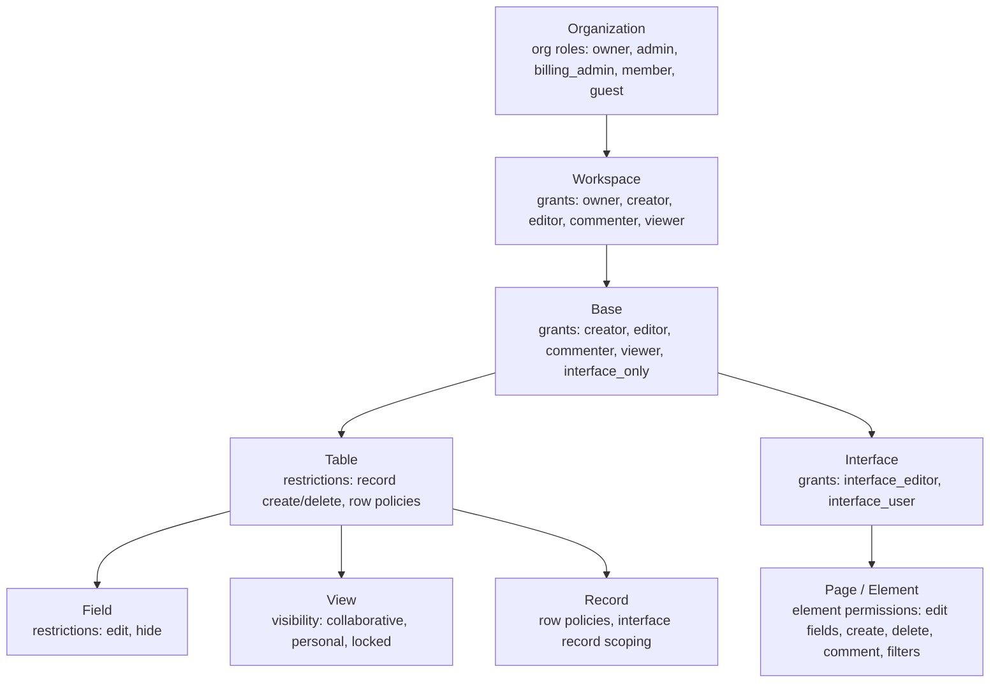
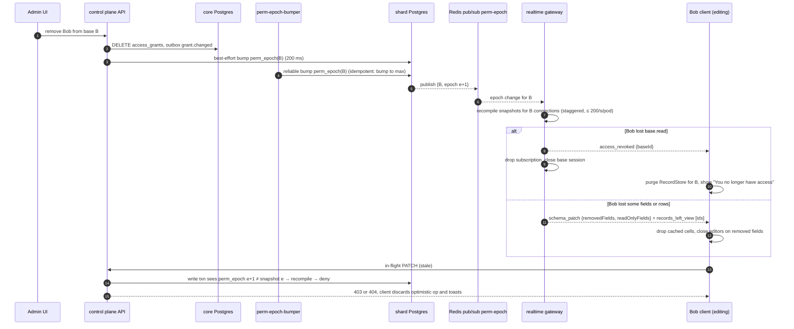
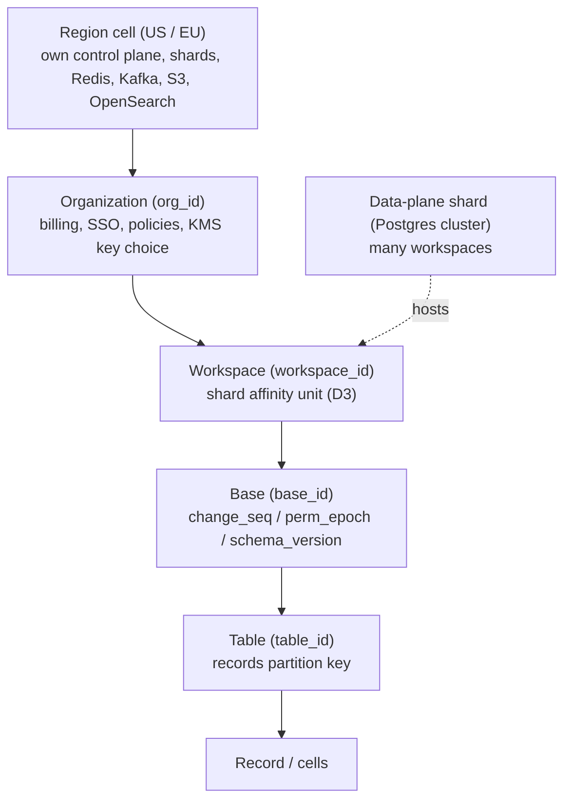
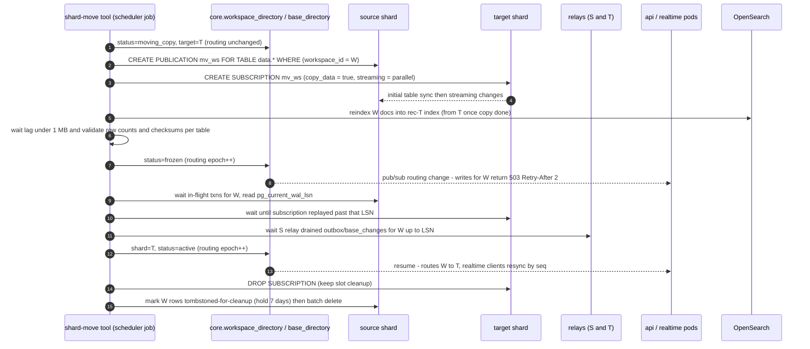

# 19 — Permissions & Multi-tenancy

> **Status:** Proposed · **Owner:** Platform Architecture · **Date:** 2026-10-03
> Conforms to [`00-canonical-decisions.md`](./00-canonical-decisions.md) — especially D2, D3, D4, D13, D20 and §9 (permission vocabulary), §10 (Redis), §12 (plans). Anything outside the spine inventory is under [Proposed additions](#proposed-additions).

**Sections covered**

* **§24 Permissions** (Part 20) — RBAC/ABAC model, principals, roles, actions, resources & scopes, inheritance, grants, restriction overlays, row policies, guests, `interface_only`, org-admin access policy, evaluation algorithm, `PermissionSnapshot`, caching & invalidation (`perm_epoch`), per-request cost, field masking across API/realtime/search/export/AI, record-level permissions & SQL injection of row policies, team expansion, revocation during editing, share links & tokens, testing matrix.
* **§25 Multi-tenancy** (Part 21) — tenant hierarchy, tenant IDs, RLS, isolation models comparison & recommendation, encryption at rest & BYOK, field-level envelope encryption, data residency (regional cells), noisy-neighbor controls, workspace shard migration.

Related: [05 SQL schema](./05-sql-schema.md) · [06 Record storage](./06-record-storage.md) · [16 Realtime](./16-realtime.md) · [17 API architecture](./17-api-architecture.md) · [18 Search/attachments/collaboration](./18-search-attachments-collaboration.md) · [22 Audit/history/undo/trash](./22-audit-history-undo-trash.md) · [23 Notifications/jobs/caching/performance](./23-notifications-jobs-caching-performance.md) · [25 Security/observability/infrastructure](./25-security-observability-infrastructure.md)

---

# Part 20 — Permissions (§24)

## 20.1 Design goals

1. **Correct by construction**: a single authorization kernel (`@tabula/authz`) produces one compiled artifact — the `PermissionSnapshot` — which every surface (REST, realtime, search, export, webhooks, automations, AI, share pages) consumes. No surface re-implements rules.
2. **O(1) per check** on the hot path (map/bitset lookups), with all graph walking (org → workspace → base, teams) done once per (principal, base, epoch).
3. **Additive roles, subtractive restrictions**: grants can only widen (max role wins); restrictions can only narrow. Easy to reason about and to explain in the UI ("why can't I edit this?").
4. **Bounded staleness**: reads may use a snapshot up to ~1 s stale; **writes are always validated against the authoritative epoch** inside the write transaction.
5. **Explainability**: every decision can be explained (`GET /v1/bases/{id}/permissions:explain?principal=…&action=…`) for admins and support.

## 20.2 Model

### 20.2.1 Vocabulary

| Concept | Definition | Examples |
|---|---|---|
| **User** | Global human identity (`core.users`) | `usr_…` |
| **Principal** | Anything that can be authorized | `user`, `team`, `service_account`, `share_link`, `automation`, `api_token` (as a *narrowing* of its owner principal), `public_form` |
| **Role** | Named bundle of actions at a scope (§9 of spine) | base `editor` |
| **Action** | Atomic permission string (§9) | `record.update` |
| **Resource** | Object being acted on | org, workspace, base, table, field, view, record, interface, page, element, automation |
| **Scope** | Resource level at which a grant is made | `organization`, `workspace`, `base`, `interface` |
| **Grant** | (principal, scope resource, role) row in `core.access_grants` | team *Sales* is `editor` on workspace W |
| **Restriction** | Deny overlay stored on a resource | field "Salary": edit only by `creator`; hide from all except team HR |
| **Row policy** | Enterprise ABAC rule: filter AST with `$currentUser` determining which records a principal set may see/edit | "Sales reps see rows where Owner = me" |

Hierarchy (inheritance flows downward; restrictions attach at the lower levels):



### 20.2.2 Role → action matrix (base scope)

✅ allowed · ◐ allowed subject to restrictions/overlays · — denied.

| Action | creator | editor | commenter | viewer | interface_only |
|---|---|---|---|---|---|
| `base.read` | ✅ | ✅ | ✅ | ✅ | — (interfaces only) |
| `base.manage_schema` (tables/fields/link relations) | ✅ | — | — | — | — |
| `base.manage_members` | ✅ | — | — | — | — |
| `base.share` (create share links) | ✅ | ◐ (if base setting `editorsCanShare`) | — | — | — |
| `table.create` / `table.update` / `table.delete` | ✅ | — | — | — | — |
| `field.create` / `field.update` / `field.delete` | ✅ | — | — | — | — |
| `record.read` | ✅ | ✅ | ✅ | ✅ | ◐ via interface elements |
| `record.create` / `record.delete` | ✅ | ◐ table restriction | — | — | ◐ element permission |
| `record.update` | ✅ | ◐ field restriction | — | — | ◐ element permission |
| `record.comment` | ✅ | ✅ | ✅ | — | ◐ element permission |
| `view.read` | ✅ | ✅ | ✅ | ✅ | — |
| `view.create_collaborative` | ✅ | ✅ | — | — | — |
| `view.create_personal` | ✅ | ✅ | ✅ | ✅ | — |
| `view.update` | ✅ | ◐ (not if locked) | — | — | — |
| `view.lock` | ✅ | — | — | — | — |
| `interface.read` | ✅ | ✅ | ✅ | ✅ | ◐ granted interfaces |
| `interface.edit` / `interface.publish` | ✅ | — | — | — | ◐ if `interface_editor` |
| `automation.read` | ✅ | ✅ | ✅ | — | — |
| `automation.edit` | ✅ | — | — | — | — |
| `automation.run` (manual/button) | ✅ | ✅ | — | — | ◐ button element |
| `integration.manage` | ✅ | — | — | — | — |
| `export.data` (CSV/API bulk export) | ✅ | ✅ | ✅ | ✅ (unless base setting `viewersCanExport=false`) | — |
| `api.access` | ✅ | ✅ | ✅ | ✅ | — |
| `ai.use` | ✅ | ✅ | ◐ (read-only AI, e.g. summarize) | ◐ | ◐ element |
| `audit.read` | org admins only (org scope) | | | | |

Workspace roles map onto base roles for every base in the workspace: `owner`/`creator` → base `creator`; `editor` → `editor`; `commenter` → `commenter`; `viewer` → `viewer`. Workspace-level actions: `workspace.manage` (owner), `workspace.create_base` (owner, creator). Org actions: `org.manage` (owner, admin), `org.billing` (owner, billing_admin), `audit.read` (owner, admin).

### 20.2.3 Grants (`core.access_grants`)

Canonical DDL is in [05 §core.access_grants](./05-sql-schema.md) (`id, org_id, resource_type ∈ {org, workspace, base, interface}, resource_id, workspace_id, base_id, principal_type ∈ {user, team, service_account}, principal_id, role, source, granted_by, expires_at, created_at, updated_at`, role validated per resource type by CHECK). This document needs two extra `source` values — **`admin_elevation`** and **`support`** — added to the existing CHECK list (`manual, invite, scim, domain_auto_join, creator, migration`); see [Proposed additions](#proposed-additions). Access paths used by authz:

```text
INDEX (principal_type, principal_id)             -- "what can X access" (snapshot compile, AccessibleBaseSet)
INDEX (resource_type, resource_id)               -- "who can access Y" (share dialog, epoch fan-out)
INDEX (expires_at) WHERE expires_at IS NOT NULL  -- scheduler expiry sweep (elevations, guest expiry)
```

Rules:

* One row per (resource, principal). **Effective role = max over all applicable grants** (direct user grants + team grants + inherited from workspace).
* Grants on **tables, fields, views are not allowed** — narrowing below base level is done exclusively with restrictions (prevents "editor on table A, viewer on base" ambiguity and keeps the max-role algebra simple).
* Interface grants (`interface_editor`, `interface_user`) give `interface_only` base access if the principal has no base role.

### 20.2.4 Org roles, guests and the admin access policy

| Org role | Implicit content access | Management |
|---|---|---|
| `owner`, `admin` | **None by default** | see all workspaces/bases *metadata* (names, owners, sizes, sharing), manage members/teams/SSO/policies, transfer ownership, delete/restore workspaces, revoke share links, view audit log |
| `billing_admin` | None | billing only |
| `member` | None (only grants); may see "discoverable" workspaces list if org setting allows | — |
| `guest` | None; no org directory visibility; cannot be added to teams by default; can only receive base/interface grants (not workspace) unless org policy allows | — |

**Decision — admin content access is explicit, audited elevation**:

* Options considered: (A) admins implicitly read everything (simple; violates least privilege, surprises users, makes every admin session a data-exfiltration risk); (B) admins can never read content (blocks legitimate incident response & offboarding); (C) **break-glass elevation**.
* **Chosen: C.** An org owner/admin clicks *"Access as admin"* on a workspace/base in the admin panel, enters a reason, re-authenticates (MFA step-up ≤ 5 min old). The system creates an `access_grants` row with `source = admin_elevation`, role `creator` (or `viewer` if chosen), `expires_at = now() + 8h` (max 24 h), emits `grant.changed` + audit event `admin.content_access_elevated` with reason, and notifies workspace owners (in-app + email; org policy may suppress for "investigations" with a second admin's approval — V1). Every read under elevation is attributed in audit (`via=admin_elevation`).
* Same mechanism for Tabula staff via `core.support_access_grants` (customer-approved, time-boxed, read-only by default) → compiled into the snapshot as a synthetic grant.

### 20.2.5 Restriction overlays (deny-style)

Stored with the resource (spine §9). JSON schemas (Zod in `@tabula/authz`):

```ts
/** Principal set used by restrictions & row policies. Empty = nobody. */
interface PrincipalSet {
  minRole?: 'creator' | 'editor' | 'commenter' | 'viewer'; // anyone with base role ≥ minRole
  users?: string[];         // user uuids
  teams?: string[];         // team uuids
  serviceAccounts?: string[];
}

/** tables.restrictions */
interface TableRestrictions {
  recordCreate?: PrincipalSet;    // default: { minRole: 'editor' }
  recordDelete?: PrincipalSet;    // default: { minRole: 'editor' }
  hideFromInterfaceOnly?: boolean;
  rowPolicies?: RowPolicy[];      // Enterprise
}

/** fields.restrictions */
interface FieldRestrictions {
  edit?: PrincipalSet;            // default: { minRole: 'editor' } — who may edit cell values
  hide?: { visibleTo: PrincipalSet };  // Enterprise: field hidden for everyone NOT in visibleTo (creators always see)
  editViaFormsOnly?: boolean;     // field editable only through forms/interfaces with explicit element permission
}

/** Enterprise row policy (ABAC) */
interface RowPolicy {
  id: string;
  appliesTo: PrincipalSet;        // who this policy constrains
  read: FilterAst;                // records visible = OR over applicable policies' read filters
  write?: FilterAst;              // records editable/deletable (defaults to read); also WITH CHECK on create/update
  exempt?: PrincipalSet;          // e.g. { minRole: 'creator' } — default exempt: creators
}
```

Views: `views.visibility = 'locked'` → only `view.lock` holders (creators) may change config; personal views readable only by owner. Interface element permissions are compiled per element (`canEditFields[]`, `canCreate`, `canDelete`, `canComment`, `recordFilter` with `$currentUser`).

**Primary field cannot be hide-restricted** (record identity must be displayable wherever a record is visible, e.g. link chips). Link fields pointing to hidden tables show "N linked records" without titles.

## 20.3 Principals in detail

| Principal | How authenticated | How permissions are derived |
|---|---|---|
| `user` | session cookie / PAT / OAuth access token | grants (direct + teams) + org role + restrictions |
| `team` | — (never authenticates) | expanded into member users at snapshot compile |
| `service_account` | service-account token | grants on service account (workspace/base) |
| `api_token` | hashed bearer | **intersection**: owner principal snapshot ∩ token scopes (`data.records:read`, `schema.bases:write`, …) ∩ token resource restrictions (list of workspaces/bases) |
| `oauth app` | OAuth access token | intersection: user snapshot ∩ granted OAuth scopes ∩ resources the user selected at consent |
| `share_link` | unguessable token (≥ 128 bits) in URL, optional password, optional email-domain restriction | synthetic snapshot: read-only projection of the shared view/interface: visible fields of the view (minus hidden-restricted fields), view filter as **row policy**, no comments/writes; forms = create-only on form fields |
| `automation` | internal (runner) | base-scoped synthetic principal: **editor-equivalent** on its own base, field `edit` restrictions **apply** (automations can't bypass edit locks unless the automation's last publisher is a creator → creators can publish automations that write restricted fields); `hide` restrictions do **not** apply to automations (they need data), but **outbound** steps (email, webhook, AI, integration) may only include hidden-field data if the publisher could see it (checked at publish time) |
| `public_form` | anonymous | `record.create` on the form's table, only form-visible fields; rate-limited; captcha by policy |

## 20.4 Effective permission evaluation

### 20.4.1 Algorithm (compile once per principal × base × epoch)

```text
compile(principal P, base B):
  1. load base header (workspace W, org O, deleted?, settings) from base_directory + bases (cached)
     if B or W deleted → snapshot = NONE (except restore rights for creators/admins via trash API)
  2. principals* = {P} ∪ teams(P) (team_members, org O only)
  3. role_ws   = max(role of grants on (workspace W) for principals*)                 → mapped to base role
     role_base = max(role of grants on (base B) for principals*)
     role_elev = grants with source=admin_elevation/support not expired
     baseRole  = max(role_ws_mapped, role_base, role_elev)
  4. if baseRole is null:
        itfGrants = interface grants in B for principals*
        if any → baseRole = interface_only, interfaces = {itf → role}
        else   → snapshot = NONE
  5. if org role = guest and workspace grants exist and org policy forbids guest workspace access → ignore ws grants
  6. actions = ROLE_ACTIONS[baseRole] ∩ PLAN_ACTIONS[plan] ∩ ORG_POLICY_ACTIONS[org]   (bitset AND)
  7. for each table T (schema snapshot):
        t.create = actions.record.create ∧ inSet(P, T.restrictions.recordCreate)
        t.delete = actions.record.delete ∧ inSet(P, T.restrictions.recordDelete)
        t.rowPolicy = compileRowPolicies(T.restrictions.rowPolicies, P)   (null if exempt or none)
        for each field F in T:
          hidden  = F.restrictions.hide && !inSet(P, F.hide.visibleTo) && baseRole != creator
          editable = actions.record.update ∧ !hidden ∧ inSet(P, F.restrictions.edit) ∧ !computed(F)
          record into t.hiddenSlots / t.readOnlySlots bitmaps
  8. views: personal views of others excluded; locked → view.update requires creator
  9. interfaces/elements: compile element permission maps (interface_only and all roles)
 10. token narrowing (if via api_token/oauth): actions &= scopeMask; restrict to allowed resources
 11. return snapshot (immutable), with epoch + hashes
```

`inSet(P, S)` = `baseRole ≥ S.minRole` ∨ `P.user ∈ S.users` ∨ `teams(P) ∩ S.teams ≠ ∅` ∨ `P.svc ∈ S.serviceAccounts`.

Complexity: O(#grants(P) + #tables + #fields) ≈ ≤ 500×500 worst case = 250k field iterations (~5–15 ms in V8) — done only on cache miss; typical base (20 tables × 30 fields) < 0.5 ms.

### 20.4.2 `PermissionSnapshot` (TypeScript)

```ts
// @tabula/authz/src/snapshot.ts
export type BaseRole = 'creator' | 'editor' | 'commenter' | 'viewer' | 'interface_only';

/** Bit positions are stable & versioned. 35 spine actions → fits in a 64-bit mask. */
export const enum A {
  BaseRead = 0, BaseManageSchema, BaseManageMembers, BaseShare,
  TableCreate, TableUpdate, TableDelete, FieldCreate, FieldUpdate, FieldDelete,
  RecordRead, RecordCreate, RecordUpdate, RecordDelete, RecordComment,
  ViewRead, ViewCreateCollaborative, ViewCreatePersonal, ViewUpdate, ViewLock,
  InterfaceRead, InterfaceEdit, InterfacePublish,
  AutomationRead, AutomationEdit, AutomationRun, IntegrationManage,
  ExportData, ApiAccess, AiUse, AuditRead,
  WorkspaceManage, WorkspaceCreateBase, OrgManage, OrgBilling,
}

export interface PermissionSnapshot {
  v: 3;                                 // snapshot format version
  principal: { type: 'user'|'service_account'|'share_link'|'automation'|'public_form'; id: string };
  via?: { tokenId?: string; oauthClientId?: string; elevation?: 'admin'|'support' };
  baseId: string; workspaceId: string; orgId: string;
  permEpoch: number;                    // base_runtime.perm_epoch used to compile
  schemaVersion: number;                // schema the per-table maps were compiled against
  role: BaseRole;
  /** allowed actions bitset (low/high 32 bits — JSON-safe, fast with >>> and &) */
  actions: [lo: number, hi: number];
  tables: Record<string /*tableId*/, TablePerm>;
  /** tables invisible to this principal (interface_only without element access, hideFromInterfaceOnly) */
  hiddenTables: string[];
  views: { hidden: string[]; readOnly: string[] };    // personal views of others are simply absent
  interfaces?: Record<string /*itfId*/, InterfacePerm>;
  /** hash of everything that affects record projection → realtime groups subscribers by this */
  visibilityClass: string;              // e.g. sha1(role, hiddenSlots per table, rowPolicy ids+params)
  compiledAt: string;
}

export interface TablePerm {
  create: boolean; delete: boolean;
  /** slots hidden from this principal (excluded from reads everywhere) */
  hiddenSlots: number[];
  /** slots readable but not editable (restrictions, computed, role) — computed fields omitted (always RO) */
  readOnlySlots: number[];
  /** compiled Enterprise row policy, null = all rows */
  rowPolicy: CompiledRowPolicy | null;
}

export interface CompiledRowPolicy {
  ids: string[];                         // policies that applied
  read: FilterAst;                       // $currentUser already substituted → constants
  write: FilterAst;
  /** fields referenced (for index planning + realtime re-evaluation when they change) */
  dependsOnSlots: number[];
}

export interface InterfacePerm {
  role: 'interface_editor' | 'interface_user';
  publishedVersionId: string;
  pages: Record<string, { elements: Record<string, ElementPerm> }>;
}
export interface ElementPerm {
  tableId: string; readSlots: number[]; editSlots: number[];
  create: boolean; delete: boolean; comment: boolean;
  recordFilter: FilterAst | null;        // element filter incl. $currentUser → constants
}

export const can = (s: PermissionSnapshot, a: A): boolean =>
  a < 32 ? ((s.actions[0] >>> a) & 1) === 1 : ((s.actions[1] >>> (a - 32)) & 1) === 1;
```

At runtime the snapshot is hydrated into a `RuntimeSnapshot` with `Set`/`Uint8Array` bitmaps per table (`hidden: Uint8Array(512)`) → `isHidden(tableId, slot)` is two array lookups.

### 20.4.3 Hot-path checks (per request)

```ts
const snap = await authz.snapshot(principal, baseId);           // L1 → Redis → compile
authz.assert(snap, A.RecordUpdate);                             // bitset
const t = snap.tables[tableId] ?? deny('TABLE_NOT_FOUND');      // hidden tables → 404, not 403
for (const slot of changedSlots) if (t.ro.has(slot) || t.hidden.has(slot)) deny('FIELD_NOT_EDITABLE');
if (t.rowPolicy) await rowPolicy.assertWritable(tx, t.rowPolicy, recordIds);  // single SQL, §20.9
```

Cost: O(changed slots) bit lookups + at most one extra predicate in SQL. Existence-hiding: inaccessible bases/tables/records return **404**, not 403, to avoid enumeration (403 only when the resource is visible but the action is not allowed).

## 20.5 Row policies (Enterprise) & record-level permissions

### 20.5.1 Options for record-level permissions

| Approach | Description | Pros | Cons |
|---|---|---|---|
| Per-record ACL rows | `record_acl(record_id, principal, role)` | arbitrary sharing | explosion (10M records × N principals), every query joins ACL, bulk changes painful |
| Postgres RLS per user | RLS policies referencing `current_setting('app.user_id')` + JSONB predicates | DB-enforced | dynamic per-table policies would need DDL per user table (we have none — shared `records` table), planner can't use sidecar indexes through opaque policy functions, connection-level `SET` per user conflicts with pooling semantics |
| **Compiled filter policies injected into queries** | Policy = filter AST (same AST as views) with `$currentUser`; compiled into SQL predicate by the Query Compiler | reuses the view filter engine & sidecar indexes; evaluable in-process for realtime/search; no per-record storage | must be applied in *every* query path (we enforce via a single choke point) |
| Interface-scoped visibility | elements filter records by `$currentUser` | great UX for portals | only within interfaces |

**Decision:** compiled filter policies (Enterprise `rowPolicies`) + interface element filters (all plans). RLS remains strictly for **tenant** isolation (§21.3).

### 20.5.2 Semantics

* A principal P is constrained on table T if any policy's `appliesTo` contains P and P is not `exempt` (default exempt: base creators, admin elevation).
* Visible records = **OR** of `read` of all applicable policies (policies grant visibility, they are allow-lists within the restricted population). If P is constrained but no policy matches any record → sees none.
* Writes: update/delete allowed only on records matching `write` (default = `read`). **WITH CHECK**: after an update/create, the record must still satisfy `write` — otherwise 403 `ROW_POLICY_VIOLATION` (prevents "handing off" a record to make it invisible, unless the policy author enables `allowHandoff`).
* Links: a visible record linking to an invisible record shows a chip "Restricted record" with no title; lookups/rollups that aggregate over invisible records still compute over **all** linked records (computed values are materialized once, not per user) — **documented limitation**: rollups can reveal aggregates. Mitigation: field `hide` on such rollups for constrained principals; policy editor warns when a rollup crosses a row-policy table.
* Counts (`record_count`, summary bar) for constrained principals are computed with the policy predicate (no cached unfiltered counts).

### 20.5.3 Compilation into SQL (injection into compiled queries)

The Query Compiler ([06](./06-record-storage.md)) builds every record query through one function:

```ts
function compileRecordQuery(ctx: QueryCtx, q: RecordQuery): CompiledQuery {
  const snap = ctx.snapshot;
  const t = snap.tables[q.tableId];
  const base = selectFrom('data.records as r')
    .where('r.table_id', '=', q.tableId)
    .where('r.deleted_at', 'is', null);
  const viewFilter = q.view ? compileFilter(q.view.filter, ctx) : TRUE;
  const userFilter = q.filter ? compileFilter(q.filter, ctx) : TRUE;
  const policy     = t.rowPolicy ? compileFilter(t.rowPolicy.read, ctx) : TRUE;       // ← injected
  const element    = q.elementId ? compileFilter(elementPerm(snap, q).recordFilter, ctx) : TRUE;
  return base.where(and([viewFilter, userFilter, policy, element]))
             .select(projectSlots(t, q.fields));     // ← hidden slots never selected
}
```

* `$currentUser` is substituted **at compile** into constants (user uuid, team ids, email) → bound parameters (never string-concatenated; the compiler only emits parameterized Kysely expressions; filter AST values are validated by the field type).
* Example policy `Owner (collaborator, slot 7) has any of $currentUser OR Region (single_select, slot 4) is any of {opt_eu}` compiles to:

```sql
AND (  (r.cells -> '7') ?| $1::text[]          -- [user uuid]
    OR (r.cells ->> '4') = ANY($2::text[]) )     -- [opt uuid]
```

  Large tables: the policy-referenced fields are auto-registered for sidecar indexes (`dependsOnSlots`), so the planner can use `record_index_text` / GIN on `cells` (`jsonb_path_ops` partial per table, see [06](./06-record-storage.md)).
* Choke point enforcement: record reads/writes outside `compileRecordQuery` are forbidden by a lint rule (`no-raw-records-query`) and an integration test that greps the query log in CI for `data.records` statements lacking the `/* authz:<hash> */` comment that the compiler emits.
* Writes: `UPDATE … WHERE id = ANY($ids) AND <write policy>` → affected-row count mismatch → 403 for the missing ids (or 404 if not readable).

## 20.6 Caching & invalidation

### 20.6.1 Keys & tiers

| Tier | Key | TTL | Notes |
|---|---|---|---|
| L1 in-process LRU (api/realtime pods) | `(principalKey, baseId, permEpoch)` | 60 s, 20k entries/pod | avoids Redis RTT for repeated requests |
| L2 Redis | `perm:{principalId}:{baseId}:{permEpoch}` (spine §10) | 6 h | serialized snapshot (msgpack + zstd, typical 1–8 KB) |
| Compile | DB reads (control plane grants + shard schema) | — | single-flight per key (§23 stampede) |

`principalId` encodes token narrowing: `usr_X` for sessions; `usr_X~tok_Y` for PATs; `usr_X~app_Z` for OAuth; `shr_…`; `aut_…`.

### 20.6.2 The epoch

`base_runtime.perm_epoch` (bigint, per base) is bumped (`UPDATE … SET perm_epoch = perm_epoch + 1`) in the **same transaction** as any change that can alter permissions on that base:

| Change | Bases bumped |
|---|---|
| base grant / interface grant change | that base |
| workspace grant change | all bases of the workspace (single UPDATE on the shard's `base_runtime` joined to `bases.workspace_id`; ≤ ~1k rows) |
| team membership change, team grant change | bases reachable via the team's grants (`access_grants WHERE principal=team` → workspaces/bases) |
| org role change (member↔guest, admin), user deactivation | bases reachable by that user's grants (direct + teams) |
| table/field restrictions, row policy, view lock, interface publish (element perms) | that base (+ schema_version bump as usual) |
| plan change (action mask) | all bases of the org (async, batched by shard; up to 60 s propagation acceptable) |
| admin elevation granted/expired | that workspace's bases (expiry processed by scheduler every minute) |

Control-plane changes (grants live in `core`) cannot bump a shard row in the same transaction → we use the **outbox**: the grant change writes `grant.changed` to the control-plane outbox in its transaction; a dedicated consumer (`perm-epoch-bumper`, in the `maintenance` queue group, priority high) applies the bumps on the shards and publishes on Redis pub/sub channel `perm-epoch` `{baseId, epoch}`. Propagation p99 ≤ 1 s. Until applied, the grant change **narrowing** risk window is ≤ 1 s for reads; for writes see §20.6.3.

Why epoch-in-key instead of delete-on-change: no race between "delete key" and "concurrent compile writes stale value back" — a stale compile is written under the *old* epoch key and is never read again; old keys expire by TTL.

### 20.6.3 Knowing the current epoch cheaply

* Each api/realtime pod keeps `Map<baseId, permEpoch>` fed by the `perm-epoch` pub/sub channel and lazily filled from `base_runtime` (TTL 30 s per entry as a safety net against missed messages).
* **Reads** use that map (bounded staleness ≤ pub/sub latency, ~10–100 ms; worst case 30 s if a message is lost — mitigated by the 30 s TTL refresh).
* **Writes** are authoritative: every write transaction already executes `UPDATE data.base_runtime SET change_seq = change_seq + 1 WHERE base_id = $1 RETURNING change_seq, perm_epoch` (D9). If the returned `perm_epoch` ≠ snapshot's, the transaction recompiles the snapshot (control-plane read) and re-checks before commit, or aborts with retryable 409 `PERMISSIONS_CHANGED` if that would take long. Thus **no write ever commits under a stale grant.**
* Narrowing grants for control-plane-originated changes: the write path's `perm_epoch` might not yet be bumped (consumer lag ≤ 1 s). To close it for **revocations**, the grant-change API itself synchronously calls the shard's epoch bump (best-effort, timeout 200 ms) before returning; the outbox consumer is the reliable path. Net: revocation effective for writes typically immediately, worst case ≤ 1–2 s.

### 20.6.4 Base-independent caches

* **AccessibleBaseSet** (global search, home listing): key `perm:{principalId}:_bases:{userPermEpoch}` where `userPermEpoch` is a per-user counter bumped on any grant/team/org-role change for that user (see Proposed additions: `core.users.perm_epoch` or Redis counter).
* `teams(P)`: part of the snapshot compile; cached 60 s in-process keyed by `userPermEpoch`.

## 20.7 Cost model per request

| Step | Cost |
|---|---|
| Epoch lookup | in-process map: ~50 ns |
| Snapshot L1 hit (≥ 95% in steady state) | ~1 µs |
| L2 Redis hit | 0.3–0.8 ms (RTT) + 20–100 µs decode |
| Compile (miss) | 2 control-plane queries (grants by principals*, teams) + schema snapshot (cached) → 2–5 ms; worst case 15 ms for 500×500 schema |
| Action check | bit test |
| Field projection | O(#selected slots) bitmap lookups |
| Row policy | one extra SQL predicate (index-assisted) |

Target overhead p99 < 1 ms on cache hits; miss rate < 2% excluding cold start.

## 20.8 Field-level masking everywhere

One function, one rule set:

```ts
/** Removes hidden slots, applies interface element readSlots, redacts attachment URLs; returns API shape. */
export function projectRecord(snap: RuntimeSnapshot, tableId: string, rec: StoredRecord, opts: ProjectOpts): ProjectedRecord;
```

| Surface | How masking is applied |
|---|---|
| REST API reads, `records:query` | compiler never **selects** hidden slots; serializer double-checks with `projectRecord` (defense in depth). Filters/sorts referencing hidden fields → 422 `FIELD_NOT_FOUND` (prevents oracle via filter). |
| Writes | hidden or read-only slots in payload → 422 `FIELD_NOT_EDITABLE` (hidden: `FIELD_NOT_FOUND`) |
| Realtime ([16](./16-realtime.md)) | gateway groups subscribers of a base by `visibilityClass`; each `base_change` is projected **once per class** (ops touching hidden slots stripped; ops on records outside a class's row policy dropped, with `record_left_view` emitted when a record transitions out) |
| Search ([18 §17.5](./18-search-attachments-collaboration.md)) | hidden slots never in `all_text`; subfields queried only if allowed; hydration post-check |
| Exports (CSV/API bulk) | `export_jobs` run under the requesting principal's snapshot captured at request time (stored with the job); re-validated at start |
| Webhooks (outbound API) | payloads projected with the **webhook creator's** current snapshot at delivery time; if creator lost access → subscription disabled (`webhook_subscriptions.status = disabled_permissions`) |
| Automations | see §20.3 (automation principal); outbound steps limited to fields the publisher could see |
| AI ([AI gateway](./21-ai-architecture.md)) | context builder uses `projectRecord` with the invoking principal (user-invoked) or automation principal; hidden fields never sent to the model; org AI policy may further exclude fields/tables (`organization_policies.ai.excludedFieldIds`) |
| Formula editor / field picker | hidden fields absent from schema snapshot sent to the client (**schema is projected too**: client schema = `projectSchema(snap)`) |
| Comments anchored on hidden fields | invisible ([18 §19.2.2](./18-search-attachments-collaboration.md)) |
| Revision history | changes to hidden fields dropped ([22 §27](./22-audit-history-undo-trash.md)) |
| Attachments | URL issuance requires field readable + record visible |
| Formulas referencing hidden fields | **computed values are visible** if the formula field itself is visible (documented; the restriction editor warns: "3 formula fields reference Salary") |

## 20.9 Team expansion

* Teams are flat (no nesting) — nested groups from SCIM are flattened at sync time into team memberships; keeps expansion O(1) per team.
* Snapshot compile loads `team_members WHERE user_id = $u` (≤ 200 teams per user enforced) and matches grants by `principal_type = team AND principal_id = ANY($teams)`.
* Team deleted → its grants deleted in the same control-plane transaction → epoch bumps for affected bases.
* Team mention fan-out (comments) uses team membership at mention time ([18 §19.3](./18-search-attachments-collaboration.md)).

## 20.10 Permission revoked while editing



* Offline/queued client ops for the base are discarded on `access_revoked` (user informed: "N unsaved changes could not be applied").
* Session-level revocations (user deactivated, SSO deprovisioned via SCIM) → `session.revoked` → gateway closes all sockets of that user within 1 s; API rejects on next request (session cache `sess:` deleted).

## 20.11 Share links, forms, interfaces

* `share_links` row: `(id, base_id, target_type ∈ {view, interface, form, base}, target_id, token_hash, password_hash?, allowed_email_domains?, expires_at?, allow_copy, allow_attachments_download, created_by, revoked_at)`.
* Snapshot for `share_link` principal: `role = viewer`-like, `actions = {record.read, view.read}` (forms: `{record.create}` only), `tables[T].hiddenSlots` = all fields **not visible in the shared view** ∪ hide-restricted fields, `rowPolicy.read` = the view's filter (so the share can never show records outside the view even via API). Cached under `perm:shr_…:{baseId}:{permEpoch}`; share link revocation bumps the base epoch.
* Share link validity also requires the **creator** to still hold `base.share` (checked at snapshot compile) — otherwise the link stops working (prevents ex-employees' links living on). Org policy `sharing.publicLinks = disabled | domain_restricted | enabled`.

## 20.12 Plan- and policy-dependent masks

`PLAN_ACTIONS[plan]` and `ORG_POLICY_ACTIONS[org]` are bitmasks ANDed at compile: e.g., Free plan disables `field.restrictions.hide` (ignored, not enforced — UI prevents creating it), org policy `ai.enabled=false` clears `AiUse`, `export.disabled` clears `ExportData` for non-creators, `api.access` per org.

## 20.13 Explain API

`GET /v1/bases/{baseId}/permissions:explain?principal=usr_…&action=record.update&tableId=…&fieldId=…` (org admins, base creators) returns the decision chain: grants considered (with sources), max role, masks applied, restriction that denied, row policy ids. Mirrors the compile steps; built from the same code with a tracing flag.

## 20.14 Testing matrix

| Layer | Technique | Coverage target |
|---|---|---|
| Unit: role/action tables | table-driven tests generated from the §20.2.2 matrix (single source: `roles.ts`); snapshot of matrix in docs is generated, not hand-written | 100% of role × action |
| Unit: compile | property-based tests (fast-check): random orgs/workspaces/teams/grants/restrictions → invariants: (1) adding a grant never removes an action; (2) adding a restriction never adds an action; (3) creators always see all fields; (4) `interface_only` never has `base.read` | 10k cases per CI run |
| Row policy compiler | differential testing: SQL predicate result set == in-process evaluator result set on random records/policies | 5k cases |
| API surface | **permission fuzzer**: for every endpoint in OpenAPI × principal archetype (creator, editor, commenter, viewer, interface_only, guest, share link, PAT with narrow scope, service account, automation, org admin without elevation, admin with elevation, deactivated user) → assert status codes and that **no response body contains canary values** planted in hidden fields / other bases | every endpoint |
| Realtime | two-client tests: hidden field edits never appear in a restricted client's frames; revocation closes subscription < 2 s | |
| Search/export/AI | canary-value scans on outputs | |
| Cross-tenant | tests run with RLS on, attempting reads with mismatched `app.workspace_id` → zero rows; ID-guessing across workspaces → 404 | |
| Performance | snapshot compile p99 for 500×500 schema < 20 ms; cache hit rate dashboards | |

Archetype × surface matrix (excerpt, must pass in CI):

| Archetype | Read hidden field via REST | Filter by hidden field | Search hidden field text | Realtime frame with hidden op | Export includes hidden | Webhook includes hidden |
|---|---|---|---|---|---|---|
| editor (not in visibleTo) | 404 field | 422 | no hits | stripped | excluded | excluded (if creator of webhook lacks access) |
| creator | ✅ | ✅ | ✅ | ✅ | ✅ | ✅ |
| share link | 404 | 422 | n/a | stripped | n/a | n/a |
| admin without elevation | 404 base | — | no hits | no subscription | 403 | — |


---

# Part 21 — Multi-tenancy (§25)

## 21.1 Tenant hierarchy



| Level | ID column carried | Where | Purpose |
|---|---|---|---|
| Region | (deployment) | all infra | residency boundary |
| Org | `org_id` | all `core` tenant tables, `audit.*`, usage, Kafka key for audit/usage | billing, policy, audit partitioning |
| Workspace | `workspace_id` | **every `data` table row** (D4) | RLS key, shard routing, shard migration filter |
| Base | `base_id` | every base-content row | change ordering, permission epoch, cache keys, OpenSearch routing |
| Table | `table_id` | records, sidecars, revisions, comments | partition key (`records` hash-partitioned by `table_id`) |

Rules:

1. **Every data-plane row carries `workspace_id` and (if base content) `base_id`**, even when derivable via joins. Denormalization is deliberate: RLS cannot do joins cheaply, and shard migration filters rows by a column.
2. IDs are UUIDv7 and globally unique, so rows can move between shards without key rewriting (D5).
3. Cross-workspace references inside the data plane are forbidden (links, lookups, automations stay within a base; cross-base sync goes through the API/sync engine). This is what makes workspace moves possible.
4. Control-plane tables that are user-centric (`users`, `sessions`, `user_identities`) are **not** org-scoped (a user can belong to many orgs); access is mediated by the identity module only.

## 21.2 Isolation models compared

| Criterion | **Shared DB, shared schema** (+ `workspace_id` + RLS) | Schema-per-tenant | DB-per-tenant |
|---|---|---|---|
| Tenants per cluster | 10k–100k workspaces | ~1–5k schemas before catalog bloat (each schema = all our tables × partitions → `pg_class` explosion with hash/time partitions) | 1 (or a few per instance) |
| Migrations | one DDL per shard | N × DDL; long tails, partial failure states | N × DDL across N instances |
| Connection pooling | excellent (one pool per shard) | `search_path` per txn; pooling OK in transaction mode with `SET LOCAL` | pool per tenant → thousands of pools |
| Isolation strength | logical (RLS + app) | logical (namespace), still same cluster resources | physical |
| Noisy neighbor | needs app-level controls | same | none across tenants |
| Cost per free tenant | ~0 | small | prohibitive for free/team tiers |
| Per-tenant backup/restore | logical export (snapshots) | `pg_dump -n` easy | trivial (PITR per tenant) |
| Per-tenant KMS key | no (cluster key) | no | yes |
| Fit for 100k bases, freemium | ✅ | ❌ | ❌ (except large Enterprise) |

**Recommendation (D3/D4):** **shared schema on many shards** for all tenants by default, **dedicated shard** (= DB-per-tenant, same schema & tooling) for Enterprise tenants that need physical isolation, BYOK, custom maintenance windows, or exceed ~10M records (plan limits §12). Same code path: a dedicated shard is just a shard with `shards.dedicated_org_id` set and its own KMS key. Schema-per-tenant is rejected: it combines the operational pain of many schemas with none of the physical isolation benefits.

## 21.3 Row-Level Security

### 21.3.1 Policy definitions (data plane)

```sql
-- application role (used by api/realtime/worker pods through PgBouncer)
CREATE ROLE tabula_app NOLOGIN NOBYPASSRLS;
-- maintenance roles (relay, purge, shard-move, partition maintenance) — separate credentials, audited
CREATE ROLE tabula_maint NOLOGIN BYPASSRLS;

-- per tenant table (generated by migration helper for every data.* table)
ALTER TABLE data.records ENABLE ROW LEVEL SECURITY;
ALTER TABLE data.records FORCE ROW LEVEL SECURITY;          -- applies to table owner too
CREATE POLICY tenant_isolation ON data.records
  AS RESTRICTIVE FOR ALL TO tabula_app
  USING      (workspace_id = current_setting('app.workspace_id', true)::uuid)
  WITH CHECK (workspace_id = current_setting('app.workspace_id', true)::uuid);
-- Partitions: RLS is evaluated on the parent when queried via the parent; direct partition access is REVOKEd from tabula_app.
```

* `current_setting('app.workspace_id', true)` returns NULL when unset → predicate NULL → **zero rows** (fail closed).
* The transaction wrapper (`withTenantTx(workspaceId, fn)`) issues `SELECT set_config('app.workspace_id', $1, true)` (= `SET LOCAL`) as the first statement, plus `app.user_id`, `app.request_id` (for logging and `search_documents` personal-view filtering). Works with **PgBouncer transaction pooling** because the setting is transaction-scoped.
* Kysely plugin asserts that every query on a `data.*` table runs inside `withTenantTx` (throws in dev/test, metric + alert in prod).

### 21.3.2 Limitations (and mitigations)

| Limitation | Mitigation |
|---|---|
| RLS protects against *missing* tenant predicates, not against *wrong* tenant IDs set by buggy code | workspace id derived **only** from routing (`base_directory` lookup of the requested base), never from client input; tests assert mismatched IDs return 404 |
| Planner overhead: policy adds `workspace_id = $x` to every scan | cheap equality; but indexes are keyed by `table_id`/`base_id` → RLS predicate is a filter, not an index condition. Acceptable because `table_id` / `base_id` predicates already prune to one tenant. Mark the cast/`current_setting` usage as stable; avoid non-`LEAKPROOF` functions in user-filter expressions on RLS tables (Postgres won't push them below the policy qual, hurting plans) — our compiled filters use built-in leakproof operators where possible (`=`, `<`, `@>` on jsonb are not all leakproof → measured; acceptable) |
| Cross-tenant jobs (relay, purge, shard-move, analytics) need to see all rows | `tabula_maint` role with BYPASSRLS, separate pool, only in `relay`, `scheduler`, migration tool pods; every statement logged with job id |
| Views / functions can bypass RLS (`SECURITY DEFINER`) | lint: no `SECURITY DEFINER` in data schema except vetted helpers; views created `WITH (security_invoker = true)` |
| Control plane is multi-org per user | RLS on org-scoped `core` tables only (e.g. `access_grants`, `subscriptions`, `notifications` by `user_id`) using `app.org_id`/`app.user_id`; identity tables guarded by module boundaries |
| Logical replication & `pg_dump` ignore RLS | they run under maintenance roles by design |
| Defense-in-depth only | primary isolation remains: routing (a workspace's rows physically live on one shard) + authz snapshot + query compiler choke point |

## 21.4 Encryption

### 21.4.1 At rest

| Store | Mechanism | Key |
|---|---|---|
| RDS/Aurora Postgres (control plane, shards, audit) | storage encryption (KMS), encrypted snapshots & replicas | regional CMK per cluster role; **dedicated shards: per-org CMK** |
| S3 buckets | SSE-KMS with S3 Bucket Keys (cost) | regional CMK per bucket; BYOK orgs: their CMK on objects under their workspace prefixes (`x-amz-server-side-encryption-aws-kms-key-id` set at promote/export time) |
| ElastiCache Redis | at-rest + in-transit TLS | regional CMK |
| MSK | at-rest KMS + TLS in transit | regional CMK |
| OpenSearch | node-to-node TLS, at-rest KMS | regional CMK; dedicated domain for BYOK orgs (V1) |
| Backups (`tabula-backups`) | KMS, cross-region replicated (within residency pair) | backup CMK |

### 21.4.2 BYOK (Enterprise, dedicated shard)

* Customer creates a CMK in their AWS account and grants our KMS principal `Encrypt/Decrypt/GenerateDataKey/CreateGrant` via key policy; we create the dedicated shard, S3 encryption config, and OpenSearch domain with that key.
* Revocation = crypto-shredding: if the customer disables the key, the shard becomes unavailable (RDS goes `inaccessible-encryption-credentials`) and S3 objects become undecryptable. We surface health and contractual RTO caveats.
* Key rotation: customer-managed (annual automatic rotation supported transparently by KMS).

### 21.4.3 Field-level envelope encryption (secrets)

Applies to: `data.secrets.value`, `data.integration_connections.credentials`, `core.user_mfa_factors` TOTP secrets, `data.inbound_webhooks.secret`, `data.webhook_subscriptions.secret`, SSO private keys.

```ts
interface EnvelopeCiphertext {
  v: 1;
  kid: string;          // KMS key ARN/alias version used to wrap the DEK
  edk: string;          // encrypted data key (base64) — DEK wrapped by KMS
  iv: string;           // 96-bit nonce (base64)
  ct: string;           // AES-256-GCM ciphertext (base64)
  tag: string;          // 128-bit auth tag
  aad: string;          // "tabula:{table}:{column}:{rowId}:{workspaceId}" — binds ciphertext to its row
}
```

* DEK per **workspace** (cached unwrapped in process memory for 5 min, max 10k DEKs/pod, never in Redis); KMS `GenerateDataKey` on first use; encryption context includes `workspaceId` (shows in CloudTrail).
* AAD binds ciphertext to row & column → copy-paste of ciphertext into another row fails to decrypt.
* Rotation: new DEK version per workspace yearly; lazy re-encryption on write + background sweep.
* Secrets never leave the server: API returns `"••••"` + `updatedAt`; automation sandbox receives decrypted values only for the step that needs them ([14](./14-automation-engine.md)).

## 21.5 Data residency

* **Regional cells:** `us` (us-east-1 primary, us-west-2 DR) and `eu` (eu-central-1 primary, eu-west-1 DR). Each cell is a **complete deployment**: control plane Postgres, data shards, audit store, Redis, Kafka, S3 buckets, OpenSearch, workers. Spine D2 "one global control plane" is interpreted as *one control plane per regional cell* — see [Proposed additions](#proposed-additions) for spine clarification.
* An org is created in a region (chosen at signup or by sales); all its workspaces, files, search indexes, backups, logs with content stay in that cell.
* **Global login directory** (tiny, replicated to both regions): `email_hash → region`, `org_slug → region`, `custom_domain → region`; contains no content and no plaintext email. Login at `app.tabula.example` → redirect to `eu.app.tabula.example` when needed. Users belonging to orgs in both regions have **two user identities** (one per cell) linked by the directory (SSO makes this transparent).
* Cross-region data flows: none for customer content. Telemetry (metrics without content), billing aggregates (counts) are global. Logs with potential content (request bodies are never logged; errors are scrubbed) stay regional.
* Region move (org migrates US→EU): offline-ish export/import via base snapshots + attachment copy per workspace, scheduled with the customer (hours of read-only), not the online shard-move tool (cross-region logical replication latency + legal review).

## 21.6 Noisy-neighbor controls

| Resource | Control | Default |
|---|---|---|
| API request rate | token buckets in Redis `rl:{scope}:{id}:{window}` (spine §8): per token, per base, per org, per IP (anonymous) | 20 rps/token, 50 rps/base, 5,000 records written/min/base; org aggregate 500 rps |
| Expensive reads | cost-based limiter: each request charged "query units" (rows scanned estimate × fields) per base per minute | 2M units/min/base |
| DB statement time | `statement_timeout` per role & route class: interactive reads 5 s, writes 15 s, exports/workers 120 s; `idle_in_transaction_session_timeout` 30 s; `lock_timeout` 3 s for interactive | — |
| DB memory | `work_mem` 32 MB default, 128 MB for worker pools | — |
| DB connections | PgBouncer per shard, pool per role (`api`, `worker`, `realtime`), **per-workspace concurrency cap** in app semaphore (max 8 concurrent statements per workspace per api pod for heavy query classes) | — |
| Queues | per-tenant fairness (see [23 §31.5](./23-notifications-jobs-caching-performance.md)) — token buckets per workspace for `compute`, `automation-step`, `import`, `export`, `ai`; weighted lanes interactive vs bulk | — |
| Automations | runs/month (plan), `ratebudget:automation:{id}:{hour}`, causation depth 8 | — |
| Realtime | per-connection message rate (50 msgs/s inbound), per-base fan-out budget; huge bases switch to "invalidate + refetch" mode | — |
| Search | per-user/org search rps (18 §17.12) | 10/s user, 100/s org |
| Storage | plan limits (§12) enforced on write | — |
| Hot base | per-base write throughput ceiling (seq lock) — see [23 §33.9](./23-notifications-jobs-caching-performance.md) | — |
| Shard hotspots | **rebalancing by workspace move** (§21.7) when a shard exceeds 70% CPU p95 or 75% storage, or a single workspace > 30% of shard load → move it to a dedicated/less loaded shard | — |

Detection: per-workspace resource attribution (pg_stat_statements is not tenant-aware → every statement carries a comment `/* ws:<id> route:<name> */` and we sample `pg_stat_activity` every 5 s plus app-side timing per workspace into Prometheus with bounded cardinality: top-100 workspaces per shard by DB time).

## 21.7 Workspace shard migration (online move)

### 21.7.1 Why logical replication

| Option | Downtime | Complexity | Verdict |
|---|---|---|---|
| `pg_dump` / restore of workspace rows | minutes–hours of read-only | low | only for tiny workspaces (< 50k rows: < 30 s freeze) — **used as fast path** |
| App-level dual writes | none | very high (every write path) | ❌ |
| **Logical replication with row filters** (PG15+ `CREATE PUBLICATION … WHERE (workspace_id = …)`) + short write freeze | seconds | medium, tooling-contained | ✅ default |

### 21.7.2 Preconditions & caveats

* PG ≥ 15 on both shards; identical schema version (migration tool checks `schema_migrations`).
* Row filters on UPDATE/DELETE require the filter columns to be part of the **replica identity**. Our tables' PKs don't include `workspace_id` (e.g. `records (table_id, id)`). `REPLICA IDENTITY FULL` would work but logs entire old rows for every UPDATE/DELETE (WAL volume ×2–3 on `records`) and makes apply slow without a usable index. **Decision:** every `data.*` table has a unique index that **includes `workspace_id`** (e.g. `records_ws_pk UNIQUE (table_id, id, workspace_id)`), set as `REPLICA IDENTITY USING INDEX` permanently. Cost: one extra unique index per table — for `records` this is a duplicate of the PK plus 16 bytes; alternatively include `workspace_id` as a trailing PK column at table creation (**preferred**, zero extra index; recorded as a Proposed addition to 05).
* `publish_via_partition_root = true` for partitioned tables.
* Sequences: none (UUIDv7 + per-base counters in `base_runtime` rows, which replicate like data).

### 21.7.3 Procedure



Details:

1. **Copy phase** (minutes–hours): routing still points to S; all traffic normal. Monitor `pg_stat_subscription` lag.
2. **Validation**: per table `count(*)` and `sum(hashtext(id::text))` (+ `max(updated_at)`) for W on both sides, at the same LSN (pause apply briefly or compare after freeze for the delta).
3. **Freeze** (target p99 < 10 s): directory status `frozen`; api pods see the routing epoch via Redis pub/sub `routing` channel (and re-check `workspace_directory` on every write txn start — cached 1 s) → writes to W return `503 WORKSPACE_MIGRATING` with `Retry-After: 2`; clients and SDKs retry automatically; realtime clients buffer ops (they already handle reconnect). Reads continue from S.
4. **Drain**: wait for in-flight W transactions on S (`pg_stat_activity` comment tag `ws:W`), capture LSN, wait T apply ≥ LSN; ensure S's relay has published all `outbox_events`/`base_changes` for W up to the LSN (relay checkpoint ≥ LSN) so downstream consumers see a gap-free sequence.
5. **Flip**: `workspace_directory.shard_id = T`, `base_directory.shard_id = T` for W's bases, routing epoch++ → writes resume on T. `base_runtime.change_seq` continues from the replicated value, so per-base ordering is continuous; T's relay starts publishing W's new rows (T's publication includes all tables; the relay's dedupe by `(base_id, seq)` guards boundary duplicates).
6. **Post**: drop subscription & publication; OpenSearch alias/index routing for W's bases switched (search docs were reindexed into `rec-T` during copy; a final catch-up reindex of records changed during the freeze window from `base_changes`); Redis caches keyed by base remain valid (shard not part of keys); S3 unaffected (keys don't include shard). Source rows kept 7 days (rollback window) then deleted in batches by `tabula_maint`.
7. **Rollback**: before flip — just drop subscription. After flip — reverse move using the same tool (S still has old rows; requires fresh copy since S rows are stale).

Throughput: initial copy ~50–150 MB/s per table sync worker; a 100 GB workspace copies in ~30 min with 4 parallel table syncs. Max concurrent moves per shard: 2.

## 21.8 Tenant lifecycle hooks

| Event | Tenancy action |
|---|---|
| `organization.created` | region chosen; org row in regional control plane; directory entry |
| `workspace.created` | shard selection: least-loaded non-dedicated shard in region (weighted by free capacity), or org's dedicated shard |
| plan upgrade to Enterprise dedicated | schedule shard moves of all org workspaces to the new dedicated shard |
| `workspace.deleted` (trash) | routing kept; bases hidden ([22](./22-audit-history-undo-trash.md)) |
| workspace purge | `purge` jobs per base (BYPASSRLS maintenance role), directory rows removed, OpenSearch delete_by_query, S3 prefix deletion via batch operations |
| org deletion (contract end) | 30-day grace, then purge all workspaces + audit retention per contract + backups age out (35 d) |

---

## Proposed additions

| Kind | Name | Purpose |
|---|---|---|
| CHECK values | `core.access_grants.source` += `admin_elevation`, `support` | §20.2.4 break-glass elevation and support access compiled as grants |
| Column | `core.users.perm_epoch bigint` (or Redis counter `perm:{userId}:_epoch`) | per-principal epoch for AccessibleBaseSet & team caches (§20.6.4) |
| Redis pub/sub channels | `perm-epoch`, `routing` | epoch & routing propagation (§20.6.3, §21.7) |
| Consumer | `perm-epoch-bumper` (in `maintenance` queue group) | applies control-plane grant changes to shard `base_runtime.perm_epoch` |
| Status value | `data.webhook_subscriptions.status` += `disabled_permissions` | §20.8 |
| Column | `data.share_links.allowed_email_domains`, `password_hash`, `allow_attachments_download` | §20.11 (reconcile with 05) |
| DDL convention | trailing `workspace_id` in PK (or unique index used as `REPLICA IDENTITY`) for every `data.*` table | §21.7.2 row-filtered logical replication |
| Columns | `core.workspace_directory.status ∈ {active, moving_copy, frozen}`, `routing_epoch` | §21.7 |
| Table (global, tiny) | `login_directory(email_hash, org_slug, custom_domain, region)` — outside regional cells | §21.5 residency |
| Spine clarification | D2 "one global control plane" → "one control plane per regional cell + global login directory" | §21.5 |
| Role | `tabula_maint` (BYPASSRLS) separate from `tabula_app` | §21.3 |
| Policy keys | `organization_policies.sharing.publicLinks`, `ai.excludedFieldIds`, `export.disabled` | §20.11–20.12 |
| Endpoint | `GET /v1/bases/{baseId}/permissions:explain` | §20.13 |
