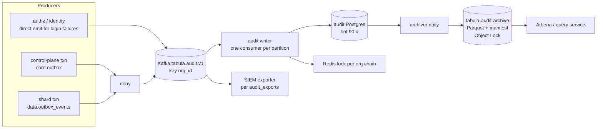
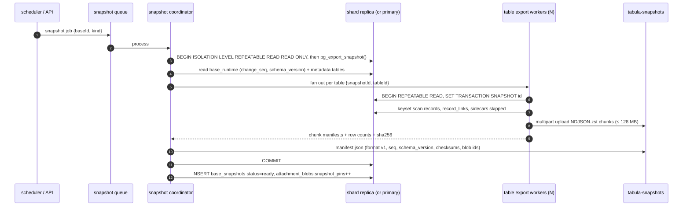
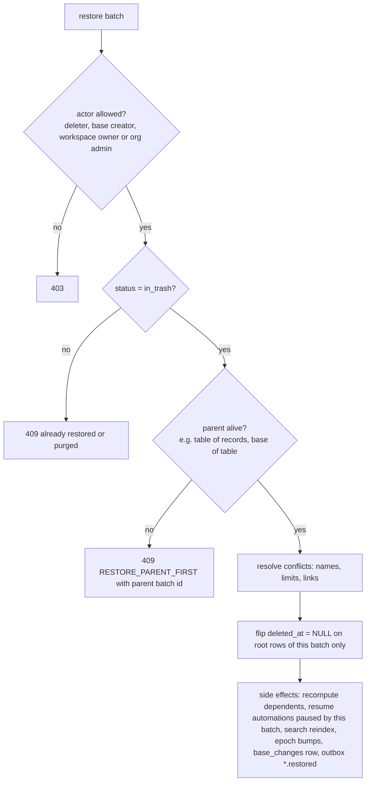

# 22 — Audit, Version History, Undo/Redo & Trash

> **Status:** Proposed · **Owner:** Platform Architecture · **Date:** 2026-10-03
> Conforms to [`00-canonical-decisions.md`](./00-canonical-decisions.md) — D10 (`base_changes`), D25 (undo via inverse ops), D26 (no event sourcing), §5.3 audit store, §6 History events, §11 buckets, §12 retention, §13 `TRASH_RETENTION`, `BASE_CHANGES_RETENTION`. Additions are listed under [Proposed additions](#proposed-additions).

**Sections covered**

* **§30 Audit log** (Part 26) — scope, `audit_events` schema, pipeline, redaction, storage tiers & retention, tamper evidence (hash chain + S3 Object Lock), SIEM export, query API.
* **§31 Version history** (Part 27) — the three logs, `record_revisions` (cell-level diffs), schema/view/interface/automation history, base snapshots (consistent logical export, restore as new base / in place), IDs, diffs, restore & rollback semantics, retention per plan.
* **§32 Undo/redo** (Part 28) — approaches compared, the D25 design (commands → `base_changes` with `inverse_ops`), conflict checks & partial undo, per-operation rules, redo, scope & limits.
* **§33 Trash & recovery** (Part 29) — `deletion_batches`, soft-delete columns, O(1) cascade via parent flags, links & references, trash UI per level, retention & purge pipeline, restore conflicts.

Related: [05 SQL schema](./05-sql-schema.md) · [06 Record storage](./06-record-storage.md) · [09 Linked records](./09-linked-record-engine.md) · [14 Automation engine](./14-automation-engine.md) · [15 Events](./15-events.md) · [16 Realtime](./16-realtime.md) · [18 Search/attachments/collaboration](./18-search-attachments-collaboration.md) · [19 Permissions & multi-tenancy](./19-permissions-and-multitenancy.md) · [23 Notifications/jobs/caching/performance](./23-notifications-jobs-caching-performance.md) · [25 Security/observability/infra](./25-security-observability-infrastructure.md)

---

## 0. Three logs, three purposes

The single most common confusion in this area is "which log is the history?". We keep **three** logs on purpose; each has one job and its own retention.

| | `data.base_changes` | `data.record_revisions` | `audit.audit_events` |
|---|---|---|---|
| Purpose | **Operational**: realtime fan-out & catch-up, webhook cursors, sync, **undo/redo** | **User-facing history**: "who changed this cell, from what to what", restore a cell/record version | **Compliance/security**: who did what to access, sharing, admin, exports; summarized data changes |
| Granularity | one row per command (transaction), ops on many records | one row per record per change (cell-level diffs) | one row per security-relevant action |
| Ordering | total per base (`seq`) | per record by time | per org (hash chain) |
| Contents | forward ops + inverse ops (full values) | `{slot, before, after}` diffs | actor, context, resource, action, **redacted** before/after |
| Retention | 30 days (`BASE_CHANGES_RETENTION`), daily partitions dropped | plan-based (14 d / 1 y / 3 y / configurable) | hot 90 d in Postgres; archive per plan up to 7 y |
| Store | shard Postgres | shard Postgres (monthly partitions) | audit Postgres + S3 Parquet (Object Lock) |
| Who reads | realtime, relay, webhook dispatcher, undo service | record activity panel, API `…/revisions` | org admins, SIEM, auditors |
| Mutable? | append-only, dropped by partition | append-only (+ coalescing of the latest row, §27.2.3), purged with record | append-only, tamper-evident |

`record_revisions` is **not** derived from `base_changes` asynchronously — it is written in the **same transaction** (as shown in [06 §write path](./06-record-storage.md)) so the history panel is read-your-writes consistent and survives the 30-day `base_changes` window. Audit events are emitted through the outbox in the same transaction and written asynchronously by the audit writer.

---

# Part 26 — Audit log (§30)

## 26.1 What is audited

| Category | Actions (examples; `action` values) | Source |
|---|---|---|
| Authentication | `auth.login_succeeded`, `auth.login_failed`, `auth.mfa_challenge_failed`, `session.revoked`, `auth.password_changed`, `mfa.enrolled`, `mfa.removed`, `sso.login` | identity module |
| Identity admin | `user.invited`, `user.deactivated`, `user.reactivated`, `member.role_changed`, `team.created`, `team.member_added`, `scim.sync_applied` | control plane |
| Org policy & config | `org.policy_changed` (with diff), `sso.connection_updated`, `domain.verified`, `ip_allowlist.updated`, `retention.updated` | control plane |
| Permissions | `grant.created`, `grant.changed`, `grant.removed`, `field.restrictions_changed`, `table.restrictions_changed`, `row_policy.changed`, `view.locked`, `interface.permissions_changed` | control plane + shards |
| Admin access | `admin.content_access_elevated`, `admin.content_access_ended`, `support.access_granted`, `support.access_used` (every request under support access), **content reads under elevation** (`data.read` sampled per resource per 5 min) | authz |
| Sharing | `share_link.created`, `share_link.revoked`, `share_link.password_changed`, `base.shared_externally`, `invitation.created` | shards/control |
| Data egress | `export.requested`, `export.downloaded`, `api_token.created`, `api_token.revoked`, `api_token.used_first_time`, `oauth.app_authorized`, `webhook_subscription.created`, `integration.connected`, `ai.data_sent` (summary: model, tables/fields, record count — not values) | various |
| Schema & structure | `base.created/deleted/restored/duplicated`, `table.*`, `field.*` (incl. type changes), `automation.published/disabled`, `snapshot.restored`, `trash.purged`, `workspace.moved` (shard) | shards |
| Record changes (summarized) | `records.bulk_changed` summaries (≥ 100 records in one command: table, op, count), `records.deleted` (count + batch id), record-level create/update/delete **only** for Enterprise "data change audit" option (field ids changed, not values) | shards |
| Billing | `subscription.changed`, `seats.changed` | billing |

Not audited (by design; lives in `record_revisions`/`base_changes`): individual cell edits on non-Enterprise plans, view UI state, presence.

## 26.2 `audit.audit_events` schema

```sql
CREATE TABLE audit.audit_events (
  id              uuid        NOT NULL,               -- = source event id (dedupe)
  org_id          uuid        NOT NULL,
  chain_date      date        NOT NULL,               -- UTC day of the hash chain
  chain_seq       bigint      NOT NULL,               -- position within (org_id, chain_date)
  occurred_at     timestamptz NOT NULL,               -- event time (producer)
  ingested_at     timestamptz NOT NULL DEFAULT now(),
  workspace_id    uuid,
  base_id         uuid,
  actor_type      text        NOT NULL CHECK (actor_type IN ('user','api_token','service_account','automation','integration','ai','system','public_form','support_staff','scim')),
  actor_id        text,                               -- uuid or system name
  actor_display   text,                               -- name/email snapshot at event time (email redactable on erasure)
  on_behalf_of    uuid,                               -- token owner / elevated admin user
  via             text        NOT NULL,               -- ui|api|automation|import|sync|form|script|undo|restore|admin_elevation|support|scim
  ip              inet,
  user_agent      text,                               -- truncated 512
  geo             jsonb,                              -- {country, region} from IP (no city)
  request_id      text,
  session_id      uuid,                               -- hashed session ref (not token)
  resource_type   text        NOT NULL,
  resource_id     text,
  resource_name   text,                               -- snapshot (e.g. base name)
  action          text        NOT NULL,
  outcome         text        NOT NULL DEFAULT 'success' CHECK (outcome IN ('success','denied','failure')),
  reason          text,                               -- e.g. elevation reason, failure code
  before          jsonb,                              -- redacted
  after           jsonb,                              -- redacted
  metadata        jsonb       NOT NULL DEFAULT '{}',
  prev_hash       bytea       NOT NULL,               -- 32 bytes
  hash            bytea       NOT NULL,               -- SHA-256(prev_hash || canonical(event))
  PRIMARY KEY (org_id, occurred_at, id)
) PARTITION BY RANGE (occurred_at);                    -- monthly partitions; hot 90 days
CREATE UNIQUE INDEX audit_events_chain_uq ON audit.audit_events (org_id, chain_date, chain_seq, occurred_at);
CREATE INDEX audit_events_actor_idx    ON audit.audit_events (org_id, actor_id, occurred_at DESC);
CREATE INDEX audit_events_resource_idx ON audit.audit_events (org_id, resource_type, resource_id, occurred_at DESC);
CREATE INDEX audit_events_action_idx   ON audit.audit_events (org_id, action, occurred_at DESC);
```

(Canonical DDL ownership: [05](./05-sql-schema.md); this is the normative column set.)

### 26.2.1 Redaction rules (applied by producers **and** re-checked by the writer)

| Data | Rule |
|---|---|
| Passwords, tokens, secrets, MFA seeds, private keys, webhook secrets | never present; schema-validated deny list of keys (`password`, `secret`, `token`, `key`, `credentials`…) → replaced with `"[REDACTED]"` |
| Cell values | **never** stored (field ids + counts only), except Enterprise opt-in `audit.recordValues = true` (then truncated to 256 chars/value, hidden-restricted fields always excluded) |
| Config diffs (policies, restrictions, automation config) | stored as RFC 6902 JSON Patch with secret paths redacted |
| Emails/IPs | stored (needed for security); on GDPR erasure of a user, `actor_display` replaced with `"Deleted user <hash8>"` — the hash chain covers a **canonical form that excludes `actor_display`, `user_agent`, `geo`** (mutable for privacy) so erasure doesn't break verification |
| Request bodies | never |

## 26.3 Pipeline



* Producers write audit-worthy events into their transactional outbox (exactly the event that changed state; no "audit but not committed" or vice versa). Login failures (no transaction) are emitted directly to Kafka with a local disk-backed buffer (pino transport) for resilience.
* MVP (no Kafka): relay dispatches to the `maintenance` BullMQ queue `audit-write` lane, same writer code.
* **Writer**: Kafka key `org_id` → all events of an org land in one partition → a single consumer appends to each org's chain in order. Batches ≤ 500 events / 200 ms. Idempotent by `id` (ON CONFLICT DO NOTHING; a duplicate never consumes a `chain_seq` because the writer checks existence before assigning).
* Lag SLO: p99 ≤ 60 s from commit to queryable.

## 26.4 Tamper evidence

### 26.4.1 Hash chain per org per day

```text
canonical(e) = JCS (RFC 8785) of {id, org_id, chain_date, chain_seq, occurred_at, workspace_id, base_id,
                                  actor_type, actor_id, on_behalf_of, via, ip, request_id, resource_type,
                                  resource_id, action, outcome, reason, before, after, metadata}
hash_0(org, day)  = SHA-256("tabula-audit-v1" || org_id || day || final_hash(org, day-1))
hash_n            = SHA-256(hash_{n-1} || canonical(e_n))
```

* Chaining across days (genesis includes the previous day's final hash) makes deletion of a whole day detectable.
* Daily **sealing** job (00:15 UTC per region): for each org with events that day → writes a manifest `{org_id, day, count, first_seq, last_seq, final_hash, parquet_object_keys[], parquet_sha256[]}` signed with a KMS asymmetric key (`ECC_NIST_P256`, `Sign`), to `tabula-audit-archive/{region}/manifests/{org_id}/{day}.json` with **S3 Object Lock** (compliance mode, retention = org's audit retention; governance mode for non-Enterprise).
* Event rows exported to Parquet: `tabula-audit-archive/{region}/events/org={org_id}/date={day}/part-*.parquet` (zstd), also Object-Locked.
* Verification tool (`tabula-audit verify --org --from --to`) recomputes the chain from Postgres or Parquet and checks manifest signatures; runs weekly on a 1% sample of orgs and on demand for customers (Enterprise "Verify audit log" button returns a signed report).

### 26.4.2 Threats covered

| Threat | Covered by |
|---|---|
| Row modified in Postgres by an insider | chain mismatch vs. sealed manifest |
| Rows deleted (middle of day) | `chain_seq` gap + hash mismatch |
| Whole day deleted | next day's genesis references the missing final hash; manifest exists in Object Lock |
| Archive overwritten | Object Lock compliance mode (even root cannot delete before retention) |
| Writer bug producing bad hashes | verification job alerts; chain resumes with a signed "chain repair" event referencing the break (never silent rewrite) |

## 26.5 Storage tiers & retention

| Tier | Store | Window | Query |
|---|---|---|---|
| Hot | audit Postgres (monthly partitions) | 90 days for all plans | API, admin UI (filters, ≤ 1 s) |
| Warm/cold | S3 Parquet (Object Lock) | per plan below | async query jobs via Athena (results to `tabula-exports`), SIEM backfill |

| Plan | Audit log UI/API | Archive retention |
|---|---|---|
| Free / Team | — (security events visible to owners: last 30 days of logins & sharing) | 90 days (internal security use) |
| Business | 90 days | 1 year |
| Enterprise | 90 days hot + archive search | default 1 year, configurable up to **7 years**; legal hold per org (blocks partition drops & archive expiry) |

Partition maintenance: drop monthly hot partitions older than 90 days **only after** the archiver confirmed Parquet + manifest for every day in the partition (checked by the scheduler).

## 26.6 SIEM export (`audit.audit_exports`)

| Column | Notes |
|---|---|
| `id`, `org_id` | |
| `kind` | `s3` (customer bucket, cross-account role with external ID) \| `splunk_hec` \| `datadog_logs` \| `sentinel` (Azure Monitor DCR) \| `https_webhook` (HMAC-signed) \| `elastic` |
| `config` | endpoint, envelope-encrypted credentials ([19 §21.4.3](./19-permissions-and-multitenancy.md)), filters (actions/categories) |
| `checkpoint` | last delivered `(chain_date, chain_seq)` |
| `status` | `active`, `paused`, `failing` (with `last_error`, `failing_since`) |

* Delivery: at-least-once from Kafka (consumer group per export kind; export rows filter per org); each payload includes `id` for downstream dedupe and `hash` for verification. Batching: ≤ 1 MB or 5 s.
* Backfill: from Postgres hot tier or Parquet for a date range.
* Failing > 24 h → admin email + in-app; events not lost (checkpoint holds; Kafka retention 7 days, then backfill from Parquet automatically).

## 26.7 Query API

```http
GET /v1/organizations/{orgId}/audit-events?from=2026-09-01T00:00:00Z&to=…&actorId=usr_…&action=grant.changed
    &resourceType=base&resourceId=bas_…&workspaceId=wsp_…&outcome=denied&pageSize=100&cursor=…
POST /v1/organizations/{orgId}/audit-events:export   { from, to, filters, format: "jsonl"|"csv"|"parquet" } → exp_… (long operation)
POST /v1/organizations/{orgId}/audit-events:verify   { from, to } → signed verification report (Enterprise)
```

* Requires `audit.read` (org owner/admin); every audit query is itself audited (`audit.queried` with filters).
* Hot range → Postgres keyset `(occurred_at DESC, id DESC)`; ranges older than 90 days → 202 with an export job (Athena).

---

# Part 27 — Version history (§31)

## 27.1 Identifiers

| Thing | ID | Notes |
|---|---|---|
| Base change | `chg_…` (`base_changes.id`) + `(base_id, seq)` | `seq` is what clients/webhooks see as a cursor |
| Record revision | `rev_…` (`record_revisions.id`) | references `change_seq` range |
| Schema revision | `srv_…` (Proposed `schema_revisions`) | field/table/view/link config diffs |
| Automation version | `atv_…` (`automation_versions`) | immutable published definitions |
| Interface version | `interface_versions.id` | immutable published snapshots |
| Base snapshot | `snp_…` (`base_snapshots`) | full logical export in S3 |

## 27.2 Record revisions

### 27.2.1 Shape

```sql
CREATE TABLE data.record_revisions (
  id               uuid        NOT NULL,           -- rev_ (UUIDv7)
  workspace_id     uuid        NOT NULL,
  base_id          uuid        NOT NULL,
  table_id         uuid        NOT NULL,
  record_id        uuid        NOT NULL,
  kind             text        NOT NULL CHECK (kind IN ('create','update','delete','restore','links')),
  first_seq        bigint      NOT NULL,           -- base change_seq of first command coalesced
  last_seq         bigint      NOT NULL,
  actor_type       text        NOT NULL,
  actor_id         text,
  via              text        NOT NULL,           -- ui|api|automation|import|sync|form|script|undo|restore
  diffs            jsonb       NOT NULL,           -- RevisionDiff[]
  created_at       timestamptz NOT NULL,
  updated_at       timestamptz NOT NULL,           -- coalescing extends it
  PRIMARY KEY (created_at, id)
) PARTITION BY RANGE (created_at);                  -- monthly
CREATE INDEX record_revisions_record_idx ON data.record_revisions (record_id, created_at DESC, id DESC);
CREATE INDEX record_revisions_base_idx   ON data.record_revisions (base_id, created_at DESC);
```

```ts
type RevisionDiff =
  | { slot: number; before?: Json; after?: Json }                           // scalar cells; absent = empty
  | { slot: number; added?: string[]; removed?: string[] }                  // link / multi_select / multi-collaborator / attachments (set semantics)
  | { slot: number; textPatch: string; keyframeBefore?: string; beforeLen: number; afterLen: number }
    // long_text > 4 KB: forward diff-match-patch patch; full `before` stored as keyframe every 10th revision of the cell
  ;
```

Long text: for values ≤ 4 KB we store full `before`/`after`. For larger values we store **both** a forward patch and the full `before` value only every 10th revision of that cell ("keyframe"), allowing reconstruction by walking from the nearest keyframe — caps storage for heavily edited documents (100 KB doc × 1,000 edits would otherwise be 200 MB).

### 27.2.2 What is (not) revisioned

* User-writable cells (incl. links, attachments by id) — yes.
* Computed fields (`formula/lookup/rollup/count/ai_generated`) — **no** (derivable; would multiply volume by fan-out).
* `create`: `kind = create`, `diffs` = initial non-empty values (so "restore to creation" works) — **except** bulk imports > 1,000 records per command, which store `diffs: []` + a pointer to the import job (import file is the source; saves 2× storage on large imports).
* `delete` / `restore`: no diffs (values unchanged; record row retains them).
* Field type conversion: no per-record revision ([06 §conversion](./06-record-storage.md)); one `schema_revisions` row; old slot retained until purge enables undo.

### 27.2.3 Coalescing

Typing produces many commands. Rule: if the latest revision of `(record_id)` has the same actor, same `via`, touches the same slot set **subset**, and `updated_at > now() − 60 s`, **merge** (keep first `before`, set new `after`, `last_seq = current seq`) via `UPDATE … WHERE id = $lastRevId` instead of insert. Reduces rows ~5–10× for UI edits. Undo is unaffected (it uses `base_changes`, not revisions).

### 27.2.4 Write path

Inside the record write transaction (after the cells UPDATE and seq allocation): one multi-row `INSERT … ON CONFLICT DO NOTHING` (or coalescing UPDATE) per command. Batch commands (≤ 1,000 records) insert via `unnest` arrays: ~0.3 ms per 100 rows.

### 27.2.5 Restore a revision

* **Restore cell(s)**: "Restore this value" → a normal record update with `via = restore`, values = the revision's `before` (or `after` for "restore to this version") for the selected slots. New revision + `base_changes` row; undoable.
* **Restore record to point in time T**: compute for each slot the value at T by walking revisions backwards from now to T (apply `before` of each diff); write as one update (`via = restore`). Slots whose fields were deleted are skipped; attachment ids already purged become tombstones ([18 §18.8](./18-search-attachments-collaboration.md)); link targets in trash/purged are dropped with a warning list.
* Permissions: `record.update` on every affected slot; hidden slots excluded from both view and restore.

## 27.3 Schema, view, interface & automation history

| Object | Mechanism | Retention | Restore |
|---|---|---|---|
| Tables/fields/link relations | `schema_revisions` row per schema command: `{entity_type, entity_id, op, before, after (config JSON), actor, seq}` | same as record revisions per plan | "Revert field config" = apply `before` as a new schema command (with validation; e.g. removing a select option that is in use → options restored, cells untouched since option ids are stable) |
| Views | `schema_revisions` for collaborative/locked views (config diff as JSON Patch); personal views not revisioned | 90 days (all plans) | revert config |
| Interfaces | `interface_versions` (immutable publish snapshots) + draft autosave in `interface_pages.layout` (no history) | all published versions kept (max 200; oldest pruned except pinned) | "Restore version" copies into draft, then publish |
| Automations | `automation_versions` (immutable per publish) + run history (`automation_runs`) | versions: all (max 200); runs: plan-based (30–365 days) | "Revert to version" → new draft from version |
| Comments | edits not versioned (audit event holds previous body if policy enabled) | — | — |

## 27.4 Base snapshots

### 27.4.1 Kinds

| Kind | Trigger | Retention |
|---|---|---|
| `manual` | user action (creator) | until deleted; max 50 per base |
| `daily` | scheduler, Business+ (bases changed in last 24 h) | Business 30 d, Enterprise 90 d (configurable) |
| `pre_restore` | automatic before an in-place restore | 30 d |
| `pre_destructive` | before table delete > 50k records, before bulk delete > 10k records, before field type conversion on > 100k records | 30 d |
| `template` / `duplicate` | template publishing, cross-region moves | owned by the template/job |

### 27.4.2 Consistent export



* All workers share the coordinator's exported snapshot (`SET TRANSACTION SNAPSHOT`) → one consistent point in time across tables, without locking writers. On replicas, `pg_export_snapshot()` works (hot standby) — preferred to keep load off the primary; `hot_standby_feedback = on` for the duration (prevents query cancellation; monitor bloat for long snapshots, cap 2 h, else retry on primary off-peak).
* Contents: `bases`, `tables`, `fields`, `field_dependencies`, `link_relations`, `records` (cells + computed + cell_meta + row_number + manual_order + soft-delete state), `record_links`, `views`, `view_sections`, `interfaces` + latest `interface_versions`, `automations` + `automation_versions` (definitions only), `comments` + `comment_reactions` + `mentions`, `attachments` (metadata; blobs referenced not copied), `share_links` (metadata, tokens **not** included), `record_rich_docs`. Not included: runs, revisions, base_changes, idempotency keys, secrets & integration credentials (references only — restore requires reconnecting), `search_documents` (rebuilt), sidecars (rebuilt).
* Format: NDJSON + zstd per table chunk; manifest JSON with `formatVersion`, `appVersion`, `schemaVersion`, `changeSeq`, per-file sha256 & row counts. S3 SSE-KMS (org key for BYOK); bucket versioned (spine §11).
* Attachments: snapshot **pins** blobs (`attachment_blobs.snapshot_pins++`), decremented when the snapshot expires; pinned bytes appear as "snapshot storage" in usage.
* Throughput: ~50k records/s per worker (NDJSON serialization); 2M-record base ≈ 1–2 min with 4 workers; size ≈ 0.4 × logical JSON size after zstd.

### 27.4.3 Restore

| Mode | Behavior | When |
|---|---|---|
| **As new base** (default) | creates a new base in a chosen workspace; **IDs remapped** (base, tables, fields, views, records, interfaces, automations, comments, attachments get new UUIDv7s because primary keys must be unique on the shard; select option ids are kept as-is since they are scoped by field config; field slots are kept, so `cells` JSONB is copied verbatim), a deterministic mapping table in a temp table drives link/record-reference rewriting (`record_links`, mention tokens `@[rec_…]`, view configs referencing field ids, formula ASTs (stored by field id), automation definitions); share links not restored; automations restored **paused** | safe default; external integrations unaffected |
| **In place** (creator, confirmation, Business+) | 1) `pre_restore` snapshot; 2) base enters `maintenance` (writes 503, realtime `base_reset` pending); 3) automations paused; 4) diff by id: rows existing now but not in snapshot → soft-deleted into one `deletion_batches` row (recoverable!), rows in snapshot → upserted with snapshot values (ids preserved), rows missing now but in snapshot → re-inserted (if purged) or un-deleted; 5) `schema_version++`, `perm_epoch++`, `change_seq` jumps (one `base_changes` row `kind = schema`, op `base.reset`); 6) search reindex of base, compute full recalculation; 7) maintenance off, `snapshot.restored` event, webhooks receive `base.reset` (cursor consumers must resync), clients reload | "roll back my base to yesterday" |

In-place restore of 2M records ≈ 5–15 min (batched 5k-row upserts); progress via `long_operations`.

## 27.5 Retention of history per plan

| Plan (spine §12) | `record_revisions` | `schema_revisions` | Snapshots | Undo window |
|---|---|---|---|---|
| Free | 14 days | 14 days | manual 2 | 30 days (base_changes) |
| Team | 1 year | 1 year | manual 10 | 30 days |
| Business | 3 years | 3 years | manual 50 + daily 30 d | 30 days |
| Enterprise | configurable (≥ 3 y default) | same | + daily 90 d (configurable) | 30 days |

Physical retention is complicated by shared monthly partitions across plans: partitions are **dropped** at the maximum retention across all tenants on the shard (Enterprise configurable maximum, e.g. 7 years) — dedicated shards set their own; shorter plan retention is enforced by (a) the read path (`created_at ≥ now() − plan retention`, so older history is invisible immediately on downgrade), and (b) a nightly **revision purge** job deleting expired rows per workspace in 5k-row batches (`DELETE … WHERE ctid = ANY(…)`), throttled. Upgrades within the physical window "recover" history that had not yet been purged — documented as best effort.

---

# Part 28 — Undo / redo (§32)

## 28.1 Requirements

[Observed] Spreadsheet-database products offer Ctrl-Z/Ctrl-Shift-Z for cell edits, record create/delete, field operations and view changes, scoped to the user's own actions, working in a multi-user base where others edit concurrently.

* Undo **my** last action in **this base**, even if others edited other cells since.
* Never silently overwrite someone else's later edit.
* Works for UI, survives a page reload within the tab session (best effort), and is consistent across clients (undo is a server operation visible to all).
* Bounded storage and time window.

## 28.2 Approaches compared

| Approach | How | Pros | Cons | Verdict |
|---|---|---|---|---|
| A. Client-side command pattern (client stores inverse, replays as normal writes) | client computes inverse from its local state | simple server | client state may be stale (wrong `before` under concurrency), lost on reload, can't undo server-side effects (cascades, computed), API clients can't use it | ❌ alone |
| B. Event sourcing (rebuild state minus event) | state = fold(events) | perfect history | contradicts D26; undoing an event in the middle requires replay of everything after; cost & complexity | ❌ |
| C. Revision log (`record_revisions`) as undo source | apply `before` from revision | already exists | revisions are per record, coalesced (60 s merges ≠ user actions), don't cover schema/view ops, no grouping per command | ❌ |
| D. **Server command log with inverse ops** (`base_changes.inverse_ops`) + client stack of change ids | server records exact inverse at commit time from authoritative state | correct `before` values; per-command grouping; conflict detection via `cell_meta.seq`; works for API too; same log already used for realtime | inverse ops stored for 30 days (~0.4 KB/change, acceptable) | ✅ **D25** |
| E. Long-running server transactions / savepoints | keep txn open until "commit" | trivial undo before commit | impossible for collaborative, long-lived sessions | ❌ |

## 28.3 Design (D25)

### 28.3.1 Command → change

Every user action is one **command** executed in one transaction producing exactly **one** `base_changes` row (`kind`, `ops`, `inverse_ops`), see [15 §5](./15-events.md). Multi-record actions (paste 500 cells, delete 30 records, fill-down) are one command → one change → one undo step.

```ts
// @tabula/changes
type ChangeOp =
  | { op: 'cell.set'; tableId: string; recordId: string; slot: number; value?: Json; expectSeq?: number }
  | { op: 'set.add' | 'set.remove'; tableId: string; recordId: string; slot: number; items: string[] }   // multi_select, collaborators, attachments
  | { op: 'link.add' | 'link.remove'; relationId: string; a: string; b: string; aOrder?: string; bOrder?: string }
  | { op: 'record.create'; tableId: string; recordId: string; cells: Record<string, Json>; order: string }
  | { op: 'record.delete'; tableId: string; recordIds: string[]; deletionBatchId: string }
  | { op: 'record.restore'; tableId: string; deletionBatchId: string; recordIds?: string[] }
  | { op: 'record.move'; tableId: string; recordId: string; from: string; to: string }               // manual order keys
  | { op: 'field.create' | 'field.delete' | 'field.restore'; tableId: string; fieldId: string; deletionBatchId?: string }
  | { op: 'field.update'; fieldId: string; patch: JsonPatch; inversePatch?: JsonPatch }
  | { op: 'field.repoint_slot'; fieldId: string; fromSlot: number; toSlot: number; fromType: string; toType: string; fromConfig: Json; toConfig: Json }
  | { op: 'field.move'; viewId?: string; fieldId: string; from: string; to: string }
  | { op: 'view.update'; viewId: string; patch: JsonPatch; baseVersion: number }
  | { op: 'table.create' | 'table.delete' | 'table.restore'; tableId: string; deletionBatchId?: string };

interface InverseEnvelope {
  undoable: boolean;                    // false if inverse too large or op inherently irreversible
  reason?: 'too_large' | 'irreversible' | 'external_side_effect';
  ops: ChangeOp[];                      // inverse ops in application order (reverse of forward)
  guards: UndoGuard[];                  // what must still hold for a clean undo
}
type UndoGuard =
  | { kind: 'cell_seq'; tableId: string; recordId: string; slot: number; seq: number }   // cell_meta[slot].seq == seq
  | { kind: 'record_exists'; tableId: string; recordId: string }
  | { kind: 'view_version'; viewId: string; version: number }
  | { kind: 'field_exists'; fieldId: string }
  | { kind: 'batch_in_trash'; deletionBatchId: string };
```

`inverse_ops` column stores the `InverseEnvelope`. It is computed **inside the write transaction** from the pre-images the write path already reads (`cells` before update, `cell_meta`, link rows), so it is authoritative.

### 28.3.2 Client stack

* Per (user, base, browser tab): `undoStack: changeId[]`, `redoStack: changeId[]`, max **100** entries, stored in memory + `sessionStorage` (survives reload in the same tab).
* Only changes **initiated by this client** (matched via `client_mutation_id` in the ack) are pushed. Changes by automations triggered by my change are **not** part of my undo (they are separate changes with their own causation; see §28.6).
* New user action clears `redoStack`.

### 28.3.3 Undo algorithm (server)

```http
POST /v1/bases/{baseId}/changes/{changeId}:undo     { "mode": "partial" | "strict" }   → 200 UndoResult | 409
POST /v1/bases/{baseId}/changes/{changeId}:redo
```

```ts
async function undo(ctx: Ctx, baseId: string, changeId: string, mode: 'partial'|'strict'): Promise<UndoResult> {
  const ch = await changes.get(baseId, changeId);                 // within 30-day retention, else 410 UNDO_EXPIRED
  if (!ch) throw problem(410, 'UNDO_EXPIRED');
  if (ch.actor_id !== ctx.principal.userId) throw problem(403, 'UNDO_NOT_OWN_CHANGE');
  if (ch.undone_by) throw problem(409, 'ALREADY_UNDONE');
  const inv = ch.inverse_ops as InverseEnvelope;
  if (!inv.undoable) throw problem(422, 'UNDO_NOT_SUPPORTED', { reason: inv.reason });

  return db.withBaseWriteTx(baseId, async tx => {                // same path as any write: authz, seq lock, outbox
    const snap = await authz.snapshotForWrite(tx, ctx, baseId);  // permissions re-checked NOW (may have changed)
    const { applicable, conflicts } = await evaluateGuards(tx, inv.guards, snap);
    if (conflicts.length && (mode === 'strict' || applicable.length === 0))
      throw problem(409, 'UNDO_CONFLICT', { conflicts });
    const ops = filterOpsByGuards(inv.ops, conflicts);          // drop ops whose guard failed
    const result = await applyOps(tx, ops, { via: 'undo', causedBy: ch.id });   // produces a NEW base_change
    await changes.markUndone(tx, baseId, ch.seq, result.change.id);
    await outbox.emit(tx, 'change.undone', { changeId: ch.id, undoChangeId: result.change.id, skipped: conflicts.length });
    return { undoChangeId: result.change.id, applied: ops.length, skipped: conflicts };
  });
}
```

* Undo is a **new forward change** (`via = 'undo'`) with its own `seq` — realtime, webhooks, automations, revisions all see it as a normal change. Nothing is "erased" from history.
* `base_changes` gets `undone_by_change_id` (Proposed addition) so the stack UI can show state and redo knows what to reapply.
* Redo = apply the **original forward ops** with fresh guards: guards are the seqs written by the undo change (`cell_meta[slot].seq == undoChange.seq`). Implemented as `undo(undoChange)` since the undo change carries its own inverse (= original values). `change.redone` emitted.

### 28.3.4 Conflict rules (partial undo)

| Situation | Rule |
|---|---|
| Cell edited by **someone else** since my change (`cell_meta[slot].seq ≠ change.seq`) | skip that cell; report `{recordId, fieldId, by, at}`; UI toast "Undid 47 of 50 cells — 3 were changed by Alice since" |
| Cell edited by **me** later (another of my changes) | also skip (only the latest change of a cell is cleanly undoable — the user is expected to undo in stack order; the stack enforces order so this only occurs for API callers) |
| Record deleted since (by anyone) | skip ops on it (`record_exists` guard) |
| Field deleted since | skip ops on that slot |
| Permissions lost (field now read-only/hidden for me, row policy) | skip and report as `forbidden` |
| Link add to undo, link already removed by someone | idempotent: set ops (`set.remove`, `link.remove`) of absent items are no-ops, no conflict |
| `mode = strict` (API option) | any conflict → 409, nothing applied |

Set-semantics ops (multi-select, collaborators, links, attachments) undo with **add/remove of the specific items** (not overwrite of the whole array) → they commute with concurrent changes and rarely conflict.

## 28.4 Per-operation undo semantics

| Action | Forward | Inverse | Notes |
|---|---|---|---|
| Edit cell(s) / paste / fill | `cell.set` (with expectSeq) | `cell.set` previous value (absent = clear) | guard per cell |
| Toggle multi-select option / add collaborator | `set.add` | `set.remove` same items | commutative |
| Create record(s) | `record.create` | `record.delete` (soft, new deletion batch) | guard: if record edited by others since → still delete? **Rule:** partial-mode deletes anyway but reports "record had edits by Bob" and the deletion is restorable from trash; strict → 409 |
| Delete record(s) | `record.delete` + deletion batch | `record.restore` of that batch | guard `batch_in_trash`; if already restored/purged → skip |
| Reorder record (manual sort) | `record.move` | `record.move` back | fractional keys — if neighbors changed, inverse key is still valid (any key works) |
| Link/unlink | `link.add/remove` | opposite | |
| Create field | `field.create` | `field.delete` (soft; slot never reused) | data typed into the new field by others since → kept in trash with the field |
| Delete field | `field.delete` (soft) | `field.restore` | cheap (parent flag, §29.3) |
| Rename field / change config (options, formatting) | `field.update` JSON Patch | inverse JSON Patch | guard: field `config_version` unchanged; otherwise 3-way merge of patches when paths disjoint |
| Change field type | `field.repoint_slot` (new slot, [06](./06-record-storage.md)) | repoint back to old slot + old type/config | O(1); available while old slot retained (until purge after `TRASH_RETENTION`); edits made in the new type are discarded by undo (warned) |
| Move field (order in view/table) | `field.move` | `field.move` back | |
| Change view config (filter/sort/group/hide/width) | `view.update` JSON Patch | inverse patch | guard `view_version`; disjoint paths merge |
| Create/delete table | `table.create` / `table.delete` (soft) | `table.delete` / `table.restore` | |
| Create/delete view | similar (soft delete) | | |
| Bulk ops > 10,000 records | — | `undoable = false (too_large)` | UI: "This can't be undone; restore from trash or snapshot" (pre-destructive snapshot exists for huge deletes) |
| Automation/webhook/email side effects | — | irreversible (`external_side_effect`) | undo of the record change doesn't recall emails |
| Import | treated as one change; undo = delete created records (if ≤ 10k) | | otherwise "Delete imported records" action via import job |

## 28.5 Limits

| Limit | Value |
|---|---|
| Undo window | `BASE_CHANGES_RETENTION` = 30 days (but UI stack is per tab session) |
| Stack depth | 100 per (user, base, tab) |
| Max records per undoable change | 10,000 |
| Max `inverse_ops` size | 5 MB compressed (larger → `undoable = false`) |
| Who can undo | the original actor only (user, or the same API token / service account) |
| Concurrent undo of the same change | `markUndone` uses `UPDATE … WHERE undone_by_change_id IS NULL` → second gets 409 `ALREADY_UNDONE` |

## 28.6 Interactions

* **Automations:** an undo change is an ordinary change (`via = undo`) and may trigger automations (e.g., "when record updated"). Automations can opt out of `via ∈ {undo, restore}` in trigger config (default: trigger on undo — users expect consistency; restore from snapshot never triggers). Causation depth applies ([14](./14-automation-engine.md)).
* **Computed fields:** recomputed normally after undo (same compute path).
* **Realtime:** clients receive the undo change like any other; the initiating client reconciles its optimistic state by `client_mutation_id`.
* **Webhooks/sync:** see ordinary changes; no special "undo" semantics required by consumers.
* **History:** `record_revisions` rows with `via = undo`.

---

# Part 29 — Trash & recovery (§33)

## 29.1 Soft-delete columns

Every soft-deletable entity carries (spine convention, [05](./05-sql-schema.md)): `deleted_at timestamptz`, `deleted_by uuid`, `deletion_batch_id uuid`. Entities: `bases`, `tables`, `fields`, `views`, `view_sections`, `records`, `interfaces`, `interface_pages`, `automations`, `share_links` (revoked rather than deleted), plus control-plane `workspaces` (and `workspace_directory.status`, `base_directory.deleted_at` for routing/listing).

## 29.2 `data.deletion_batches`

One row per **user delete action** = one trash entry = one restore unit.

| Column | Type | Notes |
|---|---|---|
| `id` | uuid | |
| `workspace_id`, `base_id` | uuid | `base_id` NULL for workspace-level batches (stored on the shard of the workspace) |
| `kind` | text | `records` \| `table` \| `field` \| `view` \| `base` \| `interface` \| `automation` \| `workspace` |
| `root_type`, `root_id` | text, uuid | the deleted object (for `records`: table id) |
| `item_count` | int | e.g. records deleted |
| `summary` | jsonb | display info: names, primary values of first 10 records, table name — **snapshotted** for the trash UI (permission-filtered at read) |
| `deleted_by`, `deleted_via` | uuid, text | ui/api/automation/import/restore |
| `change_seq` | bigint | `base_changes.seq` of the delete (undo link) |
| `deleted_at` | timestamptz | |
| `purge_after` | timestamptz | `deleted_at + TRASH_RETENTION` (plan/org policy; Enterprise up to 180 d) |
| `status` | text | `in_trash` \| `restored` \| `purging` \| `purged` |
| `restored_at`, `restored_by`, `purged_at` | | |
| `legal_hold` | bool | blocks purge (Enterprise) |

Indexes: `(base_id, status, deleted_at DESC)` (trash UI), `(purge_after) WHERE status = 'in_trash' AND NOT legal_hold`.

## 29.3 Cascading soft delete — O(1) via parent flags

### 29.3.1 Options

| Option | Delete cost | Restore cost | Query cost | Risk |
|---|---|---|---|---|
| Mark every descendant (`UPDATE records SET deleted_at … WHERE table_id = $t`) | O(n) rows — 2M-record table = minutes of writes, WAL, bloat, index churn | O(n), and must distinguish "deleted with the table" from "deleted earlier individually" | descendant queries filter own column | long txns, replication lag |
| **Mark only the root; children implicitly hidden** | **O(1)** (one row + small fixed set, §29.3.2) | **O(1)**: flip the root row | every access path must check ancestors | must enforce ancestor checks centrally |

**Decision: parent flag.** Ancestor checks are already centralized: all record access goes through the schema snapshot (which **omits deleted tables/fields/views**) and base routing (which omits deleted bases/workspaces). A query for a deleted table can't be compiled because the table isn't in the snapshot; a deleted base isn't routable for normal principals. So the "ancestor check" costs nothing at query time.

Children deleted *individually earlier* keep their own `deleted_at`/`deletion_batch_id` (different batch) → restoring the parent doesn't resurrect them (correct semantics).

### 29.3.2 What each delete touches

| Delete | Rows written synchronously | Implicit (not written) | Side effects |
|---|---|---|---|
| Records (n ≤ 10k per command; larger chunked as one batch via long op) | each record `deleted_at`, batch row | their links, comments, attachments (hidden via record) | link counts on other side recomputed (compute queue), rollups/lookups referencing them recomputed excluding deleted records; search docs flagged |
| Field | field row | cells stay in JSONB (slot never reused) | dependent formulas → error state `#DELETED_FIELD` (field_dependencies); view configs referencing the field keep references but ignore them (filter conditions on deleted fields are **disabled**, not dropped, so restore re-enables); link field delete → **inverse link field in other table also soft-deleted in the same batch** (both sides of a `link_relation`) |
| View | view row | — | interfaces/elements bound to it show "source view deleted" |
| Table | table row + every **link field in other tables pointing into it** (same batch, typically < 10 rows) | all records, views, fields of the table | automations with triggers on the table → **paused** with reason `source_deleted` (recorded in batch summary so restore can resume them); interface elements bound to it → placeholder; search `update_by_query` |
| Interface / automation | root row | pages/versions | automation unscheduled (`automation_schedules` disabled), runs stop |
| Base | `bases` row + `base_directory.deleted_at` (control plane, via outbox) | everything inside | `perm_epoch++` → base disappears from AccessibleBaseSet, realtime sessions receive `base_deleted`; share links stop resolving; automations paused; webhooks paused; billing usage excludes it after purge only |
| Workspace | `workspaces.deleted_at`, `workspace_directory.status = deleted` | all bases | same as base for each base (lazy: routing check rejects) |

### 29.3.3 Restore



Restore is a normal command (`base_changes` row with `via = restore`) → undoable (undo = delete again).

## 29.4 Links, references & dependents on delete/restore

| Reference | On delete | On restore |
|---|---|---|
| Records linked from other tables (record delete) | `record_links` rows retained; readers exclude deleted targets (join on `records.deleted_at IS NULL`); link cell counts & rollups recomputed | links reappear; recompute |
| Link field (field delete) | inverse field soft-deleted in same batch; `record_links` retained | both sides restored together |
| Table with incoming links | incoming link fields soft-deleted (same batch) | restored together |
| Formulas/lookups/rollups depending on deleted field | marked invalid (`#DELETED_FIELD`), values cleared from `computed` lazily | re-validated & full recompute of dependents enqueued |
| Automations referencing field/table | trigger on deleted table → paused (`source_deleted`); steps referencing deleted field fail at runtime with clear error (`FIELD_DELETED`) and run marked failed; UI warns at delete time listing dependents | paused-by-delete automations resumed (only those paused by this batch); others untouched |
| Interfaces | elements show placeholders | work again |
| Views filtering on deleted field | condition disabled (flag `disabledReason: field_deleted`) | condition re-enabled |
| Comments anchored to deleted field | shown record-level | anchor works again |
| Mentions of deleted records | "Unavailable record" | resolve again |
| Webhook subscriptions scoped to deleted table | paused | resumed |
| Search | docs flagged/hidden | reindexed |

## 29.5 Trash UI per level

| Level | Where | Shows | Who can restore |
|---|---|---|---|
| Records | table menu → "Deleted records" (and base trash) | batches with count, deleter, time, sample primary values (permission-filtered: if user can't read the table, hidden) | deleter, base creators |
| Fields, views, tables | base → Trash | batch entries by kind | base creators |
| Interfaces, automations | base → Trash | | base creators (interfaces: interface editors) |
| Bases | workspace → Trash | | workspace owners/creators, base creators of that base, org admins |
| Workspaces | org admin → Trash; workspace owners via home | | workspace owners, org admins |

API: `GET /v1/bases/{baseId}/trash?kind=…`, `POST /v1/bases/{baseId}/trash/{batchId}:restore`, `DELETE /v1/bases/{baseId}/trash/{batchId}` (permanent delete now — creators only, MFA step-up for base/workspace kinds, audited), workspace & org equivalents.

## 29.6 Retention & purge

### 29.6.1 Scheduling

* `TRASH_RETENTION` default 30 days for all kinds; Enterprise configurable up to 180 days (org policy), legal hold blocks purge.
* Scheduler (every 10 min, leader): `SELECT id FROM deletion_batches WHERE status='in_trash' AND purge_after < now() AND NOT legal_hold LIMIT 500 FOR UPDATE SKIP LOCKED` → `status = 'purging'` → enqueue `purge` jobs (jobId = batchId). The reconciler re-enqueues batches stuck in `purging` > 1 h.

### 29.6.2 Purge job (hard delete in batches)

Order matters (children before parents; no FKs on hot tables, so order is for crash-consistency of the "what's left" query):

```text
purge(batch):
  ids-source = batch.kind:
     records → records WHERE deletion_batch_id = batch.id
     table   → all records of table; then fields, views, view_sections, link relations touching table
     field   → field row (+ strip slot from cells lazily, see below)
     base    → every table of base (as table purge) + interfaces, automations (+ versions, runs per retention rules), comments, share_links, webhooks, secrets, connections, snapshots (if policy), sidecars, search docs, record_revisions, base_changes rows (partition-local delete)
  loop in chunks of 1,000 records, each its own short txn (≤ 200 ms), throttled to 5k records/s per shard:
     DELETE record_links (both sides), record_index_*, record_rich_docs, comments(+reactions, mentions),
            record_subscriptions, computed_stale, record_revisions (by record ids, all partitions), records
     attachments of those records → detached (purge_after = now() → GC pipeline 18 §18.8)
  search: delete docs by id / delete_by_query (table/base)
  status = 'purged', purged_at; outbox trash.purged {batchId, kind, counts}; audit event
```

* Field purge: the field row is hard-deleted; cell data under its slot is removed **lazily**: the slot is added to `tables.purged_slots` (Proposed addition) and the background "slot sweeper" (maintenance queue, low priority) runs `UPDATE records SET cells = cells - '<slot>', cell_meta = cell_meta - '<slot>' WHERE table_id = $t AND cells ? '<slot>'` in 5k-row chunks. Slots are never reused, so stale keys can't be misread meanwhile (the schema has no field for that slot → projection ignores it).
* Record revisions of purged records are deleted (GDPR: deleted data must not survive in history). Base snapshots that contain purged data remain until their own expiry (documented; snapshots are covered by the DPA's retention schedule; an erasure request can force deletion of snapshots).
* Base purge also removes `base_directory` row (control plane via outbox), usage counters adjusted, S3 prefix `{workspaceId}/{baseId}/` blobs handled by blob GC (dedupe-aware: blobs referenced by other bases of the workspace survive).
* Workspace purge: purge each base, then workspace rows & directory; S3 Batch Operations for remaining prefix objects; OpenSearch `delete_by_query` on `workspaceId`.

### 29.6.3 GDPR erasure fast path

Org admin "Delete permanently now" (or DSAR tooling): sets `purge_after = now()` and priority = high; completes within 24 h for ≤ 10M records (SLO), including search and attachment bytes; backups age out within 35 days (documented).

## 29.7 Restore conflicts

| Conflict | Resolution |
|---|---|
| **Name collision** (table/field/view/interface/automation names unique within parent, case-insensitive) | auto-rename `"<name> (restored)"`, then `"(restored 2)"`…; reported in response |
| **Field slot reuse** | impossible by construction (slots monotonically allocated, never reused) → restored field's cells are exactly where they were |
| **Primary field changed** while a field was deleted (the deleted one used to be primary) | restored field becomes a normal field; primary stays as current |
| **Inverse link side purged** (other table purged meanwhile) | the target records no longer exist, so the link cannot be rebuilt: the field is restored as a link field with `brokenRelation = true` (cells empty — its `record_links` rows were purged with the target); the creator may convert it to text or delete it; listed in response warnings |
| **Plan limits** (records/base, tables/base, fields/table) exceeded by restore | restore blocked with `PLAN_LIMIT_EXCEEDED` (records: partial restore allowed up to limit only via API with explicit `allowPartial`) |
| **Record restored into table whose fields were deleted since** | values under deleted slots invisible but retained; if those fields are restored later, values reappear |
| **Select option deleted since** (record restored with option id no longer in config) | cell keeps option id; renderer shows "Deleted option"; the next config save offers re-adding missing options found in data (option ids are stable) |
| **Unique-ish constraints** (none at DB level for user data) | n/a |
| **Automation restored whose trigger table is deleted** | stays paused (`source_deleted`) |
| **Base restored into a workspace now on another plan / over seat limits** | base restored read-only until resolved |
| **Workspace restored after its shard was decommissioned** | not possible: shards with in-trash workspaces are not decommissioned (shard drain waits for purge or moves trash too) |

---

## Proposed additions

| Kind | Name | Purpose |
|---|---|---|
| Table (`data`) | `schema_revisions` (`id, workspace_id, base_id, table_id, entity_type ∈ {table, field, link_relation, view}, entity_id, op, before jsonb, after jsonb, patch jsonb, change_seq, actor_type, actor_id, via, created_at`), monthly partitions | §27.3 schema/view history beyond the 30-day `base_changes` window; base activity feed (18 §19.5.2) |
| Columns | `base_changes.undone_by_change_id uuid`, `base_changes.undo_of_change_id uuid` | §28.3 undo/redo state & idempotency |
| Columns | `record_revisions.first_seq`, `last_seq`, `updated_at` (coalescing) | §27.2.3 |
| Column | `tables.purged_slots smallint[]` | §29.6.2 lazy slot sweep |
| Columns | `deletion_batches.summary`, `deleted_via`, `change_seq`, `status`, `legal_hold`, `restored_*`, `purged_at` | §29.2 (reconcile with 05) |
| Columns | `attachment_blobs.snapshot_pins` | §27.4.2 (see 18 Proposed additions) |
| Columns | `audit_events.chain_date`, `chain_seq`, `prev_hash`, `hash`, `on_behalf_of`, `outcome`, `geo` | §26.2 |
| Columns | `audit_exports.kind`, `config`, `checkpoint`, `status`, `last_error` | §26.6 |
| Field config | `views.config.filters[].disabledReason` | §29.4 |
| Events | `audit.queried`, `admin.content_access_elevated/ended`, `support.access_used` (audit actions, not domain events) | §26.1 |
| KMS key | asymmetric signing key per region for audit manifests | §26.4 |
| Snapshot kind values | `manual, daily, pre_restore, pre_destructive, template, duplicate` on `base_snapshots.kind` | §27.4.1 |
