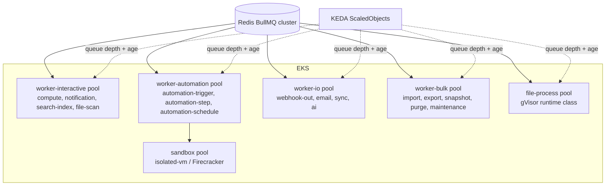

# 23 — Notifications, Background Jobs, Caching & Performance

> **Status:** Proposed · **Owner:** Platform Architecture · **Date:** 2026-10-03
> Conforms to [`00-canonical-decisions.md`](./00-canonical-decisions.md) — D6, D7, D9, D11, D12, D13, §7 queues, §10 Redis namespaces, §12 limits, §13 constants. Additions are under [Proposed additions](#proposed-additions).

**Sections covered**

* **§34 Notifications** (Part 30) — pipeline (event → router → preferences → channel → delivery), categories, in-app, email (batching/digests, templates, providers, bounces, one-click unsubscribe), push (later), dedupe/coalescing, preferences model.
* **§35 Background jobs** (Part 31) — technology comparison, justification of D12, migration triggers to Temporal/SQS, queue catalogue, per-tenant fairness, worker architecture & autoscaling, graceful shutdown, poison jobs, reconciler.
* **§36 Caching** (Part 32) — layers, what to cache / not cache and why, invalidation, stampede protection.
* **§37 Performance & capacity** (Part 33) — targets at 10M+ records / 100K bases / 1M users, indexes, partitioning, keyset pagination, grid query plans, summary aggregates, replicas with seq watermark, connection management, hot-base write ceiling, large-table grid loading, latency budgets, capacity math.

Related: [05 SQL schema](./05-sql-schema.md) · [06 Record storage](./06-record-storage.md) · [10 View engine](./10-view-engine.md) · [14 Automation engine](./14-automation-engine.md) · [15 Events](./15-events.md) · [16 Realtime](./16-realtime.md) · [18 Search/attachments/collaboration](./18-search-attachments-collaboration.md) · [19 Permissions & multi-tenancy](./19-permissions-and-multitenancy.md) · [22 Audit/history/undo/trash](./22-audit-history-undo-trash.md) · [25 Security/observability/infra](./25-security-observability-infrastructure.md)

---

# Part 30 — Notifications (§34)

## 30.1 Pipeline

```mermaid
flowchart LR
  EV[(domain events<br/>Kafka domain-events / BullMQ MVP)] --> RT[notification router<br/>consumer group]
  AUT[automation step<br/>send notification] --> NQ
  RT --> NQ[[queue: notification]]
  NQ --> W[notification worker]
  W --> RES[1 resolve recipients]
  RES --> FIL[2 filter: self, deactivated,<br/>permission re-check, muted]
  FIL --> COA[3 dedupe and coalesce<br/>group_key window]
  COA --> PREF[4 preferences x org policy]
  PREF --> INAPP[(core.notifications)]
  INAPP --> PUSHRT[realtime user channel<br/>+ unread count]
  PREF --> EQ[[queue: email]]
  EQ --> EW[email worker<br/>digest scheduler]
  EW --> SUP{email_suppressions?}
  SUP -->|no| PROV[SES / Postmark]
  SUP -->|yes| SKIP[delivery = suppressed]
  PROV --> DEL[(core.notification_deliveries)]
  PROV -. bounces/complaints webhook .-> BH[bounce handler] --> SUPT[(core.email_suppressions)]
```



Router responsibilities: map event type → category + recipient resolver; cheap (no DB reads beyond what the resolver needs), emits one `notification` job per (event, recipient set). The worker does the per-recipient work (idempotent by `(user_id, source_event_id)` — unique index `notifications_dedupe_uq` in [05](./05-sql-schema.md)).

## 30.2 Categories

Categories are the `core.notifications.category` vocabulary from [05](./05-sql-schema.md).

| Category | Trigger | Recipients | Default in-app | Default email | Coalescing key / window |
|---|---|---|---|---|---|
| `mention` | `mention.created` | mentioned users (teams expanded ≤ 100) with access; content-free variant for no-access | on | **immediate** (2-min delay, cancelled if read in-app) | none (each mention matters) |
| `comment` | `comment.created` on a watched record | `record_subscriptions` (not muted) − author − already-mentioned | on | digest hourly | `comments:{recordId}` 10 min |
| `comment_reply` | reply in a thread I participate in | thread participants − author | on | immediate (2-min delay/cancel) | `thread:{rootId}` 10 min |
| `assignment` | `record.assigned` | assignee | on | immediate | `assign:{userId}:{tableId}` 5 min (bulk assignment → "assigned you 40 records") |
| `record_watch` | non-comment changes on watched records (opt-in per record: "notify me of all changes") | watchers | on | digest daily | `watch:{recordId}` 30 min |
| `automation_failure` | `automation.failed`, `automation.disabled_by_system` | automation owner (last publisher) + base creators opted in | on | immediate for disabled; digest hourly for failures | `autofail:{automationId}` 60 min |
| `share` | `grant.changed` (you were given access) | grantee | on | immediate | none |
| `invite` | `invitation.created` (non-member) | email address | — (no user yet) | immediate (transactional) | none |
| `access_request` | user requested access | base creators | on | immediate | `accessreq:{baseId}` 30 min |
| `form_submission` | `form.submitted` (form owner opt-in) | opted-in users | on | digest hourly | `form:{viewId}` 60 min |
| `sync_failure` | `sync.failed`, `integration.auth_failed` | connection owner | on | immediate | `sync:{sourceId}` 6 h |
| `billing` | `usage.threshold_reached`, `limit.exceeded`, `subscription.changed` | billing admins/owners | on | immediate | `billing:{orgId}:{metric}` 24 h |
| `security` | new login device, MFA change, token created | the user | on | **always** (cannot be disabled) | none |
| `system` | product announcements, maintenance | targeted users | on | off by default | — |
| `digest` | (container category for email digests) | — | — | — | — |
| Automation "Send notification" action | automation step (in-app / email to collaborator or email address) | per step config | per config | per config | step run id |

## 30.3 In-app notifications

* Stored in `core.notifications` (control plane, monthly partitions, **retention 90 days**; archived ones 30 days) — control plane because a user's inbox spans orgs/workspaces/shards.
* Payload `body` is minimal and **rendered at read time**: ids + small snapshot (actor name, record primary value snippet ≤ 80 chars, comment excerpt ≤ 140 chars). On read, the API re-checks access to `resource_id` for content-bearing notifications: if the user lost access, the item renders as "You no longer have access to this item" (no snippet).
* **Realtime:** worker publishes `{type: 'notification', id, category, unreadCount}` on the user's personal channel `user:{userId}` (all of the user's sockets, [16](./16-realtime.md)).
* **Unread count:** `SELECT count(*) FROM (SELECT 1 FROM core.notifications WHERE user_id = $1 AND read_at IS NULL AND archived_at IS NULL LIMIT 100) s` on the partial index `notifications_unread_idx` (index-only, ≤ 100 entries → "99+"); cached in-process per user 10 s and pushed with each new notification. No Redis counter (avoids drift).
* Coalescing write: `INSERT … ON CONFLICT` is not possible across partitions on `group_key`; worker does `UPDATE core.notifications SET group_count = group_count + 1, body = jsonb_set(…latestActors…), created_at = created_at WHERE user_id = $u AND group_key = $k AND read_at IS NULL AND created_at > now() - $window RETURNING id` → if 0 rows, `INSERT`. Concurrency: a per-(user, group_key) advisory lock (`pg_advisory_xact_lock(hashtext(user||key))`) serializes the two statements.
* Mark read: single, by resource ("opening a record marks its notifications read"), mark-all-read (batched update ≤ 10k rows).

## 30.4 Email

### 30.4.1 Timing: immediate, delayed-cancel, digest

* **Immediate-with-grace**: `mention`, `comment_reply`, `assignment` emails are enqueued with `delay = 120 s`; the job re-reads the notification and **skips** if `read_at` is set (user saw it in-app) → cuts email volume ~40% for active users.
* **Digest**: per user × cadence (`digest_hourly`, `digest_daily` (user's local 08:00), `digest_weekly`). Implementation: notifications needing digest are just rows; the scheduler runs per cadence bucket a query for users with unread, un-emailed, digest-eligible notifications since their last digest (`notification_deliveries` with `digest_notification_ids`), enqueues one `email` job per user (jobId = `digest:{userId}:{bucket}` → idempotent).
* Per-user email rate cap: 30 emails/hour (excess folds into the next digest), security & transactional exempt.

### 30.4.2 Templates

* MJML templates compiled at build time to HTML + plain-text alternative; i18n via ICU message files (user locale); per-category template with a shared layout.
* Content safety: user-generated strings HTML-escaped; links only to our app domain (`link_path`), no remote images except our CDN; org policy `notifications.emailContent = full | minimal` (minimal = "You have a new comment in base X" without record content — common for regulated Enterprise).
* Sender: `notifications@mail.tabula.example` (DKIM, SPF, DMARC `p=reject`), Reply-To = no-reply (V2: reply-by-email to comment via inbound parse with signed per-thread addresses).

### 30.4.3 Providers

| Stream | Provider | Why |
|---|---|---|
| Transactional auth (verification, password reset, magic link, invites, security) | **Postmark** (message stream "transactional") | best-in-class deliverability & latency for critical mail; separate IP reputation |
| Notifications & digests | **Amazon SES** (dedicated configuration set; dedicated IPs at scale) | cost at volume (~$0.10/1k), in-region (EU cell uses SES eu-central-1) |
| Abstraction | `EmailProvider` interface: `send(message) → providerMessageId`, webhook normalizer | failover: if SES errors > 5% for 5 min, route notification stream to Postmark (budget-capped) |

### 30.4.4 Bounces, complaints, unsubscribe

* SES → SNS → HTTPS webhook (signature-verified); Postmark → webhook (basic auth + IP allowlist). Normalized to `{providerMessageId, type, subtype, email}`.
* `notification_deliveries.status` updated (`delivered`, `bounced`, `complained`).
* Suppression (`core.email_suppressions`): hard bounce → permanent; complaint → permanent (+ all non-security categories off for that user); soft bounce 3× within 7 days → `soft_bounce_repeated` with `expires_at = now() + 7 days`. Checked before every send (primary-key lookup).
* Security & auth emails bypass `unsubscribe_all` but not hard-bounce suppression (UI banner prompts user to fix email).
* **One-click unsubscribe** (RFC 8058): headers `List-Unsubscribe: <https://app.tabula.example/u/{token}>, <mailto:unsub+{token}@mail.tabula.example>` and `List-Unsubscribe-Post: List-Unsubscribe=One-Click`. Token = HMAC-signed `{userId, category, scope?, exp: +90d}` — POST sets `notification_preferences (scope global, category, channel email) = off` without login. Footer link offers granular preferences (login required).

## 30.5 Push (later, V2)

APNs/FCM via `EmailProvider`-like `PushProvider`; device tokens table (Proposed: `core.push_devices`); same preferences with channel `push`; collapse keys = `group_key`; quiet hours from user prefs.

## 30.6 Preferences model

`core.notification_preferences (user_id, scope_type ∈ {global, org, workspace, base}, scope_id, category | '*', channel ∈ {in_app, email, push, slack}, setting ∈ {on, off, digest_hourly, digest_daily, digest_weekly})`.

Resolution for (user, category, channel, context base B in workspace W of org O):

```ts
function resolve(prefs: Pref[], cat: Category, ch: Channel, ctx: { orgId: string; workspaceId?: string; baseId?: string }): Setting {
  if (cat === 'security' && ch !== 'push') return 'on';                    // forced
  const orgForced = orgPolicy(ctx.orgId).notifications?.[cat]?.[ch];       // e.g. email disabled by policy
  if (orgForced === 'off') return 'off';
  const scopes = [['base', ctx.baseId], ['workspace', ctx.workspaceId], ['org', ctx.orgId], ['global', null]] as const;
  for (const [st, sid] of scopes) {                                        // most specific wins
    for (const c of [cat, '*'] as const) {
      const p = prefs.find(x => x.scopeType === st && x.scopeId === sid && x.category === c && x.channel === ch);
      if (p) return p.setting;
    }
  }
  return DEFAULTS[cat][ch];                                                // table §30.2
}
```

Prefs per user are cached in-process (60 s) by the worker, invalidated via `user.updated`. Muting a base = `(scope base, '*', in_app|email) = off`; record-level muting is `record_subscriptions.muted` ([18 §19.2.5](./18-search-attachments-collaboration.md)).

## 30.7 Dedupe & reliability

| Concern | Mechanism |
|---|---|
| Event redelivery | unique `(user_id, source_event_id)` |
| Mention + comment double notify | router excludes mentioned users from `comment` recipients of the same comment |
| Same event via multiple paths (assigned + mentioned) | per-event recipient map keeps highest-priority category only (`mention > comment_reply > assignment > comment > record_watch`) |
| Email duplicates on retry | `notification_deliveries` row created before send with status `queued`; provider idempotency (SES has none → we check row status before retry; Postmark `MessageStream` + our `X-Tabula-Delivery-Id` header) |
| Notification storms (bulk import with collaborator field) | bulk changes (`records.bulk_changed`) with > 50 assignments to one user → single coalesced notification; imports/sync (`via ∈ import, sync`) don't notify by default |

---

# Part 31 — Background jobs (§35)

## 31.1 Technology comparison

| | **BullMQ (Redis)** | RabbitMQ | Kafka | SQS (+SNS) | Temporal | Postgres queues (pg-boss, graphile-worker, SKIP LOCKED) |
|---|---|---|---|---|---|---|
| Model | job queue: delays, priorities, retries/backoff, rate limit, repeatable jobs, flows (parent/child), dedupe by jobId | message broker (AMQP), routing | partitioned log, consumer groups | managed queue, visibility timeout | durable workflow engine (event-sourced histories) | job table + polling/LISTEN |
| Latency | ~1–5 ms | ~ms | ms (batching) | 10–100 ms (long poll) | 10s of ms per step | 10–100 ms |
| Throughput | 10–50k jobs/s per Redis cluster | high | very high | very high (managed) | moderate (history writes) | 1–5k jobs/s per DB before contention |
| Durability | Redis AOF (everysec) — can lose ~1 s on failover | quorum queues durable | durable replicated | durable | durable | durable (transactional with app writes!) |
| Ordering | FIFO per queue (not with concurrency) | per queue | **per partition** | FIFO queues (300 tps/group) | per workflow | per query |
| Ops | Redis we already run (D13) | new cluster | MSK (we use for event log V1) | none | Temporal Cloud or self-hosted (Cassandra/PG + 4 services) | none |
| Node.js DX | excellent, TS-native | ok | ok (kafkajs/confluent) | ok | good TS SDK | good |
| Delayed jobs / cron | yes | plugin | no | delay ≤ 15 min | yes (timers) | yes |
| Per-tenant fairness | groups (BullMQ Pro, commercial) or partitioned queues | per-queue | partitions | message groups (fair queues for SQS standard, 2025) | task queues per tenant | SQL ordering |
| Visibility/UI | Bull Board, metrics | mgmt UI | tooling | CloudWatch | excellent | SQL |

## 31.2 Why D12 (BullMQ + Postgres durable state + reconciler)

1. **Execution vs. state separation.** Every job that matters has a durable row in Postgres (`automation_runs`, `long_operations`, `import_jobs`, `export_jobs`, `webhook_deliveries`, `attachments.status`, `deletion_batches.status`, `computed_stale`, …) written **in the same transaction** as the change that requires it. BullMQ is only the "doorbell + scheduler + retry timer". Losing Redis data (failover with ~1 s AOF loss) loses doorbells, not work: the **reconciler** finds rows in `queued`/`running` past their lease and re-enqueues.
2. Low latency (ms) for interactive-adjacent work (compute fan-out, notifications, search) where SQS's long-polling and Temporal's per-step overhead hurt.
3. Rich primitives we need without building them: delayed jobs (email grace, digests), repeatable jobs, priorities, rate limiter, `jobId` dedupe, flows for multi-step (import → chunks → finalize).
4. One less system: Redis is already required (D13); MSK is for the event log, not task queues (Kafka has no per-message retry/delay semantics).
5. TypeScript-native; same codebase/process roles (D1).

### 31.2.1 When to move (triggers)

| Trigger | Move to |
|---|---|
| Automations require long-running human-in-the-loop waits (days), complex compensation, versioned workflow code with in-flight runs at scale; or our step runner bug rate around resumption becomes a top incident cause | **Temporal** for `automation-step` only (Temporal Cloud first) |
| Redis job cluster > ~70% memory with backlog bursts (e.g., > 50M waiting jobs), or we need cross-region DR for queued work | **SQS** for high-volume, latency-tolerant queues (`webhook-out`, `email`, `search-index` batches) |
| Need for multi-consumer fan-out of facts | already handled by Kafka (D11) |

The `JobQueue` interface (`enqueue(queue, payload, opts)`, `process(queue, handler, opts)`) abstracts BullMQ so a queue can be re-homed individually.

## 31.3 Job conventions

```ts
interface JobEnvelope<T> {
  v: 1;
  tenant: { orgId: string; workspaceId?: string; baseId?: string };
  idempotencyKey: string;            // also used as BullMQ jobId where dedupe is desired
  durableRef?: { table: string; id: string };   // the Postgres row that owns this job's state
  traceparent: string;               // OpenTelemetry context propagation
  enqueuedAt: string;
  lane: 'interactive' | 'standard' | 'bulk';
  payload: T;                        // ids only (≤ 16 KB); never record contents or secrets
}
```

* Handlers must be **idempotent** (state machine guards on the durable row: `UPDATE … SET status='running', lease_until=now()+$lease WHERE id=$1 AND status IN ('queued','retry') RETURNING …`).
* Leases: durable rows carry `lease_until`; workers heartbeat long jobs every `lease/3`.
* Payload size ≤ 16 KB; Redis memory is precious.

## 31.4 Queue catalogue

| Queue | Producer | Consumer / concurrency (per pod × pods default) | Retry policy | Timeout | Idempotency | Priority / lanes | DLQ / terminal handling |
|---|---|---|---|---|---|---|---|
| `compute` | write path when fan-out > `COMPUTE_SYNC_FANOUT_LIMIT`; field changes; volatile formula buckets | compute worker, 8 × 4–40 (KEDA) | 10 attempts, exp backoff 1 s→5 min | 60 s per chunk (≤ 2,000 records) | `computed_stale` rows; jobId `cmp:{tableId}:{fieldId}:{gen}`; chunks re-read stale markers | interactive (user-visible stale cells) > bulk (imports) | stays in `computed_stale` + alert; reconciler re-enqueues; cells show "stale" |
| `automation-trigger` | trigger matcher (consumes domain events) | 16 × 4–30 | 5 attempts, 2 s→2 min | 30 s | `automation_runs` unique `(automation_id, trigger_event_id)` | per-workspace token bucket | run row `failed` (`trigger_error`), owner notified |
| `automation-step` | runner after each step; trigger | 16 × 4–60; sandbox pool separate | per step type config (default 3, 10 s→10 min; HTTP steps 5) | per step type (scripts 30 s/120 s plan) | `automation_step_runs` unique `(run_id, step_id, attempt)` | interactive (button-triggered) > standard > bulk | step `failed` → run `failed` → `automation.failed` event; DLQ = failed runs list in UI with "retry run" |
| `automation-schedule` | scheduler (from `automation_schedules`) | 4 × 2–4 | 3 | 10 s | jobId `sch:{automationId}:{fireAt}` | — | missed fire logged; next fire computed regardless |
| `webhook-out` | webhook dispatcher (base-changes cursor per subscription) | 32 × 4–40 | 8 attempts over ~24 h (1 m, 5 m, 30 m, 2 h, 6 h…) | 10 s connect+response | `webhook_deliveries` (subscription_id, cursor range) | per-subscription concurrency 1 (ordered) | subscription `failing` after 24 h, `disabled` after 72 h; owner notified |
| `email` | notification worker, auth module, digests | 16 × 2–10 | 5 attempts, 30 s→1 h (provider 4xx except throttling = no retry) | 15 s | `notification_deliveries.id`; jobId = delivery id | transactional (auth) > notifications > digests | delivery `failed`; auth emails page on-call if failure rate > 2% |
| `notification` | notification router | 32 × 2–10 | 5, 1 s→1 min | 10 s | `(user_id, source_event_id)` unique | — | log + metric (notifications are best-effort after 5 attempts) |
| `search-index` | search collector (18 §17.7) | 8 × 2–20 | 10, 1 s→5 min | 30 s per bulk | external versioning by `sourceSeq` | metadata > records > backfill | dirty ids re-added; re-crawl heals |
| `file-scan` | attachment complete / URL fetch | 8 × 2–20 (bounded by clamd) | 5, 10 s→10 min | 10 min (size-based) | jobId = attachmentId; status guard | interactive | `unscannable`/`failed` per policy; reconciler for stuck |
| `file-process` | after promote | 4 × 2–30 (gVisor pool) | 3, 30 s→5 min | 20–90 s by type | jobId = blobId | interactive images > office docs | `ready_degraded` |
| `import` | import API | 4 × 1–10 | 3 per chunk | 10 min per 5k-row chunk | `import_jobs` + chunk index | bulk lane, per-workspace concurrency 2 | job `failed` with `import_errors`; partial commits documented |
| `export` | export API, audit export | 4 × 1–10 | 3 | 30 min | `export_jobs.id` | bulk | `failed`; user notified |
| `ai` | AI field runner, AI actions | 16 × 2–40 | 4, honoring provider `retry-after` | 120 s | `ai_invocations` (input hash + record + field gen) | interactive > field backfill | invocation `error`; cell `{status: error}` |
| `sync` | scheduler / manual sync | 8 × 1–10 | 5 | 15 min | `sync_runs` | per-source concurrency 1 | `sync.failed` → notify |
| `snapshot` | scheduler, API, pre-destructive ops | 4 × 1–8 | 3 | 2 h | `base_snapshots.id` | manual > daily | snapshot `failed`; alert if daily fails twice |
| `purge` | scheduler (trash, attachments GC, revision retention, expired upload sessions) | 4 × 1–8 | 10 | 5 min per chunk | `deletion_batches.status`, chunked deletes are naturally idempotent | low | stuck → reconciler; alert after 24 h overdue |
| `maintenance` | scheduler: partition maintenance, slot sweeper, perm-epoch bumper, reconciliation, usage aggregation, re-crawl | 4 × 1–4 | 3–10 | per task | task-specific locks `lock:{name}` | perm-epoch bumper highest | alert |

Concurrency numbers are per worker pod (`concurrency` option) × min–max pods (KEDA). DB-heavy queues are capped by a **per-shard semaphore** (Redis `lock:sem:{shardId}:{queue}`, e.g. compute ≤ 32 concurrent statements per shard) so autoscaling cannot overwhelm a shard.

## 31.5 Per-tenant fairness

Problem: one workspace importing 500k rows or running a runaway automation must not delay everyone's notifications/computations.

| Option | Description | Pros | Cons |
|---|---|---|---|
| BullMQ Pro **groups** | per-group round-robin with per-group concurrency/rate limits | exactly the semantics we want | commercial license; Pro-only features |
| **Partitioned queues + lanes** (OSS) | each queue split into lanes (`interactive`, `standard`, `bulk`) as separate BullMQ queues; workers poll lanes with weights (6:3:1) | simple, OSS | fairness only between lanes, not tenants |
| **Token buckets per tenant** (OSS) | before executing, worker takes a token from `rl:job:{queue}:{workspaceId}:{window}`; if empty → `moveToDelayed(now + wait)` without consuming an attempt | per-tenant isolation; cheap | delayed jobs churn under sustained overload |
| Per-tenant queues | queue per workspace | perfect isolation | 100k queues; worker polling explodes |

**Decision (MVP/V1): lanes + per-tenant token buckets**, with **tenant-aware lane assignment**: a workspace exceeding its bucket for a queue is demoted to `bulk` lane for 10 minutes (sticky flag `rl:demote:{queue}:{workspaceId}`) so its backlog doesn't sit in front of others in `standard`. Buckets per plan (e.g. `automation-step`: Free 2/s, Team 10/s, Business 25/s, Enterprise contract). **Re-evaluate BullMQ Pro groups** when demotion churn > 5% of job executions (buy vs. build).

## 31.6 Worker architecture



* Same image (D1), entrypoint `worker.ts --queues=compute,notification,…`. Pools isolate failure & resource profiles (CPU-bound compute vs. I/O-bound webhooks with high concurrency vs. memory-heavy exports).
* **Autoscaling (KEDA):** scaler on BullMQ metrics exported by a small `queue-metrics` exporter (Prometheus): `waiting + delayed_due` count and **oldest waiting job age** per queue/lane. Example: `compute` target 200 waiting jobs per pod, scale up also if oldest age > 5 s; min 2 pods, max 40; cool-down 120 s. (KEDA's native Redis list scaler works for the `wait` list but not prioritized zsets — hence the exporter.)
* **Graceful shutdown:** `SIGTERM` → stop fetching (`worker.close()` waits for active jobs) → `terminationGracePeriodSeconds` = max job timeout of the pool + 15 s (bulk pool: chunked jobs ≤ 10 min; so chunks must be small) → jobs not finished are left to BullMQ stalled detection (`stalledInterval 30 s`) **and** the durable lease → re-run idempotently. PreStop hook sleeps 5 s for endpoint deregistration.
* **Poison jobs:** `maxStalledCount = 1` (a job that crashes the process twice is failed, not retried forever); `attempts` per queue; after final failure → `failed` set (kept 7 days, capped 10k per queue) + durable row marked terminal + `jobs_failed_total{queue,code}` metric; ops tooling `tabula jobs retry --queue --since --filter` re-enqueues after fix. Event consumers (Kafka) send poison messages to `*.dlq` topics ([15](./15-events.md)).
* **Reconciler** (scheduler, every 60 s per durable table): `SELECT id FROM automation_runs WHERE status IN ('queued','running') AND lease_until < now() - interval '30 s' LIMIT 500 FOR UPDATE SKIP LOCKED` → re-enqueue with same jobId (BullMQ dedupes if still present). Same for `long_operations`, `webhook_deliveries`, `attachments`, `deletion_batches`, `computed_stale` (older than 2 min), `base_snapshots`.

---

# Part 32 — Caching (§36)

## 32.1 Layers

| Layer | Technology | What lives there | Consistency model |
|---|---|---|---|
| Browser | HTTP cache + TanStack Query + RecordStore (in-memory) + IndexedDB (schema snapshot by version only) | static assets (immutable, hashed), schema snapshots, record windows of open views | record data kept live by realtime (`base_changes` seq); metadata by version keys |
| CDN (CloudFront) | edge cache | SPA assets (1 year, immutable), user-content files (signed URLs, bucketed expiry, 18 §18.7), **public share pages' HTML shell & share metadata** (short TTL) | TTL |
| API process (L1) | in-process LRU (`lru-cache`) | permission snapshots, schema snapshots (parsed), compiled formulas, compiled view query plans, base directory routes, epoch maps, signed URL memo, user prefs | version-keyed + pub/sub invalidation + short TTL |
| Redis (L2, D13) | ElastiCache/Valkey (cache cluster separate from BullMQ cluster) | spine §10 namespaces | version/epoch-keyed; never source of truth |
| Postgres | shared_buffers + OS cache, read replicas | everything | authoritative |

## 32.2 What we cache

| Item | Key | Where | TTL | Invalidation |
|---|---|---|---|---|
| Schema snapshot (tables, fields, views metadata, link relations, compiled dependency graph) | `schema:{baseId}:{schemaVersion}` | L1 (parsed, 500 bases/pod) + L2 (msgpack+zstd) + browser IndexedDB | 24 h (L2), L1 LRU | **none needed**: immutable per version; `schema_version` bumped in schema-changing txns; current version learned from `base_runtime` (in write txns) and from realtime `schema_changed` messages / epoch map |
| Permission snapshot | `perm:{principalId}:{baseId}:{permEpoch}` | L1 60 s + L2 6 h | | epoch bump (19 §20.6) |
| AccessibleBaseSet | `perm:{principalId}:_bases:{userPermEpoch}` | L2 1 h | | user perm epoch |
| Base directory (base → workspace, shard, region, deleted) | in-process map | L1 60 s | | Redis pub/sub `routing` on move/delete; write txns re-validate on shard (base row exists) |
| Session lookup | `sess:{tokenHash}` | L2 | sliding 30 min | deleted on revoke/logout |
| Compiled formulas | `(fieldId, formulaHash, schemaVersion)` | L1 only (closures aren't serializable) | LRU 20k | version in key |
| Compiled view query plan (SQL text + param binders, not data) | `(viewId, viewConfigVersion, schemaVersion, visibilityClass)` | L1 | LRU 10k | versions in key |
| Signed URL memo | `(attachmentId, variant, expiryBucket)` | L1 | until bucket end | time |
| Idempotency fast path | `idem:{scope}:{key}` | L2 | 24 h | — (Postgres `idempotency_keys` authoritative) |
| Rate-limit buckets | `rl:…` | L2 | window | — |
| Presence | `presence:{baseId}` | L2 | TTL 60 s, heartbeats | — |
| Public share page **shell** (HTML/JS + share metadata: title, view type, branding) | CloudFront, key = share path | CDN | 60 s, `stale-while-revalidate=30` | TTL. Share **record data** is fetched by the shell from the API and is **not** CDN-cached, so revocation takes effect immediately; a high-traffic share (≥ 50 req/s) gets an API-side L1 cache of the projected first page keyed `(shareId, change_seq)` for 5 s |
| Summary bar aggregates | `(viewId, change_seq bucket, visibilityClass)` | L1 30 s | | seq in key |
| AI response cache | `ai:cache:{hash}` | L2 | 7 d | input hash |
| Feature flags | `feature:{flag}` | L1 30 s + L2 | | pub/sub |

## 32.3 What we do **not** cache

| Not cached | Why |
|---|---|
| **Record data in Redis** | (1) Invalidation is the hard part: a record changes via user writes, computed propagation, link changes on the *other* side, automation writes, restores — every path would need cache invalidation keyed correctly; stale reads would violate realtime seq semantics. (2) **Per-principal projection**: the same record looks different per field/row permissions, so we'd cache raw rows and project anyway — Postgres already serves raw rows by PK in ~0.1 ms from shared buffers. (3) Memory: 1B records × 2 KB = 2 TB of Redis. (4) The grid's bottleneck is filtered/sorted *queries*, which a key-value cache can't answer. Clients hold records in their RecordStore, kept fresh by realtime — that's the cache that matters. |
| Query results (record pages) server-side | keyed by (view, filter, sort, principal, seq) → near-zero hit rate on active bases, high memory; the client-side window cache + realtime patching serves the purpose |
| Personal data in CDN | anything user-specific or permissioned (API JSON, record data, notifications) is `Cache-Control: private, no-store` at the edge; CloudFront behaviors forward `Authorization`/cookies → not cached by policy for `/v1/*` |
| Secrets / decrypted credentials in Redis | DEKs only in process memory (19 §21.4.3) |
| Permission decisions per (principal, record) | compiled snapshot + SQL predicate instead |

## 32.4 Stampede protection

* **Single-flight** in process: concurrent misses for the same key share one Promise (`Map<key, Promise>`).
* **Distributed lock for expensive compiles** (schema snapshot of a 500-table base ~50 ms, permission compile up to 15 ms): `SET lock:compile:{key} {podId} NX PX 3000`; losers wait on the L2 key with 25 ms polling up to 500 ms, then compile anyway (availability over efficiency).
* **Probabilistic early refresh (XFetch)** for TTL-based entries (AccessibleBaseSet, feature flags): refresh when `now - (ttl_remaining) * β * log(rand()) ≥ expiry` with β = 1.
* **Version-keyed entries have no stampede on invalidation**: the new key is populated by the first writer (often the transaction that bumped the version pre-warms it: schema-change commit hook writes the new snapshot to L2).
* **Cold start** (deploy / Redis failover): L1 empty → Redis hit; Redis empty → compile with single-flight + per-shard compile semaphore (≤ 32 concurrent compiles per shard) to protect Postgres.

---

# Part 33 — Performance at scale (§37)

## 33.1 Scale model

| Dimension | V1 target | Design headroom |
|---|---|---|
| Users | 1M registered, 100k DAU, 25k peak concurrent sockets | 5M / 250k sockets |
| Bases | 100k active (1M total incl. dormant) | 5M |
| Records | 1B total; largest base 2M (10M on dedicated) | 5B |
| Write rate | 20k record changes/s global peak; 1k/s per shard peak | 3× |
| Read rate | 50k API req/s peak (incl. grid windows) | 3× |
| Realtime fan-out | 200k messages/s outbound | |

## 33.2 Indexes for critical paths

| Path | Index | Notes |
|---|---|---|
| Grid default order (manual) | `records_order (table_id, manual_order, id) WHERE deleted_at IS NULL` | keyset by `(manual_order, id)` |
| Grid sort by field on large table | sidecar `record_index_{num,text,time} (table_id, field_slot, value, record_id)` | joined to records by PK; [06](./06-record-storage.md) |
| Filter equality/range on large table | same sidecars; JSONB GIN only for set membership on small tables | planner picks via compiler hints |
| Record by id | PK `(table_id, id)` | |
| Links | `record_links (relation_id, a_record_id, a_order)` + `(relation_id, b_record_id, b_order)` | |
| Changes catch-up | `base_changes (base_id, seq)` PK | |
| Revisions per record | `(record_id, created_at DESC, id DESC)` | |
| Comments per record | `(record_id, created_at, id)` | |
| Notifications inbox | `(user_id, created_at DESC) WHERE archived_at IS NULL` | |
| Grants by principal | `access_grants (principal_type, principal_id)` | |

Rule: **no index on mutable JSONB of `records`** (keeps edits HOT — [06 §11](./06-record-storage.md)); indexability comes from sidecars, created automatically above `INDEX_SIDECAR_THRESHOLD` (20k records) for fields used in sorts/filters of saved views.

## 33.3 Partitioning

| Table | Scheme | Why |
|---|---|---|
| `records` | HASH(`table_id`), 64 partitions per shard | spreads vacuum/bloat, smaller indexes per partition; table-scoped queries prune to 1 partition |
| `record_links` | HASH(`relation_id`) | same |
| `base_changes` | RANGE daily, 30-day retention → `DROP PARTITION` | O(1) retention |
| `record_revisions`, `automation_runs`, `automation_step_runs`, `webhook_deliveries`, `ai_invocations` | RANGE monthly | retention by drop + batch purge |
| `outbox_events` | RANGE daily (drop after relay confirms + 3 days) | |
| `core.notifications`, `notification_deliveries`, `usage_events` | RANGE monthly | |
| `audit.audit_events` | RANGE monthly | hot 90 days |

Partition maintenance by scheduler (`maintenance` queue): create 7 days / 3 months ahead, drop expired, with alerts if missing future partitions (inserts would fail).

## 33.4 Pagination

* **Cursor (keyset)** everywhere: cursor = base64url of `{v, viewId?, sortKeyTuple, id, snapshotSeq}` signed (HMAC) to prevent tampering. `WHERE (sort1, sort2, id) > ($1, $2, $3) ORDER BY sort1, sort2, id LIMIT $n`. Mixed directions handled with row-wise comparison expansions (`(a > $1) OR (a = $1 AND b < $2) OR …`).
* NULL ordering explicit (`NULLS LAST` ascending, consistent with UI "empty last").
* OFFSET forbidden in public API; used internally only for grid jump-to-position on index-only paths (§33.10.3).

## 33.5 Grid page query plan (example)

View: table with 1.2M records, filter `Status (single_select slot 4) = opt_open`, sort `Due (date slot 9) ASC`, window 200 rows, sidecars on slots 4 (text) and 9 (num/time).

```sql
/* authz:9f2c ws:… route:grid_window */
SELECT r.id, r.cells, r.computed, r.version, r.manual_order, r.row_number
FROM data.record_index_time s9
JOIN data.records r
  ON r.table_id = s9.table_id AND r.id = s9.record_id
WHERE s9.table_id = $1 AND s9.field_slot = 9
  AND (s9.value, s9.record_id) > ($cursor_value, $cursor_id)      -- keyset
  AND r.deleted_at IS NULL
  AND EXISTS (SELECT 1 FROM data.record_index_text s4
              WHERE s4.table_id = $1 AND s4.field_slot = 4
                AND s4.record_id = r.id AND s4.value = 'opt_open')
ORDER BY s9.value, s9.record_id
LIMIT 200;
```

Expected plan: Index Scan on `record_index_time (table_id, field_slot, value, record_id)` (ordered, no sort node) → Nested Loop → PK lookup on `records` partition → Nested Loop semi-join Index Only Scan on `record_index_text` → Limit. Cost ≈ 200 × selectivity⁻¹ index probes; with 30% `open` → ~670 ordered entries scanned → ~5 ms. Pathological selectivity (0.1%) → planner prefers starting from the filter index then sort (top-N heapsort on ≤ 1.2k rows) — compiler supplies `pg_hint_plan`-free guidance by choosing driving index from sidecar statistics (`n_distinct`, histogram from `pg_stats` on sidecar partitions) and falls back with `statement_timeout 3 s`.

Rows without a value for the sort field (absent key ⇒ no sidecar row) are served by a second keyset phase (`NOT EXISTS` sidecar) appended after non-null rows (empty-last semantics) — documented in [10](./10-view-engine.md).

Small tables (< 20k): direct scan of `records` partition with JSONB expressions + in-memory sort — ≤ 15 ms.

## 33.6 Summary bar & counts

* **Row count** for a view: unfiltered → `tables.record_count` (approx, maintained by write path ±n) displayed immediately; filtered → exact `count(*)` with `statement_timeout 500 ms`; on timeout → planner estimate (`EXPLAIN (FORMAT JSON)` rows) shown as "~12,400" and refined asynchronously by a `compute`-lane job (cached by `(viewId, change_seq bucket of 10 s)`).
* **Aggregates** (sum/avg/min/max/count-empty per visible column): computed on demand per view with the view's filter and the caller's row policy (`visibilityClass` in cache key), timeout 1 s, cached L1 30 s keyed by `change_seq` bucket; for tables > 500k rows only on explicit user request (click to compute) unless sidecar-backed (`sum` over `record_index_num` index-only scan ~200 ms per 1M rows).
* Not materialized incrementally in V1 (filters/permissions make materialization combinatorial). V2 option: incremental aggregates for unfiltered views of huge tables.

## 33.7 Read replicas with seq watermark

* Each shard has 1–2 async replicas. Reads that tolerate staleness go to replicas: grid windows, search hydration, exports, activity feeds, snapshots.
* **Read-your-writes** via change-seq watermark: clients send `X-Tabula-Min-Seq: {baseId}:{seq}` (the last seq they observed/committed). The API's `readerAtLeast(baseId, seq)` checks the replica's applied seq for that base: `SELECT change_seq FROM data.base_runtime WHERE base_id = $1` on the replica (~0.1 ms); if `≥ seq` → replica, else primary (or wait ≤ 50 ms then primary).
* Replica lag guard: if `pg_last_xact_replay_timestamp()` lag > 2 s, the router stops sending interactive reads to that replica.

## 33.8 Async computation

* Cross-record computed propagation beyond `COMPUTE_SYNC_FANOUT_LIMIT` (500) is deferred (D7); cells marked stale render with a subtle indicator; realtime pushes `record.computed_updated` when done. p95 deferred completion ≤ 5 s for ≤ 50k affected records.
* Volatile formulas: bucketed recompute (per table every 5 min for `NOW()`, at local midnight for `TODAY()`), only for tables with visible volatile fields.
* AI fields: async by nature (`ai` queue).
* Formula caching: compiled closures (L1, §32.2); per-record evaluation results are materialized in `records.computed` (the cache is the column).

## 33.9 Connection management

| Component | Setting |
|---|---|
| Shard primary | `max_connections = 600` (r7g.4xlarge class, 128 GB); PgBouncer (transaction pooling) as a sidecar-less deployment per shard (2+ pods behind NLB) |
| PgBouncer pools per shard | `api` 200, `realtime` 40, `worker` 150, `maint` 20, `relay` uses direct replication connections (not pooled) |
| App pools | each api pod: per-shard pool max 20 client connections to PgBouncer; total api pods × shards bounded by PgBouncer client limits (10k) |
| Prepared statements | PgBouncer ≥ 1.21 `max_prepared_statements = 200` (protocol-level prepared statements in transaction mode) |
| Timeouts | `statement_timeout` per route class (19 §21.6), `idle_in_transaction_session_timeout = 30 s` |
| Control plane | separate PgBouncer, read replicas for directory/grants reads |

Little's law sizing: 50k req/s × 60% DB-touching × 4 ms avg DB time ≈ 120 busy server connections fleet-wide in steady state; per shard (16 shards) ≈ 8–15 busy — pools sized ~10× for bursts and long tails.

## 33.10 Hot bases

### 33.10.1 The per-base serialization point

Every write transaction to a base increments `base_runtime.change_seq` (D9, [15 §6](./15-events.md)); the row lock is held from allocation to commit. Per [27](./27-data-flows-transactions-migrations.md), allocation happens **at the start of the critical section** (expensive work — auth, snapshots, validation, formula compile — happens before BEGIN), and late allocation was rejected (deadlock and race risks).

Ceiling = 1 / (lock hold time):

| Critical section (lock hold) | Max write txns/s per base | Records/s at 1 record/txn | Records/s at 100 records/txn (batch) |
|---|---|---|---|
| 4 ms (p50: UPDATE + sidecar + base_changes + revisions + outbox + commit with sync replica off, gp3/io2) | ~250 | 250 | 25,000 |
| 15 ms (p99 target) | ~65 | 65 | 6,500 |
| 30 ms (heavy fan-out sync compute ≤ 500 records) | ~33 | 33 | 3,300 |

Compare with demand: 100 active editors × 1 edit / 2 s = 50 txn/s; API budget 50 req/s/base & 5,000 records/min/base (83/s). The ceiling sits above policy limits; the risk is **tail latency** (queueing on the lock) rather than throughput.

### 33.10.2 Mitigations

1. **Batching:** UI paste/fill/multi-edit and API batch endpoints send ≤ 1,000 records per command → one txn, one seq.
2. **Seq ranges**: a bulk command allocates `change_seq + n` in one UPDATE (`RETURNING change_seq - n + 1 AS first`) when emitting multiple logical changes (e.g., import chunk emits one `bulk_summary` change or a range).
3. **Client-side coalescing:** typing in a cell sends on blur/600 ms debounce, not per keystroke; realtime ops for the same cell within 100 ms are merged client-side.
4. **Server-side group commit for interactive bursts (V1):** a per-base in-process write combiner on the api pod that owns the base's sticky routing (realtime gateway already has base affinity): concurrent single-cell ops from many users within a 5 ms window are combined into one transaction with one seq per op (range allocation) — cuts lock acquisitions ~5–10× under bursts. Failure isolation: per-op validation before combining; a failing op is retried alone.
5. **Move expensive work out of the critical section:** compute fan-out > 500 → deferred; search/notifications/automations via outbox (async).
6. **Automation/integration writes** go through the per-workspace token bucket so they can't monopolize the lock; interactive UI writes get priority via an app-level fair semaphore per base (UI 70%, API/automation 30% of lock slots when contended).
7. **Lock wait limit:** `lock_timeout = 3 s` for interactive writes → 503 `BASE_BUSY` with retry (client auto-retries); metric `base_lock_wait_seconds` per base; alert when p99 > 200 ms.
8. **Escape hatch for extreme bases:** dedicated shard + larger instance; V2: per-table sequence domains (only if measured necessary, see 27).

## 33.11 Large table loading in the grid

### 33.11.1 First paint

1. Single round trip `GET /v1/bases/{id}/views/{viewId}:open` returns: schema snapshot version (client may have it in IndexedDB) or snapshot, view config, **first window (200 rows)**, row count (exact or estimate), summary aggregates (if cheap), current `change_seq`, realtime subscription token.
2. Client subscribes to realtime from `change_seq` → no gap between window read and live updates (window read happens in the same snapshot as the seq read: `REPEATABLE READ` read-only txn on replica satisfying the watermark).
3. Canvas grid renders immediately with row count placeholders (virtual scrollbar sized by count).

### 33.11.2 Scrolling

* Windows of 200 rows, prefetch ±2 windows (spine §13) → ≤ 1,000 rows resident around viewport; LRU eviction beyond 5,000 rows per view.
* Sequential scroll: keyset continuation (cheap).

### 33.11.3 Jumping (scrollbar drag to row 1,400,000)

Keyset can't jump. Strategy:

* **Anchor index:** for views on tables > 100k rows, a `compute`-lane job builds a sampled anchor list: every 10,000th row's sort key tuple `(sortKey, id)` for the view's order — computed by an index-only scan once, cached in L1/L2 keyed by `(viewId, viewConfigVersion, change_seq bucket 60 s, visibilityClass)`; ~ 140 anchors for 1.4M rows (tiny).
* Jump to position p: nearest anchor `a = floor(p / 10k)` → keyset from anchor with `OFFSET (p mod 10k)` on the narrow sidecar index (index-only, ≤ 10k entries ≈ 3–8 ms) → fetch 200 rows.
* Without anchors yet (first seconds): `OFFSET p` on index-only path with timeout 1 s; the UI shows skeleton rows meanwhile. Positions are approximate under concurrent inserts (acceptable; realtime corrects).

### 33.11.4 Row count estimates

`tables.record_count` (maintained ±n in write txns, reconciled nightly) for unfiltered; filtered as §33.6.

## 33.12 Latency budgets (server-side unless noted)

| Operation | p50 | p95 | p99 | Notes |
|---|---|---|---|---|
| Auth + routing + permission snapshot (cache hit) | 0.3 ms | 1 ms | 3 ms | |
| Single cell edit (API ack) | 15 ms | 40 ms | 120 ms | incl. sync compute ≤ 500 fan-out |
| Edit → visible to other clients (realtime e2e, same region) | 60 ms | 150 ms | 400 ms | relay + gateway fan-out ([16](./16-realtime.md)) |
| Record create | 20 ms | 50 ms | 150 ms | |
| Batch write 100 records | 60 ms | 150 ms | 400 ms | |
| Grid window 200 rows (indexed path) | 20 ms | 80 ms | 250 ms | |
| View open (first paint data) | 60 ms | 200 ms | 500 ms | client paint < 1 s on 1M-row table |
| Filter/sort change on 1M rows (sidecar) | 100 ms | 400 ms | 1.5 s | |
| Expand record (record + links + comments page) | 25 ms | 70 ms | 200 ms | |
| Global search | 120 ms | 350 ms | 800 ms | 18 §17.1 |
| In-grid find (≤ 100k rows) | 150 ms | 800 ms | 2 s | |
| Schema change (add field) | 50 ms | 150 ms | 400 ms | |
| Field type conversion 100k records | 10 s | 30 s | 60 s | async long operation |
| Automation trigger → first step start | 300 ms | 1.5 s | 5 s | |
| Notification in-app delivery | 500 ms | 2 s | 5 s | |
| Webhook delivery after change | 1 s | 5 s | 30 s | |
| Search index lag | 1.5 s | 5 s | 30 s | SLO |

## 33.13 Capacity planning math

### 33.13.1 Storage per record (all-in, from [06 §sizing](./06-record-storage.md))

| Component | Per record |
|---|---|
| `records` heap (cells ~1.0 KB, computed ~0.3 KB, cell_meta ~0.4 KB lz4, header) at fillfactor 80 | ~2.4 KB |
| `records` indexes | ~0.25 KB |
| Sidecars (≈ 5 indexed fields) | ~0.9 KB |
| `record_links` share | ~0.55 KB |
| **Live subtotal** | **~4.1 KB** |
| `record_revisions` (≈ 20 coalesced revisions/record/year × 0.25 KB) | ~5 KB/year (retention-bound) |
| `base_changes` (30 days) | amortized ~0.3 KB |
| `search_documents` (MVP only) | ~2 KB (moves to OpenSearch in V1) |
| comments/attachments metadata | ~0.2 KB average |
| **Planning figure** | **≈ 8 KB/record** on the shard (incl. 1 year of revisions, excl. MVP search), ×1.3 for bloat/free space → **~10 KB** |

### 33.13.2 Shards

Target per shard: ≤ **2 TB** used on a 4 TB volume (headroom for vacuum, conversions, moves), IOPS-bound practical ceiling ≈ **200M records** per shard (writes ~1k records/s peak per shard).

| Total records | Raw data (10 KB/rec) | Shards by storage | Shards recommended | Instance class |
|---|---|---|---|---|
| 10M | 100 GB | 1 | **2** (blast radius, free-tier isolation) + 1 replica each | r7g.2xlarge |
| 100M | 1 TB | 1 | **4** | r7g.4xlarge |
| 1B | 10 TB | 5 | **16** (≈ 62M records each, ≈ 625 GB; room for 3× growth before splitting by workspace moves) + 2 dedicated Enterprise shards | r7g.4xlarge–8xlarge |
| 5B (headroom) | 50 TB | 25 | 48–64 | |

Rows per shard sanity: 62M records + ~1.2B revision rows (20/record/year, partitioned monthly → ~100M per partition) — fine for range-partitioned append-only tables.

### 33.13.3 Control plane (1M users, 100k bases)

| Table | Rows | Size |
|---|---|---|
| `users` | 1M | ~1 GB |
| `sessions` | ~3M active | ~1.5 GB |
| `access_grants` | ~6M (avg 6 grants/user incl. teams) | ~2 GB |
| `notifications` | 100k DAU × 20/day × 90 d = 180M rows | ~70 GB (monthly partitions) |
| `notification_deliveries` | ~40% of notifications emailed → 70M | ~25 GB |
| `usage_events` | ~50M/month (raw, rolled up) | ~15 GB/month, 13-month retention |
| `base_directory` / `workspace_directory` | 1M / 200k | < 1 GB |

One `r7g.2xlarge` primary + 2 read replicas comfortably; notifications are the largest table — candidate to move to its own cluster at 10× scale.

### 33.13.4 Redis

| Use | Sizing |
|---|---|
| Permission snapshots: 250k active (principal, base) pairs × 4 KB | ~1 GB |
| Schema snapshots: 30k active bases × 60 KB (compressed) | ~1.8 GB |
| Sessions: 3M × 300 B | ~0.9 GB |
| Presence, rate limits, idempotency fast path, locks | ~1 GB |
| **Cache cluster** | ~5 GB working set → 3 shards × `cache.r7g.large` (13 GB) with replicas |
| **BullMQ cluster** (separate, AOF everysec, `noeviction`) | sized for a 10M-waiting-job burst × ~1 KB = 10 GB → 3 shards × `cache.r7g.xlarge` (26 GB) with replicas. Each queue's keys share a hash tag (`{queue-lane}` prefix) so a queue lives in one slot; the 17 queues × 3 lanes spread across shards |

### 33.13.5 OpenSearch & Kafka

* OpenSearch: see [18 §17.6.4](./18-search-attachments-collaboration.md) — 1B docs ≈ 1.7 TB primary → 16–24 data nodes.
* Kafka: `base-changes` 20k msgs/s × 1 KB = 20 MB/s in; `domain-events` 10k/s × 1.5 KB = 15 MB/s; 7-day retention × RF3 ≈ 60 TB → MSK with tiered storage (local 24 h). 64 partitions for `base-changes` keyed by `base_id`.

---

## Proposed additions

| Kind | Name | Purpose |
|---|---|---|
| Notification categories | `comment_reply` already in 05; add `reaction` (in-app only) | §30.2 / 18 §19.8 |
| Redis namespaces | `rl:job:{queue}:{workspaceId}:{window}`, `rl:demote:{queue}:{workspaceId}`, `lock:sem:{shardId}:{queue}`, `lock:compile:{key}` | fairness & stampede (§31.5, §32.4) — `rl:`/`lock:` prefixes exist in spine §10; sub-namespaces documented here |
| Redis pub/sub | `routing`, `perm-epoch`, `feature-flags` | §32.2 |
| Table (`core`, V2) | `push_devices (user_id, platform, token_hash, token_enc, last_seen_at)` | §30.5 |
| Column | `durable rows lease_until` on `automation_runs`, `long_operations`, `webhook_deliveries`, `base_snapshots`, `deletion_batches` (where not present) | §31.3 reconciler |
| Exporter | `queue-metrics` (BullMQ → Prometheus) for KEDA | §31.6 |
| Header | `X-Tabula-Min-Seq` read watermark | §33.7 |
| Endpoint | `GET /v1/bases/{baseId}/views/{viewId}:open` (composite first-paint) | §33.11.1 |
| Policy keys | `notifications.emailContent`, per-category org overrides | §30.4.2, §30.6 |
| Cache artifacts | view anchor lists keyed `(viewId, configVersion, seqBucket, visibilityClass)` | §33.11.3 |
