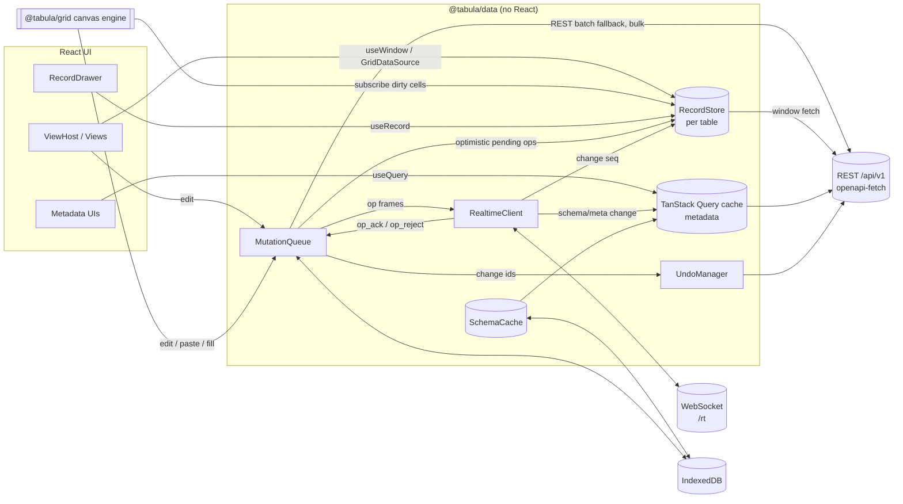
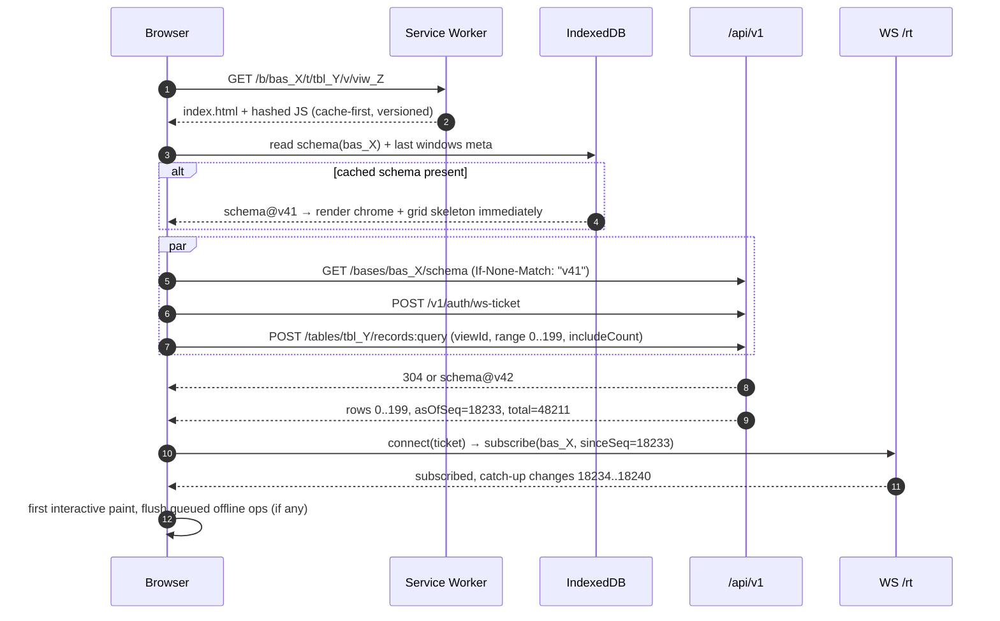
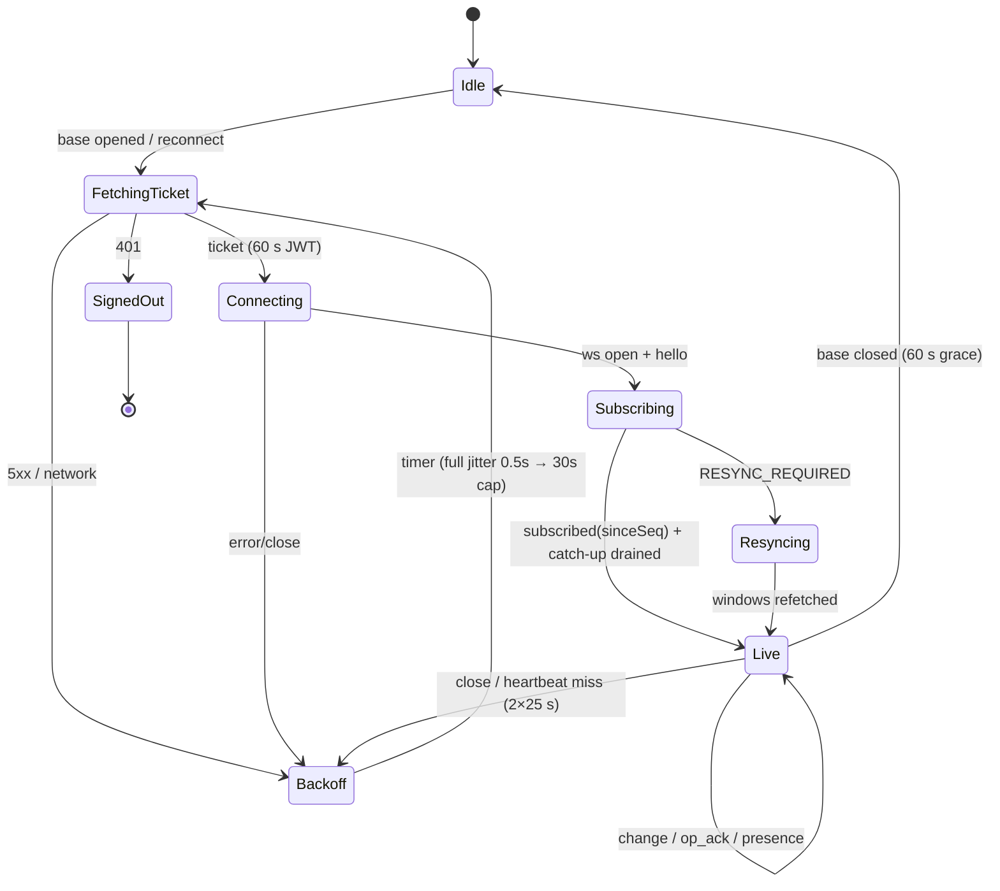
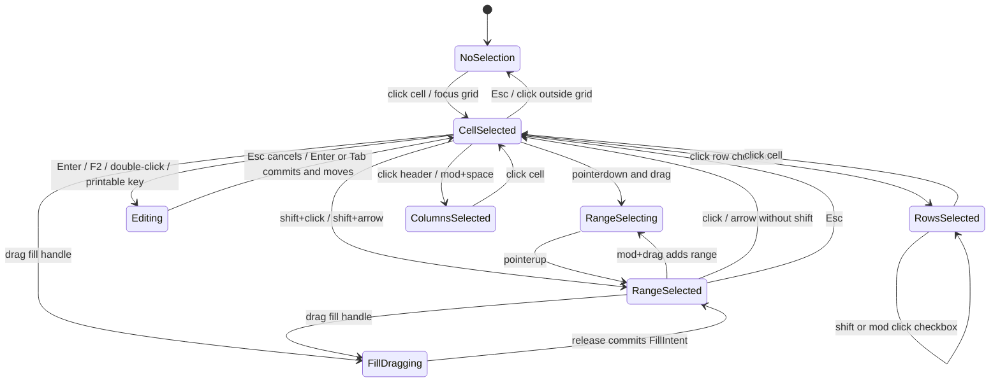
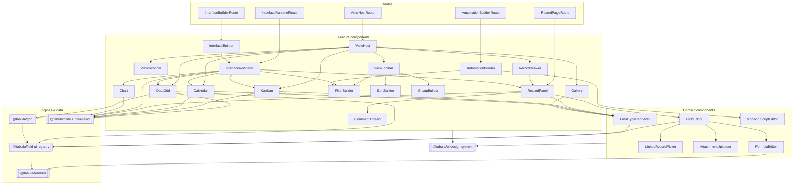

# 24 — Frontend Architecture, Grid Engine, State Management & Design System

> **Status:** Proposed · **Owner:** Frontend Platform · **Date:** 2026-10-03
> Conforms to [`00-canonical-decisions.md`](./00-canonical-decisions.md) — in particular **D18** (frontend stack), **D9** (server-authoritative realtime, cell-level LWW), **D10/D25** (change log + server-side undo), **D16** (REST + WS only, no GraphQL), **D5** (public prefixed IDs at the boundary).
> Labels: **[Observed]** public behavior of Airtable-style products · **[Inferred]** plausible implementation guess · **[Ours]** what we build. Unlabeled design text is **[Ours]**.

## Sections covered

| Section | Part | Topic |
|---|---|---|
| §38 | Part 34 | Frontend architecture: stack evaluation & decision, app shell, module tree & boundaries, routing/URL design, data layer (API client, TanStack Query, RecordStore, MutationQueue, Realtime client), boot sequence, code splitting, i18n, accessibility, performance budgets |
| §39 | Part 35 | Grid engine: OSS evaluation, decision (own canvas engine in `packages/grid`), rendering layers, virtualization, cells & editors, selection state machine, keyboard model, clipboard, drag-fill, column/row operations, grouping, summary bar, formula editing, bulk/optimistic/undo/realtime integration, hit testing, DPR, text measurement, frame budget, testing |
| §40 | Parts 36–37 | State management map & anti-patterns; component architecture (responsibilities, props contracts, dependency graph) |
| §41 | Part 38 | Design system: tokens, components, density, theming, a11y (WCAG 2.2 AA), implementation choice, Storybook & visual regression |

Related documents: [`07-field-engine.md`](./07-field-engine.md) (FieldTypeDefinition; `@tabula/field-ui` renderers/editors), [`10-view-engine.md`](./10-view-engine.md) (view configs, filter AST, query hashing), [`13-interface-builder.md`](./13-interface-builder.md), [`16-realtime.md`](./16-realtime.md) (WS protocol: `clientMutationId`, `op_ack`, change `seq`), [`17-api-architecture.md`](./17-api-architecture.md), [`19-permissions-and-multitenancy.md`](./19-permissions-and-multitenancy.md), [`25-security-observability-infrastructure.md`](./25-security-observability-infrastructure.md), [`26-architecture-style-stack-repo-services.md`](./26-architecture-style-stack-repo-services.md) (monorepo layout, tooling), [`33-architecture-decision-records.md`](./33-architecture-decision-records.md).

> **Normative precedence.** Wire-level frame shapes of the WebSocket protocol are owned by doc 16; field type behavior (validation, coercion, formatting) by doc 07; view query semantics by doc 10. This document defines how the *client* consumes them. Where names below are illustrative of a frame (`op`, `op_ack`, `op_reject`, `change`, `resume`), doc 16's names win.

---

# §38 — Frontend Architecture (Part 34)

## 38.1 Product constraints that drive the frontend

**[Observed]** capabilities we must match: a spreadsheet-feel grid that scrolls smoothly over tens of thousands of rows and hundreds of fields; instant cell edits; live multi-user updates with presence; multiple view types (grid, kanban, calendar, gallery, timeline/gantt, form, list); expanded record modal/drawer with linked records; a drag-and-drop interface builder; an automation builder; formula editing with autocomplete; public share pages and forms.

Derived non-functional requirements **[Ours]**:

| # | Requirement | Consequence |
|---|---|---|
| F1 | 100k rows × 200 fields per table interactive at 60 fps | Canvas grid, windowed data, no per-cell React components |
| F2 | Edit → visual commit < 50 ms; ack < 300 ms p95 | Optimistic local apply; mutation queue; WS transport |
| F3 | Remote change visible < 300 ms p95 (server commit → other client paint) | Normalized record store with targeted invalidation & dirty-rect repaint |
| F4 | Warm boot to first grid paint < 1.2 s | Schema cache in IndexedDB, SWR against `schema_version` |
| F5 | Works through flaky networks; short offline tolerance | Durable mutation queue (IndexedDB), resume via `change_seq` |
| F6 | WCAG 2.2 AA including the grid | Offscreen accessible DOM layer mirroring the canvas |
| F7 | Same field semantics client & server | Isomorphic packages (`@tabula/formula`, field engine core from doc 07) |
| F8 | 30+ locales, RTL in V1+ | Compiled ICU messages; logical CSS properties |
| F9 | Public share/form pages isolated from authenticated app | Separate app entry, separate origin, no session cookie |

## 38.2 Stack evaluation & decision

D18 fixes the outcome; this section records *why*, so the decision can be revisited deliberately rather than by drift.

### 38.2.1 UI framework

| Option | Strengths | Weaknesses for Tabula | Verdict |
|---|---|---|---|
| **React 19** | Largest ecosystem (Radix, TanStack, dnd-kit, TipTap/ProseMirror bindings, CodeMirror/Monaco wrappers, react-aria); concurrent rendering (`useTransition`, `useDeferredValue`) good for filter/sort UIs; `useSyncExternalStore` gives a clean contract for an external record store; deepest hiring pool; React Compiler reduces memo boilerplate | VDOM overhead per update; easy to create re-render storms | **Chosen.** The hot path (grid) is canvas and bypasses React entirely, neutralizing React's main weakness. |
| SolidJS | Fine-grained reactivity, no VDOM, excellent raw perf | Much smaller ecosystem (no Radix-equivalent maturity, fewer editors), hiring | Rejected: perf advantage is irrelevant once grid is canvas; ecosystem cost is high. |
| Svelte 5 (runes) | Small bundles, signals, nice DX | Ecosystem smaller for complex app primitives (menus/a11y/dnd), fewer large-SPA references | Rejected for same reasons. |
| Vue 3 | Mature, good reactivity | Team/ecosystem fit; fewer top-tier headless a11y libs comparable to Radix/react-aria | Rejected. |

### 38.2.2 Application framework / rendering mode

| Option | Pros | Cons | Verdict |
|---|---|---|---|
| **Vite SPA** + TanStack Router | Simplest deploy (static assets on CDN), fastest dev server/HMR, no server runtime to scale for UI, no hydration cost; full control over boot sequence (IndexedDB schema cache before network) | No SSR for SEO (irrelevant: app is auth-gated); must hand-roll OG tags for share pages | **Chosen** for the authenticated app **and** share app. |
| Next.js (App Router, RSC) | SSR/RSC, streaming, image opt, file routing | RSC model fights a long-lived, websocket-driven client store; server runtime to operate & scale; cache semantics complexity; vendor-shaped deploy story | Rejected for the app. **Used (or Astro) for the marketing site** only. |
| Remix / React Router v7 framework mode | Loaders/actions, progressive enhancement, nested routes | Loader model is request/response-centric; our data arrives over WS and lives in a client store; SSR again not needed | Rejected; we borrow its *nested route + loader* idea via TanStack Router loaders. |

Share-page OG/unfurl metadata: a tiny edge function (CloudFront Function → Lambda@Edge only for `/s/*` bot user agents) fetches `GET /v1/share/{token}/meta` and injects `<meta property="og:*">` into the static shell. No SSR framework needed.

### 38.2.3 Router

| Option | Notes | Verdict |
|---|---|---|
| **TanStack Router** | Fully typed route tree and **typed, validated search params** (we put `r`, `f`, `q` in search), route loaders with pending/stale semantics integrated with TanStack Query, code-split route files | **Chosen** |
| React Router v7 (library mode) | Mature, ubiquitous; search params untyped strings | Acceptable fallback |

### 38.2.4 Server-state (metadata) layer

| Option | Fit | Verdict |
|---|---|---|
| **TanStack Query v5** | Framework-agnostic cache with request dedup, SWR, retries, cancellation, `setQueryData` for realtime patching, persisted cache plugin, devtools | **Chosen for metadata**: workspaces, bases, schema (tables/fields/views), members, automations, interfaces, comments, notifications |
| RTK Query | Excellent if we were on Redux; tag invalidation is nice | Brings Redux store we otherwise don't need |
| Relay | Best-in-class normalized cache, fragments | Requires GraphQL — rejected by D16 |
| SWR | Minimal | Too thin for mutations/optimistic updates/devtools |
| Apollo | GraphQL | Rejected by D16 |

### 38.2.5 Record data: why *not* TanStack Query for records

TanStack Query caches *per query key*. Record data has needs Query does not model:

1. **One record appears in many windows** (view A sorted by name, view B grouped by status, the record drawer, a linked-record chip in another table). Updates must be applied once and seen everywhere → **normalization**.
2. **Cell-granular realtime ops** at up to hundreds/sec on busy bases. Replacing query data immutably (structural sharing over 100k-item arrays) costs O(n) per update.
3. **Pending ops must be rebased** on top of server state (optimistic overlay) and removed on `op_ack` — a log-structured concern, not a cache concern.
4. **Sparse windows** (rows 40,000–40,200 loaded, rest unknown) with ordered id arrays per query hash.

Hence the **custom `RecordStore`** (D18): a normalized, mutable-inside/immutable-outside store exposed through `useSyncExternalStore` and a non-React subscription API consumed directly by the canvas grid. §38.7.

### 38.2.6 UI (ephemeral client) state

| Option | Pros | Cons | Verdict |
|---|---|---|---|
| **Zustand** | Tiny, selector-based subscriptions, usable **outside React** (the grid engine and keyboard layer read/write it), slices per feature, middleware (devtools, `subscribeWithSelector`) | Global-by-default — must be disciplined (per-feature stores) | **Chosen** |
| Jotai | Atom-level granularity, great for derived state | Atoms live in React context; awkward from imperative engine code; atom sprawl | Allowed locally inside builders (interface builder canvas) if a team proves the need — not by default |
| Redux Toolkit | Predictable, devtools, middleware | Boilerplate; single store encourages putting server data in it (anti-pattern here) | Rejected |
| MobX | Transparent reactivity, good perf | Implicit tracking makes perf regressions hard to diagnose at our scale; proxies over large records cost memory | Rejected |
| Valtio / Preact signals | Proxy/signal ergonomics | Same concerns as MobX; signals-in-React still unofficial | Rejected |

### 38.2.7 Other libraries (chosen and why)

| Concern | Choice | Alternatives considered | Reason |
|---|---|---|---|
| OpenAPI client | **`openapi-typescript` + `openapi-fetch`** (types-only codegen, ~6 KB runtime) | Orval, Hey API, openapi-generator | No generated hooks → we keep our own query-key factory and RecordStore integration; zero runtime bloat; regenerated in CI from the server's OpenAPI (D17) and diff-checked |
| Schema validation (client) | Zod (shared with server internal) | Valibot | Already used on server; Valibot considered for share app bundle size |
| Headless primitives | **Radix UI** (+ `react-aria` hooks for date pickers/combobox virtual focus where Radix lacks) | Ariakit, Headless UI | D18; best a11y coverage + composition model |
| Styling | **vanilla-extract** (see §41.6) | Tailwind v4, CSS Modules, Panda, StyleX | Typed theme contract shared with canvas; zero runtime |
| Rich text | TipTap (ProseMirror) + Yjs in V1 (D9) | Lexical, Slate | ProseMirror schema = sanitization boundary; mature Yjs binding |
| Formula editor | **CodeMirror 6** | Monaco | ~150 KB vs ~2 MB; custom language via Lezer grammar mirroring `@tabula/formula` tokens |
| Script editor (automations) | **Monaco** (lazy, worker-based TS language service) | CodeMirror + TS LSP worker | Out-of-the-box TS intellisense against our generated script API `.d.ts` |
| DnD (DOM) | dnd-kit | react-beautiful-dnd (archived), pragmatic-drag-and-drop | Accessible keyboard DnD, sensors, used for kanban/fields/builder |
| Charts | **Apache ECharts** (lazy) | Recharts, visx, Vega-Lite | Canvas renderer handles 100k points; many chart types for interface dashboards |
| Dates | `@internationalized/date` + `Intl` | date-fns-tz, Luxon, Temporal polyfill | Calendar-system & tz correctness; same lib powers react-aria date pickers. Migrate to Temporal when baseline |
| Forms (settings UIs) | react-hook-form + zod resolver | Formik, TanStack Form | Uncontrolled perf, mature |
| i18n | **Lingui v5** (ICU, compile-time catalogs) | react-intl (FormatJS), i18next | Smallest runtime, message extraction via macros, compiled catalogs per route chunk |
| Testing | Vitest, Testing Library, MSW, Playwright, Storybook test-runner | Jest, Cypress | Vite-native speed; Playwright for multi-tab realtime tests |
| Virtualization (DOM lists) | TanStack Virtual | react-window | For non-grid lists (kanban columns, gallery, menus with 10k options) |

## 38.3 Applications & entry points

```
apps/
  web/            # authenticated app SPA        → https://app.tabula.example
  share/          # public share/form SPA         → https://share.tabula.example  (no session cookie)
  admin-console/  # internal staff console (support, support_access_grants) → VPN/SSO only
  marketing/      # Astro (or Next.js) site       → https://tabula.example
packages/
  grid/           # @tabula/grid – canvas grid engine (framework-agnostic core + React adapter)
  ui/             # @tabula/ui – design system (tokens, primitives, components)
  field-ui/       # @tabula/field-ui – per-field-type renderers (canvas+DOM), editors, filter inputs (doc 07)
  formula/        # @tabula/formula – isomorphic parser/typechecker/evaluator (D8)
  fields/         # isomorphic field-type core: validate/normalize/coerce/format (doc 07; name per doc 07)
  api-client/     # @tabula/api-client – generated OpenAPI types + typed fetch + problem+json errors
  data/           # @tabula/data – RecordStore, MutationQueue, RealtimeClient, schema cache (no React)
  data-react/     # hooks binding @tabula/data to React (useRecord, useWindow, useMutation…)
  i18n/           # catalogs, locale loading, formatting helpers
  telemetry/      # RUM, Sentry init, OTel web, perf marks
  test-utils/     # fixtures, MSW handlers, fake realtime server
```

Why `@tabula/data` is React-free: the grid engine, web workers (filter evaluation, CSV parse), and the share app all consume it; React is an adapter (`data-react`). This also makes the store unit-testable at memory speed.

## 38.4 App shell

```
┌──────────────────────────────────────────────────────────────────────────────┐
│ TopBar: base switcher · base name · Data | Automations | Interfaces | Forms  │
│         search (⌘K) · presence avatars · share · notifications · account     │
├──────────┬───────────────────────────────────────────────────────────────────┤
│ TableTabs (horizontal, overflow menu)  + add table                            │
├──────────┼───────────────────────────────────────────────────────────────────┤
│ Sidebar  │ ViewToolbar: view name ▾ · hide fields · filter · group · sort ·  │
│ (views,  │              color · row height · share view · search in view      │
│ sections)├───────────────────────────────────────────────────────────────────┤
│          │ ViewHost (lazy view module: Grid | Kanban | Calendar | Gallery…)  │
│          │                                                     ┌────────────┤
│          │                                                     │RecordDrawer│
│          │                                                     │(?r=rec_…)  │
├──────────┴─────────────────────────────────────────────────────┴────────────┤
│ StatusLayer: connection banner · toasts · long-operation progress · undo hint│
└──────────────────────────────────────────────────────────────────────────────┘
```

Provider stack (outermost first): `TelemetryBoundary` → `I18nProvider` → `ThemeProvider` → `QueryClientProvider` → `DataRuntimeProvider` (RecordStore/MutationQueue/RealtimeClient singletons per *base session*) → `RouterProvider` → `TooltipProvider`/`ToastProvider` → route tree.

Global services are created once per tab in `app/runtime.ts`; per-base objects (`BaseSession`) are created when entering `/b/{baseId}` and disposed (with a 60 s grace for back-navigation) when leaving.

```ts
// packages/data/src/base-session.ts
export interface BaseSession {
  readonly baseId: BaseId;
  readonly schema: SchemaCache;          // tables/fields/views for the base, versioned
  readonly records: RecordStore;         // per-table normalized stores
  readonly mutations: MutationQueue;
  readonly realtime: BaseSubscription;   // seq watermark, presence
  readonly undo: UndoManager;            // change-id stack (D25)
  readonly permissions: ClientPermissionView; // derived from server PermissionSnapshot (doc 19)
  dispose(): void;
}
```

## 38.5 Module tree (feature folders & boundaries)

```
apps/web/src/
  app/                        # composition root – only place that wires features together
    runtime.ts                # creates QueryClient, RealtimeClient, telemetry
    router.tsx                # route tree (code-split route files)
    providers.tsx
    shell/                    # TopBar, Sidebar frame, StatusLayer, CommandPalette host
  routes/                     # thin route modules: params/search validation + loader + lazy feature component
    _authed.tsx  w.$workspaceId.tsx  b.$baseId.tsx  b.$baseId.t.$tableId.v.$viewId.tsx  …
  features/
    workspace/                # home, workspace list, base cards, templates gallery, invites
    base/                     # base shell, table tabs, base settings, base-level share, trash, snapshots
    table/                    # table header actions, field manager, field create/edit dialogs
    views/
      host/                   # ViewHost, ViewSwitcher, ViewToolbar, view sidebar (sections)
      config/                 # FilterBuilder, SortBuilder, GroupBuilder, FieldVisibility, ColorRules, RowHeight
      grid/                   # React adapter around @tabula/grid + grid-specific toolbars/menus
      kanban/  calendar/  gallery/  timeline/  gantt/  list/  form/
    record/                   # RecordDrawer, RecordPage, RecordPanel, LinkedRecordPicker, record history, comments tab
    comments/                 # threads, mentions composer, reactions
    interfaces/
      builder/                # canvas editor, element palette, inspector, data bindings, publish flow
      runtime/                # interface renderer (published version), element implementations
      elements/               # element registry shared by builder+runtime (doc 13)
    automations/
      builder/                # trigger/action graph editor, step inspector, test run, Monaco script editor
      runs/                   # run history, step logs
    contacts/                 # workspace contact directory, merge UI, activity timeline
    search/                   # ⌘K command palette, global search results
    notifications/
    history/                  # undo/redo UI, revision history, snapshot restore
    import-export/            # CSV/XLSX import wizard (worker parse), export dialogs
    ai/                       # AI field config, AI assist panels
    settings/                 # account: profile, security (MFA, sessions, tokens), notifications, preferences
    admin/                    # org admin: members, teams, SSO, SCIM, policies, audit log, billing
  shared/                     # app-level shared UI not generic enough for @tabula/ui (EmptyState variants, PermissionGate)
  data/                       # app glue for @tabula/data: query keys, query options, realtime → query patches
```

Each feature exposes **one public entry** (`features/<name>/index.ts`) and may contain `components/`, `hooks/`, `stores/` (Zustand slices), `api/` (query options + mutations), `lib/`, `__tests__/`.

### 38.5.1 Boundary rules (enforced in CI)

Enforced with `eslint-plugin-boundaries` + `dependency-cruiser` (graph-level cycle checks) — tooling owned by doc 26.

| From \ To | `app` | `routes` | `features/*` (public) | `features/*` (internal) | `shared` | `data` | `@tabula/*` |
|---|---|---|---|---|---|---|---|
| `app` | ✓ | ✓ | ✓ | ✗ | ✓ | ✓ | ✓ |
| `routes` | ✗ | ✓ | ✓ | ✗ | ✓ | ✓ | ✓ |
| `features/X` | ✗ | ✗ | ✓ (other features' `index.ts` only, from allowlist) | own only | ✓ | ✓ | ✓ |
| `shared` | ✗ | ✗ | ✗ | ✗ | ✓ | ✓ | ✓ |
| `@tabula/data` | — | — | — | — | — | ✓ | `api-client`, `fields`, `formula` only (no React, no `ui`) |
| `@tabula/grid` | — | — | — | — | — | — | `field-ui` (renderer interfaces), no `data` (talks to a `GridDataSource` interface) |

Allowed cross-feature edges (explicit allowlist): `views/* → record` (open record), `views/* → comments` (comment counts), `interfaces/* → views/config` (filter builder reuse), `automations/* → views/config`, `record → comments`, `record → history`. Anything else needs an ADR-lite PR note. Circular feature imports fail CI.

## 38.6 Routing & URL design

All IDs in URLs are **public prefixed IDs** (D5). URLs are the shareable, bookmarkable state; anything ephemeral (selection, scroll, open menus) is **not** in the URL.

| Route | Purpose | Notes |
|---|---|---|
| `/` | Home | Redirects to last workspace (`user_preferences`) |
| `/w/{workspaceId}` | Workspace home | base list, members |
| `/w/{workspaceId}/contacts` · `/w/{workspaceId}/contacts/{contactId}` | Contact directory | contacts are workspace-scoped (D3) |
| `/b/{baseId}` | Base entry | Redirects to last-opened table/view (from `view_user_state`/local pref) |
| `/b/{baseId}/t/{tableId}` | Table entry | Redirects to the user's last or first visible view |
| **`/b/{baseId}/t/{tableId}/v/{viewId}`** | View | `?r={recordId}` opens RecordDrawer; `&f={fieldId}` focuses a field in it; `&q=` in-view search; `&c={commentId}` scrolls to a comment |
| `/b/{baseId}/t/{tableId}/r/{recordId}` | Full-page record | Same component as drawer, page layout |
| `/b/{baseId}/i/{interfaceId}/p/{pageId}` | Interface runtime | `?r=` record detail inside interface; renders **published** version |
| `/b/{baseId}/i/{interfaceId}/edit/p/{pageId}` | Interface builder | draft; requires `interface.edit` |
| `/b/{baseId}/automations` · `/b/{baseId}/automations/{automationId}` · `…/runs/{runId}` | Automations | |
| `/b/{baseId}/history` · `/b/{baseId}/trash` | Snapshots, trash | |
| `/settings/{section}` | Account settings | `profile`, `security`, `tokens`, `notifications`, `appearance` |
| `/org/{orgId}/admin/{section}` | Org admin | `members`, `teams`, `sso`, `scim`, `policies`, `audit`, `billing` |
| `share.tabula.example/s/{shareToken}` | Public shared view/base/interface | separate app, no auth cookie |
| `share.tabula.example/f/{shareToken}` | Public form | prefill via `?prefill_{fieldId}=…` (validated by field engine) |

Typed search params (TanStack Router `validateSearch` with Zod):

```ts
// routes/b.$baseId.t.$tableId.v.$viewId.tsx
const ViewSearch = z.object({
  r: z.string().regex(/^rec_[0-9A-Za-z]{22}$/).optional(),
  f: z.string().regex(/^fld_[0-9A-Za-z]{22}$/).optional(),
  c: z.string().regex(/^cmt_[0-9A-Za-z]{22}$/).optional(),
  q: z.string().max(200).optional(),
});
export const Route = createFileRoute('/b/$baseId/t/$tableId/v/$viewId')({
  validateSearch: ViewSearch,
  loader: ({ context, params }) => context.baseSession(params.baseId).schema.ensure(), // schema only; records stream in
  component: lazyRouteComponent(() => import('../features/views/host'), 'ViewHostRoute'),
});
```

Rules:
* Loaders only ensure **metadata** (schema, permissions). Record windows are requested by the view after layout (it knows its viewport size) — never block navigation on record fetch.
* Unknown/forbidden IDs → `NotFound` (never reveal existence; matches API 404 behavior in doc 19).
* Navigating between views of the same table keeps the `BaseSession` and the table's RecordStore (records are shared across views).
* Legacy/renamed: IDs never change, so links never break; deleted views redirect to table entry with a toast.

## 38.7 Data layer



### 38.7.1 API client

* Generated from the server OpenAPI document (`/v1/openapi.json`, D17) with `openapi-typescript` into `@tabula/api-client/src/schema.d.ts`. CI regenerates and fails on uncommitted diff.
* Runtime: `openapi-fetch` with middleware:
  * `credentials: 'same-origin'`; first-party calls go to **`/api/v1/*` on the app origin** (CloudFront path-routes to ALB — see doc 25 §42.8), so cookie auth needs no CORS.
  * Adds `X-CSRF-Token` (double-submit, doc 25), `Idempotency-Key` for mutating calls (UUIDv7), `traceparent` (sampled), `X-Client-Version`.
  * Parses RFC 9457 problem+json into a typed `ApiError { status, code, detail, errors[], requestId }`.
  * Retries: only idempotent methods or requests carrying `Idempotency-Key`; exponential backoff with jitter on 429/502/503/504 honoring `Retry-After`.
  * Aborts via `AbortSignal` (route change cancels in-flight window fetches).
* Public IDs stay opaque strings on the client; branded types prevent mixing:

```ts
type Brand<T, B extends string> = T & { readonly __brand: B };
export type BaseId = Brand<string, 'bas'>;  export type TableId = Brand<string, 'tbl'>;
export type FieldId = Brand<string, 'fld'>; export type RecordId = Brand<string, 'rec'>;
export type ViewId = Brand<string, 'viw'>;  export type ChangeId = Brand<string, 'chg'>;
```

### 38.7.2 TanStack Query (metadata)

Query-key factory (single source; no ad-hoc keys):

```ts
export const qk = {
  me: () => ['me'] as const,
  workspaces: () => ['workspaces'] as const,
  workspace: (id: WorkspaceId) => ['workspace', id] as const,
  baseSchema: (baseId: BaseId) => ['base', baseId, 'schema'] as const,     // tables+fields+views, versioned
  basePermissions: (baseId: BaseId) => ['base', baseId, 'perm'] as const,  // client view of PermissionSnapshot
  baseMembers: (baseId: BaseId) => ['base', baseId, 'members'] as const,
  comments: (baseId: BaseId, recordId: RecordId) => ['base', baseId, 'comments', recordId] as const,
  automations: (baseId: BaseId) => ['base', baseId, 'automations'] as const,
  automationRuns: (automationId: AutomationId, cursor?: string) => ['automation', automationId, 'runs', cursor] as const,
  interfaces: (baseId: BaseId) => ['base', baseId, 'interfaces'] as const,
  notifications: () => ['notifications'] as const,
} as const;
```

Defaults: `staleTime: 30 s` for lists, `Infinity` for `baseSchema` (kept fresh by realtime `schema_version` bumps), `gcTime: 10 min`, `refetchOnWindowFocus` only for notification/members queries.

Realtime → Query bridge: schema events (`field.created`, `view.updated`, …) arrive as `change` frames whose ops are schema ops; the bridge applies them via `queryClient.setQueryData(qk.baseSchema(baseId), patch)` if `frame.schemaVersion === cached.schemaVersion + 1`, otherwise invalidates and refetches. Permission changes (`perm_epoch` bump) invalidate `basePermissions` and **all record windows** of the base (row/field visibility may change).

### 38.7.3 Schema cache & boot sequence



* IndexedDB (`tabula` DB via `idb`): stores `schema` (key `baseId`, value `{schemaVersion, payload, savedAt}`), `mutationQueue`, `prefs-large`. Encrypted at rest? No — browser profile protection is the boundary; **logout wipes IndexedDB** and the SW cache; schema cache is per user id (`{userId}:{baseId}`) to avoid cross-account leakage on shared machines.
* **Records are not persisted** to IndexedDB in MVP (size, staleness, privacy). Reconsider in V2 for offline-read mode.
* Service Worker (Workbox): precache app shell and route chunks; `NetworkOnly` for `/api/*` and `/rt`. Updates: new SW waits; the app shows "New version available — reload" when idle, or auto-reloads on next navigation if `X-Min-Client-Version` from the API exceeds the running build (forced upgrade on protocol break).

### 38.7.4 RecordStore — design

One `TableRecordStore` per table touched in the base session. Records are keyed by `RecordId`; cell values keyed by `FieldId` (public) — the slot mapping is a server concern (D6) and never leaks to the client.

```ts
// packages/data/src/records/types.ts
export type CellValue = unknown;                       // validated by field engine (doc 07)
export type Cells = ReadonlyMap<FieldId, CellValue>;   // absent ⇒ empty (canonical rule)

export interface ServerRecord {
  id: RecordId;
  cells: Cells;                 // user cells + computed values, merged view from API (cellFormat=json)
  version: number;              // records.version
  seq: number;                  // highest base change seq reflected in this snapshot
  createdTime: string; createdBy?: UserId;
  commentCount?: number;
  stale?: ReadonlySet<FieldId>; // computed fields awaiting deferred recompute (D7) → render shimmer
}

export type PendingOp =
  | { kind: 'set';        mid: MutationId; fieldId: FieldId; value: CellValue | undefined }
  | { kind: 'setAdd';     mid: MutationId; fieldId: FieldId; items: readonly string[] }   // multi_select, collaborators
  | { kind: 'setRemove';  mid: MutationId; fieldId: FieldId; items: readonly string[] }
  | { kind: 'linkAdd';    mid: MutationId; fieldId: FieldId; targets: readonly RecordId[]; beforeId?: RecordId }
  | { kind: 'linkRemove'; mid: MutationId; fieldId: FieldId; targets: readonly RecordId[] }
  | { kind: 'create';     mid: MutationId; cells: Cells; anchor?: WindowAnchor }
  | { kind: 'delete';     mid: MutationId };

export interface RecordState {
  readonly id: RecordId;
  server: ServerRecord | null;          // null while only optimistically created
  pending: PendingOp[];                 // FIFO, same order the MutationQueue will send
  merged: Cells;                        // memo: fold(pending, server.cells); recomputed on change
  status: 'live' | 'pendingCreate' | 'pendingDelete' | 'deleted' | 'forbidden';
  lastTouched: number;                  // LRU eviction
  remoteFlash?: { fieldIds: FieldId[]; at: number; by: UserId }; // for grid flash highlight
}

export interface ViewWindow {
  readonly key: WindowKey;              // hash(viewId, effectiveQuery) – see 38.7.5
  totalCount: number | null;
  /** Sparse ordered ids: chunk index → 200 ids (Grid page window, §13) */
  chunks: Map<number, { ids: RecordId[]; fetchedAtSeq: number; state: 'ok' | 'loading' | 'stale' }>;
  groups?: GroupTree;                   // when grouped: headers + counts + collapsed state (doc 10)
  asOfSeq: number;                      // min fetchedAtSeq across valid chunks
  pinnedLocal: Map<RecordId, number>;   // "sticky" positions for locally created/edited rows (38.7.6)
  dirty: boolean;                       // membership/order may be wrong → refetch visible chunks
}

export interface TableRecordStore {
  get(id: RecordId): RecordState | undefined;
  getCell(id: RecordId, fieldId: FieldId): CellValue | undefined;     // merged value
  window(key: WindowKey): ViewWindow;
  ensureRange(key: WindowKey, start: number, end: number): Promise<void>; // fetch + prefetch ±2 windows
  applyServerPage(key: WindowKey, chunk: number, page: RecordsPage): void;
  applyChange(change: ChangeFrame): ApplyResult;                       // realtime (38.7.7)
  addPending(id: RecordId, op: PendingOp): void;
  resolvePending(mid: MutationId, outcome: 'acked' | 'rejected', ackSeq?: number): void;
  subscribe(listener: StoreListener, filter?: { recordIds?: Set<RecordId>; fieldIds?: Set<FieldId>; windowKey?: WindowKey }): () => void;
  getVersion(): number;                                                // monotonically increasing for useSyncExternalStore
}
```

Implementation notes:

* **Mutable internals, versioned snapshots.** Maps are mutated in place; every commit increments `version` and emits a *change set* `{ records: Set<RecordId>, cells: Array<[RecordId, FieldId]>, windows: Set<WindowKey> }`. React hooks use `useSyncExternalStore(subscribe, () => selectorCache(version))` with per-hook memoized selectors, so a cell change re-renders only components reading that record. The grid ignores React and consumes change sets directly to compute dirty rects.
* **Batching:** all applies inside one animation frame are coalesced (`queueMicrotask` for correctness, `requestAnimationFrame` for notification flush). A burst of 1,000 remote changes produces one notification.
* **Memory:** LRU eviction of records not in any visible/prefetched chunk and without pending ops; cap per table `MAX_RESIDENT_RECORDS = 25,000` (tunable by device memory via `navigator.deviceMemory`). 100k × 200 fields fully resident would be ~1–2 GB of JS objects — explicitly avoided. **[Inferred]** Some competitors load whole bases into memory; our windowed model trades a little latency at scroll extremes for bounded memory and bigger table support.
* **Linked record display values:** link cells hold target `RecordId[]`; display names come from a per-target-table `PrimaryValueCache` (`Map<RecordId, string>`) filled by the API's `expand=primary` response and by realtime changes on target tables the client is subscribed to (the base subscription covers all tables of the base).

### 38.7.5 View windows & query hashing

`WindowKey = viewId + ':' + sha1(canonicalJSON(effectiveQuery))` where `effectiveQuery = { filter, sort, group, search, visibleFieldIds? }` after merging the view config with **personal/ephemeral overrides** (in-view search `q`, interface element filters, per-user row-level filters from doc 19). Canonicalization (sorted keys, normalized filter AST) is shared with the server via doc 10's `canonicalizeQuery()` so identical queries share server caches.

Fetching:
* Page size = **200 rows** per chunk; on viewport change `ensureRange(first, last)` loads missing chunks and **prefetches ±2 chunks** (§13 constant), debounced 50 ms during fast scroll; scroll velocity > 20 rows/frame → defer fetch until velocity drops (render placeholders).
* Request: `POST /api/v1/bases/{baseId}/tables/{tableId}/records:query` with `{ viewId, overrides, offset: chunk*200, pageSize: 200, fields: visible ∪ primary, includeCount: chunk===0, cellFormat: 'json' }`. The server returns `asOfSeq` (the base `change_seq` its snapshot reflects) — **required** for consistency (doc 17 owns the field name).
* Offset paging is acceptable for the grid's *random access* need because the server serves it via keyset-assisted seeks on sidecar indexes (doc 10); the public API uses cursors.

### 38.7.6 Membership & ordering under change

When a change touches a record in a window:

1. If every field referenced by the window's filter/sort/group is **client-evaluable** (not stale computed, not permission-masked) the client evaluates the filter with the isomorphic evaluator (doc 10's `evaluateFilter`, same code as server) and computes the new position by binary search in loaded chunks using the shared comparator (doc 07 `compare` per field type, collation via `Intl.Collator` with server-matching options).
2. Otherwise the window is marked `dirty` and visible chunks refetch (debounced 300 ms, coalesced).
3. **Sticky rows [Ours, matches observed UX]**: a record the *local user* is editing or just created **does not move or disappear** while focused; it is entered into `pinnedLocal`. The grid shows a subtle indicator ("This record no longer matches the view filters / sort") and re-sorts when the user leaves the row, presses the "re-sort" affordance, or after 30 s idle. Remote-caused moves apply immediately but are animated (row slide 120 ms, disabled under reduced motion).
4. Totals (`totalCount`) adjust optimistically on local create/delete, and are corrected by the next server page or count frame.

### 38.7.7 Applying realtime changes (seq watermark)

The base subscription tracks `appliedSeq` (highest contiguous base `change_seq` applied). Every `change` frame carries `seq` (D9 total order per base).

```ts
function onChange(frame: ChangeFrame) {              // frame: { seq, changeId, clientMutationId?, actor, ops[] }
  if (frame.seq <= appliedSeq) return;                // duplicate / already covered
  if (frame.seq > appliedSeq + 1) {                   // gap
    buffer.add(frame);
    requestCatchUp(appliedSeq);                       // WS 'resume' sinceSeq; REST /changes?since= fallback
    return;
  }
  applyFrame(frame); appliedSeq = frame.seq;
  drainBufferContiguous();
}

function applyFrame(f: ChangeFrame) {
  for (const op of f.ops) {
    const store = tables.get(op.tableId); if (!store) continue;  // table not loaded → only schema-level effects
    const rec = store.get(op.recordId);
    if (!rec?.server) { store.noteUnloaded(op); continue; }      // not resident: windows maybe dirty
    if (f.seq <= rec.server.seq) continue;                       // page snapshot already includes it
    applyOpToServer(rec.server, op); rec.server.seq = f.seq; rec.server.version++;
    if (f.clientMutationId) store.resolvePending(f.clientMutationId, 'acked', f.seq); // our own echo
    else rec.remoteFlash = { fieldIds: fieldsOf(op), at: now(), by: f.actor.id };
    rec.merged = fold(rec.pending, rec.server.cells);            // REBASE: pending ops replayed on new server state
    markWindowsForMembership(store, rec, op);
  }
}
```

Gap handling:
* Catch-up is served from `base_changes` (30-day retention, D10). If the server answers `RESYNC_REQUIRED` (gap too old or > 10,000 changes), the client **discards server snapshots** for the base (keeping pending ops), invalidates all windows, refetches visible chunks, and replays pending ops on top.
* Page snapshots older than `appliedSeq` are fine: per-record `server.seq` decides whether a change is newer than the snapshot. A page fetched with `asOfSeq` higher than `appliedSeq` (possible while WS lags) is applied; later frames with `seq ≤ record.server.seq` are skipped per record.

**Rebase semantics** (consistent with D9 cell-level LWW):

| Pending op | Remote change on same cell arrives first | Result in `merged` | After our op commits |
|---|---|---|---|
| `set` | `set` by other user | Our pending value (it will commit later ⇒ wins LWW) | Server echoes our value; pending dropped |
| `setAdd`/`setRemove` | other user's set/add/remove | Remote server value with our add/remove applied on top (commutative) | Converges |
| `linkAdd` | other user removes same target | Target present (ours later) | Converges to server outcome |
| any | record deleted remotely | Record shown as deleted; pending ops cancelled; toast "Record was deleted by X" with *Restore* (undo of their change if permitted) | — |
| any | field deleted / type changed / permission revoked | Pending op will be rejected; surfaced in Unsynced Changes panel | — |

### 38.7.8 MutationQueue

```ts
export interface Mutation {
  mid: MutationId;                 // clientMutationId (UUIDv7) – idempotency key across transports
  baseId: BaseId;
  kind: 'cells' | 'createRecords' | 'deleteRecords' | 'links' | 'reorder' | 'schema' | 'bulk';
  payload: unknown;                // typed per kind
  createdAt: number;
  attempts: number;
  state: 'queued' | 'inflight' | 'acked' | 'rejected' | 'parked';
  transport: 'ws' | 'rest';
  durable: boolean;                // persisted to IndexedDB (cell/record ops only)
  undoGroup?: string;              // groups ops created by one gesture (paste, fill) into one undo step
}
```

Algorithm:

1. **Enqueue** → apply optimistically (`RecordStore.addPending`) in the same frame → schedule flush (microtask; or next frame for typing bursts).
2. **Coalesce** while `queued` (never once `inflight`): consecutive `set` on the same `(record, field)` collapse into the last; `setAdd`/`setRemove` on the same item cancel.
3. **Batch**: up to 100 ops or 64 KB per WS `op` frame; ops for > 1,000 records (paste/fill/bulk edit) go to REST `records:batch` in chunks of 1,000 (§8 limit) with `Idempotency-Key = mid:chunkIndex`, sequentially, with progress UI; > 10,000 records → `long_operations` server-side bulk op (doc 17) and the client stops being optimistic beyond the visible window.
4. **Ordering**: one inflight *window* per base of max 8 frames; server processes a connection's frames in order (doc 16). Ops on the same record are never reordered.
5. **Ack** (`op_ack {clientMutationId, seq, changeId}`) → `resolvePending(acked)`, push `changeId` to UndoManager (unless the gesture is an undo/redo itself).
6. **Reject** (`op_reject {clientMutationId, code, detail}`) → remove pending op, re-fold, toast with field-level reason; `FIELD_VALIDATION_FAILED`, `PERMISSION_DENIED`, `RECORD_NOT_FOUND`, `RATE_LIMITED` (re-queue after `retryAfter`).
7. **Timeouts/retry**: if no ack within 10 s, mark connection suspect; on reconnect, re-send all inflight with the **same `mid`** — server dedups (doc 16: dedup window ≥ 24 h via `idem:` Redis keys / `idempotency_keys`).
8. **Transport fallback**: WS down > 5 s → flush via REST batch endpoint with the same `mid`s.

**Offline short queue** (F5):
* Only `cells`, `createRecords`, `deleteRecords`, `links` mutations are `durable` (persisted to IndexedDB on enqueue, removed on ack). Schema changes, view config edits, automations, interface publishes **require online** — UI disables them with an "Offline" hint.
* Limits: ≤ 2,000 ops and ≤ 24 h age. Beyond the limit, grid becomes read-only with a banner.
* Multi-tab: queue rows carry `tabId`; flush ownership is taken via the **Web Locks API** (`navigator.locks.request('mq:'+baseId)`) so a crashed tab's queue is flushed by the next tab that opens the base.
* On reconnect: (1) resume subscription (catch up to head), (2) rebase pending ops, (3) flush in order. Conflicts resolve by LWW on the server; rejections go to the **Unsynced Changes** panel (list of record/field/value with "copy value" and "retry").

### 38.7.9 Realtime client

Connection lifecycle (frame shapes per doc 16):



* **Ticket:** `POST /v1/auth/ws-ticket` (cookie-authenticated) returns a single-use, 30 s, audience-bound JWT (doc 25 §42.4). Browsers can't set headers on WS; tickets avoid putting the session cookie on a cross-origin WS and keep the gateway stateless.
* **Heartbeat:** `WS_HEARTBEAT = 25 s` (§13); two misses → reconnect.
* **Visibility:** tab hidden > 10 min → unsubscribe from presence (keep changes); hidden > 30 min → close socket; on visible → resume with `sinceSeq`.
* **Presence:** client publishes `{ viewId, recordId?, cell?: [recordId, fieldId], selection?: Range, color }` throttled to 10 Hz; receives `presence` diffs keyed by connection. Stored in a Zustand `presenceStore` (ephemeral), not RecordStore.
* **One socket per tab per base** in MVP (simple, isolated failure). V1 option: `SharedWorker` multiplexing tabs over one socket (saves connections for power users with 10 tabs) — deferred: Safari SharedWorker support and debugging cost.

### 38.7.10 Undo/redo (client side of D25)

* `UndoManager` keeps per-base-session stacks of **undo groups**: `{ groupId, changeIds: ChangeId[], label }`. One gesture (typing into a cell, paste of 5,000 cells, fill, delete rows) = one group.
* Undo → `POST /api/v1/bases/{baseId}/changes:undo { changeIds }`; server applies stored `inverse_ops`, producing a *new* change (`actor.via = 'undo'`) that streams back like any change. Server rejects with `UNDO_CONFLICT` per cell if a newer change by someone else touched the cell (no silent overwrite of collaborators) — client shows which cells were skipped.
* Optimism: the client applies the inverse optimistically only for cells whose current `server` value still equals the value it set (cheap local check), otherwise waits for the server.
* Pending-only undo: if a group is not yet acked, undo simply cancels queued ops (no server call).
* Stack cleared on base-session dispose; capped at 100 groups; changes older than `BASE_CHANGES_RETENTION` can't be undone.

## 38.8 Code splitting

| Chunk | Contents | Load trigger | Budget (gz) |
|---|---|---|---|
| `entry` | runtime, router, shell, design-system core, data layer, i18n runtime | initial | ≤ 150 KB |
| `view-grid` | `@tabula/grid`, field-ui **renderers** (all types — needed to paint), grid toolbar | first grid view | ≤ 110 KB |
| `view-{kanban,calendar,gallery,timeline,gantt,list,form}` | per view type | on switch | ≤ 60 KB each |
| `editor-{fieldType}` | field-ui **editors** (date picker, attachment uploader, link picker, rich text) | first edit of that type; prefetched on cell hover after 300 ms idle | ≤ 40 KB each; TipTap ≤ 90 KB |
| `formula-editor` | CodeMirror 6 + language | opening formula config | ≤ 120 KB |
| `monaco` | Monaco + TS worker | automation script step | ~1 MB, never on critical path |
| `charts` | ECharts (tree-shaken) | interface chart elements | ≤ 250 KB |
| `interfaces-builder` / `automations-builder` / `admin` / `settings` | feature routes | route | ≤ 150 KB each |
| `import-worker` | Papaparse/SheetJS (XLSX) in a Web Worker | import wizard | worker-only |

Rules: route chunks via TanStack Router lazy routes; `import()` boundaries reviewed with `rollup-plugin-visualizer` + **size-limit** CI check per chunk (fails PR on budget overrun > 5% without label `size-budget-override`). Prefetch on intent (hover on view tab, ⌘K selection). Vendor chunking by stable package groups to maximize long-term caching; hashed filenames; immutable caching on CDN.

## 38.9 Internationalization

* **Lingui v5** with ICU MessageFormat; source strings in English with stable message IDs (macro-generated + explicit `id` for strings reused across files); catalogs compiled per locale **per route chunk** to avoid loading the whole catalog.
* Locale resolution: `users.locale` → `Accept-Language` → `en`. Formatting locale may differ from UI language (user preference: "Format numbers/dates as …").
* All value formatting goes through the field engine's `format(value, config, ctx)` (doc 07) with `ctx = { locale, timeZone, currencyDisplay }` using `Intl.NumberFormat`/`Intl.DateTimeFormat` instances **cached by options hash** (construction is expensive; the grid formats thousands of cells per frame).
* Formula language: function names and argument separators are **locale-invariant** (English names, comma separator) — matching how saved formulas are stored and shared across collaborators of different locales; the formula editor shows localized *documentation*.
* Pluralization/gender via ICU; never concatenate strings; no text in images.
* RTL (V1+): UI uses CSS logical properties from day one (`margin-inline-start`, `inset-inline-end`); grid engine supports `direction: 'rtl'` by mirroring x-coordinates in layout (frozen columns pinned to the right). Bidi text in cells rendered with canvas `direction` per cell (detect first strong char).
* QA: pseudo-locale (`en-XA` accented + 35% expansion, `ar-XB` mirrored) in Storybook and Playwright smoke; missing-translation fallback logs a dev warning; TMS: Crowdin (or Lokalise) GitHub integration.

## 38.10 Accessibility (overview; grid detail in §39.18)

Target **WCAG 2.2 AA** for the authenticated app, share pages, and forms (forms are often used by the public — highest priority).

* All interactive primitives from Radix/react-aria (focus management, roving tabindex, typeahead, `aria-*`).
* Keyboard-complete: every feature reachable without a pointer (view config builders, kanban move via keyboard DnD (dnd-kit sensors), calendar via arrow keys, interface builder with "move element" keyboard mode).
* Focus visible (2 px `--color-focus-ring`, 3:1 contrast against adjacent colors — WCAG 2.4.11/2.4.13), focus not obscured by sticky headers/toasts (2.4.11 Focus Not Obscured).
* Target size ≥ 24×24 CSS px (2.5.8) — compact density keeps hit targets via padding even when glyphs shrink.
* Dragging alternatives (2.5.7): every drag action (column reorder, kanban, row reorder, fill handle) has a menu/keyboard alternative.
* Live regions: polite announcer for async outcomes (saved, import done, remote edits on the focused cell); assertive only for errors.
* Color is never the only signal (select options have text; status chips have icons; validation has messages).
* Reduced motion and high contrast (`forced-colors`) honored (§41).
* Testing: axe-core in Storybook test-runner (fail on serious/critical), Playwright + `@axe-core/playwright` on key flows, manual screen reader matrix per release: NVDA+Firefox, JAWS+Chrome, VoiceOver+Safari (macOS/iOS), TalkBack+Chrome on forms.

## 38.11 Performance budgets

Reference device: 4-core laptop @ 2020 mid-range (CPU 4× throttled in Lighthouse ≈ Moto G Power for share/forms), Chrome stable, 1440×900, DPR 2.

| Metric | Budget (p75 unless noted) | Measured by |
|---|---|---|
| Cold load → first grid paint (empty cache) | ≤ 2.5 s | RUM `grid.first_paint` mark |
| Warm load → first grid paint (SW + schema cache) | ≤ 1.2 s | RUM |
| LCP (share & form pages) | ≤ 2.0 s | web-vitals |
| INP (app) | ≤ 200 ms (p75), ≤ 500 ms (p99) | web-vitals |
| CLS | ≤ 0.05 | web-vitals |
| Grid scroll | 60 fps; p95 frame ≤ 16.7 ms; JS per frame ≤ 8 ms at 100k × 200 (50 visible cols) | rAF frame histogram, CI perf test |
| View switch (same table, cached schema) | ≤ 300 ms to first paint | RUM |
| Cell edit → optimistic paint | ≤ 50 ms (p95) | perf mark edit→paint |
| Edit → `op_ack` | ≤ 300 ms (p95) | RUM |
| Remote change → paint (server commit to other client) | ≤ 300 ms (p95) | server ts in frame vs paint (clock-offset corrected) |
| Paste 10k cells → all optimistic | ≤ 500 ms; server batches stream with progress | perf test |
| JS heap (100k-row table, scrolled end-to-end) | ≤ 500 MB | CI perf test (`performance.measureUserAgentSpecificMemory` where available) |
| Initial JS (gz) | ≤ 260 KB (entry + grid) | size-limit |

Budgets are enforced by (a) size-limit in PR CI, (b) a nightly Playwright perf suite on a fixed EC2 instance type (`c7i.xlarge`, headless Chrome with GPU disabled → pessimistic) against a seeded 100k×200 table, failing on > 10% regression vs. rolling baseline, and (c) RUM SLOs (doc 25 §43).

---

# §39 — Grid Engine (Part 35)

## 39.1 Requirements

| # | Requirement | Target |
|---|---|---|
| G1 | Scale | 100k rows × 200 columns interactive at 60 fps; 1M rows scrollable (Enterprise dedicated shards) |
| G2 | Field types | All canonical types (00 §4) with custom canvas renderers (chips, avatars, thumbnails, ratings, progress, buttons, link chips, AI status) |
| G3 | Editing | In-cell typing, expanded editors (date picker, select, link picker, attachments, long text), formula field config, bulk edit |
| G4 | Selection | Cell cursor, multi-range rectangular selection, row selection (checkbox gutter), column selection, select-all |
| G5 | Clipboard | Copy/paste TSV + HTML both directions with Excel/Google Sheets/Numbers; paste coercion via field engine; large pastes |
| G6 | Structure | Frozen columns (incl. primary), column resize/reorder/hide, row height modes, grouping (≤ 3 levels, collapsible), summary bar, expand-record affordance, comment count badges |
| G7 | Collaboration | Remote cursors/selection, flash on remote change, minimal repaint |
| G8 | A11y | ARIA grid via offscreen DOM; full keyboard operation; screen reader announcements |
| G9 | Ownership | We can fix bugs/perf issues within a sprint; license compatible with commercial SaaS *and* a future self-hosted/on-prem distribution |

## 39.2 Open-source evaluation

Evaluation harness: seeded table 100k × 200 (mixed types incl. 20 multi-select, 10 link, 10 attachment columns), Chrome on the reference laptop; measured scroll frame p95, memory after full scroll, time-to-first-paint, and an engineering assessment of editing/custom-cell extensibility. Numbers below are spike targets/expectations to be confirmed in the 3-week spike; the qualitative verdicts are robust.

| Library | Rendering | License | 100k×200 behavior | Custom cells | Editing & clipboard | Gaps for us | Verdict |
|---|---|---|---|---|---|---|---|
| **Glide Data Grid** | Canvas 2D | MIT | Designed for millions of rows via lazy `getCellContent`; smooth | Custom cell `draw` API | Overlay editor, copy/paste, fill handle, range selection | Limited row grouping, no summary bar, partial a11y layer, React-bound component | **Best prior art.** Learn from / fork selectively |
| AG Grid Community/Enterprise | DOM (row+col virtualization) | MIT / commercial | OK at 100k rows; DOM churn with many visible columns | Framework components per cell (costly at scale) | Excellent — but range selection, clipboard ranges, fill handle, row grouping, aggregation are **Enterprise-only** | Per-developer license + redistribution terms for on-prem; large bundle; limited control of internals | Rejected |
| TanStack Table + TanStack Virtual | Headless + DOM | MIT | Feasible but ~8,000 DOM cells per frame on wide screens → jank on fast scroll | Anything (React) | Build all of it ourselves | We'd build the interaction layer *and* fight DOM perf | Rejected for main grid; **used for small DOM tables** (admin lists, import preview) |
| Handsontable | DOM | Commercial (non-commercial free) | OK with virtualization; heavy | Renderer/editor API | Very complete, Excel-like | License; DOM perf ceiling; hard to align with our DS | Rejected |
| RevoGrid | DOM (Stencil web components) | MIT (+ Pro) | Good virtualization | Templates | Decent; some features Pro | Web-component interop with React state; small ecosystem | Rejected |
| react-data-grid | DOM, virtualized | MIT | Fine at 100k rows; jank at 200 wide columns | React components | Basic copy/paste; no multi-range | Feature gaps | Rejected |

**Decision [Ours]:** build our **own canvas grid engine** in `packages/grid` (D18), with Glide Data Grid as prior art. MIT permits copying code with attribution (`packages/grid/THIRD_PARTY_NOTICES.md`); preferred approach is re-implementing its proven ideas: lazy synchronous cell-content callback, damage-based redraw, overlay DOM editors, blit-on-scroll.

Why not *depend on* Glide directly:
1. Deep integration needs with RecordStore change sets (damage keyed by `(recordId, fieldId)`), grouping with header/footer rows, summary bar, presence overlays and the a11y mirror all touch its core.
2. Field rendering must route through `@tabula/field-ui` (doc 07) — one renderer contract shared by grid, kanban/gallery card fields (canvas) and printing.
3. The grid is the product's most important surface; owning it removes upstream-coupling risk.

Cost: ~3 engineers × 2 quarters to parity, then 1–2 ongoing. De-risked by forking Glide's render loop in the spike and replacing modules incrementally.

## 39.3 Package structure

```
packages/grid/
  src/
    core/
      GridEngine.ts       # orchestrator: layers, model, input, scheduler (framework-agnostic)
      GridModel.ts        # columns, frozen count, sizes, groups (pure data)
      RowLayout.ts        # row index <-> y : uniform height + Fenwick tree for exceptions
      ColumnLayout.ts     # col index <-> x : prefix sums; frozen split
      Viewport.ts         # scroll position, visible ranges, overscan, scaled scrolling
      Scheduler.ts        # rAF loop, damage accumulation, frame budget accounting
      DataSource.ts       # GridDataSource interface (implemented by app adapter over RecordStore)
    render/
      LayerStack.ts       # canvas layers & DPR handling
      BodyRenderer.ts     # cells for (rowRange, colRange); blit-on-scroll
      HeaderRenderer.ts   # headers (icon, name, sort/filter badges, menu affordance)
      FrozenRenderer.ts   # frozen columns region (+ row gutter: number, checkbox, expand, comments)
      GroupRenderer.ts    # group header/footer rows
      SummaryRenderer.ts  # bottom summary bar
      OverlayRenderer.ts  # selection, cursor, presence, fill handle, drag ghosts, flash
      TextMeasure.ts      # measureText LRU, glyph advance tables, ellipsis, wrapping
      ImageCache.ts       # ImageBitmap LRU (thumbnails, avatars), in-flight dedupe
      theme.ts            # resolved token values for canvas (from @tabula/ui theme)
    interaction/
      InputController.ts  # pointer/keyboard/wheel/touch -> commands
      HitTest.ts          # (x,y) -> region/cell/handle
      Selection.ts        # selection reducer (state machine)
      Keymap.ts           # platform-aware bindings
      DragController.ts   # column resize/reorder, row reorder, fill drag, range drag
      Clipboard.ts        # copy (TSV+HTML) and paste parsing -> PasteIntent
      Fill.ts             # series detection -> FillIntent
      EditController.ts   # editor lifecycle, positioning, commit/cancel
    a11y/
      AccessibleLayer.ts  # offscreen ARIA grid mirror
      Announcer.ts
    react/
      DataGrid.tsx        # React adapter: mounts engine, portals editors/menus
      useGridEngine.ts
    testing/
      FakeDataSource.ts  canvasSnapshot.ts  perfHarness.ts
```

## 39.4 Core contracts

```ts
// packages/grid/src/core/DataSource.ts
export interface GridColumn {
  id: FieldId;
  width: number;                         // CSS px
  fieldType: FieldTypeKey;               // canonical key (00 §4)
  config: unknown;                       // field config (renderer input)
  title: string; icon: IconName;
  readOnly: boolean;                     // computed field, restriction, locked view
  frozen: boolean;
  headerBadges?: Array<'filtered' | 'sorted' | 'grouped' | 'colored' | 'restricted' | 'ai'>;
}

export type RowKind = 'record' | 'groupHeader' | 'groupFooter' | 'addRow';
export interface GridRowRef { kind: RowKind; index: number; recordId?: RecordId; groupPath?: readonly string[]; level?: number }

export interface GridDataSource {
  rowCount(): number;                                     // incl. group headers/footers & add rows
  row(index: number): GridRowRef;                         // O(1)/O(log n)
  rowIndexOf(recordId: RecordId): number | undefined;     // resident rows only
  cell(rowIndex: number, col: GridColumn): CellContent;   // MUST be synchronous & cheap
  ensureRange(rows: [number, number], cols: [number, number]): void;  // fire-and-forget fetch
  subscribe(cb: (damage: Damage) => void): () => void;    // fed by RecordStore change sets
  commit(intent: EditIntent | BulkIntent): void;          // -> MutationQueue
  canEdit(rowIndex: number, colId: FieldId): boolean;     // permissions + readOnly + locked view
}

export type CellContent =
  | { kind: 'value'; fieldType: FieldTypeKey; value: unknown; stale?: boolean; error?: string; pendingMs?: number }
  | { kind: 'loading' }
  | { kind: 'empty' }
  | { kind: 'masked' };                                   // hidden by policy (Enterprise)

export type Damage =
  | { kind: 'cells'; cells: ReadonlyArray<readonly [RecordId, FieldId]>; flash?: { by: UserId } }
  | { kind: 'rows'; recordIds: ReadonlySet<RecordId> }
  | { kind: 'layout' }                                     // row count/order/group structure
  | { kind: 'columns' }                                    // column set, widths, order
  | { kind: 'all' };
```

Field renderers come from `@tabula/field-ui` (doc 07 owns the complete interface; grid-facing subset):

```ts
export interface CanvasCellRenderer<V = unknown, C = unknown> {
  /** Paint inside rect (content box). Must not allocate per call in steady state. */
  draw(ctx: CanvasRenderingContext2D, rect: Rect, value: V, config: C, env: CellEnv): void;
  /** Optional: required height (export/print, gallery cards) */
  measure?(value: V, config: C, width: number, env: CellEnv): number;
  /** Optional hit regions inside the cell (link chip, thumbnail, checkbox, button, star) */
  hitRegions?(value: V, config: C, rect: Rect, env: CellEnv): ReadonlyArray<CellHitRegion>;
  /** Plain text for clipboard / a11y (defaults to field engine format) */
  toText(value: V, config: C, env: CellEnv): string;
  /** Activate a hit region without entering edit mode */
  onActivate?(region: CellHitRegion, value: V, config: C): EditIntent | UiAction | null;
  editor: 'inline-text' | 'popover' | 'overlay' | 'drawer' | 'none';
}

export interface CellEnv {
  theme: CanvasTheme; dpr: number; locale: string; timeZone: string;
  text: TextMeasure; images: ImageCache; rowHeightMode: RowHeightMode;
  selected: boolean; readOnly: boolean;
  primaryValue(tableId: TableId, recordId: RecordId): string | undefined;   // link chips
  user(userId: UserId): { name: string; avatarUrl?: string } | undefined;
  option(fieldId: FieldId, optionId: string): { name: string; color: SelectColorKey } | undefined;
}
```

## 39.5 Layered canvas rendering

```
 ┌───────────────────── container (position:relative; overflow:hidden) ─────────────────────┐
 │ L0 <canvas body>      cell backgrounds, grid lines, cell content (scrolls both axes)      │
 │ L1 <canvas frozen>    frozen columns + row gutter (scrolls vertically only)               │
 │ L2 <canvas header>    column headers (sticky top; scrolls horizontally only)              │
 │ L3 <canvas summary>   summary bar (sticky bottom)                                          │
 │ L4 <canvas overlay>   selection, cursor, presence, fill handle, drag ghost, flash          │
 │ L5 DOM editor host    positioned editor/popovers (React portal)                           │
 │ L6 DOM a11y mirror    offscreen role=grid                                                  │
 │ L7 DOM scroll sizer   native scroll container + sizer element                              │
 └───────────────────────────────────────────────────────────────────────────────────────────┘
```

Separate layers because the **overlay** changes at pointer frequency and must not trigger repainting thousands of cells; header/summary change on horizontal scroll only; frozen region on vertical only. Each layer has its own damage set.

**Blit-on-scroll:** for a scroll delta smaller than the viewport, L0 copies itself shifted (`drawImage(self, …)` — GPU-backed), then paints only the newly exposed strips. Work is proportional to the *exposed* area. Large jumps repaint fully (progressively within budget, 39.7).

**Native scrolling:** a real scroll container with a sizer element (height = total row height; width = total column width); canvases are `position: sticky` inside it — native momentum, scrollbars, OS accessibility. Browsers cap element sizes (Firefox ≈ 17.9M px). With 32 px rows, 1M rows = 32M px → beyond `MAX_SCROLL_PX = 15,000,000` the Viewport switches to **scaled scrolling** (sizer clamped; `scrollTop → logicalY` mapped by a scale factor, with small deltas applied 1:1 around an anchor so wheel scrolling stays precise). ≤ ~460k short rows stay unscaled.

**DPR:** backing store = CSS size × `devicePixelRatio`; `ctx.setTransform(dpr,0,0,dpr,0,0)`; listen to `matchMedia('(resolution: …dppx)')` (monitor switch) → resize + full repaint. Hairlines snapped to device pixels (`Math.round(x*dpr)/dpr + 0.5/dpr`). Backing stores capped at 16.7M pixels (Safari limit) → on 5K displays the body layer falls back to DPR 1.5.

**Fonts:** first paint waits on `document.fonts.load('13px InterVariable')` (100 ms timeout, fallback stack); `document.fonts` `loadingdone` → invalidate text caches + full repaint.

## 39.6 Virtualization

**Columns:** `ColumnLayout` prefix sums in a `Float64Array` (rebuilt on width/order change; n ≤ 500). Visible range by binary search on `scrollLeft`; overscan 1 column per side. Frozen columns (default 1 = primary; user may freeze while frozen width ≤ 60% viewport) render in L1 and are excluded from horizontal ranges.

**Rows:** `RowHeightMode` per view (doc 10): `short` 32 px, `medium` 56, `tall` 88, `extra` 128 (values ours). Group headers 40 px, group footers/add rows 32 px. Layout is "uniform + exceptions": exceptions (group rows) live in a **Fenwick tree** over row indices for O(log n) `y(index)`, `indexAt(y)` and O(log n) updates when groups collapse/expand. Without grouping, pure arithmetic.

Per-record variable height (wrap-to-fit) is **not supported in grid view** — consistent with spreadsheet UX and avoids measuring 100k rows. Long content expands via the cell expansion popover or the record drawer; gallery/list views handle variable content.

Render range = visible rows ± 3; **data prefetch** is chunk-based (200 rows, ± 2 chunks) via `ensureRange`, suppressed while scroll velocity > 20 rows/frame (placeholders instead). Non-resident cells draw `loading` skeleton bars; shimmer is animated on the overlay layer at 15 fps (off under reduced motion).

## 39.7 Frame loop & damage tracking

```ts
// packages/grid/src/core/Scheduler.ts (sketch)
class Scheduler {
  private raf = 0;
  invalidate(d: LayerDamage) { this.damage.merge(d); if (!this.raf) this.raf = requestAnimationFrame(this.frame); }
  private frame = () => {
    this.raf = 0;
    const t0 = performance.now();
    if (this.damage.layout) this.engine.relayout();
    this.engine.applyScroll();                                   // blit + exposed strips -> body damage
    this.engine.paintBody(this.damage.body, t0 + BODY_BUDGET_MS);// stops early when over budget
    if (this.damage.frozen.size) this.engine.paintFrozen(this.damage.frozen);
    if (this.damage.header) this.engine.paintHeader();
    if (this.damage.summary) this.engine.paintSummary();
    this.engine.paintOverlay();                                  // cheap, always last
    this.engine.syncA11yMirror();                                // batched DOM writes after canvas
    const deferred = this.engine.takeDeferredDamage();
    this.damage.reset(deferred);
    if (deferred) this.raf = requestAnimationFrame(this.frame);
    this.metrics.frame(performance.now() - t0);
  };
}
```

* Damage = dirty cell rects coalesced into row bands. Remote change `(rec_A, fld_B)` → `rowIndexOf(rec_A)` × `colIndexOf(fld_B)`; offscreen damage dropped.
* `BODY_BUDGET_MS = 8`. Over budget (e.g., first paint of image-heavy columns) → remaining cells deferred, painted outward from the cursor. Input is never blocked.
* No layout reads during frames; container size via `ResizeObserver`.

## 39.8 Cell rendering

* Renderer per column resolved once per frame from `fieldUiRegistry.canvasRenderer(type)`; paint loop is **column-major** within the visible rect (same renderer/font → fewer context state changes). `CtxState` cache skips redundant `font`/`fillStyle` assignments.
* No per-cell `clip()` (expensive at ~2,000 cells/frame): renderers must truncate (ellipsis via TextMeasure; chips stop at width and draw `+N`). `clip()` only for images/rounded thumbnails.
* View color rules (doc 10): 4 px left bar in the gutter + optional row tint with the *subtle* option palette variant (§41.2.2).
* Computed-stale cells (D7) draw last value at 60% opacity + mini spinner glyph; formula errors draw `#ERROR` in danger color with tooltip hit region.
* Images: `ImageCache` loads signed thumbnail URLs (`attachment_variants`) and decodes via `createImageBitmap` off-main-thread; LRU 300 bitmaps / 64 MB; visible-first priority; decode failures → file-type icon.

| Field types | Canvas rendering | Hit regions | Editor |
|---|---|---|---|
| text, email, url, phone, barcode | single-line text with ellipsis; link styling on hover | open-link icon | inline-text |
| long_text | first N lines by row height; markdown/rich text as plain | expand icon | overlay (textarea / TipTap) |
| number, currency, percent, duration, autonumber | right-aligned formatted; optional percent bar | — | inline-text |
| rating | glyphs | each star | activate |
| date, datetime, created/modified time | locale/tz formatted | — | popover (date picker) |
| checkbox | centered glyph | whole cell | activate (toggle) |
| single/multi select | color chips, `+N` | chip | popover (combobox) |
| collaborator, created/modified by | avatar + name chips | chip → profile card | popover |
| link, contact | record chips (primary value) | chip → open record | popover (LinkedRecordPicker) |
| attachment | thumbnail strip | thumb → previewer | popover/drawer (AttachmentUploader) |
| formula, lookup, rollup, count | per result type; read-only | — | none (header → FormulaEditor) |
| button | pill with label/color | button | activate (run action) |
| ai_generated | value + status (pending shimmer / error / regenerate) | regenerate | none |

## 39.9 Text measurement cache

* `TextMeasure.width(text, font)` → LRU keyed `font + '\0' + text` (50k entries ≈ 4 MB). Repetitive values (select labels, names) give > 90% hit rates.
* Per-font **glyph advance table** for printable ASCII (measured once per font) → JS-side width estimate without `measureText`; non-ASCII or complex scripts fall back to `measureText`. Final draw always uses real `fillText` (estimate only decides truncation; ≤ 1 px kerning error tolerated with a 2 px safety margin).
* Ellipsis: binary search on prefix widths.
* Wrapping (medium/tall rows): `Intl.Segmenter` (word granularity) for CJK/Thai correctness; max lines from row height.
* Invalidate on font load, font-scale preference, or density change.

## 39.10 Hit testing

```ts
type Hit =
  | { region: 'header'; col: number; part: 'body' | 'resizeHandle' | 'menu' }
  | { region: 'cell'; row: number; col: number; sub?: CellHitRegion }
  | { region: 'rowGutter'; row: number; part: 'checkbox' | 'expand' | 'dragHandle' | 'commentBadge' | 'number' }
  | { region: 'groupHeader'; row: number; part: 'toggle' | 'body' }
  | { region: 'summary'; col: number }
  | { region: 'fillHandle' } | { region: 'freezeDivider' }
  | { region: 'addRow'; groupPath?: readonly string[] } | { region: 'addColumn' } | { region: 'none' };
```

Priority: overlay affordances (fill handle 8×8 px + 4 px slop, resize handles ±4 px, freeze divider) → frozen → header/summary → body. Pure arithmetic on layouts (O(log n)); renderer sub-regions computed lazily on hover and cached for the current frame. Cursor CSS updates only when hit type changes.

## 39.11 Selection model & state machine

```ts
export interface CellCoord { row: number; col: number }
export interface CellRange { anchor: CellCoord; focus: CellCoord }      // inclusive rectangle
export interface SelectionState {
  mode: 'none' | 'cell' | 'rangeSelecting' | 'range' | 'editing' | 'fillDragging' | 'rows' | 'columns';
  cursor: { recordId: RecordId; fieldId: FieldId } | null;              // id-based: survives reorder
  ranges: CellRange[];                                                  // index-based, like spreadsheets
  rows: Set<RecordId> | { all: true; except: Set<RecordId> };
  columns: Set<FieldId>;
}
```

The **cursor is id-based** and resolved to indices each frame, so remote inserts above don't move the user to a different record. Ranges are index-based rectangles; on layout change, ranges are remapped through their anchor/focus ids when resident, otherwise collapsed to the cursor.



Implemented as a pure reducer `(state, event, layout) → state`, exhaustively unit-tested; property tests ensure ranges stay within bounds after arbitrary layout changes.

## 39.12 Keyboard navigation model

Platform-aware keymap (`Mod` = ⌘ on macOS, Ctrl elsewhere). The grid is **one tab stop**; `F6` / `Ctrl+Shift+Tab`-style escape moves focus to the view toolbar (documented in the `?` shortcut sheet).

| Key | Navigating | Editing |
|---|---|---|
| Arrows | move cursor (skip group rows) | caret (inline text); Up/Down commit+move in single-line editors |
| Shift+Arrows | extend range | select text |
| Mod+Arrows | jump to data edge | word/line jump |
| Mod+Shift+Arrows | extend to edge | — |
| Tab / Shift+Tab | move right/left | commit + move |
| Enter | edit (non-text: toggle/open popover) | commit + move down (Shift+Enter newline in long text) |
| Shift+Space / Mod+Space | select row / column | — |
| Space | toggle checkbox, preview attachment | — |
| Mod+Enter / Shift+Enter (navigating) | expand record (`?r=`) | — |
| Esc | collapse range → clear selection | cancel edit |
| F2 | edit with caret at end | — |
| Printable char | edit **replacing** content (IME: `compositionstart` opens editor without replacing until `compositionend`) | type |
| Delete / Backspace | clear selected cells (one undo group) | delete chars |
| Mod+C / X / V | copy / cut / paste | native |
| Mod+Z / Mod+Shift+Z (Ctrl+Y on Windows) | undo / redo (UndoManager) | editor-local undo |
| Mod+D | fill down | — |
| Mod+A | select all cells; again → all rows | select text |
| Mod+F | in-view search (`q`) | — |
| PageUp/Down, Home/End, Mod+Home/End | viewport / row / table navigation | caret |
| Alt+↓ | open select/date popover | — |
| Mod+K | command palette | — |

Routing: `InputController → Keymap.resolve(event, mode) → Command → handler`. Every command is also reachable from context menus (WCAG 2.5.7 alternatives; discoverability).

## 39.13 Cell editing overlay

* `EditController` computes the viewport rect of the cell and mounts the **lazily-loaded** editor from `@tabula/field-ui` into the editor host via a React portal (`transform: translate(x, y)`), sized to the cell (inline) or anchored to it (Radix `Popover` with a virtual anchor).

```ts
export interface FieldEditorProps<V, C> {
  initialValue: V | undefined;
  initialInput?: string;                                  // key that started editing (replace mode)
  config: C; fieldId: FieldId; recordId: RecordId;
  mode: 'inline' | 'popover' | 'drawer';
  onDraft?(draft: V | undefined): void;                   // for presence "is editing"
  onCommit(value: V | undefined, move?: 'down' | 'up' | 'right' | 'left' | 'none'): void;
  onCancel(): void;
  validate(input: unknown): ValidationResult<V>;          // field engine (doc 07)
  env: EditorEnv;                                         // locale, tz, user lookup, link search, upload service
}
```

* Commit → `validate` → `EditIntent` (`set` / `setAdd` / …) → `GridDataSource.commit` → MutationQueue (optimistic). Validation errors keep the editor open with an inline message.
* Scrolling while editing: editor follows the cell; inline editors commit when the cell leaves the viewport; popovers stay anchored at the last position.
* Remote change to the cell being edited: user's draft is kept; editor shows "Updated by Alex: …" with *Use theirs*. Commit applies LWW (the local commit is later).
* Presence: `editing: [recordId, fieldId]` published so collaborators see a solid colored border + name.

## 39.14 Copy & paste

**Copy** (Mod+C):
1. Gather values for the primary range (multiple aligned ranges are concatenated like spreadsheets). Non-resident rows inside the range (e.g., select-all on 100k rows) are fetched in 1,000-row chunks with a cancellable progress toast; hard cap 1M cells per copy.
2. Serialize:
   * `text/plain` — TSV via `renderer.toText` in *export* mode (links → primary values comma-joined; attachments → `name (url)`; multi-select → labels comma-joined). Cells with tab/newline/quote are quoted.
   * `text/html` — `<table>` with text cells; the `<table>` carries `data-tabula='{"v":1,"baseId":"bas_…","fields":[{"id":"fld_…","type":"single_select"}],"rows":[[…canonical values…]]}'` enabling **lossless in-base paste** (option ids, record ids, attachment ids — re-validated server-side; other bases fall back to text).
3. Write with `navigator.clipboard.write(ClipboardItem)`; fallback to the `copy` event's `clipboardData`.
4. Cut = copy + clear (one undo group). Cut/paste moves *values*, never records.

**Paste** (handled on the `paste` event — permission-free):
1. Source preference: `data-tabula` HTML (same base) → HTML table (Excel/Sheets/Numbers; preserves multi-line cells) → TSV (tolerant RFC-4180-like parser).
2. Target shape: single cursor + m×n data → anchored region; rows beyond the end prompt "Add 37 new records?"; columns beyond the last visible are truncated (never creates fields) with notice. Range selected + 1×1 data → fill range; data tiling evenly into range → tile.
3. Coercion with the field engine **import coercion** `coerceFromText(text, config, ctx)` (doc 07) — the same code as CSV import — in a Web Worker for > 5,000 cells:
   * select: case-insensitive label match; unknown labels → users with `field.update` are offered "Create 4 new options" (schema op), else skipped and reported.
   * link: resolve by primary value via a batched resolve endpoint (doc 17); ambiguous/missing reported.
   * collaborator: match by email/name among base members.
   * attachment: URLs → server fetch through the egress proxy (doc 25 §42.11) as async job with placeholders.
   * read-only targets (computed, restricted, locked) skipped with summary.
4. `PasteIntent` → MutationQueue: ≤ 1,000 records → WS ops (one undo group); > 1,000 → REST `records:batch` in 1,000-record chunks (`atomic: false`) with progress; > 10,000 → server bulk `long_operations`, optimism limited to resident rows.
5. Summary toast: "Pasted 4,200 cells · 12 skipped — View details".

## 39.15 Drag fill (series detection)

The fill handle sits at the selection's bottom-right; dragging extends along one axis. Series detection runs per vector (each column for vertical fills, each row for horizontal):

| Source pattern | Series | Fill |
|---|---|---|
| Single value | constant | repeat (Alt/Option toggles increment for numbers/dates) |
| ≥ 2 numbers with constant difference | arithmetic | `a + k·d`, precision from field config |
| Dates with constant day/week/month/year step | calendar arithmetic (month-end clamping, tz-aware) | continue |
| Text with trailing integer (`Item 07`, `Item 08`) | prefix + arithmetic suffix (zero padding kept) | `Item 09` … |
| Localized weekday/month names (`Intl`) | cyclic enum | continue cyclically |
| Select options / other | repeat block | cycle |

`detectSeries(values, fieldType) → Series` is pure (`interaction/Fill.ts`) using field-engine parsers/comparators. The overlay previews ghost values for the first 50 target cells while dragging; release → `FillIntent` → paste pipeline (same thresholds). Mod+D = fill down with constant series.

## 39.16 Columns & rows

* **Resize:** drag header edge (60–1,200 px); double-click auto-fits from up to 2,000 sampled resident values. Persistence: user with `view.update` on an unlocked collaborative view → `views.config` column width (PATCH debounced 500 ms, realtime-propagated); otherwise → `view_user_state` personal override. (Doc 10 may define a per-view "personal widths" option; the grid follows it.)
* **Reorder:** drag header (ghost + drop line on overlay); keyboard/menu alternatives "Move left/right/to start". Persisted as fractional-index order keys (00 §3) — only the moved column's key changes. Primary field is pinned first.
* **Hide/show:** view `hiddenFieldIds`; hidden fields are not fetched (`fields` param).
* **Freeze:** drag divider or menu "Freeze up to here" → view config `frozenColumnCount`.
* **Row height:** view-level mode; no per-row resize. **Row reorder** via gutter handle only when the view has no sort (manual order with fractional keys, doc 10); otherwise disabled with an explanatory tooltip.
* **Insert:** "+" row (table end / group end) creates a record prefilled with group values and filter-satisfying defaults when determinable (doc 10 `defaultsFromFilter`), and pins it locally (38.7.6 sticky rows).

## 39.17 Grouping rows & summary bar

* Grouping (≤ 3 levels) is computed server-side; the window response includes a group tree (keys, counts, per-group aggregates) and collapsed state from `view_user_state`. The engine flattens to rows `groupHeader(level)`, records, `groupFooter`, `addRow`. Collapse/expand updates Fenwick exceptions without refetching; expanding a never-loaded group fetches its first chunk. Container role switches to `treegrid` (39.18).
* Group headers render chevron, the group value through the *same* field renderer (chips/avatars), count and optional per-column aggregates.
* **Summary bar** (L3): per-column aggregate from view config (`filled`, `empty`, `unique`, `sum`, `avg`, `min`, `max`, `median`, `range`, `percent filled`, `earliest`, `latest`, `checked`). Computed server-side for the full filtered set via the view aggregate endpoint (doc 10), refreshed on window dirty (debounce 1 s), optimistically adjusted for `count`/`sum` on local edits.

## 39.18 Accessibility of the canvas grid

The engine maintains an **offscreen accessible DOM mirror** (visually hidden via the `clip-path: inset(50%)` pattern, never `display:none`):

```html
<div role="grid" aria-label="Tasks — Grid view" aria-rowcount="48212" aria-colcount="57"
     aria-multiselectable="true" tabindex="0" aria-activedescendant="c-rec_A-fld_B">
  <div role="rowgroup">
    <div role="row" aria-rowindex="1">
      <div role="columnheader" aria-colindex="1" aria-sort="ascending">Name</div> …
    </div>
  </div>
  <div role="rowgroup">
    <!-- rows in [cursor-10, cursor+10] ∪ visible rows, capped at 60 -->
    <div role="row" aria-rowindex="1043" aria-selected="false">
      <div role="gridcell" id="c-rec_A-fld_B" aria-colindex="1">Acme Corp</div>
      <div role="gridcell" aria-colindex="2">Status: In progress</div> …
    </div>
  </div>
</div>
```

* DOM focus stays on the grid container; **`aria-activedescendant`** references the cursor cell, which is always present (mirror recentered on cursor). This avoids moving focus across thousands of virtual nodes while giving assistive tech a real element.
* Absolute `aria-rowindex`/`aria-colindex`; `aria-rowcount` from `totalCount` (−1 while unknown). Grouped views use `role="treegrid"` with `aria-level`/`aria-expanded` on group rows.
* Cell names from `renderer.toText` with field context ("Status: Done"; "3 attachments: a.pdf, b.png, c.jpg"; checkboxes expose `aria-checked`); read-only cells `aria-readonly="true"`.
* Editors are real DOM controls with DOM focus while editing; focus returns to the grid on commit/cancel.
* `Announcer` (polite, ≤ 1/s): selection size, paste/fill results, remote edits **to the focused cell**; errors assertive.
* Forced colors: canvas theme switches to system colors (`Canvas`, `CanvasText`, `Highlight`, `HighlightText`) resolved via a hidden probe element when `(forced-colors: active)`.
* Text scaling: the app's font-scale preference (§41) and browser zoom both apply (canvas lays out in CSS px).

## 39.19 Inline formula field editing

* Computed columns are read-only in cells; header menu → *Edit field* opens **FormulaEditor** (CodeMirror 6) inside the field config popover/dialog.
* Powered by `@tabula/formula` (D8):
  * Lezer grammar mirrors the lexer for highlighting; **diagnostics** come from the real parser + type checker in a Web Worker (debounce 150 ms) → client validation ≡ server validation.
  * Autocomplete: functions (signature help + docs), field references (`{Field name}` — fuzzy over fields with type icons; the AST stores field **ids**; display shows names, so renames don't break formulas), operators, option literals.
  * Result type badge and **live preview** on the first 5 resident records with the same compiled closures; cross-table refs previewed only when data is resident.
  * Guards: `MAX_FORMULA_DEPTH` (64) and `MAX_DEPENDENCY_CHAIN` (32) checked client-side for instant feedback; server authoritative.
* Saving is an online-only schema op → server recompute (sync or deferred per D7); cells shimmer as `stale` until `record.computed_updated` changes stream in.

## 39.20 Bulk updates

* All multi-cell edits (Delete on range, paste, fill, "Set field for selected records", find & replace) produce a `BulkIntent`:

```ts
type BulkIntent =
  | { kind: 'cells'; ops: ReadonlyArray<{ recordId: RecordId; fieldId: FieldId; op: PendingOp }>; undoLabel: string }
  | { kind: 'query'; viewId: ViewId; query: EffectiveQuery; fieldId: FieldId; op: PendingOp; expectedCount: number };
```

* `cells` → MutationQueue (thresholds as 39.14). `query` (e.g., update all 80,000 filtered records) → bulk-update endpoint creating a `long_operations` row (doc 17); a progress banner tracks it; changes arrive as `records.bulk_changed` envelopes; optimistic only for resident rows.
* Confirmation dialog > 1,000 records showing count and field; one undo group (server-side inverse ops).

## 39.21 Optimistic updates & undo integration

* Every edit path → `GridDataSource.commit` → MutationQueue → RecordStore pending op → change set → damage → repaint **in the same frame** (F2).
* No "saving" chrome by default; a 2 px pending dot appears only if a mutation is unacked > 2 s; rejected cells flash `--color-danger-subtle` with a tooltip and an entry in Unsynced Changes.
* Undo/redo via UndoManager (38.7.10): resulting changes repaint *without* flash (actor = self) and the cursor jumps to the first affected cell (scrolling into view).

## 39.22 Realtime: minimal repaint, flash, presence

* Remote change sets → `Damage{kind:'cells', flash}` → only visible resident cells repaint (< 0.5 ms for typical changes).
* **Flash:** overlay fill in the actor's presence color, 35% → 0 over 1.2 s; ≤ 200 concurrent flashes; bulk changes skip per-cell flashes and show a toolbar indicator "Alex updated 340 records". Reduced motion → static 600 ms outline.
* **Remote cursors/selections:** 2 px colored border + stacked name tags; translucent range fills; editing state = solid border + "editing" tag. Overlay presence repaint ≤ 30 Hz.
* **Row moves** from remote edits animate (120 ms) when < 50 rows move and the user is not scrolling; otherwise snap.
* **Schema changes** (field added/renamed/deleted, view config changed) → `Damage{kind:'columns'}`; if the cursor's field vanishes, cursor moves to the nearest column with an announcement.

## 39.23 Frame budget (60 fps)

| Step | Budget (ms) | Notes |
|---|---|---|
| Input & scroll math | 0.5 | passive listeners; no layout reads |
| `cell()` lookups for exposed cells | 1.5 | O(1) maps; display strings memoized per `(recordId, fieldId, version, pendingDepth)` |
| Body paint (blit + strips / dirty cells) | ≤ 5 | progressive overflow |
| Frozen/header/summary | 1 | only when damaged |
| Overlay | 0.5 | |
| A11y mirror sync | 0.5 | keyed DOM diff ≤ 60 rows |
| **Total JS** | **≤ 9** | ~7 ms for compositing/GC |

Guardrails: zero allocations on hot paths (reused rect objects; no per-cell closures), cached `Intl` formatters, off-thread image decode, heap-growth checks in perf CI.

## 39.24 Grid testing strategy

| Layer | Approach |
|---|---|
| Pure logic (layouts, selection reducer, keymap, fill detection, TSV/HTML parsing) | Vitest + fast-check properties (`indexAt(y(i)) === i`; copy→paste round-trip identity) |
| Renderers | Canvas snapshot tests per field type × density × theme rendered with skia-canvas in CI; pixel diff with tolerance |
| Engine integration | Playwright component tests with `FakeDataSource`: scroll, select, edit, clipboard (Chromium permissions), mirror ARIA assertions |
| Realtime | Two browser contexts against the dev stack: remote paint latency, presence |
| Performance | Nightly harness (39.23): scripted scroll of 100k×200; frame histogram via `long-animation-frame` observer + rAF deltas |
| Accessibility | axe on mirror DOM; scripted screen reader smoke (Guidepup: VoiceOver/NVDA) nightly |

---

# §40 — State Management & Component Architecture (Parts 36–37)

## 40.1 State map (Part 36)

The single most important frontend rule: **every piece of state has exactly one owner**. Duplicating server data into UI stores is the root of most "stale value" bugs in collaborative apps.

| State kind | Examples | Owner / where it lives | Lifetime | Updated by | Read via |
|---|---|---|---|---|---|
| **Server metadata** | me, workspaces, base schema (tables/fields/views), members, permissions view, automations, interfaces (draft/published), comments, notifications, long operations | **TanStack Query** cache (`qk.*`) | session; `gcTime` 10 min | fetch; realtime bridge `setQueryData`; mutations with optimistic `onMutate` | `useQuery(queryOptions)` / `useSuspenseQuery` in routes |
| **Record data** | cells, computed values, versions, pending ops, view windows, group trees, primary value caches | **RecordStore** (`@tabula/data`) per base session | base session (+60 s grace) | window fetches, realtime `change`, MutationQueue | `useRecord`, `useCell`, `useWindow` (`useSyncExternalStore`), grid `GridDataSource` |
| **Mutations in flight** | pending ops, retries, offline queue | **MutationQueue** (memory + IndexedDB for durable kinds) | until ack/reject (≤ 24 h offline) | user edits | `useMutationStatus`, Unsynced Changes panel |
| **Realtime connection** | socket state, `appliedSeq`, latency | **RealtimeClient** (memory) | tab | WS events | `useConnectionState` (status banner) |
| **Presence** | collaborators in base, cursors, selections, "editing" | Zustand `presenceStore` (per base) | ephemeral | WS presence frames | grid overlay subscribes directly; avatars via selector |
| **Undo stack** | change-id groups | **UndoManager** (memory) | base session | op_ack, undo/redo | `useUndoState` (button enabled state) |
| **UI ephemeral (feature-wide)** | grid selection & editing state, open record drawer width, kanban drag state, builder selection, sidebar collapsed, command palette open | **Zustand** feature slices (`gridUiStore`, `builderStore`, `shellStore`) | view/route | user interaction | selectors (`useStore(s => s.x)`); grid engine imperatively |
| **UI ephemeral (local)** | input drafts, popover open, hover | React component state | component | events | props |
| **Form state** | settings forms, field config dialogs | react-hook-form | dialog | inputs | form API |
| **URL state** | baseId/tableId/viewId, `?r` record, `?f` field, `?q` search, admin tabs | **TanStack Router** (path + typed search) | navigation history | `navigate()` | `Route.useParams/useSearch` |
| **Personal view state (server)** | column width overrides, collapsed groups, last scroll anchor, personal filters | `view_user_state` (server) via TanStack Query + debounced writes | durable, cross-device | user | query |
| **Small local prefs** | theme (light/dark/system), density, font scale, sidebar width, last workspace fallback, dismissed tips | **localStorage** (`tabula:prefs:v1:{userId}`, ≤ 10 KB, versioned schema; synced to `user_preferences` when the setting is cross-device) | durable per device | settings UI | `usePref` (Zustand persist middleware) |
| **Boot caches** | base schema snapshot + `schemaVersion` | **IndexedDB** `schema` store (per user) | until logout / version mismatch | after schema fetch | SchemaCache at boot |
| **Offline queue** | durable mutations | **IndexedDB** `mutationQueue` | until ack | MutationQueue | MutationQueue |
| **Secrets / tokens** | session | **HttpOnly cookie only** — never JS-readable; CSRF token cookie readable by design | session | server | API client middleware |

### 40.1.1 Decision rules

1. *Can it be derived?* Then derive (memoized selector), don't store.
2. *Does the server own it?* → TanStack Query (metadata) or RecordStore (records). Never copy into Zustand.
3. *Should a link reproduce it?* → URL.
4. *Does it need to survive reload on this device only?* → localStorage (small) / IndexedDB (large/structured).
5. *Is it shared across distant components or read by imperative engines (grid, keyboard layer)?* → Zustand slice.
6. Otherwise → component state.

### 40.1.2 Zustand conventions

```ts
// features/views/grid/stores/gridUiStore.ts
export interface GridUiState {
  viewId: ViewId | null;
  selection: SelectionState;
  editing: { recordId: RecordId; fieldId: FieldId } | null;
  columnMenu: { fieldId: FieldId; anchor: Rect } | null;
  findReplaceOpen: boolean;
  actions: {
    setSelection(s: SelectionState): void;
    startEdit(cell: { recordId: RecordId; fieldId: FieldId }): void;
    endEdit(): void;
    openColumnMenu(fieldId: FieldId, anchor: Rect): void;
    reset(viewId: ViewId): void;
  };
}
export const createGridUiStore = () => createStore<GridUiState>()(devtools(subscribeWithSelector((set) => ({ /* … */ }))));
```

* Stores are **created per mounted feature instance** (vanilla `createStore` + context), not module singletons, so two grids (e.g., interface page with two grid elements) don't share selection.
* Actions grouped under `actions` (stable identity; components select `s => s.actions` without re-rendering).
* Never store server entities; store **ids** and look up in RecordStore/Query.
* `devtools` only in development builds.

## 40.2 Anti-patterns (banned; lint/review enforced)

| Anti-pattern | Why it hurts | Instead | Enforcement |
|---|---|---|---|
| Copying query data into Zustand/useState ("syncing" with `useEffect`) | Two sources of truth; stale UI after realtime updates | Read from Query/RecordStore; keep ids only | Review checklist; custom ESLint rule flags `useEffect` that calls setState with query `data` |
| Records in TanStack Query (one query per view page) | Duplicate copies per view, O(n) structural sharing, no rebase | RecordStore | Lint: forbid `records:query` usage outside `@tabula/data` |
| Per-cell React components in grid | 10k components/frame → jank | Canvas renderer contract | Package boundary |
| Subscribing whole store (`useStore()` with no selector) | Re-render on every change | Narrow selectors + `shallow` | ESLint rule `zustand/require-selector` (custom) |
| `useEffect` chains for derived state | Extra renders, ordering bugs | `useMemo` / selectors / React Compiler | Review |
| Optimistic updates hand-rolled per feature for record cells | Inconsistent rollback | MutationQueue only | Lint forbids direct `fetch` to record endpoints in features |
| Putting secrets/PII in localStorage/IndexedDB | XSS exfiltration, shared devices | HttpOnly cookie; wipe on logout | Lint on `localStorage.setItem` keys allowlist |
| Ephemeral state in URL (selection, scroll) | History spam, unshareable noise | Zustand / `view_user_state` | Router search schema review |
| Global singletons per base instead of BaseSession | Leaks across base switches | BaseSession dispose | Tests with base switching |
| Unbounded caches (images, text, records) | Memory growth in long sessions (people keep tabs open for days) | LRU with caps; perf CI heap checks | Perf CI |
| Awaiting network on navigation for record data | Slow view switches | Loaders fetch metadata only; windows stream | Router review |
| Mixing public IDs and internal UUIDs | Leaks internals, bugs | Branded types; client never sees UUIDs/slots | TS types |

## 40.3 Component architecture (Part 37)

### 40.3.1 Layering

```
L4  Routes / Pages          ViewHostRoute, RecordPageRoute, InterfaceRuntimeRoute, AdminRoutes …
L3  Feature components      DataGrid, Kanban, Calendar, RecordDrawer, FilterBuilder, InterfaceBuilder, AutomationBuilder …
L2  Domain components       FieldTypeRenderer, FieldEditor, FieldPicker, RecordChip, UserChip, OptionChip, FormulaEditor, AttachmentUploader
L1  Design system           @tabula/ui: Button, Input, Menu, Popover, Dialog, Drawer, Tabs, Tooltip, Toast, Table, Skeleton, EmptyState …
L0  Primitives & tokens     Radix primitives, react-aria hooks, vanilla-extract tokens
```

A layer may only depend on layers below it. L2 domain components are in `@tabula/field-ui` (field-specific) or `apps/web/src/shared` (app-specific).

### 40.3.2 Component catalogue (responsibilities & props contracts)

Props shown are the public contract (simplified; callbacks receive public IDs).

**DataGrid** (`features/views/grid`, wraps `@tabula/grid`)
* Responsibility: mount the engine for a grid view; build `GridDataSource` from RecordStore window + schema + permissions; host editors/menus; persist column ops.
```ts
interface DataGridProps {
  baseId: BaseId; tableId: TableId; viewId: ViewId;
  query: EffectiveQuery;                       // view config ⊕ overrides (search, interface filters)
  columns?: FieldId[];                          // override visible set (interfaces)
  readOnly?: boolean;                           // interface element permissions / locked view
  density?: Density; rowHeight?: RowHeightMode;
  onOpenRecord(recordId: RecordId, opts?: { fieldId?: FieldId }): void;
  onSelectionChange?(sel: SelectionSummary): void;
  persistence: 'view' | 'personal' | 'none';    // where column ops go
  ariaLabel: string;
}
```
* Depends on: `@tabula/grid`, `@tabula/field-ui`, `data-react`, `views/config` (column header menus reuse SortBuilder/FilterBuilder quick actions), `record` (open).

**Cell / FieldTypeRenderer** (`@tabula/field-ui`)
* Canvas `CanvasCellRenderer` (39.4) + DOM `FieldValue` for non-grid surfaces (drawer, kanban card DOM fallback, interface elements, emails preview).
```ts
interface FieldValueProps { field: FieldMeta; value: unknown; variant: 'cell' | 'card' | 'detail' | 'inline'; maxLines?: number; onActivate?(r: CellHitRegion): void }
```

**FieldEditor** (`@tabula/field-ui`): type-specific editor resolved by registry; contract `FieldEditorProps` (39.13). Variants: `inline`, `popover`, `drawer` (record drawer uses full editors: rich text, attachments grid, linked records list).

**FilterBuilder / SortBuilder / GroupBuilder** (`features/views/config`)
* Edit the **filter AST** (doc 10) — nested AND/OR groups, operators per field type from field engine `filterOperators(type)`, value inputs from field-ui `FilterValueInput`.
```ts
interface FilterBuilderProps {
  tableId: TableId; fields: FieldMeta[];
  value: FilterNode | null;
  onChange(next: FilterNode | null): void;     // debounced by caller for live preview
  maxDepth?: number;                           // default 3
  permissions: { canEdit: boolean; personalOnly?: boolean };
  contextVariables?: FilterVariable[];         // interfaces: current user, page filters
}
interface SortBuilderProps { fields: FieldMeta[]; value: SortSpec[]; onChange(v: SortSpec[]): void; max?: number }
interface GroupBuilderProps { fields: FieldMeta[]; value: GroupSpec[]; onChange(v: GroupSpec[]): void; max?: 3 }
```

**ViewSwitcher / ViewSidebar**: lists views & sections (`views`, `view_sections`), create/duplicate/rename/delete/lock, personal vs collaborative, drag reorder (dnd-kit), search; respects `view.create_collaborative`/`view.create_personal`.
```ts
interface ViewSwitcherProps { baseId: BaseId; tableId: TableId; activeViewId: ViewId; onSelect(viewId: ViewId): void }
```

**ViewHost**: resolves view type → lazy module; provides `ViewContext { baseSession, table, view, effectiveQuery, permissions }`; renders toolbar + view body + RecordDrawer outlet.

**RecordDrawer / RecordPanel / RecordPage**
* RecordDrawer: URL-driven (`?r=`), slide-over at right, resizable; prev/next navigation within the current window order; tabs: Fields, Comments, Activity/Revision history.
* RecordPanel: the body (field list, layout from view "record layout" config or interface element config), reused by drawer, full page, interface record-detail element, and kanban/calendar popovers.
```ts
interface RecordPanelProps {
  baseId: BaseId; tableId: TableId; recordId: RecordId;
  fieldIds?: FieldId[];                 // ordered visible fields (view/interface config)
  layout?: 'single' | 'two-column';
  readOnlyFieldIds?: Set<FieldId>;
  onNavigateLinked(tableId: TableId, recordId: RecordId): void;   // stack navigation within drawer
  showComments?: boolean; showHistory?: boolean;
}
```

**LinkedRecordPicker**: search target table (server search + resident cache), create-new inline (respecting target permissions), multi-select with order, keyboard-first.

**AttachmentUploader** (`@tabula/field-ui`)
* Drag/drop, paste images, file picker; multipart presigned upload direct to S3 quarantine (D15) via `UploadService` (chunks of 8 MB, 4 parallel, resumable via `uploadId` persisted in memory), progress, scan status (`attachment.scanned`), thumbnails when processed, previewer (images, PDF via pdf.js in sandboxed iframe on usercontent domain, video).
```ts
interface AttachmentUploaderProps {
  value: AttachmentRef[]; onChange(next: AttachmentRef[]): void;
  accept?: string[]; maxFileSize: number;  // from plan limits
  context: { baseId: BaseId; tableId: TableId; fieldId: FieldId; recordId?: RecordId };
  disabled?: boolean;
}
```

**FormulaEditor** (`features/table/field-config`): CodeMirror 6 + worker (39.19).
```ts
interface FormulaEditorProps {
  tableId: TableId; fields: FieldMeta[]; value: string;  // source with {Field Name} refs, stored as ids server-side
  onChange(src: string): void;
  onValidate?(res: { ok: boolean; resultType?: FormulaType; diagnostics: Diagnostic[] }): void;
  previewRecordIds?: RecordId[];
}
```

**Kanban** (`features/views/kanban`): columns = options of a single-select/collaborator field (doc 10); card DOM list virtualized with TanStack Virtual per column; card fields rendered with `FieldValue variant="card"`; dnd-kit for moves (keyboard sensor) → `set` op on stack field + order key; uncategorized column; column collapse; WIP counts from aggregate endpoint.

**Calendar** (`features/views/calendar`): month/week/day/agenda; date/datetime or range (start/end fields); records fetched by date range window (`effectiveQuery + dateRange`) rather than offsets; drag to reschedule/resize; timezone from field config/user; uses `@internationalized/date`.

**Gallery / List / Timeline / Gantt / Form view**: same ViewContext; gallery uses canvas-backed card images + DOM text with TanStack Virtual grid; timeline/gantt lazy (V1); **FormView** builder shares field-ui editors with the public form app.

**Chart** (interfaces): ECharts wrapper fed by **server-side aggregates** (`records:aggregate` with group-by), never raw records beyond 10k points.
```ts
interface ChartProps { spec: ChartSpec; data: AggregateResult; onSelectSegment?(filter: FilterNode): void; theme: ChartTheme }
```

**InterfaceBuilder** (`features/interfaces/builder`): canvas of pages with element tree (`interface_pages.layout`), palette, inspector (data source binding: table + filter + fields + permissions per element), undo within draft, preview-as-user, publish (creates `interface_versions`). Element implementations come from a shared **element registry** used by builder (edit mode) and runtime (read mode) — doc 13 owns the element schema.
```ts
interface InterfaceElementDefinition<P> {
  type: string; version: number;
  propsSchema: ZodType<P>;
  Render: ComponentType<{ props: P; ctx: InterfaceRuntimeContext }>;   // runtime
  Inspector: ComponentType<{ props: P; onChange(p: P): void; ctx: BuilderContext }>;
  defaultProps(ctx: BuilderContext): P;
  dataDependencies(props: P): DataBinding[];                           // for prefetch + permission check
}
```

**AutomationBuilder** (`features/automations/builder`): trigger + ordered steps (conditional branches, repeating groups), step inspector forms from step-type JSON Schemas served by the server (doc on automations), token picker for dynamic values from prior steps, test-run panel streaming step results, Monaco script editor for script steps with generated `.d.ts`, version publish.

**CommandPalette** (⌘K): navigation (bases/tables/views/records via search API), actions (create field, toggle density), recent items; keyboard-first.

**CommentThread / MentionComposer**: rich mentions (`@user`, `@team`, `#record`), reactions, resolve; realtime via `comment.*` events → Query patch.

**PermissionGate**: renders children if `ClientPermissionView.can(action, resource)`; never the only check (server enforces).

**ShareDialog**: share links (`share_links`): scope (view/interface/form/base), restrictions (password, domain, expiry), embed code.

**ImportWizard**: upload → worker parse → mapping (field-engine coercion preview) → submit `import_jobs` → progress.

### 40.3.3 Dependency graph



Notes: `@tabula/grid` depends only on the renderer *interface* from field-ui (no data layer); InterfaceRenderer reuses view feature components in "embedded" mode with element-scoped `effectiveQuery` and permissions, which is why views must accept `query`, `columns`, `readOnly` props rather than reading the URL directly.

### 40.3.4 Component rules

* Feature components receive **ids + config**, fetch their own data through hooks (co-located data needs) — no prop-drilling of record arrays.
* Every async surface implements four states: loading (skeleton), empty (EmptyState with a primary action), error (inline error with retry + requestId), and permission-denied (explain + request access).
* Error boundaries per view body, record drawer, interface element (one broken element must not blank a page), automation step inspector. Boundaries report to Sentry with feature tags.
* Suspense used for route-level and lazy chunks; **not** for grid record fetches (the grid draws placeholders instead).

---

# §41 — Design System (Part 38)

Package: `@tabula/ui` ("Tabula DS"). Our own visual language — neutral, dense-data-friendly, not derived from any competitor's artwork.

## 41.1 Principles

1. **Data first:** chrome recedes; color is reserved for user data (select options, color rules) and status.
2. **Dense but legible:** spreadsheet users want many rows; density modes rather than tiny type.
3. **One token source** for DOM *and* canvas (the grid reads the same resolved tokens).
4. **Accessible by construction:** primitives encode focus, keyboard and ARIA; tokens are contrast-validated in CI.
5. **Themeable** (light/dark/high-contrast, org accent for interfaces & share pages) without component forks.

## 41.2 Tokens

Three tiers: **reference** (raw palette) → **semantic** (purpose) → **component** (rare, only where a component needs a dedicated knob). Components may only use semantic/component tokens.

### 41.2.1 Color — semantic tokens

Reference palette: 12-step scales (1 = app background … 12 = high-contrast text), generated in **OKLCH** for perceptual uniformity, for `gray`, `blue` (brand/accent), `green`, `amber`, `red`, `purple` plus the select palette below. Steps follow the convention: 1–2 backgrounds, 3–5 interactive component backgrounds, 6–8 borders, 9–10 solid fills, 11–12 text.

| Semantic token | Light (ref) | Dark (ref) | Use |
|---|---|---|---|
| `--color-bg-canvas` | gray-1 | gray-1 (dark) | app background |
| `--color-bg-surface` | white | gray-2 | panels, cards, grid body |
| `--color-bg-surface-raised` | white | gray-3 | popovers, menus, dialogs |
| `--color-bg-subtle` | gray-2 | gray-3 | toolbars, headers |
| `--color-bg-hover` | gray-3 | gray-4 | hover rows/items |
| `--color-bg-selected` | blue-3 | blue-4 | selected row/item |
| `--color-border-default` | gray-6 | gray-6 | inputs, cards |
| `--color-border-subtle` | gray-4 | gray-5 | grid lines, dividers |
| `--color-border-strong` | gray-8 | gray-8 | focus-adjacent, emphasis |
| `--color-text-primary` | gray-12 | gray-12 | body text (≥ 7:1 on surface) |
| `--color-text-secondary` | gray-11 | gray-11 | labels (≥ 4.5:1) |
| `--color-text-disabled` | gray-9 | gray-9 | disabled (exempt, but ≥ 3:1 target) |
| `--color-text-on-accent` | white | white | text on solid accent |
| `--color-accent-solid` / `-hover` | blue-9 / blue-10 | blue-9 / blue-10 | primary buttons, cursor cell border |
| `--color-accent-subtle` | blue-3 | blue-4 | selection ranges fill (with alpha in grid) |
| `--color-accent-text` | blue-11 | blue-11 | links |
| `--color-focus-ring` | blue-8 | blue-8 | 2 px outline + 2 px offset (≥ 3:1 vs adjacent) |
| `--color-success-*` / `--color-warning-*` / `--color-danger-*` / `--color-info-*` | green/amber/red/blue {3,6,9,11} | same | status, validation |
| `--color-flash` | amber-5 | amber-6 | grid remote change flash (actor color overrides) |
| `--color-overlay` | black/40% | black/60% | modal scrim |
| `--color-presence-1..12` | 12 distinguishable hues (step 9) | step 9 | collaborator cursors |

Contrast is validated in CI by a token test (`@tabula/ui/tokens/contrast.test.ts` using APCA *and* WCAG 2 ratios) for every text/background pair declared in a pairs manifest.

### 41.2.2 Select-option palette (accessible)

User data colors for single/multi-select chips, color rules, kanban columns, calendar events. **12 hues × 4 variants**:

| Variant | Purpose | Contrast rule |
|---|---|---|
| `subtle` | chip background (default) | chip text uses `text` variant: ≥ 4.5:1 |
| `strong` | saturated background | text white or black chosen by computed contrast (≥ 4.5:1) |
| `text` | label color on subtle | ≥ 4.5:1 on `subtle` and on `--color-bg-surface` |
| `border` | outline for high-contrast mode | ≥ 3:1 vs surface |

Hues: `gray, red, orange, amber, yellow, lime, green, teal, cyan, blue, purple, pink` — keys stored in field config (`color: 'teal.subtle'`); the palette is **ours**, defined in OKLCH with fixed lightness per variant so all hues share perceived weight. Dark theme has its own variant values (not inverted automatically). Color-vision: hues chosen so adjacent defaults (assignment order) differ in lightness *or* hue by ΔE ≥ 20 under deuteranopia simulation (CI check with a simulation matrix); chips always include text, so color is never the sole signal.

### 41.2.3 Typography

Font: **Inter** variable (self-hosted, `font-display: swap`, subset Latin + Latin-ext; CJK uses system fonts) with system fallbacks; monospace: **JetBrains Mono** (formula/script editors). Tabular numerals (`font-variant-numeric: tabular-nums`) for numeric cells and summary bar.

| Token | Size / line-height (px) | Weight | Use |
|---|---|---|---|
| `--font-display` | 28 / 36 | 600 | page titles (interfaces) |
| `--font-title-lg` | 20 / 28 | 600 | dialog titles, base name |
| `--font-title` | 16 / 24 | 600 | section headings |
| `--font-body` | 14 / 20 | 400 | default UI |
| `--font-body-strong` | 14 / 20 | 500 | labels, buttons |
| `--font-cell` | 13 / 18 | 400 | grid cells (comfortable/default) |
| `--font-small` | 12 / 16 | 400/500 | metadata, chips, headers |
| `--font-micro` | 11 / 14 | 500 | badges (never body text) |
| `--font-code` | 13 / 20 mono | 400 | formula, scripts |

User **font scale** preference (100% / 112.5% / 125%) multiplies the type scale and grid row heights.

### 41.2.4 Spacing, sizing, radii, elevation, motion, z-index

* **Spacing (4 px grid):** `--space-0: 0`, `-1: 2px` (hairline exception), `-2: 4px`, `-3: 8px`, `-4: 12px`, `-5: 16px`, `-6: 20px`, `-7: 24px`, `-8: 32px`, `-9: 40px`, `-10: 48px`, `-11: 64px`.
* **Control heights:** `--control-sm: 24px`, `--control-md: 32px`, `--control-lg: 40px` (touch default on coarse pointers).
* **Radii:** `--radius-xs: 2px` (chips in compact), `--radius-sm: 4px` (inputs, cells' chips), `--radius-md: 6px` (buttons, menus), `--radius-lg: 10px` (dialogs, cards), `--radius-full: 9999px` (avatars, pills).
* **Elevation:** `--shadow-1` (cards: 0 1px 2px rgb(0 0 0/.06)), `--shadow-2` (popovers/menus), `--shadow-3` (dialogs/drawers), `--shadow-4` (drag ghosts); in dark theme shadows are weaker and paired with `--color-border-subtle` outlines (shadows read poorly on dark).
* **Motion:** durations `--motion-instant: 0ms`, `--motion-fast: 120ms` (hover, row moves), `--motion-base: 200ms` (popovers), `--motion-slow: 300ms` (drawers, dialogs); easings `--ease-standard: cubic-bezier(.2,0,0,1)`, `--ease-exit: cubic-bezier(.3,0,1,1)`. `prefers-reduced-motion: reduce` → all non-essential transitions 0 ms, flashes become static outlines, skeleton shimmer off.
* **Z-index scale:** `--z-base: 0`, `--z-grid-overlay: 10`, `--z-sticky: 20`, `--z-sidebar: 30`, `--z-drawer: 40`, `--z-dropdown: 50`, `--z-popover: 60`, `--z-modal: 70`, `--z-toast: 80`, `--z-tooltip: 90`, `--z-devtools: 100`. Radix portals render into a single `#layers` root, ordered by these tokens (no ad-hoc z-index values; lint rule bans raw `z-index` numbers).

## 41.3 Component inventory

| Category | Components | Built on | Notes |
|---|---|---|---|
| Actions | `Button` (primary/secondary/ghost/danger; sm/md/lg; icon-only requires `aria-label`), `IconButton`, `ButtonGroup`, `SplitButton`, `Link` | native | loading state keeps width; disabled uses `aria-disabled` when focusable explanation needed |
| Inputs | `TextField`, `TextArea` (autosize), `NumberField`, `SearchField`, `Select` (Radix), `Combobox` (react-aria; virtualized for 10k options), `MultiCombobox` (chips), `Checkbox`, `Switch`, `RadioGroup`, `Slider`, `DatePicker`/`DateRangePicker` (react-aria), `TimeField`, `ColorSwatchPicker` (select palette), `FileDrop` | Radix / react-aria | label + description + error wiring via `Field` wrapper (`aria-describedby`, `aria-invalid`) |
| Menus | `DropdownMenu`, `ContextMenu` (grid right-click), `Menubar`, `CommandMenu` (⌘K; cmdk-style built on our Combobox) | Radix | typeahead, submenus, checkable items |
| Overlays | `Popover`, `HoverCard`, `Tooltip` (delay 500 ms; never essential info), `Dialog`/`AlertDialog` (focus trap, return focus), `Drawer` (right/bottom sheet; non-modal variant for RecordDrawer), `Sheet` (mobile) | Radix | all portal into `#layers` |
| Navigation | `Tabs`, `SegmentedControl`, `Breadcrumbs`, `Sidebar`/`NavList`, `Pagination` | Radix | |
| Feedback | `Toast` (Radix Toast; polite; actions like Undo), `Banner` (connection/offline/plan limit), `InlineAlert`, `ProgressBar`, `Spinner`, `Skeleton` (+ `SkeletonText`, `SkeletonTable`), `EmptyState` (illustration slot, title, description, primary action), `ErrorState` (message, retry, requestId copy) | | toasts never auto-dismiss when they contain actions for keyboard users until focus leaves (WCAG 2.2.1) |
| Data display | `Table` (DOM, TanStack Table, for admin/settings lists ≤ few thousand rows), `List`, `Avatar`/`AvatarGroup`, `Badge`, `Chip`/`OptionChip`, `Kbd`, `Code`, `KeyValue`, `Card`, `Divider` | | |
| Layout | `Stack`, `Inline`, `Grid`, `Box` (sprinkles), `ScrollArea` (Radix), `Resizable` panels, `VisuallyHidden`, `Portal` | | |
| Domain-adjacent (in `@tabula/ui/patterns`) | `PermissionNotice`, `UpgradePrompt`, `ConnectionStatus`, `PresenceAvatars`, `ShortcutHint` | | |

Every component ships: TypeScript props with JSDoc, Storybook stories (all variants × density × theme), interaction tests (Storybook `play`), a11y test (axe), visual snapshot, and a docs page with do/don't.

## 41.4 Density modes

| Mode | Control height | Grid `short` row | Cell font | Padding scale | Default for |
|---|---|---|---|---|---|
| `compact` | 28 px | 28 px | 12/16 | ×0.75 | power users (opt-in) |
| `comfortable` | 32 px | 32 px | 13/18 | ×1 | **default** |
| `spacious` | 40 px | 40 px | 14/20 | ×1.25 | touch devices (auto on `pointer: coarse`) |

Implemented as a `data-density` attribute on `<html>` switching token values; the grid reads density from the resolved theme. Hit targets stay ≥ 24×24 CSS px in all modes (WCAG 2.5.8) — compact shrinks visuals, not hit areas.

## 41.5 Theming

* Themes: `light`, `dark`, `system` (default), plus automatic **forced-colors** adaptation and an opt-in **high-contrast** theme (AAA-oriented text contrast, stronger borders).
* Theme = class on `<html>` (`.theme-light`/`.theme-dark`) setting CSS custom properties defined by vanilla-extract `createTheme(themeContract, values)`. Switching themes touches no component code.
* **Canvas bridge:** `resolveCanvasTheme()` reads computed values of the semantic tokens once per theme/density change (`getComputedStyle(document.documentElement)`) into a typed `CanvasTheme` object; the grid listens to a `themechange` event and repaints fully.
* **Interface & share branding:** interfaces and public forms may set an accent color + logo (org policy permitting). Accent is validated: we generate the 12-step scale from the chosen color in OKLCH and adjust lightness until `accent-solid` vs `text-on-accent` ≥ 4.5:1; arbitrary CSS is **not** allowed (security + consistency).
* Charts use a categorical palette derived from the select palette `strong` variants, plus sequential/diverging scales (ECharts theme generated from tokens).

## 41.6 Implementation choice: vanilla-extract vs Tailwind (decision)

| Criterion | vanilla-extract (+ Sprinkles + Recipes) | Tailwind v4 |
|---|---|---|
| Runtime cost | Zero (static CSS at build) | Zero |
| Type safety | **Typed theme contract & variants**; TS errors on unknown tokens | Class strings; editor plugin hints, no compile-time errors |
| Token sharing with canvas | `themeContract` gives typed var names; same object drives `resolveCanvasTheme` | Tokens in CSS `@theme`; need a separate JS export |
| Variants API for DS components | `recipe()` with variants/compound variants — fits a component library | `cva`/`tailwind-variants` add-on |
| Product engineer speed | Moderate (write style files) | **High** (inline utilities) |
| Consistency enforcement | Strong (only tokens available via Sprinkles) | Strong with config, but arbitrary values (`w-[13px]`) creep in |
| Ecosystem/hiring | Smaller | Very large |
| Build integration | Vite plugin; SSR not needed | Vite plugin |

**Decision:** **vanilla-extract** for `@tabula/ui` and feature components (Sprinkles for layout utilities give much of Tailwind's speed with type-checked tokens). Rationale: the design system is a long-lived library consumed by multiple apps (web, share, admin) and by a canvas renderer — typed contracts and token sharing outweigh authoring speed. Tailwind remains acceptable for the **marketing site** (Astro) where speed matters and canvas sharing doesn't.

Radix primitives are unstyled; our components wrap them (`@tabula/ui/src/components/Menu/Menu.tsx` + `Menu.css.ts`). We do **not** adopt a pre-styled kit (shadcn/ui-style copy-in is fine as a starting reference for structure, but code is ours).

```
packages/ui/
  src/
    tokens/            # reference palettes (OKLCH), semantic contract, themes (light/dark/hc), density, motion
      contract.css.ts  themes.css.ts  palette.ts  selectPalette.ts  contrast.test.ts
    sprinkles.css.ts   # layout utilities (space, display, flex, color tokens)
    components/        # Button/, Menu/, Dialog/, …  each: X.tsx, X.css.ts, X.stories.tsx, X.test.tsx
    patterns/
    icons/             # our icon set (SVG, 16/20 px grids), generated React components + canvas Path2D map
    canvas/            # resolveCanvasTheme, CanvasTheme type, icon Path2D cache for grid
    index.ts
```

Icons: our own set drawn on 16/20 px grids (field-type icons included); exported as React components and as `Path2D` strings for canvas rendering (grid headers/cells) from the same SVG source.

## 41.7 Accessibility requirements (WCAG 2.2 AA)

| Area | Requirement | How |
|---|---|---|
| Contrast (1.4.3, 1.4.11) | text 4.5:1 (3:1 large), UI components & focus 3:1 | token contrast CI test; select palette rules |
| Focus visible / appearance (2.4.7, 2.4.11) | visible 2 px ring, not obscured by sticky UI | `:focus-visible` ring token; scroll-padding for sticky headers |
| Target size (2.5.8) | ≥ 24×24 px | control tokens; density keeps hit area |
| Dragging (2.5.7) | single-pointer alternatives | menus/keyboard for every drag |
| Keyboard (2.1.1, 2.1.2) | all functionality; no traps | Radix focus management; dialog return focus |
| Consistent help (3.2.6) | help entry in same place | shell help menu |
| Redundant entry (3.3.7) | don't ask twice | forms prefill (public forms remember within session) |
| Accessible authentication (3.3.8) | no cognitive tests; allow paste & password managers | auth forms allow paste/autocomplete; passkeys |
| Status messages (4.1.3) | live regions | Toast/Announcer |
| Reflow (1.4.10) | 320 CSS px width for forms/share pages | responsive layouts; app shell degrades to mobile sheet layout |
| Text spacing (1.4.12) | no clipping when users override spacing | avoid fixed heights for text containers in DOM |

## 41.8 Storybook, documentation & visual regression

* **Storybook 8** (Vite builder) for `@tabula/ui`, `@tabula/field-ui` (renderers in a canvas harness story per type × density × theme) and key feature components with MSW-mocked data. Published per PR (static build to S3 preview bucket + CloudFront) for design review.
* **Interaction tests:** Storybook `play` functions run by `@storybook/test-runner` in CI (Playwright).
* **A11y:** `@storybook/addon-a11y` + test-runner axe checks; serious/critical violations fail CI.
* **Visual regression:** **Chromatic** (managed, TurboSnap only-changed stories, review UI for designers) — alternative **Playwright screenshot tests** self-hosted (`toHaveScreenshot`) for cost control. Decision: Chromatic for the DS package (design review workflow is the value), Playwright screenshots for app-level flows and canvas renderer snapshots (deterministic fonts in Docker).
* **Token docs** auto-generated from the contract (color tables with contrast ratios, spacing scale), plus usage guidelines (writing style, empty states, error messages).
* **Versioning:** `@tabula/ui` is internal (workspace protocol) — no semver publishing; breaking changes via codemods (`jscodeshift`) in the same PR.
* **Design ↔ code:** Figma library mirrors tokens via Tokens Studio JSON exported from `tokens/` (code is source of truth; CI exports `tokens.json` for designers).

---

## Proposed additions

No new canonical tables are required by this document. Proposed additions for reconciliation:

| Kind | Proposal | Rationale |
|---|---|---|
| API (doc 17/31) | `records:query` responses include `asOfSeq` (base `change_seq` reflected by the snapshot) and support `offset` + `pageSize` for view-window random access (first-party), alongside cursor paging | RecordStore consistency (38.7.7) and grid random access (38.7.5) |
| API (doc 17/31) | `POST /v1/bases/{baseId}/changes:undo` / `:redo` with `changeIds[]` and per-cell `UNDO_CONFLICT` results | Client UndoManager (38.7.10) over D25 inverse ops |
| API (doc 17/31) | `GET /v1/bases/{baseId}/changes?since={seq}` catch-up fallback + `RESYNC_REQUIRED` problem code | Realtime gap handling when WS resume is unavailable |
| API (doc 17/31) | `POST /v1/auth/ws-ticket` → single-use 30 s ticket for WS auth | Realtime client (38.7.9); security in doc 25 §42.4 |
| API (doc 10/17) | `records:aggregate` (summary bar, group aggregates, charts) and `records:resolve-primary` (paste link coercion) | 39.14, 39.17, Chart |
| WS (doc 16) | `change` frames carry `clientMutationId` (for own echoes) and `actor.id`; `op_reject` codes as in 38.7.8 | Rebase/flash logic |
| Header | `X-Min-Client-Version` response header to force-reload stale SPAs on protocol breaks | 38.7.3 |
| Redis namespace | `ws:ticket:{jti}` (single-use realtime ticket, TTL 60 s) | ticket replay protection |
| `view_user_state` payload | standardize keys: `columnWidths`, `collapsedGroups`, `scrollAnchor {recordId, fieldId}`, `rowHeight` override | grid persistence (39.16) |
| `user_preferences` payload | `theme`, `density`, `fontScale`, `formatLocale`, `reducedMotion` override | §41 |
