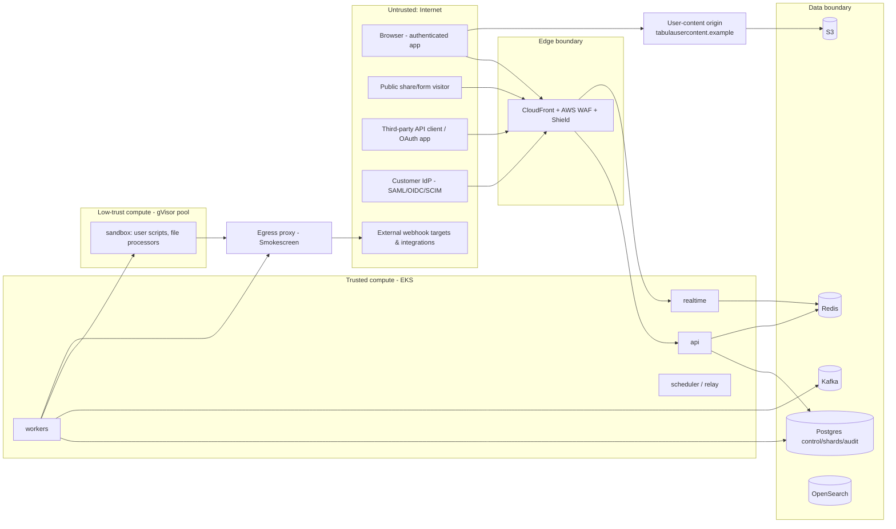
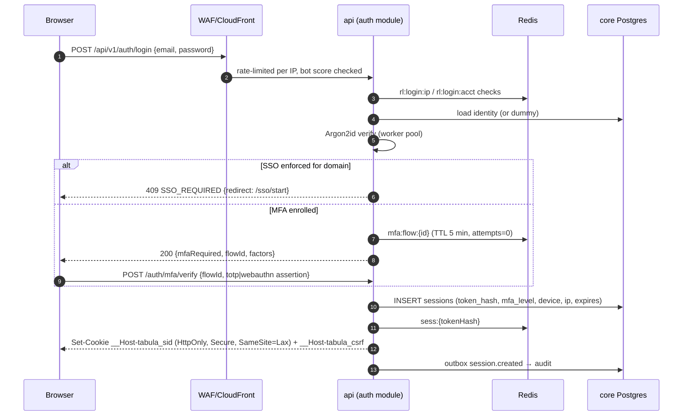
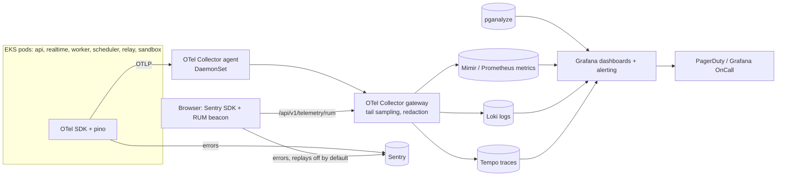
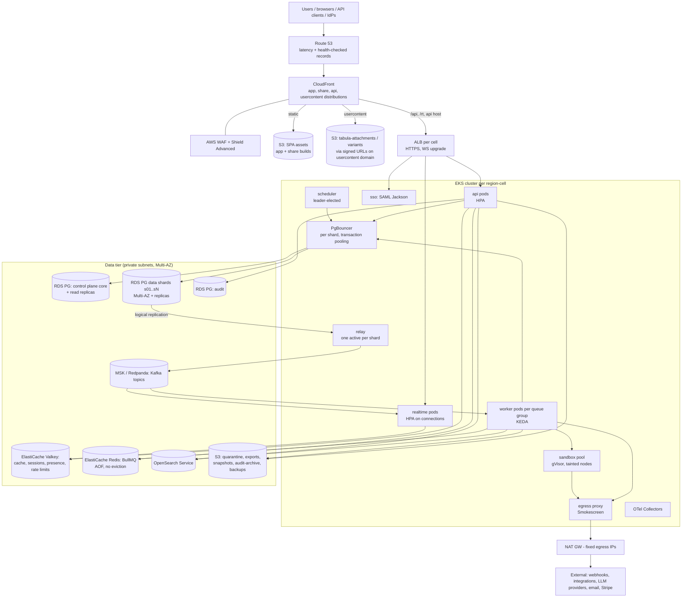

# 25 — Security, Observability & Infrastructure

> **Status:** Proposed · **Owner:** Security Engineering + Platform/SRE · **Date:** 2026-10-03
> Conforms to [`00-canonical-decisions.md`](./00-canonical-decisions.md) — in particular **D19** (auth), **D23** (infra), **D24** (observability), **D4** (tenant isolation + RLS), **D12/D13** (Redis roles), **D15** (files), **D21** (sandboxed scripts), plus the table inventory (§5), Redis namespaces (§10) and buckets (§11).
> Labels: **[Observed]** · **[Inferred]** · **[Ours]** as defined in 00 §0. Unlabeled design text is **[Ours]**.

## Sections covered

| Section | Part | Topic |
|---|---|---|
| §42 | Part 39 | Security: threat model (STRIDE), authentication (Argon2id, HIBP k-anonymity, MFA TOTP/WebAuthn, recovery codes, step-up), sessions (opaque vs JWT), OAuth 2.1 server, SSO (SAML/OIDC via Jackson), SCIM 2.0, CSRF, XSS/CSP/user-content domain, SQL injection, SSRF/egress proxy, file upload security, formula/script sandboxing, encryption & BYOK, secrets management, API keys, rate limiting & abuse, tenant isolation tests, audit logging, supply chain, secure SDLC, pen-testing & bug bounty, compliance readiness, incident response |
| §43 | Part 40 | Observability: tooling choice, structured logging, metrics (RED/USE + domain), distributed tracing (HTTP/Kafka/BullMQ/WS), error tracking, frontend performance monitoring, DB monitoring, SLOs & alerts, dashboards, on-call |
| §44 | Part 41 | Infrastructure: production topology, regions & cells, network, container images, Kubernetes justification, EKS layout (namespaces, node pools, gVisor sandbox pool), autoscaling (HPA/KEDA), CI/CD (GitHub Actions → Argo CD/Rollouts), feature flags, environments, secrets, migrations in deploys, backups, disaster recovery, cost model |

Related: [`04-database-architecture.md`](./04-database-architecture.md), [`05-sql-schema.md`](./05-sql-schema.md), [`14-automation-engine.md`](./14-automation-engine.md), [`15-events.md`](./15-events.md), [`16-realtime.md`](./16-realtime.md), [`17-api-architecture.md`](./17-api-architecture.md), [`18-search-attachments-collaboration.md`](./18-search-attachments-collaboration.md), [`19-permissions-and-multitenancy.md`](./19-permissions-and-multitenancy.md), [`20-import-export-sharing-integrations.md`](./20-import-export-sharing-integrations.md), [`21-ai-architecture.md`](./21-ai-architecture.md), [`22-audit-history-undo-trash.md`](./22-audit-history-undo-trash.md), [`23-notifications-jobs-caching-performance.md`](./23-notifications-jobs-caching-performance.md), [`24-frontend-grid-state-design-system.md`](./24-frontend-grid-state-design-system.md), [`26-architecture-style-stack-repo-services.md`](./26-architecture-style-stack-repo-services.md), [`27-data-flows-transactions-migrations.md`](./27-data-flows-transactions-migrations.md), [`28-testing-and-edge-cases.md`](./28-testing-and-edge-cases.md), [`33-architecture-decision-records.md`](./33-architecture-decision-records.md).

---

# §42 — Security (Part 39)

## 42.1 Security principles

1. **Tenant isolation is the #1 property.** A cross-tenant read is a company-ending bug; every layer (routing, query builder, RLS, caches, search, files, events) independently scopes by tenant (D4, doc 19).
2. **Default deny, least privilege** — for users (RBAC + restrictions), services (IAM per role), networks (egress via proxy only), and code (sandbox without ambient credentials).
3. **Secrets never in plaintext at rest, never in logs, never in the browser** beyond the HttpOnly cookie.
4. **Untrusted content is rendered, never executed** — user HTML/Markdown/SVG/attachments are sanitized or served from an isolated origin.
5. **Everything security-relevant is audited** (`audit.audit_events`) and alertable.
6. **Secure by default for customers** (MFA prompts, safe sharing defaults, short-lived links), configurable upward by Enterprise policy.

## 42.2 Threat model

### 42.2.1 Assets

| Asset | Sensitivity | Where |
|---|---|---|
| Customer base content (cells, attachments, comments) | High (may include PII/PHI/financial) | data shards, S3, OpenSearch, Kafka, backups |
| Credentials: password hashes, MFA secrets, session tokens, API tokens, OAuth tokens, integration credentials, workspace secrets | Critical | `core.user_identities`, `core.user_mfa_factors`, `core.sessions`, `core.api_tokens`, `core.oauth_grants`, `data.integration_connections`, `data.secrets` |
| Tenant configuration & permissions | High | control plane |
| Audit trail | High (integrity) | audit store, S3 archive |
| Signing/encryption keys | Critical | AWS KMS, Secrets Manager |
| Platform availability | High | all |

### 42.2.2 Trust boundaries



### 42.2.3 STRIDE summary

| Component | S — Spoofing | T — Tampering | R — Repudiation | I — Info disclosure | D — DoS | E — Elevation |
|---|---|---|---|---|---|---|
| Login / identity | Credential stuffing, phishing, SSO assertion forgery → Argon2id, HIBP, MFA/WebAuthn, rate limits, SAML signature + audience + replay checks | Session fixation → rotate on auth | Audit `session.created`, IP/UA recorded | Account enumeration → uniform responses & timing | Login floods → WAF + per-IP/account limits | MFA bypass via recovery → recovery codes single-use, step-up for factor changes |
| REST API | Stolen PAT/OAuth token → hashed tokens, scopes, expiry, leak scanning, IP allowlists (Enterprise) | Parameter tampering → server-side authz on every resource (doc 19), `If-Match` | Actor on every change (`base_changes`, `audit_events`) | IDOR across tenants → tenant-scoped repos + RLS + 404 semantics | Expensive queries → per-token/base limits, query cost guard, timeouts | Role escalation via grants API → `base.manage_members` checks, max-role constraint (cannot grant above own role) |
| Realtime | Ticket replay → single-use `jti`, 60 s | Forged ops → same command handlers as REST | ops logged in `base_changes` | Subscribing to foreign base → permission check at subscribe + on `perm_epoch` change | Connection floods → per-user/IP connection caps | — |
| Public shares/forms | Guessing share tokens → 128-bit tokens, 404 rate limits | Form field injection → field-engine validation, hidden fields server-enforced | `form.submitted` with IP hash | Leaking hidden fields via share → server-side field projection per share config | Form spam → Turnstile/WAF/rate limits | Share link → edit access → share links are read-only/submit-only by type |
| Automations / scripts / webhooks | Inbound webhook spoofing → secret URL token + optional HMAC verification | Script tampering with other tenants → isolate per run | `automation_runs`, `automation_step_runs` | SSRF to metadata/VPC → egress proxy; secrets exfil → scoped secret injection | Infinite loops → causation depth (8), budgets | Sandbox escape → isolated-vm inside gVisor, no credentials, seccomp |
| Files | Content-type spoofing → magic-byte detection | Malicious files → ClamAV, quarantine | `attachment.*` events | Stored XSS via HTML/SVG → user-content domain + CSP sandbox + `Content-Disposition` | Decompression bombs → limits | Image library RCE → processors in sandbox pool |
| Admin console / staff | Staff account takeover → SSO + hardware keys, VPN/ZTNA | — | All staff actions audited, customer-visible | Staff browsing data → `support_access_grants` (customer-approved, time-boxed) | — | Over-privileged staff → JIT elevation, 2-person approval for prod DB access |
| Infra / supply chain | Compromised CI → OIDC to AWS, signed images, branch protection | Malicious dependency → Socket/OSV scanning, lockfile, min release age | Git signed commits for release branches | Secrets in repos → push protection | — | Pod escape → PSS restricted, read-only root FS, no privileged pods |

## 42.3 Authentication

### 42.3.1 Passwords

* Hash: **Argon2id**, parameters **m = 64 MiB, t = 3, p = 1**, 16-byte salt, 32-byte output (above OWASP's minimum of m=19 MiB/t=2), tuned to ~150–250 ms on api pods. Stored as PHC string in `core.user_identities` (`provider = 'password'`), so parameters can be upgraded: on successful login with outdated params → rehash transparently.
* **Pepper:** HMAC-SHA256(pepper, password) before Argon2id; pepper stored in AWS Secrets Manager (versioned; PHC string records pepper version for rotation).
* **CPU protection:** hashing runs in a bounded worker-thread pool (`piscina`, size = vCPU − 1) per api pod with a queue cap; overload → 503 with `Retry-After` rather than starving the event loop. Login endpoints rate-limited before hashing.
* Policy: min length 10 (NIST 800-63B: length over composition), max 128, no composition rules, Unicode NFKC normalization, paste allowed (WCAG 3.3.8), zxcvbn-ts strength meter (advisory) and **breach check** (below). Org policy may raise min length/require SSO.
* Uniform responses for "unknown email" vs "wrong password" (same message, same timing — compute a dummy hash for unknown users).

### 42.3.2 Breached-password check (HIBP k-anonymity)

* On signup/password change (and, opportunistically, on login with weekly cache per identity): SHA-1(password) → send the **first 5 hex chars** to `https://api.pwnedpasswords.com/range/{prefix}` with `Add-Padding: true`; compare suffixes locally. The password and full hash never leave our servers.
* Requests go through the egress proxy; responses cached in Redis `hibp:{prefix}` (TTL 24 h) — prefix is non-sensitive.
* Hit with count ≥ 1 → reject on signup/change; on login → force password change after MFA. **Fail open** (if HIBP is down, allow and log) — availability over a defense-in-depth check.

### 42.3.3 Multi-factor authentication

| Factor | Details |
|---|---|
| **TOTP** (RFC 6238) | 160-bit secret, SHA-1, 6 digits, 30 s step, accept ±1 step; **replay prevention**: store last accepted step counter per factor in `core.user_mfa_factors` and reject reuse. Secret envelope-encrypted (42.14). Enrollment requires confirming a code. |
| **WebAuthn / passkeys** | `@simplewebauthn/server`; RP ID `tabula.example`; `userVerification: 'preferred'` (required for passwordless passkey login), attestation `none` (Enterprise may require `direct` + AAGUID allowlist for hardware keys); sign counter checked (warn on regress for non-synced authenticators); credential public key + transports stored in `core.user_mfa_factors`. Challenges stored in Redis `webauthn:chal:{sessionOrFlowId}` (TTL 5 min, single-use). |
| **Recovery codes** | 10 codes × 10 chars (base32 Crockford, ~50 bits each) shown once; stored as HMAC-SHA256(pepper, code) (high entropy ⇒ fast hash fine); single-use; regenerating invalidates old set; using one triggers an email + audit event. |
| SMS | **Not offered** (SIM swap risk); may be added only as a recovery-notification channel. |

Org policy `require_mfa` (in `organization_policies`) blocks access to org resources until enrollment (grace period configurable). SSO-authenticated users rely on the IdP's MFA (we record `amr` when provided).

### 42.3.4 Login flow



### 42.3.5 Account protection

* **Lockout:** no hard lockout (DoS vector). Progressive throttling: per account 5 failures/15 min → each further attempt requires solving a WAF CAPTCHA challenge and adds exponential delay (cap 30 s); per IP 50 failures/15 min → block 15 min at WAF. Successful login from a new device/country → email notification with "this wasn't me" (revoke all sessions + force reset).
* **Email verification** before creating workspaces with sharing or sending automation emails; token in Redis `emailverify:{hash}` (TTL 24 h).
* **Password reset:** 256-bit token, stored hashed in Redis `pwreset:{hash}` (TTL 30 min, single-use), link to `/reset#token` (fragment, not logged by servers/proxies); on success all sessions are revoked; PATs are kept (revoking would break integrations) but the user is shown active tokens to review.
* **Email change:** confirm on new address + notify old address with 72 h revert link.
* **Step-up authentication** (re-auth within last **10 minutes** via password/MFA/WebAuthn or IdP re-auth with `prompt=login`/`ForceAuthn`): required for changing password/email/MFA factors, creating API tokens or OAuth app secrets, viewing integration credentials, exporting full base data, deleting workspaces/bases, changing SSO/SCIM/org security policies, granting org admin, starting support access grants. Implemented as `requireRecentAuth(maxAgeSec)` middleware reading `sessions.last_auth_at`/`mfa_level`; failure returns `401 STEP_UP_REQUIRED` with allowed methods; the SPA shows a re-auth dialog and retries.

## 42.4 Session management

### 42.4.1 Opaque tokens vs JWT

| Concern | Opaque token (DB/Redis lookup) | Stateless JWT |
|---|---|---|
| Revocation (logout, password change, admin deactivate, SCIM deprovision) | Immediate (delete row + Redis key) | Requires denylist or short TTL + refresh dance |
| Lookup cost | 1 Redis GET per request (~0.3 ms), PG on miss | Signature verify only |
| Size / leakage | 32 bytes random; no information | Claims readable; larger cookies |
| Key compromise blast radius | DB hash only (useless without token) | Signing key compromise forges any user |
| Fit for WS gateway | Needs lookup at connect | Natural |

**Decision (D19):** **opaque session tokens for first-party browser sessions**. **Short-lived JWTs only** for (a) **realtime tickets** (60 s, single-use) and (b) **service-to-service** calls (e.g., sandbox → API callback, worker → internal endpoints) — both short-lived enough that revocation isn't needed.

### 42.4.2 Session token design

* Token: 32 random bytes (CSPRNG) → base64url; cookie `__Host-tabula_sid` (no `Domain`, `Path=/`, `Secure`, `HttpOnly`, `SameSite=Lax`). `__Host-` prefix pins it to the app origin.
* Stored: `core.sessions.token_hash = SHA-256(token)` (high entropy ⇒ no slow hash), plus `user_id`, `org context`, `created_at`, `last_seen_at`, `last_auth_at`, `mfa_level` (`none|totp|webauthn|sso`), `auth_method`, `device_label` (parsed UA), `ip`, `ip_country`, `idle_expires_at`, `absolute_expires_at`, `revoked_at`, `rotated_from`.
* Cache: Redis `sess:{tokenHash}` → compact session JSON, TTL = min(remaining idle, 10 min). Cache invalidation on revoke publishes on `sess-revoke` pub/sub so realtime pods drop sockets of that session immediately.
* **Timeouts** (defaults; org policy can tighten): idle **14 days**, absolute **30 days** for standard orgs; Enterprise configurable idle 15 min–30 days, absolute 1–90 days. `last_seen_at` updated at most every 5 min (write amplification guard).
* **Rotation:** new token on login, MFA completion, step-up, privilege change (org role change), and every **24 h** of activity; the previous token remains valid for a **60 s grace** (concurrent in-flight requests/tabs) via `rotated_from`. Reuse of a rotated token after grace → revoke the whole session (theft signal) and audit.
* **Device list** (`/settings/security`): sessions with device, location (country/city from IP), last active, current marker; revoke one / revoke all others. Admins can revoke all sessions of an org member; SCIM deactivation and password change revoke all sessions.
* **Realtime ticket:** `POST /v1/auth/ws-ticket` → JWT `{iss:'tabula-api', aud:'tabula-realtime', sub: userId, sid: sessionIdHash, bases?: [...], jti, exp: now+30s}` signed **EdDSA (Ed25519)** with keys from Secrets Manager (`kid` rotation, JWKS shared internally). Gateway verifies, enforces single use via Redis `SET ws:ticket:{jti} NX EX 60`, binds the socket to `sid`; re-validates the session every 5 min and on `sess-revoke` events.
* **Service-to-service JWT:** `aud` = target role, `exp` ≤ 5 min, carries `org_id`/`workspace_id` scope and `run_id` for sandbox callbacks; never accepted on public endpoints. In-cluster traffic additionally restricted by NetworkPolicies (44.6).

## 42.5 OAuth 2.1 authorization server (third-party apps)

* **Library decision:** `oidc-provider` (panva; OpenID-certified, supports OAuth 2.1 profiles, PKCE, refresh rotation, DPoP, PAR) with a custom adapter persisting to `core.oauth_clients`, `core.oauth_authorization_codes`, `core.oauth_grants`, vs fully in-house. Chosen: **oidc-provider** — correctness of edge cases (redirect matching, code replay, PKCE) is hard; we own storage, consent UI and token formats.
* Grants: **authorization code + PKCE (S256 mandatory)** for all clients (public & confidential); **client credentials** only for org-owned service integrations (prefer service-account tokens). No implicit, no ROPC (OAuth 2.1).
* Redirect URIs: exact string match, HTTPS only (loopback `http://127.0.0.1:{port}` allowed for native apps per RFC 8252).
* Client auth (confidential): `private_key_jwt` preferred, `client_secret_basic` allowed (secret hashed, shown once).
* **Scopes** (ours): `data.records:read`, `data.records:write`, `data.recordComments:read|write`, `schema.bases:read|write`, `webhook:manage`, `user.email:read`, `workspacesAndBases:read`, `automations:read`, `offline_access` (refresh tokens). Plus **resource selection** at consent time: the user picks workspaces/bases the app can access (stored on the grant), intersected with the user's own permissions at each request.
* Access tokens: opaque `tab_oat_<id>_<secret>`, TTL **1 h**, stored hashed; introspection via Redis cache.
* **Refresh tokens:** `tab_ort_<id>_<secret>`, **rotated on every use**; `core.oauth_grants` holds the token *family* (`family_id`, `current_refresh_hash`, `generation`, `previous_refresh_hash`). Presenting a previous generation's token (outside a 30 s race grace) ⇒ **reuse detected** → revoke the whole family + all access tokens, audit `oauth.refresh_reuse_detected`, notify user. Idle lifetime 30 days, absolute 1 year (re-consent).
* Consent screen shows app name, verified publisher badge (manual review for public listing), scopes in plain language, selected resources; org admins can restrict third-party apps (allowlist) via `organization_policies`.
* PAR (RFC 9126) and DPoP (RFC 9449) supported for high-security clients (V1+ optional).

## 42.6 Enterprise SSO (SAML / OIDC via Jackson)

* **BoxyHQ SAML Jackson** self-hosted (D19) as an internal service (`sso` deployment, own Postgres schema in the control cluster) behind our `SsoProvider` interface; Jackson converts SAML/OIDC IdP logins into an OAuth code flow consumed by our auth module. WorkOS is the buy-alternative behind the same interface.
* `core.sso_connections` stores our side (org, Jackson tenant/product refs, enforced flag, default role, attribute mapping); Jackson stores IdP metadata/certs.
* SAML hardening: signed assertions **required** (response or assertion), SHA-256+; audience & recipient & destination checks; `NotBefore/NotOnOrAfter` with **2 min skew**; `InResponseTo` validation for SP-initiated; assertion ID **replay cache** (Redis, TTL = assertion validity); XML signature wrapping defenses (Jackson uses hardened libs; we run SAML conformance fuzz tests); IdP-initiated SSO **disabled by default**, opt-in per connection with RelayState allowlist.
* OIDC: auth code + PKCE, `state` + `nonce`, `iss` check (RFC 9207), ID token signature from IdP JWKS.
* **Domain verification:** `core.organization_domains` verified by DNS TXT `tabula-verification=<token>` (re-verified weekly). With **SSO enforcement**, users whose email is on a verified domain must log in via SSO (password login rejected with `SSO_REQUIRED`); **break-glass**: org owners may keep a password+WebAuthn login (policy toggle, audited).
* **JIT provisioning:** first SSO login creates `core.users` + `organization_members` (role from mapping, default `member`), group claims mapped to teams if SCIM is not used. Email change via IdP is matched on stable `NameID`/`sub` stored in `user_identities`, not email.
* Session lifetime for SSO users follows org policy; optional `ForceAuthn` for step-up.

## 42.7 SCIM 2.0

* In-house SCIM server (`/scim/v2/{directoryId}`) implementing `Users`, `Groups`, `ServiceProviderConfig`, `ResourceTypes`, `Schemas`; filtering (`userName eq`, `externalId eq`), PATCH (RFC 7644 incl. Entra ID quirks), pagination.
* Auth: bearer token per directory (`tab_scim_<id>_<secret>`), stored hashed in `core.scim_directories`, rotatable; IP allowlist optional.
* Semantics: `active=false` → deactivate user in the org (revoke sessions, PATs owned for that org disabled, OAuth grants revoked), keep content attribution; DELETE → same as deactivate (no hard delete of identity to preserve audit). Groups ↔ `teams` via `core.scim_group_mappings`; grants to teams flow from doc 19.
* Conformance: Okta SCIM test suite and Entra ID validator in CI against a staging directory; idempotent handling of retries.

## 42.8 CSRF and origin model

* **Origin topology:** the SPA is served from `app.tabula.example`; first-party API calls go **same-origin** to `app.tabula.example/api/v1/*` and WS to `app.tabula.example/rt` (CloudFront path behaviors → ALB). The public API host `api.tabula.example` accepts **bearer tokens only** and **rejects cookies** (ignores `Cookie` header entirely). This removes CORS-with-credentials from the design and confines CSRF surface to the app origin.
* Defenses on cookie-authenticated, state-changing requests:
  1. `SameSite=Lax` session cookie (blocks cross-site subresource/POST requests).
  2. **Signed double-submit token**: cookie `__Host-tabula_csrf` (non-HttpOnly) = `base64url(random) + '.' + HMAC(key, sessionId + random)`; the SPA echoes it in `X-CSRF-Token`; server checks header == cookie and HMAC binds it to the session (defeats cookie-injection from sibling subdomains).
  3. `Origin` (fallback `Sec-Fetch-Site`) must be `https://app.tabula.example` for non-GET.
  4. No state changes on GET.
* Login CSRF: login/SSO-start forms carry a pre-session CSRF token; OAuth/SSO flows use `state`.
* Public forms (share origin) are unauthenticated; spam/abuse controls apply instead (42.17).

## 42.9 XSS & content security

* **React escaping** by default; `dangerouslySetInnerHTML` banned by ESLint except in `@tabula/ui/SafeHtml`, which requires a `TrustedHTML` from our DOMPurify policy.
* **Rich text** (long text rich mode) is stored as **ProseMirror JSON**, not HTML (00 §4: `{doc, plain}`). Rendering maps nodes/marks through our schema → no HTML injection path. Server validates documents against the schema (unknown nodes/marks/attrs dropped; link `href` restricted to `http`, `https`, `mailto`, `tel`).
* **HTML ingestion** (paste from web, imports, email-to-record, rich text from API in HTML form): sanitized **server-side** with DOMPurify (jsdom) using an allowlist profile, then converted to ProseMirror JSON; **client-side** DOMPurify again before any HTML is inserted (paste preview). Same profile in both places (shared config package).
* **Markdown** (comments, descriptions, interface text elements): `markdown-it` with `html: false`, `linkify`, safe link validator, `rel="noopener noreferrer ugc nofollow"` and `target=_blank` for external links.
* **URL fields / buttons:** open only `http(s)`, `mailto`, `tel`; others rendered as text. `javascript:`/`data:` blocked at write time and render time.
* **CSP** (app origin; SPA shell is static from S3/CloudFront):
  * Static shell → **hash-based** strict CSP (the shell's single inline bootstrap script is hashed at build): `script-src 'sha256-…' 'strict-dynamic'; object-src 'none'; base-uri 'none'; frame-ancestors 'none'; require-trusted-types-for 'script'; trusted-types tabula-dompurify default; connect-src 'self' https://*.sentry.io; img-src 'self' https://*.tabulausercontent.example data: blob:; style-src 'self' 'unsafe-inline'`(vanilla-extract emits static CSS; `'unsafe-inline'` style kept only for Radix positioning styles — inline style attributes, not scripts); `report-to csp`.
  * **Server-rendered pages** (auth pages rendered by api, OAuth consent, SSO interstitials, share-page OG shell when rendered by edge function) → **per-response nonces** (`script-src 'nonce-{128-bit}' 'strict-dynamic'`). Both patterns are "strict CSP"; nonces need dynamic HTML, hashes suit static shells — we use each where it fits.
  * CSP violation reports → `/api/v1/csp-reports` → logs/metrics (sampled).
  * Additional headers: `X-Content-Type-Options: nosniff`, `Referrer-Policy: strict-origin-when-cross-origin`, `Permissions-Policy` (camera/mic/geolocation off except where used), `Cross-Origin-Opener-Policy: same-origin`, `Cross-Origin-Resource-Policy: same-site`.
* **User-content domain:** attachments and previews are served from **`*.tabulausercontent.example`** (separate registrable domain → no cookie/origin sharing with the app) via CloudFront signed URLs (short TTL, 1 h default, bound to attachment & variant). For active types (HTML, SVG, XML, PDF in-browser) responses add `Content-Security-Policy: sandbox; default-src 'none'; img-src 'self'; style-src 'unsafe-inline'` and `Content-Disposition: attachment` unless previewing an inert type; SVG thumbnails are **rasterized** server-side. PDF preview uses pdf.js inside a sandboxed iframe on the user-content origin.
* **Embeds & extensions:** interface embed elements and future custom extensions run in `<iframe sandbox="allow-scripts">` on per-base subdomains of the user-content domain (`{baseHash}.ext.tabulausercontent.example`), communicating via a validated `postMessage` API with origin checks.
* **Interface/branding:** no arbitrary CSS/HTML from users (doc 24 §41.5).

## 42.10 SQL injection

* **Kysely** query builder with bound parameters everywhere (D17). Dynamic SQL is inherent (user-defined fields, filters) — it is generated only from **server-side metadata**:
  * Table identifiers are fixed (`data.records`, sidecars). No per-user DDL (D6).
  * Field references compile to JSONB access by **slot**: `cells -> '12'`. Slots come from `data.fields` loaded for the table and are validated as integers in `[1, next_field_slot)` (`assertSlot(n)` throws otherwise); the key is emitted via a parameter or a whitelisted literal from an integer — never from client strings.
  * Sort/filter operators map through a closed enum → SQL fragment table; values are always parameters; `LIKE`/`ILIKE` patterns escaped (`%`, `_`, `\`).
  * Collation/locale names from an allowlist.
* `sql.raw` / `sql.lit` usage restricted by a custom ESLint rule to `apps/server/src/db/unsafe/**` (CODEOWNERS: Security + DB team review); Semgrep rule in CI as backup.
* The filter compiler (doc 11) is property-tested with fast-check: random ASTs with adversarial strings (quotes, `--`, unicode, null bytes) must yield SQL whose text contains no user value (only `$n` params).
* Least privilege DB roles: `app_rw` (no DDL, no `BYPASSRLS`), `app_ro` (replicas), `migrator` (DDL; only used by migration jobs), `relay` (`REPLICATION`), `readonly_analyst` (masked views). `statement_timeout` per role (api 15 s, workers 120 s).
* Formula regex functions run in JS with **RE2** (`re2-wasm`) — no catastrophic backtracking; Postgres regex never receives user patterns for large scans without a timeout.

## 42.11 SSRF & egress control

All user-directed outbound HTTP — outbound webhooks, automation "send HTTP request" actions, scripts' `fetch`, integration API calls, import-from-URL, attachment-from-URL, URL unfurls, HIBP — goes through **`@tabula/egress`**, a client that *only* talks to the **egress proxy**.

* **Proxy:** **Smokescreen** (Stripe's CONNECT/HTTP proxy) as a Deployment in the `egress` namespace with dedicated NAT gateway EIPs (published so customers can allowlist our IPs).
* Rules: deny RFC 1918, loopback, link-local (`169.254.0.0/16` incl. IMDS `169.254.169.254`), `100.64.0.0/10` (CGNAT), `0.0.0.0/8`, multicast, `fc00::/7`, `fe80::/10`, `::1`, IPv4-mapped IPv6 forms, our VPC CIDRs and AWS service endpoints; ports allowlist `80, 443, 8080, 8443` (others via Enterprise allowlist).
* **DNS rebinding protection:** Smokescreen resolves the hostname once, validates the **resolved IP**, and connects to that IP (no second resolution); redirects are followed by our client (max 5) and each hop re-validated through the proxy.
* Defense in depth: Kubernetes NetworkPolicies/Security Groups deny direct internet egress from `workers`, `sandbox`, `api` pods except to the proxy and AWS VPC endpoints; **IMDSv2 required with hop limit 1** (pods can't reach node metadata; IRSA/Pod Identity for AWS creds).
* Limits: connect timeout 5 s, total 30 s (webhooks 10 s), response body ≤ 10 MB (imports: stream to S3 with plan limit), header size ≤ 64 KB, no `file://`/`gopher://` (scheme allowlist).
* Per-tenant identity: proxy requests carry `X-Tabula-Egress-Role` (`webhook|automation|integration|import|unfurl`) + `workspace_id` for logging and per-tenant rate limiting; abuse (scanning) detection alerts on high deny rates.

## 42.12 File upload security

Pipeline (D15, detail in doc 18): presigned multipart upload → `tabula-uploads-quarantine` → scan → promote to `tabula-attachments`.

* Presigned policy: exact key (`{workspaceId}/{baseId}/{attachmentId}/original`), `content-length-range` ≤ plan max file size, expiry 15 min, checksum (`x-amz-checksum-sha256`) required.
* After upload: **magic-byte type detection** (`file-type`) overrides client MIME; mismatch flagged; executables/scripts allowed as files but always served `Content-Disposition: attachment`.
* **ClamAV** scan (`file-scan` queue; signatures updated hourly; files > 2 GB scanned by streaming or flagged `unscanned_large` per policy); Enterprise option: second engine via a commercial scanning API. Infected → `attachment.rejected`, object deleted from quarantine, user notified.
* **Processing in sandbox pool** (gVisor, 44.5): libvips for images (with `VIPS_BLOCK_UNTRUSTED=1` to disable risky loaders), ffmpeg (protocol whitelist `file`, no network), pdfium for PDF previews; **ImageMagick/Ghostscript banned**. Resource limits: max pixels 100 MP, decompression ratio guard for archives (no server-side unzip except imports with 1:100 ratio and entry-count caps).
* Thumbnails strip EXIF/GPS; originals preserved as uploaded (user data) but served from the user-content domain.
* Downloads: CloudFront signed URLs (1 h default; Enterprise configurable shorter) issued only after a permission check on the record/field; signed URL scope = single object.
* Public shares exposing attachments get separate signed URLs that respect share expiry/revocation (URLs minted per page load).

## 42.13 Formula & script sandboxing

* **Formulas:** no `eval`/`Function` (D8); evaluation via compiled closures over a typed AST; per-evaluation **step budget** (e.g., 100k operations) and string-size caps (1 MB intermediate); RE2 for regex; recursion depth bounded by `MAX_FORMULA_DEPTH`.
* **Scripts** (automation script steps, script buttons; D21):
  * Executed in the **sandbox** role: `isolated-vm` isolates (one per run) inside pods running under **gVisor** (`runtimeClassName: gvisor`) on a dedicated tainted node pool, with seccomp `RuntimeDefault`, read-only root FS, non-root, no service account token, no IRSA role.
  * Limits: memory 128 MB per isolate, wall time 30 s (plan-dependent up to 120 s), CPU time accounting, max output 1 MB, max 50 API calls/run.
  * No ambient credentials: the script API (`base.getTable`, `fetch`, `secrets.get(name)`) is implemented by **host functions** that call back to the API with a **run-scoped service JWT** (aud `api-internal`, scope = workspace/base, `run_id`, exp = run timeout) → every call is permission-checked as the automation's owner/service identity.
  * `fetch` only via the egress proxy; secrets injected by name from `data.secrets`, decrypted just-in-time, and **redacted** from logs/outputs (exact-match scrubber).
  * Heavier workloads (V1+): Firecracker microVM or Deno subprocess runner behind the same `ScriptRunner` interface (D21).

## 42.14 Encryption

* **In transit:** TLS 1.2+ only at the edge (CloudFront security policy `TLSv1.2_2021`; ALB `ELBSecurityPolicy-TLS13-1-2-2021-06`), TLS 1.3 preferred; **HSTS** `max-age=63072000; includeSubDomains; preload` on all our domains (and preload-listed). Internal: RDS `rds.force_ssl=1` with `sslmode=verify-full`; ElastiCache in-transit encryption + AUTH/RBAC; MSK TLS + IAM auth; OpenSearch HTTPS + fine-grained access control. Pod-to-pod traffic in-VPC is plain HTTP inside the cluster in MVP; V1 adds WireGuard node-to-node encryption (Cilium) for defense in depth.
* **At rest:** KMS CMKs (per environment, per data class) for RDS/Aurora storage, EBS, S3 SSE-KMS (bucket keys enabled for cost), ElastiCache, MSK, OpenSearch, backups (AWS Backup vault key).
* **Application-level envelope encryption** for high-value secrets: `data.secrets`, `data.integration_connections` credentials, `core.user_mfa_factors` TOTP secrets, webhook signing secrets, SSO client secrets.
  * Per-workspace **DEK** (AES-256-GCM) generated via KMS `GenerateDataKey`, stored **wrapped** with the workspace's KMS key alias; plaintext DEKs cached in memory ≤ 5 min (LRU), never persisted.
  * Ciphertext format: `v1.{kid}.{nonce96}.{ciphertext}.{tag}` with **AAD = `table:column:row_id:workspace_id`** to prevent ciphertext swapping between rows/tenants.
  * Library: our `@tabula/crypto` wrapping Node `crypto` (no hand-rolled primitives); key rotation = new DEK version; lazy re-encryption on write + background job.
* **BYOK (Enterprise):** customer-managed KMS key in the customer's AWS account with a key policy granting our role `Encrypt/Decrypt/GenerateDataKey/ReEncrypt*` (grants auditable by the customer in their CloudTrail).
  * Requires a **dedicated shard** (D4). Two layers: (1) the shard's RDS storage, snapshots and backups are encrypted with the **customer's key** (RDS accepts a cross-account KMS key in the same region when the key policy grants our account); (2) optionally, **field-level envelope encryption** of designated sensitive fields' cell values with DEKs wrapped by the customer key. Layer 2 makes those fields non-filterable/non-sortable server-side (no sidecar index, no search indexing) — a documented trade-off, opt-in per field (ADR).
  * Attachments for BYOK orgs: S3 SSE-KMS with the customer key (cross-account key usable by S3).
  * **Revocation = crypto-shredding:** if the customer disables the key, DEK unwrap fails → the org's data becomes unreadable; the platform surfaces `ENCRYPTION_KEY_UNAVAILABLE` and pauses automations/sync.
  * Key references stored in a proposed `core.org_encryption_keys` table (see Proposed additions).

## 42.15 Secrets management (platform)

* **Source of truth:** AWS Secrets Manager (per environment account), with automatic rotation for RDS credentials (or **IAM database authentication** for app roles to avoid static passwords — chosen for `app_rw`/`app_ro` via RDS Proxy/PgBouncer token refresh), Redis AUTH tokens, third-party API keys (Stripe, Anthropic, email provider).
* **Delivery to pods:** **External Secrets Operator** syncs to Kubernetes Secrets (etcd encrypted with KMS envelope); pods mount as files (not env vars where avoidable, to keep them out of crash dumps/`/proc/*/environ`); reload on rotation via checksum annotation rollouts or file watchers.
* **AWS credentials:** IRSA / EKS Pod Identity per role — no static IAM keys anywhere. CI uses **GitHub Actions OIDC** to assume deploy roles scoped per environment & repo/branch.
* **Developer secrets:** 1Password (team vault) + `op` CLI for local `.env` hydration; no prod secrets on laptops; prod access via JIT (Teleport or AWS IAM Identity Center with approval), session-recorded.
* **Leak prevention:** GitHub push protection + gitleaks pre-commit; log scrubbing (43.2); Sentry scrubbing.

## 42.16 API keys & tokens

| Token | Format | TTL | Storage |
|---|---|---|---|
| Personal access token | `tab_pat_<id>_<secret>` | user-chosen (default 90 days; org policy max) | `core.api_tokens` |
| Service account token | `tab_sat_<id>_<secret>` | ≤ 1 year, rotatable with overlap | `core.api_tokens` |
| OAuth access / refresh | `tab_oat_…` / `tab_ort_…` | 1 h / rotating | `core.oauth_grants` (+ cache) |
| SCIM bearer | `tab_scim_<id>_<secret>` | until rotated | `core.scim_directories` |
| Inbound webhook URL token | path segment, 32 bytes | until rotated | `data.inbound_webhooks` |

* `<id>` = base62 of the token's UUIDv7 (22 chars, the `tok_` display id without prefix) → O(1) lookup; `<secret>` = 32 random bytes base62 (43 chars) whose **last 6 chars are a CRC32 checksum** of the preceding part (lets scanners & our API reject typos/fakes without a DB hit, à la GitHub token format).
* Stored: `HMAC-SHA256(server_pepper, secret)` (fast hash is appropriate for 256-bit secrets; pepper prevents offline verification from a DB leak). Shown **once**; UI shows `tab_pat_…<last4>`, name, scopes, resources, created, last used (updated ≤ every 5 min), expiry.
* **Scopes** same vocabulary as OAuth (42.5) + **resource restrictions** (specific workspaces/bases) + optional IP allowlist (Enterprise). Effective permission = token scopes ∩ owner's current permissions (doc 19) — a demoted user's tokens lose access immediately.
* Creating tokens requires step-up (42.3.5); org admins can list/revoke members' tokens touching org resources, require expiry, or disable PATs (service accounts only).
* **Leak scanning:** join the **GitHub secret scanning partner program**: register regex `tab_(pat|sat|oat|ort)_[0-9A-Za-z]{22}_[0-9A-Za-z]{43}` and a verification endpoint `POST https://api.tabula.example/v1/security/secret-scanning/github` that verifies GitHub's ECDSA signature (keys fetched from GitHub's public key API, cached), checks the checksum and DB, **revokes** matching tokens automatically, emails the owner, and audits `api_token.revoked (reason=leaked_public)`. Also scan our own logs/support tickets for the pattern; Enterprise SIEM receives the event.

## 42.17 Rate limiting & abuse prevention

Layers: **AWS WAF** (managed rule groups: Core, Known Bad Inputs, IP reputation, Bot Control targeted; rate-based rules per IP per path group) → **edge** (CloudFront geo/abuse blocks) → **application limits** in Redis (GCRA token buckets, keys `rl:{scope}:{id}:{window}`, 00 §10) with `RateLimit-Policy`/`RateLimit` headers and 429 + `Retry-After` (00 §8) → **business budgets** (automation runs, emails, AI credits; `ratebudget:*`).

| Abuse case | Controls |
|---|---|
| **Signup abuse** (spam workspaces, free-tier farming, phishing hosting) | WAF CAPTCHA/Challenge on signup for low bot-score; disposable email domain blocklist; per-IP/ASN signup velocity; email verification required before sharing/automation emails/public forms; new-account trust score (age, verification, payment) gates limits; device fingerprint hash (privacy-reviewed) for repeat offenders |
| **Public form spam** | Honeypot field + time-to-submit heuristic; Cloudflare **Turnstile** (privacy-preserving, invisible; acceptable third-party) or AWS WAF CAPTCHA on suspicion; per-IP & per-form rate limits (default 10/min/IP, 1,000/h/form, owner-adjustable); payload size & attachment limits; link-count heuristic; owner-facing spam folder (`form.submitted` flagged) |
| **Share link brute force** | 128-bit random tokens (`shr_` + secret part) — infeasible to guess; still: per-IP 404 rate limit on `/s/*` (WAF), password-protected shares hash with Argon2id + per-share attempt throttling (5/min/IP) + lockout notifications; share link expiry & domain restriction options |
| **Automation email abuse** (phishing via our domain) | Emails sent from `notifications@mail.tabula.example` with user's name as display and `Reply-To` user address; never spoof customer domains (custom sending domains require DKIM/SPF verification — Enterprise); per-workspace daily caps by plan & trust score; new-workspace throttling; content scanning (URL reputation via Safe Browsing API, phishing keywords classifier); bounce/complaint handling → `core.email_suppressions`; automatic pause & review queue on complaint-rate > 0.1% |
| **API abuse / scraping** | Per-token, per-base and per-org limits; query cost guard (doc 17); anomaly alerts on export volume |
| **Crypto-mining / compute abuse in scripts** | CPU time limits, run budgets, egress anomaly detection, sandbox pool quotas per workspace |
| **Hosting malicious content** (attachments, public shares) | ClamAV, URL reputation for share pages, abuse report endpoint (`abuse@`, in-page "Report"), takedown tooling for Trust & Safety with audit |
| **Credential stuffing** | 42.3.5 controls + WAF ATP (Account Takeover Prevention) managed rule on login |

## 42.18 Tenant isolation testing

Tenant isolation is tested **continuously**, not just reviewed:

1. **Repository-layer guard:** all data-plane access goes through `TenantScopedDb` (Kysely plugin) which (a) sets `SET LOCAL app.workspace_id` per transaction, (b) asserts at query-compile time that every query on tenant tables includes a `workspace_id` predicate or uses an approved join path — violations throw in tests and log+block in prod.
2. **Postgres RLS** (D4) on all data tables: `USING (workspace_id = current_setting('app.workspace_id')::uuid)`; app role lacks `BYPASSRLS`; migrations CI check: every new tenant table has RLS enabled + policy (fails otherwise).
3. **Cross-tenant API fuzz suite** (nightly + on PRs touching routes): seeds tenants A and B; for **every OpenAPI operation**, replays requests as A with B's IDs (path, body, query, filter references, link targets, attachment ids, share tokens) → must return 404/403 and never B's data. Operation coverage is computed from OpenAPI; uncovered routes fail the job.
4. **Realtime & search isolation tests:** subscribe as A to B's base; search queries as A must not return B's docs (OpenSearch filter by accessible base ids); webhooks/automation events routed only to owner tenant.
5. **Cache key audits:** every Redis key namespace (00 §10) includes tenant/principal scope; unit tests assert key builders; schema/permission caches keyed by `baseId` + version.
6. **Production canaries:** synthetic tenants in each cell continuously attempt cross-tenant reads (expecting denial) and alert on any success (page Security on-call).
7. **Pen-test focus** on IDOR & isolation each cycle (42.21).

## 42.19 Audit logging

* Store: `audit.audit_events` (monthly partitions, hot 90 days; archived to `tabula-audit-archive` as Parquet with **S3 Object Lock** (compliance mode for Enterprise retention up to 7 years)); fed by the `tabula.audit.v1` topic (00 §7) from the audit writer.
* Event schema: `id, occurred_at, org_id, workspace_id?, base_id?, actor {type,id,ip,ua,session_id_hash,via, impersonator?}, action (canonical event name or admin action), target {type,id}, outcome (success|denied|failure), request_id, trace_id, metadata (diff of settings, never cell values)`.
* Audited: all identity events (00 §6 Identity group), member/role/grant changes, sharing changes, SSO/SCIM config and provisioning actions, token lifecycle, exports/downloads of full bases, admin policy changes, support access grants and every staff action under them, permission-denied events (sampled for high volume), webhook/integration connections, automation publishes, AI policy changes, key (BYOK) events.
* **Integrity:** append-only (writer role has `INSERT` only; no `UPDATE/DELETE` grants; partitions detached → archived), per-org daily **hash chain** (`hash_n = SHA-256(hash_{n-1} || canonical_event)`) with the daily root stored in the archive manifest → tamper evidence verifiable by customers on export.
* Customer access: Enterprise admin UI + API (`audit.read`), SIEM streaming via `audit_exports` (Splunk HEC, Datadog, S3 bucket delivery, generic webhook).

## 42.20 Dependency & supply-chain security

| Control | Tooling |
|---|---|
| Lockfile integrity | pnpm with `--frozen-lockfile`; `onlyBuiltDependencies` allowlist (install scripts disabled by default) |
| Vulnerability scanning | OSV-Scanner + `pnpm audit` in CI (fail on critical/high with fix available); GitHub Dependabot alerts |
| Malicious package detection | Socket.dev GitHub app (install scripts, typosquats, protestware) |
| Update hygiene | **Renovate** — grouped weekly PRs, `minimumReleaseAge: 3 days` (avoid freshly-compromised releases), automerge for patch dev-deps with green CI |
| Container base images | Chainguard/distroless Node images, rebuilt weekly; Trivy/Grype scan; no shell in runtime images |
| **SBOM** | Syft generates CycloneDX SBOM per image, attached as an OCI attestation |
| **Signing & provenance** | **cosign keyless (Sigstore)** signing via GitHub OIDC; SLSA build provenance via GitHub artifact attestations |
| Admission control | **Kyverno** policies: only signed images from our ECR with valid provenance; PSS `restricted`; no `:latest` |
| CI hardening | Actions pinned by commit SHA; `permissions: read-all` default; OIDC only; protected environments with required reviewers for prod; StepSecurity Harden-Runner for egress auditing |
| Code scanning | CodeQL + Semgrep (custom rules: `sql.raw`, `dangerouslySetInnerHTML`, direct `fetch` bypassing egress client, missing tenant scope) |
| Secrets in code | gitleaks pre-commit + GitHub push protection |

## 42.21 Secure SDLC, pen-testing & bug bounty

* **Design reviews:** features touching auth, permissions, sharing, files, scripts, integrations or AI require a lightweight threat model (template: assets, entry points, STRIDE table, abuse cases) reviewed by Security before build.
* **Code review:** CODEOWNERS require Security approval for `auth/`, `permissions/`, `db/unsafe/`, `egress/`, `crypto/`, `sandbox/`, CSP config.
* **Testing:** security unit tests (authz matrix per endpoint generated from doc 19's action table), DAST (OWASP ZAP baseline against staging nightly), fuzzing for parsers (formula, filter AST, CSV/XLSX import, SAML).
* **Third-party penetration tests:** before GA, then **annually** and before major launches (Enterprise SSO/BYOK, public API v2, extensions); scope: web app, API, realtime, share/forms, OAuth, file handling, sandbox escape, tenant isolation; reports summarized for customers under NDA.
* **Bug bounty:** private program on HackerOne or Bugcrowd at GA (invited researchers) → public 6–12 months later; safe-harbor policy; `security.txt` (RFC 9116) + `security@`; triage SLA: acknowledge 1 business day, triage 3 days; remediation SLAs: critical 7 days, high 30, medium 90; rewards scaled with tenant-isolation and auth bugs at top tier.

## 42.22 Compliance readiness

| Framework | Plan | Key enablers in this architecture |
|---|---|---|
| **SOC 2** Type I (pre-GA+3 mo) → **Type II** (12 mo window) | Compliance automation (Vanta or Drata) integrating AWS, GitHub, IdP, HRIS | Audit logs, access reviews (quarterly, via IdP groups), change management (PR + CI + Argo CD history), encryption, backups/DR drills, vendor management, incident response |
| **ISO/IEC 27001:2022** | After SOC 2 Type II; reuse controls (ISMS, risk register, SoA) | Same evidence; Annex A mapping |
| **GDPR / UK GDPR** | DPA with SCCs/UK IDTA; subprocessor list with notice; RoPA; DPIA for AI features | **Data residency** via region cells (EU cell: control-plane replica decision in 44.2), DSAR tooling (export user data, erasure across bases where user is subject), retention configs, backup erasure policy (deleted data ages out of backups ≤ 35 days + documented), AI data-use policy (no training on customer data) |
| **CCPA/CPRA** | Service-provider terms | same tooling |
| **HIPAA** (later, Enterprise) | BAA; HIPAA-eligible AWS services only; dedicated shard; audit retention; AI features restricted to providers under BAA or disabled; attachments in dedicated bucket prefix with BYOK option | Dedicated shard + BYOK + audit integrity |
| **Accessibility** (VPAT/ACR) | WCAG 2.2 AA conformance report | doc 24 §38.10/§41.7 |

## 42.23 Security incident response

* Severity levels SEV1–SEV4 with a security-specific track (data exposure, account compromise, malware, abuse). Roles: Incident Commander, Security Lead, Comms, Scribe.
* Runbooks: leaked credential (rotate via Secrets Manager + forced rollouts), compromised user/token (revoke sessions/tokens, audit trail export), tenant isolation bug (feature-flag kill switch, forensic queries over `base_changes`/audit, customer notification), malicious file campaign, sandbox escape suspicion (drain sandbox pool, rotate node pool).
* **Kill switches** via feature flags: disable public shares, disable scripts, disable outbound webhooks, read-only mode per cell.
* Notification obligations: GDPR 72 h to supervisory authority (controller customers notified "without undue delay" — contractual 48 h target); forensic evidence preserved (CloudTrail, VPC flow logs, audit, logs retained ≥ 1 year in cold storage).

---

# §43 — Observability (Part 40)

## 43.1 Goals

1. Answer "is Tabula healthy for **this customer** right now?" within 2 minutes (tenant-aware signals).
2. Every request, job, event and realtime frame is traceable end-to-end via one `trace_id` / `correlationId`.
3. SLOs drive alerting (symptoms, not causes); dashboards help diagnose causes.
4. No customer content or secrets in telemetry; PII minimized and redacted.
5. Cost-bounded: cardinality and log volume are budgeted.

## 43.2 Tooling choice

| Option | Strengths | Weaknesses | Cost profile |
|---|---|---|---|
| **Grafana LGTM** (Loki, Grafana, Tempo, Mimir) — Grafana Cloud or self-hosted | OSS, OTel-native, no per-host pricing, PromQL ecosystem, self-host escape hatch, unified Grafana UI | Loki needs label discipline (not full-text indexed); self-hosting at scale is real SRE work | Grafana Cloud usage-based; self-hosted mostly S3 + compute |
| **Datadog** | Best-in-class integrated UX (APM, RUM, DB monitoring, logs, security), fastest time to value | Expensive at scale (per-host + custom metrics + indexed logs + APM spans); custom metric cardinality bills; lock-in | High and grows superlinearly with tenants/hosts |
| **Honeycomb** | Superb high-cardinality event exploration (BubbleUp), trace-first debugging; great for per-tenant questions | Not a metrics/logs platform replacement; separate tool for infra metrics | Event-volume based; good with sampling |

**Decision (D24):** **OpenTelemetry everywhere** (vendor-neutral instrumentation) → **OTel Collector** (agent DaemonSet + gateway Deployment) → **Grafana Cloud** (managed LGTM) from MVP through V1; re-evaluate self-hosting Mimir/Loki/Tempo on S3 when observability spend exceeds ~8% of infra cost. **Sentry** for errors & release health (frontend + backend). **pganalyze** for Postgres. Honeycomb is an optional V1 add-on for trace exploration (Collector can dual-export) if tenant-level debugging proves hard in Tempo. Datadog remains the buy-alternative if the team lacks SRE capacity — instrumentation is unchanged thanks to OTel.



## 43.3 Structured logging

* **pino** JSON to stdout (D17); collected by the Collector `filelog` receiver (or Fluent Bit) → Loki. Log level `info` in prod; `debug` enabled per tenant/request via a feature flag (`log.debug.org_id`) for time-boxed investigations.

Canonical log line schema (all roles):

```json
{
  "ts": "2026-10-03T14:05:00.123Z", "level": "info", "msg": "record.batch_update.completed",
  "service": "tabula", "role": "api", "version": "2026.10.03-1a2b3c", "region": "us-east-1", "cell": "use1-c3",
  "env": "prod", "pod": "api-7d9f…",
  "request_id": "req_01J…", "trace_id": "4bf92f3577b34da6a3ce929d0e0e4736", "span_id": "00f067aa0ba902b7",
  "correlation_id": "…", "causation_id": "evt_…",
  "org_id": "org_…", "workspace_id": "wsp_…", "base_id": "bas_…", "shard": "s07",
  "actor": { "type": "user", "id": "usr_…", "via": "ui" },
  "http": { "method": "POST", "route": "/v1/bases/:baseId/tables/:tableId/records:batch", "status": 200, "duration_ms": 87 },
  "db": { "queries": 6, "duration_ms": 41 },
  "job": null,
  "err": null
}
```

* Tenant IDs are **public prefixed IDs** (not secrets; needed for support). `route` is the templated route (not the raw URL).
* **Never logged:** cell values, record content, comment text, attachment names (treated as content), formula sources from customers (log hash), request/response bodies, tokens, cookies, `Authorization`, passwords, MFA codes, secrets, integration credentials, AI prompts/outputs (go to `ai_invocations` with their own access controls).
* **Redaction:** pino `redact` paths (`req.headers.authorization`, `req.headers.cookie`, `*.password`, `*.secret`, `*.token`, `*.apiKey`, …) + a Collector `transform/redaction` processor with regexes for token formats (`tab_(pat|sat|oat|ort|scim)_…`), emails (hashed `sha256(email+salt)[:12]`), IPv4/IPv6 (truncated /24, /48 for app logs; full IP only in audit store).
* Error logs include `err.type`, `err.code` (stable code), `err.stack` (server only).
* **Volume control:** health checks and successful static requests not logged; high-frequency realtime frame logs sampled 1:1000; per-pod rate limiter for repeated identical errors (log first + counts).
* Retention: Loki hot 14 days (prod), 30 days for `level>=warn`; archive to S3 (Parquet via Collector) 13 months for investigations; audit is separate (42.19).

## 43.4 Metrics

Conventions: OTel semantic conventions where they exist; custom metrics prefixed `tabula_`; units in names (`_seconds`, `_bytes`, `_total`); histograms use **exponential/native histograms** to keep series counts low.

**Cardinality rules:** allowed labels: `role`, `route` (templated), `method`, `status_class`, `queue`, `shard`, `cell`, `region`, `plan_tier`, `op_kind`, `field_type`, `view_type`, `outcome`. **Forbidden as labels:** `org_id`, `workspace_id`, `base_id`, `user_id`, `record_id`, raw URLs. Per-tenant visibility comes from (a) **exemplars** linking metrics to traces, (b) logs/traces queryable by tenant id, (c) a **top-N tenant** recording job that emits `tabula_tenant_*` series only for the 200 heaviest orgs (by usage counters), and (d) the usage pipeline (`tabula.usage.v1`).

### 43.4.1 RED (request-driven) & USE (resources)

| Signal | Metric | Labels |
|---|---|---|
| Rate / Errors / Duration (HTTP) | `http.server.request.duration` (histogram), `http.server.requests` | route, method, status_class, role |
| gRPC/internal | `tabula_internal_call_duration_seconds` | target, outcome |
| Jobs | `tabula_job_duration_seconds`, `tabula_job_total{outcome}`, `tabula_job_attempts` | queue |
| CPU/memory/saturation | node/pod metrics (cAdvisor, kube-state-metrics), Node event-loop lag `nodejs_eventloop_lag_p99_seconds`, GC pause | role |
| Postgres | connections, active/idle-in-tx, TPS, cache hit, replication lag, locks, deadlocks, xid age (postgres_exporter / CloudWatch) | shard |
| Redis | memory, evictions, ops/s, latency, connected clients, BullMQ keys | cluster |
| Kafka | bytes in/out, under-replicated partitions, consumer lag | topic, group |

### 43.4.2 Domain metrics (named in the assignment)

| Metric | Type | Labels | Meaning / target |
|---|---|---|---|
| `tabula_grid_page_duration_seconds` | histogram | view_type, plan_tier, shard, sidecar(bool) | server time for `records:query` window (p95 ≤ 250 ms) |
| `tabula_record_write_duration_seconds` | histogram | op_kind (cell, batch, create, delete, link), transport (ws, rest) | command → commit (p95 ≤ 150 ms) |
| `tabula_op_ack_latency_seconds` | histogram | transport | WS op received → op_ack sent |
| `tabula_compute_sync_duration_seconds` | histogram | — | synchronous recompute inside write tx |
| `tabula_compute_lag_seconds` | gauge (oldest `computed_stale` age) | shard | deferred compute lag (p95 ≤ 10 s) |
| `tabula_computed_stale_rows` | gauge | shard | backlog size |
| `tabula_automation_run_latency_seconds` | histogram | trigger_type | event occurred → run started (p95 ≤ 5 s) |
| `tabula_automation_run_duration_seconds` | histogram | outcome | run total |
| `tabula_automation_runs_total` | counter | outcome (success, failed, skipped_loop, budget_exceeded), trigger_type | failure rate |
| `tabula_queue_depth` | gauge | queue, state (waiting, delayed, active) | BullMQ depth |
| `tabula_queue_oldest_job_age_seconds` | gauge | queue | **age is the alerting signal**, not depth |
| `tabula_relay_lag_seconds` | gauge | shard | commit time → published to Kafka |
| `tabula_replication_slot_lag_bytes` | gauge | shard, slot | `pg_wal_lsn_diff(pg_current_wal_lsn(), confirmed_flush_lsn)` — disk-fill risk |
| `tabula_ws_connections` | gauge | realtime pod, cell | active sockets |
| `tabula_ws_subscriptions` | gauge | — | active base subscriptions |
| `tabula_realtime_fanout_latency_seconds` | histogram | — | change commit → frame written to sockets (p95 ≤ 150 ms) |
| `tabula_realtime_resync_total` | counter | reason (gap_too_old, too_many) | client resyncs |
| `tabula_search_index_lag_seconds` | gauge | shard | event time → indexed (p95 ≤ 30 s) |
| `tabula_webhook_delivery_latency_seconds`, `tabula_webhook_deliveries_total{outcome}` | histogram/counter | — | outbound webhooks |
| `tabula_permission_snapshot_build_seconds`, `tabula_permission_cache_hit_ratio` | histogram/gauge | — | doc 19 |
| `tabula_schema_cache_hit_ratio` | gauge | — | Redis schema snapshots |
| `tabula_file_scan_duration_seconds`, `tabula_attachments_rejected_total` | histogram/counter | — | file pipeline |
| `tabula_ai_invocation_duration_seconds`, `tabula_ai_tokens_total`, `tabula_ai_cost_usd_total` | histogram/counter | model, feature | doc 21 |
| `tabula_egress_requests_total{decision}` | counter | role, decision (allow/deny) | SSRF attempts |
| `tabula_auth_logins_total{outcome}`, `tabula_mfa_challenges_total` | counter | method | security monitoring |
| `tabula_rate_limited_total` | counter | scope | abuse/limits |

Frontend RUM metrics (43.7) are converted into histograms by the Collector: `tabula_rum_grid_first_paint_seconds`, `tabula_rum_grid_frame_duration_ms`, `tabula_rum_inp_ms`, `tabula_rum_remote_change_latency_seconds`, `tabula_rum_ws_reconnects_total`.

## 43.5 Distributed tracing

* **OTel Node SDK** with auto-instrumentation for `http`, `fastify`, `pg`, `ioredis`, `kafkajs`, `undici`; manual spans for domain steps (`permission.check`, `compute.recalc`, `filter.compile`, `automation.step`).
* **Propagation** (W3C Trace Context + Baggage with an allowlist of keys: `tabula.org_id`, `tabula.base_id`, `tabula.request_id`):

| Hop | Mechanism |
|---|---|
| Browser → api | `traceparent` header (sampled sessions only, 43.7) |
| api → Postgres | `sqlcommenter` comments (`/*traceparent='…',route='…'*/`) so pg_stat_statements/pganalyze/auto_explain link to traces (normalized queries keep stats grouped) |
| Outbox → relay → Kafka | `traceparent` stored in the **event envelope** (00 §6) at write time; relay copies it into **Kafka headers** `traceparent`/`tracestate`; consumers start a span with a **link** to the producer context (fan-out consumers use links, not parent, to avoid giant traces) |
| BullMQ | job data field `_otel: { traceparent, tracestate }` injected by our `enqueue()` wrapper; worker wrapper extracts & starts `job.process` span (parent for direct enqueues, link for batch/scheduled) |
| WebSocket | ops frames may carry `tp` (traceparent) for sampled clients; realtime gateway starts span per frame; fan-out spans link to the change's commit trace |
| Sandbox | run-scoped JWT carries `traceparent` claim; host-function callbacks continue the trace |
| Egress proxy | `traceparent` added to outbound webhook requests (customers can correlate) |

* **Sampling:** head sampling 10% for normal traffic (100% for errors via tail), **tail sampling at the Collector gateway**: keep all traces with errors, latency > p99 per route, `tabula.debug=1` baggage, and traces for orgs on a temporary debug list; probabilistic 5% otherwise. Spans for high-volume realtime frames sampled at 0.1%.
* Trace retention: 14 days (Tempo); exemplars in Mimir histograms point to retained traces.

## 43.6 Error tracking (Sentry)

* **Backend:** `@sentry/node` with OTel integration (shares trace ids), environment + release (`tabula@2026.10.03-1a2b3c`), tags: role, route, queue, shard, cell, plan_tier, org_id (as tag, not in message). `beforeSend` scrubs request bodies, headers, and known secret patterns; `sendDefaultPii: false`.
* **Frontend:** `@sentry/react` with error boundaries per feature (doc 24 §40.3.4), source maps uploaded from CI (not published publicly; `hidden-source-map`), breadcrumbs filtered (no input values, no URLs with tokens), **Session Replay disabled by default** (privacy: grid content); may be enabled only for internal/staff orgs with all text masked.
* **Release health:** crash-free sessions/users per release; canary gate reads Sentry release health (44.8) — new release with error rate > 1.5× baseline blocks promotion.
* Ownership rules map paths/tags to teams; alerts for new issue types in prod to team Slack channels; regressions reopen issues.

## 43.7 Performance monitoring (frontend & grid)

* `web-vitals` (LCP, INP, CLS, TTFB) + custom marks from doc 24 §38.11: `boot.shell`, `boot.schema_cached`, `grid.first_paint`, `grid.interactive`, `view.switch`, `edit.optimistic_paint`, `edit.ack`, `remote.change_paint`, `paste.optimistic`.
* **Grid FPS:** the grid engine records per-frame JS time and inter-frame deltas into a fixed histogram (buckets 4/8/12/16.7/25/33/50/100 ms) during active scroll/drag; plus `long-animation-frame` entries (script attribution) — sent every 60 s.
* Transport: `navigator.sendBeacon('/api/v1/telemetry/rum', batch)` (first-party, authenticated by cookie, rate-limited) → api validates/compacts → OTLP to the Collector as metrics (no per-user labels; `plan_tier`, `browser_family`, `device_class`, `view_type`, `row_bucket` (≤1k/≤10k/≤100k/>100k), `col_bucket`). Sampling: 100% of sessions for vitals aggregates, 10% for detailed frame histograms.
* Dashboards compare RUM p75/p95 against budgets; regressions alert to the Frontend Platform team (not paging).

## 43.8 Database monitoring

* **pg_stat_statements** enabled on all clusters (`track=top`, `max=10000`, `track_utility=off`); **auto_explain** with `log_min_duration=500ms`, `log_analyze=on`, `log_buffers=on`, `log_timing=off` (overhead), `sample_rate=0.1`, `log_nested_statements=on` → logs to CloudWatch → pganalyze.
* **pganalyze** (collector as sidecar per cluster): query performance over time, EXPLAIN plans, index advisor, vacuum/bloat advisor, lock monitoring, log insights. Alternative: Datadog DBM or self-built Grafana dashboards from `postgres_exporter` — pganalyze chosen for Postgres depth.
* Key DB alerts: replication lag (read replicas) > 30 s; **logical replication slot lag** > 5 GB or growing for 15 min (relay stuck → WAL accumulation, disk risk); transaction ID age > 1B (wraparound); long-running transactions > 5 min (blocks vacuum); idle-in-transaction > 60 s; connection saturation > 80% of pooler limits; deadlocks rate; checkpoint frequency; storage free < 20%; autovacuum not running on `records` partitions; top-query p95 regressions after deploy (pganalyze).
* Per-shard dashboards include tenant hot-spot detection: top workspaces by query time (from `sqlcommenter` tags aggregated in pganalyze/Loki), used for shard rebalancing (doc 04).

## 43.9 SLOs & alerts

SLOs measured over **28-day rolling windows**; alerts use **multi-window multi-burn-rate** (page: 2% budget in 1 h — burn 14.4× over 1 h & 5 min; page: 5% in 6 h — burn 6× over 6 h & 30 min; ticket: 10% in 3 days — burn 1× over 3 d & 6 h).

| SLO | SLI | Target | Alert (page unless noted) |
|---|---|---|---|
| API availability | non-5xx / all first-party + public API requests (excl. 429) | 99.9% | burn-rate |
| Grid read latency | `records:query` server duration ≤ 400 ms | 99% of requests | burn-rate |
| Write latency | record writes committed ≤ 300 ms | 99% | burn-rate |
| Write durability | acknowledged writes visible on re-read | 100% (any violation = SEV1) | synthetic checker per cell, page |
| Realtime delivery | change commit → frame delivered ≤ 1 s | 99.5% | burn-rate |
| Realtime availability | WS connect success | 99.9% | burn-rate |
| Compute freshness | deferred computed values fresh ≤ 60 s | 99% | burn-rate; ticket at lag > 5 min sustained |
| Automation start latency | trigger → run start ≤ 30 s | 99% | burn-rate |
| Automation platform failure rate | runs failed due to platform (not user config) | < 0.5% | ticket; page > 2% for 15 min |
| Webhook delivery | first attempt ≤ 60 s | 99% | ticket |
| Search freshness | indexed ≤ 2 min | 99% | ticket |
| Queue health | oldest job age per queue below threshold (`compute` 60 s, `automation-*` 60 s, `webhook-out` 120 s, `email` 300 s, `import` 15 min) | — | page when exceeded 10 min |
| Relay health | relay lag ≤ 10 s; slot lag ≤ 5 GB | — | page |
| Public forms/share availability | non-5xx | 99.95% | burn-rate |
| Auth availability | login success excluding user errors | 99.95% | burn-rate |
| Frontend | RUM p75 INP ≤ 200 ms; grid p95 frame ≤ 16.7 ms | budget | ticket (Frontend) |

Error budget policy: when a service exhausts its budget, feature launches for that area pause in favor of reliability work until budget recovers (agreed with Product).

Alert hygiene: every page links a **runbook** (`runbooks/<alert>.md`), dashboard and trace query; alerts must be actionable; noisy alerts reviewed weekly.

## 43.10 Dashboards

| Dashboard | Audience | Panels |
|---|---|---|
| **Service overview** (per cell/region) | on-call | SLO status & burn, RED per role, error budget remaining, deploy markers |
| **Tenant lens** | support/on-call | given `org_id`: recent errors (Loki), traces (Tempo search by attribute), rate-limits hit, queue jobs for org, shard placement, top slow queries (pganalyze tags) |
| **Data plane shard** | DB on-call | per shard: CPU, IOPS, connections, replication & slot lag, top queries, vacuum, bloat, storage |
| **Realtime** | realtime team | connections, subscriptions, fan-out latency, resyncs, Redis presence ops, frame rates |
| **Jobs & automations** | automation team | queue depth/age per queue, worker concurrency, KEDA replicas, run outcomes, loop-guard trips |
| **Event pipeline** | platform | relay lag, Kafka lag per consumer group, DLQ sizes |
| **Frontend RUM** | frontend | vitals, grid FPS by row/col bucket, boot timings, WS reconnects, JS errors by release |
| **Security** | security | login failures, MFA, step-up, WAF blocks, egress denies, token revocations, cross-tenant canary results |
| **Cost** | eng leadership | Kubecost per namespace/role, RDS/S3/egress/MSK spend, observability spend |

Dashboards are **code** (Grafana JSON via Grafonnet/Jsonnet or Terraform provider) reviewed in PRs.

## 43.11 On-call

* Rotations: Platform/SRE (infra, DB, events), Application (api/realtime/automations), Security (separate, lower volume). Tooling: PagerDuty (or Grafana OnCall). Follow-the-sun when headcount allows.
* Status page (statuspage/Instatus) per component and region; incidents updated within 15 min of SEV1/SEV2 declaration.
* Post-incident reviews (blameless) for SEV1/SEV2 within 5 business days; action items tracked.

---

# §44 — Infrastructure (Part 41)

## 44.1 Production topology



Notes:
* `relay` connects **directly** to each shard primary (replication connections bypass PgBouncer).
* `realtime` consumes `tabula.base-changes.v1` (V1) — in the MVP profile, relay → BullMQ/Redis pub-sub per D11.
* Two Redis deployments by role (D12/D13): **cache cluster** (eviction allowed, `allkeys-lru` on cache keyspace only — sessions/rate-limits in a separate logical DB with `volatile-*` policy) and **queue cluster** (BullMQ; AOF everysec; `noeviction`).

## 44.2 Regions, cells and network

* **Cell** = one EKS cluster + one ALB + a set of data shards + Redis + (shared regional) MSK/OpenSearch, sized for ~5–10k active workspaces. Workspaces are pinned to a shard (D3) and therefore to a cell; `core.shards.region` / cell id drives routing. The SPA and CDN are global; the API routes a request to the owning cell via:
  * MVP/V1: a single cell per region; all cells in a region share the control plane.
  * Multi-cell: CloudFront → **cell router** (lightweight `api` routing layer in a "front" cell, or Lambda@Edge for `bas_`-prefixed paths) using a cached `base_directory`/`workspace_directory` lookup → forwards to the owning cell's ALB. Realtime tickets embed the target cell, so WS connects directly to the right cell host (`rt-{cell}.tabula.example`).
* **Regions:** primary `us-east-1` at launch; `eu-central-1` for EU data residency (V1/Enterprise). The **control plane** is global (D2) — for EU residency, user identity/org metadata needed for login is replicated, while **base content, attachments, search, backups, audit** remain in the EU cell. (Full EU-only control plane = separate "sovereign" deployment; out of scope until demanded.)
* **VPC:** one per region/environment, /16, three AZs; subnets: public (ALB, NAT), private-app (EKS nodes, /19 each for pod IPs with VPC CNI prefix delegation), private-data (RDS, ElastiCache, MSK, OpenSearch). VPC endpoints for S3 (gateway), KMS, Secrets Manager, ECR, STS, CloudWatch Logs (interface) — reduces NAT cost and keeps AWS API traffic private.
* **Security groups** per role (`sg-api`, `sg-realtime`, `sg-worker`, `sg-sandbox` (egress to proxy only), `sg-db-shard`, …); DB SGs accept only PgBouncer/relay/migrator SGs.

## 44.3 Container images

* **One application image** (`tabula-server`) for all process roles (D1); role chosen by entrypoint/args (`node dist/entrypoints/api.js`, `worker.js --queues=compute,search-index` …). Benefits: identical code across roles, one SBOM/signature, simpler rollouts. Separate images:
  * `tabula-sandbox` (isolated-vm runtime + script host; no app secrets, minimal deps),
  * `tabula-fileproc` (libvips, ffmpeg, pdfium, ClamAV client — native deps isolated from the main image; runs on the sandbox pool),
  * `tabula-sso` (SAML Jackson, pinned upstream release, rebuilt by us),
  * `tabula-migrate` (= server image with `migrate` entrypoint; listed separately for clarity),
  * SPA builds are **not** images — static assets go to S3 with immutable hashed names; `index.html` uploaded last with `Cache-Control: no-cache`.
* Dockerfile pattern: multi-stage (`pnpm fetch` → `pnpm install --offline --frozen-lockfile` → `turbo build --filter=server` → `pnpm deploy --prod` → runtime on `cgr.dev/chainguard/node:22` (distroless, non-root UID 65532)); `NODE_OPTIONS=--enable-source-maps --max-old-space-size=<75% of limit>`; read-only root FS; `tini` not needed (distroless node handles signals; app implements graceful shutdown).
* Graceful shutdown: `SIGTERM` → stop accepting (readiness false), drain HTTP (25 s), realtime sends `reconnect` hint frames with jittered delay then closes, workers finish current job or release lock (BullMQ `close()` with timeout) → `terminationGracePeriodSeconds`: api 30, realtime 60, workers 120.
* Tags: `{yyyy.mm.dd}-{gitsha}`; images signed (42.20).

## 44.4 Kubernetes: when is it justified?

| Criterion | PaaS (Render/Fly/Heroku-style) | ECS Fargate | EKS |
|---|---|---|---|
| ≤ 3 process roles, 1 region, small team (< 8 eng) | **Best** | Good | Overkill |
| 5+ roles with independent scaling, per-queue autoscaling on custom metrics | Weak | OK (Application Auto Scaling w/ custom CloudWatch metrics; clunkier) | **Best** (KEDA) |
| Isolated untrusted-code pool with gVisor / custom runtime classes | No | No (Fargate is microVM-isolated per task, which is *good* isolation but no runtime control, slower cold start, no daemonsets) | **Yes** (RuntimeClass, taints, dedicated node pools) |
| Daemon-style agents (OTel, node-level security tooling) | No | Sidecars only | DaemonSets |
| Progressive delivery (canary with metric analysis) | Basic | CodeDeploy blue/green | Argo Rollouts |
| Ops burden | Lowest | Low | Highest (cluster upgrades, add-ons) |
| Portability (self-hosted/on-prem offering later) | None | None | Helm charts reusable |

**Decision (D23):** **MVP on ECS Fargate is acceptable** (same images; api/realtime/worker/scheduler/relay as ECS services; scripts run in Fargate tasks which already provide VM-level isolation) if the team has no Kubernetes experience. **Move to EKS at V1** when *any two* of these hold: (1) ≥ 5 roles needing independent autoscaling on queue metrics, (2) sandbox pool with gVisor/Firecracker and density needs (Fargate per-run tasks are too slow/costly at > 10 runs/s), (3) multiple cells needing uniform GitOps, (4) an on-prem/Enterprise self-hosted offering is on the roadmap, (5) a platform team of ≥ 2 SREs exists. Our V1 plan meets (1)(2)(3) → EKS.

## 44.5 EKS layout

**Cluster add-ons:** Karpenter (node provisioning), AWS Load Balancer Controller, VPC CNI (prefix delegation) + network policy agent (or Cilium in V1 for WireGuard), EBS CSI, External Secrets Operator, cert-manager (internal certs), KEDA, Argo CD + Argo Rollouts, Kyverno, OTel Collector (DaemonSet + gateway), metrics-server, kube-state-metrics, Kubecost, gVisor runtime installed on sandbox node AMI (Bottlerocket or AL2023 with `runsc` + containerd shim).

**Namespaces:**

| Namespace | Workloads | Notes |
|---|---|---|
| `tabula-edge` | api, sso | PDB minAvailable 66%, topology spread across AZs |
| `tabula-realtime` | realtime | connection-heavy; long `terminationGracePeriod` |
| `tabula-workers` | worker deployments per queue group, scheduler, relay | relay: one Deployment per shard group, leader election via Postgres advisory lock / K8s Lease |
| `tabula-sandbox` | sandbox runners, file processors | `RuntimeClass gvisor`; no SA token automount; NetworkPolicy egress → egress proxy + api internal callback only |
| `tabula-egress` | Smokescreen | only namespace allowed to reach NAT/internet |
| `tabula-data` | PgBouncer per shard (2 replicas each), migration Jobs | |
| `observability` | collectors, pganalyze collectors | |
| `platform` | argo, kyverno, keda, external-secrets, karpenter | restricted admin |

**Node pools (Karpenter NodePools):**

| Pool | Instance families | Capacity | Taints | Workloads |
|---|---|---|---|---|
| `general` | m7g/m7i (Graviton preferred: ~20% cheaper; images built multi-arch) | on-demand base + spot for stateless | — | api, sso, scheduler, pgbouncer |
| `realtime` | c7g | on-demand (long-lived sockets; spot interruptions cause reconnect storms) | `role=realtime` | realtime |
| `workers` | c7g/m7g | **spot-heavy** (70%) with on-demand fallback; jobs are idempotent & leased | — | queue workers |
| `sandbox` | m7i (x86 for gVisor maturity; KVM platform where available) | on-demand | `sandbox=true:NoSchedule` | sandbox, fileproc |
| `system` | m7g | on-demand | `CriticalAddonsOnly` | add-ons |

Pod security: PSS `restricted` everywhere (enforced by Kyverno), `runAsNonRoot`, `readOnlyRootFilesystem`, drop all capabilities, seccomp `RuntimeDefault`; resources: requests = p50 usage, limits memory = 1.5× request, no CPU limits for latency-sensitive Node services (avoid CFS throttling) — CPU requests sized properly instead.

## 44.6 Autoscaling

| Role | Scaler | Signal | Bounds (per cell, V1 starting point) |
|---|---|---|---|
| api | HPA | CPU 60% + custom `http_inflight_requests` per pod (prometheus-adapter) | 6–60 |
| realtime | HPA | `tabula_ws_connections` per pod target 8,000; CPU 60% | 4–40; scale-down slow (stabilization 15 min) to avoid reconnect churn |
| worker:`compute` | **KEDA** | `tabula_queue_oldest_job_age_seconds{queue="compute"}` > 5 s and depth (Prometheus scaler) | 2–40 |
| worker:`automation-trigger`/`automation-step` | KEDA | queue depth + age; Kafka lag of trigger matcher group | 2–80 |
| worker:`webhook-out`, `email`, `notification` | KEDA | depth/age | 1–30 |
| worker:`search-index` | KEDA | Kafka consumer lag (Kafka scaler) | 1–20 |
| worker:`import`/`export`/`snapshot`/`sync`/`ai` | KEDA | depth; `ai` also bounded by provider rate limits | 0–20 (scale to zero) |
| sandbox | KEDA | pending script runs (Redis list length) | 2–50 |
| relay | none (singleton per shard, HA via lease) | — | 1 active + 1 standby per shard group |
| scheduler | none | leader election | 2 (1 active) |
| nodes | Karpenter | pending pods; consolidation for cost | — |

Database & Redis are **not** autoscaled reactively; capacity planning (doc 04) with alerts at 60% sustained CPU and storage autoscaling enabled on RDS.

## 44.7 CI/CD

```mermaid
flowchart LR
  PR[Pull request] --> CI1[CI: install, lint, typecheck,<br/>unit tests, boundary checks]
  CI1 --> CI2[Build: turbo affected,<br/>SPA bundles + size-limit,<br/>image multi-arch]
  CI2 --> CI3[Security: CodeQL, Semgrep,<br/>OSV, Trivy, SBOM, cosign sign]
  CI3 --> CI4[Integration: Testcontainers PG/Redis/Kafka,<br/>API contract, tenant-isolation fuzz subset]
  CI4 --> PREV[Preview env per PR<br/>namespace + seeded DB]
  PREV --> E2E[Playwright E2E + visual + a11y]
  E2E --> MERGE[Merge to main]
  MERGE --> STG[Argo CD sync: staging<br/>migrations expand phase]
  STG --> SMOKE[Staging soak: full E2E,<br/>perf suite, ZAP baseline]
  SMOKE --> CAN[Prod canary cell/shard group<br/>Argo Rollouts 5% → 25% → 50% → 100%]
  CAN -->|analysis: SLO burn, error rate,<br/>Sentry release health| PROD[Prod all cells]
  CAN -->|fail| RB[Automatic rollback]
```



* **GitHub Actions** workflows: `ci.yml` (PR), `release.yml` (main → build/sign/push to ECR, update GitOps repo image tags via PR bot), `migrate.yml` (orchestrated shard migrations, manual approval for `contract` phase), `nightly.yml` (perf, full isolation fuzz, DAST, dependency audit). Remote caching via Turborepo (self-hosted cache in S3) keeps PR CI ≤ 12 min p50.
* **GitOps:** `tabula-deploy` repo with Helm charts + Kustomize overlays per environment/cell; **Argo CD** syncs; **Argo Rollouts** for api/realtime/workers with canary steps and `AnalysisTemplate`s querying Prometheus (5xx rate, p95 latency, SLO burn) and Sentry (release crash rate). Realtime canaries shift *new connections* only (existing sockets stay on old pods until natural reconnect or drain).
* **Release cadence:** continuous deploy to staging on every merge; production trains multiple times per day (automated promotion when analysis passes), with deploy freezes configurable (e.g., holiday windows).
* **Frontend deploy:** SPA assets uploaded to S3 under `/assets/{hash}`; `index.html` switch is the "deploy" (atomic); canary for SPA via CloudFront continuous deployment (staging distribution with header/weight-based routing 5%) or feature flags; old assets retained 30 days so open tabs keep lazy-loading chunks. `X-Min-Client-Version` (doc 24) forces reload on incompatible changes.
* **Feature flags:** `core.feature_flags` (00 §5.1) with targeting by org/workspace/user/plan/percentage, served via `feature:{flag}` Redis cache; SDK implements **OpenFeature** provider interface (server & web) so a vendor (LaunchDarkly/Unleash) can replace it. Rules: every risky feature behind a flag; flags have owners and expiry; stale flags (> 90 days at 100%) fail a lint job. Kill switches (42.23) are flags with a protected change path.

## 44.8 Environments

| Environment | Purpose | Topology | Data |
|---|---|---|---|
| `local` | developer laptops | Docker Compose: PG (control + 2 shard DBs + audit), Redis ×2, Redpanda, MinIO, OpenSearch (optional), Mailpit, fake IdP (mock SAML), Smokescreen | seed scripts, fixtures |
| `preview` (per PR) | review apps, E2E | shared **preview EKS cluster**; namespace per PR (`pr-1234`); one shared RDS instance with a database per PR (created from a template DB in seconds); shared Redis with key prefix; Redpanda shared with topic prefix; TTL 72 h after last push | synthetic seed (incl. 100k-row table for perf smoke) |
| `staging` | pre-prod integration, soak, load tests | prod-like single cell, 2 shards, smaller instances; same Terraform modules | synthetic + anonymized? **No production data copies** (policy) |
| `prod-{region}-{cell}` | production | per cell as 44.1 | customer data |
| `loadtest` (ephemeral) | quarterly capacity tests | clone of a prod cell size, created by Terraform on demand | generated at scale (k6 + data generator) |
| `sandbox-dr` | restore drills | ephemeral, other region | restored backups |

AWS accounts per environment class via AWS Organizations: `shared-services` (ECR, CI roles), `staging`, `prod-us`, `prod-eu`, `security` (log archive, GuardDuty/Security Hub aggregator), `backup` (vault copies, separate credentials). Terraform (`infra/terraform`) with modules per component, state in S3 + DynamoDB locking per account; Atlantis or Terraform Cloud runs plans on PRs.

## 44.9 Secrets in infrastructure

Summary (detail 42.15): Secrets Manager per account → External Secrets → K8s Secrets (KMS-encrypted etcd) mounted as files; IRSA/Pod Identity per role with least-privilege IAM (e.g., `worker-export` may `PutObject` on `tabula-exports/*` only; `api` may `GetObject` on attachments only via presign, not list); KMS key policies separate *usage* roles from *admin* roles; break-glass IAM role with hardware-MFA, alarmed on use.

## 44.10 Database migrations in deploys

Owned by [`27-data-flows-transactions-migrations.md`](./27-data-flows-transactions-migrations.md) §51 (runner on Kysely `Migrator`, `tools/shard-migrate` orchestrator, ledgers). Deployment integration:

1. **Expand** migrations (additive: new tables/columns nullable, new indexes `CONCURRENTLY`, new partitions) run **before** the new app version rolls out — as an Argo CD **PreSync hook Job** (`tabula-migrate`) for the control plane and audit, and as an **orchestrated wave** across shards: canary shard (staff/internal workspaces) → 10% → 50% → 100%, with per-shard `lock_timeout = 3s`, `statement_timeout` per step, retries with backoff, progress in `core.migration_runs` (proposed in doc 27).
2. App rollout (canary → full). App versions are compatible with schema N and N+1 (**N/N-1 rule**); the app refuses to start if required expand migrations are missing on a shard it connects to.
3. **Backfills** run as `long_operations` on the `maintenance` queue, throttled by shard load (pause when replica lag > 10 s or CPU > 70%).
4. **Contract** migrations (drop columns/old indexes, add `NOT NULL` via `NOT VALID` constraints + `VALIDATE`) in a **later release**, after all roles report the new version, gated by manual approval in `migrate.yml`.
5. Rollback = roll back the app (schema stays expanded — expand migrations are backward-compatible by construction). Down-migrations are not used in prod.
6. New shards are provisioned via Terraform + baseline schema + all migrations, then marked `active` in `core.shards`.

## 44.11 Backups

| Store | Mechanism | Retention | Copies |
|---|---|---|---|
| RDS (control, shards, audit) | Automated backups with **PITR** | **35 days** (max) | — |
| RDS | Daily snapshots via **AWS Backup** plans | daily 35 d, weekly 13 weeks, monthly 12 months | **cross-region copy** (DR region) + **cross-account copy** into the `backup` account vault with **Vault Lock** (compliance mode; ransomware protection) |
| Per-base logical snapshots | `base_snapshots` → `tabula-snapshots` (versioned S3) | per plan (doc 22) | replicated |
| S3 attachments/variants/snapshots/audit-archive | **Versioning** + lifecycle (noncurrent versions 30 days; audit per retention); **CRR** to DR region for attachments, snapshots, audit-archive, backups | — | DR region; Object Lock for audit (Enterprise) and backups |
| `tabula-backups` bucket | Exports of control-plane critical tables (nightly `pg_dump` of `core` + Jackson schema, encrypted) for independent restore path | 90 days | cross-region, cross-account |
| Redis (queue cluster) | AOF + daily snapshot | 7 days | not authoritative — Postgres reconciler re-enqueues (D12) |
| Redis (cache) | none | — | rebuildable |
| Kafka | 7-day topic retention; **not backed up** | — | replayable from Postgres (`base_changes` 30 d, outbox) |
| OpenSearch | automated snapshots to S3 (hourly) | 14 days | rebuildable from Postgres via reindex jobs |
| Secrets/KMS | Secrets Manager replicas to DR region; KMS multi-region keys for data needing DR decrypt | — | — |
| Git/IaC | GitHub + nightly mirror to S3 (CodeCommit/mirror) | — | — |

**Restore testing:** automated **weekly** restore of one random shard snapshot into `sandbox-dr` with integrity checks (row counts vs. `tables.record_count` approx, checksum sampling of records, `schema_migrations` match, app smoke tests against the restore). Results reported to the compliance dashboard.

## 44.12 Disaster recovery

### 44.12.1 Tiers, RPO/RTO

| Tier | Components | RPO | RTO | Strategy |
|---|---|---|---|---|
| **T0** | Control plane `core` (login, routing), auth | ≤ 1 min (AZ failure: 0) | 30 min (AZ: < 2 min) | RDS Multi-AZ; cross-region read replica (**promote on regional failure**) |
| **T1** | Data shards (base content), realtime, api | AZ: 0 / < 2 min; Region: ≤ 15 min | Region: 4 h | Multi-AZ; cross-region snapshot copies + (Enterprise/Business shards) cross-region read replicas for RPO ≤ 1 min |
| **T1** | Attachments (S3) | ≤ 15 min (CRR SLA) | 4 h | S3 CRR (Replication Time Control for Enterprise) |
| **T2** | Automations/jobs, webhooks, notifications | resume from Postgres state | 4 h | Reconciler re-enqueues; queue state rebuilt |
| **T2** | Audit | ≤ 15 min | 8 h | Multi-AZ + archive in S3 CRR |
| **T3** | Search (OpenSearch), analytics, AI caches | rebuildable | 24 h | Reindex from Postgres |

AZ failures are handled automatically (Multi-AZ RDS failover ~60–120 s; EKS spreads pods over 3 AZs; ElastiCache Multi-AZ with automatic failover; MSK 3-AZ replication factor 3).

### 44.12.2 Regional failover runbook (summary)

Triggered by Incident Commander when a region is impaired > 30 min with no ETA (decision criteria in runbook), executed via a scripted, rehearsed process:

1. **Declare** SEV1; freeze deploys; status page update.
2. **Fence** the primary region: set cells to read-only via flag (if reachable); stop relays (avoid split brain); revoke primary-region DB write access (SG change) when reachable.
3. **Promote** DR control-plane replica (`core`) → primary; update Secrets Manager replica endpoints.
4. **Data shards:** promote cross-region replicas where present; otherwise restore latest cross-region snapshot copies (+ PITR is not available cross-region → RPO = snapshot age for those shards; Business/Enterprise shards with replicas get RPO ≤ 1 min). Order: largest-customer and Enterprise shards first (runbook ordered list from `core.shards`).
5. **Platform:** DR-region EKS cell (kept **warm** at minimum size via GitOps, scaled up by Karpenter), ElastiCache fresh, MSK DR cluster (empty; relays start from current WAL position on promoted DBs; consumers rebuild realtime from `base_changes`).
6. **Traffic:** Route 53 health-checked records/CloudFront origin failover switch API and realtime origins to DR ALB; usercontent origin to replica buckets.
7. **Reconcile:** scheduler reconciler re-enqueues `automation_runs`/`webhook_deliveries`/`long_operations` in non-terminal states; search reindex jobs; clients resync via `RESYNC_REQUIRED`.
8. **Communicate** data-loss window (if any) per affected workspace (derived from last replicated LSN vs. primary).
9. **Failback** later as a planned migration (reverse replication), not a rushed flip.

### 44.12.3 Drills

* **Quarterly** game day: AZ evacuation in staging and a production AZ failover test of one shard (RDS reboot with failover) during low traffic.
* **Semi-annual** regional failover exercise into `sandbox-dr` with restored production snapshots (measured RTO/RPO vs. targets; report to SOC 2 evidence).
* **Monthly** chaos experiments (AWS FIS / Litmus): kill realtime pods, Redis failover, Kafka broker loss, relay crash — validate client resync and job reconciliation.

## 44.13 Cost model

Rough monthly AWS **list-price estimates** (on-demand/spot mix as in 44.5, us-east-1, 2026 pricing assumptions; ±40%) — for planning, not a quote. "Active" = weekly active users.

| Line item | **Launch** (≈ 5k WAU, 50k bases, 100M records) | **Growth** (≈ 100k WAU, 1M bases, 3B records) | **Scale** (≈ 1M WAU, 10M bases, 30B records, 2 regions) |
|---|---|---|---|
| Compute (ECS Fargate at launch → EKS nodes) | $2.5k | $25k | $180k |
| RDS PostgreSQL (control + shards + audit, Multi-AZ, replicas, storage, IOPS) | $4k (control + 2 shards db.r7g.xlarge) | $45k (≈ 16 shards r7g.2xl–4xl + replicas) | $320k (≈ 120 shards, mixed sizes, dedicated Enterprise shards) |
| ElastiCache (cache + queues) | $0.8k | $7k | $45k |
| Kafka (MSK / Redpanda) | $0 (MVP profile: BullMQ) | $6k | $35k |
| OpenSearch | $0 (Postgres FTS) | $12k | $90k |
| S3 storage + requests (attachments growth dominates) | $1k (≈ 20 TB) | $15k (≈ 400 TB incl. versions) | $120k (≈ 4 PB with tiering to S3 IA/Glacier IR) |
| CloudFront + data transfer | $1.5k | $18k | $140k |
| NAT/egress, VPC endpoints, ALB | $0.7k | $6k | $40k |
| Backups (snapshots, cross-region/account copies) | $0.6k | $8k | $60k |
| Observability (Grafana Cloud, Sentry, pganalyze) | $1.5k | $15k | $90k (self-hosting LGTM considered here) |
| Security tooling (WAF, Shield Adv. from Growth, GuardDuty, scanners) | $0.5k | $5k ( +$3k Shield Adv.) | $25k |
| LLM/AI provider costs | pass-through, metered to credits (doc 21) | — | — |
| **Total infra (approx.)** | **≈ $13k/mo** | **≈ $165k/mo** | **≈ $1.15M/mo** |
| Infra cost per WAU | ~$2.60 | ~$1.65 | ~$1.15 |

Cost levers: Graviton everywhere possible; spot for workers; S3 Intelligent-Tiering for attachments older than 30 days; CloudFront caching of thumbnails (signed URLs with cacheable keys — signature in query string excluded from cache key, auth enforced at edge with CloudFront signed cookies/URLs policy); right-sizing shards via workspace moves; compute savings plans (≈ 30% of steady baseline) from Growth; observability sampling and log budgets per team; Kubecost showback per namespace.

---

## Proposed additions

| Kind | Proposal | Rationale |
|---|---|---|
| Table `core.org_encryption_keys` | `(id, org_id, provider='aws_kms', key_arn, key_region, status (pending/active/disabled/unavailable), purpose (storage/field), created_at, last_verified_at, disabled_at)` | BYOK key references & health (42.14); alternative is storing in `organization_policies` JSON, but key state transitions & audits warrant a table |
| Columns on `core.sessions` | `last_auth_at`, `mfa_level`, `rotated_from`, `idle_expires_at`, `absolute_expires_at`, `device_label`, `ip_country` (if not already in doc 05) | step-up & rotation (42.3.5, 42.4.2) |
| Columns on `core.oauth_grants` | `family_id`, `current_refresh_hash`, `previous_refresh_hash`, `generation`, `resource_selection jsonb` | refresh rotation & reuse detection (42.5) |
| Columns on `core.user_mfa_factors` | `last_used_step` (TOTP replay), `sign_count`, `aaguid`, `transports` | 42.3.3 |
| Redis namespaces | `ws:ticket:{jti}`, `webauthn:chal:{flowId}`, `mfa:flow:{flowId}`, `pwreset:{tokenHash}`, `emailverify:{tokenHash}`, `hibp:{prefix}`, `saml:replay:{assertionId}`, `sess-revoke` (pub/sub channel) | auth flows (42.3–42.6) |
| Bucket | `tabula-web-assets` (SPA static builds; versioned, 30-day retention of old assets) | 44.7 frontend deploy; not in 00 §11 |
| Domain | `tabulausercontent.example` (+ `*.ext.` subdomains for sandboxed embeds) and `share.tabula.example` | 42.9 isolation |
| Endpoint | `POST /v1/security/secret-scanning/github` (GitHub partner verification + auto-revoke) | 42.16 |
| Endpoint | `POST /api/v1/telemetry/rum`, `POST /api/v1/csp-reports` (first-party only) | 43.7, 42.9 |
| Kafka header convention | `traceparent`, `tracestate` copied from envelope on every produced record | 43.5 |
| Tables from doc 27 used here | `schema_migrations` (per plane/shard), `core.migration_runs` | 44.10 (already proposed by doc 27) |
| Role | `sso` deployment (SAML Jackson) with its own schema in the control cluster (`jackson`) | 42.6 — schema not in 00 §2 inventory |
