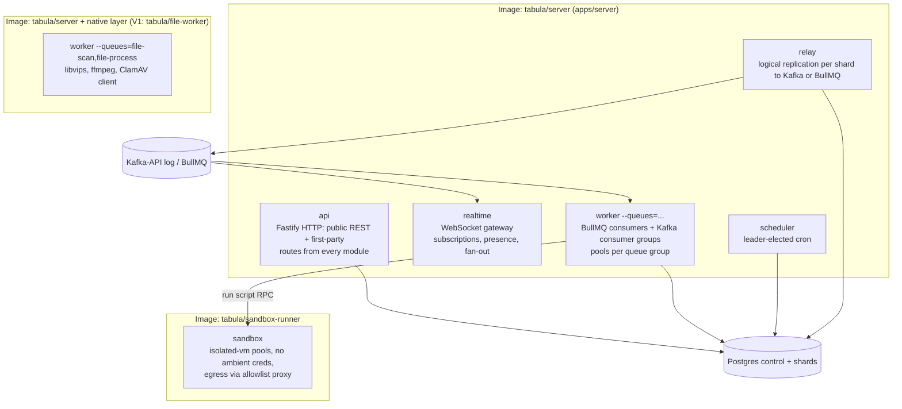
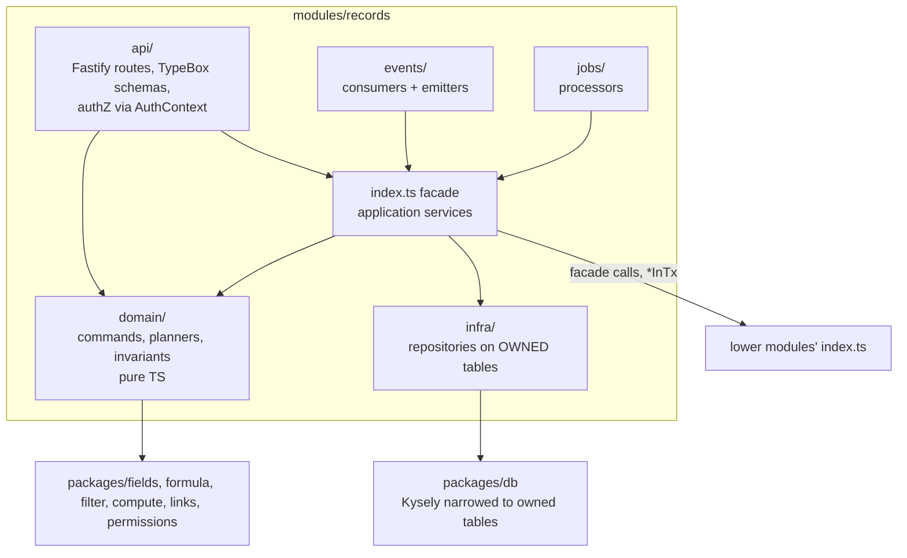
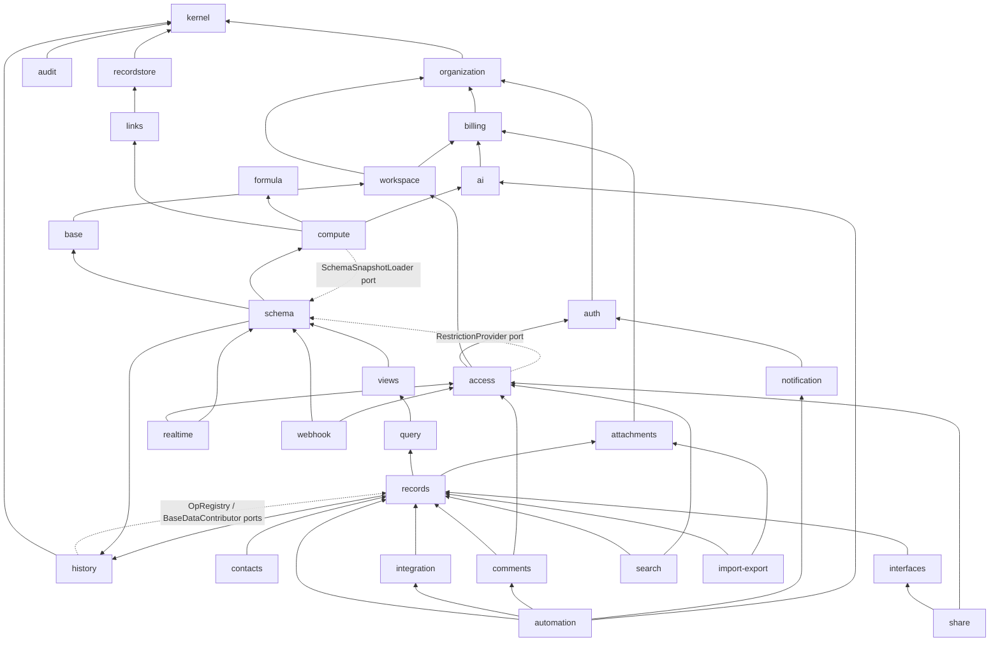

# 26 — Architecture Style, Tech Stack, Repository Structure & Service Boundaries

> **Status:** Proposed for architectural approval · **Owner:** Platform Architecture · **Date:** 2026-10-03
>
> Conforms to [00 — Canonical Decisions](00-canonical-decisions.md) (normative). Decisions referenced as D1…D26. Where this document needs something not in the spine inventory it is listed in [Proposed additions](#proposed-additions).

## Sections covered

| Section | Part | Topic |
|---|---|---|
| §45 | Part 42 | Microservices vs modular monolith vs hybrid — analysis, decision, boundary enforcement, extraction criteria & playbook |
| §46 | Part 43 | Complete recommended technology stack with rationale and "considered and rejected" per category |
| §47 | Part 44 | Complete repository structure (pnpm + Turborepo monorepo), every directory explained, dependency rules |
| §48 | Part 45 | Service/module boundaries: responsibilities, owned tables, sync dependencies, public API, events emitted/consumed, acyclic dependency diagram |

Related documents: [03 — System Architecture](03-system-architecture.md) · [06 — Record Storage](06-record-storage.md) · [07 — Field Engine](07-field-engine.md) · [08 — Formula Engine](08-formula-engine.md) · [09 — Linked Record Engine](09-linked-record-engine.md) · [14 — Automation Engine](14-automation-engine.md) · [15 — Events](15-events.md) · [16 — Realtime](16-realtime.md) · [17 — API Architecture](17-api-architecture.md) · [19 — Permissions & Multi-Tenancy](19-permissions-and-multitenancy.md) · [22 — Audit/History/Undo/Trash](22-audit-history-undo-trash.md) · [23 — Notifications/Jobs/Caching/Performance](23-notifications-jobs-caching-performance.md) · [24 — Frontend](24-frontend-grid-state-design-system.md) · [25 — Security/Observability/Infrastructure](25-security-observability-infrastructure.md) · [27 — Data Flows, Transactions, Migrations](27-data-flows-transactions-migrations.md) · [33 — ADRs](33-architecture-decision-records.md)

---

## Table of contents

1. [§45 Architecture style: microservices vs modular monolith vs hybrid](#45-architecture-style-microservices-vs-modular-monolith-vs-hybrid)
   - 45.1 What this product actually demands
   - 45.2 The three candidates
   - 45.3 Scored comparison
   - 45.4 Decision
   - 45.5 Process roles
   - 45.6 Module boundary enforcement
   - 45.7 The single shared transaction across modules (how modules cooperate in one DB txn)
   - 45.8 Extraction criteria
   - 45.9 Extraction playbook (strangler) and per-candidate plans
2. [§46 Recommended technology stack](#46-recommended-technology-stack)
3. [§47 Repository structure](#47-repository-structure)
4. [§48 Service / module boundaries](#48-service--module-boundaries)
5. [Proposed additions](#proposed-additions)

---

## 45. Architecture style: microservices vs modular monolith vs hybrid

### 45.1 What this product actually demands

Architecture style must be chosen against the product's real forces, not fashion. The forces that dominate Tabula:

| # | Force | Concrete evidence (from the spine and sibling docs) | Pull toward |
|---|---|---|---|
| F1 | **Transactional coupling of a single cell edit** | One edit touches, in one ACID transaction: `base_runtime.change_seq` allocation, `records.cells` + `cell_meta`, possibly `record_links`, typed index sidecars, same-record computed values (D7: synchronous), cross-record computed values up to `COMPUTE_SYNC_FANOUT_LIMIT` = 500 records, `record_revisions`, `base_changes` (with inverse ops for undo, D25), `outbox_events` (D11) and `idempotency_keys`. These tables belong to at least six logical domains (records, links, compute, history, change log, events). | **Single process, single database transaction** |
| F2 | **Cell-edit latency** | Interactive grid: target p50 < 60 ms, p99 < 250 ms server time for a single-cell edit including synchronous recompute (see [23](23-notifications-jobs-caching-performance.md)). Each network hop between services typically adds 1–5 ms p50 and much worse tails; distributed transactions (2PC/sagas) add multiple round trips plus compensation complexity. | In-process calls |
| F3 | **Per-base total order** | D9/D10: per-base monotonically increasing `change_seq`, gap-free in commit order. Easy with one Postgres row lock; very hard across services. | Single DB authority per base |
| F4 | **Dynamic, user-defined schema** | Every request is interpreted through a `SchemaSnapshot` (fields, types, formulas, links, restrictions). Services would each need the snapshot, consistent with the same `schema_version`. | Shared in-process snapshot cache |
| F5 | **Team size** | Planned 8–25 product engineers through V1, 40–60 at Enterprise maturity. Microservices pay off when many independent teams need independent deploy cadences; below ~50 engineers the coordination tax usually exceeds the benefit. | Monolith |
| F6 | **Heterogeneous workloads** | WebSocket fan-out (long-lived connections, memory-bound), file processing (CPU, native libs: libvips/ffmpeg/ClamAV), user scripts (untrusted code), AI calls (slow I/O, cost governance), search indexing (bulk, lag-tolerant), automations (bursty). | Separate **process roles / pools**, not necessarily separate codebases |
| F7 | **Blast radius & security isolation** | Untrusted user scripts must never share a process with credentials. File parsers (images, PDFs, CSV/XLSX) are classic exploit targets. | Physically separate sandbox and file-processing workers |
| F8 | **Multi-tenant sharding** | D2/D3: control plane + N data-plane shards; workspace affinity. Every data-plane operation is already routed by shard. | Shard router as shared library; sharding is orthogonal to service decomposition |
| F9 | **Operability** | Small platform team at MVP; on-call must be able to trace one request end-to-end. | Fewer deployables |

The decisive force is **F1 + F2 + F3**: the core write path is a single, short, strongly consistent transaction that spans several domains. Any architecture that puts records, links, compute, history and the change log in different services either (a) gives up atomicity (and must reinvent it with sagas), or (b) shares one database between services (a "distributed monolith" with all the costs of both).

### 45.2 The three candidates

**A. Microservices (service per domain, database per service).**
Services such as `record-service`, `link-service`, `compute-service`, `schema-service`, `view-service`, `automation-service`, `realtime-service`, `history-service`, each with its own datastore and an event bus between them.

* Cell edit path becomes: API gateway → record-service → (sync RPC) schema-service for snapshot → link-service → compute-service → history-service; or record-service publishes and others react asynchronously.
* Atomicity: either a saga (record written, computed values eventually consistent, undo log eventually consistent, change seq allocated… where?) or 2PC (not realistically available across heterogeneous services).
* Per-base ordering: a dedicated sequencer service, or ordering only within record-service (then links/computed changes are out of the order).

**B. Modular monolith (one codebase, one deployable image, strict internal modules, multiple process roles).**
All domain modules live in `apps/server`, call each other through typed in-process facades, and share a database transaction when an operation spans modules. The same image runs as `api`, `realtime`, `worker`, `scheduler`, `relay`. Heterogeneous or hostile workloads (sandbox) run in separate images.

**C. Hybrid ("monolith core + satellites from day one").**
Modular monolith for the transactional core (schema/records/links/compute/history/views/permissions) plus a few separately deployed services from day one (e.g., realtime gateway in Go, file processor, search indexer, AI gateway).

### 45.3 Scored comparison

Scores 1 (poor) – 5 (excellent) for **this** product at MVP→V1 scale.

| Criterion | Weight | A. Microservices | B. Modular monolith + roles | C. Hybrid day-one |
|---|---|---|---|---|
| Atomic multi-domain write (F1) | ×3 | 1 — sagas/compensation for every cell edit; undo log and computed values eventually consistent | 5 — one PG txn | 5 for core; satellites are async anyway |
| Cell edit latency (F2) | ×3 | 2 — 3–6 internal hops on hot path | 5 — in-process | 5 |
| Per-base total order (F3) | ×2 | 1 — needs sequencer; links/computed out of band | 5 — `base_runtime` row lock | 5 |
| Consistent schema snapshot (F4) | ×2 | 2 — snapshot replication + version negotiation | 5 | 4 — satellites need snapshot API |
| Team-size fit (F5) | ×2 | 1 — overhead >> benefit at < 50 engineers | 5 | 3 — polyglot or multi-repo overhead early |
| Independent scaling of workloads (F6) | ×2 | 5 | 4 — per-role/per-queue autoscaling of same image; separate images only for sandbox | 5 |
| Fault/security isolation (F7) | ×2 | 5 | 4 — role isolation + separate sandbox image; a bug in a shared library can affect all roles | 5 |
| Independent deployability | ×1 | 5 | 3 — one image, but roles can be rolled separately; feature flags | 4 |
| Operability / debuggability (F9) | ×2 | 2 — distributed tracing mandatory for every bug | 5 | 3 |
| Refactoring speed while domain is still being discovered | ×2 | 1 — boundaries frozen in network contracts too early | 5 — move code, run tests | 3 |
| Infra cost at MVP | ×1 | 2 | 5 | 3 |
| Path to extract later | ×1 | n/a | 4 — facades + events make extraction mechanical | 4 |
| **Weighted total** (max 115) | | **≈ 55** | **≈ 108** | **≈ 94** |

Commentary on the close call (B vs C): the satellites in C are exactly the extraction candidates of D1. Building them separately on day one buys isolation we do not yet need, at the cost of: a second toolchain (if Go), duplicated auth/permission-snapshot code (realtime must enforce field-level permissions — see [16](16-realtime.md) and [19](19-permissions-and-multitenancy.md)), cross-service schema evolution, and slower iteration on the realtime protocol while the record model is still moving. Option B with **process roles** gets ~80% of C's isolation (separate pods, separate autoscaling, separate failure domains at the process level) at near-zero extra cost, and leaves C as a straightforward evolution.

Why not "microservices sharing one database" (A′)? It keeps atomicity but couples deploys through the schema, duplicates data-access code, and still requires network hops on the hot path — the costs of both worlds.

### 45.4 Decision **[Ours]** (D1; ADR in [33](33-architecture-decision-records.md))

> **Modular monolith in TypeScript with enforced module boundaries, deployed as multiple process roles from one image; separately-built images only for untrusted or native-heavy workloads (sandbox now; file processing when justified). Extraction of further services follows measured criteria (§45.8), never a calendar.**

Consequences we accept:

* One image deploy affects all roles → mitigated with role-by-role progressive rollout (Argo Rollouts canary per Deployment), feature flags, and N/N-1 compatibility rules for DB and events ([27 §51](27-data-flows-transactions-migrations.md#51-migration-strategy)).
* A memory leak in a shared module affects every role → mitigated by per-role resource limits, heap-usage SLOs and restarts; realtime has its own pool.
* Discipline required to keep modules decoupled → enforced by tooling (§45.6), not by goodwill.

### 45.5 Process roles

Same container image (`ghcr.io/tabula/server`), different entrypoints (spine §2). The role decides which modules' **adapters** are started; all modules' code is present but only the relevant HTTP routes, consumers, and jobs are registered.



| Role | Modules activated | Scaling signal | Notes |
|---|---|---|---|
| `api` | All modules' `api/` route plugins | CPU, p99 latency, in-flight requests | Stateless; PgBouncer in front of shards |
| `realtime` | `realtime` module + read facades of `access`, `schema` (snapshots), kernel change-log reader | Connection count, memory, fan-out lag | Sticky by `baseId` via consistent hashing on the subscribe path ([16](16-realtime.md)) |
| `worker` | Selected queue groups: `compute`, `automation-*`, `webhook-out`, `email`, `notification`, `search-index`, `file-*`, `import`, `export`, `ai`, `sync`, `snapshot`, `purge`, `maintenance`; Kafka consumer groups | Queue depth / consumer lag per group (KEDA) | Each group is a separate Deployment with its own concurrency |
| `scheduler` | Scheduled-trigger claimer, volatile-formula buckets, purge, reconciler, partition maintenance, migration-orchestrator hooks | n/a (2 replicas, leader election via Postgres advisory lock on control plane) | Leader-only loops; followers idle-hot |
| `relay` | Kernel `relay` adapter | One active reader per shard (leader per shard slot) | WAL lag is the SLO ([15](15-events.md)) |
| `sandbox` | — (separate image) | Pending script executions | No DB credentials, no cloud credentials |

### 45.6 Module boundary enforcement

A modular monolith only works if boundaries are real. Rules, with the tool that enforces each:

| # | Rule | Enforcement |
|---|---|---|
| B1 | A module is a directory `apps/server/src/modules/<module>/`. Its **only** importable surface is `index.ts` (facade types + factory) and `events.ts` (event payload types it emits). | `eslint-plugin-boundaries` (`boundaries/entry-point`) + dependency-cruiser rule `no-deep-module-imports` |
| B2 | Modules may import other modules' facades only along the **allowed dependency DAG** (§48.2). Upward or sideways-not-listed imports fail CI. | dependency-cruiser `allowed` list generated from `tools/codegen/module-graph.yaml`; `no-circular` |
| B3 | **No cross-module table access.** A module's Kysely queries may only reference tables it owns. | Each module gets a narrowed Kysely type: `Kysely<Pick<DataDB, OwnedTables>>` created by `db.forModule('records')`. Referencing another module's table is a **compile error**. Plus a CI SQL lint scanning `sql\`` raw fragments for table names against `module-tables.yaml`. |
| B4 | Raw SQL escape hatch (`sql` template) only in `infra/` subfolders. | ESLint `no-restricted-imports` for `kysely`'s `sql` outside `infra/` |
| B5 | Domain layer (`domain/`) is pure: no I/O imports (`pg`, `ioredis`, `fastify`, `bullmq`, `@aws-sdk/*`). | ESLint `no-restricted-imports` scoped by folder |
| B6 | Cross-module **side effects after commit** go through domain events (outbox), not through direct calls. | Code review checklist + facade method naming convention (`*InTx` methods are the only ones accepting a `BaseTx`) |
| B7 | A lower module that needs a capability of a higher module declares a **port** (interface) in its `ports.ts`; the composition root wires it. | dependency-cruiser sees no import edge; `apps/server/src/composition/*.ts` is the only place allowed to import every module |
| B8 | Shared, framework-free logic lives in `packages/*` (pure), never in a module. Packages never import from `apps/*`. | dependency-cruiser `packages-are-leaves` |
| B9 | Every module has a `module.yaml` (owner team, owned tables, emitted events, consumed events, queues, ports). CI verifies that tables in migrations, `outbox` emits and consumer registrations match it. | `tools/codegen/verify-modules.ts` |
| B10 | Read-only cross-module **exemptions** must be listed explicitly (only one exists: `query` reads `records`, `record_index_*`, `record_links` — §48 QueryService). | Allowlist in `module-tables.yaml` with `access: read` |

Narrowed Kysely type (B3), as implemented in `packages/db`:

```ts
// packages/db/src/module-scope.ts
import type { Kysely, Transaction } from 'kysely';
import type { DataDB } from './generated/data-db';     // generated by kysely-codegen per plane
import type { ModuleTables } from './generated/module-tables'; // generated from module.yaml files

export type ModuleDB<M extends keyof ModuleTables> = Pick<DataDB, ModuleTables[M]['owned'] | ModuleTables[M]['read']>;

export interface BaseTx {
  readonly baseId: string;
  readonly workspaceId: string;
  readonly shardId: string;
  /** narrowed transaction handle; a module can only see its own tables */
  for<M extends keyof ModuleTables>(module: M): Transaction<ModuleDB<M>>;
  /** change-log context: seq allocated for this txn, actor, correlation ids */
  readonly change: ChangeContext;
}
```

The `BaseTx` object is created by the kernel (`kernel.withBaseTx(baseId, fn)`) which opens the transaction, sets `SET LOCAL app.workspace_id` for RLS (D4), sets timeouts, and allocates the change sequence (see [27 §50](27-data-flows-transactions-migrations.md#50-transaction-boundaries)).

### 45.7 The single shared transaction across modules

The design question every modular monolith must answer: *how do modules that own different tables participate in one ACID transaction without reaching into each other's tables?*

**Answer: the orchestrating module passes a `BaseTx` handle to `*InTx` facade methods of lower modules.** Each lower module writes only its own tables through `tx.for('<self>')`. Nobody commits except the kernel, which wraps the orchestrator's callback.

```ts
// apps/server/src/modules/records/domain/update-records.ts (orchestrator, simplified)
export async function updateRecords(deps: RecordsDeps, cmd: UpdateRecordsCommand, auth: AuthContext) {
  const schema = await deps.schema.getSnapshot(cmd.baseId);           // outside txn (cached)
  const normalized = deps.fields.normalizePatch(schema, cmd.patches); // pure, outside txn
  auth.permissions.assertCanEditFields(schema, normalized.fieldIds);  // pure check on snapshot

  return deps.kernel.withBaseTx({ baseId: cmd.baseId, actor: auth.actor, idempotency: cmd.idem }, async (tx) => {
    tx.assertSchemaVersion(schema.version);                           // base_runtime read under lock
    const current = await deps.recordstore.lockForUpdateInTx(tx, cmd.tableId, normalized.recordIds);
    const plan = planCellWrites(schema, current, normalized, tx.change);   // pure: LWW, inverse ops
    const linkDelta = await deps.links.applyInTx(tx, schema, plan.linkOps);
    const computed = await deps.compute.recomputeInTx(tx, schema, plan, linkDelta); // same-record + fan-out ≤ 500
    await deps.recordstore.writeInTx(tx, plan.merge(computed.sameTable));
    await deps.history.appendRevisionsInTx(tx, plan.revisions(computed));
    tx.change.append(plan.ops(linkDelta, computed), plan.inverseOps());    // base_changes row
    tx.outbox.emit(plan.domainEvents(linkDelta, computed));                // outbox_events rows
    return plan.response();
  });
}
```

Dependency inversion where the call direction would otherwise be upward (B7):

| Port (declared in) | Implemented by | Why the inversion |
|---|---|---|
| `kernel.OpRegistry` — apply a change op (forward or inverse) | `recordstore`/`records`, `links`, `schema`, `views`, `interfaces`, `comments`… each registers handlers for its op kinds | Undo/redo/restore (history, low) must apply ops owned by higher modules |
| `kernel.BaseDataContributor` — export/import/delete a base's rows | Every data-plane module | Snapshots, base duplication, workspace shard moves, hard purge — without the history/kernel module touching foreign tables |
| `compute.SchemaSnapshotLoader` | `schema` | Deferred compute jobs and AI field runner need snapshots; compute sits below schema |
| `access.RestrictionProvider` | `schema` (table/field restrictions), `views` (locked views), `interfaces` (element permissions) | Permission snapshot compilation (D20) needs overlays owned by higher modules |
| `search.IndexDocumentSource` | `records`, `schema`, `contacts`, `base` | Search indexer turns events into documents |
| `realtime.PayloadRedactor` | `access` + `schema` | Field-level redaction before fan-out |

Ports are few, named, and listed in `module.yaml`; a reviewer can see every inversion in `apps/server/src/composition/`.

### 45.8 Extraction criteria

A module/adapter becomes a separately deployed service only when **at least two** of these are true and measured for ≥ 4 weeks, or **one** of the hard criteria (marked ★) is true:

| # | Criterion | Measurement |
|---|---|---|
| X1 ★ | Security isolation requires a different trust boundary (untrusted code, hostile file formats, distinct credentials) | Threat model ([25](25-security-observability-infrastructure.md)) |
| X2 | Resource profile conflicts with the image: native deps > 200 MB, GPU, or per-pod memory > 4× api | Image size, pod metrics |
| X3 | Scaling dimension is independent and the role-based split is insufficient (e.g., 500k WebSocket connections, where Node per-connection memory dominates cost) | Cost per 10k connections, p99 fan-out lag |
| X4 | Release cadence conflict: the component needs ≥ 3× the deploy frequency of the core or must be pinned while core moves | Deploy logs |
| X5 | A dedicated team (≥ 4 engineers) owns it and the module's facade has been stable (≤ 1 breaking change per quarter) | Ownership, facade diff history |
| X6 | The component has no synchronous dependency in the cell-edit transaction (it is already async via events) | Module graph |
| X7 | Polyglot need: a mature non-Node implementation offers ≥ 3× efficiency for a hot, measurable path | Benchmarks on our workload |

Never extract: `kernel`, `recordstore`, `records`, `links`, `compute`, `schema`, `history`'s in-transaction parts — they share the write transaction (F1). Extracting them would require replacing ACID with sagas on the hottest path.

### 45.9 Extraction playbook (strangler) and per-candidate plans

**Generic playbook**

```mermaid
flowchart LR
  S0["0. Module in monolith<br/>facade + events already"] --> S1["1. Freeze facade<br/>contract tests on facade"]
  S1 --> S2["2. Introduce transport seam<br/>facade impl = InProcess or Remote client<br/>selected by config"]
  S2 --> S3["3. Build service from same packages<br/>new apps/X entrypoint, same module code"]
  S3 --> S4["4. Shadow traffic<br/>dual-run, compare outputs"]
  S4 --> S5["5. Shift traffic per tenant cohort<br/>feature flag, canary shard"]
  S5 --> S6["6. Remove in-process adapter<br/>module code moves to apps/X"]
  S6 --> S7["7. Separate data if owned tables<br/>only after stable for a quarter"]
```



What changes when a module is extracted:

| Concern | In-process (today) | Extracted |
|---|---|---|
| Sync call | `deps.ai.invoke(req)` — function call, shared `AbortSignal`, ~µs | gRPC/HTTP call via generated client implementing the **same TS interface**; deadlines, retries with idempotency keys, circuit breaker; ~1–5 ms |
| Async side effects | Outbox event → relay → Kafka → consumer in `worker` | Unchanged; consumer group simply moves to the new deployable |
| Transactions | May participate via `*InTx` | **Must not**: extracted services never participate in core write txns; any `*InTx` method on the facade is a blocker for extraction |
| Auth context | `AuthContext` object | Signed internal token (short-lived JWT, audience = service) carrying principal + permission-snapshot reference; service verifies via JWKS |
| Config/flags | Shared process config | Same `@tabula/config` package, own env |
| Observability | Same trace | W3C `traceparent` propagated; service-level SLOs added |
| Data | Owned tables in shard DB | Initially still in shard DB with a dedicated DB role limited to owned tables (`GRANT` per table); optionally moved later |
| Failure mode | Exception | Timeout/unavailable → explicit degraded behavior must be designed (below) |

**Per-candidate plans**

| Candidate | Why it is a candidate | Trigger to extract | Interface after extraction | Degraded mode if down |
|---|---|---|---|---|
| **Realtime gateway** | Long-lived connections, memory-bound, independent scaling (X3); no txn participation (X6) | > 150k concurrent connections or > 30% of compute cost; or need for edge PoPs | Consumes `tabula.base-changes.v1`; calls `access` for permission snapshots via internal API (cached, epoch-validated); catch-up reads `base_changes` through a read-only API or read replica | Clients fall back to polling `GET …/changes?since=seq` (same cursor protocol) |
| **File processing** | Native libs, hostile inputs (X1, X2) | **Planned for V1** as image split (`tabula/file-worker`), same codebase | Consumes `file-scan`/`file-process` jobs; writes `attachments`/`attachment_variants` through attachments module code in the same repo (still DB-direct with restricted DB role) | Attachments stay `processing`; originals downloadable after scan |
| **Search indexer** | Async, lag-tolerant, bulk (X6), OpenSearch client and mapping logic | V1 OpenSearch rollout with > 5k docs/s sustained | Kafka consumer `search-indexer`; reads records via internal bulk read API or replica | Search falls back to Postgres FTS (MVP path kept) or shows "index catching up" |
| **AI gateway** | Provider credentials, cost governance, distinct release cadence (X4), egress controls | Multiple consumers outside monolith, or regulated customers demanding dedicated egress | `POST /internal/ai/invoke` (streaming), idempotent by `aij_` id; metering events to `tabula.usage.v1` | AI fields stay `pending`; automations retry with backoff |
| **Automation runner** | Bursty, tenant-noisy, runs user-defined steps (X3, X5) | > 30% worker CPU, or dedicated automation team | Consumes `automation-step` queue; record actions call **records public API** (internal, service token) — not in-process txn | Runs queue; reconciler resumes |
| **Sandbox** | Untrusted code (X1) | **Already separate** (separate image, separate node pool) | `RunScript` RPC over mTLS: `{code, inputs, limits, egressPolicy}` → `{outputs, logs, usage}` | Script steps fail with retryable error |

---

## 46. Recommended technology stack

Principles used to choose:

1. **One language end to end (TypeScript)** — the formula engine, filter evaluator, field codecs and permission evaluator run identically on client and server (D8). That isomorphism is a product feature (instant formula preview, optimistic cell rendering, client-side filtering of realtime ops) and a correctness feature (one implementation, one test suite).
2. **Boring where possible, custom only where the product is the differentiator** — the grid, formula engine, compute engine and record store are custom; everything else is a mature library or managed service.
3. **Libraries over frameworks** for the backend: we need full control of SQL, transactions and process roles.
4. **Every dependency has an exit** — wrapped behind a package interface (`@tabula/storage`, `@tabula/search`, `@tabula/ai`, `@tabula/jobs`, `EventBus`).
5. **Licences:** MIT/Apache-2.0/BSD/ISC preferred; MPL acceptable; no AGPL/SSPL in the shipped product (self-hosted infra components under such licences are evaluated separately).

### 46.1 Frontend

| Concern | Choice **[Ours]** | Why | Considered and rejected |
|---|---|---|---|
| Language | **TypeScript 5.x, `strict`, `noUncheckedIndexedAccess`, `exactOptionalPropertyTypes`** | Shared types with server via `@tabula/types`; the cell value model is a discriminated union per field type — the checker catches mistakes the grid would otherwise render | Plain JS (no); ReScript/Elm (hiring, ecosystem) |
| Framework | **React 19** | Largest ecosystem for complex editors (Tiptap/ProseMirror bindings, Radix, DnD), concurrent rendering for heavy views, `useSyncExternalStore` for our RecordStore, hiring | **Solid** (finer reactivity, smaller ecosystem; our hottest surface — the grid — is canvas and framework-agnostic anyway); **Svelte 5** (same ecosystem argument); **Vue** (fine, but the React ecosystem for editors/design primitives is deeper) |
| Build | **Vite 6 (SPA)**, Rollup-based prod build, route-level code splitting | D18: auth-gated, highly interactive app; SSR gives little and complicates realtime state | **Next.js app router** (SSR/RSC adds a Node rendering tier and caching semantics we don't need for an authenticated grid app; kept for marketing); webpack (slower) |
| Routing | **TanStack Router** | Type-safe params/search params (view state lives in the URL: `?view=viw_…&record=rec_…`); loaders integrate with TanStack Query | React Router 7 (good, weaker type safety for search params) |
| Server state (metadata) | **TanStack Query v5** | Caching/invalidation of bases, tables, fields, views, members, automation lists; invalidation driven by realtime schema ops | SWR (fewer features); RTK Query (Redux coupling); Apollo (no GraphQL, D16) |
| Record data | **Custom `RecordStore`** (`@tabula/record-store`): normalized by record id, window-paged, applies realtime ops by `seq`, optimistic layer keyed by `clientMutationId`, `useSyncExternalStore` selectors | Record data is too large and too frequently mutated for a generic query cache; server ops must merge with pending optimistic ops in seq order ([16](16-realtime.md), [24](24-frontend-grid-state-design-system.md)) | TanStack Query for records (cache granularity per query; poor for 100k-row windows); Redux (boilerplate, perf on high-frequency updates); MobX (implicit reactivity hard to reason about at 50k cells) |
| UI state | **Zustand** (small stores per surface: selection, editing, panels) | Minimal API, selector subscriptions, no provider pyramid | Jotai (fine; atom sprawl at our scale); Redux Toolkit (heavier) |
| UI primitives | **Radix UI primitives** + own design system `@tabula/ui` | Accessible, unstyled, composable (menus, popovers, dialogs, comboboxes); we own the look | MUI/Chakra/Mantine (opinionated styling, bundle weight, hard to match a dense spreadsheet UI); Headless UI (fewer primitives); **React Aria** (excellent a11y — acceptable alternative; its date pickers may be used inside date field editors) |
| Styling | **Tailwind CSS v4**, design tokens as CSS custom properties (`--tb-color-*`, `--tb-space-*`), `class-variance-authority` for variants | Zero runtime; tokens map 1:1 to the canvas grid theme (the grid reads the same CSS variables); fast iteration | Runtime CSS-in-JS (emotion/styled-components: runtime cost, React 19 streaming friction); vanilla-extract (good, slower iteration); CSS Modules only (no token discipline) |
| Grid | **Custom canvas grid** (`@tabula/grid`), prior art Glide Data Grid (MIT) | 100k+ rows × hundreds of fields at 60 fps, per-field-type canvas renderers, frozen columns, grouping, row heights, fill handle, multi-cell selection, realtime cell flashes — DOM grids hit layout/GC limits | **AG Grid** (excellent, but enterprise licence cost; DOM virtualization fights our cell model and grouping semantics); **Glide Data Grid as a dependency** (great start; grouping, summary bar and editing model diverge, so we reuse ideas not the package); TanStack Table (headless logic; used for small admin tables) |
| Virtualized lists (non-grid) | **TanStack Virtual** | Kanban columns, gallery, interface record lists, comment threads | react-window (less flexible for variable sizes) |
| Drag and drop | **dnd-kit** (kanban, menus, interface builder) + grid-native DnD on canvas | Accessible keyboard DnD, sensors, collision strategies | react-beautiful-dnd (deprecated); pragmatic-drag-and-drop (good perf; fallback if dnd-kit maintenance stalls) |
| API client | **`@tabula/api-client`** generated from OpenAPI (`openapi-typescript` types + thin `fetch` wrapper: retries, idempotency keys, problem+json) | Same contract as the public API (D16); generated types prevent drift | tRPC (couples clients to server internals; public API must be REST anyway); axios (unneeded over fetch) |
| Forms (config dialogs, field settings, automation panels) | **React Hook Form + Zod resolver** (schemas from `@tabula/fields`/`@tabula/types`) | Uncontrolled inputs perform well for large config forms; the same Zod schemas validate on the server | Formik (re-render heavy, low maintenance); TanStack Form (promising, younger — revisit) |
| End-user public forms | `@tabula/field-ui` editors inside `apps/public`, validated by `@tabula/fields` codecs | One validation implementation per field type | A separate form library (duplicates field semantics) |
| Charts (dashboards, chart elements, summary sparklines) | **Apache ECharts 5** behind a thin `@tabula/ui/charts` wrapper (modular imports, canvas renderer) | Canvas handles 10k–100k points; broad catalogue (bar/line/area/pie/scatter/heatmap/funnel/gauge/treemap); built-in dataZoom/brush/tooltips; themeable from our tokens; ARIA descriptions; Apache-2.0 | **Recharts** (SVG + React reconciliation degrade beyond a few thousand points; limited chart types — wrong for dashboards over large tables); **visx** (low-level D3 primitives: maximal control, but we would build every chart, legend and interaction ourselves); Highcharts (commercial licence); Chart.js (fewer types, weaker large-data interaction); Vega-Lite (heavier runtime, harder theming) |
| Rich text | **Tiptap (ProseMirror)** + **Yjs** (`y-prosemirror`) for collaborative rich long text (V1+, D9) | ProseMirror's schema-constrained documents map to stored `{doc, plain}`; Tiptap extension model; Yjs is the mature text CRDT with awareness for cursors. Yjs updates are **transported over our own WebSocket gateway** and persisted to `record_rich_docs` | Lexical (younger collaborative story); Slate (API churn); Quill (weak structured model); Automerge (heavier for text). Hocuspocus server considered — rejected to avoid another stateful service |
| Date/time | **Temporal** (native where shipped, `temporal-polyfill` otherwise) in `@tabula/formula` and `@tabula/fields`; `Intl.DateTimeFormat` for display | Correct time-zone/DST arithmetic for `DATEADD`, `WORKDAY`, `DATETIME_DIFF`; immutable; isomorphic and deterministic | **date-fns-tz** (built on `Date`, no TZ-aware arithmetic → DST bugs in formulas; acceptable only for formatting, so not needed); Luxon (good, but Temporal is the standard); Day.js/Moment (mutability, plugins, Moment deprecated) |
| i18n | **FormatJS (`react-intl`)** + ICU messages; `Intl.NumberFormat` for numbers/currency | ICU plurals/selects | i18next (fine; ICU only via plugin) |
| Unit/component tests | **Vitest** + **Testing Library** + **MSW** | Fast, Vite-native, same runner as server | Jest (slower with ESM/TS) |
| E2E | **Playwright** (multi-context realtime collaboration tests, trace viewer) | Two users editing one base in a single test | Cypress (single-tab model hurts collaboration tests) |
| Visual | Playwright canvas screenshots + Storybook for `@tabula/ui` (Chromatic or Lost Pixel) | Canvas grid regressions are visual | — |
| Property tests | **fast-check** (formula engine; filter SQL compiler vs JS evaluator equivalence; LWW merge) | Finds engine edge cases | — |
| Error tracking | Sentry browser SDK, source maps uploaded in CI | — | — |

### 46.2 Backend

| Concern | Choice **[Ours]** | Why | Considered and rejected |
|---|---|---|---|
| Runtime | **Node.js 22 LTS** (move to 24 LTS once Active LTS and dependencies certify) | Isomorphism with frontend; mature async I/O for an I/O-bound API; excellent Postgres/Redis/Kafka clients | **Bun/Deno** (faster startup; compatibility risk for native deps, OTel auto-instrumentation and `isolated-vm`; may be used for tooling) |
| Language | **TypeScript (strict), ESM** | — | — |
| HTTP | **Fastify 5** | Schema-first routes (TypeBox/JSON Schema → Ajv validation + fast serialization), plugin encapsulation (one plugin per module), hooks for auth/tenant routing, low overhead, OTel instrumentation | Express (no schema/serialization, slower); **NestJS** (its DI/decorator module system would compete with ours and hide transaction flow); Hono (great at edge, fewer production plugins for our needs) |
| SQL | **Kysely** + `pg` driver | D17: the product *is* dynamic SQL (filters over JSONB slots, sidecar joins, link subqueries); typed composition with raw escape hatches; per-module narrowed DB types (§45.6) | Prisma (dynamic queries awkward, separate query engine, weaker lock/txn control); TypeORM/MikroORM (identity-map ORMs fight bulk JSONB patches); **Drizzle** (close second; Kysely chosen for more mature dynamic composition and the narrowing pattern); raw `pg` (no type safety) |
| Driver extras | `pg-cursor` (streaming exports), `pg-copy-streams` (imports/backfills/shard moves) | COPY is 10–50× faster than INSERT batches for bulk | postgres.js (fast, but less standard Kysely dialect and different COPY API) |
| Validation | **TypeBox** for HTTP schemas (Ajv on the hot path, native OpenAPI 3.1); **Zod** for domain configs/events shared with the frontend | Each tool where it is strongest | Zod only (OpenAPI conversion lossy, slower hot-path validation); TypeBox only (worse DX for refined unions); Valibot (revisit for bundle size) |
| Jobs | **BullMQ** on Redis (D12) | Delays, retries, priorities, rate-limited groups, flows; durable state in Postgres + reconciler | Graphile Worker / pg-boss (add write load to shard primaries at automation scale; pg-boss acceptable for a self-hosted single-node profile); SQS (15-min delay cap, no priorities); Temporal (deferred, [14](14-automation-engine.md)) |
| Kafka client | **`@confluentinc/kafka-javascript`** (librdkafka-based, ships a KafkaJS-compatible API) | Idempotent producer, zstd, cooperative-sticky rebalancing, throughput, active vendor maintenance; KafkaJS-style API keeps code/tests familiar | **kafkajs** (pleasant pure-JS API, but maintenance stalled since 2023 and lower throughput); node-rdkafka (superseded by the Confluent client) |
| Logical replication | **`pg-logical-replication`** with built-in `pgoutput`, behind kernel `ReplicationSource` | Commit-ordered stream from publications on `outbox_events` and `base_changes`; acknowledge LSN only after downstream ack ([15](15-events.md)) | **Debezium** (excellent; a JVM Kafka Connect cluster to operate — acceptable fallback); `wal2json` (extra extension); outbox polling (ordering hazards with concurrent txns; kept only as recovery path) |
| Sandbox | **`isolated-vm`** in the separate `sandbox-runner` image; Firecracker microVMs or permission-locked Deno subprocesses for heavy scripts (D21) | Millisecond isolate startup with memory/CPU limits; separate image, node pool, no credentials | `vm`/`vm2` (not a security boundary; vm2 discontinued); QuickJS-wasm (strong isolation, slow — candidate for tiny scripts) |
| Logging | **pino** (JSON, redaction paths) | Fast, structured, trace correlation | winston (slower) |
| Telemetry | **OpenTelemetry Node SDK** | Vendor neutral (D24) | Vendor agents |
| Egress HTTP | **undici** with SSRF-safe agent (DNS pinning, private range denial) via egress proxy | Built into Node, fast | axios/got |
| Auth crypto | `@node-rs/argon2`, `@simplewebauthn/server`, `otplib`, `jose`, `oauth4webapi` | Maintained, focused, audited | bcrypt (weaker vs GPUs); Passport.js (strategy sprawl) |
| SSO | **BoxyHQ SAML Jackson** (self-hosted OSS) behind `SsoProvider` (D19); WorkOS as buy alternative | SAML is a security minefield; use a focused implementation | Hand-rolled SAML; Auth0/Cognito as identity system of record |
| Email | **Amazon SES** adapter; **React Email** templates rendered server-side | Cost, deliverability; SNS bounce/complaint → `email_suppressions` | SendGrid/Postmark (adapter permits switching) |
| Payments | **Stripe** (Billing, Tax, Customer Portal) | Seat + metered billing | Paddle/Chargebee |
| Formula engine | **TypeScript** (`@tabula/formula`) compiled closures | Isomorphic (D8); cost is dominated by I/O and JSONB, not closure evaluation (millions of simple evaluations per second per core) | **Rust/WASM** (faster evaluation, but duplicate type system and marshaling of cell values across the WASM boundary costs more than evaluating typical formulas) — revisit only for bulk recompute of > 1M records if profiling shows evaluation dominates |
| Media | **sharp (libvips)**, **ffmpeg**, **ClamAV** (`clamd` over TCP) | Standard, memory-efficient | ImageMagick (heavier, larger attack surface) |
| Import parsing | `papaparse` (streaming CSV), `exceljs` streaming reader | Bounded memory | SheetJS CE (distribution/licensing changes) |
| API docs | OpenAPI 3.1 from TypeBox; **Scalar** renderer in `apps/docs-portal` | No drift | Hand-written reference |

**Where Go/Rust may be used later (explicitly not now):**

| Area | Language | Trigger |
|---|---|---|
| Realtime gateway at very high connection counts | Node + uWebSockets.js first; Go/Rust if still insufficient | X3 (§45.8). The protocol in `@tabula/realtime-protocol` is schema-defined so a non-TS gateway can be generated |
| Sandbox infrastructure (microVM orchestration, egress proxy) | Rust/Go, or off-the-shelf Envoy | When microVM workloads launch |
| Bulk data tools (shard moves, multi-GB CSV parsing) | Go/Rust CLIs in `tools/` | Throughput benchmarks |
| Formula engine | **Stays TypeScript** | Any alternative implementation must keep the TS engine as reference and pass cross-implementation property tests |

### 46.3 Database, cache, search

| Concern | Choice **[Ours]** | Why | Considered and rejected |
|---|---|---|---|
| Primary DB | **PostgreSQL 16+** (RDS; Aurora PostgreSQL acceptable); control plane + sharded data plane (D2) | JSONB + GIN, partial/expression indexes, partitioning, logical replication, RLS, mature operations | MySQL (weaker JSON indexing, no RLS); MongoDB (relational links and multi-document txns at our pattern); CockroachDB/YugabyteDB (distributed txns raise per-write latency; JSONB/GIN and logical replication gaps; our workspace affinity keeps txns single-node) |
| Pooling | **PgBouncer** (transaction mode, ≥ 1.21 for protocol-level prepared statements) per shard | `SET LOCAL` GUCs (RLS) are txn-scoped → compatible | RDS Proxy (session pinning on `SET` reduces multiplexing; cost) |
| Extensions | `pg_partman`, `pg_trgm`, `btree_gin`, `pg_stat_statements`, `pgcrypto`; app-generated UUIDv7 (spine §3) | — | `pg_partman` (we use our own scheduler job, [27 §51.8](27-data-flows-transactions-migrations.md#518-partition-maintenance)) |
| Redis | **ElastiCache Valkey 8**; separate clusters: `cache` (allkeys-lru, no persistence; also presence & rate limits) and `jobs` (BullMQ; AOF; `noeviction`) | BullMQ requires `noeviction`; mixing it with an LRU cache is a correctness bug | Memcached (no structures for presence/rate limits); Dragonfly (viable drop-in if cost grows) |
| Redis client | **ioredis** (cluster mode; BullMQ dependency) | — | node-redis |
| Search | MVP **Postgres FTS**; V1 **Amazon OpenSearch Service** (D14) | Zero new infra first; move when relevance/scale demand | Elastic Cloud (licence, cost); Typesense/Meilisearch (weaker multi-tenant permission filtering at our index sizes) |
| Vector (AI, V1+) | **pgvector** on shard DBs; OpenSearch k-NN if needed | Co-located with data; SQL permission filtering | Dedicated vector DBs (another copy of tenant data to govern) |

### 46.4 Infrastructure

| Concern | Choice **[Ours]** | Why | Considered and rejected |
|---|---|---|---|
| Cloud | **AWS** reference (D23) with portable protocols (S3 API, Kafka API, Postgres, Redis protocol) | Managed breadth, enterprise expectations | GCP/Azure later via the same abstractions |
| Compute | **EKS** (V1); ECS Fargate acceptable for MVP with identical images | ≥ 5 roles, KEDA queue-lag autoscaling, tainted sandbox node pool, PDBs, Argo Rollouts | Lambda (WebSockets, long jobs, cold starts, connection storms) |
| IaC | **Terraform** | Mature, multi-provider | Pulumi (fine), CDK (AWS-only) |
| Delivery | **GitHub Actions** (CI) + **Argo CD** (GitOps) + **Argo Rollouts** (per-role canary) | — | Spinnaker (heavy) |
| Packaging | **Helm**: one chart, a values block per role | Parameterized roles | Kustomize-only (acceptable) |
| Event log | **Kafka API** — Amazon MSK or Redpanda (D11); MVP: relay → BullMQ | Ordered per-key replayable log, many consumer groups | Kinesis (shard limits); SNS/SQS (no replay/per-key order across consumers); NATS JetStream (smaller managed footprint on AWS); Redis Streams (memory-bound retention) |
| Objects | **S3** (spine §11), presigned multipart | — | — |
| CDN | **CloudFront**: SPA/public assets, signed URLs for attachments | OAC to S3, WAF, signed cookies | Cloudflare (possible later for edge-rendered share pages) |
| Edge security | AWS WAF + Shield; edge rate limits for public forms | — | — |
| WebSocket library | **`ws`** via `@fastify/websocket` in the `realtime` role, behind a `WsTransport` interface | Standard, maintained, npm-distributed; integrates with Fastify auth hooks and OTel; permessage-deflate control. At our V1 target (≈ 20–40k connections per pod) the bottleneck is fan-out serialization and permission redaction, not the socket library | **uWebSockets.js** (much lower per-connection memory and higher throughput, but GitHub-only distribution, native binary pinned to Node ABI, bespoke API outside Fastify/OTel middleware). **Plan:** keep `WsTransport` so an extracted gateway can switch when X3 triggers. Socket.IO (custom protocol/fallbacks we don't need) |
| Secrets/KMS | AWS Secrets Manager + KMS envelope encryption | — | Vault (another cluster) |
| Base image | Distroless Node 22, non-root, read-only root FS | Supply-chain/runtime hardening | Alpine (musl issues with native modules) |

### 46.5 Observability

| Concern | Choice **[Ours]** | Alternative |
|---|---|---|
| Instrumentation | OTel auto-instrumentation (http, fastify, pg, ioredis, kafka, undici) + manual spans (`base.tx`, `compute.recompute`, `relay.batch`, `ws.fanout`) | — |
| Collector | OTel Collector (DaemonSet + gateway), tail sampling (keep errors/slow) | — |
| Backends | **Grafana stack**: Tempo, Mimir/Prometheus, Loki, Grafana alerting (D24) | **Datadog** (buy alternative; cost at high cardinality) |
| Errors | **Sentry** (server + browser) | — |
| Database | pg_stat_statements + **pganalyze** (or Performance Insights) | — |
| Product analytics | **PostHog** (product events, not domain events) | Segment + Amplitude |
| Load / synthetic | **k6**, synthetic API + login checks | — |

### 46.6 Auth (summary — detail in [19](19-permissions-and-multitenancy.md), [25](25-security-observability-infrastructure.md))

In-house identity core (D19): opaque session tokens hashed in `core.sessions` and cached in Redis `sess:{tokenHash}`; Argon2id; TOTP + WebAuthn; OAuth social login via `oauth4webapi`; SAML/OIDC through **SAML Jackson**; in-house SCIM 2.0; PATs, service-account tokens and OAuth 2.1 (PKCE) for the API.
**Rejected:** Auth0/Okta CIC/Cognito as identity system of record (per-MAU pricing at B2B scale, less control of the multi-org + guest model, migration lock-in); Keycloak (JVM ops overhead, multi-org friction); Lucia (deprecated as a library).

### 46.7 AI

| Concern | Choice **[Ours]** | Why |
|---|---|---|
| Abstraction | `@tabula/ai` provider interface (`complete`, `stream`, `embed`) + AI gateway module (D22) | Routing, metering, caching, policy in one place |
| Default provider | Anthropic Claude via `@anthropic-ai/sdk`: `claude-sonnet-5` default, `claude-haiku-4-5-20251001` for high-volume classification/extraction, `claude-opus-5-5` for agents/complex reasoning (D22) | Quality, tool use, long context |
| Other providers | Pluggable adapters (OpenAI-compatible endpoints; Bedrock-hosted models for residency) | Customer policy |
| Structured output | JSON-schema-constrained output validated with the target field's codec; bounded retry on violation | AI values must conform to field types |
| Templates | `ai_prompt_templates`, versioned; same token-binding compiler as automations ([14 §5](14-automation-engine.md)) | One templating language |
| Rejected | LangChain/LlamaIndex as core runtime (abstraction churn, hidden prompts, hard metering); direct provider SDK calls from modules (bypasses policy/metering — lint-banned outside `packages/ai`) | — |

### 46.8 Tooling

| Concern | Choice | Rejected |
|---|---|---|
| Package manager | **pnpm 9** (workspaces, strict `node_modules`, `catalog:` version alignment) | npm/yarn classic (hoisting hides undeclared deps); Yarn PnP (tool friction) |
| Monorepo | **Turborepo** (task graph, remote cache) | **Nx** (stronger generators and graph tooling, heavier conventions — acceptable alternative); Bazel (overkill for TS-only) |
| Type-check | `tsc -b` with project references | — |
| Bundling | Server: **tsup (esbuild)** per entrypoint; publishable packages (api-client, connectors-sdk) dual ESM + d.ts | webpack |
| Lint/format | **ESLint 9 flat config** + `typescript-eslint` + `eslint-plugin-boundaries` + **dependency-cruiser**; **Prettier** | Biome (fast; lacks the boundary plugins we rely on — revisit) |
| Server tests | Vitest + **Testcontainers** (Postgres 16, Redis, Redpanda) | Mocked DB for integration tests (hides SQL bugs) |
| Codegen | `kysely-codegen` (per plane), TypeBox → OpenAPI → `openapi-typescript`, Zod → JSON Schema event registry | — |
| Hygiene | Changesets (published packages), Conventional Commits, Renovate | — |

---

## 47. Repository structure

### 47.1 Monorepo decision

**Choice: one pnpm + Turborepo monorepo** for all TypeScript code (apps, packages, tools) plus infrastructure code.

| Option | Pros | Cons | Verdict |
|---|---|---|---|
| **Monorepo (pnpm + Turborepo)** | Atomic changes across client/server/shared engines (a field type change touches `fields`, `field-ui`, `formula`, `filter`, server module — one PR); one lint/boundary configuration; shared CI cache | Needs boundary tooling and CI that scales (remote cache, affected-only tasks) | **Chosen** |
| Polyrepo | Independent versioning | Isomorphic packages need publishing and version pinning for every engine change; cross-repo refactors stall; boundary drift | Rejected |
| Monorepo + Nx | Richer generators/graph | Heavier conventions; Turborepo + dependency-cruiser covers our needs | Alternative |

**Decision on `apps/public` (shared views, public forms, published interfaces):** a **separate lightweight Vite SPA** served from a **separate origin** (`share.tabula.example`), with the `api` role serving a tiny HTML shell per share token (`GET /s/{token}`, `GET /f/{token}`) that injects Open Graph meta, `noindex` by default, CSP nonce and preloaded share bootstrap JSON. **No React SSR tier.**

| Option | Pros | Cons |
|---|---|---|
| Same SPA as the app (`apps/web` route) | No extra build | Ships the whole app bundle (grid, editors) to anonymous form fillers; session cookie origin exposed to share pages; CSP must be loosened for embeds |
| **Separate SPA + server-injected shell** (chosen) | Small bundle (forms ≈ 120 KB gz target), origin isolation (no app cookies on share origin; share pages embeddable via iframe with their own CSP/`frame-ancestors`), reuses `field-ui`/`grid` packages | Second build target |
| Next.js/Remix SSR | Best first paint for forms, SEO | A Node rendering tier with its own scaling, caching and security review; SEO is not a goal (shares are `noindex` by default). **Revisit** if form completion metrics show first-paint problems on slow devices |

`apps/marketing` (Next.js or Astro, static-first) is **optional** and may live in a separate repo owned by marketing; it shares only `@tabula/ui` tokens.

### 47.2 Tree

```text
tabula/
├─ apps/
│  ├─ web/                         # Vite + React 19 SPA (authenticated product)
│  │  ├─ src/
│  │  │  ├─ app/                   # router, providers, bootstrap, error boundaries
│  │  │  ├─ routes/                # TanStack Router file routes (workspace, base, table, view, interface, automation, admin)
│  │  │  ├─ features/              # feature slices: grid-view, kanban, calendar, gallery, timeline, form-builder,
│  │  │  │                         #   interface-builder, automation-editor, field-config, record-expand, comments,
│  │  │  │                         #   search, import, sharing, admin, billing, ai
│  │  │  ├─ stores/                # Zustand UI stores (selection, panels, editing)
│  │  │  └─ lib/                   # app-only glue (query client, ws bootstrap, telemetry)
│  │  └─ vite.config.ts
│  ├─ public/                      # Vite SPA for shares/forms/published interfaces (separate origin)
│  ├─ server/                      # the modular monolith (one image, many roles)
│  │  ├─ src/
│  │  │  ├─ entrypoints/           # api.ts, realtime.ts, worker.ts, scheduler.ts, relay.ts, migrate.ts
│  │  │  ├─ composition/           # composition root: builds modules, wires ports, per-role adapters
│  │  │  ├─ kernel/                # shared kernel (see §48 Kernel): tx, change log, outbox, idempotency,
│  │  │  │                         #   op registry, long ops, shard routing, event bus, relay adapter
│  │  │  ├─ http/                  # Fastify bootstrap, auth hook, tenant routing hook, problem+json, rate limit
│  │  │  └─ modules/
│  │  │     ├─ organization/  auth/  billing/  workspace/  access/  base/
│  │  │     ├─ recordstore/  links/  compute/  formula/  history/  attachments/  ai/
│  │  │     ├─ schema/  query/  records/  views/  contacts/  comments/
│  │  │     ├─ interfaces/  share/  automation/  integration/  webhook/
│  │  │     ├─ notification/  search/  audit/  import-export/  realtime/
│  │  │     └─ <module>/
│  │  │        ├─ index.ts         # PUBLIC facade: types + create<Module>(deps) factory (only importable file)
│  │  │        ├─ events.ts        # PUBLIC: payload types of events this module emits (re-export from @tabula/events)
│  │  │        ├─ ports.ts         # PUBLIC: interfaces this module needs from higher modules (§45.7)
│  │  │        ├─ module.yaml      # owner, owned tables, read exemptions, emits, consumes, queues, ports
│  │  │        ├─ api/             # Fastify route plugins (TypeBox schemas), request→command mapping, no SQL
│  │  │        ├─ domain/          # pure logic: commands, invariants, planners (no I/O imports)
│  │  │        ├─ infra/           # repositories (Kysely on owned tables only), external adapters
│  │  │        ├─ events/          # outbox emit helpers + consumer handlers (idempotent)
│  │  │        ├─ jobs/            # BullMQ processors + scheduler tasks
│  │  │        └─ __tests__/       # unit (domain) + integration (Testcontainers) + facade contract tests
│  │  └─ Dockerfile
│  ├─ sandbox-runner/              # separate image: isolated-vm pool, RunScript RPC (mTLS), no DB/cloud creds
│  ├─ docs-portal/                 # developer docs + API reference (Scalar over generated OpenAPI)
│  └─ marketing/                   # OPTIONAL (Next.js/Astro); may live in another repo
├─ packages/
│  ├─ tsconfig/                    # shared tsconfig bases (strict, isomorphic, node, dom)
│  ├─ eslint-config/               # flat config + boundary rules + restricted imports per layer
│  ├─ types/                       # cross-cutting TS types: ids (branded), public-id codec (prefix+base62), Result, errors
│  ├─ config/                      # typed env/config loading (Zod), per-role config, feature flag client (OpenFeature API)
│  ├─ events/                      # domain event envelope + Zod schemas per event type + JSON Schema registry export
│  ├─ permissions/                 # PermissionSnapshot type + pure evaluator (actions, restrictions, row policies)
│  ├─ fields/                      # field type plugins: codecs, normalizers, converters, operators, sort keys, formula typing
│  ├─ formula/                     # lexer, Pratt parser, AST, type checker, compiler, function library (Temporal)
│  ├─ filter/                      # filter AST, validation, SQL compiler (Kysely expressions), JS evaluator
│  ├─ query/                       # view query planner: filter+sort+group+search → plan; cursor encoding
│  ├─ compute/                     # field dependency graph, topological order, propagation planner (pure)
│  ├─ links/                       # link cardinality rules, set-op merge, order keys (fractional index)
│  ├─ realtime-protocol/           # WS message schemas (Zod), op types, versioning; codegen-able
│  ├─ realtime-client/             # browser WS client: reconnect, catch-up by seq, presence, Yjs transport
│  ├─ record-store/                # client RecordStore: normalized cache, optimistic layer, op application
│  ├─ grid/                        # canvas grid engine (rendering, hit-testing, selection, editing overlays)
│  ├─ ui/                          # design system: tokens, Radix-based components, charts wrapper (ECharts)
│  ├─ field-ui/                    # per-field-type cell renderers (canvas + DOM), editors, filter inputs
│  ├─ api-client/                  # GENERATED OpenAPI types + fetch wrapper (published to npm for customers)
│  ├─ db/                          # Kysely setup, generated DB types per plane, module scoping, shard router,
│  │  ├─ src/
│  │  └─ migrations/
│  │     ├─ core/                  # control plane migrations
│  │     ├─ data/                  # data plane migrations (applied to every shard)
│  │     └─ audit/                 # audit store migrations
│  ├─ auth/                        # token hashing, session token format, password/MFA primitives, internal JWT
│  ├─ storage/                     # S3 abstraction: presign, multipart, signed CDN URLs, key conventions
│  ├─ search/                      # SearchBackend interface: Postgres FTS impl + OpenSearch impl, mappings
│  ├─ jobs/                        # BullMQ wrappers: typed queues, lease/reconcile helpers, tenant fairness
│  ├─ ai/                          # provider abstraction, model routing table, token accounting, structured output
│  ├─ observability/               # OTel setup, pino logger factory, metric helpers, trace context propagation
│  ├─ connectors-sdk/              # SDK for building connectors (auth types, actions, triggers, sync schema)
│  ├─ connectors/                  # first-party connectors, one package each
│  │  ├─ slack/  gmail/  google-sheets/  microsoft-teams/  outlook/  salesforce/  hubspot/  github/  jira/  http/
│  └─ testing/                     # fixtures, factories (bases, schemas, records), Testcontainers helpers, fake clock
├─ infra/
│  ├─ terraform/
│  │  ├─ modules/                  # vpc, eks, rds-shard, rds-control, elasticache, msk, s3, cloudfront, opensearch, waf, kms
│  │  └─ envs/                     # dev, staging, prod-us, prod-eu (+ dedicated-shard stacks)
│  ├─ helm/tabula/                 # one chart; values per role (api, realtime, worker-<group>, scheduler, relay, sandbox)
│  ├─ k8s/                         # cluster add-ons: KEDA ScaledObjects, Argo Rollouts, NetworkPolicies, PDBs
│  └─ docker/                      # base images (distroless node), file-worker native layer, local docker-compose
├─ tools/
│  ├─ codegen/                     # kysely-codegen per plane, OpenAPI → api-client, event JSON Schemas,
│  │                               #   module-graph.yaml → dependency-cruiser rules, verify-modules
│  ├─ shard-migrate/               # migration orchestrator across N shards (§51 in doc 27)
│  ├─ workspace-move/              # online workspace move between shards (copy + catch-up via base_changes)
│  ├─ replay/                      # re-publish events from outbox/base_changes to Kafka; DLQ replay
│  ├─ seed/                        # dev/staging seed data (bases with 100k records, link-heavy schemas)
│  └─ loadtest/                    # k6 scripts (cell edit storms, realtime fan-out, imports)
├─ docs/architecture/              # this document set
├─ .github/workflows/              # CI: affected lint/typecheck/test, image build, migration dry-run, deploy
├─ turbo.json  pnpm-workspace.yaml  package.json  .dependency-cruiser.cjs  eslint.config.js
```

### 47.3 Package tiers and dependency rules

Every package and app carries a tag in its `package.json` (`"tabula": { "tier": "...", "env": "..." }`) that lint rules read.

| Tier | Packages | May depend on | Environment |
|---|---|---|---|
| T0 Foundation | `tsconfig`, `eslint-config`, `types`, `config` (pure part) | nothing internal | isomorphic |
| T1 Pure engines | `events`, `permissions`, `fields`, `formula`, `filter`, `query`, `compute`, `links`, `realtime-protocol` | T0, lower T1 (see below) | **isomorphic**: no `node:*`, no DOM, no I/O, deterministic (clock/random injected) |
| T2a Server infrastructure | `db`, `auth`, `storage`, `search`, `jobs`, `ai`, `observability`, `connectors-sdk`, `connectors/*` | T0, T1 | Node only |
| T2b Client runtime | `api-client`, `realtime-client`, `record-store`, `grid`, `ui`, `field-ui` | T0, T1 (+ `ui` for `field-ui`, `grid`) | Browser only (`api-client` isomorphic) |
| T3 Test | `testing` | anything except apps | test only |
| Apps | `apps/server` → T0–T2a; `apps/web`, `apps/public` → T0, T1, T2b; `apps/sandbox-runner` → T0, `observability` only | — | — |

Within T1, the internal order is fixed (acyclic): `types` → `events` → `fields` → `formula` → `filter` → `permissions` → `links` → `compute` → `query` → `realtime-protocol`. (`formula` depends on `fields` for result/value types; `filter` on `fields` (operators) and `formula` (formula-typed operands); `permissions` on `fields` (field restrictions) and `filter` (Enterprise row policies are filter ASTs); `compute` on `formula` and `links`; `query` on `filter` and `permissions` (row-policy predicates are AND-ed into every plan); `realtime-protocol` on `events`, `fields` and `permissions` (redaction).)

Rules enforced in CI:

1. **Packages never import apps.** (`dependency-cruiser: packages-are-leaves`)
2. **Isomorphic packages** fail lint on `node:*` imports, `process`, `Buffer`, `window`, `document`, `Date.now()`/`Math.random()` (must use injected `Clock`/`Random`).
3. **Server infra packages are not imported by client apps** and vice versa (env tag mismatch).
4. **Provider SDKs are quarantined**: `@aws-sdk/*` only in `storage`/`ai`/`infra` folders; `@anthropic-ai/sdk` only in `packages/ai`; `bullmq` only in `packages/jobs`; `kysely`'s `sql` only in `packages/db` and module `infra/` folders.
5. **Server modules** follow §45.6 (B1–B10) and the DAG in §48.2.
6. **Generated code** (`packages/db/src/generated`, `packages/api-client/src/generated`) is committed and verified fresh in CI (`codegen --check`).

### 47.4 Inside `apps/server`: layering of a module



* `api/` never contains SQL; it maps HTTP → command, calls the facade, maps result → HTTP. It is the only layer that knows public IDs (decode/encode at the boundary, D5).
* `domain/` contains the decision logic; most unit tests live here.
* `infra/` contains every query on owned tables; it is the only place with Kysely.
* `events/` consumers are **idempotent by construction** (dedupe keys listed in §48 and [27 §50.5](27-data-flows-transactions-migrations.md#505-at-least-once-delivery-and-idempotent-consumers)).
* `jobs/` processors load durable state from Postgres first; the BullMQ payload is a hint (D12).

### 47.5 CI pipeline (repository-level)

| Stage | Command | Gate |
|---|---|---|
| Install | `pnpm install --frozen-lockfile` | lockfile unchanged |
| Codegen check | `pnpm codegen --check` | generated files up to date |
| Lint + boundaries | `turbo run lint` + `depcruise` + `verify-modules` | no violations |
| Type-check | `turbo run typecheck` (project references) | — |
| Unit | `turbo run test --filter=...[origin/main]` | affected only |
| Integration | Testcontainers suites for affected server modules | — |
| Migration dry-run | `tools/shard-migrate plan` against a schema-only clone of prod per plane + lock analysis (§51 in doc 27) | no blocking DDL without `-- tabula:allow-lock` annotation |
| E2E | Playwright smoke on ephemeral environment | — |
| Build images | `server`, `sandbox-runner`, `web`, `public` (SBOM + signing via cosign) | — |
| Deploy | Argo CD sync per environment; Argo Rollouts canary per role | SLO-based automated analysis |

---

## 48. Service / module boundaries

"Service" below means a **module facade** inside the monolith (§45), not a network service. Each row of §48.3 maps 1:1 to a directory in `apps/server/src/modules/`. A few logical services share one module where they share invariants and transactions (noted).

### 48.1 Module ↔ service mapping and layers

| Layer | Module (`modules/…`) | Logical service(s) | Plane |
|---|---|---|---|
| L0 | `kernel` (in `src/kernel`) | Shared kernel: transactions, change log, outbox, idempotency, op registry, long operations, shard routing, event bus | both |
| L1 | `organization` | **OrganizationService** (+ teams) | control |
| L1 | `audit` | **AuditService** | audit store |
| L1 | `formula` | **FormulaService** | none (pure) |
| L2 | `auth` | **AuthService** (identity) | control |
| L2 | `billing` | **BillingService / UsageService** | control |
| L3 | `workspace` | **WorkspaceService** | control |
| L3 | `notification` | **NotificationService** | control |
| L3 | `ai` | **AiService** (gateway) | data (`ai_*`) + control (usage) |
| L3 | `attachments` | **AttachmentService** | data |
| L3 | `recordstore` | RecordStore (persistence half of **RecordService**) | data |
| L3 | `history` | **HistoryService** (revisions, snapshots, undo/redo, trash) | data |
| L4 | `access` | **MemberService / AccessService** | control |
| L4 | `base` | **BaseService** | data + control directory |
| L4 | `links` | **LinkService** | data |
| L5 | `compute` | **ComputeService** | data |
| L6 | `schema` | **TableService**, **FieldService** | data |
| L7 | `views` | **ViewService** | data |
| L8 | `query` | **QueryService** (filter/sort/group/search execution) | data (read exemption) |
| L9 | `records` | **RecordService** (commands + reads; orchestrates the write pipeline) | data |
| L9 | `realtime` | **RealtimeService** | Redis + reads |
| L10 | `contacts` | **ContactService** | data |
| L10 | `comments` | **CommentService** | data |
| L10 | `interfaces` | **InterfaceService** | data |
| L10 | `integration` | **IntegrationService** (connections, secrets, sync) | data |
| L10 | `webhook` | **WebhookService** (outbound API webhooks) | data |
| L10 | `search` | **SearchService** | data / OpenSearch |
| L11 | `share` | **ShareService** (share links, public forms, published interfaces) | data |
| L11 | `import-export` | **ImportExportService** (+ templates) | data + control (`templates`) |
| L12 | `automation` | **AutomationService** | data |

Why `recordstore` is separate from `records`: compute, links and history must read/write record rows inside the write transaction, while `records` orchestrates them; splitting persistence (low) from orchestration (high) keeps the DAG acyclic without cross-module table access.

Why `TableService` and `FieldService` share the `schema` module: every table/field change bumps `base_runtime.schema_version`, and field creation inside table creation (primary field) is one transaction with one invariant set (slot allocation, primary field rules).

### 48.2 Module dependency diagram (synchronous facade calls; must be acyclic)

Every module also depends on `kernel` (edges omitted for readability). Ports (dashed) are **runtime wiring at the composition root**, not imports — they do not create cycles in the import graph.



Transitive edges that exist in code but are omitted above for clarity: `records → schema, compute, links, recordstore, billing`; `schema → links, recordstore, formula, billing`; `access → organization, billing`; `query → schema`; `contacts → schema, links`; `interfaces → views, query, schema`; `share → records, views, query`; `import-export → schema, views, links`; `automation → query, schema`; `realtime → recordstore` (rich-doc persistence); `base → billing`. The authoritative list is `tools/codegen/module-graph.yaml`; CI fails on any cycle (`depcruise --validate` with `no-circular`) or any edge not listed.

**AuthZ placement:** domain modules do not call `access` per check. Route handlers (and job/consumer entrypoints) obtain an `AuthContext` containing the principal and the compiled `PermissionSnapshot` (D20) from `access` once per request; domain code evaluates it with the pure `@tabula/permissions` evaluator. This is why most data-plane modules have no edge to `access`.

### 48.3 Service catalogue

Notation: **Owns** = tables (spine §5) this module alone writes and reads; **Calls** = synchronous facade dependencies; **API** = public facade methods (TS, `InTx` = participates in caller's `BaseTx`); **Emits** / **Consumes** = canonical events (spine §6). Consumers run in `worker` role unless stated. Dedupe key = how the consumer stays idempotent under at-least-once delivery.

#### Kernel (shared kernel, L0)

* **Responsibilities:** shard routing (control-plane directory lookups, cached); `withBaseTx` / `withControlTx` (txn open, `SET LOCAL app.workspace_id`, timeouts, seq allocation, commit); change log append (`base_changes` with forward + inverse ops); outbox append; idempotency (`idempotency_keys`); `OpRegistry`; `BaseDataContributor` registry; long-operation lifecycle (`long_operations`: create, checkpoint, progress, cancel, lease); event bus abstraction (Kafka or BullMQ profile); relay adapter (logical replication); distributed locks (`lock:{name}`); feature flags.
* **Owns:** data — `base_runtime`, `base_changes`, `outbox_events`, `idempotency_keys`, `long_operations`; control — `shards`, `workspace_directory`, `base_directory`, `feature_flags`.
* **Calls:** none (infrastructure packages only).
* **API:** `withBaseTx(opts, fn)`, `withControlTx(fn)`, `tx.change.append(ops, inverseOps)`, `tx.outbox.emit(events)`, `routing.shardForWorkspace(id)`, `routing.registerWorkspaceInTx`, `routing.registerBaseInTx`, `changes.readSince(baseId, seq, limit)`, `ops.register(kind, handler)`, `ops.applyInTx(tx, op)`, `contributors.register(c)`, `longOps.start/checkpointInTx/complete/fail/cancel`, `bus.publish/subscribe`.
* **Emits:** `long_operation.progressed`, `long_operation.completed`.
* **Consumes:** none (it transports everything).

#### AuthService — `auth` (L2)

* **Responsibilities:** user identity lifecycle, login (password, OAuth social, SAML/OIDC via Jackson), MFA (TOTP, WebAuthn, recovery codes), sessions (create/rotate/revoke, Redis cache), API tokens (PAT, service-account), OAuth 2.1 authorization server for third-party apps, SCIM 2.0 user/group provisioning endpoints, step-up auth, internal service JWT minting.
* **Owns:** `users`, `user_identities`, `user_mfa_factors`, `user_preferences`, `sessions`, `api_tokens`, `service_accounts`, `oauth_clients`, `oauth_grants`, `oauth_authorization_codes`, `sso_connections`, `scim_directories`, `scim_group_mappings`.
* **Calls:** `organization` (domain → SSO enforcement policy, org membership on SCIM provision, team sync).
* **API:** `authenticate(request) → Principal`, `login(credentials)`, `startSso(email)`, `completeSso(assertion)`, `enrollMfa/verifyMfa`, `createSession/revokeSession/revokeAllForUser`, `createApiToken/revokeApiToken/verifyApiToken`, `oauth.authorize/token/revoke`, `scim.*`, `getUsers(ids)`, `ensureUser(email) (for invitations)`.
* **Emits:** `user.created`, `user.updated`, `user.deactivated`, `session.created`, `session.revoked`, `mfa.enrolled`, `api_token.created`, `api_token.revoked` (all also routed to audit).
* **Consumes:** `member.removed` (revoke org-scoped tokens; dedupe: token status check), `organization.updated` (SSO enforcement changes → revoke non-SSO sessions; dedupe: event id in session revoke reason).

#### OrganizationService — `organization` (L1)

* **Responsibilities:** org lifecycle, verified domains, org membership and org roles, teams, enterprise policies (sharing restrictions, AI policy, retention, IP allowlist).
* **Owns:** `organizations`, `organization_domains`, `organization_members`, `organization_policies`, `teams`, `team_members`.
* **Calls:** none above kernel.
* **API:** `createOrganization`, `getOrganization`, `getPolicies(orgId)` (cached), `verifyDomain`, `findOrgByDomain`, `addMember/removeMember/changeOrgRole`, `createTeam/updateTeam/setTeamMembers`, `listTeamsForUser`.
* **Emits:** `organization.created`, `organization.updated`, `member.added`/`member.role_changed`/`member.removed` (org scope), `team.updated`.
* **Consumes:** `subscription.changed` (plan-gated policy defaults; dedupe: subscription version).

#### WorkspaceService — `workspace` (L3)

* **Responsibilities:** workspace CRUD, shard placement (choose shard on create; dedicated shard for enterprise), soft delete/restore, workspace move orchestration hooks (with `tools/workspace-move`).
* **Owns:** `workspaces` (directory rows via kernel routing).
* **Calls:** `organization` (policies), `billing` (limits: workspaces per plan).
* **API:** `createWorkspace(orgId, name) → {workspaceId, shardId}`, `renameWorkspace`, `deleteWorkspace/restoreWorkspace`, `listWorkspaces(principal)`, `getWorkspace`, `beginMove/completeMove`.
* **Emits:** `workspace.created`, `workspace.updated`, `workspace.deleted`, `workspace.restored`.
* **Consumes:** none.

#### MemberService / AccessService — `access` (L4)

* **Responsibilities:** role grants at workspace/base/interface (D20), invitations, guest access, support access grants, **PermissionSnapshot compilation** and caching (`perm:{principalId}:{baseId}:{permEpoch}`), `perm_epoch` bump (via kernel) on grant/restriction change, accessible-base enumeration for search/listing.
* **Owns:** `access_grants`, `invitations`, `support_access_grants`.
* **Calls:** `auth` (ensure user, user lookup), `workspace`, `organization` (org role, teams), `billing` (seat checks). Port: `RestrictionProvider` (implemented by `schema`, `views`, `interfaces`).
* **API:** `getSnapshot(principal, baseId) → PermissionSnapshot`, `authorize(principal, action, resource)`, `grant/revoke/changeRole`, `invite/acceptInvitation/revokeInvitation`, `listMembers(resource)`, `listAccessibleBaseIds(principal, workspaceId?)`, `bumpPermEpochInTx(tx)`, `grantSupportAccess`.
* **Emits:** `member.added`, `member.role_changed`, `member.removed`, `grant.changed`, `invitation.created`, `invitation.accepted`.
* **Consumes:** `team.updated`, `member.removed` (org) → cascade grants; `table.updated`/`field.updated`/`view.updated` with restriction changes → epoch bump is done in-txn by the writer; consumer only warms caches (dedupe: epoch number).

#### BaseService — `base` (L4)

* **Responsibilities:** base CRUD, base settings, soft delete/restore, duplication orchestration (via `BaseDataContributor` registry), base listing, creation from template (delegates to `import-export`).
* **Owns:** `bases` (+ `base_directory` entries through kernel; `base_runtime` row created through kernel).
* **Calls:** `workspace`, `billing` (bases per plan).
* **API:** `createBaseInTx`, `createBase`, `getBase`, `updateBase`, `deleteBase/restoreBase` (creates `deletion_batches` via history), `duplicateBase(opts) → lop_`, `listBases(workspaceId, principal)`.
* **Emits:** `base.created`, `base.updated`, `base.deleted`, `base.restored`, `base.duplicated`.
* **Consumes:** `workspace.deleted` → cascade soft-delete (dedupe: base already deleted with same batch id).

#### TableService + FieldService — `schema` (L6)

* **Responsibilities:** tables (create with primary field, rename, reorder, restrictions, delete/restore), fields (create, update config, rename, reorder, delete/restore), **field type change** as a long operation (shadow-slot conversion, [27 §49.5](27-data-flows-transactions-migrations.md#495-flow-change-field-type-long-operation)), slot and row-number allocation, `SchemaSnapshot` building and caching (`schema:{baseId}:{schemaVersion}`), `schema_version` bump, link field creation (delegates relation creation to `links`), formula/lookup/rollup field validation (via `formula`, `compute`), system tables (contact directory).
* **Owns:** `tables`, `fields`.
* **Calls:** `base`, `links` (create/delete relation and inverse field pairing), `compute` (register field in dependency graph, schedule backfill), `formula` (compile/type-check), `recordstore` (backfills, sidecar enablement), `history` (deletion batches, revisions for conversions), `billing` (fields/tables limits).
* **API:** `getSnapshot(baseId) → SchemaSnapshot`, `createTable`, `updateTable`, `deleteTable/restoreTable`, `createField`, `updateField`, `changeFieldType → lop_`, `deleteField/restoreField`, `reorderFields`, `createSystemTableInTx` (contacts), restriction getters for `RestrictionProvider`.
* **Emits:** `table.created`, `table.updated`, `table.deleted`, `table.restored`, `field.created`, `field.updated`, `field.type_changed`, `field.deleted`, `field.restored`.
* **Consumes:** `long_operation.*` of its own conversions (progress fan-out only).

#### LinkService — `links` (L4)

* **Responsibilities:** link relations (bidirectional pair, cardinality), link set operations (add/remove/reorder), cardinality enforcement (`allowMultiple=false` sides), link existence checks, traversal for compute (`neighbors(relationId, recordIds, side)`), cascade on record delete (capture removed links for restore), link order keys.
* **Owns:** `link_relations`, `record_links`.
* **Calls:** `recordstore` (existence/lock of target records).
* **API:** `createRelationInTx(tx, sideA, sideB, cardinality)`, `deleteRelationInTx`, `applyInTx(tx, schema, linkOps) → LinkDelta`, `neighborsInTx(tx, relationId, ids, side)`, `removeAllForRecordsInTx(tx, recordIds) → removedLinks`, `restoreLinksInTx`, `countLinks`.
* **Emits:** `link_relation.created`, `link_relation.deleted`, `record.links_changed`.
* **Consumes:** none.

#### RecordService — `records` (L9) + `recordstore` (L3)

* **Responsibilities (`records`):** the **write pipeline orchestrator** for create/update/delete/restore/bulk ([27 §49](27-data-flows-transactions-migrations.md#49-data-flows)); input normalization via field codecs; permission/restriction checks via snapshot; optimistic concurrency (`If-Match`); LWW per cell with `cell_meta`; record reads (single, by ids) and delegation of list/query to `query`; registration of record op handlers in `OpRegistry`.
* **Responsibilities (`recordstore`):** persistence of record rows and sidecars: lock-for-update in id order, JSONB merge patches for `cells`/`computed`/`cell_meta`, version increments, sidecar maintenance (`record_index_*`), rich doc state, row number allocation helper (counter on `tables` is requested from `schema` at create time, see below).
* **Owns:** via `recordstore`: `records`, `record_index_num`, `record_index_text`, `record_index_time`, `record_rich_docs`.
* **Calls:** `schema` (snapshot; row-number allocation `allocateRowNumbersInTx`), `query`, `links`, `compute`, `history`, `attachments` (attachment ids validity/ownership), `billing` (records-per-base limit), `recordstore`.
* **API:** `createRecords(cmd)`, `updateRecords(cmd)`, `deleteRecords(cmd)`, `restoreRecords(batchId)`, `getRecord(id, opts)`, `getRecords(ids)`, `upsertRecords(cmd, mergeOn)`, `listRecords(query) (→ query)`, `applyOpsInTx(tx, ops)` (for undo/automations within a txn), `bulkWriteInTx(tx, batch)` (imports).
* **Emits:** `record.created`, `record.updated`, `record.deleted`, `record.restored`, `records.bulk_changed`, `record.assigned` (collaborator set to a user), and (via compute) `record.computed_updated`.
* **Consumes:** none (writes are commands).

#### ComputeService — `compute` (L5)

* **Responsibilities:** field-level dependency graph (edges in `field_dependencies`), synchronous same-record recompute and bounded cross-record propagation (≤ `COMPUTE_SYNC_FANOUT_LIMIT`), deferred propagation via `computed_stale` + `compute` queue, field backfills (long ops), volatile formula buckets (`NOW()`/`TODAY()`) driven by scheduler, cycle detection (`MAX_DEPENDENCY_CHAIN`), **AI field runner** (`ai_generated` values via `ai` gateway).
* **Owns:** `field_dependencies`, `computed_stale`.
* **Calls:** `recordstore`, `links`, `formula`, `ai`. Port: `SchemaSnapshotLoader` (from `schema`).
* **API:** `registerFieldInTx(tx, schema, field) → DependencyDelta`, `unregisterFieldInTx`, `validateNoCycle(schema, field)`, `recomputeInTx(tx, schema, writePlan, linkDelta) → ComputedPatches + staleMarks`, `scheduleBackfill(fieldId) → lop_`, `drainStale(baseId, budget)` (job), `runVolatileBucket(bucket)` (job), `runAiField(recordId, fieldId)` (job).
* **Emits:** `record.computed_updated` (deferred path), `ai_field.value_generated`.
* **Consumes:** `record.created`/`record.updated`/`record.links_changed` only for **AI fields** whose inputs changed (dedupe: `ai_invocations` input hash + record version); `field.created`/`field.type_changed` → backfill scheduling if not started in-txn (dedupe: long op key `backfill:{fieldId}:{schemaVersion}`).

#### ViewService — `views` (L7)

* **Responsibilities:** view CRUD (grid, kanban, calendar, gallery, timeline, list, form), view config validation (filter AST via `@tabula/filter`, sort/group specs, field visibility/order), view sections, personal views, locked views, per-user state, form view config (form submission handled by `share`/`records`).
* **Owns:** `views`, `view_sections`, `view_user_state`.
* **Calls:** `schema` (snapshot for config validation).
* **API:** `createView`, `updateView (If-Match)`, `deleteView/restoreView`, `duplicateView`, `getView`, `listViews(tableId, principal)`, `setUserState`, `getFormDefinition(viewId)`, `getLockedViewRestrictions` (RestrictionProvider).
* **Emits:** `view.created`, `view.updated`, `view.deleted`, `view.restored`.
* **Consumes:** `field.deleted` / `field.type_changed` → prune/repair invalid filter/sort references (dedupe: config `schemaVersion` on the view).

#### QueryService — `query` (L8)

* **Responsibilities:** execute view and API queries: compile filter/sort/group/search via `@tabula/query` + `@tabula/filter` into SQL over `records` + sidecars + `record_links` (link-aware filters), keyset pagination with opaque cursors, group headers/summary aggregates, row-policy predicates from the permission snapshot, field projection with redaction, record count estimates.
* **Owns:** none. **Read exemption (B10):** `records`, `record_index_num`, `record_index_text`, `record_index_time`, `record_links` (read-only; uses a read-only Kysely scope).
* **Calls:** `views` (view config), `schema` (snapshot).
* **API:** `query(baseId, tableId, QuerySpec, auth) → Page`, `queryView(viewId, overrides, auth)`, `aggregate(spec)`, `groupHeaders(spec)`, `countEstimate(spec)`, `explain(spec)` (admin).
* **Emits:** none. **Consumes:** none.

#### FormulaService — `formula` (L1)

* **Responsibilities:** server-side façade over `@tabula/formula`: parse, type-check against a `SchemaSnapshot` passed in, compile and cache compiled closures by `(fieldId, schemaVersion)`, function catalogue for UI, formula-to-dependencies extraction.
* **Owns:** none.
* **Calls:** none (pure package + in-memory LRU).
* **API:** `compile(schema, expr, ctx) → CompiledFormula | Diagnostics`, `dependencies(compiled) → FieldRef[]`, `evaluate(compiled, recordView)`, `catalog()`.
* **Emits / Consumes:** none.

#### ContactService — `contacts` (L10)

* **Responsibilities:** workspace contact directory (system table created via `schema`), identifier normalization and dedup (`contact_identifiers`), merge/unmerge with field resolution, activity timeline, `contact` field semantics (link to the directory table via `links`).
* **Owns:** `contact_identifiers`, `contact_merge_events`, `contact_activities` (contact rows themselves are `records` of the system table, written through `records`).
* **Calls:** `records`, `schema`, `links`.
* **API:** `ensureDirectory(workspaceId)`, `upsertContact(identifiers, values)`, `findByIdentifier`, `merge(survivorId, mergedIds, resolution)`, `unmerge(mergeEventId)`, `logActivity`, `timeline(contactId)`.
* **Emits:** `contact.created`, `contact.updated`, `contact.merged`, `contact.unmerged`, `contact.activity_logged`.
* **Consumes:** `record.created`/`record.updated` on the directory table (identifier reindex; dedupe: record version); `automation.completed` with contact actions and email/notification deliveries → timeline (dedupe: `(contact_id, source_event_id)`).

#### InterfaceService — `interfaces` (L10)

* **Responsibilities:** interface apps, pages, element trees (draft), publish to immutable `interface_versions`, element-level permissions, interface data endpoints (element queries executed via `query` with element filters + record-scoped visibility), button element actions (delegate to `automation` via event `button.clicked`).
* **Owns:** `interfaces`, `interface_pages`, `interface_versions`.
* **Calls:** `records`, `query`, `views`, `schema`.
* **API:** `createInterface`, `updatePage(draft)`, `publish(interfaceId) → version`, `getPublished(interfaceId, principal)`, `queryElement(elementId, params, auth)`, `getElementPermissions` (RestrictionProvider).
* **Emits:** `interface.created`, `interface.updated`, `interface.published`, `interface.deleted`, `button.clicked`.
* **Consumes:** `field.deleted`, `table.deleted` → mark broken elements in draft (dedupe: schema version).

#### AutomationService — `automation` (L12)

* **Responsibilities:** automation definitions, publish/versioning, trigger matching (event → candidate automations via in-memory trigger index), run planning and step execution, schedules, inbound webhooks, loop protection (`MAX_CAUSATION_DEPTH`, budgets), script steps via sandbox RPC. Detail in [14](14-automation-engine.md).
* **Owns:** `automations`, `automation_versions`, `automation_runs`, `automation_step_runs`, `automation_schedules`, `inbound_webhooks`.
* **Calls:** `records` (record actions), `query` (find records), `schema`, `integration` (connections/secrets decrypt), `ai`, `notification` (send email/in-app), `comments` (comment action).
* **API:** `create/updateDraft/publish/pause/resume/delete`, `testRun(stepId, sample)`, `listRuns`, `getRun`, `retryRun`, `receiveInboundWebhook(token, payload)`.
* **Emits:** `automation.created`, `automation.published`, `automation.paused`, `automation.triggered`, `automation.completed`, `automation.failed`, `automation.step_failed`, `automation.disabled_by_system`, `inbound_webhook.received`.
* **Consumes:** `record.created`, `record.updated`, `record.deleted`, `records.bulk_changed`, `form.submitted`, `button.clicked`, `inbound_webhook.received`, `comment.created`, `record.assigned` (trigger matching; dedupe: `automation_runs.run_key = automation_id + trigger_event_id`); `field.deleted`/`table.deleted` (mark automations broken).

#### IntegrationService — `integration` (L10)

* **Responsibilities:** OAuth connections to external services (token refresh, revocation), workspace/base secrets (envelope encryption), sync sources (external data → sync tables; scheduled runs), connector registry (`packages/connectors/*`).
* **Owns:** `integration_connections`, `secrets`, `sync_sources`, `sync_runs`.
* **Calls:** `records` (sync writes via `bulkWriteInTx`), `schema` (sync table schema).
* **API:** `connect(provider) → authorize URL`, `completeConnect(code)`, `getDecryptedCredential(connectionId, purpose)` (worker-only), `createSecret/rotateSecret`, `createSyncSource`, `runSync(syncSourceId)`, `listConnections`.
* **Emits:** `integration.connected`, `integration.token_refreshed`, `integration.auth_failed`, `integration.disconnected`, `sync.completed`, `sync.failed`.
* **Consumes:** none (sync scheduled by scheduler role).

#### AttachmentService — `attachments` (L3)

* **Responsibilities:** presigned multipart upload sessions (quarantine bucket), finalize, scan (ClamAV), promote, variants (thumbnails/posters), signed download URLs, storage quota accounting, orphan cleanup.
* **Owns:** `attachments`, `attachment_variants`.
* **Calls:** `billing` (storage quota).
* **API:** `createUpload(baseId, meta) → {attachmentId, parts[]}`, `completeUpload`, `getDownloadUrl(id, variant)`, `validateOwnershipInTx(tx, ids, baseId)`, `markReferencedInTx`, `purgeOrphans`.
* **Emits:** `attachment.uploaded`, `attachment.scanned`, `attachment.processed`, `attachment.rejected`.
* **Consumes:** `attachment.uploaded` → `file-scan` job; `attachment.scanned` → `file-process` job (dedupe: attachment status state machine — transitions are conditional updates).

#### CommentService — `comments` (L10)

* **Responsibilities:** record comments (threads, edit/delete), reactions, mention parsing and permission-checked mention resolution, record subscriptions (watchers).
* **Owns:** `comments`, `comment_reactions`, `mentions`, `record_subscriptions`.
* **Calls:** `records` (record existence/visibility), `access` (mentioned principal can read base).
* **API:** `addComment`, `editComment`, `deleteComment`, `react/unreact`, `listComments(recordId, cursor)`, `subscribe/unsubscribe`, `getSubscribers(recordId)`.
* **Emits:** `comment.created`, `comment.updated`, `comment.deleted`, `mention.created`, `reaction.added`.
* **Consumes:** `record.assigned`, `comment.created` → auto-subscribe (dedupe: unique `(record_id, user_id)`); `mention.created` from long text (dedupe: `(source_id, mentioned_id)`).

#### NotificationService — `notification` (L3)

* **Responsibilities:** routing domain events to in-app notifications, email and push per user preferences; batching/digests; suppression list; delivery tracking.
* **Owns:** `notifications`, `notification_preferences`, `notification_deliveries`, `email_suppressions`.
* **Calls:** `auth` (user email/locale), `organization`.
* **API:** `send(templateKey, recipients, payload)` (used by automation email action), `list(userId, cursor)`, `markRead`, `updatePreferences`, `handleBounce(snsEvent)`.
* **Emits:** none (delivery outcomes recorded in tables; failures → metrics).
* **Consumes:** `mention.created`, `comment.created` (subscribers), `record.assigned`, `invitation.created`, `automation.failed`/`automation.disabled_by_system` (to owner), `import.completed`/`import.failed`, `export.completed`, `usage.threshold_reached`, `limit.exceeded`, `long_operation.completed` (dedupe: unique `(user_id, source_event_id, category)` — see Proposed additions).

#### SearchService — `search` (L10)

* **Responsibilities:** maintain search documents (MVP Postgres FTS; V1 OpenSearch per-shard indices), query with permission filter (accessible base IDs + field redaction), reindex jobs.
* **Owns:** `search_documents` (MVP); OpenSearch indices (V1).
* **Calls:** `records` (fetch current record for indexing), `access` (accessible bases). Port `IndexDocumentSource` for bases/tables/fields/contacts.
* **API:** `search(principal, query, scope)`, `reindexBase(baseId) → lop_`, `indexDocumentsInBatch(events)`.
* **Emits:** none.
* **Consumes:** `record.created`/`updated`/`deleted`/`restored`, `records.bulk_changed`, `record.computed_updated`, `table.*`, `field.*` (name/searchability), `base.*`, `contact.*` (dedupe: external version = `baseSeq`; stale writes rejected by version).

#### AuditService — `audit` (L1)

* **Responsibilities:** append-only security/admin audit trail in the audit store, query for admins, SIEM streaming/export, archival to S3 Parquet.
* **Owns:** `audit_events`, `audit_exports` (audit store).
* **Calls:** none.
* **API:** `query(orgId, filter, cursor)`, `createExport/updateExport`, `archivePartition(month)`.
* **Emits:** none.
* **Consumes:** `tabula.audit.v1` (all events flagged auditable at emit time: identity, tenancy, schema, sharing, permission, export, integration, automation publish, AI policy) (dedupe: unique `event_id`).

#### HistoryService — `history` (L3)

* **Responsibilities:** cell-level revision history (`record_revisions`) append and query; **undo/redo** by applying `base_changes.inverse_ops` through `OpRegistry` with conflict detection; trash (`deletion_batches`) listing/restore/purge; base snapshots (create/restore via `BaseDataContributor`s to S3).
* **Owns:** `record_revisions`, `deletion_batches`, `base_snapshots`.
* **Calls:** kernel only (ops/contributors registries, change log).
* **API:** `appendRevisionsInTx(tx, revisions)`, `recordHistory(recordId, cursor)`, `undo(baseId, changeId, principal)`, `redo(baseId, changeId, principal)`, `createDeletionBatchInTx(tx, kind, payload)`, `restoreBatch(batchId)`, `listTrash(scope)`, `purgeExpired()`, `createSnapshot(baseId) → lop_`, `restoreSnapshot(snapshotId) → lop_`.
* **Emits:** `change.undone`, `change.redone`, `snapshot.created`, `snapshot.restored`, `trash.purged`.
* **Consumes:** none (purge driven by scheduler).

#### ShareService — `share` (L11)

* **Responsibilities:** share links (view, interface, form, base read-only), token issuance/revocation, password/email-domain restrictions, public form submission (validation via field codecs, spam protection, attachment uploads by anonymous submitters), public read endpoints with redaction.
* **Owns:** `share_links`.
* **Calls:** `interfaces`, `views`, `records` (form → `createRecords` with actor `public_form`), `query`, `access` (`base.share` permission; org sharing policies).
* **API:** `createShareLink`, `revokeShareLink`, `resolve(token) → ShareContext`, `getSharedData(token, cursor)`, `submitForm(token, payload, captchaToken)`.
* **Emits:** `share_link.created`, `share_link.revoked`, `share_link.accessed` (sampled), `form.submitted`.
* **Consumes:** `view.deleted`, `interface.deleted`, `organization.updated` (policy disallows public sharing → revoke; dedupe: link status).

#### ImportExportService — `import-export` (L11)

* **Responsibilities:** CSV/XLSX import (mapping, type inference, chunked writes, row errors), export (CSV/XLSX/JSON of views/tables, streaming to S3), base/table templates (gallery metadata in control plane, snapshot instantiation).
* **Owns:** `import_jobs`, `import_errors`, `export_jobs`, `templates` (control plane).
* **Calls:** `records` (`bulkWriteInTx`), `schema` (create fields), `views`, `links`, `attachments` (import URLs as attachments), `query` (exports).
* **API:** `createImport(upload, mapping) → imp_`, `previewImport`, `startImport`, `cancelImport`, `createExport(spec) → exp_`, `getExportUrl`, `instantiateTemplate(templateId, workspaceId) → lop_`.
* **Emits:** `import.completed`, `import.failed`, `export.completed`, `records.bulk_changed` (through `records`).
* **Consumes:** none (jobs on `import`/`export` queues).

#### AiService — `ai` (L3)

* **Responsibilities:** AI gateway (D22): provider routing, prompt template rendering and versioning, per-workspace data-access policy enforcement, token/cost metering, response caching (`ai:cache:{hash}`), structured output validation, execution logs.
* **Owns:** `ai_prompt_templates`, `ai_invocations`.
* **Calls:** `billing` (credits/limits), `organization` (AI policy).
* **API:** `invoke(request: AiRequest) → AiResult` (idempotent by `aij_` id), `stream(request)`, `embed(texts)`, `listTemplates/createTemplateVersion`, `getInvocation(id)`.
* **Emits:** `ai.invocation_completed`, `ai.invocation_failed` (+ usage events).
* **Consumes:** none directly (callers: compute AI runner, automation AI step, interactive AI assist via API).

#### WebhookService — `webhook` (L10)

* **Responsibilities:** outbound API webhooks (subscription spec: base/table/field filters, change types), cursor-based payload notifications ("ping with cursor" + list changes endpoint backed by `base_changes`), HMAC signing, retries with backoff, auto-disable after sustained failures, expiry/refresh.
* **Owns:** `webhook_subscriptions`, `webhook_deliveries`.
* **Calls:** `schema`, `access` (creator still authorized; token validity), kernel change-log reader.
* **API:** `createSubscription`, `refresh`, `delete`, `listPayloads(subscriptionId, cursor)`, `deliver(subscriptionId)` (job).
* **Emits:** none (delivery records only; auto-disable emits audit).
* **Consumes:** `tabula.base-changes.v1` (match subscriptions per base, coalesce notifications per subscription; dedupe: subscription cursor monotonic `last_notified_seq`).

#### BillingService / UsageService — `billing` (L2)

* **Responsibilities:** plan catalogue and limits, Stripe subscriptions/seats, usage metering (raw events → counters), limit checks (sync, cached), thresholds, rate-limit overrides.
* **Owns:** `plans`, `subscriptions`, `usage_counters`, `usage_events`, `rate_limit_overrides`.
* **Calls:** `organization`.
* **API:** `getLimits(orgId)`, `checkLimit(orgId, metric, delta) → ok | LimitExceeded`, `recordUsageInTx` (control plane only), `handleStripeWebhook`, `changePlan`, `getUsage(orgId, period)`.
* **Emits:** `subscription.changed`, `usage.threshold_reached`, `limit.exceeded`.
* **Consumes:** `tabula.usage.v1` (record writes, automation runs, AI tokens, storage bytes, API calls) (dedupe: unique `usage_events.event_id`); `member.added`/`member.removed` (seat count; dedupe: membership version).

#### RealtimeService — `realtime` (L9)

* **Responsibilities:** WebSocket sessions (auth via session cookie or token), base subscriptions with permission snapshot, catch-up from `base_changes` by seq, fan-out of change ops with field-level redaction, presence (Redis `presence:{baseId}`), cursors/selection broadcast, Yjs rich-text sync, schema-change notifications, heartbeat (`WS_HEARTBEAT`), backpressure. Detail in [16](16-realtime.md).
* **Owns:** no Postgres tables (Redis namespaces `presence:*`, `ws:route:*`).
* **Calls:** `access` (snapshots, epoch checks), `schema` (snapshot for redaction), kernel change-log reader, `recordstore` (rich-doc persistence `saveRichDocInTx`).
* **API (internal):** `subscribe(conn, baseId, sinceSeq)`, `unsubscribe`, `broadcastPresence`, `applyRichTextUpdate`. Wire protocol in `@tabula/realtime-protocol`.
* **Emits:** none.
* **Consumes:** `tabula.base-changes.v1` (every base with local subscribers; dedupe: client-side by `seq`, server keeps per-base last delivered seq), `grant.changed`/`member.removed` (re-evaluate or drop subscriptions).

### 48.4 Event flow summary (who emits → who consumes)

| Event family | Emitter | Consumers |
|---|---|---|
| `record.*`, `records.bulk_changed` | records (also via share, import-export, automation, integration) | automation, search, contacts (directory table), compute (AI fields), webhook (via base-changes), realtime (via base-changes), billing (usage), audit (bulk deletes only) |
| `record.computed_updated` | compute | search, automation (only for triggers watching computed fields), realtime (via base-changes) |
| `field.*`, `table.*` | schema | views, interfaces, automation, search, access (cache warm), audit |
| `comment.*`, `mention.created` | comments | notification, automation, comments (subscriptions) |
| `form.submitted` | share | automation, notification (form owner) |
| `attachment.*` | attachments | attachments (pipeline), search (file names), billing (storage) |
| identity/tenancy | auth, organization, access, workspace | audit, notification (invites), billing (seats), realtime (revocations) |
| `automation.*` | automation | notification, audit, billing |
| `ai.*` | ai | billing, audit |
| `import.*`, `export.*`, `long_operation.*` | import-export, kernel | notification, realtime (progress) |

---

## Proposed additions

These are needed by this document and are **not** in the spine inventory (spine §5). For reconciliation in [32](32-table-and-object-inventory.md) / [05](05-sql-schema.md).

| # | Proposed addition | Plane | Why |
|---|---|---|---|
| PA-26-1 | `core.outbox_events` (same shape as `data.outbox_events`) | control | Control-plane modules (`auth`, `organization`, `access`, `workspace`, `billing`, `notification`) emit domain/audit events transactionally; the relay also reads a publication on the control plane. Without it, control-plane events would need dual writes. |
| PA-26-2 | `core.schema_migrations`, `data.schema_migrations`, `audit.schema_migrations` (migration ledger per database) + `core.migration_runs` (orchestrator state across shards) | all | Migration tooling ([27 §51](27-data-flows-transactions-migrations.md#51-migration-strategy)) |
| PA-26-3 | `module.yaml` per server module + `tools/codegen/module-graph.yaml`, `module-tables.yaml` | repo | Boundary enforcement (§45.6) |
| PA-26-4 | Column `notifications.dedup_key text` with unique index `(user_id, dedup_key)` | control | Idempotent notification consumer |
| PA-26-5 | Column `usage_events.event_id uuid` unique; `audit_events.event_id` unique | control / audit | Idempotent usage/audit consumers |
| PA-26-6 | Column `webhook_subscriptions.last_notified_seq bigint` | data | Monotonic webhook cursor dedupe (if not already in 05) |
| PA-26-7 | Redis namespace `perm:epoch:{baseId}` (optional fast path for epoch checks in realtime) | cache | Avoids DB read per fan-out to validate epoch |
