# 27 — Data Flows, Transaction Boundaries & Migrations

> **Status:** Proposed for architectural approval · **Owner:** Platform Architecture · **Date:** 2026-10-03
>
> Conforms to [00 — Canonical Decisions](00-canonical-decisions.md) (normative). Module names follow [26 §48](26-architecture-style-stack-repo-services.md#48-service--module-boundaries). Column names in SQL sketches follow [05 — SQL Schema](05-sql-schema.md); where 05 differs, 05 wins for names and this document wins for **statement order and transaction scope**.

## Sections covered

| Section | Part | Topic |
|---|---|---|
| §49 | Part 46 | Complete data flows with sequence diagrams: create / update / delete record, create field, change field type (long operation), link records, run automation, upload attachment, submit public form, AI field execution, undo, import |
| §50 | Part 47 | Transaction boundaries, outbox pattern in depth, idempotency, retries, compensation, isolation levels, lock ordering, timeouts, chunked long operations |
| §51 | Part 48 | Migration strategy: tooling, multi-shard orchestration, expand/contract, backfills, JSONB config migrations, user-level field type changes, partition maintenance, rollback, checklist |

Related: [06 — Record Storage](06-record-storage.md) · [07 — Field Engine](07-field-engine.md) · [09 — Linked Record Engine](09-linked-record-engine.md) · [14 — Automation Engine](14-automation-engine.md) · [15 — Events](15-events.md) · [16 — Realtime](16-realtime.md) · [17 — API Architecture](17-api-architecture.md) · [19 — Permissions](19-permissions-and-multitenancy.md) · [22 — Audit/History/Undo/Trash](22-audit-history-undo-trash.md) · [23 — Jobs/Caching/Performance](23-notifications-jobs-caching-performance.md)

---

## Table of contents

1. [§49 Data flows](#49-data-flows)
   - 49.0 The canonical write pipeline (shared by every base mutation)
   - 49.1 Create record · 49.2 Update record (cell edit) · 49.3 Delete record · 49.4 Create field · 49.5 Change field type · 49.6 Link records · 49.7 Run automation · 49.8 Upload attachment · 49.9 Submit public form · 49.10 AI field execution · 49.11 Undo / redo · 49.12 Import
2. [§50 Transaction boundaries](#50-transaction-boundaries)
3. [§51 Migration strategy](#51-migration-strategy)
4. [Proposed additions](#proposed-additions)

---

## 49. Data flows

### 49.0 The canonical write pipeline

Every mutation of base content (records, links, fields, tables, views, interfaces, automations' definitions) goes through the same pipeline. Flows below reference stages by their code (**P1…P9**, **S1…S13**).

**Before the transaction (no locks held):**

| Stage | Where | What |
|---|---|---|
| P1 | Frontend | Generate `clientMutationId` (UUIDv7); apply **optimistic** op to `RecordStore` pending layer; send `POST/PATCH` (or WS `mutate` message that is routed to the same command handler) |
| P2 | Edge (CloudFront/WAF → ALB) | TLS, WAF rules, coarse rate limits |
| P3 | `api` · `http` | **AuthN**: session cookie (`sess:{tokenHash}` Redis → `core.sessions` fallback) or bearer token (PAT/OAuth/service account); CSRF check for cookie auth |
| P4 | `api` · kernel routing | **Routing**: decode public IDs (D5); `base_directory` lookup (Redis-cached) → `shardId`, `workspaceId`; pick PgBouncer pool for the shard |
| P5 | `api` · `access` | **AuthZ**: `PermissionSnapshot` for (principal, base) from Redis `perm:{principalId}:{baseId}:{permEpoch}` (compile on miss); evaluate action (`record.update`…) + table/field restrictions + row policy |
| P6 | `api` · rate limit | Token, base and records-written/min buckets (`rl:*`), `RateLimit` headers |
| P7 | `api` · module | **Validation**: TypeBox request schema; load `SchemaSnapshot` (`schema:{baseId}:{schemaVersion}`); normalize values through field codecs (`@tabula/fields`); compile formulas if needed; build the **write plan skeleton** |
| P8 | `api` · kernel | **Idempotency fast path**: Redis `idem:{scope}:{key}` → return cached response if completed |
| P9 | `api` · billing | Limit pre-check (cached plan limits; authoritative count re-checked in txn when relevant) |

**Inside the transaction (one Postgres txn on the shard, READ COMMITTED):**

```sql
BEGIN;                                              -- isolation: READ COMMITTED (default)
SET LOCAL app.workspace_id = $ws;                   -- RLS (D4)
SET LOCAL statement_timeout = '3s';                 -- per operation class, §50.8
SET LOCAL lock_timeout = '1500ms';
SET LOCAL idle_in_transaction_session_timeout = '10s';

-- S1  base order lock + change sequence allocation (+ schema_version bump for schema ops)
UPDATE data.base_runtime
   SET change_seq = change_seq + 1
 WHERE base_id = $base
RETURNING change_seq, schema_version, perm_epoch;
--     app: abort with 409 SCHEMA_CHANGED (client re-fetches snapshot, retries) if schema_version ≠ snapshot version
--     app: abort with 409 PERMISSIONS_CHANGED if perm_epoch ≠ snapshot epoch (re-evaluate, retry once server-side)

-- S2  idempotency check (only if Idempotency-Key or clientMutationId present)
SELECT request_hash, response_status, response_body
  FROM data.idempotency_keys
 WHERE workspace_id = $ws AND scope = $scope AND key = $key;
--     found + same hash → ROLLBACK, return stored response; found + different hash → ROLLBACK, 422 IDEMPOTENCY_KEY_REUSED

-- S3  lock target records in primary-key order
SELECT id, version, cells, computed, cell_meta, deleted_at
  FROM data.records
 WHERE table_id = $table AND id = ANY($ids::uuid[])
 ORDER BY id
   FOR UPDATE;

-- S4  write records (user cells + SAME-RECORD computed values, evaluated in memory from the locked rows)
UPDATE data.records AS r
   SET cells      = (r.cells    || v.set_cells)    - v.unset_slots,
       computed   = (r.computed || v.set_computed) - v.unset_computed,
       cell_meta  =  r.cell_meta || v.meta,           -- per-slot {seq, by, at} (LWW, D9)
       version    =  r.version + 1,
       updated_at =  now(),
       updated_by =  $actor
  FROM jsonb_to_recordset($rows) AS v(id uuid, set_cells jsonb, unset_slots text[],
                                      set_computed jsonb, unset_computed text[], meta jsonb)
 WHERE r.table_id = $table AND r.id = v.id;

-- S5  links (set semantics): removals then additions, cardinality checked under the base lock
DELETE FROM data.record_links WHERE relation_id = $rel AND a_record_id = $a AND b_record_id = ANY($removed);
INSERT INTO data.record_links (workspace_id, relation_id, a_record_id, b_record_id, a_order, b_order)
SELECT $ws, $rel, $a, b, a_ord, b_ord FROM unnest($added::uuid[], $a_orders::text[], $b_orders::text[]) AS t(b, a_ord, b_ord)
ON CONFLICT (relation_id, a_record_id, b_record_id) DO NOTHING;

-- S6  typed index sidecars for indexed slots that changed (06)
INSERT INTO data.record_index_num (workspace_id, table_id, field_slot, record_id, value)
SELECT … ON CONFLICT (table_id, field_slot, record_id) DO UPDATE SET value = EXCLUDED.value;
DELETE FROM data.record_index_num WHERE table_id = $table AND field_slot = ANY($cleared_slots) AND record_id = ANY($ids);
-- (same for record_index_text / record_index_time)

-- S7  cross-record computed propagation (compute module): dependents via links
--     fan-out ≤ COMPUTE_SYNC_FANOUT_LIMIT (500): lock dependents ORDER BY (table_id, id) FOR UPDATE, recompute, UPDATE computed
--     fan-out  > 500: mark stale, recompute later in the compute queue
INSERT INTO data.computed_stale (workspace_id, table_id, record_id, field_id, marked_seq)
SELECT … ON CONFLICT (table_id, record_id, field_id) DO UPDATE SET marked_seq = EXCLUDED.marked_seq;

-- S8  cell-level revisions (history)
INSERT INTO data.record_revisions (id, workspace_id, base_id, table_id, record_id, field_id, base_seq,
                                   old_value, new_value, actor_type, actor_id, via, created_at)
SELECT … FROM jsonb_to_recordset($revisions) AS …;

-- S9  change log row (realtime catch-up, webhooks cursor, undo) — one row per command
INSERT INTO data.base_changes (id, workspace_id, base_id, seq, actor_type, actor_id, via,
                               client_mutation_id, ops, inverse_ops, created_at)
VALUES ($chg, $ws, $base, $seq, …, $ops::jsonb, $inverse::jsonb, now());

-- S10 outbox (domain events) — one row per event; batch envelopes for bulk
INSERT INTO data.outbox_events (id, workspace_id, base_id, base_seq, type, schema_version,
                                payload, correlation_id, causation_id, causation_depth, traceparent, created_at)
SELECT … FROM jsonb_to_recordset($events) AS …;

-- S11 idempotency record (only if a key was supplied)
INSERT INTO data.idempotency_keys (workspace_id, scope, key, request_hash, response_status, response_body, expires_at)
VALUES ($ws, $scope, $key, $hash, $status, $body, now() + interval '24 hours');

COMMIT;
```

**After commit (never inside the transaction):**

| Stage | What |
|---|---|
| A1 | `api` writes Redis `idem:{scope}:{key}` (fast path), returns response (includes `seq`, record `version`s, server-normalized values) |
| A2 | Frontend reconciles: pending op with `clientMutationId` is confirmed; server values replace optimistic values |
| A3 | `relay` (logical replication, D11) streams the committed `base_changes` + `outbox_events` rows in commit order → Kafka `tabula.base-changes.v1` (key `base_id`) and `tabula.domain-events.v1` (key `workspace_id`/`base_id`); audit-flagged events also → `tabula.audit.v1`; metering → `tabula.usage.v1`. MVP profile: relay → BullMQ queues |
| A4 | Consumers (idempotent): realtime fan-out, automation trigger matcher, search indexer, notifications, webhooks, audit writer, usage meter, compute (AI fields, stale draining) |
| A5 | Other clients receive the op via WebSocket ordered by `seq` and apply it to their RecordStore |

Why the order S1 → S11 matters is explained in §50.7 (lock ordering), §50.6 (isolation and locks) and §50.3 (outbox).

### 49.1 Flow: create record

Steps (UI or `POST /v1/bases/{baseId}/tables/{tableId}/records`, ≤ 1000 per request):

1. **P1** Frontend inserts an optimistic row with a temporary client id mapped to a **pre-generated UUIDv7** (client may propose the record id: `id` is accepted if it is a valid UUIDv7 not yet used — saves a remap step; server re-validates). Default values from field configs applied client-side for display.
2. **P3–P7** AuthN; routing; AuthZ `record.create` + table restriction "who can create records"; validate/normalize each provided cell; field restrictions (fields the principal may not edit cannot be set); defaults applied server-side (field `config.default`); evaluate **same-record computed** fields after defaults (formula, `created_time`, `created_by`, autonumber is assigned in txn).
3. **P9** Plan limit pre-check (records per base).
4. **Txn:**
   1. S1 lock `base_runtime`, allocate `seq`.
   2. S2 idempotency check.
   3. Row numbers + count, one statement (the table row is only touched under the base lock, so no extra contention):
      ```sql
      UPDATE data.tables SET next_row_number = next_row_number + $n, record_count = record_count + $n
       WHERE id = $table RETURNING next_row_number - $n AS first_row_number;
      ```
   4. Authoritative limit check: `SELECT sum(record_count) FROM data.tables WHERE base_id = $base AND deleted_at IS NULL` (≤ 500 rows; consistent under the base lock) → `422 PLAN_LIMIT_EXCEEDED` if over.
   5. `INSERT INTO data.records (id, workspace_id, base_id, table_id, row_number, cells, computed, cell_meta, version, created_at, created_by, updated_at, updated_by) SELECT … FROM jsonb_to_recordset($rows)` (`computed` includes same-record formulas whose inputs are all local, plus `row_number`-dependent formulas).
   6. S5 links supplied in the create payload (validated targets exist & not deleted: `SELECT id FROM records WHERE table_id=$target AND id = ANY($ids) AND deleted_at IS NULL FOR KEY SHARE`), cardinality check, `INSERT record_links`.
   7. S6 sidecars for indexed slots.
   8. S7 link-induced recomputes on the **other** side (rollups/counts/lookups on linked records) — sync ≤ 500, else stale.
   9. S8 revisions: create is recorded as one revision per record (`field_id = NULL`, `new_value = full cells`) — cheaper than one per field.
   10. S9 `base_changes` op `record.create` with inverse `record.delete` (hard-delete semantics for undo of a fresh create, see §49.11).
   11. S10 outbox `record.created` (one per record; > 100 records → one `records.bulk_changed` envelope + per-record ids list), `record.links_changed` for link targets, `record.computed_updated` for propagated changes, `record.assigned` if a collaborator field was set.
   12. S11 idempotency.
5. **After commit:** response returns `rec_…` ids, `row_number`s, `version` = 1, computed values; relay → consumers: realtime broadcasts `record.create` op (redacted per subscriber); automation "record created" / "record enters view" triggers; search indexes; usage meter (`records.written`); webhooks notified.

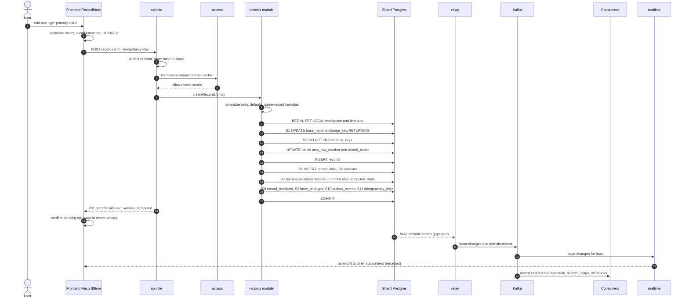

### 49.2 Flow: update record (cell edit)

This is the hottest path; budget: p50 < 60 ms, p99 < 250 ms server time.

1. **P1** Grid commits the editor value; RecordStore applies optimistic value to the pending layer (visible immediately); sends `PATCH …/records` `{records:[{id, fields:{fld_x: value}}], clientMutationId}` (or WS `mutate`). Typing does **not** send per keystroke — commit on blur/Enter; rich text uses Yjs instead.
2. **P3–P7** AuthN/AuthZ (`record.update`, field edit restrictions, row policy evaluated against **current** values later in txn); normalize the value with the field codec (e.g., currency → decimal string, select label → `opt_` id when `typecast=true`); compute the set of **dependent fields** from the dependency graph (`SchemaSnapshot.dependents(fieldIds)`).
3. **Txn:** S1 → S2 → S3 (lock records by id) → optional `If-Match` check (`version` equality, else `412`) → row-policy check against locked current values → in-memory plan: per-cell LWW stamp `cell_meta[slot] = {seq, by, at}`; inverse ops capture **old values**; same-record formulas recomputed from merged cells → S4 single `UPDATE` (cells + computed) → S5 if link cells changed → S6 sidecars for changed indexed slots → S7 cross-record propagation (lookups/rollups in records linking to this one; fan-out from `record_links` reverse lookup) → S8 revisions (one row per changed field, including computed fields only if `revisions.trackComputed` is enabled for the field — off by default) → S9 → S10 `record.updated` (`data.changedFieldIds`, old/new values for fields ≤ 4 KB; larger values referenced) → S11 → COMMIT.
4. **After commit:** realtime op `cells.set` with `seq`; other clients apply unless they have a pending local op on the same cell with a later local intent (their own server ack will win by seq — D9 LWW by server order). Automations matching "record updated" with watched fields; search reindex; webhooks.

Conflict semantics (D9): two users edit the same cell concurrently → both txns serialize on the base lock; the later commit gets the higher `seq` and wins; the earlier user's client receives the later op and replaces its confirmed value. Different cells of the same record never conflict (per-cell merge in S4 uses `||` on the locked row). Strict API clients can use `If-Match`.

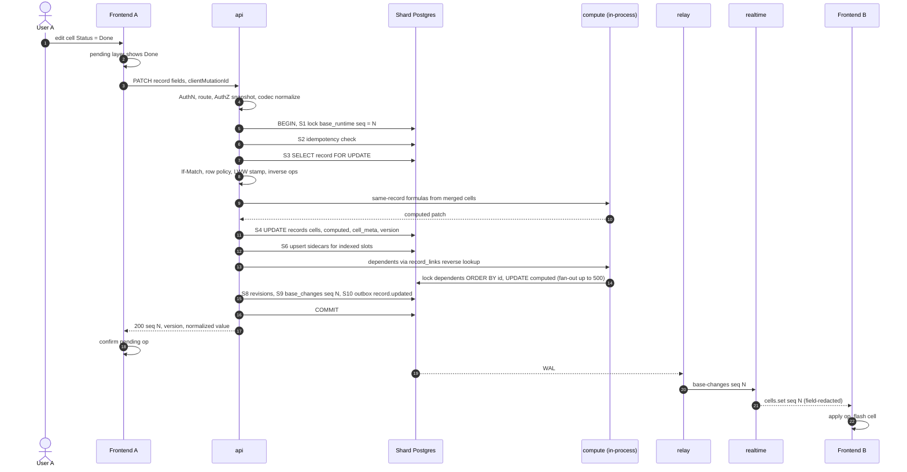

### 49.3 Flow: delete record

Records are **soft-deleted** into a restorable trash entry (`deletion_batches`, `TRASH_RETENTION` 30 days).

1. **P5** AuthZ `record.delete` + table restriction "who can delete records" + row policy.
2. **Txn:** S1 → S2 → S3 lock records by id → create trash entry:
   ```sql
   INSERT INTO data.deletion_batches (id, workspace_id, base_id, kind, root_ids, payload, deleted_by, deleted_at, expires_at)
   VALUES ($batch, $ws, $base, 'records', $ids, $payload::jsonb, $actor, now(), now() + interval '30 days');
   ```
   `payload` captures what is not retained in the soft-deleted rows themselves: the removed **links** (`[{relationId, a, b, aOrder, bOrder}]`).
3. Remove links (S5) for every relation touching the records: `DELETE FROM record_links WHERE relation_id = ANY($rels) AND (a_record_id = ANY($ids) OR b_record_id = ANY($ids)) RETURNING *` → captured into the batch payload (statement order: DELETE … RETURNING first, then the `deletion_batches` INSERT with the returned rows).
4. `UPDATE data.records SET deleted_at = now(), deleted_by = $actor, deletion_batch_id = $batch, version = version + 1 WHERE table_id = $table AND id = ANY($ids)`.
5. Delete sidecar rows for those records (rebuilt from `cells` on restore).
6. `UPDATE tables SET record_count = record_count - $n`.
7. S7: linked records lose links → recompute their lookups/rollups/counts (sync ≤ 500, else stale).
8. S8 revisions (one per record, `kind = delete`); S9 `base_changes` op `record.delete` with inverse `record.restore {batchId}`; S10 `record.deleted` (+ `record.links_changed` for affected linked records, `record.computed_updated`); S11.
9. **After commit:** realtime removes rows; search deletes documents; automations do not have a "record deleted" trigger in MVP but the event exists for webhooks/sync; comments on deleted records are hidden (not deleted) until purge.
10. **Purge** (scheduler `purge` queue, daily): batches past `expires_at` → hard delete records, comments, revisions references remain until their own retention; attachments unreferenced → orphan GC; emits `trash.purged`. Hard deletes are chunked (§50.9).

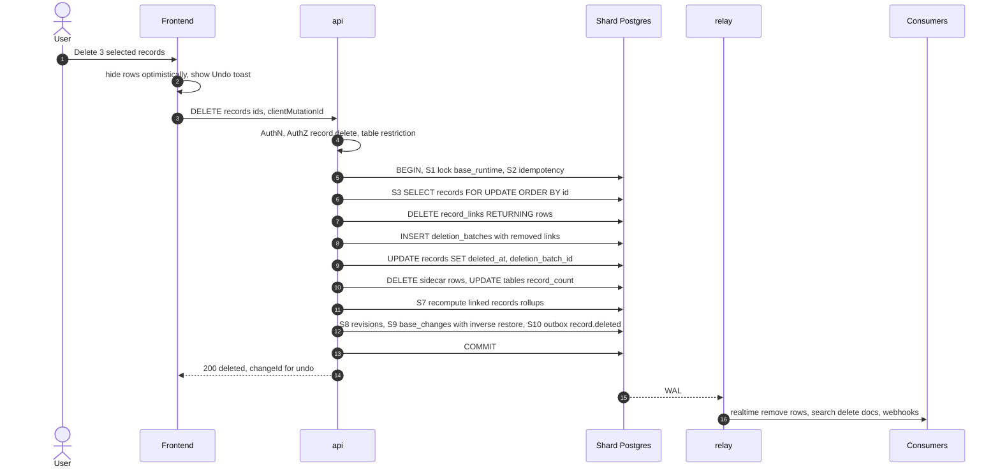

### 49.4 Flow: create field

1. **P1** Field config dialog validates with the shared Zod schema; formula fields are parsed and type-checked **client-side** with `@tabula/formula` against the cached `SchemaSnapshot` for instant diagnostics (server re-checks authoritatively).
2. **P5** AuthZ `field.create` (`base.manage_schema` for creators).
3. **P7** `schema` validates config via the field type plugin; for `formula`/`lookup`/`rollup`/`count`: `formula.compile`, extract dependencies, `compute.validateNoCycle` (max chain `MAX_DEPENDENCY_CHAIN` = 32); for `link`: target table exists in the same base, inverse field name chosen; plan limit "fields per table" (500 hard).
4. **Txn (schema op):**
   1. S1 with schema bump: `UPDATE base_runtime SET change_seq = change_seq + 1, schema_version = schema_version + 1 WHERE base_id = $base RETURNING …` — every concurrent record write that validated against the old snapshot will fail its S1 check with `409 SCHEMA_CHANGED` and be retried transparently once by the server with the new snapshot.
   2. S2 idempotency.
   3. Slot allocation: `UPDATE tables SET next_field_slot = next_field_slot + 1 WHERE id = $table RETURNING next_field_slot - 1 AS slot` (never reused, spine §3).
   4. `INSERT INTO fields (id, workspace_id, base_id, table_id, slot, type, name, config, restrictions, order_key, created_by, …)`.
   5. Link fields: allocate a slot on the target table as well, insert the inverse field, `INSERT INTO link_relations (id, …, a_table_id, a_field_id, b_table_id, b_field_id, a_multiple, b_multiple)` (via `links.createRelationInTx`), set `config.linkRelationId`/`inverseFieldId` on both.
   6. Computed fields: `compute.registerFieldInTx` → `INSERT INTO field_dependencies (dependent_field_id, depends_on_field_id, via_link_field_id)` rows.
   7. **Initial values:**
      * Stored types: nothing to write (empty ⇒ key absent).
      * Computed types on tables with `record_count ≤ COMPUTE_SYNC_FANOUT_LIMIT` (500): compute inline — `SELECT … FOR UPDATE ORDER BY id` the table's records, evaluate, single `UPDATE … FROM jsonb_to_recordset` writing `computed[slot]`.
      * Larger tables: `INSERT INTO long_operations (id, kind='field.backfill', status='queued', target, checkpoint='{}', …)`; the field's `config.computeState = 'backfilling'` so clients render a loading state and queries treat the field as unsortable/unfilterable until done.
   8. S9 `base_changes` op `field.create` (inverse `field.delete`), S10 outbox `field.created` (+ `link_relation.created`), S11.
5. **After commit:** realtime broadcasts a **schema op** — clients invalidate TanStack Query metadata and fetch the new snapshot (`schemaVersion` in the op); the backfill job (compute queue) runs in chunks (§50.9), each chunk writing `computed` and emitting one `record.computed_updated` batch event; on completion `config.computeState` is cleared in a final schema txn (another `schema_version` bump) and `long_operation.completed` is emitted.

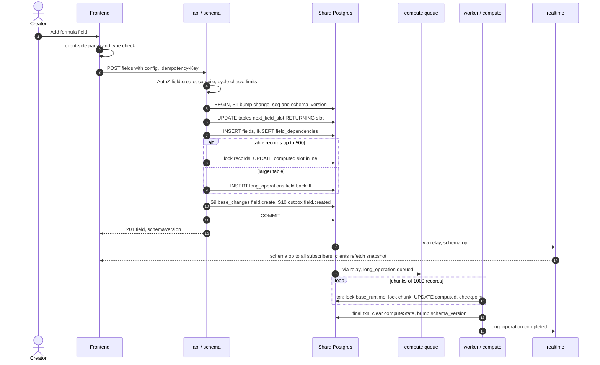

### 49.5 Flow: change field type (long operation)

Field type changes are the most dangerous user-level operation: they rewrite potentially millions of cells, must not block other edits, must be cancellable, and must be undoable. Two designs were considered.

| Design | How | Pros | Cons |
|---|---|---|---|
| **A. In-place batches + dual-read** | Convert values in place batch by batch in id order; a `watermark` record id splits the table: ids ≤ watermark hold new-type values, ids > watermark hold old-type values; readers convert on the fly above the watermark | No extra storage | Every reader (queries, filters, sort, sidecars, formulas, API, realtime) must understand a half-converted field; SQL filters cannot be compiled for one type; rollback requires a reverse conversion (lossy: number → text → number is fine, multi_select → text → multi_select is not) |
| **B. Shadow slot + dual-write + atomic cutover** **[Ours]** | Allocate a **new slot** for the converted values. Background batches fill the shadow slot; the write pipeline **dual-writes** edits made during conversion (old slot as usual, plus converted value into the shadow slot); cutover is one short schema txn that points the field at the shadow slot | Readers never see a half-converted field (they read the old slot until cutover); cutover is atomic; rollback before cutover = discard shadow slot; undo after cutover = point back to the retained old slot | Temporary extra storage for one field; dual-write logic in the pipeline while a conversion is active |

**Decision: B.** It reuses invariants we already have (slots never reused, D6; per-record `version`) and keeps the read path simple. "Dual-read" from the brief is satisfied in a narrower form: only the conversion **preview** reads both representations.

Fast paths:

* **Metadata-only conversions** (representation identical, e.g. `text ↔ long_text` (plain), `email/url/phone → text`, `single_select` option-set edits): one schema txn, no long op.
* **Small tables** (≤ 2,000 records): whole conversion in one txn, synchronous response.

Steps for the general case:

1. **Preview** (`POST …/fields/{id}:previewTypeChange`): `schema` samples ≤ 200 records, runs the converter from `@tabula/fields` (pure), returns counts of values that will be lost/coerced (e.g., "37 values are not valid numbers and will be cleared"). No writes.
2. **Start txn:** S1 (seq + `schema_version` bump) → allocate shadow slot (`UPDATE tables SET next_field_slot …`) → `INSERT long_operations (kind='field.convert', status='running', checkpoint='{"afterId":null}', params={fieldId, fromType, toType, toConfig, shadowSlot, oldSlot})` → `UPDATE fields SET config = config || '{"pendingConversion": {...}}'` → `base_changes` op `field.conversion_started` (not undoable; cancel instead) → outbox `long_operation.progressed`. From this point **every** write txn that touches the field (create, update, import, automation, undo) dual-writes `cells[shadowSlot] = convert(newValue)` in the same S4 statement. The field stays editable **with old-type semantics** until cutover.
3. **Batches** (worker, `compute` or `maintenance` queue; one txn per batch of 1,000 records, `statement_timeout = 15s`):
   ```sql
   SELECT id, version, cells -> $oldSlot AS v FROM data.records
    WHERE table_id = $t AND id > $afterId AND deleted_at IS NULL ORDER BY id LIMIT 1000;   -- no lock
   -- convert in memory (pure converter)
   UPDATE data.records AS r SET cells = CASE WHEN x.nv IS NULL THEN r.cells - $shadowSlot
                                             ELSE jsonb_set(r.cells, ARRAY[$shadowSlot], x.nv) END
     FROM jsonb_to_recordset($batch) AS x(id uuid, version bigint, nv jsonb)
    WHERE r.table_id = $t AND r.id = x.id AND r.version = x.version;      -- record version check
   UPDATE data.long_operations SET checkpoint = jsonb_build_object('afterId', $lastId), progress = $p WHERE id = $lop;
   ```
   Rows whose `version` changed since the read are skipped: they were modified concurrently, and that writer already dual-wrote the shadow slot — so skipping is correct, not lossy. Batches take **no** `base_runtime` lock and emit no `base_changes` (the shadow slot is invisible). Throttling: batch pacing by shard CPU and replication lag (§51.5). Cancel: the worker checks `long_operations.status` between batches.
4. **Cutover txn** (short): S1 (seq + `schema_version` bump) → assert checkpoint reached the end and `pendingConversion.lopId` matches → `UPDATE fields SET type = $toType, slot = $shadowSlot, config = $toConfig || {"previousSlot": {slot, type, config, cutoverSeq, expiresAt: now()+30d}}` → re-typecheck dependent formulas (`compute.registerFieldInTx`; formulas that no longer type-check get `config.error` rather than blocking the change) → `INSERT long_operations` for dependent recompute and for sidecar rebuild of the new slot (if indexed) → `record_revisions` single schema-level entry (`kind = type_change`) rather than one per cell → `base_changes` op `field.type_change` with inverse `field.type_change_revert {previousSlot}` → outbox `field.type_changed`, `long_operation.completed`.
5. **After commit:** clients receive the schema op and refetch the snapshot; grids re-render the column from the new slot (values for the current window are refetched — ops don't carry every cell).
6. **Rollback before cutover** (user cancel or failure): txn removes `pendingConversion`, bumps `schema_version`; a purge job strips the shadow slot (`cells - $shadowSlot`) in batches. Nothing user-visible changed.
7. **Undo after cutover** (within `previousSlot.expiresAt`): a new conversion long op in reverse: for records whose new-slot `cell_meta[slot].seq ≤ cutoverSeq` the old slot value is still exact and is reused; for records edited after cutover the current value is converted back (best effort, preview shows losses). Then a cutover txn swaps slots back. After expiry, the purge job removes the old slot keys.

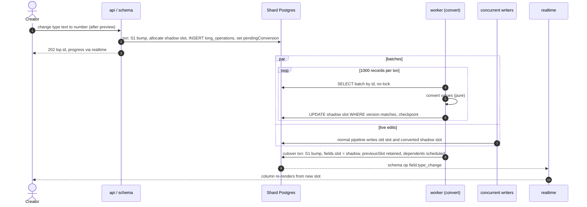

### 49.6 Flow: link records

Linking is a cell edit on a `link` field (or `contact` field), expressed as **set ops** (`link.add`, `link.remove`, `link.reorder`) that commute (D9).

1. **P1** User picks records in the link picker (`search_candidate` endpoint backed by `query` with the field's `config.candidateFilter`); optimistic chip appears.
2. **P5** AuthZ: `record.update` on the source record and field; read permission on the target table (to see candidates). Linking does **not** require edit permission on the target table although it changes the inverse field — matching observed product behavior; restricted inverse fields are covered by the field restriction on the source side.
3. **Txn:** S1 → S2 → S3 lock the source record(s) → lock target records with `FOR KEY SHARE` (prevents concurrent delete; does not conflict with cell updates) and verify `deleted_at IS NULL` → **cardinality check**: if the source side is single (`a_multiple = false`), compute removals of the existing link (replace semantics); if the target side is single, `SELECT a_record_id FROM record_links WHERE relation_id = $rel AND b_record_id = ANY($targets)` — any existing link is removed (replace) or rejected (`409 LINK_CARDINALITY`) per relation config. This check is race-free **without SERIALIZABLE** because every writer of this base holds the `base_runtime` lock (§50.6). → S5 `DELETE`/`INSERT record_links` with fractional order keys → bump `version` and `cell_meta` for the link slot on **both** sides (the inverse field changed too) → S7 recompute lookups/rollups/counts on both sides and their dependents → S8 revisions on both sides → S9 one `base_changes` row with ops on both records → S10 `record.links_changed` (both records) + `record.updated` for the source → S11.
4. **After commit:** realtime delivers link ops for both tables; automations watching either field fire once per affected record.

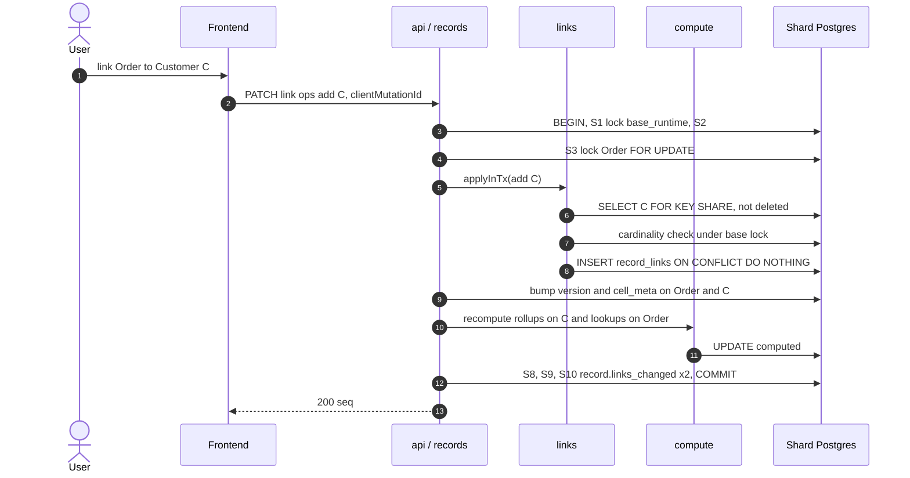

### 49.7 Flow: run automation

Detail in [14](14-automation-engine.md); here the transactional skeleton.

1. A committed write produced `record.updated` (S10) with `causationDepth = d`.
2. `relay` → `tabula.domain-events.v1` (MVP: BullMQ `automation-trigger`).
3. **Trigger matcher** (worker): looks up the per-base trigger index (cached by automation version); evaluates trigger conditions (field watched? record matches view/filter? — evaluated with `@tabula/filter` JS evaluator on the event's after-image; if the event payload is incomplete, it reads the record); rejects if `d + 1 > MAX_CAUSATION_DEPTH` (8) or hourly budget `ratebudget:automation:{id}:{hour}` exhausted.
4. **Txn (control of run identity):** `INSERT INTO automation_runs (id, automation_id, automation_version_id, run_key, status='queued', trigger_event_id, causation_depth, trigger_payload, …) ON CONFLICT (run_key) DO NOTHING RETURNING id` with `run_key = automation_id || ':' || trigger_event_id` → if no row returned, the event is a duplicate delivery: ack and stop. Outbox `automation.triggered`. Usage metered via outbox → `tabula.usage.v1`.
5. Enqueue `automation-trigger` job (hint) → **planner** creates the first `automation_step_runs` row (`status='queued'`, `lease_until`) and enqueues `automation-step`.
6. **Step executor** claims the step (`UPDATE automation_step_runs SET status='running', lease_until=now()+interval '60s', attempt = attempt + 1 WHERE id=$s AND status IN ('queued','retrying') RETURNING …`), executes:
   * **Record action** (`update_record`): calls `records.updateRecords` with actor `{type:'automation', id: aut_…}`, `correlationId = run id`, `causationId = trigger event id`, `causationDepth = d + 1`, `Idempotency-Key = step_run_id + ':' + attempt_group` → a normal base write txn (§49.2) — its own events may trigger further automations up to depth 8.
   * **External action** (HTTP, email, Slack, AI, script): performed **outside** any DB txn, with an idempotency key derived from the step run id where the target supports it.
7. **Step completion txn:** `UPDATE automation_step_runs SET status='succeeded', output=…`; next step row inserted; `automation_runs` counters updated; on last step `status='succeeded'` + outbox `automation.completed`. Failure: retry with backoff (delayed BullMQ job; row `status='retrying'`); terminal → `automation.step_failed` + `automation.failed`.
8. **Reconciler** (scheduler) re-enqueues steps with expired leases (Redis loss or worker crash).

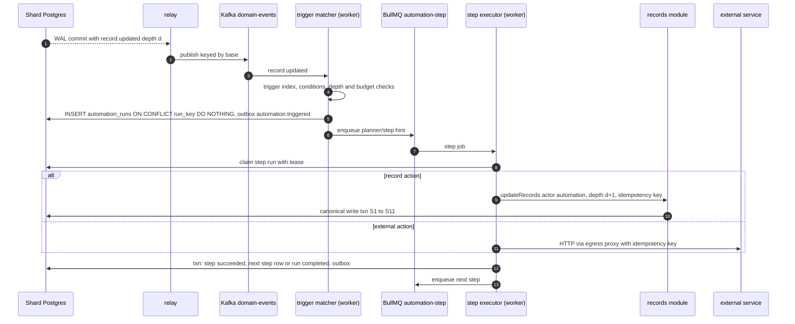

### 49.8 Flow: upload attachment

1. **P1** User drops a file in an attachment cell. Frontend calls `POST /v1/bases/{baseId}/attachments:upload` with `{filename, size, mime, checksum, tableId, fieldId}`.
2. AuthZ: `record.update` on the field (or share-token scope for forms); plan checks: max file size, base storage quota (`billing.checkLimit`).
3. **Control txn on shard** (no base lock — attachments are not change-log ops yet): `INSERT INTO attachments (id, workspace_id, base_id, object_key, filename, mime_declared, size, checksum, status='pending_upload', uploaded_by, …)`. Object key `{workspaceId}/{baseId}/{attachmentId}/original` in `tabula-uploads-quarantine`. Response: S3 multipart upload id + presigned part URLs (15-min expiry).
4. Browser uploads parts **directly to S3**, then calls `…/attachments/{id}:complete` with part ETags → `api` completes the multipart upload, verifies size/checksum with `HeadObject` → txn: `UPDATE attachments SET status='uploaded'` + outbox `attachment.uploaded`.
5. Frontend issues the **cell edit** (`PATCH record` with the new attachment id appended) — canonical pipeline §49.2; inside the txn `attachments.validateOwnershipInTx` checks the attachment belongs to this base, was uploaded by this principal (or share token), and is not `rejected`. The cell shows "processing" until variants exist; originals are not downloadable until clean.
6. `attachment.uploaded` → `file-scan` job: stream from quarantine to ClamAV; sniff real MIME (magic bytes) vs declared; **clean** → `CopyObject` to `tabula-attachments` (SSE-KMS) → txn `UPDATE attachments SET status='clean', mime=…` + outbox `attachment.scanned`; **infected/mismatch** → `status='rejected'` + `attachment.rejected` (cell renders a blocked file; the user is notified).
7. `attachment.scanned` → `file-process` job: libvips thumbnails (small/large), ffmpeg poster, PDF first page → `INSERT attachment_variants` → txn: `UPDATE attachments SET status='ready'` + a **system change**: S1 lock + `base_changes` op `attachment.ready {attachmentId, variants}` (non-undoable, actor `system`) so realtime clients replace the placeholder; outbox `attachment.processed`.
8. Orphans (uploaded but never referenced within 24 h) are deleted by the purge job; quarantine bucket lifecycle (7 days) is the backstop.

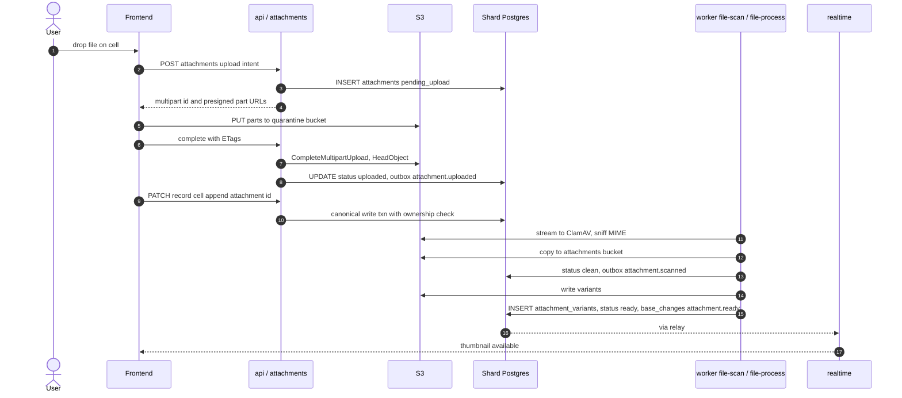

### 49.9 Flow: submit public form

1. Anonymous user opens `https://share.tabula.example/f/{token}`: the `api` serves the HTML shell with bootstrap JSON (`share.resolve(token)` → form definition: visible fields, labels, required flags, conditions, field configs needed for editors — **no other data**). Share link status and form definition are cached in Redis by token + `schema_version`.
2. Attachments in the form: upload intents scoped to the share token (§49.8, quota counts against the base; stricter size limit; rate-limited per IP).
3. Submit `POST /v1/public/forms/{token}:submit` with `{values, captchaToken, clientSubmissionId}`:
   1. Edge: WAF bot rules, per-IP and per-token rate limits (`rl:share:{token}`).
   2. Captcha/turnstile verification (when enabled for the form or abuse detected).
   3. `share.resolve(token)`: link active, not expired, org policy still allows public forms, password/allowed email domains satisfied.
   4. Validate: only form-visible fields accepted (others rejected, not ignored — prevents writing hidden fields); required fields; field codecs normalize; conditional field logic re-evaluated server-side; hidden prefilled fields allowed only if configured.
   5. `records.createRecords` with actor `{type:'public_form', id: shr_…}`, `via:'form'`, `Idempotency-Key = clientSubmissionId` (prevents double submits) → canonical create txn (§49.1), plus outbox `form.submitted {viewId, recordId}`.
4. After commit: automations "when form submitted"; notification to form owner (if enabled); response shows the configured thank-you message or redirect URL (validated against an allowlist of schemes).

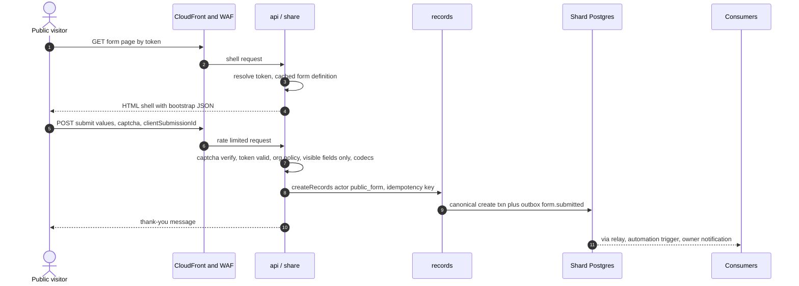

### 49.10 Flow: AI field execution

`ai_generated` fields are computed **asynchronously** (spine §4): `{value, status: ok|pending|error, inv}`.

1. A user edit changes an input field of an AI field (dependency graph includes AI fields like any computed field).
2. **Inside the user's write txn (S4/S7):** compute sets the AI field's computed value to `{value: <previous>, status: 'pending', inputsHash: H}` — clients immediately show a "generating" state with the stale value dimmed. No AI call inside a txn, ever.
3. Outbox `record.updated` → relay → compute's **AI field runner** consumer (queue `ai`, concurrency per workspace for fairness):
   1. Policy: workspace AI policy allows this field's data classes; AI credits available (`billing.checkLimit(org, 'ai.credits')`).
   2. Re-read the record (no lock); if `computed[slot].inputsHash ≠ H` the event is superseded → ack and stop.
   3. `ai.invoke({id: aij_ = UUIDv5(fieldId, recordId, H), template, model, inputs, schema})` — idempotent by invocation id: `INSERT INTO ai_invocations … ON CONFLICT (id) DO NOTHING`; if a completed invocation exists, its result is reused (also `ai:cache:{hash}` across records with identical inputs if the template is deterministic-cacheable).
   4. Provider call (default model per D22, e.g. `claude-haiku-4-5-20251001` for classification/extraction fields), structured output validated against the field's result type codec; one repair retry.
   5. **Write-back txn:** S1 lock → `SELECT … FOR UPDATE` the record → if `inputsHash` still `H`: `UPDATE records SET computed = jsonb_set(computed, '{slot}', '{"value":…,"status":"ok","inv":"…"}')`, recompute dependents of the AI field (sync ≤ 500) → `base_changes` op (actor `{type:'ai'}`, not undoable individually) → outbox `ai_field.value_generated`, `record.computed_updated`. If the hash changed meanwhile, discard (the newer event will produce its own invocation).
4. Failure: `status:'error'` with a user-safe message; retries with backoff for transient provider errors; `ai.invocation_failed` emitted.
5. Bulk (new AI field on 50k records): a backfill long op enqueues per-record invocations in chunks, rate-limited by org token budget; progress via `long_operations`.

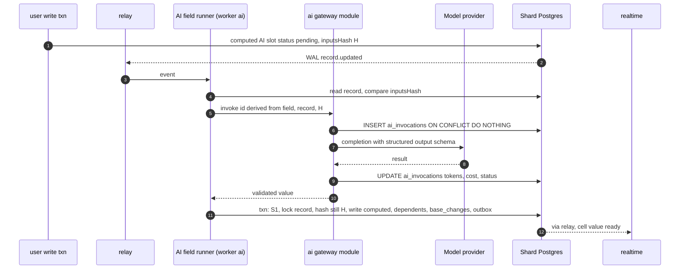

### 49.11 Flow: undo / redo

Model (D25): server-side command log with inverse ops on `base_changes.inverse_ops`; the client keeps a per-session stack of **change ids** it authored.

1. User presses Ctrl+Z → client pops `chg_…` from its undo stack → `POST /v1/bases/{baseId}/changes/{changeId}:undo` (`Idempotency-Key` = `undo:` + changeId).
2. `history.undo`:
   1. AuthZ: the change must have been authored by this principal (same user; same session for UI stacks) and be within `BASE_CHANGES_RETENTION` (30 days); the principal must still hold the permissions required by the inverse ops (re-checked per op; permission loss → 403).
   2. **Txn:** S1 (new seq M) → load `base_changes` row by id (`SELECT … FROM base_changes WHERE base_id=$b AND id=$chg`) → for each inverse op, **conflict detection**: cell ops compare the current `cell_meta[slot].seq` with the change's seq N — if a later change (seq > N) touched the same cell, that cell is **conflicted**; structural ops check preconditions (e.g., record still exists, field not deleted).
   3. Policy: default **all-or-nothing** — any conflict → rollback, `409 UNDO_CONFLICT` listing conflicted cells; the UI offers "Undo anyway (skip conflicted cells)" which re-calls with `mode=skip_conflicts`. We do not silently overwrite other users' later edits.
   4. Apply inverse ops via `kernel.OpRegistry.applyInTx` → each owning module (records, links, schema, views…) executes its normal write steps (S3–S8) as one change.
   5. S9 new `base_changes` row (seq M, `via='undo'`, `undoes = chg_N`, `inverse_ops` = the redo ops) → S10 `change.undone` + the regular domain events (`record.updated` with `actor.via = 'undo'`) → S11.
3. Client pushes `chg_M` to its redo stack. Redo = the same flow on `chg_M`'s inverse ops, emitting `change.redone`.
4. Automations: undo-generated record events **do** trigger automations (they are real changes) but carry `via:'undo'`, which trigger conditions can exclude.
5. Undo of special changes: record delete → `record.restore {batchId}` restores from `deletion_batches` (rows + links payload); field type change → reverse conversion long op (§49.5 step 7); schema deletes → restore from trash. Non-undoable ops (system/AI/attachment readiness) are excluded from user stacks.

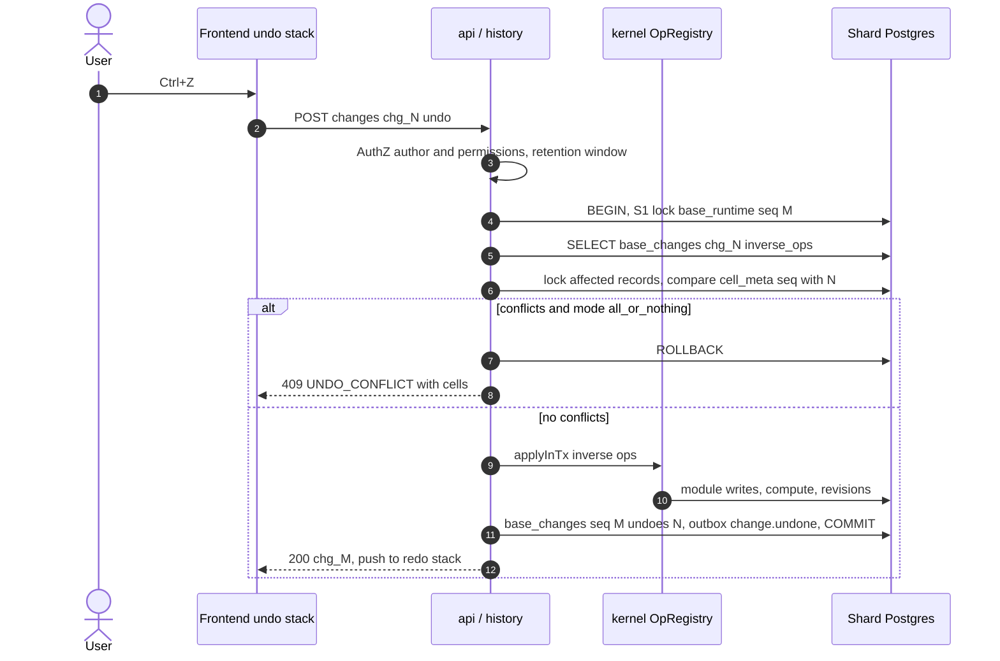

### 49.12 Flow: import (CSV/XLSX)

1. Upload file (presigned, `tabula-uploads-quarantine`, scanned like attachments) → `POST /v1/bases/{b}/imports` → `INSERT import_jobs (status='analyzing')` → `import` job streams the first 1,000 rows, infers types per column, proposes a mapping (new table or existing table, column → field, create-new-field suggestions, link resolution by primary value) → `status='awaiting_mapping'`.
2. User confirms mapping → `startImport`:
   * Schema changes first (new table/fields) in a single schema txn (§49.4 rules).
   * `INSERT long_operations (kind='import', checkpoint={"rowOffset":0})`; `import_jobs.status='running'`.
3. **Chunk loop** (worker `import`, chunk = 500 rows, adaptive 100–2,000 by row width):
   1. Stream-parse rows `[offset, offset+chunk)` from S3 (byte offset kept in checkpoint for CSV; row index for XLSX).
   2. Normalize with field codecs (`typecast` semantics); invalid cells → collected as row errors (cell left empty) unless "strict" mode.
   3. Resolve links: primary-value → record id map (cached per job; targets created in earlier chunks are found).
   4. **Txn per chunk:** S1 lock (one seq per chunk) → S2 (idempotency by `import:{jobId}:{chunkNo}` — chunk retries are no-ops) → row numbers → `INSERT records … SELECT FROM jsonb_to_recordset` (or `COPY` into a temp table + `INSERT … SELECT` for wide chunks) → `INSERT record_links` → sidecars → same-record computed in memory; cross-record propagation **always deferred** for imports (`computed_stale` bulk insert, one compute long op at the end) → revisions (one per record, `via='import'`) → `base_changes` op `records.bulk_create` (inverse = delete batch) → outbox **one** `records.bulk_changed` per chunk (+ `record.created` events only if the table has automations with "record created" triggers that do not exclude imports) → `INSERT import_errors` → `UPDATE long_operations SET checkpoint = {rowOffset, byteOffset}, progress` → COMMIT. The checkpoint commits atomically with the data, so a crash resumes exactly after the last committed chunk.
   5. Throttle between chunks: base write budget (5,000 records/min/base default, plan-adjustable for imports) and shard health (§51.5).
4. Finish: final compute drain for stale values, search bulk reindex for the table, `import_jobs.status='completed'`, outbox `import.completed` (notification to the user). Cancel: status flag checked between chunks; already-imported chunks remain and can be removed by "Undo import" (one deletion batch over all imported record ids).

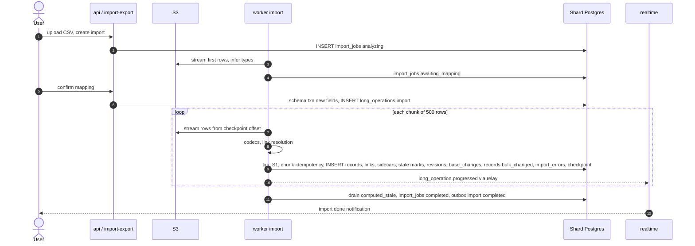

---

## 50. Transaction boundaries

### 50.1 Per-operation transaction map

Rule: **a transaction contains only Postgres work on one database** (one shard, or the control plane). Never a network call to S3, Kafka, Redis-as-truth, an AI provider, email or HTTP. Anything else happens before (validation, reads) or after commit (driven by the outbox).

| Operation | Inside the DB txn (single shard) | Before txn | After commit (via outbox / jobs) |
|---|---|---|---|
| Create/update/delete records (≤ 1000) | S1–S11 (§49.0): seq, records, links, sidecars, sync compute ≤ 500 dependents, stale marks, revisions, `base_changes`, `outbox_events`, `idempotency_keys`, `deletion_batches` (delete) | AuthN/Z, codecs, snapshot, formula compile | Realtime, automations, search, webhooks, usage, audit, deferred compute |
| Link/unlink | Same txn as the record edit, both sides | Candidate search | Same |
| Create field / table / view | Schema rows, slot allocation, dependencies, `schema_version` bump, inline compute for ≤ 500 records, `long_operations` row | Config validation, compile | Backfill chunks, cache warm, realtime schema op |
| Change field type | Start txn; N batch txns; cutover txn (each separate) | Preview | Dependent recompute, sidecar rebuild, shadow purge |
| Automation run | Run row insert (`ON CONFLICT`), each step state transition is its own txn; record actions are their own canonical write txns | Trigger matching | Next step enqueue |
| External automation action | **No txn** around the call; step result recorded in a txn afterwards | — | Retry by job |
| Attachment upload | `attachments` row insert; status transitions (each own txn) | Presign | Scan, process, variants |
| AI field | Pending marker in the user's txn; write-back in a separate txn | — | Provider call between them, outside any txn |
| Undo | One txn: inverse ops applied as one change | Permission checks | Same as record writes |
| Import | One txn per chunk (data + checkpoint atomic) | Parse/analyze | Final drain, reindex |
| Grant change (control plane) | `access_grants` + `core.outbox_events` (Proposed addition 26) in the control txn; `perm_epoch` bump on affected bases happens in a **follow-up data-plane txn** per base (driven by the event) | — | Realtime re-evaluates subscriptions |
| Workspace creation | Control txn: `workspaces`, `workspace_directory`; then data-plane txn creates nothing (bases come later) | Shard selection | — |
| Base creation | Control txn registers `base_directory` (status `provisioning`) → shard txn inserts `bases`, `base_runtime`, first table/fields → control txn flips directory to `active` | — | Saga with compensation, §50.10 |

### 50.2 The dual-write problem

Any operation that must both **change the database** and **tell another system** (Kafka, search, a webhook, a client) has two writes that cannot be made atomic directly:

| Approach | Failure mode |
|---|---|
| Commit, then publish | Process crashes after commit, before publish → the event is **lost**: automations never fire, search is stale forever, realtime clients miss an op (gap in seq) |
| Publish, then commit | Commit fails (constraint, deadlock, timeout, failover) after publish → consumers act on a change that **never happened** (phantom automation emails, phantom webhooks); also consumers may read the DB before the commit is visible and see old data |
| Publish inside the txn (before commit) | Same as publish-then-commit, plus the txn now holds row locks (including the base lock) during a network call → latency and lock contention explode |
| Distributed transaction (XA/2PC) | Kafka does not participate in XA with Postgres; operational complexity, blocking coordinators |

**Transactional outbox:** the event is written as a row **in the same transaction** as the state change. Commit makes both durable atomically. A separate process (the relay) publishes committed rows. Publishing may happen more than once, never zero times, and never for uncommitted work → **at-least-once** delivery with consumers made idempotent (§50.5).

### 50.3 The outbox and the logical replication relay in depth

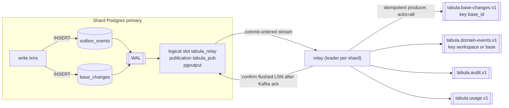

Mechanics:

1. **Publication** `CREATE PUBLICATION tabula_pub FOR TABLE data.outbox_events, data.base_changes WITH (publish = 'insert');` — only inserts are streamed; purges (deletes/partition drops) are not.
2. **Slot** `tabula_relay` per shard (pgoutput, protocol v2+, `streaming = off` — we want whole committed transactions, not in-progress chunks). The relay is a leader-elected process per shard (advisory lock on the shard; standby relay hot).
3. **Ordering:** logical decoding emits transactions in **commit order**. Since every base write holds the base lock until commit (S1), commit order within a base equals `seq` order → `tabula.base-changes.v1` (keyed by `base_id`, so one partition per base) carries a **gap-free, ordered** seq stream per base. This is what realtime catch-up and webhook cursors rely on ([16](16-realtime.md)).
4. **Batching & ack:** the relay accumulates messages (≤ 5 ms or 1,000 rows), produces with the idempotent producer (`enable.idempotence=true`, `acks=all`), and only after **all** sends of a transaction are acknowledged does it send `StandbyStatusUpdate` with that transaction's end LSN as flushed. A crash between produce and confirm → the slot replays from the last confirmed LSN → duplicates (handled by idempotent consumers; event `id` is stable because it is the row id).
5. **Routing:** `outbox_events.type` → topic (domain events, plus audit if `audit=true` flag in payload metadata, usage if metering flag); `base_changes` → base-changes topic. MVP profile: the same relay routes to BullMQ queues instead of Kafka (`EventBus` interface, D11).
6. **Retention of the tables:** the rows are needed only until relayed — but we keep them for recovery: `outbox_events` 72 h (daily partitions, dropped by partition maintenance), `base_changes` 30 days (it is also the catch-up/undo log, D10).
7. **Failover:** on PG16 RDS a logical slot does not survive failover to a standby. Recovery procedure (automated in the relay): on startup after failover, create a new slot (`EXPORT_SNAPSHOT`), then **backfill by table scan** of `outbox_events`/`base_changes` rows with `created_at > last_relayed_at − 5 min` (the relay persists `last_relayed_at` and last `(base_id, seq)` per base in Redis and periodically in `kernel` state), publish them (duplicates are fine), then switch to streaming from the new slot. With PG17+ failover slots (`failover = true` + `sync_replication_slots`) this fallback becomes rare but stays as the safety net.
8. **Slot safety:** `max_slot_wal_keep_size` caps WAL retention (e.g., 50 GB) so a stuck relay cannot fill the disk; alert on slot lag > 30 s and > 5 GB; if the cap is hit the slot is invalidated and recovery uses step 7.
9. **Why not poll the outbox table?** Polling by `id`/`created_at` misses rows from long transactions that commit later with smaller ids (visibility order ≠ id order), forcing "safety windows" and re-reads; it adds index scans on hot tables. Logical replication delivers exactly what committed, in commit order. **Alternative considered:** `pg_logical_emit_message(true, 'tabula', payload)` (transactional WAL messages with no table at all — less bloat), rejected for now because it leaves nothing to scan in the failover recovery path and nothing for operators to query; revisit if outbox write amplification becomes significant.

### 50.4 Idempotency

Three layers, each for a different retry source:

| Layer | Key | Scope & storage | Semantics |
|---|---|---|---|
| **API `Idempotency-Key`** (public API, SDKs, automations' record actions) | client-supplied string ≤ 255 chars | `idempotency_keys(workspace_id, scope = principal id, key)`; 24 h TTL; request hash = SHA-256 of method + path + canonical body | Same key + same hash → stored response replayed (status + body); same key + different hash → `422 IDEMPOTENCY_KEY_REUSED`. Row written **in the same txn** as the effect (S11), so "effect happened" ⇔ "key recorded". Concurrent duplicates serialize on the base lock (S1) and the second sees the first's committed key at S2. Redis `idem:{scope}:{key}` is a fast path only |
| **Client mutation id** (first-party UI, WS `mutate`) | `clientMutationId` UUIDv7 | Stored as the idempotency key with scope `session:{sessionId}`, TTL 1 h; also on `base_changes.client_mutation_id` so a reconnecting client recognizes its own ops in catch-up | Reconnect + resend never double-applies; the client also learns the final seq of its pending op from catch-up |
| **Run / job keys** (internal) | `automation_runs.run_key = automation_id:trigger_event_id`; step idempotency key `step_run_id:attempt_group`; import chunk `import:{job}:{chunk}`; AI invocation id UUIDv5(field, record, inputsHash); webhook delivery `(subscription_id, seq_range)` | Unique constraints on the owning tables | Duplicate deliveries of the same event become no-ops at the first `INSERT … ON CONFLICT DO NOTHING` |

Non-base operations (control plane, attachments intents) use the **claim-first** variant: `INSERT … status='in_progress' ON CONFLICT DO NOTHING` at txn start (a concurrent duplicate blocks on the unique index until the first commits or rolls back), then `UPDATE … status='completed', response` before commit.

### 50.5 At-least-once delivery and idempotent consumers

Every consumer must tolerate duplicates and (across partitions) reordering. Patterns used:

| Consumer | Idempotency technique |
|---|---|
| Realtime fan-out | Ops carry `(baseId, seq)`; gateway tracks last delivered seq per base; clients drop `seq ≤ lastApplied`, request catch-up on gaps |
| Automation trigger matcher | `automation_runs.run_key` unique |
| Search indexer | External versioning: document version = `baseSeq`; older versions rejected (OpenSearch `version_type=external`; Postgres `WHERE excluded.version > search_documents.version`) |
| Notifications | Unique `(user_id, dedup_key)` with `dedup_key = event_id:category` (Proposed addition PA-26-4) |
| Webhooks | Per-subscription monotonic `last_notified_seq`; notification payloads are "changes since cursor", inherently idempotent |
| Audit writer | Unique `audit_events.event_id` |
| Usage meter | Unique `usage_events.event_id`; counters derived by aggregation, not increments-per-message |
| Compute (stale drain) | Recompute is a pure function of current state; `computed_stale` rows deleted only if `marked_seq` unchanged |
| AI runner | `inputsHash` check + invocation id |

Kafka consumer offsets are committed **after** processing (never before). Poison messages: 5 attempts with backoff then `*.dlq` topic with the error; `tools/replay` re-injects after a fix.

### 50.6 Isolation levels and explicit locks

**Default: READ COMMITTED** for all transactions. Reasoning: our correctness relies on explicit row locks taken in a fixed order (§50.7), which work fully under READ COMMITTED; SERIALIZABLE (SSI) would add predicate-lock overhead and serialization-failure retries on the hottest path (GIN-indexed JSONB updates produce many false-positive conflicts), and REPEATABLE READ would make `UPDATE` of a concurrently modified row fail instead of waiting.

| Invariant | Mechanism (not isolation level) |
|---|---|
| Gap-free per-base `seq`, commit order = seq order | `UPDATE base_runtime … RETURNING` row lock held to commit (S1) |
| No lost cell updates | `SELECT … FOR UPDATE` on records (S3) + per-cell merge `||` |
| Link cardinality (single side) | Check + write under the base lock; all writers of a base serialize on S1, so no concurrent writer can interleave. Links are intra-base, so the base lock covers both sides. Integrity checker (nightly, per shard) verifies cardinality as defense in depth |
| Target record not deleted while linking | `FOR KEY SHARE` on target rows |
| Unique primary values | **Not enforced** (product semantics allow duplicates [Observed]). Optional "unique" field validation (V1) is checked under the base lock with an indexed lookup on `record_index_text` |
| Slot / row number allocation | Counter columns on `tables` updated under the base lock (`UPDATE … RETURNING`) |
| Automation schedule claiming | `FOR UPDATE SKIP LOCKED` |
| Long op single runner | Lease columns on `long_operations` (`UPDATE … WHERE lease_until < now() RETURNING`) |
| Control-plane counters (seats, usage thresholds) | Single-row `UPDATE … RETURNING`; SERIALIZABLE used **only** in rare admin operations that read-then-write across many rows (e.g., org merge, last-owner protection when removing org owners) with retry on `40001` |

**Throughput consequence of the base lock and why we accept it.** All writes to one base serialize for the duration of their critical section. The critical section is short because everything expensive is done before BEGIN (P3–P9: auth, snapshot, codecs, formula compile). Target critical section p99 ≤ 15 ms → ≥ 60 write txns/s per base, each up to 1,000 records — above the per-base API rate limit (50 req/s) and the 5,000 records/min write budget. Alternative considered: **late seq allocation** (lock `base_runtime` as the last statement). It shortens hold time but (a) allows record-level deadlocks between writers whose dependent sets overlap (A→B vs B→A propagation), (b) makes cardinality checks racy, and (c) still serializes commit. Rejected; revisit per-table sequencing only if a single base's write rate becomes a measured bottleneck.

### 50.7 Lock ordering (deadlock avoidance)

Canonical order within a shard transaction:

1. `base_runtime` row (S1) — at most **one** base per transaction (cross-base operations, e.g. base duplication, never write two bases in one txn).
2. `tables` row(s) (counters) in `id` order.
3. Source `records` in `id` order (S3).
4. Link target records `FOR KEY SHARE` in `id` order.
5. Dependent `records` (propagation) in `(table_id, id)` order.
6. Insert-only tables (revisions, changes, outbox, idempotency) — no conflicts.

Because every writer of a base takes (1) first, (3)–(5) can never deadlock among base writers; the ordering of (3)–(5) matters for writers that legitimately skip (1): field-conversion batches (§49.5, which take **no** locks and use version checks) and maintenance jobs (which must lock records in `id` order and touch one table per txn). `lock_timeout` turns any unexpected wait into a fast, retryable error rather than a pile-up. Control-plane txns never lock data-plane rows (different databases) — cross-plane sequences are sagas (§50.10).

### 50.8 Timeouts per operation class

Set via `SET LOCAL` by `kernel.withBaseTx(opts)` according to the operation class.

| Class | `statement_timeout` | `lock_timeout` | `idle_in_transaction_session_timeout` | Notes |
|---|---|---|---|---|
| Interactive write (UI/API ≤ 100 records) | 3 s | 1.5 s | 10 s | Retried once server-side on `55P03` (lock timeout) / `40P01` (deadlock) |
| Batch write (API batch ≤ 1000, imports chunk) | 15 s | 3 s | 30 s | |
| Schema op | 5 s | 2 s | 10 s | Inline compute capped at 500 records |
| Interactive read/query | 5 s (view query), 2 s (single record) | n/a | — | Read replicas for exports/analytics |
| Export streaming (replica) | 120 s per cursor fetch window | n/a | 60 s | `pg-cursor` |
| Long-op chunk (backfill/convert/purge) | 15 s | 2 s | 30 s | Chunk size adapts down on timeout |
| Relay / maintenance | per task | 5 s | — | DDL uses `lock_timeout = '3s'` with retries (§51.4) |

### 50.9 Long operations: many short transactions with resumable checkpoints

Any operation that may touch more than ~1,000 rows runs as a `long_operations` row driven by a worker:

```text
long_operations: id, workspace_id, base_id, kind, status (queued|running|cancelling|cancelled|failed|completed),
                 params jsonb, checkpoint jsonb, progress (done,total), lease_owner, lease_until, attempts, error
```

* **Chunk txn** = do one chunk of work **and** advance `checkpoint` in the same transaction → exactly-once progress per chunk even with crashes (a re-run chunk either already committed — checkpoint moved — or rolled back entirely).
* **Keyset iteration** (`id > checkpoint.afterId ORDER BY id LIMIT n`), never `OFFSET`.
* **Lease:** worker renews `lease_until` every chunk; the reconciler re-enqueues expired leases; a second worker can only take over after expiry.
* **Cancellation:** cooperative (status checked before each chunk); compensation defined per kind (convert → drop shadow slot; import → optional undo batch; duplication → delete partial copy).
* **Fairness & throttling:** per-shard concurrency caps per kind; adaptive chunk size targeting 200–500 ms per chunk; pause when replication lag or slot lag is high (§51.5).
* **Visibility:** `long_operation.progressed` events (throttled to 1/s) drive realtime progress bars.

Kinds: `field.backfill`, `field.convert`, `field.convert_revert`, `compute.drain`, `sidecar.build`, `import`, `export`, `base.duplicate`, `snapshot.create`, `snapshot.restore`, `table.purge`, `records.bulk_update` (API filter-based updates), `search.reindex`.

### 50.10 Retries, rollback and compensation

| Situation | Handling |
|---|---|
| Serialization/lock errors (`40001`, `40P01`, `55P03`) | Retry whole txn ≤ 2 times with jitter (safe: nothing external happened inside) |
| `409 SCHEMA_CHANGED` at S1 | Server reloads snapshot and retries once if the command is still valid; otherwise returns 409 to client (client refetches schema) |
| Commit outcome unknown (connection lost during COMMIT) | Client/API retries with the same `Idempotency-Key`; the stored key tells whether it committed |
| Business validation failure | Rollback; RFC 9457 problem; client discards optimistic op and shows error |
| Consumer failure | Retry with backoff → DLQ; the producing txn is never rolled back (it committed) |
| Cross-database sequences (control plane + shard) | **Sagas with compensation**, state persisted: e.g., base creation: (1) control: `base_directory` status `provisioning`; (2) shard: create rows; (3) control: status `active`. Failure after (1) → reconciler finds `provisioning` older than 5 min → checks shard → completes or compensates (deletes directory row). Same pattern for workspace move and grant → `perm_epoch` propagation |
| External side effects in automations | Not rolled back; steps are designed idempotent; failures surface in run history with retry |
| User-level reversal | Undo (inverse ops), trash restore, snapshot restore — product-level compensation, not DB rollback |

---

## 51. Migration strategy

### 51.1 Tooling decision

| Option | Pros | Cons |
|---|---|---|
| **Kysely `Migrator`** (TS migration files) | Same toolchain; typed `sql` helpers; programmatic API easy to drive per shard | Minimal features: no phases, no lock analysis, single-DB mindset |
| **graphile-migrate** | Excellent dev loop (`current.sql` watch mode), idempotent SQL style, Postgres-native | Single-database workflow; committing `current.sql` → numbered migrations doesn't model phased (expand/contract) rollout across a fleet; less natural to embed in our orchestrator |
| **sqitch** | Dependency-based plans, verify/revert scripts, battle-tested | Perl runtime in our images/CI; separate mental model; per-shard orchestration still ours |
| Flyway/Liquibase | Mature, enterprise features | JVM; same orchestration gap |
| Atlas (declarative) | Diff-based, lint for destructive changes | Declarative diffs hide operational intent (CONCURRENTLY, NOT VALID, batching); partitions/RLS support gaps |

**Decision [Ours]: SQL-first migrations executed by a thin in-house runner built on Kysely's `Migrator` API (`@tabula/db/migrate`), orchestrated across shards by `tools/shard-migrate`.** Reasons: the hard part is *fleet orchestration and zero-downtime discipline*, which no tool above provides for N shards; Kysely's Migrator gives the ordered-ledger primitive; keeping TypeScript lets migrations reuse typed helpers (`createIndexConcurrently`, `addForeignKeyNotValid`, `batchedBackfill`). We add phase metadata, lock linting and the orchestrator ourselves (~1–2k LOC). graphile-migrate's dev loop is noted as an idea for local development (watch mode re-applying the working migration).

### 51.2 Files, ledger, phases

```text
packages/db/migrations/
  core/   20261003_1200__create_core_baseline.ts
  data/   20261003_1200__create_data_baseline.ts
          20261020_0900__records_add_archived_at.expand.ts
          20261020_0901__records_backfill_archived_at.backfill.ts
          20261103_0900__records_drop_legacy_col.contract.ts
  audit/  …
```

Each migration exports:

```ts
export const meta = {
  plane: 'data',                 // core | data | audit
  phase: 'expand',               // expand | backfill | contract | baseline
  transactional: false,          // CONCURRENTLY statements cannot run in a txn
  lockClass: 'none',             // none | brief (ACCESS EXCLUSIVE < 1s, with lock_timeout) | heavy (requires maintenance window: forbidden by default)
  requiresAppVersion: '>=2026.10.20', // contract phases: minimum deployed app version on all roles
} as const;
export async function up(db: Kysely<any>): Promise<void> { /* … */ }
export async function down(db: Kysely<any>): Promise<void> { /* expand only; contract has no down */ }
```

Ledger per database: `schema_migrations(name, checksum, phase, applied_at, duration_ms, app_version)` in each plane (`core.`, `data.` on every shard, `audit.`) — **Proposed addition**. Orchestrator state in `core.migration_runs(id, migration_name, plane, shard_id, status, started_at, finished_at, error, attempt)` — **Proposed addition**. The kernel refuses to start an app version whose `requiredMigrations` (compiled into the image) are not all applied on the shards it connects to (fail fast, health check red), and the orchestrator refuses to apply a `contract` migration until every role reports an app version ≥ `requiresAppVersion`.

### 51.3 Running across N shards

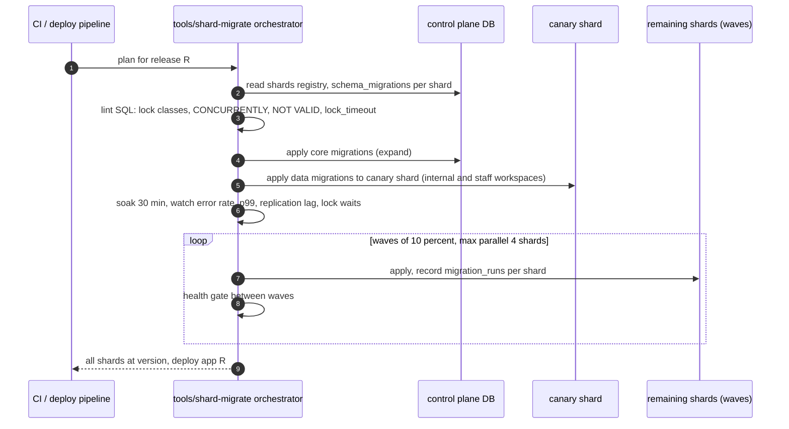

Rules:

* **Order:** control plane expand → data plane expand (canary shard → waves) → deploy app → backfills (long-running, throttled) → (next release, after soak) contract.
* **Per-shard advisory lock** (`pg_advisory_lock(hashtext('tabula_migrate'))`) prevents two orchestrators on one shard.
* **Idempotent, resumable:** the ledger makes re-runs skip applied migrations; a failed shard stops its wave, others continue only if the failure is shard-specific (e.g., lock timeout) — the orchestrator retries up to 5 times with backoff; schema errors halt everything.
* **New shards** are created from the latest baseline + migrations by the same tool before they enter the `shards` registry as `active`.
* **Dedicated (enterprise) shards** are in later waves and may have customer maintenance windows recorded in `shards`.
* **Dry run:** CI applies every migration against a schema-only clone with production-like stats and records lock acquisitions (`pg_locks` sampling) to catch accidental heavy locks.

### 51.4 Expand/contract zero-downtime rules

Every schema change is split so that **app version N and N−1 both work** at every moment.

| Change | Expand (release N) | Migrate | Contract (release N+1 or later) |
|---|---|---|---|
| Add column | `ADD COLUMN x type NULL` (no default, or constant default — PG11+ stores constant defaults without rewrite) | Backfill if needed (§51.5); app writes both | `SET NOT NULL` via `ADD CONSTRAINT … CHECK (x IS NOT NULL) NOT VALID` → `VALIDATE CONSTRAINT` → `SET NOT NULL` (PG12+ uses the validated check, no scan) → drop the check |
| Rename column | Add new column; app writes both, reads new with fallback | Backfill | App reads/writes new only → drop old |
| Change column type | New column + trigger or dual-write | Backfill | Switch reads, drop old |
| Add index | `CREATE INDEX CONCURRENTLY` (non-transactional migration); on partitioned tables: create on each partition concurrently, then `CREATE INDEX ON ONLY parent` + `ALTER INDEX … ATTACH PARTITION` | — | Drop old index `CONCURRENTLY` |
| Add FK | `ADD CONSTRAINT … NOT VALID` | `VALIDATE CONSTRAINT` (SHARE UPDATE EXCLUSIVE, doesn't block writes) | — |
| Add CHECK | `NOT VALID` then `VALIDATE` | | |
| Unique constraint | `CREATE UNIQUE INDEX CONCURRENTLY` → `ADD CONSTRAINT … USING INDEX` | | |
| Drop column | App stops reading (N), stops writing (N+1) | — | `DROP COLUMN` (metadata only) |
| Drop table | App stops using; rename to `_deprecated_…` | Wait one release | Drop |
| New table | Create (instant) | — | — |
| Enum-like values | We use `text` + CHECK (not PG enums) so adding values = replace CHECK via NOT VALID/VALIDATE | | |

Mandatory guards for every non-trivial DDL statement:

```sql
SET lock_timeout = '3s';          -- never queue behind a long txn and block everyone after us
SET statement_timeout = '0';      -- for CONCURRENTLY builds (session-scoped migration connection)
-- retried by the runner up to N times with backoff on 55P03
```

Forbidden without explicit sign-off (`-- tabula:allow-lock` + ADR): table rewrites (`ALTER TYPE` with rewrite, `ADD COLUMN … DEFAULT volatile()`, `VACUUM FULL`, `CLUSTER`), non-concurrent index builds on tables > 10k rows, `ALTER TABLE … SET LOGGED`, dropping columns referenced by publications (`outbox_events`, `base_changes` — publication changes are coordinated with the relay version).

Event and API compatibility follow the same expand/contract idea: new event fields are additive; breaking changes bump `schemaVersion` with consumers supporting both versions for one release ([15](15-events.md)).

### 51.5 Large backfills

* Implemented as `long_operations` kind `migration.backfill` per shard, driven by the `maintenance` queue (not inside the migration runner, which must finish in seconds).
* **Batched keyset** updates (`WHERE id > $after ORDER BY id LIMIT 1000`), each batch its own txn with checkpoint (§50.9); idempotent (`WHERE new_col IS NULL` or version predicate).
* **Throttled** by a controller evaluated before each batch:
  * physical replica lag (`pg_stat_replication.replay_lag`) < 2 s;
  * logical slot lag (`pg_current_wal_lsn() - confirmed_flush_lsn`) < 1 GB — a backfill must not starve the relay (it would delay realtime and automations for every tenant on the shard);
  * shard CPU < 70%, p99 write latency of interactive class < SLO;
  * otherwise sleep/back off; batch size adapts (100–5,000).
* **Avoid relay amplification:** backfills write neither `base_changes` nor `outbox_events` unless the change is user-visible; when it is (rare), one batch event per chunk.
* **Visibility:** progress per shard in `core.migration_runs` + Grafana; resumable after deploys (lease + checkpoint).
* **Partitioned tables:** iterate partition by partition to keep buffers hot and to allow `VACUUM` between partitions.

### 51.6 JSONB config document migrations

Configs stored as JSONB (`fields.config`, `views.config`, `interface_pages.layout`, `interface_versions`, `automation_versions.definition`, `tables.restrictions`, `bases.settings`) each carry a `schemaVersion` integer.

1. **Upgrade on read:** every config type has an ordered chain of pure upgrader functions in its package (`@tabula/fields` for field configs, `@tabula/query` for view configs, `@tabula/automation-schema` for automations): `v1 → v2 → … → current`. Readers always pass configs through `upgrade()` (cheap, memoized by `(id, updated_at)`), so the app never sees an old shape. Upgraders are covered by fixture tests (every historical version has golden examples).
2. **Write current:** any write persists the current version.
3. **Background rewrite:** a `maintenance` long op per shard rewrites remaining old-version documents (keyset, throttled) so old upgraders can eventually be deleted (after two releases with zero old documents, verified by a query `WHERE (config->>'schemaVersion')::int < $current`).
4. **Immutable documents** (`automation_versions`, `interface_versions`) are **never rewritten** — they are upgraded on read forever (or until the version is purged), preserving what was published.
5. **Downgrade safety:** N−1 app versions must tolerate a newer `schemaVersion` they don't know → they treat the document read-only and reject edits with `409 CLIENT_OUTDATED` (prevents an old pod from writing an old shape over a new one during rollout). Upgraders therefore ship one release **before** writers start emitting the new version (expand/contract for documents).
6. **Snapshot cache keys** include `schema_version` so upgraded snapshots never mix with old ones.

### 51.7 User-level field type changes

User-triggered type changes are data migrations performed by the product at runtime; they follow §49.5 (shadow slot, dual-write, version-checked batches, atomic cutover, rollback = discard shadow slot, undo = reverse conversion within retention). Operational guardrails:

* Concurrency: at most 1 active conversion per table and 3 per shard (queued beyond).
* Converters are pure functions in `@tabula/fields` with a declared loss profile (`lossless`, `lossy`, `metadata-only`) that drives the preview and the fast paths; every (from, to) pair has property tests (round-trip where lossless).
* Engine changes to a converter are versioned (`converterVersion` stored in the long op params) so a resumed conversion after a deploy keeps using the same converter semantics.
* Platform-level migrations that must change **stored cell representation** for all customers (e.g., a new canonical currency encoding) reuse the same machinery as a system-initiated conversion per field, rather than a raw SQL backfill — so dual-write, cutover and undo semantics are identical.

### 51.8 Partition maintenance

Partitioned tables (spine §5): `records` (hash by `table_id`), `record_links` (hash by `relation_id`), `record_revisions` (monthly), `base_changes` (daily), `outbox_events` (daily, Proposed addition: 72 h retention), `automation_runs`/`automation_step_runs` (monthly), `webhook_deliveries` (monthly), `ai_invocations` (monthly), `usage_events` (monthly), `notifications` (monthly), `audit_events` (monthly).

**Decision (reconciled with [04](04-database-architecture.md) §6.4 and [05](05-sql-schema.md)): `pg_partman` 5.x creates and drops time partitions, and the `scheduler` role's `partition-maintenance` task drives it.** The task calls `partman.run_maintenance_proc()` on every shard, checks that future partitions exist, and alerts on drift. It also enforces per-plan retention (revision history 14 days → 3 years, spine §12), which pg_partman cannot do, through batched row deletion inside long-retention partitions. pg_partman is available on RDS, Aurora and our local Docker image. If we ever had to run without the extension, a fully in-house partition manager was evaluated and kept as the fallback.

| Task | Rule |
|---|---|
| Pre-create | Range partitions created ≥ 3 periods ahead (daily: 7 days ahead) per shard; alert if fewer than 2 future partitions exist |
| Default partition | **None** for range-partitioned tables (a missing partition fails loudly in staging tests rather than silently filling a default) |
| Retention drop | `ALTER TABLE … DETACH PARTITION … CONCURRENTLY` then `DROP TABLE` once older than the max retention of any tenant on the shard (e.g., `base_changes` 30 days; `outbox_events` 3 days) |
| Per-plan retention inside partitions | `record_revisions` kept for the longest retention; shorter-retention tenants purged by batched deletes (`purge` queue); archived to S3 Parquet for Enterprise before drop where policy requires |
| Hash partitions | Count fixed at shard creation (e.g., 64 for `records`, 32 for `record_links`); never altered in place — rebalancing happens by moving workspaces to a new shard with a different count (`tools/workspace-move`) |
| Index on new partitions | Created automatically from partitioned parent indexes |
| Stats | `ANALYZE` new partitions after first day; autovacuum tuned per partition (lower scale factor for hot `records` partitions) |

### 51.9 Rollback strategy

1. **Prefer roll-forward.** Most incidents are fixed faster by a new release than by reversing schema.
2. **App rollback is always safe** because of expand/contract: release N's schema works with N−1. Argo Rollouts aborts automatically on SLO regression.
3. **Expand migrations** have `down()` scripts (drop the new column/index/table); used only if the expand itself causes harm (e.g., an index hurting write latency).
4. **Contract migrations have no down.** They run only after a soak period (≥ 7 days with N deployed) and after a fresh snapshot (RDS snapshot + PITR window verified). Recovery from a bad contract = PITR to a side instance and data repair, not an automatic down migration.
5. **Backfills** are reversible only if they wrote to new columns (they should); never overwrite source data in place.
6. **JSONB config upgrades** are reversible by design while old upgraders/readers exist (§51.6 step 5).
7. **User-level conversions:** cancel before cutover, undo after (§49.5).
8. **Fleet halt switch:** `tools/shard-migrate halt` stops further waves; shards already migrated stay compatible because the migration was expand-only.

### 51.10 Migration checklist

**Authoring**

- [ ] Plane and phase declared (`expand` / `backfill` / `contract`); `lockClass` justified.
- [ ] No table rewrite; constants-only defaults; `NOT VALID` + `VALIDATE` for constraints; `CONCURRENTLY` for indexes (non-transactional migration).
- [ ] `lock_timeout` set; statement retry safe (idempotent DDL: `IF NOT EXISTS` where valid, or ledger-guarded).
- [ ] Partitioned tables: index created per partition + attached; future partitions inherit.
- [ ] RLS policies added for new tenant tables (`workspace_id` / `org_id` columns present).
- [ ] Publications unaffected, or relay compatibility planned.
- [ ] Kysely codegen updated (`pnpm codegen`), `module.yaml` owned tables updated, `05-sql-schema.md` / `32-table-and-object-inventory.md` updated.
- [ ] `down()` for expand migrations; contract migration references the release that removed usage.

**Compatibility**

- [ ] App N works with schema before and after the migration; app N−1 works after.
- [ ] Event schema changes additive or versioned; JSONB configs have upgraders shipped one release ahead of writers.
- [ ] Backfill implemented as a throttled, resumable long op with idempotent batches.

**Rollout**

- [ ] CI dry run on schema-only prod clone: lock report clean, duration estimate per shard.
- [ ] Canary shard applied and soaked (error rate, p99 interactive write, replication lag, relay slot lag, lock waits).
- [ ] Waves ≤ 10% with health gates; dedicated shards' maintenance windows respected.
- [ ] Dashboards: `migration_runs` progress, backfill throughput, slot lag.
- [ ] Contract only after soak ≥ 7 days, snapshot taken, every role on ≥ required version.

**After**

- [ ] Ledger consistent on all shards (`shard-migrate verify`).
- [ ] Old upgraders/columns scheduled for removal; runbook updated.

---

## Proposed additions

| # | Proposed addition | Plane | Why |
|---|---|---|---|
| PA-27-1 | `schema_migrations` ledger table in each database (`core`, `data` on every shard, `audit`) | all | §51.2 (same as PA-26-2) |
| PA-27-2 | `core.migration_runs` | control | Orchestrator state per (migration, shard) |
| PA-27-3 | `core.outbox_events` + control-plane publication | control | Control-plane domain/audit events (same as PA-26-1) |
| PA-27-4 | Columns on `base_changes`: `client_mutation_id uuid`, `undoes_change_id uuid`, `via text` (if not already in 05) | data | Client reconciliation in catch-up; undo/redo linkage (§49.11) |
| PA-27-5 | Columns on `records`: `deletion_batch_id uuid` (if not in 05) | data | Restore from trash (§49.3) |
| PA-27-6 | Column `computed_stale.marked_seq bigint` | data | Safe deletion of stale markers after drain (§50.5) |
| PA-27-7 | `long_operations` columns `lease_owner`, `lease_until`, `checkpoint jsonb`, `progress jsonb`, `params jsonb` (if not in 05) | data | §50.9 |
| PA-27-8 | `fields.config.pendingConversion` / `previousSlot` / `computeState` keys (JSONB, field config schema) | data | §49.5, §49.4 |
| PA-27-9 | `attachments.status` values `pending_upload, uploaded, clean, ready, rejected` | data | §49.8 |
| PA-27-10 | `outbox_events` partitioned daily with 72 h retention (spine lists the table without retention) | data | §50.3 |
| PA-27-11 | Relay recovery watermark (`last_relayed_at`, per-shard) — stored in Redis + a small `kernel` state row; propose `core.relay_checkpoints(shard_id, slot_name, confirmed_lsn, last_relayed_at)` | control | Failover recovery (§50.3 step 7) |
| PA-27-12 | Event types `long_operation.started`/`long_operation.failed` (catalogue has only `progressed`/`completed`) | events | Clearer long-op lifecycle; until accepted, `long_operation.progressed` with `status` field is used |
| PA-27-13 | Op kinds in `base_changes`: `attachment.ready`, `field.conversion_started`, `field.type_change`, `records.bulk_create` | data | Realtime/undo semantics for these flows |
