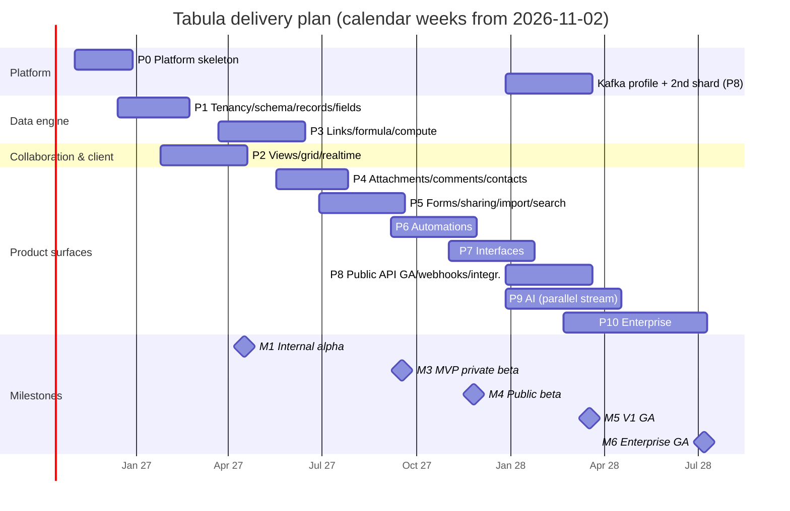

# 29 — Implementation Roadmap & Scope

> **Status:** Proposed · **Owner:** Engineering Management + Platform Architecture · **Date:** 2026-10-03
> Conforms to [`00-canonical-decisions.md`](./00-canonical-decisions.md). Build-step granularity (80 ordered steps) lives in [`34-self-review-risk-register-build-order.md`](./34-self-review-risk-register-build-order.md) §"Recommended build order"; this file is the phase-level plan and the scope contract.

**Sections covered**

* **Part 51 / Section 54 — Implementation roadmap:** planning assumptions, team topology, the "skeleton-first" rule (why realtime/change log, events/outbox, permissions core, field-type registry, shard routing and IDs exist in Phase 0–1), phases 0–10 with features / database / backend / frontend / infrastructure / testing / dependencies / definition of done / team & duration, release milestones, Gantt chart, critical path, staffing curve, and plan-level risks.
* **Part 52 / Section 55 — Scope:** MVP, V1 and Enterprise in/out lists, explicit non-goals, and the **architectural hooks that must exist in MVP even when the feature is off**.

---

# Part 51 — Section 54: Implementation Roadmap

## 54.1 Planning assumptions

| Assumption | Value |
|---|---|
| Engineering headcount | 12 engineers at start of Phase 1 (ramping from 8 in Phase 0 to 14 by Phase 6), + 1 EM, 1 PM, 1 product designer (+1 from Phase 4), 1 QA/SDET lead (from Phase 1), 0.5 security engineer (shared, full-time from Phase 8) |
| Calendar start | 2026-11-02 (Phase 0) |
| Velocity reality factor | Estimates are *engineering weeks of a squad* with 20% buffer already included; holidays not modeled |
| Release train | Trunk-based, continuous deploy to staging; production deploys daily behind feature flags (`core.feature_flags`) from Phase 2 onward (internal dogfood org) |
| Dogfooding | From end of Phase 2 the team runs its own planning in Tabula (bug tracker base) — strongest realtime/grid test we have |
| Environments | Local + CI from week 1; staging from week 4; production (single region `us-east-1`, single data shard) from end of Phase 1 (internal only) |

## 54.2 Team topology (squads)

| Squad | Size (P1 → P6) | Owns (modules / docs) |
|---|---|---|
| **Platform** | 3 → 3 | repo, CI, IDs, `db` + planes + shard router, outbox/relay, event bus, jobs/reconciler, observability, infra (Terraform/EKS/ECS), security baseline (25, 26, 27, 15, 23) |
| **Data Engine** | 3 → 4 | record storage, field engine, formula, compute, links, filter compiler, sidecars, import/export engine (06, 07, 08, 09, 11) |
| **Collaboration & Client** | 4 → 4 | SPA shell, design system, canvas grid, RecordStore, realtime gateway & protocol, undo/history UI, views (10, 16, 22, 24) |
| **Product Surfaces** | 2 → 3 | auth/tenancy UI, forms, sharing, comments/notifications, contacts, automations, interfaces, AI surfaces (12, 13, 14, 18, 20, 21) |

Squads are stable; phases move the *center of gravity*, not people. A phase "owner" squad is named per phase; others contribute.

## 54.3 The skeleton-first rule (why some "late" capabilities start in Phase 0–1)

A naive feature roadmap would add realtime in "Phase 8", events in "Phase 10", and permissions "when enterprise asks". For Tabula that ordering is a trap: these are **cross-cutting write-path concerns**. Every mutation path written before they exist must later be found, rewritten, and re-tested — and the bugs from missing one path are silent (a missed event = an automation that doesn't fire; a missed permission check = a data leak). We therefore build each as a **skeleton** early: the interface, the table, and the write-path hook, with the minimal implementation.

| Capability | Skeleton in Phase 0/1 | Why retrofitting is costly |
|---|---|---|
| **Change log (`base_changes`) + per-base `change_seq`** | Every mutation goes through one `MutationContext` that allocates `change_seq`, writes forward + inverse ops, and appends `base_changes` in the same transaction | Realtime, undo/redo, webhooks cursors, sync, and revision history all derive from it (D9, D10, D25). Retrofitting means re-auditing every write path, and historical data has no ops — undo and catch-up would be inconsistent for months. The `change_seq` row also shapes lock ordering; adding it later changes deadlock behavior of every transaction. |
| **Transactional outbox + relay (MVP profile)** | `outbox_events` written via the same `MutationContext`; relay reads logical replication and dispatches to BullMQ (same `EventBus` interface as the Kafka profile) | Without it, early features call side effects (email, search index, notifications) inline → dual-write bugs that only appear under failure. Moving from inline calls to events later changes semantics (ordering, retries, idempotency) of every consumer. Logical replication also needs `wal_level=logical` and replication slots provisioned from day one on RDS (parameter group change requires restart). |
| **Permissions core (PermissionSnapshot, `perm_epoch`, `restrictions` columns)** | Snapshot compiler with org/workspace/base roles; every service method takes a `Principal` and calls `authorize(action, resource)`; `fields.restrictions`, `tables.restrictions` exist (empty) | Permission checks retrofitted into existing code are reliably incomplete; masking must apply to API, realtime, search, export, AI — channels built in Phases 2–9. Having `authorize()` and the canary tests (28 §52.6.11) from the start means each new channel is born compliant. |
| **Field-type plugin registry** | `FieldTypeDefinition` interface with all hooks (validate, normalize, parse, format, sort key, sidecar, search text, CSV, conversion table) even if only 8 types exist | Each later subsystem (filter compiler, import, export, search, formula types, AI) dispatches on the registry. Without it, `switch(type)` statements metastasize across 15 modules and the conversion matrix becomes unmanageable. |
| **Shard routing (1 shard) + control/data plane split** | `ShardRouter.forWorkspace(id)` used by every data-plane access, even with one shard; separate `core` and `data` connection pools; no cross-plane joins | Introducing sharding after launch requires finding every query that joins control-plane and data-plane tables and every place that assumes one pool; it's the classic multi-quarter migration. With one shard from day one the cost is a lookup and discipline. |
| **UUIDv7 + public prefixed IDs** | `@tabula/types` (ID codec) at boundary from first endpoint | Changing public ID formats after the API is used breaks integrations; changing PKs requires table rewrites. |
| **Actor/via attribution & event envelope** | `actor{type,id,via}`, `correlationId`, `causationId`, `causationDepth` on `MutationContext` | Automations' loop guard, audit, revision history and "modified by" all need it; reconstructing provenance later is impossible. |
| **Versioned config documents** | `views.config`, `fields.config`, interface layout, automation definitions carry `configVersion` + upgraders | Without versioning, every config shape change becomes a risky data migration. |
| **RLS policies** | Every tenant table has RLS from creation; app role `NOBYPASSRLS` | Enabling RLS later reveals hundreds of queries missing context — at a time when a mistake means an outage. |

## 54.4 Phase plan

> Durations are calendar weeks with the squads listed. Phases overlap: the next phase's design/spikes start in the last 2–3 weeks of the previous one.

### Phase 0 — Platform skeleton (weeks 1–8; 2026-11-02 → 2026-12-25)

**Owner:** Platform (3) + 2 from Data Engine + 2 from Client + EM. **8 engineers, 8 weeks.**

| Track | Work |
|---|---|
| Features (internal) | Sign-up/login (email+password, email verification), create org/workspace (default on signup), "hello base" create/list/rename, health pages |
| Database | Migration framework (`packages/db/migrations/{core,data,audit}`), roles (`tabula_migrator`, `tabula_app`, `tabula_relay`), RLS helper functions, `core.organizations`, `organization_members`, `users`, `user_identities`, `sessions`, `workspaces`, `workspace_directory`, `base_directory`, `shards`, `access_grants`, `feature_flags`; `data.bases`, `base_runtime`, `base_changes` (daily partitions + maintenance), `outbox_events`, `idempotency_keys`; `audit.audit_events` (monthly partitions) |
| Backend | Monorepo (pnpm + Turborepo), `@tabula/types` (branded IDs, UUIDv7, prefixed base62 codec), `@tabula/db` (Kysely, plane-aware pools, `ShardRouter`, `withTenant()`), `MutationContext` (change_seq allocation, base_changes, outbox, actor/via, correlation), `@tabula/events` (envelope, catalogue types, `EventBus` interface, BullMQ MVP profile), `relay` role (logical replication via `pgoutput`, slot lease, checkpointing), `@tabula/permissions` skeleton (`Principal`, `authorize()`, snapshot compile for org/workspace/base roles, `perm_epoch`), Fastify app scaffold with problem+json errors, `Idempotency-Key` middleware, OpenAPI generation from TypeBox, process role entrypoints (`api`, `realtime` stub, `worker`, `scheduler` with leader election, `relay`), session auth (opaque token, Argon2id) |
| Frontend | Vite + React 19 SPA shell, TanStack Router/Query, auth pages, design-system foundations (tokens, Radix primitives wrapper), API client generated from OpenAPI |
| Infra | Terraform modules (VPC, RDS ×2 with `wal_level=logical`, ElastiCache ×2 (cache, BullMQ AOF), S3 buckets per spine §11, ECR), ECS Fargate (MVP choice per D23) or EKS dev cluster, GitHub Actions CI pipeline (28 §52.8), OpenTelemetry collector → Grafana stack, Sentry, structured logging, secrets in AWS Secrets Manager, KMS keys |
| Testing | `@tabula/testing` (PG harness with template DBs + 2 shards + RLS roles, builders v0, FakeClock), RLS-coverage test, outbox-atomicity helper, query budgets |
| Dependencies | None |
| **Definition of done** | (1) A base created via API produces `base_changes` + `outbox_events` in one txn, relay publishes to BullMQ, a test consumer receives it; (2) RLS coverage test green; (3) cross-tenant 404 test green; (4) deploy to staging via pipeline; (5) traces span api → db → relay → worker; (6) ADRs 001–031 accepted |

### Phase 1 — Tenancy, schema, records, field engine core (weeks 7–16)

**Owner:** Data Engine (3) + Product Surfaces (2) + Platform (3) + Client (4). **12 engineers, 10 weeks.**

| Track | Work |
|---|---|
| Features | Invite to workspace/base (email), roles (workspace & base), tables CRUD, fields CRUD for core types (`text`, `long_text` plain, `number`, `currency`, `percent`, `checkbox`, `date`, `datetime`, `single_select`, `multi_select`, `email`, `url`, `phone`, `rating`, `collaborator`, `autonumber`, `created_time`, `modified_time`, `created_by`, `modified_by`), records CRUD (single + batch ≤ 1000), primary field rules, record expand view (basic), undo/redo of cell edits (server inverse ops), trash for records/fields/tables (`deletion_batches`), plan limits enforcement skeleton |
| Database | `data.tables`, `fields` (slot, config, restrictions), `records` (hash-partitioned by `table_id`, `cells`, `computed`, `cell_meta`, `version`), `deletion_batches`, `long_operations`, `record_revisions` (monthly partitions); `core.invitations`, `teams`, `team_members`, `plans`, `subscriptions` (stub), `usage_counters`, `user_preferences` |
| Backend | `@tabula/fields` registry + conformance suite + 20 core types; schema service (table/field CRUD, slot allocation, rename, reorder via fractional keys); record service (validate/normalize via registry, `cell_meta`, `version`, revisions writer); undo service (inverse ops from `base_changes`, per-session stacks); trash service; schema snapshot cache (`schema:{baseId}:{schemaVersion}`); permission snapshot gains table/field restrictions (no UI yet); invitations + email (`email` queue, SES); public-shape REST endpoints for bases/tables/fields/records (first-party consumption, not yet GA) |
| Frontend | Workspace/base home, table tabs, **simple DOM grid v0** (≤ 1k rows, for dogfood only — replaced in Phase 2), field config dialogs per type, record expand modal, invite/share dialogs |
| Infra | Production account (internal-only org allowlist), RDS backups/PITR, staging data refresh, Redis namespaces |
| Testing | Field conformance for 20 types, conversion matrix scaffold (pairs declared), undo model tests, permission matrix v0 (roles × base actions) with reference model, Playwright smoke (sign up → create base → edit cells) |
| Dependencies | Phase 0 |
| **Definition of done** | Internal team can create a base with 5 tables × 20 fields × 10k records via API in < 60 s; undo/redo works across reload; trash restore works; permission matrix v0 100% agreement; no endpoint without `@authz`/`@tenant` tests |

### Phase 2 — Views, filter/sort/group, canvas grid, realtime basic (weeks 13–24)

**Owner:** Collaboration & Client (4) + Data Engine (2) + Platform (1). **~12 engineers active, 12 weeks.**

| Track | Work |
|---|---|
| Features | Grid view (canvas): virtualized rows/columns, frozen columns, column resize/reorder, keyboard navigation, copy/paste (TSV), fill handle, row height; views CRUD (collaborative/personal/locked), view sections; filter builder (AND/OR groups), multi-sort, grouping (≤ 3 levels) with aggregates; hide/reorder fields per view; record counts; **realtime co-editing** (cell ops, presence avatars, live record create/delete, live schema changes), offline indicator, reconnect & catch-up |
| Database | `data.views`, `view_sections`, `view_user_state`, `record_index_num`, `record_index_text`, `record_index_time` (+ maintenance of sidecars on write), ICU collation migration (`und-u-ks-level2`), indexes for keyset pagination |
| Backend | `@tabula/filter` (AST, validator, **SQL compiler** JSONB + sidecar paths, **in-memory evaluator**), sort/group compiler, keyset cursor codec, view query endpoint (`records:query` internal), sidecar auto-enable at `INDEX_SIDECAR_THRESHOLD` (backfill as long_operation); **realtime gateway** (`realtime` role): WS auth via session, subscribe(base), fan-out from relay stream of `base_changes`, per-subscriber permission masking, presence in Redis, `resync_required`; client op IDs dedupe |
| Frontend | Canvas grid (Glide-inspired, own implementation), RecordStore (normalized, `useSyncExternalStore`), optimistic ops + rebase, view toolbar, filter/sort/group UI, presence UI, ARIA grid mirror (a11y baseline) |
| Infra | Realtime role deployment (sticky-less, ALB WebSocket), Redis presence keyspace, Grafana dashboards for WS |
| Testing | **Filter/sort/group equivalence properties** (TC-01, TC-02) on PR; realtime simulation harness (TC-15); Playwright multi-context realtime E2E; grid perf trace on 100k rows; L1 at 100k rows |
| Dependencies | Phase 1 (records, field registry); Phase 0 relay |
| **Definition of done** | Team dogfoods its tracker in Tabula; 3-user concurrent editing with zero convergence bugs for 2 weeks; filter equivalence at 20k nightly runs green for 7 consecutive nights; grid scroll 60 fps at 100k rows |

### Phase 3 — Links, lookups, rollups, formulas, compute engine (weeks 21–32)

**Owner:** Data Engine (4) + Client (2). **~11 engineers active (others on Phase 4 start), 12 weeks.**

| Track | Work |
|---|---|
| Features | Link fields (single/multi, inverse field, self-links), linked-record picker & expanded linked records, lookup, rollup (SUM/AVG/MIN/MAX/COUNT/ARRAYJOIN/…), count, formula field with editor (autocomplete, inline errors, preview), ~120 formula functions, field type conversion (full matrix with preview), `button` field (open URL only) |
| Database | `data.link_relations`, `record_links` (hash-partitioned by `relation_id`), `field_dependencies`, `computed_stale` |
| Backend | `@tabula/formula` (lexer, Pratt parser, type checker, compiler, function library, isomorphic build), **Compute Engine** (`@tabula/compute`: field graph, cycle detection, sync recompute in txn, fan-out bounded by `COMPUTE_SYNC_FANOUT_LIMIT`, deferred `compute` queue, volatile buckets in `scheduler`), link service (set-semantics ops), conversion executor (long_operation, chunked, resumable), filter compiler extended to computed/lookup values |
| Frontend | Formula editor (CodeMirror 6 with our language mode), link picker, linked record cards, conversion preview dialog, stale-value indicators |
| Infra | `compute` worker pool autoscaling on queue depth |
| Testing | Formula golden tests per function; parser roundtrip & robustness; client/server equivalence; **incremental = full recompute** model test (TC-03); link symmetry; conversion matrix properties (TC-11); L6 compute fan-out |
| Dependencies | Phase 2 filter compiler (computed fields must be filterable), Phase 1 registry |
| **Definition of done** | All conversion pairs declared and tested; compute model test 20k runs green; a 100k-record base with 30 formulas/lookups edits with p95 write < 150 ms (sync path) |

### Phase 4 — Attachments, comments, mentions, notifications, contacts (weeks 29–38)

**Owner:** Product Surfaces (3) + Platform (1) + Client (2). **~10 engineers active, 10 weeks.**

| Track | Work |
|---|---|
| Features | Attachment field (drag-drop, multipart upload, previews, gallery), malware scanning, thumbnails/video posters; record comments (threads, reactions, edit/delete), @mentions (users, records), record subscriptions/watch, in-app notification center, email notifications with preferences & digests; **contacts**: workspace contact directory (system table), `contact` field, identifiers dedup, merge/unmerge, activity timeline |
| Database | `data.attachments`, `attachment_variants`, `comments`, `comment_reactions`, `mentions`, `record_subscriptions`, `contact_identifiers`, `contact_merge_events`, `contact_activities`; `core.notifications`, `notification_preferences`, `notification_deliveries`, `email_suppressions` |
| Backend | Upload service (presign, quarantine bucket, completion), `file-scan` (ClamAV) and `file-process` (libvips/ffmpeg) workers, CloudFront signed URLs; comments service; mention parser; notification router (consumes domain events), email templates (MJML), SES bounce/complaint handling; contacts module (system table per workspace created on workspace creation, link relation semantics reused) |
| Frontend | Attachment cell renderer & viewer, comment panel in record expand, notification center, preferences page, contact directory UI, merge UI |
| Infra | ClamAV pool, image processing pool (memory-heavy), CloudFront distribution with signed URLs/cookieless domain for user content, SES configuration |
| Testing | TC-09, TC-10; upload security suite (polyglot, SVG); mention permission tests; contacts dedupe concurrency (E151) |
| Dependencies | Phase 1 (records), Phase 3 (contact field reuses link relations), Phase 0 events |
| **Definition of done** | Upload → scanned → thumbnail p95 < 10 s for 10 MB image; notifications respect preferences and permissions (canary tests); contact merge/unmerge roundtrip tested |

### Phase 5 — Forms, sharing, import/export, search MVP, billing → **MVP (private beta)** (weeks 35–46)

**Owner:** Product Surfaces (3) + Data Engine (3) + Client (2) + Platform (2). **12 engineers, 12 weeks.**

| Track | Work |
|---|---|
| Features | Form view (builder, public submission, prefill, conditional fields, attachments), share links (read-only views, forms, password, expiry, domain restriction), CSV/XLSX import (type inference, mapping, 1M rows), CSV/XLSX export, global search (records, tables, fields, bases, contacts) on Postgres FTS, base duplication, templates gallery (internal templates), **Stripe billing** (plans, seats, upgrade/downgrade, over-limit states), gallery & kanban views, calendar view (basic) |
| Database | `data.share_links`, `import_jobs`, `import_errors`, `export_jobs`, `search_documents` (tsvector + trigram); `core.templates`, `subscriptions` (real), `usage_events` |
| Backend | Share link resolver & public principal, form submission pipeline (`actor.type=public_form`), import pipeline (streaming parse, chunked commits, `records.bulk_changed`), export pipeline, search indexer consumer (`search-index` queue), duplication long_operation, Stripe integration + webhooks, usage metering |
| Frontend | Form builder & public form app (separate lightweight bundle), share dialogs, import wizard, search palette (⌘K), billing pages, gallery/kanban/calendar views |
| Infra | Public form/share edge path (CloudFront + WAF rules), export bucket lifecycle, Stripe webhook endpoint |
| Testing | Import/export goldens & roundtrip, CSV injection, L4 import 1M rows, share-link canary tests, search permission tests, E2E full suite v1, external pentest (pre-beta), ZAP nightly |
| Dependencies | Phases 1–4 |
| **Definition of done = MVP exit** | See §55.1 MVP criteria; 20 design-partner orgs onboarded; SLOs (99.9% API availability, p95 targets) met for 4 weeks in beta |

### Phase 6 — Automations (weeks 45–56)

**Owner:** Product Surfaces (3) + Platform (2) + Data Engine (1). **~13 engineers active, 12 weeks.**

| Track | Work |
|---|---|
| Features | Automation builder (trigger → conditions → actions, branches), triggers: record created/updated/matches conditions/entered view, form submitted, scheduled, inbound webhook, button clicked; actions: create/update/find records, send email, notify, HTTP request, Slack (first connector), run script; run history & debugging, test run, versioning/publish, `button` field "run automation" |
| Database | `data.automations`, `automation_versions`, `automation_runs`, `automation_step_runs` (monthly partitions), `automation_schedules`, `inbound_webhooks`, `secrets`, `integration_connections` |
| Backend | Trigger matcher (consumes domain events; in-memory filter evaluator reuse), step runner (durable state in PG, BullMQ execution, leases, reconciler), loop guard (`MAX_CAUSATION_DEPTH`), budgets (`ratebudget:*`), egress proxy integration (`HttpEgress`), **sandbox** service (isolated-vm pool, separate image), secrets envelope encryption, connector SDK (internal) + Slack connector |
| Frontend | Automation builder canvas, step config forms with token picker, run history viewer, script editor (Monaco) with type defs |
| Infra | Sandbox node pool (isolated, no egress except proxy), egress proxy (Smokescreen-style allowlist + SSRF guard), per-queue autoscaling → **move to EKS** here if not already (D23 justification: sandbox isolation + per-queue scaling) |
| Testing | TC-06, TC-07, TC-19, TC-20, TC-28, TC-42; sandbox escape suite; SSRF suite; L3 (10k runs/min) |
| Dependencies | Phase 0 events/relay, Phase 2 in-memory evaluator, Phase 5 forms |
| **Definition of done** | L3 targets met; zero duplicate runs under chaos C1/C3; sandbox escape suite green; automation docs published |

### Phase 7 — Interfaces (weeks 53–64)

**Owner:** Client (4) + Product Surfaces (2) + Data Engine (1). **~12 engineers active, 12 weeks.**

| Track | Work |
|---|---|
| Features | Interface designer (pages, layout grid, elements: record list, record detail, grid, kanban, calendar, chart, number/KPI, text, button, filter controls, form), draft/publish, interface-only users, element-level permissions & record scoping (“current user” filters), interface sharing |
| Database | `data.interfaces`, `interface_pages`, `interface_versions`; `access_grants` resource_type `interface` activated |
| Backend | Interface compiler (element → bound queries with server-enforced scope), element data endpoints, publish snapshots, permission snapshot extended with `interface_only` role and element policies, chart aggregation queries (reuse group compiler) |
| Frontend | Designer (drag/drop layout), runtime renderer, element configurators, charts (lightweight lib, e.g., visx/ECharts) |
| Infra | None significant |
| Testing | TC-24 and bypass fuzzing on element endpoints; interface canary tests; E2E designer → publish → interface-only user |
| Dependencies | Phase 2 views/filters, Phase 6 (button → automation), Phase 1 permissions |
| **Definition of done** | Interface-only user cannot reach any data outside scope under tenant-fuzz + element fuzz for 7 nights |

### Phase 8 — Public API GA, webhooks, integrations, scale-out → **V1 GA** (weeks 61–72)

**Owner:** Platform (3) + Product Surfaces (2) + Data Engine (2). **~14 engineers active, 12 weeks.**

| Track | Work |
|---|---|
| Features | Public REST API v1 GA (docs portal, PATs with scopes, service accounts, OAuth 2.1 apps, rate limits, `records:query`, batch, typecast), outbound webhooks with cursors & payload listing, integrations (Google Sheets/Drive, Gmail/Outlook email send, Salesforce/HubSpot sync tables, Zapier/Make app), sync tables, **OpenSearch** search (V1), rich long text with Yjs |
| Database | `data.webhook_subscriptions`, `webhook_deliveries`, `sync_sources`, `sync_runs`, `record_rich_docs`; `core.api_tokens` (scopes), `service_accounts`, `oauth_clients`, `oauth_grants`, `oauth_authorization_codes`, `rate_limit_overrides` |
| Backend | API GA hardening (versioning policy, deprecation headers), OAuth server, webhook dispatcher (`webhook-out`), sync engine, **switch relay to Kafka profile** (MSK/Redpanda) with consumers migrated per topic (§7 of spine), OpenSearch indexer + reindex tooling, **second data shard** in production + online workspace move tool |
| Frontend | Developer hub (tokens, apps, webhooks UI, API docs embedded), integrations gallery, sync table UI, rich text editor |
| Infra | MSK/Redpanda cluster, OpenSearch domain, EKS production, WAF tuning for API, multi-shard capacity planning, status page |
| Testing | Contract suite + Schemathesis + oasdiff gates; L5, L8; chaos C1–C12 game-days; tenant-fuzz across 2 production-like shards; workspace-move tests (E138); DR drill #1 |
| Dependencies | Phases 0–7 |
| **Definition of done = V1 GA** | §55.2 V1 criteria; SOC 2 Type I evidence collected; public status page; on-call rotation with runbooks |

### Phase 9 — AI (weeks 61–76, parallel stream of 3 engineers from week 61)

**Owner:** Product Surfaces (2) + Data Engine (1). **3 engineers, 16 weeks (parallel with Phase 8).**

| Track | Work |
|---|---|
| Features | AI field (`ai_generated`: summarize, classify, extract, translate, custom prompt), AI formula assistant, AI automation action, natural-language filter/view builder, base/table generation from prompt, AI credits & policy controls |
| Database | `data.ai_prompt_templates`, `ai_invocations` (monthly partitions) |
| Backend | `@tabula/ai` provider abstraction (Anthropic default per D22; routing by task), AI gateway module (templates, metering, caching `ai:cache:*`, policy enforcement, prompt assembly with permission-filtered context), `ai` queue runner with per-workspace concurrency, evaluation harness (offline eval sets per template) |
| Frontend | AI field config, generation status per cell, assistant panels |
| Infra | Provider secrets, egress allowlist for providers, cost dashboards |
| Testing | TC-43, prompt-injection suite, eval regression gates (template change must not reduce eval score > 2%), FakeLlmProvider-based integration tests |
| Dependencies | Phase 3 compute (async computed field status), Phase 6 automations (AI action), Phase 1 permissions |
| **Definition of done** | AI field on 100k records completes within credit budget with per-cell status; AI policy off ⇒ zero invocations (verified by metering) |

### Phase 10 — Enterprise (weeks 69–88)

**Owner:** Platform (3) + Product Surfaces (2) + 0.5 security. **~6 engineers, 20 weeks (overlaps Phases 8–9).**

| Track | Work |
|---|---|
| Features | SAML/OIDC SSO (Jackson), SCIM 2.0 (users & groups → teams), domain verification & enforcement, enterprise admin console (users, workspaces, bases inventory, sharing controls), audit log UI + SIEM streaming, data retention policies, field hiding & Enterprise row policies, **dedicated shards**, **BYOK** (per-org KMS key, envelope encryption of sensitive columns/objects), **data residency** (EU region cell), IP allowlists, support access grants, extended trash retention (≤ 180 days), legal hold |
| Database | `core.organization_domains`, `organization_policies`, `sso_connections`, `scim_directories`, `scim_group_mappings`, `support_access_grants`; `audit.audit_exports`; `tables.restrictions.row_policies` activated |
| Backend | `SsoProvider` (Jackson adapter), SCIM server, policy engine hooks (sharing, AI, export), audit writer consumer + SIEM exporter (`tabula.audit.v1`), dedicated shard provisioning automation, BYOK key hierarchy, region-aware routing in control plane (directory → region) |
| Frontend | Admin console, SSO/SCIM setup wizards, audit log explorer |
| Infra | EU region deployment (separate data plane + regional control-plane replica for routing), per-org KMS integration, Object Lock for audit archive |
| Testing | TC-26, SCIM conformance (Okta/Entra validators), row-policy canary suite, residency tests (no EU data in US buckets/logs), BYOK revoke (E140) |
| Dependencies | Phase 8 (multi-shard + workspace move), Phase 0 audit store |
| **Definition of done** | First 3 enterprise customers live; SOC 2 Type II window started; ISO 27001 gap assessment complete |

## 54.5 Milestones

| Milestone | Target week | Date (approx.) | Exit criteria |
|---|---|---|---|
| M0 Skeleton | 8 | 2026-12-25 | Phase 0 DoD |
| M1 Internal alpha (dogfood) | 24 | 2027-04-16 | Grid + realtime + views on real team data |
| M2 Feature-complete core data | 32 | 2027-06-11 | Links/formulas/compute shipped internally |
| **M3 MVP private beta** | 46 | 2027-09-17 | §55.1 |
| M4 Public beta (self-serve) | 56 | 2027-11-26 | Automations shipped; billing live |
| **M5 V1 GA** | 72 | 2028-03-17 | §55.2 |
| M6 Enterprise GA | 88 | 2028-07-07 | §55.3 |

## 54.6 Gantt chart

## 54.7 Critical path and dependency notes

1. **P0 MutationContext → P1 record service → P2 filter compiler & realtime → P3 compute → P5 import/search → P6 automations → P8 API GA.** Any slip in `@tabula/filter` (P2) slips compute (P3, computed values must be filterable/sortable), automations (conditions use the in-memory evaluator) and interfaces.
2. **Canvas grid** is the highest-uncertainty client item; mitigated by a DOM grid v0 in P1 and a grid spike in P0 (see 34 spikes S-07/S-08).
3. **Logical replication relay** must be production-hardened before P6 (automations depend on event completeness). Its failover drill (TC-29) is a P5 exit item.
4. **Permissions** grow every phase; the reference model and canary suite grow with them (each phase's DoD includes "new channels added to canary suite").
5. **Enterprise prerequisites** (dedicated shards, workspace move) are in P8 because the shard-move tool also unblocks noisy-neighbor mitigation for V1 GA.

## 54.8 Staffing curve

| Phase window | Platform | Data Engine | Collab & Client | Product Surfaces | Total eng |
|---|---|---|---|---|---|
| P0 (w1–8) | 3 | 2 | 2 | 1 | 8 |
| P1–P2 (w7–24) | 3 | 3 | 4 | 2 | 12 |
| P3–P5 (w21–46) | 3 | 3–4 | 4 | 3 | 13 |
| P6–P8 (w45–72) | 3 | 4 | 4 | 3 | 14 |
| P9–P10 (w61–88) | 3 (+0.5 sec) | 4 | 4 | 3 | 14 (P9 = 3 of these) |

## 54.9 Plan-level risks (detail in 34)

* Grid performance/a11y spike fails → fallback: adopt Glide Data Grid (MIT) fork as base (ADR-014 revisit).
* Compute engine correctness takes longer than 12 weeks → ship links + lookups first (P3a), rollups/formula-over-links (P3b) behind flags; MVP still needs both.
* Relay/logical replication operational complexity on RDS → fallback polling relay (ADR-019 alternative) behind the same `EventBus` interface; MVP profile tolerates it.
* Hiring lag → Phase 9 (AI) is the designated slack absorber; enterprise can't slip past first enterprise contract dates.

---

# Part 52 — Section 55: Scope

Legend: ✅ in · ⛔ out · 🧩 hook only (architecture present, feature off/hidden).

## 55.1 MVP (private beta, M3)

**Product goal:** a small team can replace a shared spreadsheet + simple tracker: structured data with relations, multiple views, realtime collaboration, forms, sharing, import/export.

| Area | In MVP | Out of MVP |
|---|---|---|
| Accounts & tenancy | ✅ email/password, Google OAuth login, MFA (TOTP), orgs (implicit single org per signup), workspaces, invites, workspace/base roles | ⛔ SSO/SAML, SCIM, WebAuthn (V1), teams UI (🧩 tables exist), guest org role UX polish |
| Data model | ✅ bases, tables, 25 field types: all §4 of spine except `ai_generated`, `button` (only "open URL"), `json` (internal), rich `long_text` (plain + markdown-lite only) | ⛔ rich text collaborative (Yjs) (V1), barcode scanning UI (V1) |
| Records | ✅ CRUD, batch, paste, fill, expand, revision history (14 days on Free), undo/redo, trash (30 days) | ⛔ record templates, record-level sharing |
| Links & computed | ✅ links, lookups, rollups, count, formulas (~120 functions), conversions with preview | ⛔ cross-base links (out in all tiers; sync tables in V1) |
| Views | ✅ grid, form, gallery, kanban, calendar (basic); filter/sort/group; personal & locked views | ⛔ timeline/Gantt, list view (V1), view-level row coloring beyond select colors (V1) |
| Collaboration | ✅ realtime co-editing, presence, comments, mentions, notifications (in-app + email), record watch | ⛔ field/cell-level comments (V1), slack notifications (V1) |
| Attachments | ✅ upload, scan, previews, thumbnails | ⛔ attach from URL (V1, SSRF suite required), document preview for Office files (V1) |
| Contacts | ✅ workspace directory, contact field, dedupe, merge (unmerge V1) | ⛔ email sync, activity auto-capture (V1+) |
| Sharing & forms | ✅ share views (read-only), forms (public), password/expiry | ⛔ embeddable interfaces, branded forms (V1) |
| Import/export | ✅ CSV/XLSX import (≤ 100k rows MVP; engine supports 1M), CSV export | ⛔ JSON/API bulk export UI, sync tables (V1) |
| Search | ✅ Postgres FTS global search | ⛔ OpenSearch (V1), semantic search (V1+/AI) |
| Automations | ⛔ (Phase 6, public beta) | 🧩 events/outbox, causation fields in envelope, `actor.type=automation` |
| Interfaces | ⛔ | 🧩 `access_grants.resource_type='interface'` enum value, `interface_only` role in vocabulary |
| Public API | 🧩 first-party REST (same API, undocumented, PAT creation off) | ⛔ public docs, OAuth apps, webhooks |
| AI | ⛔ | 🧩 `actor.type=ai` enum, `@tabula/ai` interface (no implementation) |
| Billing | ✅ Free + Team plans, Stripe, limits enforcement, over-limit states | ⛔ usage-based AI credits, invoicing |
| Enterprise | ⛔ | 🧩 `organization_policies` table, `restrictions` columns, audit store writes for security events |
| Platform | ✅ single region, one data shard, BullMQ event profile, ECS Fargate (or EKS), SLO 99.9% | ⛔ multi-region, Kafka, dedicated shards |

**MVP exit criteria:** 20 design-partner orgs with ≥ 5 weekly active users each; P1 bug count = 0 for 2 weeks; L1 (at 500k rows), L2 (200 editors), L4 (100k import) targets met; pentest high/critical findings closed; DR restore drill passed once; RLS/tenant-fuzz/canary suites green 14 consecutive nights.

## 55.2 V1 (GA, M5)

| Area | Added in V1 |
|---|---|
| Automations | ✅ full builder, triggers & actions in Phase 6, scripts (sandbox), Slack/Gmail/Outlook/HTTP connectors, run history, quotas |
| Interfaces | ✅ designer, elements, interface-only users, publish/versioning |
| Public API | ✅ GA with docs portal, PATs (scoped), service accounts, OAuth 2.1 apps, webhooks, rate limits per plan |
| Integrations | ✅ sync tables (Sheets, Salesforce, HubSpot, another Tabula base), Zapier/Make apps |
| Search | ✅ OpenSearch, field-aware, permission-filtered |
| Collaboration | ✅ rich text (Yjs), cell/field comments, Slack notifications, WebAuthn |
| Views | ✅ timeline, list view, conditional coloring |
| Attachments | ✅ attach from URL, Office previews |
| Contacts | ✅ unmerge, activity timeline from email integration |
| AI (late V1, M5+) | ✅ AI fields, AI assist in formulas/filters, AI automation action, credits |
| Platform | ✅ Kafka event profile, ≥ 2 shards, workspace move tool, EKS, status page, SOC 2 Type I |
| Billing | ✅ Business plan, AI credits metering |

**V1 out:** SSO/SCIM, audit log UI, row policies, field hiding, dedicated shards, BYOK, residency (Enterprise); offline mode (beyond transient reconnect); mobile native apps (responsive web only); custom extensions/marketplace (post-V1); public GraphQL (ADR-025: not planned).

## 55.3 Enterprise (M6)

✅ SAML/OIDC SSO with enforcement, SCIM users & groups, domain verification & claim, admin console, audit logs (UI, export, SIEM streaming, retention up to 7 years), enterprise policies (sharing, export, AI, retention, IP allowlist), field hiding + row policies, extended trash (≤ 180 days), dedicated shards, BYOK, EU data residency, support access grants, SLA 99.95%, Enterprise limits (2M records/base, 10M on dedicated).

⛔ Out (Enterprise roadmap backlog): on-prem/self-hosted, customer-managed region outside AWS, HIPAA BAA (requires additional controls review), FedRAMP.

## 55.4 Explicit non-goals (all tiers, until revisited)

* No cross-base links (sync tables cover the need).
* No public GraphQL API.
* No user-defined JS inside formulas.
* No event sourcing as system of record (D26).
* No CRDT for structured cells (D9).
* No per-tenant database/schema except Enterprise dedicated shards (D4).

## 55.5 Architectural hooks that must exist in MVP (even if the feature is off)

| # | Hook | Where | Why it must exist in MVP | Feature that later uses it |
|---|---|---|---|---|
| H1 | **Shard routing with one shard** — `ShardRouter`, `core.workspace_directory`, `core.base_directory`, `core.shards` | `@tabula/db` | Every data-plane query routed; no cross-plane joins can creep in | Multi-shard (V1), dedicated shards & residency (Ent) |
| H2 | **Transactional outbox + relay (BullMQ profile)** | `outbox_events`, `relay` role | All side effects event-driven from day one | Kafka profile (V1), automations, webhooks, audit, search |
| H3 | **`base_changes` + `change_seq`** with forward & inverse ops | `MutationContext` | Realtime, undo, catch-up | Webhook cursors, sync, revision coalescing |
| H4 | **Event envelope** with `actor{type,id,via}`, `correlationId`, `causationId`, `causationDepth`, `schemaVersion` | `@tabula/events` | Provenance cannot be backfilled | Automation loop guard, audit, AI attribution |
| H5 | **Permission snapshot + `perm_epoch`** with restriction overlays evaluated (empty) | `@tabula/permissions` | Every channel born permission-aware | Field hiding, row policies, interfaces, OAuth scopes |
| H6 | **`restrictions jsonb` columns** on `tables` and `fields`; `views.visibility` incl. `locked` | `data` schema | Avoids table rewrites on hot tables later | Enterprise field hiding, row policies |
| H7 | **Field slot JSONB keys** (`next_field_slot`, never reused) | record storage | Rename/delete without rewriting records; no dynamic DDL | Every field feature |
| H8 | **Typed index sidecars** (tables + write maintenance code), auto-enable threshold | record storage | Large-table performance without schema change | Enterprise 2M–10M record bases |
| H9 | **Versioned config docs** (`configVersion` + upgraders) for `fields.config`, `views.config`, interface layouts, automation definitions | each module | Safe evolution of JSON configs | Interfaces, automations, view types |
| H10 | **UUIDv7 PKs + prefixed public IDs** (incl. prefixes for not-yet-built entities, e.g., `itf`, `aut`, `aij`) | `@tabula/types` (ID codec) | Stable public contract | Public API GA |
| H11 | **`access_grants` generic resource/principal** incl. `team`, `service_account`, `interface` | `core` | No migration when adding principal/resource types | Teams/SCIM, service accounts, interfaces |
| H12 | **Idempotency keys** on all mutating endpoints | API middleware + `idempotency_keys` | Retries safe from day one (failover, flaky networks) | Public API, automations, webhooks |
| H13 | **`HttpEgress` port + egress proxy** (even if only used by avatars/email) | platform | One SSRF chokepoint before any user-controlled URL exists | Webhooks, HTTP actions, attach-from-URL, AI tools |
| H14 | **Audit store writes** for security-relevant events (login, MFA, role changes, token creation, share link creation) | `audit.audit_events` | Enterprise customers ask for history that predates their contract | Audit UI, SIEM |
| H15 | **Plan limits from `core.plans.limits`** with central `LimitsService` | billing module | Hard-coded limits spread everywhere otherwise | Enterprise contracts, overrides |
| H16 | **Feature flags** with org/workspace targeting | `core.feature_flags` | Dark-launching every later phase | All |
| H17 | **Region field** on `core.shards` and org (`home_region`) | control plane | Residency routing later without data migration of the directory | EU residency |
| H18 | **Envelope encryption library** (DEK per workspace, KEK in KMS) used for `secrets`, MFA secrets, integration credentials | platform crypto | BYOK swaps the KEK, not the code path | BYOK |
| H19 | **`long_operations`** framework (progress, resumability, cancellation) | jobs | Conversions, imports, duplication all reuse it | Every heavy operation |
| H20 | **Per-session undo stacks keyed by change IDs** | client + undo service | Undo semantics consistent across features | Interfaces, automations ("undo automation change" admin tool) |
| H21 | **`causationDepth` enforcement point** in `MutationContext` (no-op until automations) | events | Loop guard needs every mutation to propagate depth | Automations |
| H22 | **Public principal types** (`share_link`, `public_form`) in `Principal` union | permissions | Share/form access goes through the same `authorize()` | Interfaces sharing, embeds |
| H23 | **Search abstraction `SearchBackend`** (PG FTS impl) | search module | Swap to OpenSearch without touching callers | V1 search |
| H24 | **`EventBus` abstraction with two implementations** (BullMQ, Kafka) tested in CI | events | Profile switch is configuration, not code | V1 Kafka |
