# 30 — Architecture Diagrams

> **Sections covered:** §56 Architecture Diagrams — system, database (planes/shards), domain model (class), event, automation, realtime, authentication (password + MFA, SAML SSO, OAuth PKCE), permission evaluation, interface, deployment (AWS/EKS), record lifecycle (state), request lifecycle (sequence), plus field type change flow and import flow.
>
> **Status:** Proposed · **Owner:** Platform Architecture · **Date:** 2026-10-03 · Conforms to [`00-canonical-decisions.md`](./00-canonical-decisions.md). Each diagram is a summary; the owning document is linked under it and is authoritative for detail. All diagrams are Mermaid and render on GitHub/GitLab.

---

## Index

| # | Diagram | Type | Owning document |
|---|---|---|---|
| 1 | [System architecture](#1-system-architecture) | flowchart | [`03`](./03-system-architecture.md) |
| 2 | [Database architecture](#2-database-architecture-planes-and-shards) | flowchart | [`04`](./04-database-architecture.md) |
| 3 | [Domain model](#3-domain-model) | classDiagram | [`02`](./02-domain-model-and-erd.md) |
| 4 | [Event architecture](#4-event-architecture) | flowchart | [`15`](./15-events.md) |
| 5 | [Automation architecture](#5-automation-architecture) | flowchart | [`14`](./14-automation-engine.md) |
| 6 | [Realtime architecture](#6-realtime-architecture) | flowchart | [`16`](./16-realtime.md) |
| 7 | [Authentication architecture](#7-authentication-architecture) | 3 × sequence | [`19`](./19-permissions-and-multitenancy.md), [`25`](./25-security-observability-infrastructure.md) |
| 8 | [Permission architecture](#8-permission-architecture-evaluation-flow) | flowchart | [`19`](./19-permissions-and-multitenancy.md) |
| 9 | [Interface architecture](#9-interface-architecture) | flowchart | [`13`](./13-interface-builder.md) |
| 10 | [Deployment architecture](#10-deployment-architecture-aws--eks) | flowchart | [`25`](./25-security-observability-infrastructure.md) |
| 11 | [Record lifecycle](#11-record-lifecycle) | stateDiagram | [`06`](./06-record-storage.md), [`22`](./22-audit-history-undo-trash.md) |
| 12 | [Request lifecycle](#12-request-lifecycle) | sequence | [`03`](./03-system-architecture.md), [`17`](./17-api-architecture.md) |
| 13 | [Field type change flow](#13-field-type-change-flow) | sequence | [`06` §15](./06-record-storage.md), [`07`](./07-field-engine.md) |
| 14 | [Import flow](#14-import-flow) | sequence | [`20`](./20-import-export-sharing-integrations.md) |

---

## 1. System architecture

Clients enter through CloudFront/WAF and an ALB into one EKS cluster per region where the single server image runs as process roles. `api` handles REST and write transactions; `realtime` handles WebSockets; `relay` streams committed changes from each shard into the event backbone; `worker` pools consume queues/topics; `scheduler` runs leader-only loops; `sandbox` executes user scripts with no credentials. State lives in the control-plane Postgres, data-plane shards, the audit store, Redis, Kafka, OpenSearch and S3.

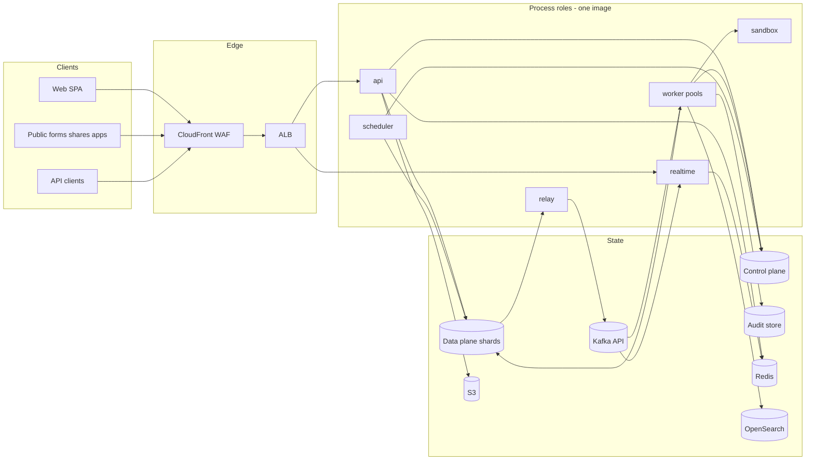

---

## 2. Database architecture (planes and shards)

The control plane answers "who, what may they access, and where does it live". Routing goes base → workspace → shard through cached directories. Each data-plane shard hosts many workspaces (workspace affinity), has replicas for reads, and a relay reading its logical replication slot. Enterprise orgs can have dedicated shards. Audit is a separate store with S3 Parquet archive.

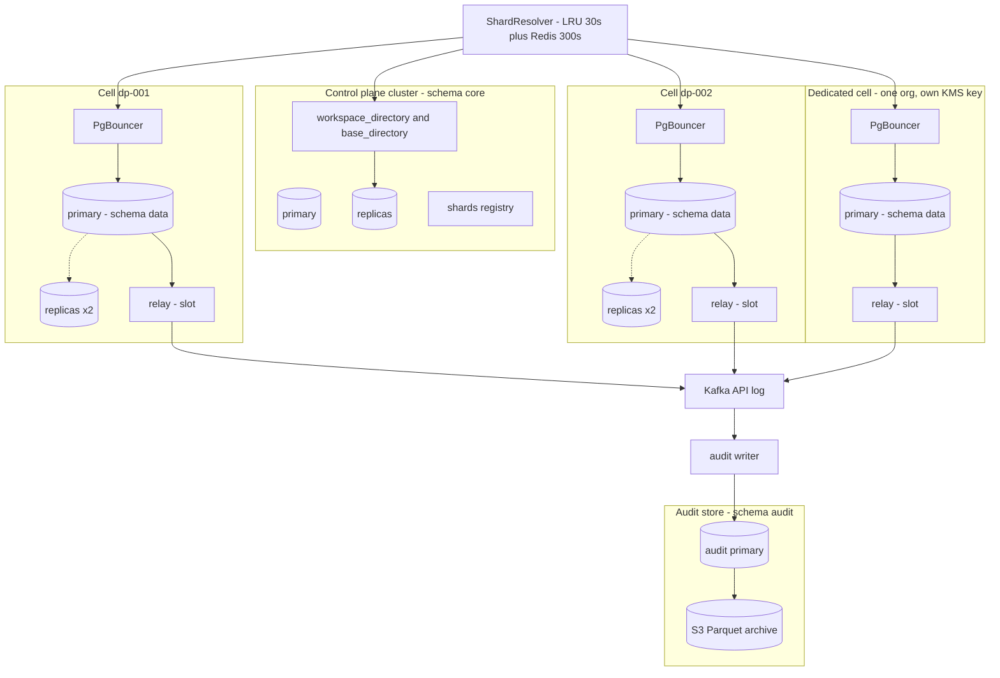

---

## 3. Domain model

Core aggregates and their relationships (logical; physical tables in [`02` §4](./02-domain-model-and-erd.md#4-entity-relationship-diagrams)). Control-plane classes on the left reference data-plane classes by id only.

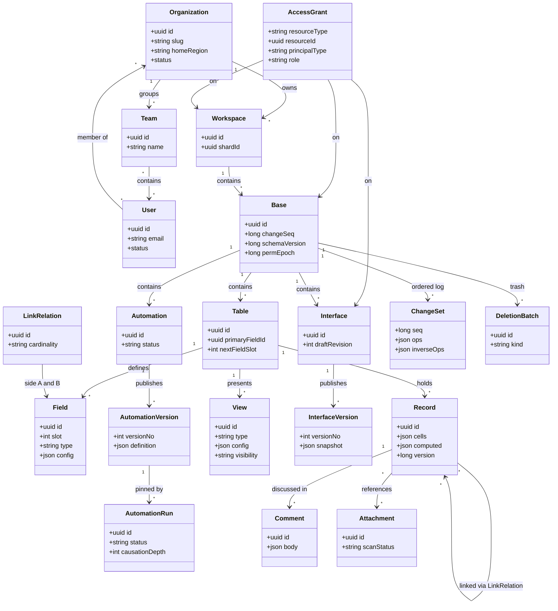

---

## 4. Event architecture

Every shard transaction writes current state plus `base_changes` (fine-grained ordered ops) and `outbox_events` (domain events). The relay reads both through logical replication and publishes to the Kafka API topics (V1) or BullMQ/Redis pub/sub (MVP profile behind the same `EventBus` interface). Consumers are idempotent; DLQs per topic.

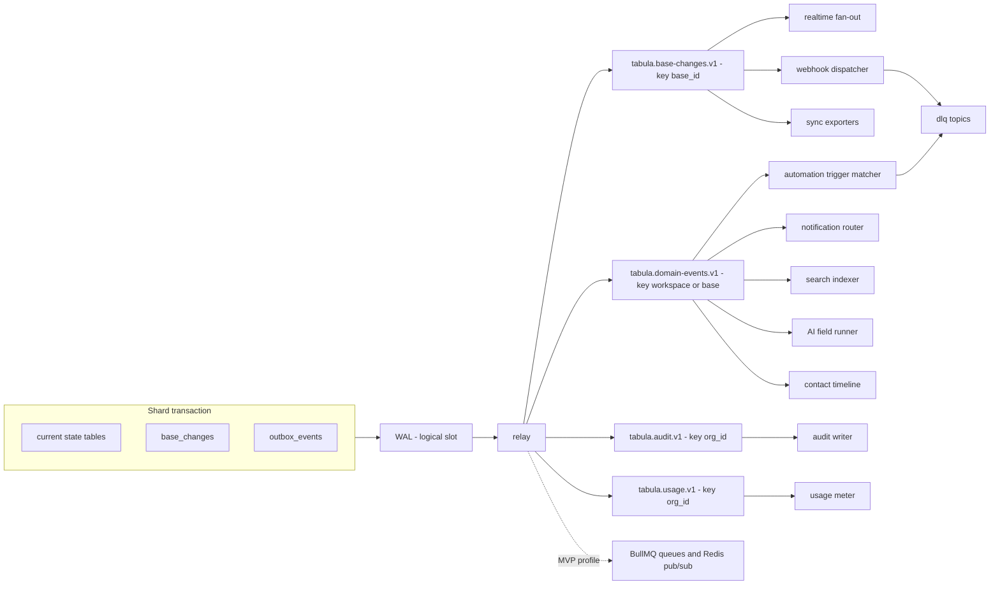

---

## 5. Automation architecture

The trigger matcher consumes domain events and schedules, matches them against an in-memory trigger index per base, applies conditions, and inserts idempotent `automation_runs` (`run_key` from the trigger event). Admission enforces tenant fairness and quotas; steps execute on `automation-step` workers with leases; scripts run in the sandbox via mTLS RPC; external calls leave through the egress proxy. Actions write through the normal record write path with `actor.type=automation` and `causationDepth + 1`, which feeds back into the event stream bounded by `MAX_CAUSATION_DEPTH` = 8.

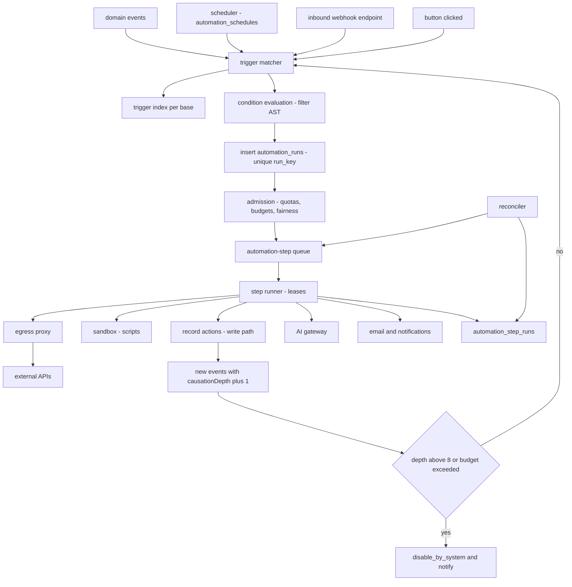

---

## 6. Realtime architecture

Clients authenticate with a single-use ws-ticket, subscribe to a base from the `asOfSeq` they loaded, and receive committed changes in seq order after per-connection redaction. Presence lives only in Redis. Gaps trigger catch-up from `base_changes`. MVP fan-out uses Redis pub/sub `rt:base:{baseId}`; V1 uses Kafka consumer groups per gateway node with base-affine subscription routing.

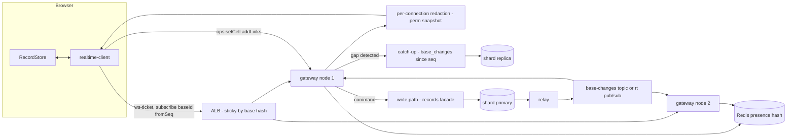

---

## 7. Authentication architecture

Opaque session tokens (HttpOnly cookie) hashed in Postgres and cached in Redis (`sess:{tokenHash}`); Argon2id passwords; TOTP/WebAuthn MFA; SAML/OIDC through BoxyHQ SAML Jackson; OAuth 2.1 with PKCE for third-party apps (D19).

### 7.1 Password + MFA login

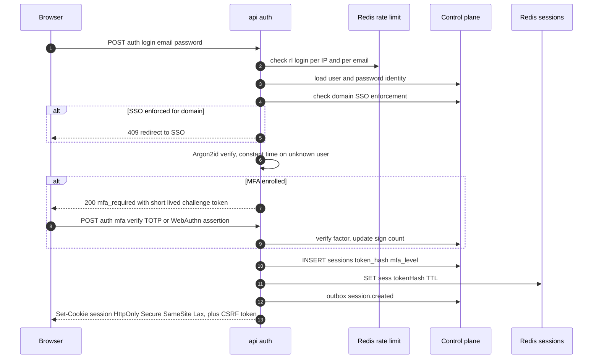

### 7.2 SAML SSO (SP-initiated)

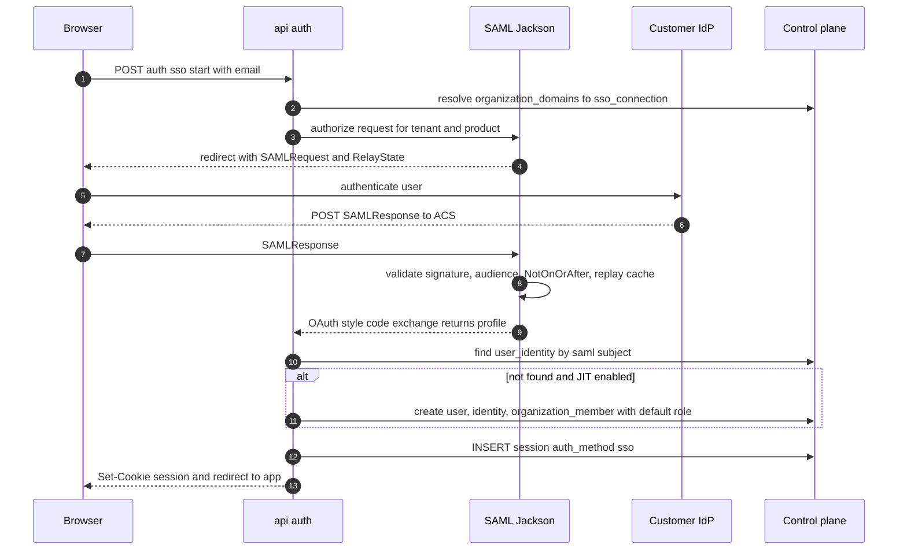

### 7.3 OAuth 2.1 authorization code with PKCE (third-party app)

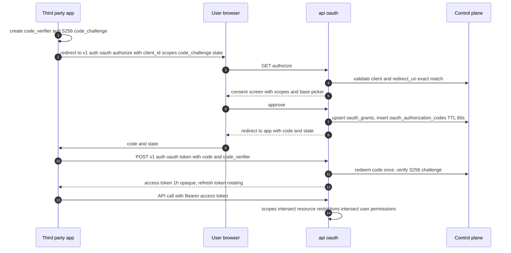

---

## 8. Permission architecture (evaluation flow)

Additive grants (org → workspace → base, max role wins) produce a base role; deny-style restriction overlays (table, field, locked views, interface element scopes, Enterprise row policies) narrow it; token scopes and share-link scopes intersect. The result is compiled into a `PermissionSnapshot` cached at `perm:{principalId}:{baseId}:{permEpoch}` and invalidated by bumping `perm_epoch`.

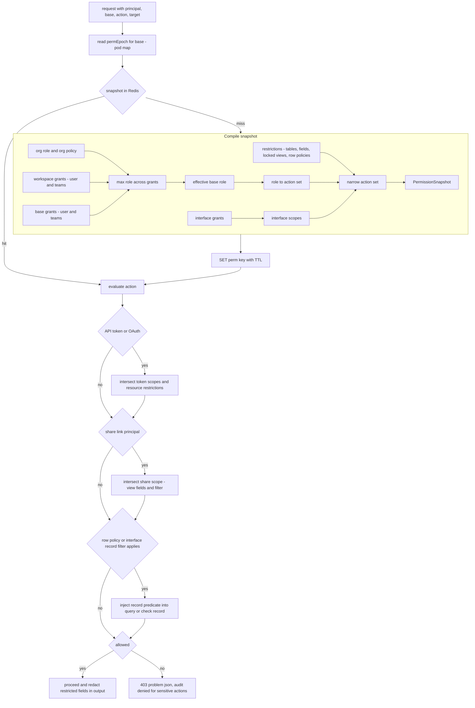

---

## 9. Interface architecture

Builders edit a **draft** (pages with element trees). Publishing copies drafts into an immutable `interface_versions` row and compiles element permissions. End users load the published version; each data element issues an element-scoped query where the server applies the element's forced filters and permissions, so users never query the base directly. Buttons emit `button.clicked` to automations.

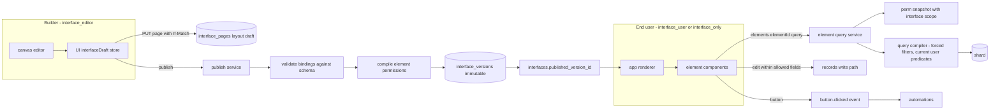

---

## 10. Deployment architecture (AWS / EKS)

One AWS account per environment per region (prod-us, prod-eu), three AZs. Public traffic terminates at CloudFront/WAF, then a regional ALB into EKS. Node groups separate general compute, realtime (connection-heavy), file processing (native deps), and sandbox (isolated, tainted, no IAM). Managed data services sit in private subnets; egress to customer endpoints goes through an allowlisting proxy with fixed NAT IPs.

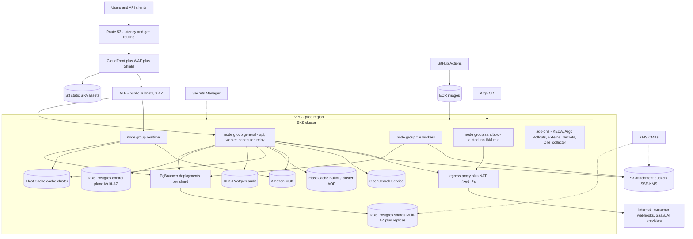

---

## 11. Record lifecycle

A record is created live, may have computed fields temporarily stale (deferred fan-out), can be trashed (its link pairs captured in the deletion batch), restored, merged (contact records), and finally purged after `TRASH_RETENTION`.

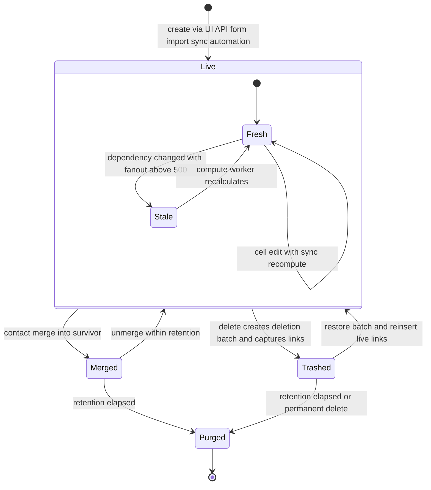

---

## 12. Request lifecycle

A public API write request end to end, including idempotency and the post-commit path. Read requests follow the same front half and use replica routing by base-seq watermark.

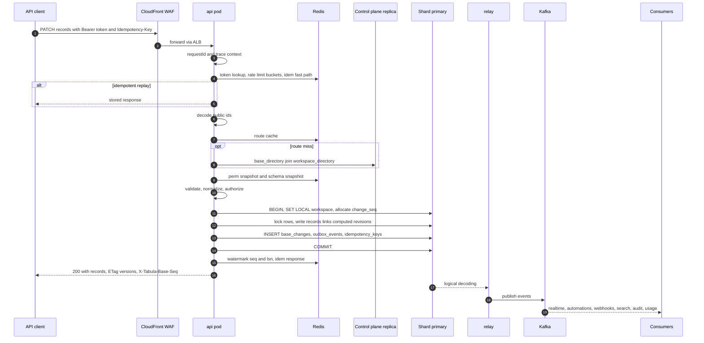

---

## 13. Field type change flow

Shadow-slot conversion ([`06` §15](./06-record-storage.md)): the field keeps its id, gets a new slot; small tables convert in the same transaction, large tables in background batches with dual-read; undo repoints the slot.

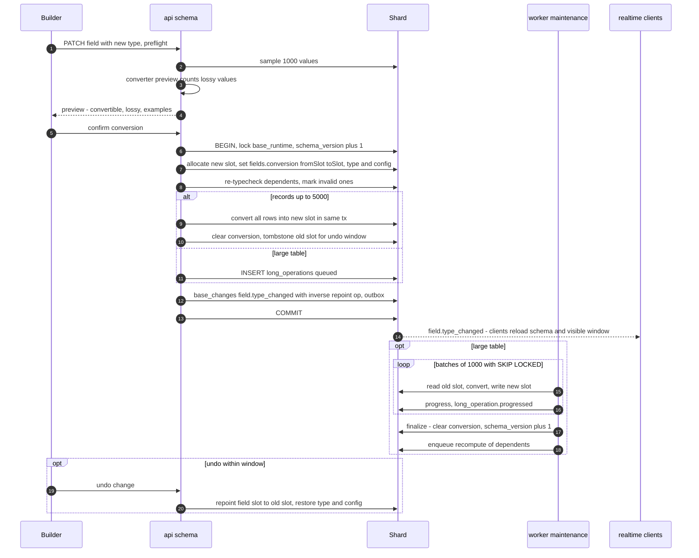

---

## 14. Import flow

CSV/XLSX import: upload to quarantine, scan, analyze, map, then process in chunks of 1,000 rows through the normal record write path under a long operation. Every chunk's `base_changes` row is tagged with the operation id so the import can be undone within retention.

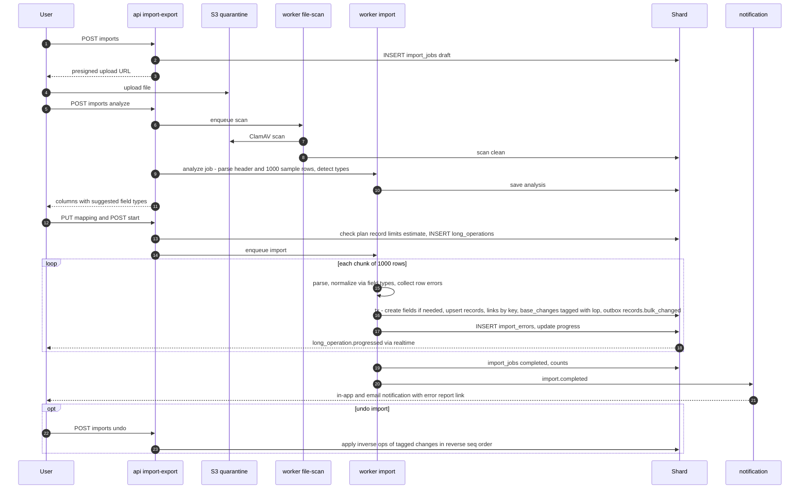

---

## Proposed additions

None.
