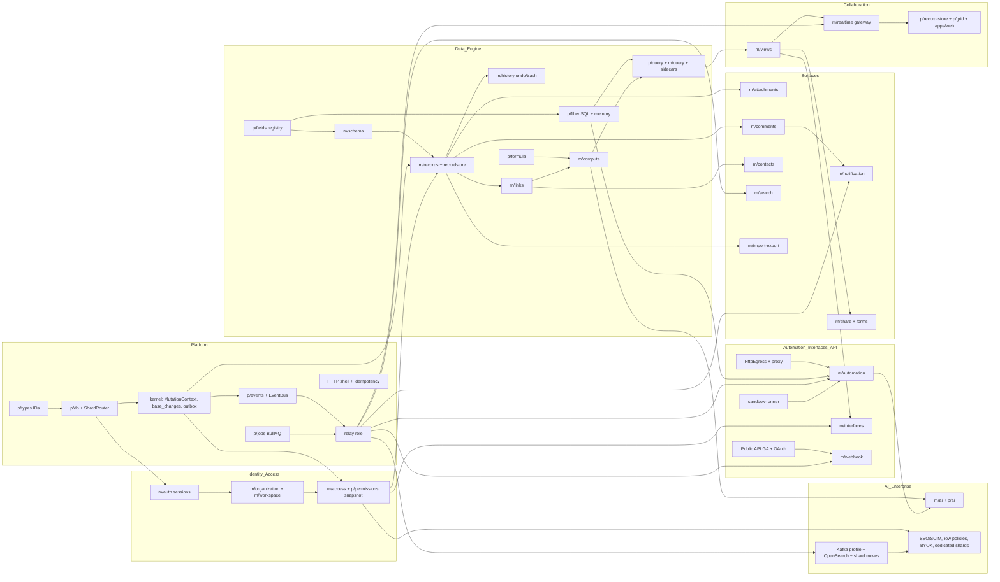

# 34 — Self-Review, Risk Register & Recommended Build Order

> **Status:** Proposed · **Owner:** Platform Architecture + Engineering Management · **Date:** 2026-10-03
> Conforms to [`00-canonical-decisions.md`](./00-canonical-decisions.md). Module and package names follow [`26-architecture-style-stack-repo-services.md`](./26-architecture-style-stack-repo-services.md) (`apps/server/src/kernel`, `apps/server/src/modules/<module>`, `packages/<pkg>` published as `@tabula/<pkg>`). Phases refer to [`29-roadmap-and-scope.md`](./29-roadmap-and-scope.md); ADRs to [`33-architecture-decision-records.md`](./33-architecture-decision-records.md); tests to [`28-testing-and-edge-cases.md`](./28-testing-and-edge-cases.md).

**Sections covered**

* **Section 61 — Architectural quality check:** "Could a team of senior engineers take this document set and start building?"; readiness assessment per area; gap analysis; 16 concrete spikes with goals, method, success criteria and timebox.
* **Section 62 — Risk analysis:** hidden dependencies; architectural, scalability, security, data-consistency, automation-loop, realtime-conflict, formula-dependency, migration and cost risks.
* **ARCHITECTURE RISK REGISTER:** 44 risks (severity, probability, impact, mitigation, owner, trigger).
* **RECOMMENDED BUILD ORDER:** 80 dependency-ordered steps naming packages, modules and tables, with the steps each depends on; subsystem dependency graph (Mermaid).
* **Proposed additions** consolidated from this document set (for reconciliation into `32-table-and-object-inventory.md`).

---

# Section 61 — Architectural quality check

## 61.1 Could a team of senior engineers take this document set and start building?

**Yes — for Phases 0–3, without further architecture work. Phases 4–10 can start on schedule, but with the spikes and open decisions in §61.3 resolved first.** That verdict rests on four things being concrete enough to code against:

1. **The write path is fully specified end to end.** Request → auth → tenant routing → `withTenant()` → permission snapshot → field validation/normalization → record write → same-record compute → link changes → `change_seq` allocation → `base_changes` (forward + inverse ops) → `outbox_events` → commit → relay → bus → consumers. Every step has a named owner (kernel or module), a table in the spine inventory, and a test strategy.
2. **Names are fixed.** IDs, prefixes, tables, events, queues, Redis keys, buckets, roles, actions and constants all come from one source (00), so parallel squads won't invent incompatible names.
3. **The risky equivalence bugs have executable oracles.** Filter SQL vs memory, incremental vs full compute, client vs server formulas, realtime convergence, permission evaluator vs reference model (28 §52.6). Teams can build fast without "we'll find out in production".
4. **The deferred decisions are deferred behind interfaces** (`EventBus`, `SearchBackend`, `SsoProvider`, `SandboxRunner`, `HttpEgress`, `ShardRouter`, AI provider), so MVP shortcuts don't turn into rewrites.

What a senior team would **still** be missing on day one is listed below. None of it blocks Phase 0. Some of it blocks specific later phases (column "Blocks").

## 61.2 Readiness by area

| Area | Readiness | Comment |
|---|---|---|
| Spine (IDs, tables, events, constants) | 🟢 Ready | Normative; proposed additions need reconciliation (§Proposed additions) |
| Database & sharding (04, 05) | 🟢 Ready | Workspace move tool designed; needs spike S-12 before Phase 8 |
| Record storage (06) | 🟡 Ready with spike | JSONB vs sidecar thresholds need measurement (S-01) |
| Field engine (07) | 🟢 Ready | Conversion matrix completeness is enforced by tests |
| Formula engine (08) | 🟢 Ready | Function list and semantics need product sign-off per function (golden files are the spec) |
| Compute (06/07/08) | 🟡 | Fan-out limit and staleness UX need S-03 measurements |
| Links (09) | 🟢 | |
| Views / filter / sort / group (10, 11) | 🟢 | ICU collation parity spike (S-06) |
| Realtime (16) | 🟡 | `change_seq` contention (S-02); multi-node fan-out ordering (S-05) |
| Events / relay (15) | 🟡 | RDS/Aurora slot-failover behavior (S-04) is the biggest unknown |
| API (17, 31) | 🟢 | |
| Permissions (19) | 🟢 for RBAC/restrictions; 🟡 for row policies | Row policy → SQL predicate perf (S-10) |
| Automations (14) | 🟢 | Sandbox hardening (S-11) before scripts GA |
| Interfaces (13) | 🟡 | Element query budget & scoping rules need S-10 results |
| Frontend grid (24) | 🟡 | Canvas grid perf + a11y (S-07, S-08) are the top client risk |
| Search (18) | 🟢 MVP / 🟡 V1 | OpenSearch per-field visibility model (S-13) |
| AI (21) | 🟡 | Cost model per feature (S-14); eval sets don't exist yet |
| Security / infra (25) | 🟢 | Egress proxy choice (S-15) |
| Testing (28) | 🟢 | Harness is Phase 0 work |
| Roadmap (29) | 🟢 | Estimates carry ±30% uncertainty until Phase 1 velocity is known |

## 61.3 Gap analysis

| # | Gap | Why it matters | Resolution | Owner | Blocks |
|---|---|---|---|---|---|
| G1 | No measured performance envelope for JSONB filters vs sidecars at 1M rows per hash partition | `INDEX_SIDECAR_THRESHOLD` (20k) and the partition count of `records` are educated guesses | Spike S-01 | Data Engine | Phase 2 exit |
| G2 | `base_runtime.change_seq` hot-row contention not benchmarked | It serializes every write in a base. If the lock is held too long, 500-editor bases stall | Spike S-02 | Platform | Phase 2 |
| G3 | Logical replication slot behavior on RDS/Aurora failover not verified | Slot loss = event gap without recovery mode | Spike S-04 + TC-29 | Platform | Phase 5 exit |
| G4 | Canvas grid a11y approach unproven | Accessibility is a legal and enterprise requirement; a canvas surface is opaque to assistive tech | Spike S-08 | Client | Phase 2 |
| G5 | Formula function catalogue semantics not signed off | ~120 functions; each has edge semantics (empty handling, coercion) | Golden files reviewed by PM + Data Engine; 20 functions/week | Data Engine + PM | Phase 3 |
| G6 | Exact fan-out policy UX (stale indicators) not designed | Users see stale lookups after large fan-outs | Design task + S-03 numbers | Design + Data Engine | Phase 3 |
| G7 | Interface element query cost model | Interfaces can compose many element queries per page; need per-page budgets | S-10 + design of element batching endpoint | Product Surfaces | Phase 7 |
| G8 | Pricing for AI credits & overage | Cost risk; drives quotas | S-14 + finance model | PM + EM | Phase 9 |
| G9 | Runbooks & SLOs per role not written | On-call can't operate relay/compute without them | Write per subsystem as part of each phase DoD | All squads | Beta |
| G10 | Data retention matrix per table × plan is spread across docs | Compliance (GDPR, SOC 2) needs one table | Consolidate into 32 inventory (retention column) | Platform | Beta |
| G11 | Masked prod-like snapshot pipeline doesn't exist pre-launch | Migration tests on realistic data | Synthetic generator first (28 §52.6.4), masking pipeline post-GA | Platform | GA |
| G12 | Workspace move tool's interaction with in-flight automations and webhooks not fully specified | Runs may straddle a move | Fence: pause automation dispatch for the workspace during freeze; webhook cursors are `change_seq`-based, so they continue | Platform + Product Surfaces | Phase 8 |
| G13 | Client version skew policy (old SPA vs new API / protocol) | Realtime protocol changes can break open tabs | `realtime-protocol` versioning + server-pushed "reload required" + N-1 support window of 14 days | Client | Phase 2 |
| G14 | Abuse handling (spam forms, phishing via share links, crypto-mining in scripts) | Public surfaces attract abuse | Trust & safety tooling: link takedown, org suspension, script CPU anomaly detection | Platform + Security | Public beta |
| G15 | Email deliverability setup (SPF/DKIM/DMARC, dedicated IPs, warm-up) | Notifications are core | Platform task in Phase 4 | Platform | Phase 4 |
| G16 | Localization / i18n strategy (number/date formats beyond `Intl`, RTL UI) | Field formatting & formula outputs depend on locale | Decide: formulas locale-independent; display via `Intl`; UI strings via ICU MessageFormat | Client | Phase 1 |

## 61.4 Spikes

Each spike is time-boxed, produces a short written result (appended to the relevant doc), and has an explicit pass/fail criterion. Failing a spike triggers the ADR revisit trigger noted.

| ID | Spike | Goal / question | Method | Success criteria | Timebox | When |
|---|---|---|---|---|---|---|
| S-01 | **JSONB filter performance on 1M rows per partition** | At what size do JSONB-path filters/sorts on `records.cells` stop meeting the targets, and do sidecars fix it? What hash partition count should `records` use? | Synthetic table: 40 fields, 1M/5M/10M rows; compare (a) expression GIN/B-tree on `cells->'5'`, (b) sidecar join, (c) seq scan; for `=`, range, `contains`, sort+limit 200 with keyset; partitions 16/64/128 | Sidecar path p95 < 100 ms for filter + sort + first page at 1M rows; documented threshold where JSONB path exceeds 250 ms | 2 wks | Phase 0–1 |
| S-02 | **Base `change_seq` contention benchmark** | Max sustainable write rate per base; lock hold time distribution | pgbench custom script: N concurrent txns doing record update + `UPDATE base_runtime SET change_seq = change_seq + 1 RETURNING` placed last; vary N (50–1000), txn size, fsync on | ≥ 1,000 writes/s per base with p99 lock wait < 20 ms; HOT update ratio > 90% | 1 wk | Phase 0 |
| S-03 | **Compute fan-out cost** | Cost of sync propagation at 100/500/2000 dependents; deferred throughput | Bench `@tabula/compute` + SQL batch updates of `computed` | 500-record sync fan-out adds < 120 ms p95 to the write; deferred ≥ 5k records/s per worker | 1 wk | Phase 3 start |
| S-04 | **Logical replication relay failover** | What happens to slots on RDS Multi-AZ failover, Aurora failover, and minor version upgrade? Recovery time? | Staging clusters, relay under load, forced failovers ×10 each; test PG16/17 failover slot sync (`sync_replication_slots`) where available | No silent gaps: either the slot survives, or the relay detects loss and backfills from durable rows within 2 min; documented runbook | 2 wks | Phase 1 |
| S-05 | **Multi-node realtime fan-out ordering** | Can N gateway nodes consuming the bus deliver per-base ordered streams with < 300 ms p95 at 250 ops/s per base, 10k bases? | Prototype gateway + Redpanda partitions keyed by base | Ordering preserved; p95 < 300 ms; reconnect resume works | 1.5 wks | Phase 2 |
| S-06 | **ICU collation parity** | Does Postgres ICU collation match `Intl.Collator` across browsers for our sort keys? | Generate 1M random strings (multi-script); compare orders; pin ICU versions | 100% agreement, or a byte-sort-key approach (`toSortKey` computed in the app and stored in sidecars) adopted | 1 wk | Phase 1 |
| S-07 | **Canvas grid performance** | 60 fps scroll on 1M rows × 100 visible columns with 30 renderer types | Prototype grid engine on `packages/grid`; Chrome tracing | Frame p95 < 16.7 ms on a 2021 MacBook Air and a mid-range Windows laptop; memory < 500 MB | 3 wks | Phase 0–1 |
| S-08 | **Canvas grid accessibility** | Can an offscreen ARIA grid mirror give screen-reader parity (NVDA, JAWS, VoiceOver) for navigation, editing and announcements? | Prototype + external a11y audit | WCAG 2.2 AA for core grid tasks verified by an external auditor | 2 wks | Phase 1 |
| S-09 | **Paste of 50k cells end to end** | Client parse + chunking + server batch throughput + undo grouping | Prototype on the Phase 1 API | ≤ 15 s total for 50k cells; one undo entry | 1 wk | Phase 2 |
| S-10 | **Row policy / interface scope predicate performance** | Do record-scope predicates compiled into SQL keep list queries in budget at 1M rows? | Add a `created_by = $me OR collaborator contains $me` predicate to S-01 queries | Overhead < 30% vs unscoped | 1 wk | Phase 6 |
| S-11 | **isolated-vm sandbox hardening** | Escape resistance, resource limits, cold start, throughput | Escape suite (28 §52.6.18), fuzzing, external review | No escape; cold start < 50 ms; ≥ 200 executions/s per node | 2 wks | Phase 5 |
| S-12 | **Online workspace move** | Freeze duration and correctness for a 5 GB workspace under write load | Prototype with logical replication filtered by `workspace_id` plus checksums | Freeze ≤ 5 s; zero data diff; routing caches converge ≤ 2 s | 3 wks | Phase 7 |
| S-13 | **OpenSearch per-field visibility** | Can field-level permissions be enforced at query time without per-user indices? | Index records as a `fields` nested/flattened mapping keyed by slot; query only visible slots | p95 < 150 ms at 50M docs; no hidden-field leakage (canary) | 2 wks | Phase 7 |
| S-14 | **AI cost model** | Cost per AI field cell, per assist call; cache hit rates | Run representative workloads on the default models with prompt caching | Cost per 1k cells within the credit price model with ≥ 60% gross margin | 1 wk | Phase 8 |
| S-15 | **Egress proxy selection** | Smokescreen vs Envoy + custom filter vs in-process `HttpEgress` with DNS pinning | SSRF suite against each | All SSRF payloads blocked including DNS rebinding; latency overhead < 10 ms | 1 wk | Phase 4 |
| S-16 | **Partition count and maintenance for `record_links`** | Hash partitions for links; index bloat under heavy add/remove churn | Synthetic churn: 100M pairs, 10% daily churn | Index bloat < 30% with autovacuum tuning; add/remove p95 < 5 ms | 1 wk | Phase 3 |

---

# Section 62 — Risk analysis

## 62.1 Hidden dependencies

These dependencies are not obvious from feature lists. Each one has caused re-sequencing on similar products.

1. **Automations depend on the filter in-memory evaluator** ("when record matches conditions"). Any filter semantic change must ship to the trigger matcher at the same time; otherwise automations fire inconsistently with views. → One package (`@tabula/filter`) and one equivalence suite.
2. **Interfaces depend on permission row-scoping**, which depends on the filter SQL compiler accepting principal-bound macros (`$me`). → Built in Phase 2, not Phase 7.
3. **Undo depends on every module producing correct inverse ops**, including schema changes and conversions. → Inverse-op property test is part of the kernel op registry contract.
4. **Webhooks depend on `base_changes` retention** (cursor validity), and so does realtime catch-up. Changing `BASE_CHANGES_RETENTION` is a product/API contract change.
5. **Search depends on field visibility rules** (hidden fields), which are an Enterprise feature that ships after search. → Index design must support per-field filtering from the start (S-13).
6. **Contacts depend on links** (the `contact` field is a specialized link relation) and on the workspace-affinity shard rule (one directory per workspace).
7. **Billing limits depend on counters inside write transactions** (`base_runtime.record_count`, storage bytes). Limits can't be bolted on asynchronously without over-limit races.
8. **AI fields depend on compute-engine async status** (`pending/ok/error`) and on the permission-filtered context builder.
9. **Workspace move depends on everything being keyed by `workspace_id`**, including Redis keys, S3 key prefixes, BullMQ group keys and OpenSearch routing. A single global key without the workspace breaks moves.
10. **Field type conversion depends on views, automations, interfaces and AI templates registering their field references** (a dependents registry). Without it, conversions can't warn about or fix dependents.
11. **Public form and share-link routing depends on `core.public_link_directory`** (proposed addition) because URLs don't carry shard info.
12. **The scheduler role depends on leader election and DB time.** Volatile formulas, scheduled automations, purge, partition maintenance and the reconciler all assume exactly one leader.
13. **The realtime protocol depends on permission epochs.** Frames must be re-masked when `perm_epoch` changes mid-stream.
14. **Import depends on the full field registry** (`parseInput`, type inference) and on bulk events (`records.bulk_changed`), which automations must understand (opt-in `includeBulk`).

## 62.2 Architectural risks

* **Boundary erosion in the modular monolith.** It's cheaper to import a sibling's repository than to add a facade method. Over 18 months this produces a ball of mud that can't be extracted. *Mitigation:* eslint boundaries and dependency-cruiser in CI, `module.yaml` owned-table declarations checked by a test that parses Kysely queries for table names.
* **Kernel bloat.** Everything "shared" migrates into `kernel`. *Mitigation:* kernel API review by Platform; kernel limited to transaction, change log, outbox, idempotency, op registry, long ops, routing and bus.
* **Two event profiles (BullMQ vs Kafka) diverging.** *Mitigation:* the same consumer contract tests run against both (28 §52.4.2), and the switch happens in Phase 8 with dual-running.

## 62.3 Scalability bottlenecks

| Bottleneck | Where | Ceiling (est.) | Mitigation |
|---|---|---|---|
| Per-base `change_seq` row | `base_runtime` | ~1–3k writes/s per base (S-02) | Allocate late in txn; batch ops per txn; per-base rate limits (5k records/min) |
| Single shard write throughput | data shard | ~5k writes/s sustained per r7g.4xlarge | Add shards; move workspaces; dedicated shards |
| Control plane | `core` | Session/permission lookups | Redis caches; read replicas; data plane works with cached routing |
| Relay per shard | `relay` | Single logical decoding stream per shard | Keep payloads small; `max_slot_wal_keep_size`; split hot shards |
| Realtime fan-out | `realtime` | ~50k connections/node | Horizontal; per-base subscription sharding; op batching per 10 ms |
| Compute fan-out | `compute` queue | Large rollup graphs | Deferred path; coalescing of stale markers per (table, field) |
| JSONB row rewrite | `records` | Wide rows × frequent edits → WAL volume | Row budget; fillfactor 80 for HOT; `computed` updated only when changed |
| Redis (BullMQ) | jobs | Single primary per cluster | Separate clusters per queue family at scale |
| OpenSearch | V1 search | Index-per-shard sizing | ILM; reindex tooling; routing by workspace |

## 62.4 Security risks

* Cross-tenant leakage through a missed `workspace_id` predicate or cache key (mitigated by RLS + tenant fuzzing + cache-key instrumentation).
* Field-masking leaks through secondary channels: search snippets, formulas, exports, AI prompts, webhooks, notifications (mitigated by the canary suite).
* SSRF via any user-supplied URL (mitigated by a single egress chokepoint and the SSRF suite).
* Sandbox escape from user scripts (mitigated by isolation layers and S-11).
* Share-link enumeration and brute force (mitigated by 128-bit tokens, rate limits, password lockout).
* Prompt injection that turns AI into an exfiltration path (mitigated by no tools in field generation, permission-filtered context, and output schemas).
* Session theft (mitigated by HttpOnly cookies, short-lived tokens with rotation, device binding signals, step-up for sensitive actions).
* Supply-chain compromise via npm dependencies (mitigated by lockfile pinning, provenance checks, Socket/OSV scanning, minimal deps in the sandbox image).

## 62.5 Data consistency risks

* Incremental compute divergence (nightly sampling verifier in production + model tests).
* Sidecar index divergence from `cells` (rebuildable; the verifier compares samples; the query compiler uses sidecars only when state = `ready`).
* Outbox/relay gaps after slot loss (recovery mode; `data.relay_checkpoints`).
* Redis job state vs Postgres row state (reconciler).
* Control plane ↔ data plane drift (base listed in `base_directory` but missing on shard, or vice versa): a daily reconciliation job emits repair actions; creation uses a two-step protocol (directory row `provisioning` → shard rows → directory `active`).
* Counters (`record_count`, `storage_bytes`, usage) drift: transactional where it matters for limits; periodic recount.

## 62.6 Automation loop risks

* Direct loops (A → A) and indirect loops (A → B → A) are stopped by `causationDepth` ≤ 8.
* **Loops that break the causation chain:** automation → outbound webhook → external system → API write back. External writes arrive with a fresh causation chain. *Mitigation:* per-automation hourly budgets (`ratebudget:automation:*`), anomaly detection (runs/min > 10× the 7-day baseline pauses the automation with `automation.disabled_by_system`), and an optional `X-Tabula-Causation` header that our webhooks emit and our API honors.
* Scheduled automations that create records which trigger other automations at scale: monthly quotas plus per-workspace queue fairness.
* Formula volatility + "when record updated" triggers: volatile recompute must **not** emit user-level `record.updated` for trigger purposes (`actor.type=system`, `via` = compute, excluded by default from triggers).

## 62.7 Realtime conflict risks

* LWW surprises on the same cell: acceptable and visible (flash + history); strict clients use `If-Match`.
* **Lost intent across fields:** user A sets Status=Done while B changes Assignee. Both persist; there's no cross-cell transactionality. This is documented, and automations requiring consistency use `If-Match`.
* Optimistic rollback UX when permission is revoked mid-edit (TC-17).
* Clock-free ordering: no wall-clock comparison anywhere in conflict resolution.
* Single-link cardinality races resolved by `change_seq` with corrective ops (E058).
* Client protocol version skew (G13).

## 62.8 Formula dependency risks

* Deep or wide graphs make schema changes expensive (re-typecheck and recompute of all dependents). Limits are `MAX_DEPENDENCY_CHAIN` (32), plus a warning when a field has > 50 dependents.
* Cycles through links (A.lookup(B.x) where B.x = rollup(A.y)) are detected on the field graph including link edges.
* Deleting or converting a field cascades invalidation; this is bounded by the long_operation framework.
* Client/server function semantic drift under deploy skew (E047).
* Volatile functions at scale (E045): bucketed recompute cost grows with table size. Per-plan limits on volatile formula fields on huge tables, plus rate-limited buckets.

## 62.9 Migration risks

* Long-running migrations on partitioned `records` (hundreds of partitions × shards). *Mitigation:* expand/contract, concurrent indexes per partition, migration orchestrator that runs per shard with canary shards first.
* Fleet-wide migrations across N shards produce mixed schema states. *Mitigation:* the app is compatible with both N and N+1 schemas (N-1 testing), and a migration ledger per shard.
* JSON config shape changes (views, interfaces, automations). *Mitigation:* `configVersion` + lazy upgraders + background upgrade jobs.
* Event schema evolution: `schemaVersion` in the envelope; consumers accept N and N+1.
* Moving MVP event profile → Kafka. *Mitigation:* dual-publish period with consumer-side dedupe.

## 62.10 Cost risks

* RDS over-provisioning for many small tenants; heavy tenants dominate. *Mitigation:* tenant cost attribution (CPU via `pg_stat_statements` + app metrics per workspace), shard packing.
* `base_changes` and revisions storage growth (daily partitions dropped at 30 days; revisions per plan retention; coalescing for automation actors).
* Attachment storage & CDN egress (dedupe by checksum, lifecycle to IA after 90 days, variant sizes capped).
* Observability costs (sampling, tenant IDs as attributes not labels).
* AI provider spend (credits, caching, model routing to small models).
* Kafka/OpenSearch baseline costs before scale (deferred to V1 via the MVP profile).
* NAT gateway egress for webhooks and integrations (egress proxy in-VPC, consolidated NAT).

---

## ARCHITECTURE RISK REGISTER

Severity = impact if it happens (Critical / High / Medium / Low). Probability over the 24-month roadmap (High / Medium / Low). Review cadence: monthly in the architecture review. Any risk at Critical × Medium or above needs a named owner and a test or spike linked.

| ID | Risk | Severity | Probability | Impact | Mitigation | Owner · Trigger to escalate |
|---|---|---|---|---|---|---|
| R-01 | Cross-tenant data leak through a missing tenant predicate or cache key | Critical | Low | Breach, legal exposure, loss of trust | RLS on every tenant table (ADR-004), RLS coverage test, tenant-fuzz nightly, cache keys include tenant/base, 404-not-403 policy | Platform · any tenant-fuzz failure |
| R-02 | Hidden-field content leaks via a secondary channel (search, export, AI, webhooks, notifications, formula text) | Critical | Medium | Enterprise trust; contractual breach | Canary suite across all channels (28 §52.6.11); every new channel registered; security review per phase | Security · new channel without canary test |
| R-03 | SQL filter compiler and in-memory evaluator disagree | High | High | Records vanish or reappear; automations misfire; interface scope bypass | One `@tabula/filter` package; equivalence properties at 20k runs nightly; regression corpus | Data Engine · any counterexample |
| R-04 | Incremental compute diverges from full recompute | High | Medium | Wrong lookups and rollups silently persisted | Model-based test (TC-03); production sampling verifier (0.1%/day); repair job | Data Engine · verifier mismatch > 0 |
| R-05 | Logical replication slot lost on failover → event gap | High | Medium | Missed automations, webhooks, realtime catch-up gaps | S-04; recovery mode from durable rows + `data.relay_checkpoints`; alert; chaos C1/C2 | Platform · slot loss in staging |
| R-06 | WAL bloat from a stalled relay fills shard disk | High | Medium | Shard outage | `max_slot_wal_keep_size`; lag alerts at 1 GB / 10 GB; standby relay; runbook to drop & recover slot | Platform · lag > 10 min |
| R-07 | `change_seq` hot row limits per-base write throughput | Medium | Medium | Laggy collaboration on hot bases; API 429s | S-02; allocate late in txn; per-base rate limits; batch ops | Platform · p99 lock wait > 50 ms |
| R-08 | JSONB filter/sort too slow on large tables | High | Medium | Grid unusable at 500k+ rows | Sidecars (ADR-006), auto-enable threshold, S-01, query budgets | Data Engine · L1 p95 > 250 ms |
| R-09 | Canvas grid fails performance targets | High | Medium | Core UX degraded | S-07; fallback: fork Glide Data Grid (ADR-014) | Client · S-07 failure |
| R-10 | Canvas grid fails accessibility requirements | High | Medium | Enterprise/public-sector deals lost; legal risk | ARIA mirror (S-08); external audit; list view as accessible alternative | Client · audit findings at AA |
| R-11 | Automation loops escaping causation tracking via external systems | Medium | Medium | Runaway runs, cost, quota exhaustion, downstream spam | Budgets, anomaly auto-pause, causation header, quotas | Product Surfaces · runs/min anomaly alerts > 5/week |
| R-12 | Sandbox escape from user scripts | Critical | Low | Host compromise, multi-tenant breach | isolated-vm on isolated nodes, no creds, egress proxy, seccomp, patch SLA 48 h, S-11, Firecracker tier | Security · any V8 CVE affecting isolates |
| R-13 | SSRF via user-provided URLs | High | Medium | Cloud metadata/credential theft, internal service access | Single `HttpEgress` chokepoint + proxy; SSRF suite; IMDSv2 hop limit 1 | Security · new egress point without suite |
| R-14 | Duplicate side effects (double emails, double HTTP calls) on retries | Medium | High | Customer-visible duplicates | Idempotency keys per run/step; unique `(automation_id, trigger_event_id)`; delivery IDs | Product Surfaces · duplicate rate > 0.01% |
| R-15 | BullMQ Redis data loss | Medium | Low | Jobs lost | Postgres durable state + reconciler; AOF; Multi-AZ | Platform · reconciler re-enqueue spikes |
| R-16 | Permission snapshot staleness after revocation | High | Low | Revoked user keeps access for seconds or minutes | `perm_epoch` in keys; epoch check per request (1 s cache); WS re-auth on epoch push | Platform · TC-17 > 2 s |
| R-17 | Workspace move corrupts or loses data | Critical | Low | Data loss | S-12; checksums; fenced cutover; dry-run mode; restore point before move | Platform · any checksum diff |
| R-18 | Noisy neighbor saturates a shared shard | Medium | High | Latency for many tenants | Per-workspace statement timeouts, rate limits, queue fairness, relocation tool, cost attribution | Platform · shard CPU > 70% sustained |
| R-19 | Fleet migration leaves shards in mixed states | Medium | Medium | Errors on some shards | Expand/contract; N-1 compatibility tests; migration ledger; canary shards first | Platform · failed migration on canary |
| R-20 | Formula semantics drift between client and server during deploys | Low | Medium | Preview differs from saved value | Server authoritative; engine version tags; equivalence tests | Data Engine · equivalence failures |
| R-21 | Field type conversion on huge tables causes replication lag/outage | Medium | Medium | Replica lag, slow shard | Throttled long_operations keyed to replica lag; chunking | Data Engine · lag > 30 s |
| R-22 | Realtime reconnect storm after deploy | Medium | Medium | CP DB/Redis overload | Jittered backoff; session validation from Redis; drain gradually; L7 test | Client + Platform · L7 regression |
| R-23 | Client/server protocol version skew | Medium | Medium | Broken open sessions after deploy | Protocol versioning; N-1 window; forced reload message | Client · protocol change without compat test |
| R-24 | Undo produces wrong results for schema ops | Medium | Medium | Data corruption perceived by users | Inverse-op property tests; partial-undo semantics; trash as safety net | Collab & Client · undo bug reports |
| R-25 | Search index lag or inconsistency | Low | High | Stale results | Lag SLO; reindex tooling; version-checked upserts (`source_seq`) | Product Surfaces · lag p95 > 30 s |
| R-26 | OpenSearch cannot enforce field-level visibility efficiently | Medium | Medium | Hidden fields unsearchable or leaky | S-13; per-slot mapping; fall back to excluding restricted fields from index | Product Surfaces · S-13 failure |
| R-27 | AI costs exceed revenue | High | Medium | Margin erosion | Credits, caching, routing to small models, S-14, per-workspace caps | PM + EM · gross margin < 50% |
| R-28 | Prompt injection leads to data exfiltration through AI | High | Medium | Data leak | No tools in field generation; permission-filtered context; output schema; egress-free generation | Security · red-team findings |
| R-29 | Compliance gaps (SOC 2, GDPR erase across revisions and backups) | High | Medium | Enterprise deals blocked | Retention matrix (G10), crypto-shredding via per-workspace DEKs, erase pipeline tests | Security · audit findings |
| R-30 | Team cannot staff platform depth (relay, sharding, sandbox) | High | Medium | Delays across phases | Hire senior Postgres/infra early; managed services; MVP profile; buy alternatives (WorkOS, Datadog) | EM · open reqs > 60 days |
| R-31 | Roadmap underestimates by > 30% | Medium | High | Late GA | Phase DoDs, AI phase as slack absorber, scope cut list (§55) | EM · Phase 1 velocity < 75% of plan |
| R-32 | Modular boundaries erode | Medium | High | Unextractable monolith; slow change | Lint boundaries; owned-table checks; architecture reviews | Platform · boundary violations waived > 3/month |
| R-33 | Large paste and bulk operations overload the API | Medium | Medium | Timeouts, partial writes | Chunking client-side; batch ≤ 1000 atomic; long_operations for bulk; rate limits | Collab & Client · S-09 results |
| R-34 | Control-plane outage blocks all tenants | High | Low | Global outage | Data-plane operates with cached routing/sessions; CP Multi-AZ + replicas; degrade modes tested (C12) | Platform · CP availability < 99.95% |
| R-35 | Volatile formulas (`NOW()`) on huge tables cause recompute storms | Medium | Medium | Compute backlog, WAL growth | Bucketed recompute, rate limits, plan limits on volatile fields on huge tables, write `computed` only on change | Data Engine · compute lag > 5 min |
| R-36 | Field slot space exhausted (smallint) on a churning table | Low | Low | Field creation blocked on that table | Monotonic slots with tombstone sweep (06); alert at 30k; table duplicate reassigns compact slots; widen to `int` if ever needed (expand/contract) | Data Engine · any table > 20k slots |
| R-37 | Link-heavy records (100k+ links) degrade write and read paths | Medium | Medium | Slow record open; deferred compute backlog | Pagination; deferred lookups; S-16; per-record link soft limit with warning | Data Engine · p95 record open > 1 s |
| R-38 | Email deliverability issues (spam folder, bounces) | Medium | Medium | Missed notifications, invites | SPF/DKIM/DMARC, suppression list, dedicated IP warm-up, monitoring | Platform · bounce rate > 2% |
| R-39 | Abuse of public share links and forms (phishing, spam, illegal content) | High | Medium | Domain reputation, legal | Trust & safety tooling, takedown process, rate limits, link scanning, separate user-content domain | Security · abuse reports > threshold |
| R-40 | Third-party connector API changes or rate limits break automations | Medium | High | Failed runs | Connector SDK with versioned adapters, contract tests on sandbox accounts nightly, graceful errors | Product Surfaces · connector failure rate > 2% |
| R-41 | Key management error (BYOK revoke, KMS outage) makes data unreadable | Critical | Low | Data unavailable | Envelope encryption with cached DEKs (bounded TTL), clear BYOK revocation semantics, KMS multi-region keys, DR drills | Security · KMS error rate > 0 |
| R-42 | Backups unusable at restore time | Critical | Low | Unrecoverable data loss | Quarterly DR drills with verification suite (TC-41); cross-region copies; object lock | Platform · drill failure |
| R-43 | Observability cost blows up with tenant cardinality | Medium | Medium | Budget overrun or sampling blind spots | Tenant IDs only on spans/logs, tail sampling, log level budgets | Platform · obs spend > 8% infra |
| R-44 | Kafka migration (MVP profile → Kafka) introduces duplicates or reordering | Medium | Medium | Duplicate automations/webhooks | Dual-run with consumer dedupe by event ID; per-topic cutover; ordering tests | Platform · dedupe hits > baseline |

---

## RECOMMENDED BUILD ORDER

Rules: (1) a step starts only when its dependencies are done to their own DoD; (2) every step ships with its tests (28) and, where it adds tables, with RLS and migrations; (3) steps in the same "wave" can run in parallel across squads. Paths: `k/` = `apps/server/src/kernel`, `m/<x>` = `apps/server/src/modules/<x>`, `p/<x>` = `packages/<x>`.

### Wave A — Platform skeleton (Phase 0)

| # | Step | Creates (packages / modules / tables) | Depends on |
|---|---|---|---|
| 1 | Monorepo & toolchain | pnpm workspace, Turborepo, `p/tsconfig`, `p/eslint-config` (boundary rules), Vitest workspace, Prettier, commit hooks | — |
| 2 | CI pipeline v0 | GitHub Actions stages 0–1 (28 §52.8.1), caching, timing-based sharding scaffold | 1 |
| 3 | Core shared types | `p/types` (branded IDs, UUIDv7 generator via `IdGenerator` port, prefixed base62 codec, `Result`, error catalogue skeleton) | 1 |
| 4 | Config & observability | `p/config` (Zod env, per-role config), `p/observability` (OTel, pino, metrics) | 1 |
| 5 | Infra baseline | `infra/terraform` modules: VPC, RDS control + 1 data shard (`wal_level=logical`, `max_slot_wal_keep_size`), ElastiCache ×2, S3 buckets (spine §11), KMS, ECR, ECS/EKS dev | 1 |
| 6 | DB package & migration runner | `p/db` (Kysely, per-plane pools, migration runner, `migrations/{core,data,audit}`), DB roles `tabula_migrator`/`tabula_app`/`tabula_relay`, RLS helper fn `data.current_workspace_id()` | 3, 4 |
| 7 | Test harness | `p/testing` (Testcontainers PG with template DBs, 2 shards, RLS roles, FakeClock, query budgets, builders v0), RLS-coverage test | 6 |
| 8 | Control-plane identity tables | `core.organizations`, `organization_members`, `users`, `user_identities`, `sessions`, `user_preferences`, `feature_flags` | 6 |
| 9 | Routing tables & ShardRouter | `core.shards`, `workspace_directory`, `base_directory`; `k/` shard routing + `withTenant()`; routing cache in Redis | 6, 8 |
| 10 | Data-plane base tables | `data.bases`, `base_runtime`, `idempotency_keys` (+ RLS) | 9 |
| 11 | Change log & outbox | `data.base_changes` (daily partitions), `data.outbox_events`, `data.relay_checkpoints` (proposed); `k/` `MutationContext` (change_seq allocation, forward/inverse ops, actor/via, correlation/causation, outbox emit), op registry | 10 |
| 12 | Events package | `p/events` (envelope, Zod schemas per catalogue type, JSON Schema export), `EventBus` interface + in-memory impl | 3, 11 |
| 13 | Jobs package | `p/jobs` (typed BullMQ queues from spine §7, lease/reconcile helpers, tenant fairness groups) | 4 |
| 14 | Relay (MVP profile) | `relay` entrypoint: pgoutput reader, slot lease, checkpointing, recovery mode; BullMQ `EventBus` impl | 11, 12, 13 |
| 15 | Fastify HTTP shell | `apps/server/src/http` (bootstrap, problem+json, request IDs, tenant routing hook, `Idempotency-Key` middleware, rate-limit hook), OpenAPI generation (TypeBox) + drift check | 4, 9, 10 |
| 16 | Auth primitives & sessions | `p/auth`, `m/auth` (signup, login, Argon2id, email verification, sessions in PG + `sess:*` Redis cache) | 8, 15 |
| 17 | Organization & workspace modules | `m/organization`, `m/workspace` (create org/workspace on signup; directory rows with two-step provisioning) | 9, 16 |
| 18 | Permission core | `p/permissions` (Principal union incl. public principals, actions vocabulary, snapshot type, pure evaluator, reference model for tests), `core.access_grants`, `core.teams`, `team_members`; `m/access` (grant CRUD, snapshot compile, `perm:*` cache, `perm_epoch` bump) | 8, 10, 17 |
| 19 | Audit store skeleton | `audit.audit_events` (monthly partitions), `m/audit` consumer for security events | 12, 14 |
| 20 | Process roles & scheduler | entrypoints `api`, `realtime` (stub), `worker`, `scheduler` (advisory-lock leader election, partition maintenance task), `relay` | 13, 14, 15 |
| 21 | Base module v0 | `m/base` (create/list/rename/delete base via `MutationContext`; `base.created` event end to end) | 11, 18, 20 |
| 22 | SPA shell | `apps/web` (Vite, React 19, TanStack Router/Query), `p/ui` tokens + Radix wrappers, `p/api-client` generation, auth pages | 15, 16 |
| 23 | Staging & deploy pipeline | CI stage 2, staging env, image signing, Grafana dashboards, Sentry | 2, 5, 20 |

### Wave B — Schema, records, field engine (Phase 1)

| # | Step | Creates | Depends on |
|---|---|---|---|
| 24 | Field registry & core types | `p/fields` (`FieldTypeDefinition`, conformance suite, 20 core types), conversion table scaffold | 3 |
| 25 | Schema tables | `data.tables`, `data.fields` (slot, config + `configVersion`, restrictions, order key) + RLS | 10 |
| 26 | Schema module | `m/schema` (TableService, FieldService: slot allocation, primary field rules, rename/reorder, schema snapshot cache `schema:*`, `schema_version` bump) | 11, 18, 24, 25 |
| 27 | Records table & recordstore | `data.records` (hash-partitioned by `table_id`; `cells`, `computed`, `cell_meta`, `version`, `row_number`), `m/recordstore` | 25 |
| 28 | Records module (write path) | `m/records` (create/update/delete, batch ≤ 1000, validation via registry, `If-Match`, limits via `base_runtime.record_count`) | 11, 18, 24, 26, 27 |
| 29 | History: revisions, trash, undo | `data.record_revisions` (monthly), `data.deletion_batches`; `m/history` (undo/redo via inverse ops, trash restore, purge job) | 11, 28 |
| 30 | Long operations framework | `data.long_operations`; `k/` long-op runner (progress, cursor, cancellation, resumability) | 11, 13 |
| 31 | Invitations & email | `core.invitations`; `m/notification` email channel v0 (SES, `email` queue) | 13, 17, 18 |
| 32 | Billing & limits skeleton | `core.plans`, `subscriptions` (stub), `usage_counters`; `m/billing` `LimitsService` | 8 |
| 33 | Field conversions | conversion executor in `m/schema` (preview, chunked long_operation, inverse ops) + matrix tests | 26, 28, 30 |
| 34 | DOM grid v0 & schema UI | `apps/web` table tabs, field dialogs, record expand, invite dialogs (dogfood only) | 22, 26, 28 |

### Wave C — Query, views, realtime, grid (Phase 2)

| # | Step | Creates | Depends on |
|---|---|---|---|
| 35 | Filter package | `p/filter` (AST, validation, SQL compiler JSONB path, in-memory evaluator, `$me` macros) + equivalence properties | 24 |
| 36 | ICU collation & sort keys | migration creating ICU collation; `toSortKey` per type; S-06 outcome applied | 24, 25 |
| 37 | Index sidecars | `data.record_index_num/text/time`; `fields.index_state` (proposed); write-path maintenance in `m/recordstore`; backfill job | 27, 30, 36 |
| 38 | Query package & module | `p/query` (planner: filter+sort+group+search → plan; keyset cursor codec), `m/query` (`records:query`, group aggregates) | 35, 37 |
| 39 | Views | `data.views`, `view_sections`, `view_user_state`; `m/views` (collaborative/personal/locked, config upgraders) | 26, 38 |
| 40 | Realtime protocol | `p/realtime-protocol` (message schemas, op types, versioning) | 12 |
| 41 | Realtime gateway | `m/realtime` + `realtime` role (WS auth, subscribe, fan-out from bus, per-subscriber masking, `presence:*`, catch-up from `base_changes`, `resync_required`, epoch re-auth) | 14, 18, 39, 40 |
| 42 | Client record store & realtime client | `p/record-store` (normalized cache, optimistic layer, rebase), `p/realtime-client` (reconnect, seq resume) | 40 |
| 43 | Canvas grid engine | `p/grid` (render, hit-test, selection, fill, clipboard, frozen cols, ARIA mirror), `p/field-ui` renderers/editors | 7 (S-07/S-08 results), 24 |
| 44 | Grid view & view UI | `apps/web` grid view wired to `m/query` windows + RecordStore; filter/sort/group builders; presence UI | 39, 41, 42, 43 |
| 45 | Paste & bulk client pipeline | chunked batch writes, `correlationId` undo grouping | 28, 29, 44 |
| 46 | Realtime simulation harness | `p/testing` realtime sim (fc.scheduler), Playwright multi-context tests | 41, 42 |

### Wave D — Links, formula, compute (Phase 3)

| # | Step | Creates | Depends on |
|---|---|---|---|
| 47 | Formula package | `p/formula` (lexer, Pratt parser, type checker, compiler, function library, golden tests, isomorphic build) | 24 |
| 48 | Links package & tables | `p/links` (cardinality, set-op merge, order keys); `data.link_relations`, `data.record_links` (hash-partitioned) | 25, 27 |
| 49 | Links module | `m/links` (add/remove/reorder, inverse fields, cascade on delete, `record.links_changed`) | 11, 28, 48 |
| 50 | Compute package | `p/compute` (field graph, cycle detection, topo order, propagation planner) | 47, 48 |
| 51 | Compute module | `data.field_dependencies`, `data.computed_stale`; `m/compute` (sync recompute in txn, fan-out bound, `compute` queue, volatile buckets in scheduler) | 28, 49, 50, 30 |
| 52 | Computed field types | formula, lookup, rollup, count, `modified_time` (watched fields), `button` (URL) in `p/fields`; filter compiler support for computed values | 35, 51 |
| 53 | Formula editor & link UI | CodeMirror language mode, link picker, linked record cards, stale indicators | 44, 49, 52 |

### Wave E — Collaboration surfaces & MVP completion (Phases 4–5)

| # | Step | Creates | Depends on |
|---|---|---|---|
| 54 | Storage package & attachments | `p/storage`; `data.attachments`, `attachment_variants`; `m/attachments` (presign, quarantine, scan & process workers, signed CDN URLs) | 13, 28 |
| 55 | Egress chokepoint | `HttpEgress` port + egress proxy (S-15), SSRF suite | 4 |
| 56 | Comments & mentions | `data.comments`, `comment_reactions`, `mentions`, `record_subscriptions`; `m/comments` | 28, 18 |
| 57 | Notifications | `core.notifications`, `notification_preferences`, `notification_deliveries`, `email_suppressions`; `m/notification` router (consumes events), digests, in-app center | 31, 56 |
| 58 | Contacts | `data.contact_identifiers`, `contact_merge_events`, `contact_activities`; `m/contacts` (system directory table per workspace, `contact` field via link relations, merge/unmerge) | 49, 26 |
| 59 | Search MVP | `p/search` (`SearchBackend`, PG FTS impl); `data.search_documents`; `m/search` indexer (`search-index` queue) with permission filtering | 14, 18, 28 |
| 60 | Share links & public principals | `data.share_links`, `core.public_link_directory` (proposed); `m/share` (read-only views, password, expiry) | 18, 39 |
| 61 | Forms | form view config, public submission pipeline (`actor.type=public_form`), prefill, form attachments | 54, 60 |
| 62 | Import/export | `data.import_jobs`, `import_errors`, `export_jobs`; `m/import-export` (streaming parse, type inference, chunked commits, `records.bulk_changed`, CSV injection escaping) | 28, 30, 33 |
| 63 | Base duplication & templates | duplication long_operation; `core.templates` | 30, 49, 51 |
| 64 | Billing live | Stripe integration, `usage_events`, over-limit states, plan downgrade handling | 32 |
| 65 | Additional views | gallery, kanban, calendar renderers | 39, 44 |
| 66 | MVP hardening | pentest, DR drill #1, TC-29 relay failover drill, load L1/L2/L4, runbooks | 41, 51, 62 |

### Wave F — Automations, interfaces, API GA (Phases 6–8)

| # | Step | Creates | Depends on |
|---|---|---|---|
| 67 | Secrets & connections | `data.secrets`, `data.integration_connections`, `data.workspace_keys` (proposed); envelope encryption lib | 5, 18 |
| 68 | Automation core | `data.automations`, `automation_versions`, `automation_runs`, `automation_step_runs`, `automation_schedules`, `inbound_webhooks`; `m/automation` (trigger matcher on events, step runner, leases, reconciler, loop guard, budgets) | 14, 35, 55, 61, 67 |
| 69 | Sandbox runner | `apps/sandbox-runner` (isolated-vm pool, RunScript RPC over mTLS), script SDK, isolated node pool | 55, 68 (S-11) |
| 70 | Connectors | `p/connectors-sdk`, `p/connectors/{slack,http,gmail,outlook}` | 55, 67, 68 |
| 71 | Move to EKS + KEDA | Helm charts, per-queue autoscaling, sandbox node isolation | 23, 69 |
| 72 | Interfaces | `data.interfaces`, `interface_pages`, `interface_versions`; `m/interfaces` (element compiler with server-enforced scope, publish snapshots); designer & runtime UI | 18, 38, 39, 68 |
| 73 | Public API GA & developer platform | `core.api_tokens` (scopes), `service_accounts`, `oauth_clients`, `oauth_grants`, `oauth_authorization_codes`, `rate_limit_overrides`; docs portal; oasdiff gate | 15, 18, 38 |
| 74 | Outbound webhooks | `data.webhook_subscriptions`, `webhook_deliveries`; `m/webhook` (cursor over `base_changes`, `webhook-out` queue, signing) | 14, 55, 73 |
| 75 | Kafka profile & OpenSearch | MSK/Redpanda topics (spine §7), Kafka `EventBus` impl, dual-run cutover; OpenSearch `SearchBackend` impl (S-13) | 14, 59 |
| 76 | Second shard & workspace move | `core.workspace_migrations` (proposed); move tool (S-12); shard capacity dashboards | 9, 14, 75 |
| 77 | Sync tables & rich text | `data.sync_sources`, `sync_runs`, `data.record_rich_docs` (Yjs) | 62, 70, 41 |

### Wave G — AI & Enterprise (Phases 9–10)

| # | Step | Creates | Depends on |
|---|---|---|---|
| 78 | AI gateway & AI fields | `p/ai`; `data.ai_prompt_templates`, `ai_invocations`; `m/ai` (routing, metering, caching, policy, permission-filtered context); `ai_generated` field type; AI automation action | 51, 64, 68 |
| 79 | Enterprise identity | `core.organization_domains`, `organization_policies`, `sso_connections`, `scim_directories`, `scim_group_mappings`; Jackson `SsoProvider`; SCIM server | 16, 18 |
| 80 | Enterprise governance | audit UI + `audit.audit_exports` SIEM streaming; field hiding; row policies (S-10); `support_access_grants`; dedicated shards; BYOK on `workspace_keys`; EU region cell | 19, 59, 67, 76, 79 |

(80 steps.)

### Subsystem dependency graph

---

## Proposed additions (consolidated)

These are not in the spine inventory (00 §5). Several were proposed independently by sibling documents; they are listed together here so one reconciliation pass can accept them into `32-table-and-object-inventory.md` and `05-sql-schema.md`.

| Addition | Kind | Proposed by | Why |
|---|---|---|---|
| `data.relay_checkpoints` | table (per shard) | 15 | Relay checkpoint and recovery after slot loss (R-05, TC-29) |
| `core.workspace_migrations` | table | 04 | Online workspace move state machine (S-12, step 76) |
| `core.public_link_directory` | table | 04 | Route share links and inbound webhooks to shards (step 60) |
| `data.workspace_keys` | table | 04 | Per-workspace DEKs for envelope encryption, BYOK, crypto-shredding (steps 67, 80) |
| `base_runtime.record_count` | column | 06 | Transactional plan-limit enforcement (E013, TC-31) |
| `fields.index_state`, `fields.index_progress` | columns | 06 | Sidecar lifecycle (step 37) |
| `tables.tombstoned_slots` | column | 06 | Slot sweep after purge (E032, R-36) |
| `records.external_ref`, `bases.storage_bytes` | columns | 04 | Keyed upserts for sync/import; storage quota accounting |
| `base_changes.client_mutation_id`, `correlation_id`, `causation_depth`, `schema_version` | columns | 15 | Realtime ack/rebase, loop guard |
| `outbox_events.partition_key`, `topic` | columns | 15 | Kafka routing |
| Event type `workspace.moved` | event | 15 | Shard migration marker |
| `quarantine.json`, `test-timings.json`, `__regressions__/` | repo artifacts (not tables) | 28 | CI flaky-test quarantine, shard balancing, property-test regression corpus |
| Error codes `FIELD_SLOT_SPACE_EXHAUSTED`, `FIELD_CONVERSION_IN_PROGRESS`, `UNDO_PARTIAL`, `EGRESS_DESTINATION_BLOCKED`, `SHARE_TARGET_DELETED`, `FIELD_NOT_ACCESSIBLE`, `QUERY_TOO_COMPLEX` | error catalogue | 28 | Referenced by test cases and edge cases; add to `errors.catalog.ts` and 31 if not already present |
